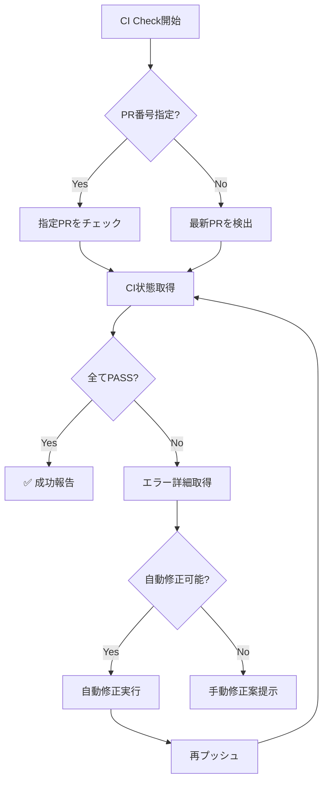

# CI Check コマンド

Issue実装後にCIが通っていることを確認するコマンド

## 使用例

```bash
# PR のCI状態を確認
claude "/ci/check PR番号"

# 最新のPRのCI状態を確認
claude "/ci/check"

# CI失敗時の詳細ログ表示
claude "/ci/check --detailed"
```

## 実行内容

1. **CI状態の確認**
   - GitHub ActionsのワークフローステータスをチェックTrim
   - 全てのジョブが成功していることを確認

2. **失敗時の自動対応**
   - エラーログの詳細表示
   - 自動修正可能な問題の修復
   - 修正後の再プッシュ

3. **成功確認**
   - 全チェック項目の一覧表示
   - マージ可能状態の確認

## コマンドフロー



## 実装スクリプト

```bash
#!/bin/bash

# PR番号取得
if [ -z "$1" ]; then
  PR_NUMBER=$(gh pr list --author @me --limit 1 --json number --jq '.[0].number')
else
  PR_NUMBER=$1
fi

echo "🔍 Checking CI for PR #$PR_NUMBER..."

# CI状態チェック
gh pr checks $PR_NUMBER --watch --interval 10

# 詳細表示オプション
if [[ "$2" == "--detailed" ]]; then
  gh run list --branch $(git branch --show-current) --limit 5
fi
```

## 関連コマンド

- [`/pr/create`](../pr/create.md) - PR作成
- [`/test/run`](../test/run.md) - ローカルテスト実行
- [`/issue/implement`](../issue/implement.md) - Issue実装