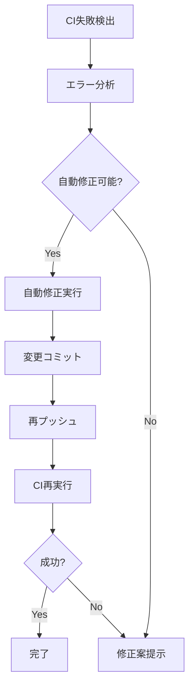

# CI Fix コマンド

CI失敗を自動修正するコマンド

## 使用例

```bash
# 最新のPRのCI失敗を修正
claude "/ci/fix"

# 特定のPRのCI失敗を修正
claude "/ci/fix 123"

# 詳細ログ付きで修正
claude "/ci/fix --verbose"
```

## 修正対象

### 自動修正可能な問題

1. **フォーマット違反**
   - Prettierによる自動フォーマット
   - インデント修正
   - 改行コード統一

2. **Lintエラー**
   - oxlint --fix で修正可能な問題
   - 未使用インポートの削除
   - 簡単な構文エラー

3. **型エラー（一部）**
   - 型インポートの修正
   - any型の適切な型への置換案提示

### 手動修正が必要な問題

1. **ロジックエラー**
   - テスト失敗
   - ビルドエラー（依存関係）

2. **セキュリティ問題**
   - 脆弱性のある依存関係
   - セキュリティポリシー違反

## 実行フロー



## 実装スクリプト

```bash
#!/bin/bash
set -euo pipefail

# PR番号取得
PR_NUMBER="${1:-$(gh pr list --author @me --limit 1 --json number --jq '.[0].number')}"

echo "🔧 PR #$PR_NUMBER のCI失敗を修正中..."

# 失敗したチェックを取得
FAILED_CHECKS=$(gh pr checks "$PR_NUMBER" --json name,conclusion \
    --jq '.[] | select(.conclusion == "FAILURE") | .name')

# 各失敗に対して修正を試みる
for CHECK in $FAILED_CHECKS; do
    case "$CHECK" in
        *"Lint"*|*"Format"*)
            echo "📝 フォーマット・Lint修正..."
            pnpm format
            pnpm lint:fix
            ;;
        *"TypeCheck"*)
            echo "🔍 型エラー分析..."
            pnpm typecheck 2>&1 | head -20
            echo "💡 手動修正が必要です"
            ;;
        *"Test"*)
            echo "🧪 テスト失敗分析..."
            pnpm test 2>&1 | grep -A5 "FAIL"
            ;;
    esac
done

# 修正があればコミット
if [ -n "$(git status --porcelain)" ]; then
    git add .
    git commit -m "fix: CI検証エラーの自動修正"
    git push
    echo "✅ 修正をプッシュしました"
else
    echo "ℹ️  自動修正できる問題はありませんでした"
fi
```

## 関連コマンド

- [`/ci/check`](check.md) - CI状態確認
- [`/test/run`](../test/run.md) - ローカルテスト実行
- [`/pr/create`](../pr/create.md) - PR作成
