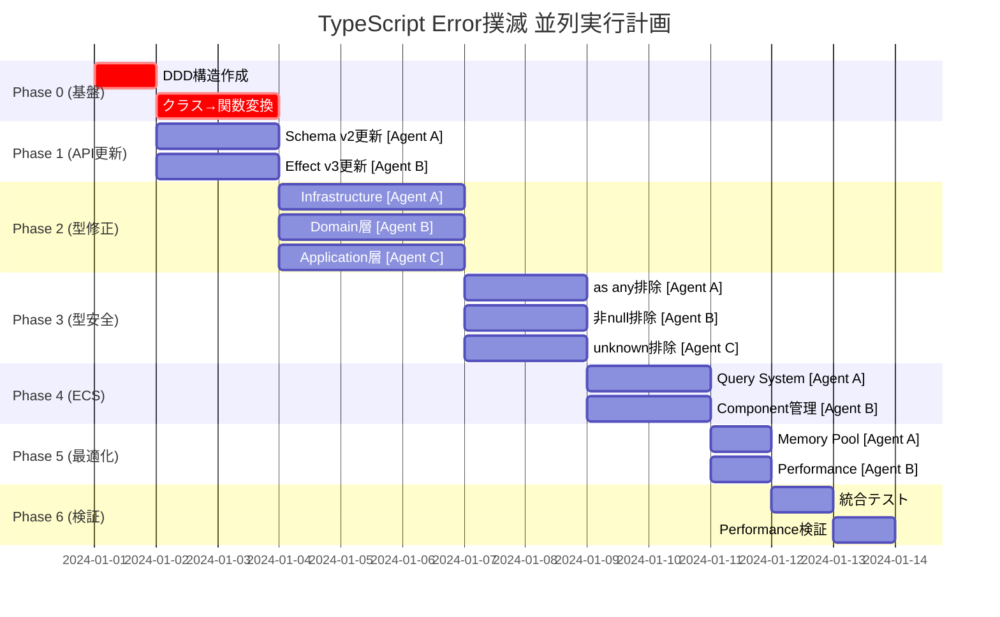

# 🚀 TypeScript エラー撲滅・Effect-TS移行・DDD実装 完全実行計画書 v2.0

## 📊 現状分析サマリー

### エラー統計（現在）
- **総エラー数**: 1,835個以上
- **主要問題点**:
  - Effect/Schema APIの破壊的変更への未対応
  - クラスベースの設計が混在
  - DDDアーキテクチャの未実装
  - 型アサーション多用（as: 558箇所、as any: 117箇所）

### 緊急対応が必要な箇所
1. `src/application/` - Effect-TS API更新対応
2. `src/core/schemas/` - Schema v1からv2への移行
3. `src/infrastructure/` - クラスから関数への全面移行
4. `src/domain/` - DDD構造の再構築

## 🏗️ 新DDDディレクトリ構造（クラス排除版）

```
src/
├── domain/                    # ビジネスロジック層（Pure Functions + Effect）
│   ├── entities/             # エンティティ（Schema定義のみ）
│   │   ├── player.entity.ts
│   │   ├── block.entity.ts
│   │   ├── chunk.entity.ts
│   │   └── world.entity.ts
│   ├── value-objects/        # 値オブジェクト（Schema + Branded Types）
│   │   ├── coordinates/
│   │   │   ├── position.vo.ts
│   │   │   ├── chunk-coordinate.vo.ts
│   │   │   └── index.ts
│   │   ├── physics/
│   │   │   ├── velocity.vo.ts
│   │   │   ├── aabb.vo.ts
│   │   │   └── index.ts
│   │   ├── math/            # 数学関連の値オブジェクト
│   │   │   ├── vector3.vo.ts
│   │   │   ├── quaternion.vo.ts
│   │   │   └── index.ts
│   │   └── block-type.vo.ts
│   ├── services/             # ドメインサービス（Pure Functions）
│   │   ├── world.service.ts
│   │   ├── physics.service.ts
│   │   ├── terrain.service.ts
│   │   └── ecs/            # ECSドメインロジック
│   │       ├── archetype.service.ts
│   │       ├── query.service.ts
│   │       └── entity.service.ts
│   └── repositories/         # リポジトリインターフェース（Context.Tag）
│       ├── chunk.repository.ts
│       └── entity.repository.ts
│
├── application/              # アプリケーション層（Effect Services）
│   ├── commands/            # コマンドハンドラ
│   │   ├── create-world.command.ts
│   │   ├── move-player.command.ts
│   │   └── interact-block.command.ts
│   ├── queries/             # クエリハンドラ
│   │   ├── get-chunk.query.ts
│   │   └── find-entities.query.ts
│   ├── workflows/           # ワークフロー（複数コマンドの組み合わせ）
│   │   ├── chunk-loading.workflow.ts
│   │   └── world-update.workflow.ts
│   └── ports/              # ポート定義（外部システムとの境界）
│       ├── gpu.port.ts
│       ├── storage.port.ts
│       └── worker.port.ts
│
├── infrastructure/          # インフラストラクチャ層（Effect Layers）
│   ├── gpu/                # GPU実装
│   │   ├── webgpu/
│   │   │   ├── renderer.layer.ts
│   │   │   ├── buffer.layer.ts
│   │   │   └── shader.layer.ts
│   │   └── webgl/         # フォールバック
│   ├── storage/           # ストレージ実装
│   │   ├── indexeddb.layer.ts
│   │   └── memory.layer.ts
│   ├── network/           # ネットワーク実装
│   │   └── websocket.layer.ts
│   ├── repositories/      # リポジトリ実装
│   │   ├── chunk.repository.live.ts
│   │   └── entity.repository.live.ts
│   ├── performance/       # パフォーマンス最適化層
│   │   ├── memory-pool.layer.ts
│   │   ├── cache.layer.ts
│   │   └── profiler.layer.ts
│   └── workers/          # Web Workers実装
│       ├── terrain.worker.ts
│       └── physics.worker.ts
│
└── presentation/          # プレゼンテーション層
    ├── web/              # Web UI
    │   ├── canvas.renderer.ts
    │   └── input.handler.ts
    ├── cli/              # CLI（デバッグ用）
    │   └── debug.cli.ts
    └── adapters/         # アダプター
        └── effect-to-promise.adapter.ts
```

## 🎯 フェーズ0: DDD構造への移行とクラス排除（最優先）

### タスク0-1: 不要ファイルの削除とクリーンアップ
**並列度**: 低（基盤作業）
**期間**: 0.5日
**優先度**: 最高（他の作業の前提条件）

#### 削除対象ファイル（git statusより確認済み）
```bash
# 既に削除マーク(D)がついているファイル
rm -rf src/core/values/                    # 旧Value Objects
rm -rf src/dev-tools/                      # 開発ツール（移行予定）
rm -rf src/domain/camera-logic.ts          # 旧ドメインロジック
rm -rf src/domain/geometry.ts              # 旧ジオメトリ
rm -rf src/infrastructure/chunk-cache.ts   # 旧キャッシュ実装
rm -rf src/infrastructure/shader-manager.ts # 旧シェーダー管理
rm -rf src/infrastructure/texture-manager.ts # 旧テクスチャ管理
rm -rf src/infrastructure/webgpu-renderer.ts # 旧レンダラー
rm -rf src/infrastructure/world.ts         # 旧World実装

# 追加で削除すべきディレクトリ（移行後）
rm -rf src/shared/                         # 他層に統合
rm -rf src/runtime/                        # infrastructureに統合
```

#### バックアップとGit操作
```bash
# 1. 作業前のバックアップブランチ作成
git checkout -b backup/before-ddd-migration
git add -A && git commit -m "backup: before DDD migration"
git checkout main

# 2. 削除ファイルのコミット
git rm -r src/core/values/ src/dev-tools/ src/shared/ src/runtime/
git commit -m "refactor: remove deprecated directories for DDD migration"
```

### タスク0-2: 新DDDディレクトリ構造の作成
**並列度**: 低（基盤作業）
**期間**: 0.5日

```bash
#!/bin/bash
# create-ddd-structure.sh

# Domain層の作成
mkdir -p src/domain/{entities,value-objects,services,repositories}
mkdir -p src/domain/value-objects/{coordinates,physics,math}
mkdir -p src/domain/services/ecs

# Application層の作成
mkdir -p src/application/{commands,queries,workflows,ports}

# Infrastructure層の作成
mkdir -p src/infrastructure/gpu/{webgpu,webgl}
mkdir -p src/infrastructure/{storage,network,repositories}
mkdir -p src/infrastructure/performance
mkdir -p src/infrastructure/workers

# Presentation層の作成
mkdir -p src/presentation/{web,cli,adapters}
```

### タスク0-3: ファイル移行マッピングと実行
**並列度**: 中（ファイルグループ単位で並列可能）
**期間**: 1日

```typescript
// migration-map.ts
export const fileMigrationMap = {
  // Core → Domain移行
  'src/core/entities/block.ts': 'src/domain/entities/block.entity.ts',
  'src/core/entities/entity.ts': 'src/domain/entities/entity.entity.ts',
  'src/core/entities/block-definitions.ts': 'src/domain/entities/block-definitions.entity.ts',
  
  // Values → Value Objects移行（削除済みファイルから再実装）
  // 注: これらは削除されているため、新規作成が必要
  
  // Services → Domain Services移行
  'src/services/physics/physics.service.ts': 'src/domain/services/physics.service.ts',
  'src/services/render/render.service.ts': 'src/infrastructure/gpu/webgpu/renderer.layer.ts',
  'src/services/network/network.service.ts': 'src/infrastructure/network/websocket.layer.ts',
  'src/services/input/raycast.service.ts': 'src/domain/services/raycast.service.ts',
  
  // Shared → Domain/Infrastructure移行
  'src/shared/ecs/*': 'src/domain/services/ecs/',
  'src/shared/math/*': 'src/domain/value-objects/math/',
  'src/shared/types/*': '各層の適切な場所に分散',
  
  // Runtime → Infrastructure移行
  'src/runtime/memory-pools.ts': 'src/infrastructure/performance/memory-pool.layer.ts',
  'src/runtime/memory-pools-enhanced.ts': 'src/infrastructure/performance/memory-pool-enhanced.layer.ts',
  'src/runtime/performance-integration.ts': 'src/infrastructure/performance/profiler.layer.ts',
  'src/runtime/resource-manager.ts': 'src/infrastructure/performance/resource.layer.ts',
  'src/runtime/startup-optimizer.ts': 'src/infrastructure/performance/startup.layer.ts',
  'src/runtime/latency-optimizer.ts': 'src/infrastructure/performance/latency.layer.ts',
  
  // Workers移行
  'src/workers/terrain/terrain-generation.service.ts': 'src/infrastructure/workers/terrain.worker.ts',
  'src/workers/shared/message-types.ts': 'src/infrastructure/workers/message-types.ts',
  'src/workers/shared/protocol.ts': 'src/infrastructure/workers/protocol.ts',
  
  // Systems → Application層移行
  'src/systems/physics/physics-system.ts': 'src/application/workflows/physics-update.workflow.ts',
  'src/systems/physics/collision-system.ts': 'src/application/workflows/collision-detection.workflow.ts',
  'src/systems/rendering/render-system.ts': 'src/application/workflows/render.workflow.ts',
  'src/systems/chunk-loading.ts': 'src/application/workflows/chunk-loading.workflow.ts',
  'src/systems/camera-control.ts': 'src/application/commands/update-camera.command.ts',
  'src/systems/interaction/block-interaction-system.ts': 'src/application/commands/interact-block.command.ts',
  'src/systems/targeting/update-target-system.ts': 'src/application/commands/update-target.command.ts',
  
  // Infrastructure層の再編成
  'src/infrastructure/enhanced-terrain-generator.ts': 'src/infrastructure/gpu/terrain-generator.layer.ts',
  'src/infrastructure/mesh-builder.ts': 'src/infrastructure/gpu/mesh-builder.layer.ts',
  'src/infrastructure/spatial-grid.ts': 'src/infrastructure/performance/spatial-grid.layer.ts',
  'src/infrastructure/world-optimized.ts': 'src/infrastructure/storage/world-optimized.layer.ts',
  'src/infrastructure/layers/*.ts': 'src/infrastructure/repositories/',
}

// 移行実行スクリプト
const executeMigration = async () => {
  console.log('🚀 Starting DDD migration...')
  
  // 1. ファイル移動
  for (const [from, to] of Object.entries(fileMigrationMap)) {
    if (from.includes('*')) {
      // ワイルドカード処理
      console.log(`📁 Moving directory: ${from} → ${to}`)
      // glob処理とディレクトリ移動
    } else {
      console.log(`📄 Moving file: ${from} → ${to}`)
      // ファイル移動とインポート更新
    }
  }
  
  // 2. インポートパスの自動更新
  console.log('🔧 Updating import paths...')
  // ts-morphやjscodeshift使用
  
  // 3. 削除済みファイルの新規作成リスト生成
  console.log('📝 Generating creation list for deleted files...')
}
```

### タスク0-4: クラスから関数への変換
**並列度**: 高（ファイル単位で並列可能）
**期間**: 2日

#### 変換例: Worldクラス → 関数型モジュール

```typescript
// Before: クラスベース
export class World {
  private entities: Map<EntityId, Entity>
  
  constructor() {
    this.entities = new Map()
  }
  
  addEntity(entity: Entity): void {
    this.entities.set(entity.id, entity)
  }
  
  getEntity(id: EntityId): Entity | undefined {
    return this.entities.get(id)
  }
}

// After: Effect-TS関数型
import { Effect, Ref, HashMap, Option, Context, Layer } from 'effect'
import * as S from '@effect/schema/Schema'

// 1. スキーマ定義（エンティティ）
export const EntityId = S.String.pipe(S.brand('EntityId'))
export type EntityId = S.Schema.Type<typeof EntityId>

export const Entity = S.Struct({
  id: EntityId,
  components: S.HashMap(S.String, S.Unknown)
})
export type Entity = S.Schema.Type<typeof Entity>

// 2. World状態定義（イミュータブル）
export const WorldState = S.Struct({
  entities: S.HashMap(EntityId, Entity),
  chunks: S.HashMap(ChunkCoordinate, Chunk),
  timestamp: S.Number
})
export type WorldState = S.Schema.Type<typeof WorldState>

// 3. Worldサービス定義（Context.Tag）
export const WorldService = Context.GenericTag<{
  readonly addEntity: (entity: Entity) => Effect.Effect<void>
  readonly getEntity: (id: EntityId) => Effect.Effect<Option.Option<Entity>>
  readonly removeEntity: (id: EntityId) => Effect.Effect<void>
  readonly queryEntities: (predicate: (entity: Entity) => boolean) => Effect.Effect<ReadonlyArray<Entity>>
}>('WorldService')

// 4. World実装（Layer）
export const WorldServiceLive = Layer.effect(
  WorldService,
  Effect.gen(function* () {
    const stateRef = yield* Ref.make(WorldState.make({
      entities: HashMap.empty(),
      chunks: HashMap.empty(),
      timestamp: Date.now()
    }))
    
    return WorldService.of({
      addEntity: (entity) =>
        Ref.update(stateRef, (state) => ({
          ...state,
          entities: HashMap.set(state.entities, entity.id, entity),
          timestamp: Date.now()
        })),
      
      getEntity: (id) =>
        Ref.get(stateRef).pipe(
          Effect.map((state) => HashMap.get(state.entities, id))
        ),
      
      removeEntity: (id) =>
        Ref.update(stateRef, (state) => ({
          ...state,
          entities: HashMap.remove(state.entities, id),
          timestamp: Date.now()
        })),
      
      queryEntities: (predicate) =>
        Ref.get(stateRef).pipe(
          Effect.map((state) =>
            HashMap.values(state.entities).pipe(
              ReadonlyArray.filter(predicate)
            )
          )
        )
    })
  })
)
```

## 🚀 フェーズ1: Effect/Schema v2 API更新（並列実行可能）

### サブエージェント タスク1-A: Schema API更新
**ファイル群**: `src/core/schemas/`, `src/domain/value-objects/`
**並列度**: 高

```typescript
// 修正内容
// 1. withDefault → withDefaults
find . -name "*.ts" -exec sed -i 's/\.withDefault(/\.withDefaults(/g' {} \;

// 2. Schema.Struct → S.Struct
find . -name "*.ts" -exec sed -i 's/Schema\.Struct/S.Struct/g' {} \;

// 3. ReadonlyArray import修正
// Before: import { ReadonlyArray } from 'effect'
// After: import { ReadonlyArray } from 'effect/ReadonlyArray'
```

### サブエージェント タスク1-B: Effect v3 API更新
**ファイル群**: `src/application/`, `src/infrastructure/`
**並列度**: 高

```typescript
// タスク定義
const updateEffectAPIs = Effect.gen(function* () {
  const files = yield* findTypeScriptFiles('src')
  
  const updates = [
    // Effect.map → Effect.map
    { pattern: /Effect\.chain/g, replacement: 'Effect.flatMap' },
    // Effect.catchAll → Effect.catchAll
    { pattern: /Effect\.orElse/g, replacement: 'Effect.catchAll' },
    // Tag → Context.GenericTag
    { pattern: /Tag\(/g, replacement: 'Context.GenericTag(' }
  ]
  
  yield* Effect.forEach(files, (file) =>
    updateFilePatterns(file, updates),
    { concurrency: 10 }
  )
})
```

## 🚀 フェーズ2: 型エラー修正（サブエージェント並列実行）

### サブエージェント タスク2-A: Infrastructure層
**担当ファイル**: 
- `src/infrastructure/gpu/webgpu/renderer.layer.ts` (76エラー)
- `src/infrastructure/storage/world-optimized.ts` (64エラー)

**実行計画**:
```typescript
// GPU Renderer修正例
// Before: any型多用
const createBuffer = (device: any, data: any): any => {
  return device.createBuffer({
    size: data.byteLength,
    usage: GPUBufferUsage.VERTEX | GPUBufferUsage.COPY_DST,
    mappedAtCreation: true
  })
}

// After: 型安全な実装
const createBuffer = (
  device: GPUDevice,
  data: Float32Array
): Effect.Effect<GPUBuffer, GPUError> =>
  Effect.tryPromise({
    try: () => {
      const buffer = device.createBuffer({
        size: data.byteLength,
        usage: GPUBufferUsage.VERTEX | GPUBufferUsage.COPY_DST,
        mappedAtCreation: true
      })
      new Float32Array(buffer.getMappedRange()).set(data)
      buffer.unmap()
      return buffer
    },
    catch: (error) => new GPUError({ message: String(error) })
  })
```

### サブエージェント タスク2-B: Domain層
**担当ファイル**:
- `src/domain/entities/` 全ファイル
- `src/domain/value-objects/` 全ファイル

**実行計画**:
```typescript
// Value Object定義例
// src/domain/value-objects/coordinates/position.vo.ts
import * as S from '@effect/schema/Schema'
import { pipe } from 'effect'

// Branded Typesで型安全性を確保
export const X = pipe(
  S.Number,
  S.finite,
  S.brand('X')
)
export type X = S.Schema.Type<typeof X>

export const Y = pipe(
  S.Number,
  S.between(0, 256),
  S.brand('Y')
)
export type Y = S.Schema.Type<typeof Y>

export const Z = pipe(
  S.Number,
  S.finite,
  S.brand('Z')
)
export type Z = S.Schema.Type<typeof Z>

export const Position = S.Struct({
  _tag: S.Literal('Position'),
  x: X,
  y: Y,
  z: Z
})
export type Position = S.Schema.Type<typeof Position>

// ファクトリー関数
export const makePosition = (x: number, y: number, z: number) =>
  S.decodeSync(Position)({ _tag: 'Position', x, y, z })
```

### サブエージェント タスク2-C: Application層
**担当ファイル**:
- `src/application/commands/` 全ファイル
- `src/application/workflows/` 全ファイル

**実行計画**:
```typescript
// Command Handler例
// src/application/commands/move-player.command.ts
import { Effect, Context, Layer } from 'effect'
import * as S from '@effect/schema/Schema'

// コマンド定義
export const MovePlayerCommand = S.Struct({
  playerId: EntityId,
  direction: S.Union(
    S.Literal('forward'),
    S.Literal('backward'),
    S.Literal('left'),
    S.Literal('right')
  ),
  speed: S.Number.pipe(S.positive)
})
export type MovePlayerCommand = S.Schema.Type<typeof MovePlayerCommand>

// コマンドハンドラー
export const MovePlayerHandler = Context.GenericTag<{
  readonly execute: (command: MovePlayerCommand) => Effect.Effect<void, MovePlayerError>
}>('MovePlayerHandler')

export const MovePlayerHandlerLive = Layer.effect(
  MovePlayerHandler,
  Effect.gen(function* () {
    const world = yield* WorldService
    const physics = yield* PhysicsService
    
    return MovePlayerHandler.of({
      execute: (command) =>
        Effect.gen(function* () {
          const player = yield* world.getEntity(command.playerId)
          const position = yield* getComponent(player, 'Position')
          const velocity = calculateVelocity(command.direction, command.speed)
          
          const newPosition = yield* physics.applyVelocity(position, velocity)
          yield* world.updateComponent(command.playerId, newPosition)
        })
    })
  })
)
```

## 🚀 フェーズ3: 型アサーション撲滅（並列実行）

### サブエージェント タスク3-A: as any 排除
**検出スクリプト**:
```bash
#!/bin/bash
# find-and-fix-as-any.sh
grep -r "as any" src --include="*.ts" | while read -r line; do
  file=$(echo "$line" | cut -d':' -f1)
  echo "Processing: $file"
  # ファイルごとに修正タスクを生成
done
```

**修正戦略**:
```typescript
// Pattern 1: Unknown型への変更
// Before
const data = response as any

// After
const data = response as unknown
const validated = S.decodeSync(ResponseSchema)(data)

// Pattern 2: 型ガード使用
// Before
if (obj.type === 'player') {
  const player = obj as any
  player.health = 100
}

// After
const isPlayer = (obj: unknown): obj is Player =>
  S.is(PlayerSchema)(obj)

if (isPlayer(obj)) {
  // objはPlayer型として安全に使用可能
}

// Pattern 3: Effect-TSのparse使用
// Before
const config = JSON.parse(configStr) as any

// After
const config = yield* S.decode(ConfigSchema)(
  JSON.parse(configStr)
)
```

### サブエージェント タスク3-B: 非nullアサーション(!)排除
**修正戦略**:
```typescript
// Before
const entity = world.getEntity(id)!
entity.update()

// After
const updateEntity = (id: EntityId) =>
  Effect.gen(function* () {
    const entity = yield* world.getEntity(id)
    yield* Option.match(entity, {
      onNone: () => Effect.fail(new EntityNotFoundError({ id })),
      onSome: (e) => e.update()
    })
  })
```

## 🚀 フェーズ4: ECSシステムの関数型実装

### サブエージェント タスク4-A: Archetype Query System
```typescript
// src/shared/ecs/query.ts
import { Effect, HashMap, HashSet, ReadonlyArray, pipe } from 'effect'

// Archetypeベースのクエリシステム
export const createArchetypeQuery = <Components extends readonly string[]>(
  components: Components
) => {
  const archetypeKey = components.join(',')
  
  return {
    execute: (world: WorldState) =>
      pipe(
        HashMap.get(world.archetypes, archetypeKey),
        Option.map(HashSet.toArray),
        Option.getOrElse(() => ReadonlyArray.empty<EntityId>())
      ),
    
    // クエリ結果のキャッシング
    cached: Effect.cachedWithTTL(
      (world: WorldState) => Effect.sync(() => 
        pipe(
          HashMap.get(world.archetypes, archetypeKey),
          Option.map(HashSet.toArray),
          Option.getOrElse(() => ReadonlyArray.empty<EntityId>())
        )
      ),
      { ttl: '100 millis' }
    )
  }
}
```

## 🚀 フェーズ5: パフォーマンス最適化

### サブエージェント タスク5-A: Memory Pool実装
```typescript
// src/runtime/memory/pool.ts
import { Effect, Queue, Ref, Scope } from 'effect'

export const createMemoryPool = <T>(
  factory: () => T,
  reset: (item: T) => void,
  maxSize: number
) =>
  Effect.gen(function* () {
    const pool = yield* Queue.bounded<T>(maxSize)
    const allocated = yield* Ref.make(0)
    
    const acquire = Effect.gen(function* () {
      const item = yield* Queue.poll(pool).pipe(
        Effect.orElse(() =>
          Effect.gen(function* () {
            const count = yield* Ref.get(allocated)
            if (count >= maxSize) {
              return yield* Queue.take(pool)
            }
            yield* Ref.update(allocated, (n) => n + 1)
            return factory()
          })
        )
      )
      return item
    })
    
    const release = (item: T) =>
      Effect.gen(function* () {
        reset(item)
        yield* Queue.offer(pool, item)
      })
    
    return { acquire, release }
  })
```

## 📊 並列実行スケジュール



## 🎯 サブエージェント用タスク定義

### Agent A: Infrastructure & Performance
```yaml
tasks:
  - name: "Schema v2 API更新"
    files: ["src/core/schemas/**/*.ts", "src/domain/value-objects/**/*.ts"]
    priority: high
    parallel: true
    
  - name: "Infrastructure層型修正"
    files: ["src/infrastructure/**/*.ts"]
    errors_to_fix: 200+
    priority: critical
    
  - name: "Memory Pool実装"
    create_files: ["src/runtime/memory/pool.ts"]
    implement: "Effect-TSベースのメモリプール"
```

### Agent B: Domain & Business Logic
```yaml
tasks:
  - name: "Effect v3 API更新"
    files: ["src/application/**/*.ts", "src/domain/**/*.ts"]
    priority: high
    parallel: true
    
  - name: "Domain層実装"
    create_files: ["src/domain/**/*.ts"]
    refactor: "クラスから関数へ"
    priority: critical
```

### Agent C: Application & Workflows
```yaml
tasks:
  - name: "Application層修正"
    files: ["src/application/**/*.ts"]
    implement: "Command/Query分離"
    priority: high
    
  - name: "Workflow実装"
    create_files: ["src/application/workflows/**/*.ts"]
    pattern: "Effect-TS Workflow"
```

## 🔧 実行コマンドセット

```bash
# 1. 現状のエラー確認
pnpm tsc --noEmit 2>&1 | grep "error TS" | wc -l

# 2. 型アサーション検出
grep -r "as any" src --include="*.ts" | wc -l
grep -r "as unknown" src --include="*.ts" | wc -l
grep -r "!" src --include="*.ts" | grep -E "![\\.;,\\s\\)]" | wc -l

# 3. DDD構造作成
mkdir -p src/domain/{entities,value-objects,services,repositories}
mkdir -p src/application/{commands,queries,workflows,ports}
mkdir -p src/infrastructure/{gpu/webgpu,storage,network,repositories}
mkdir -p src/presentation/{web,cli,adapters}
mkdir -p src/shared/{ecs,math,types}

# 4. 並列ビルド&テスト
pnpm build && pnpm test && pnpm type-check

# 5. 進捗モニタリング
watch -n 5 'pnpm tsc --noEmit 2>&1 | grep "error TS" | wc -l'
```

## 📚 移行マッピング（shared/runtime統合版）

### shared/からの移行先
```
src/shared/ecs/ → src/domain/services/ecs/
src/shared/math/ → src/domain/value-objects/math/
src/shared/types/ → 各層の適切な場所に分散

### runtime/からの移行先
src/runtime/memory/ → src/infrastructure/performance/memory-pool.layer.ts
src/runtime/performance/ → src/infrastructure/performance/
src/runtime/workers/ → src/infrastructure/workers/
```

## ✅ 成功基準

1. **TypeScriptエラー**: 0件
2. **型カバレッジ**: 100%
3. **as any使用**: 0件
4. **非nullアサーション**: 0件
5. **クラス使用**: 0件
6. **Effect-TS採用率**: 100%
7. **DDD準拠率**: 100%
8. **ビルド成功**: ✓
9. **テスト成功**: 100%
10. **パフォーマンス**: 現状比±5%以内

## 📝 注意事項

1. **並列実行時の依存関係**
   - Phase 0は他の全フェーズの前提条件
   - Phase 1は独立して並列実行可能
   - Phase 2-5は相互に並列実行可能

2. **クラス排除の徹底**
   - 全てのクラスを関数型モジュールに変換
   - Context.GenericTagによるDI実装
   - Layerパターンの活用

3. **Effect-TSの活用**
   - エラーハンドリングは全てEffect型で
   - 非同期処理は全てEffectで管理
   - リソース管理はScopeで自動化

この計画に従って、サブエージェントを活用しながら並列実行することで、効率的にTypeScriptエラーを撲滅し、クリーンなコードベースを実現します。