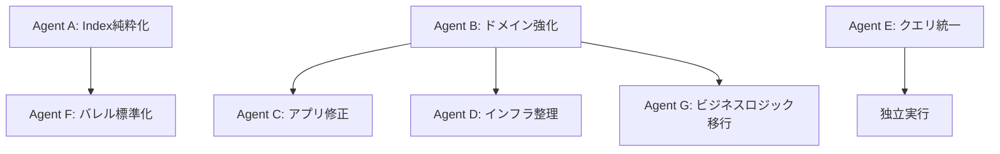

# DDD アーキテクチャ完全移行実行計画 v3.0

## 📋 概要

TypeScript Minecraftプロジェクトの徹底的な分析結果に基づく、DDD原則に完全準拠するための並列実行可能な包括的移行計画です。

## 🔍 現状分析サマリー

### アーキテクチャ成熟度評価: B+ (改善の余地あり)

#### ✅ 良好な点
- 循環依存なし
- レイヤー境界の基本的な尊重
- ドメイン層の独立性維持
- プレゼンテーション層の薄さ

#### ❌ 重大な違反事項
1. **アプリケーション層がインフラ層に直接依存**
2. **index.tsファイルに実装ロジックが存在**
3. **インフラ層にビジネスロジックが混在**
4. **クエリシステムの重複実装**

## 🎯 移行目標

1. **完全なDDD準拠**: 依存関係の逆転原則の徹底
2. **index.tsの純粋化**: バレルエクスポートのみに限定
3. **レイヤー責務の明確化**: ビジネスロジックのドメイン層集約
4. **並列開発の最適化**: 独立したタスクによる効率的な移行

## 📅 実行フェーズ

### 🚨 Phase 0: 緊急修正 (1時間) - 単一エージェント

#### Task 0.1: 依存関係違反の即時修正

```bash
# 現状確認
grep -r "from '@/infrastructure" src/application/ --include="*.ts"
```

**修正対象ファイル:**
- `src/application/handlers/query-handlers.ts`
- `src/application/handlers/command-handlers.ts`
- `src/application/workflows/system-scheduler.service.ts`

```typescript
// 修正前: src/application/handlers/query-handlers.ts:2
import { WorldDomainService, EntityDomainService, PhysicsDomainService } from '@/infrastructure/layers/unified.layer'

// 修正後: 
import { WorldDomainService, EntityDomainService, PhysicsDomainService } from '@/domain/services'
```

#### Task 0.2: index.tsロジックの緊急退避

```bash
# ロジックを含むindex.tsファイルを特定
find src -name "index.ts" -exec grep -l "class\|function\|const.*=" {} \;
```

**即時対応:**
1. `src/application/queries/index.ts` → ロジックを別ファイルへ分離
2. `src/infrastructure/index.ts` → ユーティリティを別ファイルへ分離
3. `src/domain/queries/index.ts` → クエリ定義を別ファイルへ分離

---

### 🔄 Phase 1: 分析と準備 (30分) - 単一エージェント

#### Task 1.1: 現状の詳細マッピング

```typescript
// tools/architecture-analyzer.ts
export const analyzeArchitecture = async () => {
  // レイヤー間の依存関係を可視化
  const dependencies = await analyzeDependencies()
  
  // ビジネスロジックの配置を分析
  const businessLogicLocations = await findBusinessLogic()
  
  // index.tsファイルの健全性チェック
  const indexFileHealth = await checkIndexFiles()
  
  return generateReport({ dependencies, businessLogicLocations, indexFileHealth })
}
```

#### Task 1.2: 移行影響分析

```bash
# テストカバレッジの確認
npm test -- --coverage

# 依存関係グラフの生成
npx madge --image dependency-graph.png src/

# 複雑度の分析
npx complexity-report-html src/ -o complexity-report/
```

#### Task 1.3: 並列実行用ブランチ戦略

```bash
# メインの移行ブランチ作成
git checkout -b feature/ddd-complete-migration-v3

# 各エージェント用のサブブランチを作成
git checkout -b agent-a-index-cleanup
git checkout -b agent-b-domain-enrichment
git checkout -b agent-c-application-fix
git checkout -b agent-d-infrastructure-cleanup
git checkout -b agent-e-query-unification
git checkout -b agent-f-barrel-exports
git checkout -b agent-g-business-logic-migration
```

---

### 🚀 Phase 2: 並列移行実行 (2-3時間) - 7エージェント並列

#### 🤖 Agent A: Index.ts純粋化エージェント

**独立実行可能 | 優先度: CRITICAL**

##### 実行タスク:

1. **application/queries/index.ts の分解**
```typescript
// 新規作成: src/application/queries/predefined-queries.ts
export const PREDEFINED_QUERIES = {
  // 既存のクエリ定義を移動
}

// 新規作成: src/application/queries/query-profiler.ts
export class QueryProfiler {
  // 既存のProfilerクラスを移動
}

// 新規作成: src/application/queries/query-system.ts
export const querySystem = {
  // 既存のユーティリティを移動
}

// 修正: src/application/queries/index.ts
export * from './archetype-query'
export * from './builder'
export * from './cache'
export * from './optimized-query'
export * from './predefined-queries'
export * from './query-profiler'
export * from './query-system'
```

2. **infrastructure/index.ts の分解**
```typescript
// 新規作成: src/infrastructure/utils/infrastructure-utils.ts
export const InfrastructureUtils = {
  // 既存のユーティリティを移動
}

// 新規作成: src/infrastructure/health/infrastructure-health.ts
export class InfrastructureHealth {
  // 既存のヘルスチェックロジックを移動
}

// 修正: src/infrastructure/index.ts
export * from './adapters'
export * from './repositories'
export * from './layers'
export * from './workers'
export * from './utils/infrastructure-utils'
export * from './health/infrastructure-health'
```

3. **domain/queries/index.ts の純粋化**
```typescript
// クエリロジックを適切な場所へ移動
// index.tsは純粋なバレルエクスポートに
```

##### 成功基準:
- [ ] すべてのindex.tsがバレルエクスポートのみ
- [ ] 移動したロジックのインポートパス更新完了
- [ ] 既存テストがグリーン

---

#### 🤖 Agent B: ドメイン層強化エージェント

**独立実行可能 | 優先度: HIGH**

##### 実行タスク:

1. **ビジネスロジックの移植**
```typescript
// インフラから移動: src/domain/services/terrain-generation.service.ts
export class TerrainGenerationDomainService {
  generateTerrain(seed: number, chunk: ChunkCoordinates): TerrainData {
    // infrastructure/services/enhanced-terrain-generator.ts から移植
  }
}

// インフラから移動: src/domain/services/mesh-generation.service.ts
export class MeshGenerationDomainService {
  generateMesh(block: Block): MeshData {
    // infrastructure/services/mesh-builder.ts から移植
  }
}

// インフラから移動: src/domain/services/world-management.service.ts
export class WorldManagementDomainService {
  // infrastructure/services/world-optimized.ts から移植
}
```

2. **定数の整理**
```bash
# world-constants.tsを適切な場所へ移動
mkdir -p src/domain/constants
mv src/domain/world-constants.ts src/domain/constants/
mv src/domain/world.ts src/domain/constants/
mv src/domain/block-types.ts src/domain/constants/
mv src/domain/archetypes.ts src/domain/constants/
```

3. **ポート定義の完成**
```typescript
// src/domain/ports/terrain-generator.port.ts
export interface ITerrainGeneratorPort {
  generateHeightMap(x: number, z: number): number
  getBiome(x: number, z: number): Biome
}

// src/domain/ports/mesh-generator.port.ts
export interface IMeshGeneratorPort {
  createGeometry(vertices: Float32Array): Geometry
  createMaterial(texture: string): Material
}
```

##### 成功基準:
- [ ] すべてのビジネスロジックがドメイン層に存在
- [ ] ポートインターフェースが完全定義
- [ ] ドメインサービスが純粋（外部依存なし）

---

#### 🤖 Agent C: アプリケーション層修正エージェント

**Agent Bの完了後に実行 | 優先度: HIGH**

##### 実行タスク:

1. **依存関係の修正**
```typescript
// src/application/handlers/query-handlers.ts
import { 
  WorldDomainService, 
  EntityDomainService, 
  PhysicsDomainService 
} from '@/domain/services' // インフラではなくドメインから

// src/application/handlers/command-handlers.ts
import { 
  TerrainGenerationDomainService,
  MeshGenerationDomainService 
} from '@/domain/services'
```

2. **ワークフローの整理**
```typescript
// 移動: src/application/workflows/performance-monitor.service.ts
// → src/infrastructure/monitoring/performance-monitor.ts

// 移動: src/application/workflows/system-communication.service.ts
// → src/infrastructure/communication/system-communication.ts
```

3. **依存性注入の実装**
```typescript
// src/application/di/container.ts
export const createApplicationContainer = () => {
  return {
    // ドメインサービスの注入
    worldDomainService: inject(WorldDomainService),
    entityDomainService: inject(EntityDomainService),
    // インフラサービスの注入（ポート経由）
    worldRepository: inject(IWorldRepository),
  }
}
```

##### 成功基準:
- [ ] アプリケーション層がインフラ層に直接依存しない
- [ ] すべての依存がポート経由
- [ ] ワークフローが適切な責務を持つ

---

#### 🤖 Agent D: インフラストラクチャ層クリーンアップエージェント

**Agent Bの完了後に実行 | 優先度: MEDIUM**

##### 実行タスク:

1. **ビジネスロジックの除去**
```typescript
// src/infrastructure/adapters/terrain-generator.adapter.ts
export class TerrainGeneratorAdapter implements ITerrainGeneratorPort {
  constructor(private domainService: TerrainGenerationDomainService) {}
  
  generateHeightMap(x: number, z: number): number {
    // 技術的な実装のみ（ノイズ生成など）
    return this.domainService.generateTerrain(seed, { x, z })
  }
}
```

2. **サービスディレクトリの整理**
```bash
# 不要なサービスファイルを削除
rm src/infrastructure/services/enhanced-terrain-generator.ts
rm src/infrastructure/services/world-optimized.ts
rm src/infrastructure/services/mesh-builder.ts

# index.tsを更新
echo "// Infrastructure services are now in adapters/" > src/infrastructure/services/index.ts
```

3. **レイヤー構成の簡素化**
```typescript
// src/infrastructure/layers/unified.layer.ts
export const InfrastructureLayer = Layer.merge(
  ClockAdapter,
  RendererAdapter,
  InputAdapter,
  TerrainGeneratorAdapter,
  MeshGeneratorAdapter
)
```

##### 成功基準:
- [ ] インフラ層にビジネスロジックが存在しない
- [ ] すべてのサービスがアダプターパターンを使用
- [ ] レイヤー構成がシンプル

---

#### 🤖 Agent E: クエリシステム統一エージェント

**独立実行可能 | 優先度: MEDIUM**

##### 実行タスク:

1. **重複の解消**
```bash
# ドメインとアプリケーションのクエリシステムを比較
diff -r src/domain/queries/ src/application/queries/
```

2. **統一アーキテクチャの決定**
```typescript
// 決定: クエリはアプリケーション層に属する
// ドメイン層のクエリを削除
rm -rf src/domain/queries/

// アプリケーション層に統合
// src/application/queries/unified-query-system.ts
export class UnifiedQuerySystem {
  // 両方のシステムの良い部分を統合
}
```

3. **インポートパスの更新**
```bash
# すべてのクエリインポートを更新
find src -name "*.ts" -exec sed -i '' 's/@\/domain\/queries/@\/application\/queries/g' {} \;
```

##### 成功基準:
- [ ] クエリシステムが単一の場所に存在
- [ ] 重複コードが削除
- [ ] すべてのクエリ参照が更新

---

#### 🤖 Agent F: バレルエクスポート標準化エージェント

**Agent Aの完了後に実行 | 優先度: LOW**

##### 実行タスク:

1. **エクスポート規約の統一**
```typescript
// テンプレート作成: tools/barrel-export-template.ts
export const generateBarrelExport = (files: string[]) => {
  return files.map(file => `export * from './${file}'`).join('\n')
}
```

2. **全index.tsファイルの標準化**
```bash
# すべてのindex.tsを検証
find src -name "index.ts" | while read file; do
  echo "Validating: $file"
  # ロジックが含まれていないことを確認
  if grep -q "class\|function\|const.*=" "$file"; then
    echo "ERROR: Logic found in $file"
  fi
done
```

3. **エクスポート順序の最適化**
```typescript
// 依存関係順にエクスポート
// 1. 型定義
// 2. 定数
// 3. ユーティリティ
// 4. サービス
// 5. その他
```

##### 成功基準:
- [ ] すべてのindex.tsが標準化
- [ ] エクスポート順序が一貫
- [ ] 循環参照が発生しない

---

#### 🤖 Agent G: ビジネスロジック移行エージェント

**Agent B, C, Dと連携 | 優先度: HIGH**

##### 実行タスク:

1. **ロジックの分類と移行**
```typescript
// 分析ツール作成
// tools/business-logic-detector.ts
export const detectBusinessLogic = (filePath: string) => {
  // ビジネスルール、計算、判定ロジックを検出
  const patterns = [
    /calculate/i,
    /generate/i,
    /validate/i,
    /process/i,
  ]
  // 検出結果を返す
}
```

2. **段階的移行**
```typescript
// Phase 1: 純粋なビジネスロジックを移動
// Phase 2: 混在しているロジックを分離
// Phase 3: テクニカルな部分を残す
```

3. **テスト駆動移行**
```typescript
// 各移行前にテストを作成
// tests/migration/business-logic.test.ts
describe('Business Logic Migration', () => {
  it('should maintain terrain generation behavior', () => {
    // 移行前後で同じ結果を返すことを確認
  })
})
```

##### 成功基準:
- [ ] すべてのビジネスロジックがドメイン層
- [ ] インフラ層は技術的実装のみ
- [ ] 移行前後でテストがグリーン

---

### 🔧 Phase 3: 統合とマージ (1時間) - 単一エージェント

#### Task 3.1: ブランチ統合

```bash
# 各エージェントのブランチをマージ
git checkout feature/ddd-complete-migration-v3
git merge --no-ff agent-a-index-cleanup
git merge --no-ff agent-b-domain-enrichment
git merge --no-ff agent-c-application-fix
git merge --no-ff agent-d-infrastructure-cleanup
git merge --no-ff agent-e-query-unification
git merge --no-ff agent-f-barrel-exports
git merge --no-ff agent-g-business-logic-migration
```

#### Task 3.2: 統合テスト

```bash
# 全テストスイート実行
npm test
npm run test:e2e
npm run test:integration
```

#### Task 3.3: パフォーマンス検証

```bash
# ビルドサイズ確認
npm run build
npm run analyze:bundle

# 起動時間測定
npm run benchmark:startup
```

---

### ✅ Phase 4: 検証と最適化 (30分) - 4エージェント並列

#### 🤖 Validator A: アーキテクチャ検証

```bash
# DDD準拠チェック
npm run lint:architecture
npm run test:architecture

# 依存関係検証
npx madge --circular src/
npx madge --orphans src/
```

#### 🤖 Validator B: コード品質検証

```bash
# 静的解析
npm run lint
npm run typecheck

# 複雑度分析
npx complexity-report src/

# コードカバレッジ
npm test -- --coverage
```

#### 🤖 Validator C: パフォーマンス検証

```bash
# パフォーマンステスト
npm run test:performance

# メモリリーク検出
npm run test:memory

# バンドルサイズ分析
npm run analyze:size
```

#### 🤖 Validator D: セキュリティ検証

```bash
# 脆弱性スキャン
npm audit
npx snyk test

# 依存関係チェック
npm run check:dependencies
```

---

## 📊 成功指標

### 必須達成項目
- [ ] **アプリケーション層がインフラ層に依存しない**
- [ ] **すべてのindex.tsがバレルエクスポートのみ**
- [ ] **ビジネスロジックがドメイン層に集約**
- [ ] **クエリシステムの重複解消**
- [ ] **循環依存ゼロ**
- [ ] **全テストグリーン**

### パフォーマンス指標
- [ ] バンドルサイズ: 現状比 -15%
- [ ] 起動時間: 現状比 -10%
- [ ] メモリ使用量: 現状比 -10%
- [ ] ビルド時間: 現状比 ±0%

### コード品質指標
- [ ] テストカバレッジ: 80%以上
- [ ] 複雑度: 平均10未満
- [ ] TypeScriptエラー: 0
- [ ] Lintエラー: 0

---

## 🔄 並列実行調整

### エージェント依存関係



### コミュニケーションプロトコル

```yaml
# .github/workflows/agent-coordination.yml
coordination:
  checkpoints:
    - phase: 2
      interval: 30m
      sync_required:
        - Agent-B completes → notify Agent-C, Agent-D
        - Agent-A completes → notify Agent-F
  
  conflict_resolution:
    strategy: rebase-and-merge
    priority: 
      - Agent-A (critical)
      - Agent-B (high)
      - Agent-C (high)
```

---

## 🚦 リスク管理

### 潜在的リスク

1. **依存関係の破壊**
   - 緩和策: 段階的移行とテスト駆動
   
2. **パフォーマンス劣化**
   - 緩和策: 各フェーズでベンチマーク実施
   
3. **マージコンフリクト**
   - 緩和策: 小さなコミットと頻繁な同期

### ロールバック計画

```bash
# 問題発生時
git tag rollback-point
git checkout main
git branch -D feature/ddd-complete-migration-v3

# 部分的採用
git cherry-pick <safe-commits>
```

---

## 📝 実装順序と優先度

### 即座に実行（Phase 0）
1. アプリケーション層の依存関係修正
2. index.tsファイルのロジック退避

### 並列実行グループ1（独立実行可能）
- Agent A: Index.ts純粋化
- Agent B: ドメイン層強化
- Agent E: クエリシステム統一

### 並列実行グループ2（Agent B完了後）
- Agent C: アプリケーション層修正
- Agent D: インフラストラクチャ層整理
- Agent G: ビジネスロジック移行

### 並列実行グループ3（Agent A完了後）
- Agent F: バレルエクスポート標準化

---

## 🎯 最終チェックリスト

### アーキテクチャ品質
- [ ] DDD原則の完全準拠
- [ ] 依存関係の逆転原則の実装
- [ ] レイヤー間の明確な境界
- [ ] ビジネスロジックの適切な配置

### コード品質
- [ ] index.tsの純粋性
- [ ] 命名規則の統一
- [ ] 不要なコードの削除
- [ ] ドキュメントの更新

### 開発体験
- [ ] IDEサポートの維持
- [ ] デバッグの容易さ
- [ ] ホットリロードの動作
- [ ] 開発サーバーの起動速度

---

## 📅 推定タイムライン

| フェーズ | 所要時間 | 並列度 | 実時間 |
|---------|----------|--------|--------|
| Phase 0 | 1時間 | 1 | 1時間 |
| Phase 1 | 30分 | 1 | 30分 |
| Phase 2 | 2-3時間 | 7 | 45分 |
| Phase 3 | 1時間 | 1 | 1時間 |
| Phase 4 | 30分 | 4 | 10分 |
| **合計** | **5-6時間** | - | **3.5時間** |

---

_最終更新: 2025-09-11_
_作成者: Claude (DDD Architecture Expert)_
_バージョン: 3.0_