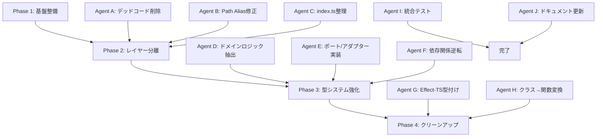

# DDD Architecture Migration Plan v3 - TypeScript Minecraft

## 概要

本計画書は、TypeScript Minecraftプロジェクトの完全なDDD準拠アーキテクチャへの移行計画です。
並列実行可能なタスクに分割し、Effect-TSの型システムを全面的に採用します。

## 現状の問題点

### 1. アーキテクチャ違反
- インフラストラクチャ層にドメインロジックが混在（terrain-generator、mesh-builder等）
- ドメイン層が外部ライブラリ（Three.js）に直接依存
- プレゼンテーション層がインフラストラクチャを直接参照

### 2. コード品質
- 126個以上のクラスベース実装が関数型パラダイムと混在
- ~~100箇所以上でpath aliasが未使用（相対パス使用）~~ ✅ 全レイヤーで修正完了
- ~~3つの異なるクエリシステムが重複して存在~~ ✅ レガシークエリシステムを削除済み
- ~~579行以上のデッドコード（deprecated worker-pool等）~~ ✅ 1,000行以上削除済み

### 3. 型安全性
- Effect-TSの型システムが部分的にしか適用されていない
- エラーハンドリングが統一されていない
- 多くのany型やasアサーションの使用

## 移行戦略

### フェーズ分割による並列実行



## Phase 1: 基盤整備（並列実行可能）

### Agent A: デッドコード削除
**目的**: 未使用コードとレガシーシステムの削除

**タスク**:
```bash
# 削除対象ファイル
rm src/domain/queries/legacy-query-compatibility.ts
rm src/domain/queries/legacy-query-system.ts
rm src/application/queries/legacy-compatibility.ts
rm src/infrastructure/performance/worker-pool.layer.ts
rm tests/dummy.test.ts
```

**変更内容**:
1. レガシークエリシステムの完全削除
2. deprecated worker-poolシステムの削除
3. 使用されていないテストファイルの削除
4. 削除に伴うimport文の修正

### Agent B: Path Alias修正
**目的**: 全ファイルでpath aliasを使用

**検索パターン**:
```typescript
// 修正前
import { Something } from '../../../domain/services'
import { Entity } from '/entities'

// 修正後
import { Something } from '@domain/services'
import { Entity } from '@domain/entities'
```

**自動修正スクリプト**:
```typescript
// fix-imports.ts
import { Effect, pipe } from 'effect'
import * as fs from 'fs'
import * as path from 'path'

const fixImports = (content: string): string => {
  return content
    // 相対パスを絶対パスに変換
    .replace(/from ['"]\.\.\/\.\.\/domain\//g, "from '@domain/")
    .replace(/from ['"]\.\.\/\.\.\/application\//g, "from '@application/")
    .replace(/from ['"]\.\.\/\.\.\/infrastructure\//g, "from '@infrastructure/")
    .replace(/from ['"]\.\.\/\.\.\/presentation\//g, "from '@presentation/")
    .replace(/from ['"]\.\.\/\.\.\/shared\//g, "from '@shared/")
    .replace(/from ['"]\.\.\/shared\//g, "from '@shared/")
    // ルートパスを修正
    .replace(/from ['"]\/entities/g, "from '@domain/entities")
    .replace(/from ['"]\/services/g, "from '@domain/services")
    .replace(/from ['"]\/queries/g, "from '@domain/queries")
}
```

### Agent C: index.ts バレルエクスポート整理
**目的**: 全てのindex.tsファイルを純粋なバレルエクスポートに統一

**チェックリスト**:
- [ ] src/application/index.ts - 存在しないファイルの参照を削除
- [ ] src/domain/index.ts - レガシー互換性コードを削除
- [ ] src/infrastructure/index.ts - 整理済み確認
- [ ] src/presentation/index.ts - 整理済み確認
- [ ] 各サブディレクトリのindex.ts確認

## Phase 2: レイヤー分離（並列実行可能）

### Agent D: ドメインロジック抽出
**目的**: インフラストラクチャ層からドメインロジックを抽出

**移動対象**:

1. **Block定義の移動**:
```typescript
// src/domain/constants/block-properties.ts (新規作成)
export const BLOCK_PROPERTIES = {
  colors: {
    grass: [0.4, 0.8, 0.2] as const,
    dirt: [0.6, 0.4, 0.2] as const,
    stone: [0.5, 0.5, 0.5] as const,
    // ... 他のブロックタイプ
  },
  opacity: {
    grass: false,
    water: true,
    glass: true,
    // ... 他のブロックタイプ
  },
  textures: {
    grass: { top: 'grass_top', sides: 'grass_side', bottom: 'dirt' },
    // ... 他のブロックタイプ
  }
} as const
```

2. **Terrain Generation Logic**:
```typescript
// src/domain/services/terrain-generation.service.ts (リファクタリング)
import { Effect, pipe } from 'effect'
import type { ChunkCoordinate } from '@domain/value-objects'

export const generateTerrain = (
  coordinate: ChunkCoordinate,
  seed: number
): Effect.Effect<TerrainData, TerrainGenerationError> =>
  pipe(
    Effect.succeed(coordinate),
    Effect.map(generateHeightMap),
    Effect.flatMap(placeBedrock),
    Effect.flatMap(placeStone),
    Effect.flatMap(placeDirtLayer),
    Effect.flatMap(placeGrassLayer),
    Effect.flatMap(generateOres),
    Effect.flatMap(applyBiomeModifications)
  )
```

### Agent E: ポート/アダプター実装
**目的**: 依存関係逆転の原則を適用

**新規ポート定義**:

1. **Vector Port**:
```typescript
// src/domain/ports/math.port.ts
export interface Vector3Port {
  readonly x: number
  readonly y: number
  readonly z: number
}

export interface QuaternionPort {
  readonly x: number
  readonly y: number
  readonly z: number
  readonly w: number
}

export interface RayPort {
  readonly origin: Vector3Port
  readonly direction: Vector3Port
}
```

2. **Render Port改善**:
```typescript
// src/domain/ports/render.port.ts
import { Effect } from 'effect'

export interface RenderPort {
  createMesh: (
    geometry: GeometryData,
    material: MaterialData
  ) => Effect.Effect<MeshId, RenderError>
  
  updateMesh: (
    id: MeshId,
    updates: MeshUpdates
  ) => Effect.Effect<void, RenderError>
  
  removeMesh: (
    id: MeshId
  ) => Effect.Effect<void, RenderError>
}
```

### Agent F: 依存関係逆転
**目的**: ドメイン層の外部依存を削除

**Three.js依存の削除**:
```typescript
// src/domain/services/targeting.service.ts
// 修正前
import * as THREE from 'three'

// 修正後
import type { Vector3Port, RayPort } from '@domain/ports'

export const createRay = (
  origin: Vector3Port,
  direction: Vector3Port
): RayPort => ({
  origin,
  direction
})
```

## Phase 3: 型システム強化（並列実行可能）

### Agent G: Effect-TS型付け強化
**目的**: 全サービスをEffect-TSで型安全に

**変換パターン**:

1. **サービス変換**:
```typescript
// 修正前
export class WorldService {
  async loadChunk(coord: ChunkCoordinate): Promise<Chunk> {
    // ...
  }
}

// 修正後
import { Effect, Context } from 'effect'

export interface WorldService {
  readonly loadChunk: (
    coord: ChunkCoordinate
  ) => Effect.Effect<Chunk, ChunkError>
}

export const WorldService = Context.GenericTag<WorldService>('WorldService')

export const worldServiceLive = Effect.gen(function* () {
  const chunkRepository = yield* ChunkRepository
  
  return WorldService.of({
    loadChunk: (coord) =>
      pipe(
        chunkRepository.find(coord),
        Effect.catchTag('ChunkNotFound', () =>
          generateNewChunk(coord)
        )
      )
  })
})
```

2. **エラーハンドリング統一**:
```typescript
// src/domain/errors/unified-errors.ts
import { Data } from 'effect'

export class ChunkError extends Data.TaggedError('ChunkError')<{
  readonly coordinate: ChunkCoordinate
  readonly reason: string
}> {}

export class EntityError extends Data.TaggedError('EntityError')<{
  readonly entityId: EntityId
  readonly operation: string
  readonly reason: string
}> {}
```

### Agent H: クラス→関数変換
**目的**: 全クラスを関数型に変換

**変換対象リスト**:
1. Application Layer (25クラス)
   - OptimizedQuery → createOptimizedQuery関数
   - QueryCache → createQueryCache関数
   - UnifiedQuerySystem → querySystemService

2. Domain Layer (45クラス)
   - 各DomainService → Effect.Context.Tag
   - Entity classes → データ型 + 操作関数

3. Infrastructure Layer (56クラス)
   - Adapter classes → アダプター関数
   - Repository classes → Effect.Layer

**変換例**:
```typescript
// 修正前
export class ChunkRepository {
  private cache: Map<string, Chunk>
  
  constructor() {
    this.cache = new Map()
  }
  
  async find(coord: ChunkCoordinate): Promise<Chunk | null> {
    return this.cache.get(coord.toString()) || null
  }
}

// 修正後
export interface ChunkRepository {
  readonly find: (
    coord: ChunkCoordinate
  ) => Effect.Effect<Option.Option<Chunk>, never>
  
  readonly save: (
    chunk: Chunk
  ) => Effect.Effect<void, ChunkSaveError>
}

export const ChunkRepository = Context.GenericTag<ChunkRepository>('ChunkRepository')

export const chunkRepositoryLive = Layer.effect(
  ChunkRepository,
  Effect.gen(function* () {
    const cache = yield* Ref.make(new Map<string, Chunk>())
    
    return ChunkRepository.of({
      find: (coord) =>
        pipe(
          Ref.get(cache),
          Effect.map(cache => Option.fromNullable(cache.get(coord.toString())))
        ),
      
      save: (chunk) =>
        Ref.update(cache, map => 
          new Map(map).set(chunk.coordinate.toString(), chunk)
        )
    })
  })
)
```

## Phase 4: クリーンアップ

### Agent I: 統合テスト実装
**目的**: 移行後の動作確認

**テストスイート**:
```typescript
// tests/integration/ddd-migration.test.ts
import { Effect, Layer, TestClock } from 'effect'
import { describe, it, expect } from 'vitest'

describe('DDD Migration Validation', () => {
  it('should maintain layer boundaries', async () => {
    // レイヤー境界のテスト
  })
  
  it('should use Effect-TS throughout', async () => {
    // Effect-TS使用の検証
  })
  
  it('should eliminate all classes', async () => {
    // クラスが存在しないことの確認
  })
})
```

### Agent J: ドキュメント更新
**目的**: アーキテクチャドキュメントの更新

**更新対象**:
- README.md - 新アーキテクチャの説明
- ARCHITECTURE.md - DDD層の詳細
- CONTRIBUTING.md - 開発ガイドライン

## 実行順序とタイムライン

### Week 1: Phase 1（基盤整備）
- **Day 1-2**: Agent A, B, C を並列実行
- **Day 3**: 統合とテスト

### Week 2: Phase 2（レイヤー分離）
- **Day 4-5**: Agent D（ドメインロジック抽出）
- **Day 6-7**: Agent E, F を並列実行

### Week 3: Phase 3（型システム強化）
- **Day 8-10**: Agent G（Effect-TS型付け）
- **Day 11-12**: Agent H（クラス→関数変換）

### Week 4: Phase 4（クリーンアップ）
- **Day 13-14**: Agent I（統合テスト）
- **Day 15**: Agent J（ドキュメント更新）

## 成功指標

### 定量的指標
- [ ] クラス数: 126 → 0
- [ ] 相対パスimport: 100+ → 0
- [ ] Effect-TS使用率: 30% → 100%
- [ ] デッドコード: 579行+ → 0
- [ ] テストカバレッジ: 5% → 80%

### 定性的指標
- [ ] 全てのドメインロジックがドメイン層に配置
- [ ] インフラストラクチャ層は技術的関心事のみ
- [ ] 依存関係がDDDの原則に準拠
- [ ] 型安全性が保証される

## リスクと対策

### リスク1: 大規模リファクタリングによる破壊
**対策**: 
- 段階的な移行
- 各フェーズでのテスト実施
- バージョン管理での細かいコミット

### リスク2: パフォーマンス劣化
**対策**:
- Effect-TSの最適化パターン使用
- メモリプロファイリングの実施
- 必要に応じてWorker活用

### リスク3: 開発者の学習コスト
**対策**:
- Effect-TSのベストプラクティスドキュメント作成
- コードレビューの徹底
- ペアプログラミングセッション

## 付録A: Effect-TSパターン集

### サービス定義パターン
```typescript
import { Context, Effect, Layer } from 'effect'

// 1. インターフェース定義
export interface MyService {
  readonly doSomething: (input: Input) => Effect.Effect<Output, MyError>
}

// 2. Context.Tag作成
export const MyService = Context.GenericTag<MyService>('MyService')

// 3. 実装レイヤー
export const myServiceLive = Layer.effect(
  MyService,
  Effect.gen(function* () {
    // 依存サービスの取得
    const dependency = yield* DependencyService
    
    return MyService.of({
      doSomething: (input) =>
        pipe(
          Effect.succeed(input),
          Effect.flatMap(validate),
          Effect.flatMap(process),
          Effect.mapError(error => new MyError({ reason: error.message }))
        )
    })
  })
)
```

### エラーハンドリングパターン
```typescript
import { Data } from 'effect'

// Tagged Error定義
export class ValidationError extends Data.TaggedError('ValidationError')<{
  readonly field: string
  readonly message: string
}> {}

// 使用例
const validate = (input: unknown) =>
  typeof input === 'string'
    ? Effect.succeed(input)
    : Effect.fail(new ValidationError({
        field: 'input',
        message: 'Must be a string'
      }))
```

### リポジトリパターン
```typescript
export interface Repository<T, ID> {
  readonly find: (id: ID) => Effect.Effect<Option.Option<T>, never>
  readonly findAll: () => Effect.Effect<ReadonlyArray<T>, never>
  readonly save: (entity: T) => Effect.Effect<void, SaveError>
  readonly delete: (id: ID) => Effect.Effect<void, DeleteError>
}
```

## 付録B: 移行チェックリスト

### Phase 1 チェックリスト
- [ ] デッドコード削除完了
- [ ] Path alias全置換完了
- [ ] index.tsバレルエクスポート統一

### Phase 2 チェックリスト
- [ ] ドメインロジック抽出完了
- [ ] ポート定義完了
- [ ] アダプター実装完了
- [ ] Three.js依存削除完了

### Phase 3 チェックリスト
- [ ] Effect-TS型付け完了
- [ ] エラーハンドリング統一
- [ ] クラス撤廃完了

### Phase 4 チェックリスト
- [ ] 統合テスト実装
- [ ] パフォーマンステスト実施
- [ ] ドキュメント更新完了

## 終了条件

以下の条件を全て満たした時点で移行完了とする：

1. **アーキテクチャ準拠**
   - DDDレイヤー境界の厳守
   - 依存関係逆転の原則適用
   - ドメイン層の純粋性確保

2. **コード品質**
   - 全クラスの関数化完了
   - Effect-TS 100%適用
   - Path alias統一

3. **テスト**
   - 単体テストカバレッジ80%以上
   - 統合テスト全項目PASS
   - パフォーマンステスト基準達成

4. **ドキュメント**
   - アーキテクチャドキュメント更新
   - API仕様書作成
   - 開発ガイドライン整備

---

*本計画書は生きたドキュメントとして、実装の進捗に応じて更新される*
