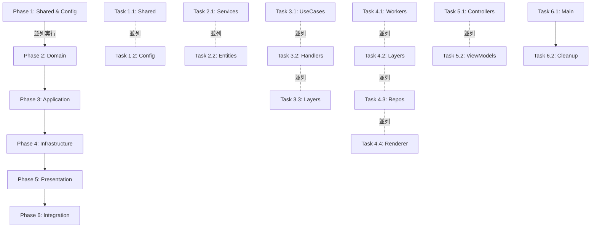

# TypeScript Error Resolution Execution Plan

## 現状分析
- **総エラー数**: 約3,494行
- **根本原因**: DDD移行によるインポートパス破壊とEffect-TSのLayer/Service構造の不整合

## エラー分布
```
infrastructure: 1,665 errors (47.6%)
domain:          467 errors (13.4%)
application:     161 errors  (4.6%)
presentation:     71 errors  (2.0%)
shared:           12 errors  (0.3%)
config:            4 errors  (0.1%)
main/layers:       7 errors  (0.2%)
```

## 実行戦略
依存関係の順序に従って下層から上層へ修正を進める。各層は独立したサブエージェントで並列実行可能。

## Phase 1: 基盤層の修正 (並列実行可能)

### Task 1.1: Shared Layer修正
```bash
# エージェントA: 共通ユーティリティとタイプ定義の修正
- src/shared/decorators/performance.ts - 未使用パラメータの修正
- src/shared/index.ts - 重複エクスポートの解決
- src/shared/types/index.ts - external.d.tsモジュール問題の修正
- src/shared/utils/common.ts - 型安全性の修正
```

### Task 1.2: Config Layer修正
```bash
# エージェントB: 設定関連の修正
- src/config/* - 4つのエラーを修正
- 環境変数とアプリケーション設定の型定義
```

## Phase 2: ドメイン層の修正

### Task 2.1: Domain Services修正
```bash
# エージェントC: ドメインサービスの復旧
- 削除されたサービスファイルの確認と移行先の特定
  - entity.service.ts → entity-domain.service.ts
  - world.service.ts → world-domain.service.ts
  - raycast.service.ts → raycast-domain.service.ts
- Effect Layer構造の修正
- 依存性注入パターンの統一
```

### Task 2.2: Domain Entities修正
```bash
# エージェントD: エンティティとクエリの修正
- src/domain/entities/* - Entity型定義の修正
- src/domain/queries/* - クエリハンドラーの修正
- src/domain/errors/* - エラー型の統一
```

## Phase 3: アプリケーション層の修正

### Task 3.1: Use Cases修正
```bash
# エージェントE: ユースケースの依存性修正
- PlayerMoveUseCase
- BlockPlaceUseCase
- ChunkLoadUseCase
- WorldGenerateUseCase
- Effect<void, Error, never>型の修正
```

### Task 3.2: Handlers修正
```bash
# エージェントF: コマンド/クエリハンドラーの修正
- src/application/handlers/command-handlers.ts
- src/application/handlers/query-handlers.ts
- サービス依存性の解決
- 型エラーの修正
```

### Task 3.3: Service Layers修正
```bash
# エージェントG: サービスレイヤーの修正
- src/application/layers/service-layers.ts
- インポートパスの修正
- Layer構成の再構築
```

## Phase 4: インフラストラクチャ層の修正 (最大のエラー源)

### Task 4.1: Worker関連修正
```bash
# エージェントH: Workerシステムの再構築
- src/infrastructure/workers/unified/* - 統一Workerシステム
- プロトコル定義の修正
- メッセージタイプの統一
- 削除されたWorkerファイルの移行確認
```

### Task 4.2: Infrastructure Layers修正
```bash
# エージェントI: インフラレイヤーの修正
- src/infrastructure/layers/*.live.ts - 全Liveレイヤーの修正
- Effect Layer/Contextパターンの統一
- サービス実装の修正
```

### Task 4.3: Repositories/Adapters修正
```bash
# エージェントJ: リポジトリとアダプターの修正
- src/infrastructure/repositories/*
- src/infrastructure/adapters/*
- データアクセス層の型修正
```

### Task 4.4: Three.js Renderer修正
```bash
# エージェントK: レンダラー関連の修正
- src/infrastructure/renderer-three/*
- Three.js統合の型エラー修正
- レンダリングコマンドの修正
```

## Phase 5: プレゼンテーション層の修正

### Task 5.1: Controllers修正
```bash
# エージェントL: コントローラーの修正
- src/presentation/controllers/*
- 依存サービスの注入修正
- イベントハンドラーの型修正
```

### Task 5.2: View Models修正
```bash
# エージェントM: ビューモデルの修正
- src/presentation/view-models/*
- UIステート管理の修正
```

## Phase 6: 最終統合

### Task 6.1: Main Entry Points修正
```bash
# エージェントN: エントリーポイントの修正
- src/main.ts
- src/layers.ts
- src/presentation/web/main.ts
- 全Layer統合の修正
```

### Task 6.2: 未使用コード削除
```bash
# エージェントO: クリーンアップ
- 未使用インポートの削除
- 未参照ファイルの削除
- デッドコードの除去
- 依存関係の最適化
```

## 実行順序と並列化戦略



## 成功基準
1. `npx tsc --noEmit` がエラー0で完了
2. すべての未使用コードが削除済み
3. インポートパスが統一され整合性がある
4. Effect-TSのLayer/Context構造が正しく機能

## 推定所要時間
- Phase 1: 15分 (並列実行)
- Phase 2: 30分 (並列実行)
- Phase 3: 30分 (並列実行)
- Phase 4: 60分 (並列実行、最大エラー数)
- Phase 5: 20分 (並列実行)
- Phase 6: 15分 (順次実行)

**総所要時間**: 約2-3時間（並列実行により短縮可能）

## 注意事項
- 各タスクは独立して実行可能なように設計
- サブエージェントは特定のディレクトリ/ファイルに限定して作業
- エラー修正時は常に型安全性を保証
- Effect-TSのベストプラクティスに準拠
- 削除されたファイルは移行先を確認してから参照を更新