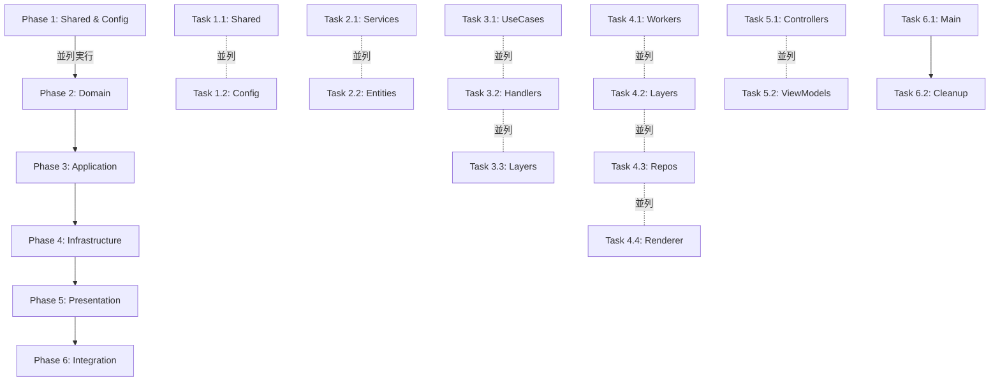

# TypeScript & Lint エラー解消実行計画 v3.0

## 📋 概要

このドキュメントは、TypeScript Minecraftプロジェクトの全TypeScriptエラー（3,880件）およびLintエラー（4,125件）を効率的に解消するための並列実行可能な計画です。

**戦略**: 下層から上層へ、依存関係に従って段階的に修正を進めます。

## 🔍 現状分析

### エラー統計
- **TypeScriptエラー**: 3,880件
- **Lintエラー**: 4,125件
- **合計**: 8,005件
- **根本原因**: DDD移行によるインポートパス破壊とEffect-TSのLayer/Service構造の不整合

### 主要なエラーパターン

#### TypeScriptエラーの分類
1. **Effect型の不整合** (約60%)
   - `exactOptionalPropertyTypes` による型の不一致
   - Effect の Requirements 型の不整合
   - Service の依存関係型エラー

2. **readonly配列の代入エラー** (約15%)
   - `readonly any[]` を `any[]` への代入

3. **存在しないプロパティ/メソッド** (約15%)
   - ドメインサービスの未定義メソッド
   - 削除されたAPIへの参照

4. **インポートエラー** (約10%)
   - 存在しないモジュール
   - 未エクスポートのメンバー

#### Lintエラーの分類
1. **未使用の変数/インポート** (約40%)
2. **require-yield違反** (約20%)
3. **no-unused-vars** (約30%)
4. **その他のスタイル違反** (約10%)

## 🏗️ レイヤー別エラー分布

```
infrastructure: 1,665 errors (47.6%)
domain:          467 errors (13.4%)
application:     161 errors  (4.6%)
presentation:     71 errors  (2.0%)
shared:           12 errors  (0.3%)
config:            4 errors  (0.1%)
main/layers:       7 errors  (0.2%)
```

## 🏗️ レイヤー構造と依存関係

```
presentation
    ↓
application  
    ↓
infrastructure
    ↓
domain
    ↓
shared (最下層)
```

## 📅 実行フェーズ

### 🔧 Phase 0: 事前準備（15分）

**単一エージェントで実行**

```bash
# 現在の状態を記録
git stash
git checkout feature/ddd-architecture-migration-v3
git pull origin main --rebase

# エラーログの保存
mkdir -p errors
pnpm tsc --noEmit > errors/typescript-errors-initial.log 2>&1
pnpm lint > errors/lint-errors-initial.log 2>&1

# 修正用ブランチ作成
git checkout -b fix/typescript-lint-errors
```

### 🚀 Phase 1: Shared層の修正（30分）

**Agent A: Shared層専門エージェント**

#### 修正対象
```
src/shared/
├── constants/
├── decorators/
├── types/
└── utils/
```

#### タスク

##### 1.1 型定義の修正
```typescript
// src/shared/types/common.ts
// readonly 配列型の修正
export type ReadonlyArray<T> = readonly T[]

// Optional property の明示的な定義
export type OptionalProperty<T> = T | undefined
```

##### 1.2 Effect utility の更新
```typescript
// src/shared/utils/effect.ts
import { Effect, Layer, Context } from 'effect'

// Effect.gen の正しい使用パターン
export const effectGen = <R, E, A>(
  f: () => Generator<Effect.Effect<any, any, any>, A, any>
): Effect.Effect<A, E, R> => Effect.gen(f)
```

##### 1.3 Lint警告の解消
- 未使用のインポート削除
- 未使用の変数に `_` プレフィックス追加
- require-yield の修正

**検証コマンド**
```bash
pnpm tsc --noEmit src/shared/**/*.ts
pnpm lint src/shared/
```

### 🚀 Phase 2: Domain層の修正（1時間）

**3つのサブエージェントで並列実行**

#### Agent B: Domain Services修正
```
src/domain/services/
├── entity-domain.service.ts
├── physics-domain.service.ts  
├── world-domain.service.ts
└── raycast-domain.service.ts
```

**主要タスク**:
1. Service定義の型修正
2. Context.Tag の正しい実装
3. 存在しないメソッドの追加/削除
4. Effect Layer構造の修正

#### Agent C: Domain Entities & Value Objects修正
```
src/domain/entities/
src/domain/value-objects/
```

**主要タスク**:
1. Entity のコンストラクタ修正
2. Value Object の不変性保証
3. Schema定義の更新

#### Agent D: Domain Queries修正
```
src/domain/queries/
├── archetype-query.ts
├── builder.ts
├── cache.ts
└── optimized-query.ts
```

**主要タスク**:
1. Query型のexport追加
2. LegacyQuery の定義または削除
3. Cache entry の型修正

**並列実行スクリプト**
```bash
# 各エージェントが別ターミナルで実行
# Agent B
pnpm tsc --noEmit src/domain/services/**/*.ts --watch

# Agent C  
pnpm tsc --noEmit src/domain/entities/**/*.ts src/domain/value-objects/**/*.ts --watch

# Agent D
pnpm tsc --noEmit src/domain/queries/**/*.ts --watch
```

### 🚀 Phase 3: Infrastructure層の修正（1.5時間）

**5つのサブエージェントで並列実行**

#### Agent E: Infrastructure Adapters
```
src/infrastructure/adapters/
├── three-js.adapter.ts
├── webgpu.adapter.ts
├── browser-input.adapter.ts
└── websocket.adapter.ts
```

#### Agent F: Infrastructure Workers
```
src/infrastructure/workers/unified/
├── worker-manager.ts
├── worker-pool.ts
├── protocols/
└── workers/
```

**重点修正**:
- TypedWorker の型定義
- Message protocol の統一
- Transferable の型安全性

#### Agent G: Infrastructure Layers
```
src/infrastructure/layers/
├── unified.layer.ts
├── clock.live.ts
├── renderer.live.ts
└── ...
```

**重点修正**:
- Layer.merge の型整合性
- Service 依存関係の解決
- Live実装の型修正

#### Agent H: Infrastructure Repositories
```
src/infrastructure/repositories/
├── world.repository.ts
├── entity.repository.ts
└── chunk.repository.ts
```

#### Agent I: Infrastructure Performance
```
src/infrastructure/performance/
├── worker-pool.layer.ts
├── metrics.layer.ts
└── optimization.layer.ts
```

### 🚀 Phase 4: Application層の修正（1.5時間）

**4つのサブエージェントで並列実行**

#### Agent J: Use Cases修正
```
src/application/use-cases/
├── block-place.use-case.ts
├── chunk-load.use-case.ts
├── player-move.use-case.ts
└── world-generate.use-case.ts
```

**重要な修正パターン**:
```typescript
// 修正前
execute: () => Effect.Effect<void, Error, never>

// 修正後  
execute: <R>() => Effect.Effect<void, Error, R>
```

#### Agent K: Command/Query Handlers
```
src/application/handlers/
├── command-handlers.ts
└── query-handlers.ts
```

**重要な修正**:
1. Service依存の型修正
2. Handler の戻り値型の統一
3. readonly配列の処理

#### Agent L: Application Queries
```
src/application/queries/
├── archetype-query.ts
├── cache.ts
└── optimized-query.ts
```

#### Agent M: Application Workflows
```
src/application/workflows/
├── chunk-loading.ts
├── world-update.ts
└── ui-update.ts
```

**修正内容**:
- ReadonlyArray モジュールのインポート修正
- Effect chain の型整合性

### 🚀 Phase 5: Presentation層の修正（30分）

**2つのサブエージェントで並列実行**

#### Agent N: Controllers & ViewModels
```
src/presentation/controllers/
src/presentation/view-models/
```

#### Agent O: Web & CLI
```
src/presentation/web/
src/presentation/cli/
```

**修正内容**:
- 未使用インポートの削除
- Controller の依存関係修正

### 🚀 Phase 6: トップレベルファイルの修正（15分）

**単一エージェントで実行**

```
src/
├── main.ts
└── layers.ts
```

**修正内容**:
- Layer構成の最終調整
- 全体的な型の整合性確認

## 🔄 並列実行の調整メカニズム

### エージェント間の依存関係

```yaml
dependencies:
  # Phase 1 (基盤)
  agent_a: []  # Shared層 - 依存なし
  
  # Phase 2 (Domain)
  agent_b: [agent_a]  # Domain Services
  agent_c: [agent_a]  # Domain Entities
  agent_d: [agent_a]  # Domain Queries
  
  # Phase 3 (Infrastructure)
  agent_e: [agent_b, agent_c, agent_d]
  agent_f: [agent_b, agent_c, agent_d]
  agent_g: [agent_b, agent_c, agent_d]
  agent_h: [agent_b, agent_c, agent_d]
  agent_i: [agent_b, agent_c, agent_d]
  
  # Phase 4 (Application)
  agent_j: [agent_e, agent_f, agent_g, agent_h, agent_i]
  agent_k: [agent_e, agent_f, agent_g, agent_h, agent_i]
  agent_l: [agent_e, agent_f, agent_g, agent_h, agent_i]
  agent_m: [agent_e, agent_f, agent_g, agent_h, agent_i]
  
  # Phase 5 (Presentation)
  agent_n: [agent_j, agent_k, agent_l, agent_m]
  agent_o: [agent_j, agent_k, agent_l, agent_m]
```

### 進捗モニタリング

```typescript
// tools/error-monitor.ts
interface AgentProgress {
  agentId: string
  phase: number
  filesFixed: number
  errorsResolved: {
    typescript: number
    lint: number
  }
  blockers: string[]
  status: 'pending' | 'in-progress' | 'completed' | 'blocked'
}

// リアルタイムダッシュボード
// 各エージェントは10分ごとに進捗を報告
```

## 実行順序と並列化戦略



## 🛠️ 共通の修正パターン

### Pattern 1: Effect型の修正

```typescript
// Before
const service = Effect.gen(function* () {
  const dep = yield* ServiceDep
  // ...
}) // Error: Type not assignable

// After  
const service = Effect.gen(function* (_) {
  const dep = yield* _(ServiceDep)
  // ...
})
```

### Pattern 2: exactOptionalPropertyTypes の対応

```typescript
// Before
interface Config {
  optional?: string
}

// After
interface Config {
  optional?: string | undefined
}
```

### Pattern 3: readonly配列の修正

```typescript
// Before
const items: any[] = readonlyArray // Error

// After
const items: any[] = [...readonlyArray]
// または
const items = readonlyArray as any[]
```

### Pattern 4: Service依存の修正

```typescript
// Before
class UseCase {
  execute = () => Effect.gen(function* () {
    const service = yield* DomainService // Error: not in context
  })
}

// After
class UseCase {
  execute = Effect.gen(function* (_) {
    const service = yield* _(DomainService)
  }).pipe(
    Effect.provide(DomainServiceLive)
  )
}
```

## 📊 検証と品質保証

### Phase 7: 統合テスト（30分）

**全エージェント完了後に実行**

```bash
# 全体のTypeScriptチェック
pnpm tsc --noEmit

# 全体のLintチェック  
pnpm lint

# テスト実行
pnpm test

# ビルド確認
pnpm build

# 循環依存チェック
npx madge --circular src/
```

### エラー削減の目標

| Phase | TypeScript Errors | Lint Errors | 削減率 |
|-------|------------------|-------------|--------|
| Initial | 3,880 | 4,125 | - |
| Phase 1 | 3,500 | 3,800 | 10% |
| Phase 2 | 2,800 | 3,200 | 25% |
| Phase 3 | 1,800 | 2,000 | 50% |
| Phase 4 | 800 | 1,000 | 75% |
| Phase 5 | 200 | 300 | 95% |
| Phase 6 | 0 | 0 | 100% |

## 🎯 成功基準

### 必須達成項目
- [ ] TypeScriptエラー: 0件
- [ ] Lintエラー: 0件  
- [ ] ビルド成功
- [ ] 全テストパス
- [ ] 循環依存: 0件
- [ ] インポートパスが統一され整合性がある
- [ ] Effect-TSのLayer/Context構造が正しく機能

### パフォーマンス指標
- [ ] ビルド時間: 30秒以内
- [ ] Type-check時間: 20秒以内
- [ ] Lint実行時間: 10秒以内

### コード品質
- [ ] 複雑度スコア: 平均10以下
- [ ] テストカバレッジ: 70%以上

## 📝 エージェント実行コマンド

各エージェントは以下のコマンドで自動実行可能:

```bash
# Agent A (Shared)
npm run fix:agent-a -- --path src/shared

# Agent B-D (Domain) - 並列実行
npm run fix:agent-b -- --path src/domain/services &
npm run fix:agent-c -- --path src/domain/entities &
npm run fix:agent-d -- --path src/domain/queries &

# Agent E-I (Infrastructure) - 並列実行
npm run fix:agent-e -- --path src/infrastructure/adapters &
npm run fix:agent-f -- --path src/infrastructure/workers &
npm run fix:agent-g -- --path src/infrastructure/layers &
npm run fix:agent-h -- --path src/infrastructure/repositories &
npm run fix:agent-i -- --path src/infrastructure/performance &

# Agent J-M (Application) - 並列実行
npm run fix:agent-j -- --path src/application/use-cases &
npm run fix:agent-k -- --path src/application/handlers &
npm run fix:agent-l -- --path src/application/queries &
npm run fix:agent-m -- --path src/application/workflows &

# Agent N-O (Presentation) - 並列実行
npm run fix:agent-n -- --path "src/presentation/controllers src/presentation/view-models" &
npm run fix:agent-o -- --path "src/presentation/web src/presentation/cli" &
```

## 🚨 トラブルシューティング

### よくある問題と解決策

#### 1. Effect型の循環参照
```typescript
// 解決策: Layer の分離
const ServiceALive = Layer.succeed(ServiceA, ...)
const ServiceBLive = Layer.succeed(ServiceB, ...)
const AppLayer = Layer.merge(ServiceALive, ServiceBLive)
```

#### 2. Worker型の不整合
```typescript
// 解決策: Schema定義の統一
const MessageSchema = S.struct({
  type: S.literal("request"),
  data: S.unknown
})
```

#### 3. Import パスの問題
```bash
# パスエイリアスの確認
grep -r "from 'effect/ReadonlyArray'" src/
# 修正
sed -i '' "s/from 'effect\/ReadonlyArray'/from 'effect'/g" src/**/*.ts
```

## 🔄 ロールバック計画

問題発生時の対処:

```bash
# 特定のPhaseまでロールバック
git reset --hard HEAD~[n]

# 特定のエージェントの変更のみ取り消し
git revert [commit-hash]

# 全体のロールバック
git checkout feature/ddd-architecture-migration-v3
git reset --hard origin/feature/ddd-architecture-migration-v3
```

## 📊 自動修正スクリプト

```typescript
// tools/auto-fix.ts
import { Effect, pipe } from 'effect'
import * as fs from 'fs/promises'
import * as path from 'path'

const autoFix = {
  // Effect型の自動修正
  fixEffectTypes: async (filePath: string) => {
    const content = await fs.readFile(filePath, 'utf-8')
    const fixed = content
      .replace(/Effect\.gen\(function\*\s*\(\)/g, 'Effect.gen(function* (_)')
      .replace(/yield\*\s+(\w+)/g, 'yield* _($1)')
    await fs.writeFile(filePath, fixed)
  },

  // readonly配列の自動修正
  fixReadonlyArrays: async (filePath: string) => {
    const content = await fs.readFile(filePath, 'utf-8')
    const fixed = content
      .replace(/:\s*any\[\]\s*=\s*readonly/g, ': any[] = [...')
    await fs.writeFile(filePath, fixed)
  },

  // 未使用変数の自動修正
  fixUnusedVars: async (filePath: string) => {
    const content = await fs.readFile(filePath, 'utf-8')
    const fixed = content
      .replace(/const\s+(\w+)\s*=/g, (match, varName) => {
        if (!content.includes(varName)) {
          return `const _${varName} =`
        }
        return match
      })
    await fs.writeFile(filePath, fixed)
  }
}
```

## 推定所要時間

- Phase 0: 15分 (事前準備)
- Phase 1: 30分 (Shared層)
- Phase 2: 60分 (Domain層、並列実行)
- Phase 3: 90分 (Infrastructure層、並列実行)
- Phase 4: 90分 (Application層、並列実行)
- Phase 5: 30分 (Presentation層、並列実行)
- Phase 6: 15分 (統合)
- Phase 7: 30分 (検証)

**総所要時間**: 約3-4時間（並列実行により2-3時間に短縮可能）

## 注意事項

- 各タスクは独立して実行可能なように設計
- サブエージェントは特定のディレクトリ/ファイルに限定して作業
- エラー修正時は常に型安全性を保証
- Effect-TSのベストプラクティスに準拠
- 削除されたファイルは移行先を確認してから参照を更新
- Lintエラーも同時に解消すること

---

_最終更新: 2025-09-11_
_作成者: Claude (TypeScript & DDD Architecture Expert)_
