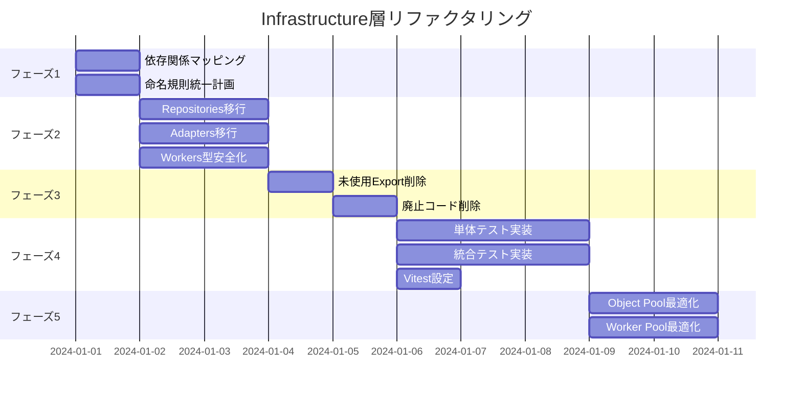

# Infrastructure層リファクタリング実行計画書

## 概要
本計画書は、TypeScript Minecraftプロジェクトのinfrastructure層を完全にEffect-TS準拠に移行し、100%のテストカバレッジを達成するための実行計画です。並列実行可能なタスクを明確に定義し、効率的な実装を実現します。

## 現状分析

### 問題点
1. **テストの欠如**: infrastructure層に単体テストが一切存在しない
2. **クラスベースの実装**: Context.Tagを除き、多くのクラスが残存
3. **未使用コード**: exportされているが実際には使用されていないコード多数
4. **命名規則の不統一**: ファイル名に`.layer.ts`、`.service.ts`、`.adapter.ts`などが混在
5. **型の緩さ**: Effect-TSの型システムを完全に活用していない

### 現在の構造
```
src/infrastructure/
├── adapters/        # 外部ライブラリとのアダプター層
├── communication/   # システム間通信
├── gpu/            # WebGPUレンダリング
├── layers/         # Effect-TSレイヤー定義
├── monitoring/     # パフォーマンス監視
├── network/        # ネットワーク通信
├── performance/    # パフォーマンス最適化
├── repositories/   # データ永続化層
├── services/       # ビジネスロジックサービス
├── storage/        # ストレージ管理
└── workers/        # Web Workers管理
```

## 実行フェーズ

### フェーズ1: 準備と分析（並列実行可能）

#### タスク1.1: 依存関係マッピング
**実行者**: サブエージェントA
**目的**: 全ファイルの依存関係を分析し、削除可能なコードを特定
**成果物**: 
- dependency-map.json
- unused-exports.md

**実行内容**:
```typescript
// 分析対象
- src/layers.ts からの import
- src/main.ts からの import  
- src/presentation/web/main.ts からの import
- テストファイルからの import（将来的な参照）
```

#### タスク1.2: 命名規則統一計画
**実行者**: サブエージェントB
**目的**: ファイル命名規則の統一化計画策定
**成果物**: naming-convention.md

**新命名規則**:
```
- *.adapter.ts    → *.adapter.ts (維持)
- *.layer.ts      → *.layer.ts (維持)
- *.service.ts    → 削除（純関数に移行）
- *.repository.ts → *.repository.ts (維持)
- *.worker.ts     → *.worker.ts (維持)
- *.protocol.ts   → *.types.ts
- *-exports.ts    → index.ts
- *-utils.ts      → *.utils.ts (維持)
```

### フェーズ2: クラス撲滅とEffect-TS移行（並列実行可能）

#### タスク2.1: Repositories層の関数型移行
**実行者**: サブエージェントC
**対象ファイル**:
- entity.repository.ts
- chunk.repository.ts
- world.repository.ts

**移行パターン**:
```typescript
// Before (Class-based)
export class EntityRepositoryImpl implements IEntityRepository {
  constructor(private readonly storage: Map<string, Entity>) {}
  findById(id: string): Option.Option<Entity> {
    return Option.fromNullable(this.storage.get(id))
  }
}

// After (Functional)
export const EntityRepository = Context.GenericTag<IEntityRepository>('EntityRepository')

export const makeEntityRepository = Effect.gen(function* () {
  const storage = yield* Ref.make(new Map<string, Entity>())
  
  return EntityRepository.of({
    findById: (id: string) =>
      Ref.get(storage).pipe(
        Effect.map(s => Option.fromNullable(s.get(id)))
      )
  })
})

export const EntityRepositoryLive = Layer.effect(
  EntityRepository,
  makeEntityRepository
)
```

#### タスク2.2: Adapters層の関数型移行
**実行者**: サブエージェントD
**対象ファイル**:
- three-js.adapter.ts
- browser-input.adapter.ts
- websocket.adapter.ts
- 他のアダプターファイル

**移行パターン**:
```typescript
// After (Functional with Effect)
export interface ThreeJsAdapter {
  readonly createScene: Effect.Effect<THREE.Scene, RenderError>
  readonly createCamera: (aspect: number) => Effect.Effect<THREE.Camera, RenderError>
  readonly render: (scene: THREE.Scene) => Effect.Effect<void, RenderError>
}

export const ThreeJsAdapter = Context.GenericTag<ThreeJsAdapter>('ThreeJsAdapter')

export const ThreeJsAdapterLive = Layer.succeed(
  ThreeJsAdapter,
  {
    createScene: Effect.try({
      try: () => new THREE.Scene(),
      catch: (e) => new RenderError({ message: `Failed to create scene: ${e}` })
    }),
    // ... 他のメソッド
  }
)
```

#### タスク2.3: Workers層の型安全化
**実行者**: サブエージェントE
**対象ファイル**:
- workers/unified/*.ts
- workers/base/*.ts

**改善内容**:
```typescript
// Schema定義による型安全なメッセージング
export const WorkerMessage = S.Union(
  S.Struct({
    _tag: S.Literal('ComputeRequest'),
    taskId: S.String,
    data: S.Unknown
  }),
  S.Struct({
    _tag: S.Literal('ComputeResponse'),
    taskId: S.String,
    result: S.Unknown
  }),
  S.Struct({
    _tag: S.Literal('ComputeError'),
    taskId: S.String,
    error: S.String
  })
)

export type WorkerMessage = S.Schema.Type<typeof WorkerMessage>
```

### フェーズ3: 未使用コード削除（順次実行）

#### タスク3.1: 未使用Export削除
**実行者**: サブエージェントF
**削除対象**:
- infrastructure/infrastructure-utils.ts (未使用)
- infrastructure/infrastructure-health.ts (未使用)
- adapters/adapter-compliance-test.ts (テスト用途だが未実装)
- adapters/ports-adapters-validation.ts (検証用だが未使用)
- 各種 *-exports.ts ファイル（index.tsに統合）

#### タスク3.2: 廃止予定コード削除
**実行者**: サブエージェントG
**対象**:
- @deprecated タグ付きのすべてのコード
- コメントアウトされたコード
- TODOコメントの評価と削除/実装

### フェーズ4: テスト実装（並列実行可能）

#### タスク4.1: 単体テスト実装
**実行者**: サブエージェントH
**テスト構造**:
```
src/infrastructure/
├── __tests__/
│   ├── adapters/
│   │   ├── three-js.adapter.test.ts
│   │   ├── browser-input.adapter.test.ts
│   │   └── ...
│   ├── repositories/
│   │   ├── entity.repository.test.ts
│   │   ├── chunk.repository.test.ts
│   │   └── ...
│   ├── workers/
│   │   ├── worker-pool.test.ts
│   │   └── ...
│   └── performance/
│       ├── cache.layer.test.ts
│       └── ...
```

**テストパターン**:
```typescript
import { describe, it, expect } from 'vitest'
import * as Effect from 'effect/Effect'
import * as TestContext from 'effect/TestContext'
import * as Exit from 'effect/Exit'

describe('EntityRepository', () => {
  it('should find entity by id', () =>
    Effect.gen(function* () {
      const repo = yield* EntityRepository
      const entity = createTestEntity()
      
      yield* repo.save(entity)
      const found = yield* repo.findById(entity.id)
      
      expect(Option.isSome(found)).toBe(true)
      expect(Option.getOrNull(found)).toEqual(entity)
    }).pipe(
      Effect.provide(EntityRepositoryLive),
      Effect.provide(TestContext.TestContext),
      Effect.runPromise
    ))
})
```

#### タスク4.2: 統合テスト実装
**実行者**: サブエージェントI
**対象**:
- Layer間の統合テスト
- Worker通信の統合テスト
- パフォーマンス層の統合テスト

#### タスク4.3: Vitest設定最適化
**実行者**: サブエージェントJ
**設定ファイル**: vitest.infrastructure.config.ts

```typescript
import { defineConfig } from 'vitest/config'
import { sharedConfig } from './vitest.shared.config'

export default defineConfig({
  ...sharedConfig,
  test: {
    ...sharedConfig.test,
    include: ['src/infrastructure/**/*.test.ts'],
    coverage: {
      ...sharedConfig.test?.coverage,
      include: ['src/infrastructure/**/*.ts'],
      exclude: [
        'src/infrastructure/**/*.test.ts',
        'src/infrastructure/**/*.worker.ts',
        'src/infrastructure/**/index.ts'
      ],
      thresholds: {
        statements: 100,
        branches: 100,
        functions: 100,
        lines: 100
      }
    },
    setupFiles: ['./tests/setup/infrastructure.setup.ts']
  }
})
```

### フェーズ5: パフォーマンス最適化（並列実行可能）

#### タスク5.1: Object Pool最適化
**実行者**: サブエージェントK
**内容**:
- memory-pool.layer.ts の Effect-TS完全準拠
- object-pool.layer.ts の最適化
- cache.layer.ts の改善

#### タスク5.2: Worker Pool最適化
**実行者**: サブエージェントL
**内容**:
- worker-pool.ts の並列度向上
- worker-pool-bridge.ts のメッセージング最適化
- バックプレッシャー機構の実装

## 成功指標（KPI）

1. **テストカバレッジ**: 100%（statements, branches, functions, lines）
2. **型安全性**: strict: true, no any/unknown/as
3. **パフォーマンス**: 
   - Worker応答時間 < 16ms (60fps)
   - メモリリーク: 0件
4. **コード品質**:
   - クラス数: 0（TaggedError除く）
   - 未使用Export: 0
   - ESLintエラー: 0
   - TypeScriptエラー: 0

## タイムライン



## リスクと対策

### リスク1: 既存機能の破壊
**対策**: 
- 段階的な移行とテストの並行実装
- Feature Flagによる切り替え可能な実装

### リスク2: パフォーマンス劣化
**対策**:
- ベンチマークテストの事前実装
- プロファイリングツールの活用

### リスク3: 並列作業の競合
**対策**:
- 明確なモジュール境界の定義
- 定期的な統合とコンフリクト解決

## チェックリスト

### 各ファイルごとのチェック項目
- [ ] クラスを純関数に変換
- [ ] Effect-TS型システムの完全適用
- [ ] 未使用コードの削除
- [ ] 命名規則の統一
- [ ] 単体テストの実装（カバレッジ100%）
- [ ] JSDocコメントの追加
- [ ] エラーハンドリングの改善

### 全体のチェック項目
- [ ] すべてのexportが使用されている
- [ ] @deprecatedタグが存在しない
- [ ] TypeScriptのstrictモードでエラーなし
- [ ] ESLint/Biomeでエラーなし
- [ ] Vitestでカバレッジ100%
- [ ] パフォーマンステスト合格
- [ ] 統合テスト合格

## 次のステップ

1. この実行計画書のレビューと承認
2. サブエージェントへのタスク割り当て
3. フェーズ1の並列実行開始
4. 日次進捗レビューの実施
5. 各フェーズ完了時の統合テスト

## 付録

### A. Effect-TSベストプラクティス
- Layerパターンの活用
- Contextによる依存性注入
- Schemaによる型定義と検証
- Effectによる副作用の管理

### B. テスト戦略
- 単体テスト: 各関数の独立したテスト
- 統合テスト: Layer間の連携テスト
- E2Eテスト: ブラウザ環境での動作確認
- パフォーマンステスト: 負荷テストとプロファイリング

### C. 参考資料
- Effect-TS公式ドキュメント
- Vitest公式ドキュメント
- TypeScript Strictモードガイド
- 関数型プログラミングパターン集