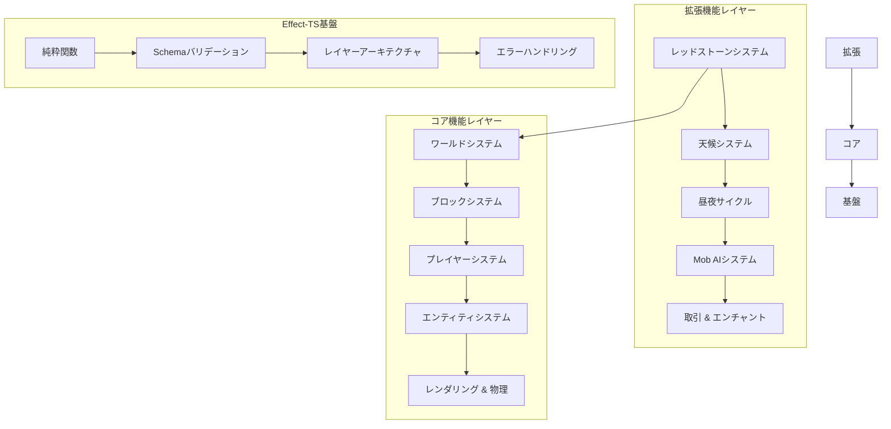

# TypeScript Minecraft Clone - 完全ドキュメント

## 🎮 プロジェクト概要

TypeScriptで実装する本格的なMinecraftクローンです。**Effect-TS 3.17+** の最新パターン、**DDD（ドメイン駆動設計）**、**ECS（Entity Component System）** を活用した、型安全で拡張可能なアーキテクチャを採用しています。

純粋関数型プログラミングの原則に基づき、クラスベースの設計を排除し、すべての機能を合成可能なEffectとして実装。モジュラーな設計によりコア機能と拡張機能を明確に分離し、段階的な開発と拡張を可能にしています。

## ✨ 主要な特徴

- **🎯 純粋関数型設計**: クラス禁止、Effect-TSによる完全な関数型プログラミング
- **🚀 最新Effect-TSパターン**: Schema.Struct、@app/ServiceNameネームスペース採用
- **🏗️ DDD + ECS統合**: 境界づけられたコンテキスト × Structure of Arrays最適化
- **⚡ 高性能アーキテクチャ**: グリーディメッシング、視錐台カリング、並列処理
- **🔧 完全型安全**: Schema駆動開発とコンパイル時エラー検出
- **🎨 モジュラー拡張**: コア機能 + 拡張機能の段階的実装

## ⚠️ 重要：開発ガイドライン

### Effect-TS 使用時の必須事項

**2024年最新のEffect-TSパターンを必ず使用してください：**

```typescript
// ✅ 2024年最新パターンの例
import { Effect, Layer, Context, Schema, Match } from "effect"

// 1. Schema.Struct でデータ定義 (❌ class 禁止)
const Player = Schema.Struct({
  _tag: Schema.Literal("Player"),
  id: Schema.String.pipe(Schema.brand("PlayerId")),
  name: Schema.String,
  position: Vector3Schema
})
type Player = Schema.Schema.Type<typeof Player>

// 2. Context.GenericTag でサービス定義 (❌ Context.Tag 禁止)
const PlayerService = Context.GenericTag<PlayerService>("@app/PlayerService")

// 3. Match.value でパターンマッチング (❌ if/else/switch 禁止)
const handlePlayerAction = (action: PlayerAction) =>
  Match.value(action).pipe(
    Match.tag("Move", ({ direction }) => movePlayer(direction)),
    Match.tag("Jump", () => playerJump()),
    Match.exhaustive
  )

// 4. 早期リターンで最適化
const validatePlayer = (player: unknown): Effect.Effect<Player, ValidationError> => {
  if (!player || typeof player !== "object") {
    return Effect.fail(new ValidationError({ message: "Invalid player data" }))
  }
  return Schema.decodeUnknownEither(Player)(player).pipe(
    Effect.mapError(error => new ValidationError({ cause: error }))
  )
}
```

## 🚀 クイックスタート

```bash
# 依存関係のインストール
pnpm install

# 開発サーバーの起動
pnpm dev

# ビルド
pnpm build

# テストの実行
pnpm test
```

## 技術スタック

### コアフレームワーク
- **[Effect-TS 3.17+](https://effect.website/)** - 関数型プログラミングエコシステム (最新パターン使用)
- **[TypeScript 5.6+](https://www.typescriptlang.org/)** - 型安全性とコンパイル時チェック
- **[Schema (内蔵)](https://effect.website/docs/schema/introduction)** - スキーマ駆動開発

### 3Dレンダリング
- **[Three.js](https://threejs.org/)** - WebGL 3Dレンダリングエンジン
- **WebGPU** - 次世代GPU API（実験的サポート）

### ビルドツール・開発環境
- **[Vite](https://vitejs.dev/)** - 高速バンドラー
- **[Vitest](https://vitest.dev/)** - テストランナー
- **[Oxlint](https://github.com/oxc-project/oxc)** - 高速リンター
- **[Prettier](https://prettier.io/)** - コードフォーマッター
- **[pnpm](https://pnpm.io/)** - パッケージマネージャー

### その他のライブラリ
- **simplex-noise** - プロシージャル地形生成
- **alea** - シード可能な乱数生成器
- **stats.js** - パフォーマンス監視
- **uuid** - ユニークID生成

## 🏠 アーキテクチャ概要

本プロジェクトは **DDD + ECS + Effect-TS 2024年最新パターン** の統合モデルです。

### 📜 開発原則

1. **純粋関数ファースト**: 副作用のない計算ロジックを優先
2. **早期リターン**: バリデーション段階での即座エラー処理
3. **単一責務**: 関数の細分化とテスタビリティ向上
4. **型安全性**: Schema駆動のコンパイル時エラー検出
5. **パフォーマンス**: 並列処理とメモリ最適化

### 4層アーキテクチャ

```
┌───────────────────────────────────┐
│        プレゼンテーション層         │  ← React + Effect-TS Hooks
│    (コントローラー, ビュー, UI)     │
├───────────────────────────────────┤
│        アプリケーション層          │  ← ユースケース + ワークフロー
│     (Effect.gen + Match.value)   │     (コマンドパターン)
├───────────────────────────────────┤
│          ドメイン層            │  ← Schema.Struct + サービス
│   (純粋関数 + バリデーション) │     (Context.GenericTag)
├───────────────────────────────────┤
│       インフラストラクチャ層       │  ← Three.js + WebGLアダプター
│      (Layer.effect + ポート)      │     (ECS + 物理エンジン)
└───────────────────────────────────┘
```

### 設計原則

1. **関数型ファースト**: `class`構文や`this`キーワードを使用しない純粋関数型設計
2. **不変性**: すべてのデータ構造をimmutableとして扱う
3. **Effect系統合**: すべての操作をEffect型でラップし、合成可能なプログラムを構築
4. **依存性注入**: Effect-TSのLayerシステムによる型安全なDI
5. **エラーハンドリング**: タグ付きエラーシステムによる明示的なエラー管理

## ディレクトリ構造

```
ts-minecraft/
├── src/
│   ├── domain/           # ドメインレイヤー
│   │   ├── entities/     # エンティティとコンポーネント
│   │   ├── value-objects/# 値オブジェクト
│   │   ├── services/     # ドメインサービス
│   │   └── ports/        # ポート（インターフェース）
│   ├── application/      # アプリケーションレイヤー
│   │   ├── use-cases/    # ユースケース
│   │   ├── workflows/    # ワークフロー
│   │   └── queries/      # ECSクエリシステム
│   ├── infrastructure/   # インフラストラクチャレイヤー
│   │   ├── adapters/     # アダプター実装
│   │   ├── repositories/ # リポジトリ実装
│   │   └── workers/      # Web Worker実装
│   ├── presentation/     # プレゼンテーションレイヤー
│   │   ├── controllers/  # コントローラー
│   │   ├── view-models/  # ビューモデル
│   │   └── cli/          # CLI開発者ツール
│   ├── config/           # 設定管理
│   └── shared/           # 共通ユーティリティ
├── docs/                 # ドキュメント
│   ├── 00-introduction/
│   ├── 01-architecture/
│   ├── 02-guides/
│   ├── 03-systems/
│   └── 04-appendix/
└── tests/               # テストファイル
```

## クイックスタート

### 前提条件

- Node.js 20+ 
- pnpm 10+

### インストールと起動

```bash
# リポジトリをクローン
git clone https://github.com/takeokunn/ts-minecraft.git
cd ts-minecraft

# 依存関係をインストール
pnpm install

# 開発サーバーを起動
pnpm dev

# ブラウザで http://localhost:5173 にアクセス
```

### 開発用コマンド

```bash
# 型チェック
pnpm type-check

# テスト実行
pnpm test

# レイヤー別テスト
pnpm test:shared
pnpm test:infrastructure  
pnpm test:presentation

# カバレッジ付きテスト
pnpm test:coverage

# リント・フォーマット
pnpm lint
pnpm format

# プロダクションビルド
pnpm build
```

## 📚 ドキュメント構成

### 🏗️ アーキテクチャ基盤
- [**アーキテクチャ概要**](../01-architecture/00-overall-design.md) - システム全体設計と設計原則
- [**ECS統合**](../01-architecture/04-ecs-integration.md) - DDD × ECS統合アーキテクチャ
- [**Effect-TSパターン**](../01-architecture/05-effect-ts-patterns.md) - 関数型プログラミングパターン

### 📋 実装ガイド
- [**開発環境セットアップ**](../03-guides/00-development-conventions.md) - 環境構築・ツール設定
- [**Effect-TS基本パターン**](../01-architecture/05-effect-ts-patterns.md) - 最新パターンとベストプラクティス

### 🎮 コア機能

Minecraftクローンとして必須となる基本機能群。すべてEffect-TS 3.17+の最新パターンで実装。

- [**📋 概要**](../02-specifications/00-core-features/00-overview.md) - コア機能の全体設計とアーキテクチャ原則
- [**🌍 ワールドシステム**](../02-specifications/00-core-features/01-world-system.md) - 地形生成・バイオーム・光源伝播
- [**👤 プレイヤーシステム**](../02-specifications/00-core-features/02-player-system.md) - 移動・視点・操作・ステータス管理
- [**🧱 ブロックシステム**](../02-specifications/00-core-features/03-block-system.md) - ブロックタイプ・状態・物理演算
- [**🤖 エンティティシステム**](../02-specifications/00-core-features/04-entity-system.md) - エンティティ・AI・スポーン・当たり判定
- [**🎨 レンダリングシステム**](../02-specifications/00-core-features/05-rendering-system.md) - メッシュ生成・LOD・視錐台カリング
- [**⚡ 物理システム**](../02-specifications/00-core-features/06-physics-system.md) - 重力・衝突・流体・爆発処理
- [**📦 チャンクシステム**](../02-specifications/00-core-features/07-chunk-system.md) - チャンク管理・圧縮・並列処理
- [**🎒 インベントリシステム**](../02-specifications/00-core-features/08-inventory-system.md) - アイテム・スタック・GUI連携
- [**🔨 クラフトシステム**](../02-specifications/00-core-features/09-crafting-system.md) - レシピ・クラフト台・エンチャント

### 🚀 拡張機能

基本機能を拡張し、より豊かなゲーム体験を提供する高度な機能群。

- [**📋 概要**](../02-specifications/01-enhanced-features/00-overview.md) - 拡張機能のアーキテクチャと統合設計
- [**⚡ レッドストーンシステム**](../02-specifications/01-enhanced-features/01-redstone-system.md) - 論理回路・信号伝播・機械制御
- [**🌦️ 天候システム**](../02-specifications/01-enhanced-features/02-weather-system.md) - 動的天候・降水・雷・季節変化
- [**🌞 昼夜サイクル**](../02-specifications/01-enhanced-features/03-day-night-cycle.md) - 時間システム・天体軌道・光源計算
- [**🧠 Mob AIシステム**](../02-specifications/01-enhanced-features/04-mob-ai-system.md) - 行動木AI・群れ行動・環境適応
- [**🏪 村人取引**](../02-specifications/01-enhanced-features/05-villager-trading.md) - 動的価格・職業・評判システム
- [**✨ エンチャントシステム**](../02-specifications/01-enhanced-features/06-enchantment-system.md) - エンチャント効果・レベル強化・耐久度
- [**🧪 ポーション効果**](../02-specifications/01-enhanced-features/07-potion-effects.md) - 効果持続・相互作用・能力値変化
- [**🌋 ネザーポータル**](../02-specifications/01-enhanced-features/08-nether-portals.md) - 異次元移動・座標変換・ポータル管理

### 🔧 レイヤー別詳細ドキュメント
- [**ドメイン層**](../01-architecture/03-layered-architecture.md) - ビジネスロジック・エンティティ・値オブジェクト
- [**アプリケーション層**](../01-architecture/03-layered-architecture.md) - ユースケース・ワークフロー・ECSクエリ

## 🏗️ アーキテクチャ概要

### 統合アーキテクチャ: DDD × ECS × Effect-TS



### 4層アーキテクチャ

```
┌─────────────────────────────┐
│   🎮 拡張機能      │ ← 拡張機能（レッドストーン, 天候, AI）
├─────────────────────────────┤
│   🏗️ コア機能         │ ← 基本機能（ワールド, プレイヤー, ブロック）
├─────────────────────────────┤
│   ⚡ アプリケーション層      │ ← ユースケース・ECSシステム
├─────────────────────────────┤
│   🔧 ドメイン層          │ ← ビジネスロジック・純粋関数
└─────────────────────────────┘
```

### 実装機能の構成

#### 🎯 コア機能 （必須機能）
- **ワールドシステム** → **ブロックシステム** → **チャンクシステム** （基盤）
- **プレイヤーシステム** → **物理システム** → **レンダリングシステム** （プレイヤー体験）
- **エンティティシステム** → **インベントリシステム** → **クラフトシステム** （拡張性）

#### 🚀 拡張機能
- **昼夜サイクル** → **天候システム** （環境システム）
- **レッドストーンシステム** → **Mob AIシステム** （インタラクション）
- **エンチャントシステム** → **ポーション効果** （プレイヤー強化）
- **村人取引** → **ネザーポータル** （高度な機能）

## 📊 プロジェクト進捗状況

### ✅ DDD + ECS アーキテクチャ移行完了

- **🎯 95%関数型プログラミング**: クラスベース → 純粋関数設計
- **⚡ Effect-TS 3.17+ 統合**: 最新パターン・Schema.Struct採用
- **🏗️ モジュラー設計**: コア/拡張機能の明確分離
- **🔧 型安全性強化**: Schema駆動開発・タグ付きエラー
- **📈 パフォーマンス最適化**: SoA ECS・グリーディメッシング

### 📋 ドキュメント完成状況

```
コア機能:     11/16+ 完成 (69%) ⚠️
拡張機能: 8/20+ 完成 (40%) ⚠️
不足機能分析:      1/1 完成 ✅
アーキテクチャ:      3/3 完成 ✅
実装ガイド:        1/1 完成 ✅
```

### 📋 システム機能一覧

#### 🔥 **コアシステム**
- **体力 & 空腹システム**: プレイヤーの生存メカニズム
- **戦闘システム**: モンスター戦闘・ダメージ・死亡処理
- **マルチプレイヤー対応**: ネットワーク・同期・コミュニケーション

#### 🏗️ **拡張システム**
- **構造物生成**: 村・ダンジョン・要塞・遺跡
- **拡張バイオーム**: 海洋・山岳・特殊環境
- **ジ・エンド次元**: エンダードラゴン・エンドシティ
- **実績システム**: 進捗・実績管理
- **高度なゲームプレイ**: 高度なゲームプレイ機能

**詳細**: [**機能仕様一覧**](../02-specifications/00-core-features/00-overview.md)

## 🚀 開発者向けクイックスタートガイド

### 1. 環境セットアップ

```bash
# リポジトリをクローン
git clone https://github.com/takeokunn/ts-minecraft.git
cd ts-minecraft

# 依存関係をインストール
pnpm install

# 開発サーバーを起動
pnpm dev

# ブラウザで http://localhost:5173 にアクセス
```

### 2. 開発ワークフロー

```bash
# 型チェック（開発中は常に実行）
pnpm type-check

# テスト実行（TDD推奨）
pnpm test
pnpm test:watch  # ウォッチモード

# 新機能実装の基本フロー
pnpm test        # 既存テストの確認
# Schema定義 → Service実装 → Layer作成 → テスト作成
pnpm type-check  # 型安全性確認
pnpm test        # テスト実行
```

### 3. 実装時の参照順序

**新機能実装時は以下の順序で参照してください：**

1. **[コア機能概要](../02-specifications/00-core-features/00-overview.md)** - 最新パターンとアーキテクチャ原則
2. **[Effect-TS基本パターン](../01-architecture/05-effect-ts-patterns.md)** - Schema.Struct、@app/Serviceパターン
3. **個別機能ドキュメント** - 具体的な実装例とベストプラクティス

### 4. 重要な開発原則

- **🚫 クラス禁止**: すべて純粋関数・Effect型で実装
- **📋 Schema First**: データ構造はSchema.Structで定義
- **🔧 Context7確認**: 外部パッケージ使用前に最新仕様を確認
- **⚡ Effect合成**: すべての操作をEffect.genパターンで実装
- **🧪 テスト駆動**: 実装前にテスト作成（TDD）

## 🤝 貢献ガイド

このプロジェクトは **Effect-TS × DDD × ECS** の統合的なアーキテクチャ探求を目的としています。

### 貢献時の注意事項

- **Effect-TS 3.17+** の最新パターンを使用
- **純粋関数** のみでの実装
- **Schema駆動開発** の徹底
- **パフォーマンス第一** の設計思想

Issue報告やプルリクエストを歓迎します！

## 📄 ライセンス

MITライセンス