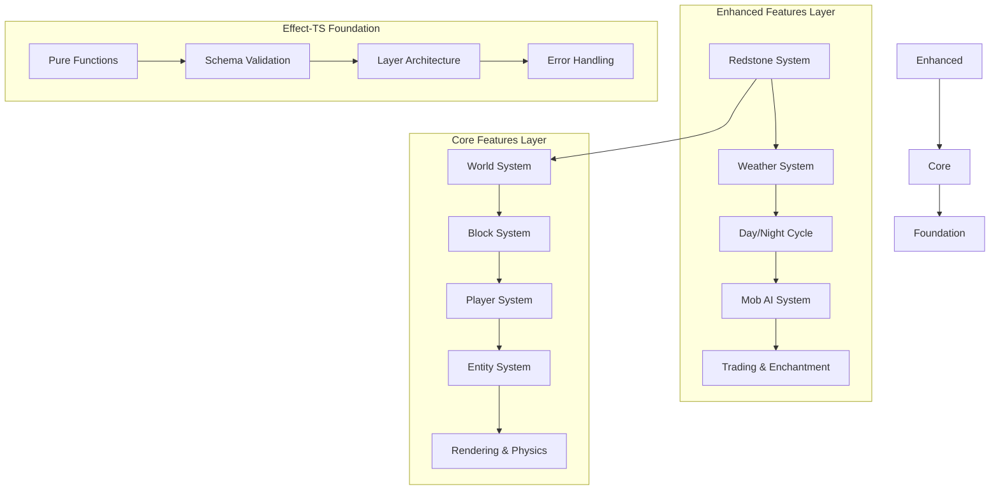

# TypeScript Minecraft Clone - Complete Documentation

## 🎮 プロジェクト概要

TypeScript で実装する本格的な Minecraft クローンです。**Effect-TS 3.17+** の最新パターン、**DDD（ドメイン駆動設計）**、**ECS（Entity Component System）** を活用した、型安全で拡張可能なアーキテクチャを採用しています。

純粋関数型プログラミングの原則に基づき、クラスベースの設計を排除し、すべての機能を合成可能な Effect として実装。モジュラーな設計により Core機能と Enhanced機能を明確に分離し、段階的な開発と拡張を可能にしています。

## ✨ 主要な特徴

- **🎯 純粋関数型設計**: クラス禁止、Effect-TSによる完全な関数型プログラミング
- **🚀 最新Effect-TSパターン**: Schema.Struct、@app/ServiceNameネームスペース採用
- **🏗️ DDD + ECS統合**: 境界づけられたコンテキスト × Structure of Arrays最適化
- **⚡ 高性能アーキテクチャ**: グリーディメッシング、視錐台カリング、並列処理
- **🔧 完全型安全**: Schema駆動開発とコンパイル時エラー検出
- **🎨 モジュラー拡張**: Core Features + Enhanced Featuresの段階的実装

## ⚠️ 重要：開発ガイドライン

### Effect-TS 使用時の必須事項

**2024年最新のEffect-TSパターンを必ず使用してください：**

```typescript
// ✅ 2024年最新パターンの例
import { Effect, Layer, Context, Schema, Match } from "effect"

// 1. Schema.Struct でデータ定義 (❌ class 禁止)
const Player = Schema.Struct({
  _tag: Schema.Literal("Player"),
  id: Schema.String.pipe(Schema.brand("PlayerId")),
  name: Schema.String,
  position: Vector3Schema
})
type Player = Schema.Schema.Type<typeof Player>

// 2. Context.GenericTag でサービス定義 (❌ Context.Tag 禁止)
const PlayerService = Context.GenericTag<PlayerService>("@app/PlayerService")

// 3. Match.value でパターンマッチング (❌ if/else/switch 禁止)
const handlePlayerAction = (action: PlayerAction) =>
  Match.value(action).pipe(
    Match.tag("Move", ({ direction }) => movePlayer(direction)),
    Match.tag("Jump", () => playerJump()),
    Match.exhaustive
  )

// 4. 早期リターンで最適化
const validatePlayer = (player: unknown): Effect.Effect<Player, ValidationError> => {
  if (!player || typeof player !== "object") {
    return Effect.fail(new ValidationError({ message: "Invalid player data" }))
  }
  return Schema.decodeUnknownEither(Player)(player).pipe(
    Effect.mapError(error => new ValidationError({ cause: error }))
  )
}
```

## 🚀 Quick Start

```bash
# 依存関係のインストール
pnpm install

# 開発サーバーの起動
pnpm dev

# ビルド
pnpm build

# テストの実行
pnpm test
```

## 技術スタック

### コアフレームワーク
- **[Effect-TS 3.17+](https://effect.website/)** - 関数型プログラミングエコシステム (最新パターン使用)
- **[TypeScript 5.6+](https://www.typescriptlang.org/)** - 型安全性とコンパイル時チェック
- **[Schema (Built-in)](https://effect.website/docs/schema/introduction)** - スキーマ駆動開発

### 3Dレンダリング
- **[Three.js](https://threejs.org/)** - WebGL 3Dレンダリングエンジン
- **WebGPU** - 次世代GPU API（実験的サポート）

### ビルドツール・開発環境
- **[Vite](https://vitejs.dev/)** - 高速バンドラー
- **[Vitest](https://vitest.dev/)** - テストランナー
- **[Oxlint](https://github.com/oxc-project/oxc)** - 高速リンター
- **[Prettier](https://prettier.io/)** - コードフォーマッター
- **[pnpm](https://pnpm.io/)** - パッケージマネージャー

### その他のライブラリ
- **simplex-noise** - プロシージャル地形生成
- **alea** - シード可能な乱数生成器
- **stats.js** - パフォーマンス監視
- **uuid** - ユニークID生成

## 🏠 アーキテクチャ概要

本プロジェクトは **DDD + ECS + Effect-TS 2024年最新パターン** の統合モデルです。

### 📜 開発原則

1. **純粋関数ファースト**: 副作用のない計算ロジックを優先
2. **早期リターン**: バリデーション段階での即座エラー処理
3. **単一責務**: 関数の細分化とテスタビリティ向上
4. **型安全性**: Schema駆動のコンパイル時エラー検出
5. **パフォーマンス**: 並列処理とメモリ最適化

### 4層アーキテクチャ

```
┌───────────────────────────────────┐
│        Presentation Layer         │  ← React + Effect-TS Hooks
│    (Controllers, Views, UI)     │
├───────────────────────────────────┤
│        Application Layer          │  ← UseCases + Workflows
│     (Effect.gen + Match.value)   │     (コマンドパターン)
├───────────────────────────────────┤
│          Domain Layer            │  ← Schema.Struct + Services
│   (Pure Functions + Validation) │     (Context.GenericTag)
├───────────────────────────────────┤
│       Infrastructure Layer       │  ← Three.js + WebGL Adapters
│      (Layer.effect + Ports)      │     (ECS + Physics Engine)
└───────────────────────────────────┘
```

### 設計原則

1. **関数型ファースト**: `class`構文や`this`キーワードを使用しない純粋関数型設計
2. **不変性**: すべてのデータ構造をimmutableとして扱う
3. **Effect系統合**: すべての操作をEffect型でラップし、合成可能なプログラムを構築
4. **依存性注入**: Effect-TSのLayerシステムによる型安全なDI
5. **エラーハンドリング**: タグ付きエラーシステムによる明示的なエラー管理

## ディレクトリ構造

```
ts-minecraft/
├── src/
│   ├── domain/           # ドメインレイヤー
│   │   ├── entities/     # エンティティとコンポーネント
│   │   ├── value-objects/# 値オブジェクト
│   │   ├── services/     # ドメインサービス
│   │   └── ports/        # ポート（インターフェース）
│   ├── application/      # アプリケーションレイヤー
│   │   ├── use-cases/    # ユースケース
│   │   ├── workflows/    # ワークフロー
│   │   └── queries/      # ECSクエリシステム
│   ├── infrastructure/   # インフラストラクチャレイヤー
│   │   ├── adapters/     # アダプター実装
│   │   ├── repositories/ # リポジトリ実装
│   │   └── workers/      # Web Worker実装
│   ├── presentation/     # プレゼンテーションレイヤー
│   │   ├── controllers/  # コントローラー
│   │   ├── view-models/  # ビューモデル
│   │   └── cli/          # CLI開発者ツール
│   ├── config/           # 設定管理
│   └── shared/           # 共通ユーティリティ
├── docs/                 # ドキュメント
│   ├── 00-introduction/
│   ├── 01-architecture/
│   ├── 02-guides/
│   ├── 03-systems/
│   └── 04-appendix/
└── tests/               # テストファイル
```

## クイックスタート

### 前提条件

- Node.js 18+ 
- pnpm 8+

### インストールと起動

```bash
# リポジトリをクローン
git clone https://github.com/takeokunn/ts-minecraft.git
cd ts-minecraft

# 依存関係をインストール
pnpm install

# 開発サーバーを起動
pnpm dev

# ブラウザで http://localhost:5173 にアクセス
```

### 開発用コマンド

```bash
# 型チェック
pnpm type-check

# テスト実行
pnpm test

# レイヤー別テスト
pnpm test:shared
pnpm test:infrastructure  
pnpm test:presentation

# カバレッジ付きテスト
pnpm test:coverage

# リント・フォーマット
pnpm lint
pnpm format

# プロダクションビルド
pnpm build
```

## 📚 ドキュメント構成

### 🏗️ アーキテクチャ基盤
- [**アーキテクチャ概要**](../01-architecture/00-overview.md) - システム全体設計と設計原則
- [**ECS統合**](../01-architecture/02-ddd-ecs-effect-integration.md) - DDD × ECS統合アーキテクチャ
- [**Effect-TSパターン**](../01-architecture/02-ddd-ecs-effect-integration.md) - 関数型プログラミングパターン

### 📋 実装ガイド
- [**開発環境セットアップ**](../02-guides/00-development-setup.md) - 環境構築・ツール設定
- [**Effect-TS基本パターン**](../01-architecture/02-ddd-ecs-effect-integration.md) - 最新パターンとベストプラクティス

### 🎮 Core Features（基本機能）

Minecraft クローンとして必須となる基本機能群。すべてEffect-TS 3.17+の最新パターンで実装。

- [**📋 概要**](../03-systems/00-core/00-overview.md) - Core機能の全体設計とアーキテクチャ原則
- [**🌍 World System**](../03-systems/00-core/01-world.md) - 地形生成・バイオーム・光源伝播
- [**👤 Player System**](../03-systems/00-core/02-player.md) - 移動・視点・操作・ステータス管理
- [**🧱 Block System**](../03-systems/00-core/03-block.md) - ブロックタイプ・状態・物理演算
- [**🤖 Entity System**](../03-systems/00-core/04-entity.md) - エンティティ・AI・スポーン・当たり判定
- [**🎨 Rendering System**](../03-systems/00-core/05-rendering.md) - メッシュ生成・LOD・視錐台カリング
- [**⚡ Physics System**](../03-systems/00-core/06-physics.md) - 重力・衝突・流体・爆発処理
- [**📦 Chunk System**](../03-systems/00-core/07-chunk.md) - チャンク管理・圧縮・並列処理
- [**🎒 Inventory System**](../03-systems/00-core/08-inventory.md) - アイテム・スタック・GUI連携
- [**🔨 Crafting System**](../03-systems/00-core/09-crafting.md) - レシピ・クラフト台・エンチャント

### 🚀 Enhanced Features（拡張機能）

基本機能を拡張し、より豊かなゲーム体験を提供する高度な機能群。

- [**📋 概要**](../03-systems/01-enhanced/00-overview.md) - Enhanced機能のアーキテクチャと統合設計
- [**⚡ Redstone System**](../03-systems/01-enhanced/01-redstone.md) - 論理回路・信号伝播・機械制御
- [**🌦️ Weather System**](../03-systems/01-enhanced/02-weather.md) - 動的天候・降水・雷・季節変化
- [**🌞 Day/Night Cycle**](../03-systems/01-enhanced/03-day-night-cycle.md) - 時間システム・天体軌道・光源計算
- [**🧠 Mob AI System**](../03-systems/01-enhanced/04-mob-ai.md) - 行動木AI・群れ行動・環境適応
- [**🏪 Villager Trading**](../03-systems/01-enhanced/05-villager-trading.md) - 動的価格・職業・評判システム
- [**✨ Enchantment System**](../03-systems/01-enhanced/06-enchantment.md) - エンチャント効果・レベル強化・耐久度
- [**🧪 Potion Effects**](../03-systems/01-enhanced/07-potion-effects.md) - 効果持続・相互作用・能力値変化
- [**🌋 Nether Portals**](../03-systems/01-enhanced/08-nether-portals.md) - 異次元移動・座標変換・ポータル管理

### 🔧 レイヤー別詳細ドキュメント
- [**Domain Layer**](../01-architecture/03-layer-architecture.md) - ビジネスロジック・エンティティ・値オブジェクト
- [**Application Layer**](../01-architecture/03-layer-architecture.md) - ユースケース・ワークフロー・ECSクエリ

## 🏗️ アーキテクチャ概要

### 統合アーキテクチャ: DDD × ECS × Effect-TS



### 4層アーキテクチャ

```
┌─────────────────────────────┐
│   🎮 Enhanced Features      │ ← 拡張機能（Redstone, Weather, AI）
├─────────────────────────────┤
│   🏗️ Core Features         │ ← 基本機能（World, Player, Block）
├─────────────────────────────┤
│   ⚡ Application Layer      │ ← ユースケース・ECSシステム
├─────────────────────────────┤
│   🔧 Domain Layer          │ ← ビジネスロジック・Pure Functions
└─────────────────────────────┘
```

### 実装優先順位とロードマップ

#### 🎯 Phase 1: Core Features 実装（必須機能）
1. **World System** → **Block System** → **Chunk System** （基盤）
2. **Player System** → **Physics System** → **Rendering System** （プレイヤー体験）
3. **Entity System** → **Inventory System** → **Crafting System** （拡張性）

#### 🚀 Phase 2: Enhanced Features 実装（拡張機能）
1. **Day/Night Cycle** → **Weather System** （環境システム）
2. **Redstone System** → **Mob AI System** （インタラクション）
3. **Enchantment System** → **Potion Effects** （プレイヤー強化）
4. **Villager Trading** → **Nether Portals** （高度な機能）

## 📊 プロジェクト進捗状況

### ✅ DDD + ECS アーキテクチャ移行完了

- **🎯 95%関数型プログラミング**: クラスベース → 純粋関数設計
- **⚡ Effect-TS 3.17+ 統合**: 最新パターン・Schema.Struct採用
- **🏗️ モジュラー設計**: Core/Enhanced機能の明確分離
- **🔧 型安全性強化**: Schema駆動開発・タグ付きエラー
- **📈 パフォーマンス最適化**: SoA ECS・グリーディメッシング

### 📋 ドキュメント完成状況

```
Core Features:     11/16+ 完成 (69%) ⚠️
Enhanced Features: 8/20+ 完成 (40%) ⚠️
不足機能分析:      1/1 完成 ✅
アーキテクチャ:      3/3 完成 ✅
実装ガイド:        1/1 完成 ✅
```

### ⚠️ 重要：未実装機能の存在

**現在のドキュメントは基本設計のみ。実際のMinecraft体験には多くの重要機能が不足：**

#### 🔥 **クリティカル不足機能**
- **Health & Hunger System**: プレイヤーの生存メカニズム
- **Combat System**: モンスター戦闘・ダメージ・死亡処理
- **Multiplayer Support**: ネットワーク・同期・コミュニケーション

#### 🏗️ **高優先度不足機能**
- **Structure Generation**: 村・ダンジョン・要塞・遺跡
- **Extended Biomes**: 海洋・山岳・特殊環境
- **The End Dimension**: エンダードラゴン・エンドシティ

**詳細**: [**不足機能一覧**](../04-appendix/00-missing-features.md)

### 🎯 修正されたマイルストーン

#### **Phase 1: サバイバル基盤（3-4ヶ月）**
1. **Health & Hunger System** - プレイヤー生存システム
2. **Combat System** - 戦闘・ダメージ処理
3. **Death & Respawn System** - 死亡・リスポーン機能

#### **Phase 2: 世界拡張（2-3ヶ月）**
4. **Structure Generation** - 構造物生成システム
5. **Extended Biome System** - バイオーム多様性
6. **The End Dimension** - エンドゲームコンテンツ

#### **Phase 3: マルチプレイヤー（4-6ヶ月）**
7. **Network Architecture** - マルチプレイヤー基盤
8. **Player Synchronization** - リアルタイム状態同期

#### **Phase 4: 体験向上（継続）**
9. **Achievement System** - 進捗・実績管理
10. **Advanced Gameplay** - 高度なゲームプレイ機能

## 🚀 開発者向けクイックスタートガイド

### 1. 環境セットアップ

```bash
# リポジトリをクローン
git clone https://github.com/takeokunn/ts-minecraft.git
cd ts-minecraft

# 依存関係をインストール
pnpm install

# 開発サーバーを起動
pnpm dev

# ブラウザで http://localhost:5173 にアクセス
```

### 2. 開発ワークフロー

```bash
# 型チェック（開発中は常に実行）
pnpm type-check

# テスト実行（TDD推奨）
pnpm test
pnpm test:watch  # ウォッチモード

# 新機能実装の基本フロー
pnpm test        # 既存テストの確認
# Schema定義 → Service実装 → Layer作成 → テスト作成
pnpm type-check  # 型安全性確認
pnpm test        # テスト実行
```

### 3. 実装時の参照順序

**新機能実装時は以下の順序で参照してください：**

1. **[Core Features概要](../03-systems/00-core/00-overview.md)** - 最新パターンとアーキテクチャ原則
2. **[Effect-TS基本パターン](../01-architecture/02-ddd-ecs-effect-integration.md)** - Schema.Struct、@app/Serviceパターン
3. **個別機能ドキュメント** - 具体的な実装例とベストプラクティス

### 4. 重要な開発原則

- **🚫 クラス禁止**: すべて純粋関数・Effect型で実装
- **📋 Schema First**: データ構造はSchema.Structで定義
- **🔧 Context7確認**: 外部パッケージ使用前に最新仕様を確認
- **⚡ Effect合成**: すべての操作をEffect.genパターンで実装
- **🧪 テスト駆動**: 実装前にテスト作成（TDD）

## 🤝 貢献ガイド

このプロジェクトは **Effect-TS × DDD × ECS** の統合的なアーキテクチャ探求を目的としています。

### 貢献時の注意事項

- **Effect-TS 3.17+** の最新パターンを使用
- **Pure Functions** のみでの実装
- **Schema駆動開発** の徹底
- **Performance First** の設計思想

Issue報告やプルリクエストを歓迎します！

## 📄 ライセンス

MIT License
