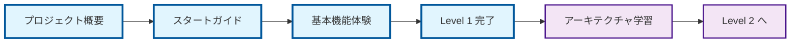

# はじめに（Level 1 推奨）

## 🧭 スマートナビゲーション

> **📍 現在位置**: ホーム → はじめに
> **🎯 学習目標**: プロジェクト全体像把握・環境構築完了
> **⏱️ 所要時間**: 15-20分

このセクションでは、TypeScript Minecraft Cloneプロジェクトの導入について説明します。

## 📊 学習パス概観

## 📚 ドキュメント一覧

### 🎯 Level 1 必須コンテンツ

- [**プロジェクト概要**](./00-project-overview.md): プロジェクトの目標、機能、アーキテクチャの概要です。
  - **前提知識**: なし（エントリーポイント）
  - **次のステップ**: [スタートガイド](./01-getting-started.md)
  - **関連項目**: [全体設計](../01-architecture/00-overall-design.md)、[開発規約](../03-guides/00-development-conventions.md)

- [**スタートガイド**](./01-getting-started.md): 開発環境のセットアップとプロジェクトの初回実行方法についてのガイドです。
  - **前提知識**: [プロジェクト概要](./00-project-overview.md)
  - **次のステップ**: [開発規約](../03-guides/00-development-conventions.md)
  - **関連項目**: [技術スタック](../01-architecture/03-technology-stack.md)、[エラー解決](../03-guides/04-error-resolution.md)

## 🎯 学習完了チェックリスト

- [ ] プロジェクトの目的と特徴を理解した
- [ ] 開発環境のセットアップが完了した
- [ ] プロジェクトの初回実行に成功した
- [ ] Effect-TS 3.17+の基本概念を把握した
- [ ] DDD×ECS×関数型アプローチの概要を理解した

## 🔗 関連セクション

### 📖 次に進むべきセクション
- **Level 2**: [アーキテクチャ](../01-architecture/README.md) - 設計思想と技術的詳細
- **実装準備**: [開発ガイド](../03-guides/README.md) - 実践的な開発手法

### 🔍 関連リファレンス
- [用語集](../04-appendix/00-glossary.md) - 技術用語の定義
- [全体設計](../01-architecture/00-overall-design.md) - システム全体の構造

## 🆘 困ったときは

### よくある質問
1. **環境構築でエラーが出る** → [エラー解決ガイド](../03-guides/04-error-resolution.md)
2. **Effect-TSが分からない** → [Effect-TSパターン](../01-architecture/06-effect-ts-patterns.md)
3. **プロジェクト全体が複雑すぎる** → [学習パス再確認](../README.md#学習パス（level-1-4）)

---

**✅ Level 1完了条件**: 上記チェックリスト全項目の達成 → [Level 2](../01-architecture/README.md)へ進む