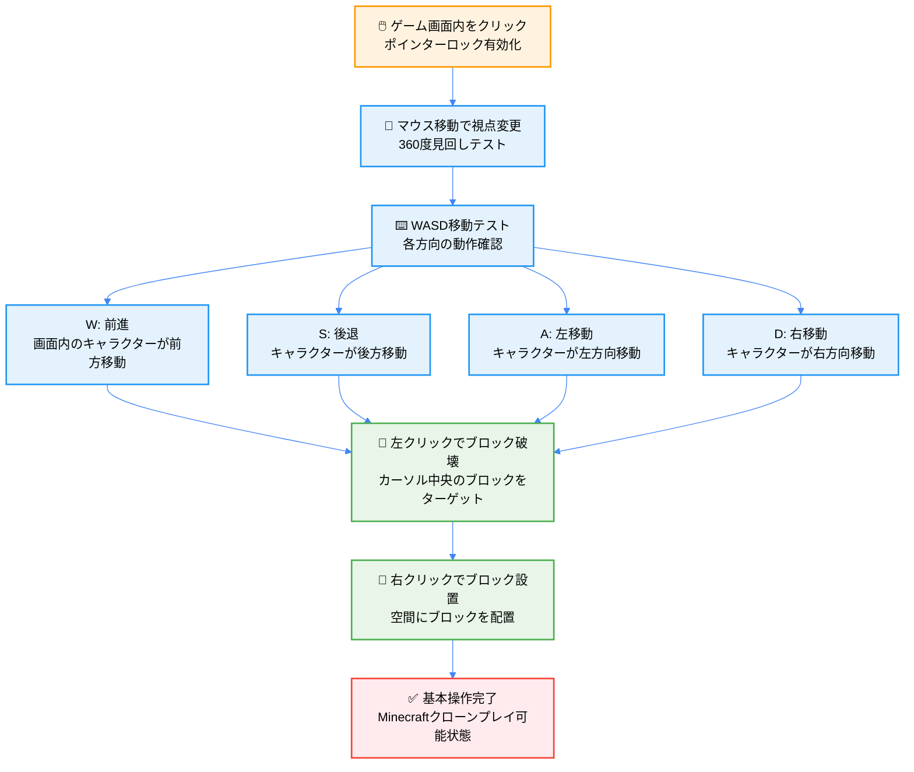
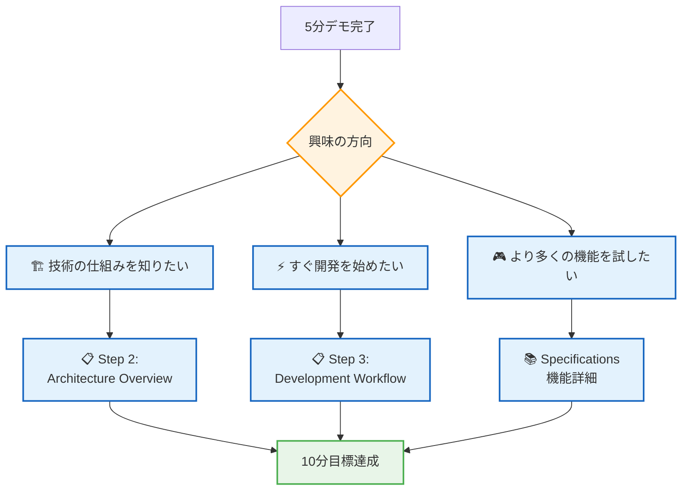

# 🚀 5分デモ - 即座にゲームを体験しよう

## 🧭 ナビゲーション

> **📍 現在位置**: [Quickstart Hub](./README.md) → **Step 1: 5分デモ体験**
> **🎯 目標**: ゲーム起動とMinecraftの基本操作を体験
> **⏱️ 所要時間**: 5分
> **📝 チェックポイント**: ゲーム画面でブロック操作が可能な状態

## ⚡ Progressive Setup - あなたのペースで進める

### 🎯 Quick Reference（1分でスタート）

```bash
# 最速確認チェック
node --version  # v18+ 必要
git --version   # Git利用可能性確認
```

<details>
<summary><strong>🔧 詳細セットアップ（4分完全版）</strong></summary>

### Step 1: 環境確認（30秒）

```bash
# Node.js版確認（必須：v18以上）
node --version
# ✅ 期待値: v18.17.0+ または v20.x.x または v22.x.x

# パッケージマネージャー確認
npm --version   # 標準版 (9.0.0+)
pnpm --version  # 高速版 (8.0.0+) 推奨
```

#### 🔍 環境診断自動スクリプト

```bash
# 総合環境チェック（コピペ実行）
echo "=== TypeScript Minecraft 環境診断 ==="
echo "Node.js: $(node --version 2>/dev/null || echo '❌ 未インストール')"
echo "pnpm: $(pnpm --version 2>/dev/null || echo '⚠️  未インストール（npm使用）')"
echo "Git: $(git --version 2>/dev/null || echo '❌ 未インストール')"
echo "ブラウザ: $(which google-chrome firefox safari 2>/dev/null | head -1 || echo '⚠️  要確認')"

if command -v node >/dev/null 2>&1; then
  node_version=$(node --version | sed 's/v//')
  major_version=$(echo $node_version | cut -d. -f1)
  if [ "$major_version" -ge 18 ]; then
    echo "✅ 環境診断: 準備完了！"
  else
    echo "❌ Node.js更新が必要: v18以上が必要です"
  fi
else
  echo "❌ Node.js インストールが必要です"
fi
```

**🆘 環境問題の解決**:

| 問題 | 解決法 | 所要時間 |
|------|--------|----------|
| Node.js v18未満 | [Node.js公式](https://nodejs.org/)からLTS版インストール | 2分 |
| pnpm未インストール | `npm install -g pnpm` | 1分 |
| Git未インストール | OS別: [Windows](https://git-scm.com/), [Mac](https://git-scm.com/download/mac) | 3分 |

</details>

### 🔽 Step 2: プロジェクト取得（1分）

#### 🎯 Quick Start

```bash
# 1行コマンド（最速）
git clone https://github.com/takeokunn/ts-minecraft.git && cd ts-minecraft
```

<details>
<summary><strong>📋 詳細なクローン手順</strong></summary>

```bash
# リポジトリクローン
git clone https://github.com/takeokunn/ts-minecraft.git

# プロジェクトディレクトリに移動
cd ts-minecraft

# 現在のブランチとファイル構成確認
ls -la
# 期待される表示:
# drwxr-xr-x  src/          - TypeScriptソースコード
# -rw-r--r--  package.json  - 依存関係定義
# -rw-r--r--  vite.config.ts - Vite設定
# -rw-r--r--  tsconfig.json - TypeScript設定
```

#### 🔍 プロジェクト構造確認

```bash
# 主要ディレクトリ確認
tree -d -L 2 src/ || find src -type d -maxdepth 2
# 期待される構造:
# src/
# ├── app/          # アプリケーション層
# ├── domain/       # ドメイン層
# └── infrastructure/ # インフラストラクチャ層
```

</details>

### 📦 Step 3: 依存関係インストール（2分）

#### 🚀 高速インストール

```bash
# pnpm推奨（高速・効率的）
pnpm install

# または npm標準版
npm install
```

#### 📊 インストール進行状況の理解

```bash
# 実際のインストール出力例
Progress: resolved 847, reused 823, downloaded 24, added 847, done

# 主要依存パッケージ確認
pnpm list --depth=0
```

<details>
<summary><strong>💡 主要パッケージの役割</strong></summary>

| パッケージ | バージョン | 役割 | 重要度 |
|------------|------------|------|--------|
| `effect` | 3.17.13+ | 関数型プログラミングコア | 🔴 必須 |
| `@effect/schema` | 0.75.5+ | 型安全データ検証 | 🔴 必須 |
| `three` | 0.179.1+ | 3Dレンダリングエンジン | 🔴 必須 |
| `vite` | 5.x.x | 高速開発サーバー | 🟡 開発 |
| `typescript` | 5.x.x | 型システム | 🔴 必須 |
| `vitest` | 2.x.x | テストフレームワーク | 🟡 開発 |

#### 🔧 インストール最適化オプション

```bash
# 本番依存のみ（軽量）
pnpm install --production

# キャッシュクリア後インストール（必要な場合）
pnpm store prune
rm -rf node_modules
pnpm install --force

# 依存関係チェック
pnpm audit
```

</details>

### 🌐 Step 4: 開発サーバー起動（30秒）

#### ⚡ 最速起動

```bash
# 開発サーバー起動
pnpm dev
```

#### 🎯 起動成功の確認

```bash
# 成功時の出力例
  VITE v7.1.5  ready in 1200 ms

  ➜  Local:   http://localhost:5173/    # ← このURLをクリック
  ➜  Network: use --host to expose
  ➜  press h + enter to show help
```

<details>
<summary><strong>🔧 起動オプション詳細</strong></summary>

```bash
# ポート指定起動
pnpm dev --port 3000

# ネットワーク公開起動（他デバイスからアクセス可能）
pnpm dev --host

# デバッグモード起動
pnpm dev --debug

# 本番モード確認
pnpm build && pnpm preview
```

#### 🌐 ブラウザアクセス確認

1. **自動起動**: 多くの環境で自動的にブラウザが開きます
2. **手動アクセス**: http://localhost:5173 をブラウザで開く
3. **モバイル確認**: `--host`オプション使用後、ローカルIPでアクセス

#### ⚠️ 起動エラー対処法

| エラー | 原因 | 解決法 |
|--------|------|--------|
| `Port 5173 is already in use` | ポート競合 | `pnpm dev --port 3000` |
| `Cannot resolve dependency` | 依存関係問題 | `rm -rf node_modules && pnpm install` |
| `TypeScript errors` | 型エラー | `pnpm type-check` で詳細確認 |

</details>

## 🎮 基本操作マスター - Interactive Tutorial

### 🎯 Quick Reference（30秒）

```bash
# ゲーム画面でのキー操作
WASD: 移動    マウス: 視点    左クリック: 破壊    右クリック: 設置
```

<details>
<summary><strong>🎮 インタラクティブ操作ガイド</strong></summary>

### 🕹️ ステップバイステップ操作フロー



#### 🎯 詳細操作表

| 操作分類 | キー/マウス | 動作詳細 | 視覚的フィードバック | トラブルシューティング |
|----------|-------------|----------|----------------------|------------------------|
| **カメラ制御** | マウス移動 | 3D視点回転（First Person） | クロスヘア中央移動 | ポインターロック失敗時は再クリック |
| **基本移動** | W | 前方移動（現在視線方向） | キャラクター前進、地面との相対位置変化 | 移動しない場合は画面フォーカス確認 |
| | S | 後方移動（視線逆方向） | キャラクター後退 | |
| | A | 左ストラフ移動 | 視線方向維持しつつ左移動 | |
| | D | 右ストラフ移動 | 視線方向維持しつつ右移動 | |
| **ブロック操作** | 左クリック | ブロック破壊（除去） | ブロック消失 + パーティクル効果 | ターゲットブロックなしの場合は無反応 |
| | 右クリック | ブロック設置（配置） | 新ブロック出現 | 設置不可位置では無反応 |

### 🎮 実践練習シーケンス

#### 1️⃣ **視点制御マスター**（10秒）
```
手順:
1. ゲーム画面をクリックしてポインターロックを有効化
2. マウスを上下左右に動かして360度見回し
3. 空、地面、周囲のブロックを確認

確認ポイント:
✅ クロスヘアが画面中央に表示
✅ マウス移動に追従してカメラが回転
✅ マウスカーソルが画面外に出ない（ロック状態）
```

#### 2️⃣ **移動システムマスター**（15秒）
```
手順:
1. W キーを押して前進（数歩進む）
2. S キーを押して後退（元の位置近くに戻る）
3. A キーで左移動、D キーで右移動
4. WASD組み合わせで対角移動テスト

確認ポイント:
✅ 各方向への確実な移動
✅ 視線方向とは独立した移動
✅ スムーズな移動アニメーション
```

#### 3️⃣ **ブロック操作マスター**（15秒）
```
手順:
1. 破壊対象ブロックを画面中央（クロスヘア）に合わせる
2. 左クリック長押しでブロック破壊
3. 空いた空間または別の場所で右クリック
4. 新しいブロックが設置されることを確認

確認ポイント:
✅ ブロック破壊時の視覚効果
✅ ブロック設置時の配置精度
✅ 連続操作での反応性
```

#### 4️⃣ **総合操作テスト**（20秒）
```
実践課題:
1. 移動しながらブロックを破壊
2. 異なる角度からブロックを設置
3. 簡単な構造物（壁など）を作成
4. 作成した構造物を破壊

マスター条件:
✅ 流暢な移動とブロック操作の組み合わせ
✅ 意図した場所への正確な設置
✅ 効率的な破壊と構築のワークフロー
```

</details>

### 🎯 実際のゲームプレイ体験

<details>
<summary><strong>🎮 実行可能なミニゲーム例</strong></summary>

#### 🏗️ **Challenge 1: 簡単な建築**

```typescript
// ゲーム内で実践できるコード例（概念的）
interface BuildingChallenge {
  目標: "3x3x3の立方体を構築"
  制約: {
    使用ブロック数: 27,
    制限時間: "2分",
    難易度: "初級"
  }
  手順: [
    "1. 地面に3x3の基礎を作る（9ブロック）",
    "2. 4つの角に柱を3ブロック積む（12ブロック）",
    "3. 上部に3x3の屋根を作る（6ブロック）"
  ]
}
```

**実際の操作手順**:
1. 地面に立って、右クリックでブロック設置
2. WASDで移動しながら3x3グリッドを完成
3. ブロック上で右クリックして上に積み重ね
4. 完成時のスクリーンショット撮影（推奨）

#### 🎯 **Challenge 2: 破壊と再構築**

```javascript
// 練習シナリオ
const destructionChallenge = {
  phase1: "既存構造の一部を破壊（左クリック）",
  phase2: "異なるデザインで再構築（右クリック）",
  phase3: "移動を活用した効率的な作業フロー"
}
```

</details>

## 🎯 5分体験チェックリスト

### ✅ 必須達成項目

- [ ] **🌐 ゲーム画面表示**: ブラウザでMinecraft世界が表示
- [ ] **👀 視点変更**: マウス移動でカメラが回転
- [ ] **🚶‍♂️ キャラクター移動**: WASDキーで移動可能
- [ ] **🔨 ブロック破壊**: 左クリックでブロックを破壊
- [ ] **🧱 ブロック設置**: 右クリックでブロックを設置

### 🎊 体験成功！

上記すべてにチェックが入った方は、**TypeScript Minecraft Cloneの基本機能を完全に体験できました！**

## 🔧 トラブルシューティング

### ⚠️ よくある問題と解決法

#### 🚫 問題1: `pnpm install`でエラー

**症状**: パッケージインストールに失敗
```bash
Error: Cannot install dependencies
```

**解決法**:
```bash
# Node.js バージョン確認・更新
node --version  # v18+ 必要
# npmでの代替実行
pnpm install
```

#### 🚫 問題2: ブラウザで画面が真っ白

**症状**: http://localhost:5173 にアクセスしても何も表示されない

**解決法**:
```bash
# 1. 開発者ツールでエラー確認
# F12キー → Consoleタブ確認

# 2. サーバー再起動
Ctrl+C (サーバー停止)
pnpm dev (再起動)

# 3. ブラウザキャッシュクリア
Shift+F5 または Ctrl+Shift+R
```

#### 🚫 問題3: キー操作が効かない

**症状**: WASD、マウス操作に反応しない

**解決法**:
1. **ブラウザフォーカス確認**: ゲーム画面を一度クリック
2. **別ブラウザで試行**: Chrome、Firefox、Safariで確認
3. **F12でエラーログ確認**: JavaScriptエラーがないか確認

## 🎉 完了！次のステップ

### 🌟 体験成功おめでとうございます！

あなたは今、以下を達成しました：

```typescript
interface Demo5MinAchievement {
  technical: {
    gameRunning: true      // ゲーム正常動作
    controlsMastered: true // 基本操作習得
    environmentReady: true // ローカル環境準備完了
  }
  understanding: {
    minecraftGameplay: true    // Minecraftゲームプレイ理解
    webTechnology: true       // Web技術での実装理解
    interactiveExperience: true // インタラクティブ体験
  }
}
```

### 🔄 次におすすめのステップ



#### 🎯 推奨継続パス

1. **🏗️ アーキテクチャ理解**: [Step 2: Architecture Overview](./02-architecture-overview.md)
2. **⚡ 開発環境準備**: [Step 3: Development Workflow](./03-development-workflow.md)
3. **🧠 概念整理**: [Step 4: Key Concepts](./04-key-concepts.md)

### 🔗 関連リンク

- **🏠 Quickstart Hub**: [戻る](./README.md) - 全体ロードマップ確認
- **📚 Introduction**: [詳細学習開始](../00-introduction/README.md)
- **🆘 トラブルシューティング**: [エラー解決ガイド](../03-guides/04-error-resolution.md)

---

### 🎊 **素晴らしい！5分でMinecraftを体験できました**

**この成功体験を基に、TypeScript × Effect-TS × ゲーム開発の世界をさらに探求していきましょう！**

---

*📍 ドキュメント階層*: **[Home](../../README.md)** → **[Quickstart Hub](./README.md)** → **Step 1: 5分デモ体験**