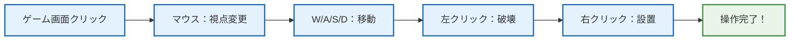
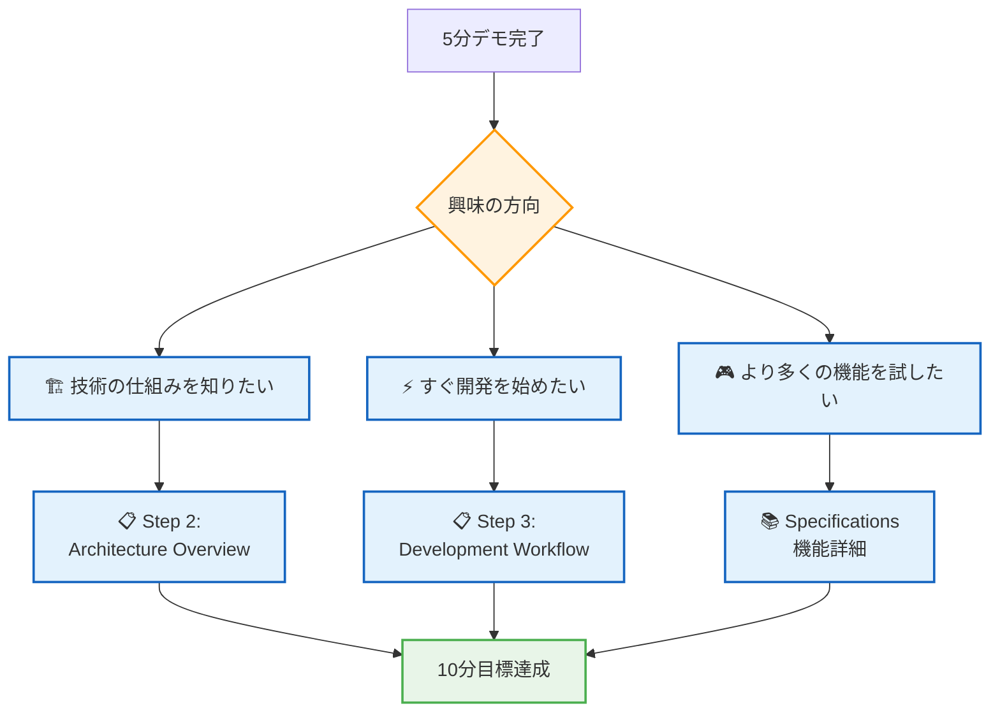

# 🚀 5分デモ - 即座にゲームを体験しよう

## 🧭 ナビゲーション

> **📍 現在位置**: [Quickstart Hub](./README.md) → **Step 1: 5分デモ体験**
> **🎯 目標**: ゲーム起動とMinecraftの基本操作を体験
> **⏱️ 所要時間**: 5分
> **📝 チェックポイント**: ゲーム画面でブロック操作が可能な状態

## ⚡ 超高速セットアップ（4分）

### 🔧 Step 1: 環境確認（30秒）

```bash
# Node.js版確認（必須：v18以上）
node --version
# 期待値例: v18.17.0 または v20.x.x

# パッケージマネージャー確認
npm --version   # 基本版
pnpm --version  # 高速版（推奨）
```

**🆘 Node.js v18未満の場合**:
- [Node.js公式](https://nodejs.org/)からLTS版をダウンロード・インストール

### 🔽 Step 2: プロジェクト取得（1分）

```bash
# リポジトリクローン
git clone https://github.com/takeokunn/ts-minecraft.git
cd ts-minecraft
```

### 📦 Step 3: 依存関係インストール（2分）

```bash
# 高速インストール（推奨）
ppnpm install

# または標準インストール
pnpm install
```

**💡 インストール中に表示される主要パッケージ**:
- `effect@3.17.13` - Effect-TS コアライブラリ
- `three@0.179.1` - 3Dレンダリングエンジン
- `@effect/schema@0.75.5` - スキーマ検証

### 🌐 Step 4: 開発サーバー起動（30秒）

```bash
# 開発サーバー起動
pnpm dev
# または
pnpm dev
```

**成功時の出力例**:
```bash
  VITE v7.1.5  ready in 1200 ms

  ➜  Local:   http://localhost:5173/
  ➜  Network: use --host to expose
  ➜  press h + enter to show help
```

**🌐 ブラウザで自動的に http://localhost:5173 が開きます**

## 🎮 基本操作マスター（1分）

### 🕹️ コントロール一覧



#### 🎯 基本操作

| 操作 | キー/マウス | 動作 | 確認方法 |
|------|-------------|------|----------|
| **視点変更** | マウス移動 | カメラ回転 | 360度見回し可能 |
| **前進** | W | 前方移動 | キャラクター前進 |
| **後退** | S | 後方移動 | キャラクター後退 |
| **左移動** | A | 左方向移動 | 横方向移動 |
| **右移動** | D | 右方向移動 | 横方向移動 |
| **ブロック破壊** | 左クリック | ブロック除去 | ブロックが消える |
| **ブロック設置** | 右クリック | ブロック配置 | 新ブロック出現 |

## 🎯 5分体験チェックリスト

### ✅ 必須達成項目

- [ ] **🌐 ゲーム画面表示**: ブラウザでMinecraft世界が表示
- [ ] **👀 視点変更**: マウス移動でカメラが回転
- [ ] **🚶‍♂️ キャラクター移動**: WASDキーで移動可能
- [ ] **🔨 ブロック破壊**: 左クリックでブロックを破壊
- [ ] **🧱 ブロック設置**: 右クリックでブロックを設置

### 🎊 体験成功！

上記すべてにチェックが入った方は、**TypeScript Minecraft Cloneの基本機能を完全に体験できました！**

## 🔧 トラブルシューティング

### ⚠️ よくある問題と解決法

#### 🚫 問題1: `ppnpm install`でエラー

**症状**: パッケージインストールに失敗
```bash
Error: Cannot install dependencies
```

**解決法**:
```bash
# Node.js バージョン確認・更新
node --version  # v18+ 必要
# npmでの代替実行
pnpm install
```

#### 🚫 問題2: ブラウザで画面が真っ白

**症状**: http://localhost:5173 にアクセスしても何も表示されない

**解決法**:
```bash
# 1. 開発者ツールでエラー確認
# F12キー → Consoleタブ確認

# 2. サーバー再起動
Ctrl+C (サーバー停止)
pnpm dev (再起動)

# 3. ブラウザキャッシュクリア
Shift+F5 または Ctrl+Shift+R
```

#### 🚫 問題3: キー操作が効かない

**症状**: WASD、マウス操作に反応しない

**解決法**:
1. **ブラウザフォーカス確認**: ゲーム画面を一度クリック
2. **別ブラウザで試行**: Chrome、Firefox、Safariで確認
3. **F12でエラーログ確認**: JavaScriptエラーがないか確認

## 🎉 完了！次のステップ

### 🌟 体験成功おめでとうございます！

あなたは今、以下を達成しました：

```typescript
interface Demo5MinAchievement {
  technical: {
    gameRunning: true      // ゲーム正常動作
    controlsMastered: true // 基本操作習得
    environmentReady: true // ローカル環境準備完了
  }
  understanding: {
    minecraftGameplay: true    // Minecraftゲームプレイ理解
    webTechnology: true       // Web技術での実装理解
    interactiveExperience: true // インタラクティブ体験
  }
}
```

### 🔄 次におすすめのステップ



#### 🎯 推奨継続パス

1. **🏗️ アーキテクチャ理解**: [Step 2: Architecture Overview](./02-architecture-overview.md)
2. **⚡ 開発環境準備**: [Step 3: Development Workflow](./03-development-workflow.md)
3. **🧠 概念整理**: [Step 4: Key Concepts](./04-key-concepts.md)

### 🔗 関連リンク

- **🏠 Quickstart Hub**: [戻る](./README.md) - 全体ロードマップ確認
- **📚 Introduction**: [詳細学習開始](../00-introduction/README.md)
- **🆘 トラブルシューティング**: [エラー解決ガイド](../03-guides/04-error-resolution.md)

---

### 🎊 **素晴らしい！5分でMinecraftを体験できました**

**この成功体験を基に、TypeScript × Effect-TS × ゲーム開発の世界をさらに探求していきましょう！**

---

*📍 ドキュメント階層*: **[Home](../../README.md)** → **[Quickstart Hub](./README.md)** → **Step 1: 5分デモ体験**