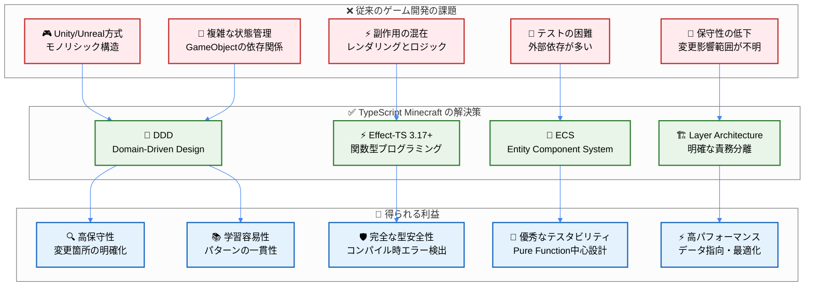
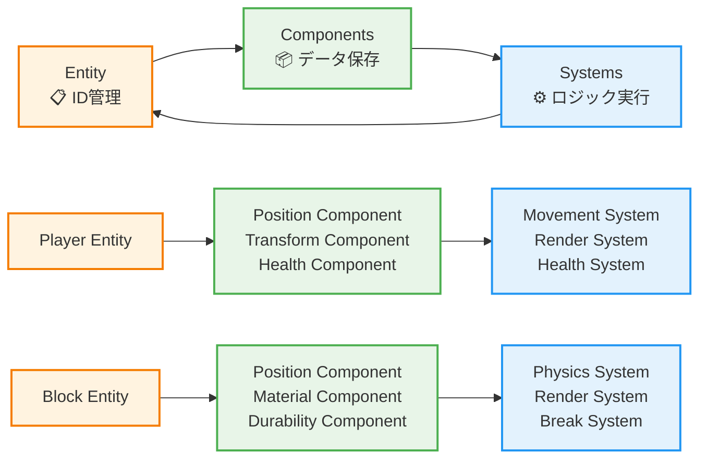
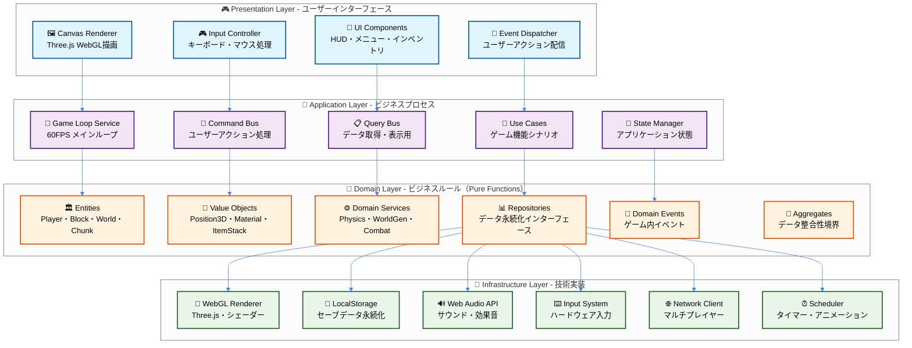
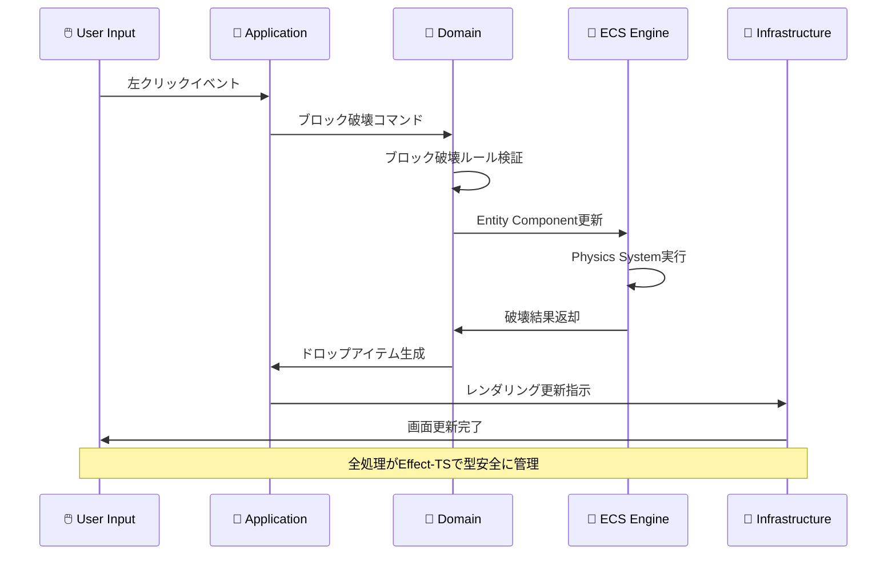
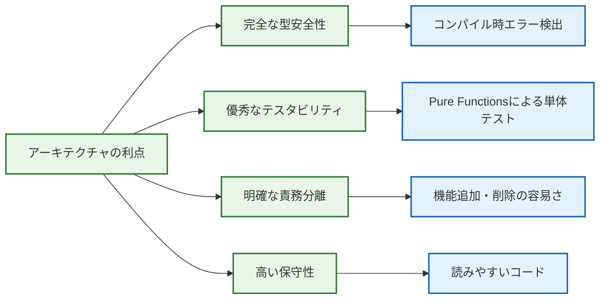

# 🏗️ アーキテクチャ概観 - 革新的設計の理解

## 🧭 ナビゲーション

> **📍 現在位置**: [Quickstart Hub](./README.md) → **Step 2: アーキテクチャ理解**
> **🎯 目標**: DDD×ECS×Effect-TSの統合設計思想を理解
> **⏱️ 所要時間**: 5分
> **📝 前提**: [5分デモ体験](./01-5min-demo.md)完了
> **📚 継続**: [開発フロー理解](./03-development-workflow.md)

## 🌟 革新的アーキテクチャの全体像

### 🎯 Quick Reference - 設計選択の理由

```bash
# 従来の問題 → 私たちの解決法
複雑な状態管理 → DDD (ドメイン駆動設計)
副作用の混在 → Effect-TS (関数型プログラミング)
テストの困難 → Pure Functions (副作用分離)
保守性の低下 → ECS (エンティティコンポーネントシステム)
```

<details>
<summary><strong>🏗️ 詳細アーキテクチャ分析図</strong></summary>

### 🔄 問題解決の全体フロー



### 📊 競合技術との比較分析

| 観点 | Unity + C# | Unreal + C++ | **TypeScript Minecraft** |
|------|------------|--------------|-------------------------|
| **学習コスト** | 高（エディタ習得必要） | 非常に高（C++複雑性） | **中（Web技術ベース）** |
| **型安全性** | 中（実行時エラー可能） | 高（コンパイル時チェック） | **非常に高（Effect-TS）** |
| **テスタビリティ** | 低（モノリシック） | 低（依存関係複雑） | **高（Pure Functions）** |
| **パフォーマンス** | 高（ネイティブ） | 非常に高（最適化） | **中〜高（Web最適化）** |
| **開発速度** | 中（エディタ依存） | 低（コンパイル時間） | **高（ホットリロード）** |
| **保守性** | 低（GUI依存状態） | 低（C++複雑性） | **非常に高（関数型）** |
| **クロスプラットフォーム** | 中（ビルド設定） | 中（プラットフォーム別） | **高（ブラウザ標準）** |

</details>

<details>
<summary><strong>🎓 Expert Notes: アーキテクチャ深化ポイント</strong></summary>

### 🔬 技術選択の詳細根拠

#### 🎯 **DDD選択理由**
- **境界づけられたコンテキスト**: プレイヤー管理・ワールド生成・物理演算などの独立性確保
- **ユビキタス言語**: ゲーム開発者とドメインエキスパート（Minecraft知識者）の共通言語
- **戦略的設計**: コア・サポート・汎用ドメインの明確な分離による開発効率化

#### ⚡ **Effect-TS 3.17+ 選択理由**
- **Schema.Struct**: ゲームデータの実行時検証・型推論・シリアライゼーション自動化
- **Context.GenericTag**: 依存性注入による高テスタビリティとモック容易性
- **Effect.gen**: 非同期ゲームループの可読性向上と例外安全性

#### 🎲 **ECS選択理由**
- **データ指向設計**: キャッシュ効率の最大化による60FPSゲームループ維持
- **コンポーネント組み合わせ**: 新エンティティ作成の柔軟性（例：FlyingPlayer = Player + Flying）
- **システム独立性**: レンダリング・物理・AI等の機能追加・削除の容易性

### 🧪 実装パターンの科学的根拠

#### 📊 **メモリ効率化**
```typescript
// ECS による Cache-Friendly なメモリレイアウト
interface ComponentArrays {
  positions: Float32Array    // 連続メモリ配置
  velocities: Float32Array   // SIMD最適化対応
  renderables: Uint32Array   // GPUバッファ直結
}
```

#### 🔄 **並行処理最適化**
```typescript
// Effect-TS による安全な並行実行
const gameLoop = Effect.gen(function* (_) {
  const [physics, rendering, ai] = yield* _(
    Effect.all([
      physicsSystem,
      renderingSystem,
      aiSystem
    ], { concurrency: "unbounded" })
  )
})
```

</details>

## 🔮 三大設計原則の融合

### 1️⃣ **DDD (Domain-Driven Design)** - ビジネスロジックの中核

```typescript
// ドメインの例：ブロックシステム
export interface Block {
  readonly id: BlockId
  readonly position: Position3D
  readonly material: BlockMaterial
  readonly metadata: BlockMetadata
}

// ドメインサービス：ブロック破壊ロジック
export const breakBlock = (
  block: Block,
  tool: Tool,
  player: Player
): Effect.Effect<BlockBreakResult, BlockBreakError> =>
  Effect.gen(function* (_) {
    const breakTime = yield* _(calculateBreakTime(block.material, tool))
    const drops = yield* _(calculateDrops(block, tool))
    return { breakTime, drops, experience: calculateExperience(block) }
  })
```

**🎯 DDD のメリット**:
- **ドメインエキスパート**（Minecraft知識者）との対話促進
- **境界づけられたコンテキスト**による機能分離
- **ユビキタス言語**での一貫した用語使用

### 2️⃣ **ECS (Entity Component System)** - ゲームオブジェクト管理



**🎯 ECS のメリット**:
- **データ指向設計**：高パフォーマンスなメモリレイアウト
- **コンポーネント組み合わせ**：柔軟なエンティティ構成
- **システム独立性**：機能追加・削除の容易さ

### 3️⃣ **Effect-TS 3.17+** - 関数型プログラミングの力

```typescript
// 副作用を型レベルで管理
export const generateWorld = (
  seed: WorldSeed,
  size: WorldSize
): Effect.Effect<World, WorldGenerationError, Random | FileSystem> =>
  Effect.gen(function* (_) {
    // 乱数生成サービスを使用
    const noise = yield* _(Random.nextIntBetween(0, 1000))

    // ファイルシステムサービスでキャッシュ確認
    const cached = yield* _(
      FileSystem.readFile(`worlds/${seed.value}.cache`),
      Effect.catchAll(() => Effect.succeed(null))
    )

    if (cached) {
      return yield* _(deserializeWorld(cached))
    }

    // 新規世界生成
    const world = yield* _(generateTerrain(seed, noise, size))
    yield* _(FileSystem.writeFile(`worlds/${seed.value}.cache`, serialize(world)))

    return world
  })
```

**🎯 Effect-TS のメリット**:
- **型安全な副作用管理**：エラーも型で表現
- **依存性注入**：テスタブルなサービス設計
- **パイプライン処理**：読みやすい非同期処理

## 🏛️ レイヤーアーキテクチャ詳細

### 🎯 Quick Reference - レイヤー責務

```bash
🎮 Presentation: UI・入力・表示
🚀 Application: ビジネスプロセス・ワークフロー
💎 Domain: ビジネスルール・エンティティ（Pure）
🔧 Infrastructure: 外部サービス・技術詳細
```

<details>
<summary><strong>🏗️ 詳細レイヤー構造と実装例</strong></summary>

### 🎯 4層アーキテクチャの全体図



### 📋 各レイヤーの詳細実装例

#### 🎮 **Presentation Layer** - 表示・入力担当

```typescript
// Canvas Renderer の実装例
export const CanvasRenderer = Context.GenericTag<{
  readonly render: (scene: GameScene) => Effect.Effect<void, RenderError>
  readonly resize: (width: number, height: number) => Effect.Effect<void, never>
  readonly dispose: () => Effect.Effect<void, never>
}>("@app/CanvasRenderer")

// Input Controller の実装例
export const InputController = Context.GenericTag<{
  readonly getCurrentInput: () => Effect.Effect<PlayerInput, never>
  readonly subscribe: (handler: (input: PlayerInput) => void) => Effect.Effect<void, never>
}>("@app/InputController")
```

#### 🚀 **Application Layer** - ワークフロー・調整担当

```typescript
// Game Loop Service の実装例
export const GameLoopService = Context.GenericTag<{
  readonly start: () => Effect.Effect<void, GameLoopError>
  readonly stop: () => Effect.Effect<void, never>
  readonly tick: (deltaTime: number) => Effect.Effect<void, GameLoopError>
}>("@app/GameLoopService")

// Use Case の実装例（ブロック設置）
export const placeBlockUseCase = (
  position: Position3D,
  blockType: BlockType,
  playerId: PlayerId
): Effect.Effect<PlaceBlockResult, PlaceBlockError, WorldService | PlayerService> =>
  Effect.gen(function* (_) {
    const worldService = yield* _(WorldService)
    const playerService = yield* _(PlayerService)

    // 1. プレイヤー権限確認
    const player = yield* _(playerService.getById(playerId))
    yield* _(validatePlacePermission(position, player))

    // 2. ワールド状態確認
    const currentBlock = yield* _(worldService.getBlockAt(position))
    yield* _(validatePlacementSpace(currentBlock))

    // 3. ブロック設置実行
    const newBlock = yield* _(createBlock(blockType, position))
    yield* _(worldService.setBlockAt(position, newBlock))

    return { success: true, block: newBlock }
  })
```

#### 💎 **Domain Layer** - ビジネスルール（Pure Functions）

```typescript
// Entity の実装例
export const PlayerSchema = Schema.Struct({
  id: Schema.String,
  position: Position3DSchema,
  health: Schema.Number.pipe(Schema.between(0, 100)),
  inventory: Schema.Array(ItemStackSchema),
  gameMode: Schema.Union(
    Schema.Literal("creative"),
    Schema.Literal("survival"),
    Schema.Literal("adventure")
  )
})

// Domain Service の実装例
export const PhysicsService = Context.GenericTag<{
  readonly applyGravity: (entity: Entity) => Effect.Effect<Entity, never>
  readonly checkCollision: (entity: Entity, world: World) => Effect.Effect<boolean, never>
  readonly calculateMovement: (input: MovementInput) => Effect.Effect<Position3D, MovementError>
}>("@domain/PhysicsService")
```

#### 🔧 **Infrastructure Layer** - 技術実装担当

```typescript
// WebGL Renderer の実装例
export const LiveWebGLRenderer: Layer.Layer<CanvasRenderer> = Layer.succeed(
  CanvasRenderer,
  {
    render: (scene) =>
      Effect.gen(function* (_) {
        // Three.js による実際の描画処理
        const renderer = yield* _(getThreeRenderer)
        const camera = yield* _(getCurrentCamera)

        renderer.render(scene.threeScene, camera)

        yield* _(Effect.sync(() => {
          // WebGL の状態管理
          renderer.setSize(window.innerWidth, window.innerHeight)
          renderer.setClearColor(0x87CEEB, 1.0) // スカイブルー
        }))
      }),

    resize: (width, height) =>
      Effect.sync(() => {
        renderer.setSize(width, height)
        camera.aspect = width / height
        camera.updateProjectionMatrix()
      }),

    dispose: () =>
      Effect.sync(() => {
        renderer.dispose()
        // WebGL リソース解放
      })
  }
)
```

### 🔄 レイヤー間通信パターン

```typescript
// 典型的なレイヤー間データフロー例
export const handlePlayerAction = (action: PlayerAction): Effect.Effect<void, GameError, AllServices> =>
  Effect.gen(function* (_) {
    // 1. Presentation -> Application
    const input = yield* _(InputController.getCurrentInput())

    // 2. Application -> Domain (Use Case実行)
    const result = yield* _(executePlayerAction(input, action))

    // 3. Domain -> Infrastructure (永続化)
    yield* _(WorldRepository.save(result.updatedWorld))

    // 4. Infrastructure -> Presentation (表示更新)
    yield* _(CanvasRenderer.render(result.gameScene))
  })
```

</details>

### 📋 各レイヤーの責務

| レイヤー | 主な責務 | Effect-TS活用ポイント | 実装例 |
|----------|----------|-----------------------|-------|
| **Presentation** | UI・レンダリング・入力 | Effect.runSync でUI更新 | Canvas描画、キーイベント |
| **Application** | ビジネスプロセス調整 | Effect.gen でワークフロー | ゲームループ、コマンド処理 |
| **Domain** | ビジネスルール・エンティティ | Pure Functions中心 | ブロック破壊ルール、物理法則 |
| **Infrastructure** | 外部サービス・技術詳細 | Effect Services | WebGL、LocalStorage、音声 |

## 🔄 データフローの実際

### 🎮 典型的な操作：「ブロック破壊」の処理フロー



## 🧠 5分理解チェックリスト

### ✅ アーキテクチャ理解度確認

#### 🏗️ **DDD理解**
- [ ] **ドメインモデル**: ゲーム内概念（Block、Player等）を理解
- [ ] **境界づけられたコンテキスト**: 機能領域分割を理解
- [ ] **ドメインサービス**: ビジネスロジック配置場所を理解

#### 🎲 **ECS理解**
- [ ] **Entity**: IDによるオブジェクト管理を理解
- [ ] **Component**: データとロジック分離を理解
- [ ] **System**: 処理ループとクエリを理解

#### ⚡ **Effect-TS理解**
- [ ] **副作用管理**: 型レベルでの副作用表現を理解
- [ ] **依存性注入**: サービス設計パターンを理解
- [ ] **エラーハンドリング**: 型安全なエラー処理を理解

## 🎯 実際のコード構造例

```typescript
// 実際のプロジェクト構造（簡略版）
interface MinecraftArchitecture {
  // Presentation Layer
  presentation: {
    canvas: CanvasRenderer
    input: InputController
    ui: GameUI
  }

  // Application Layer
  application: {
    gameLoop: Effect.Effect<void, never, GameServices>
    commandBus: CommandBus<GameCommands>
    queryBus: QueryBus<GameQueries>
  }

  // Domain Layer
  domain: {
    entities: {
      player: Player
      block: Block
      world: World
    }
    services: {
      physics: PhysicsService
      worldGen: WorldGenerationService
    }
  }

  // Infrastructure Layer
  infrastructure: {
    rendering: WebGLRenderer
    storage: LocalStorageRepository
    audio: WebAudioService
  }
}
```

## 🌟 なぜこのアーキテクチャが優秀なのか？

### 🎊 開発者体験の向上



## 🔗 次のステップ

### 🎉 アーキテクチャ理解完了！

```typescript
interface ArchitectureUnderstanding {
  concepts: {
    ddd: "ドメイン駆動設計の基本理解完了"
    ecs: "エンティティコンポーネントシステム理解完了"
    effectTS: "Effect-TS 3.17+パターン理解完了"
  }
  benefits: {
    typeSafety: "型安全性の価値を理解"
    testability: "テスタビリティの重要性を理解"
    maintainability: "保守性向上の仕組みを理解"
  }
  readyFor: "実際の開発フロー習得"
}
```

### 🚀 推奨継続パス

1. **⚡ すぐ開発開始**: [Step 3: Development Workflow](./03-development-workflow.md)
2. **🧠 概念整理**: [Step 4: Key Concepts](./04-key-concepts.md)
3. **📚 詳細理解**: [Architecture詳細](../01-architecture/README.md)

### 🎯 理解深化のための関連リンク

- **🏗️ Architecture詳細**: [DDD Strategic Design](../01-architecture/02-ddd-strategic-design.md)
- **🎲 ECS詳細**: [ECS Integration](../01-architecture/05-ecs-integration.md)
- **⚡ Effect-TS詳細**: [Effect-TS Patterns](../01-architecture/06-effect-ts-patterns.md)

---

### 🎊 **素晴らしい！革新的アーキテクチャを理解できました**

**DDD×ECS×Effect-TSの統合により、従来のゲーム開発の課題を解決する設計思想を学びました。次は実際の開発フローを体験しましょう！**

---

*📍 ドキュメント階層*: **[Home](../../README.md)** → **[Quickstart Hub](./README.md)** → **Step 2: アーキテクチャ理解**