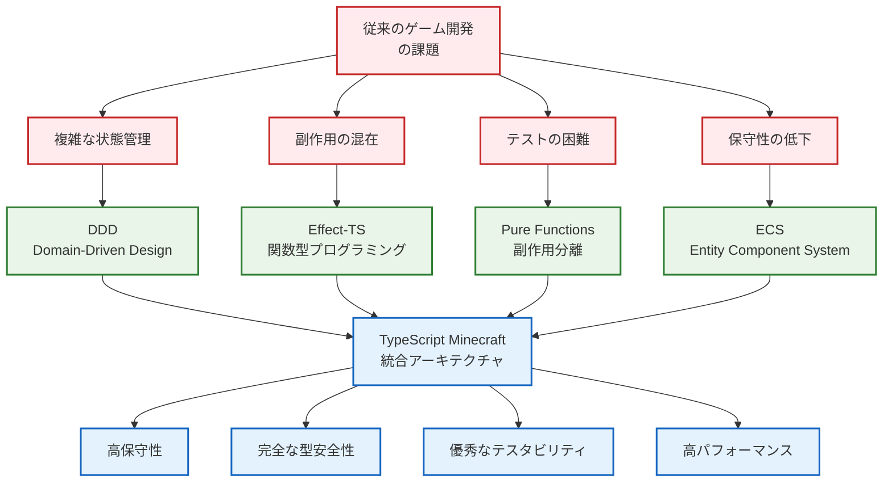
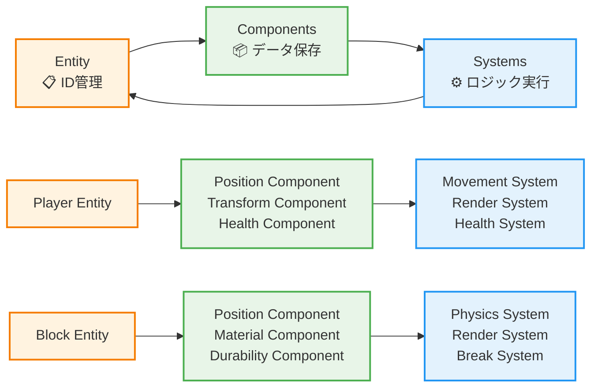
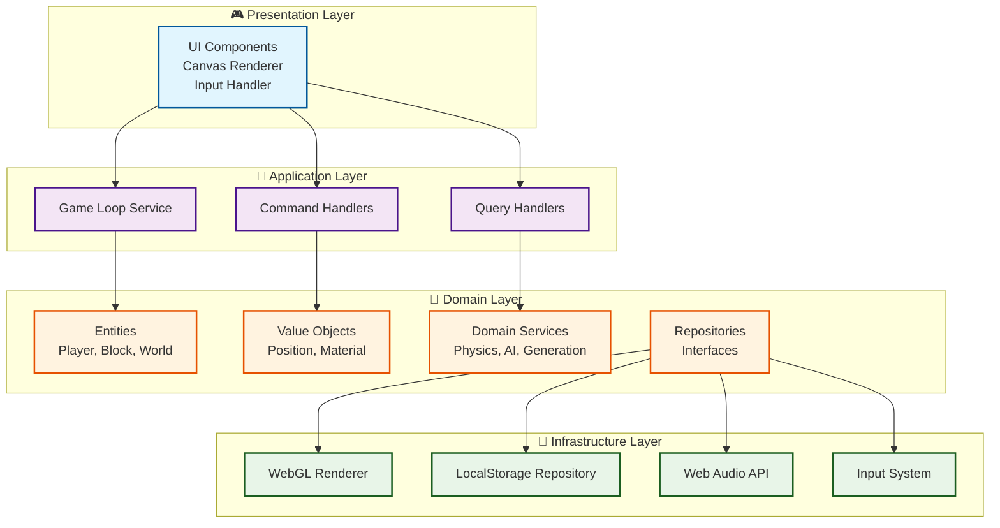
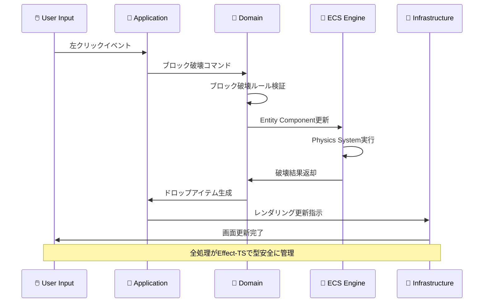
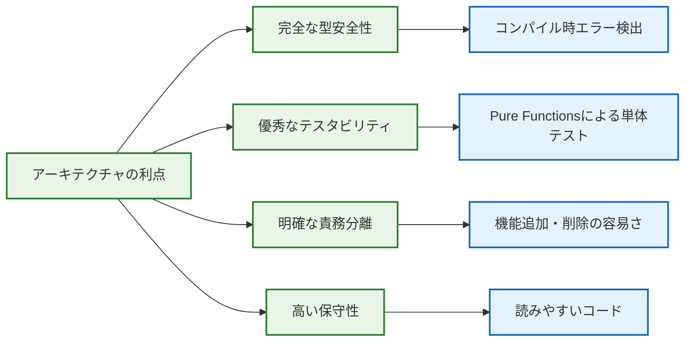

# 🏗️ アーキテクチャ概観 - 革新的設計の理解

## 🧭 ナビゲーション

> **📍 現在位置**: [Quickstart Hub](./README.md) → **Step 2: アーキテクチャ理解**
> **🎯 目標**: DDD×ECS×Effect-TSの統合設計思想を理解
> **⏱️ 所要時間**: 5分
> **📝 前提**: [5分デモ体験](./01-5min-demo.md)完了
> **📚 継続**: [開発フロー理解](./03-development-workflow.md)

## 🌟 革新的アーキテクチャの全体像

### 🎯 なぜこの設計を選んだか？



## 🔮 三大設計原則の融合

### 1️⃣ **DDD (Domain-Driven Design)** - ビジネスロジックの中核

```typescript
// ドメインの例：ブロックシステム
export interface Block {
  readonly id: BlockId
  readonly position: Position3D
  readonly material: BlockMaterial
  readonly metadata: BlockMetadata
}

// ドメインサービス：ブロック破壊ロジック
export const breakBlock = (
  block: Block,
  tool: Tool,
  player: Player
): Effect.Effect<BlockBreakResult, BlockBreakError> =>
  Effect.gen(function* (_) {
    const breakTime = yield* _(calculateBreakTime(block.material, tool))
    const drops = yield* _(calculateDrops(block, tool))
    return { breakTime, drops, experience: calculateExperience(block) }
  })
```

**🎯 DDD のメリット**:
- **ドメインエキスパート**（Minecraft知識者）との対話促進
- **境界づけられたコンテキスト**による機能分離
- **ユビキタス言語**での一貫した用語使用

### 2️⃣ **ECS (Entity Component System)** - ゲームオブジェクト管理



**🎯 ECS のメリット**:
- **データ指向設計**：高パフォーマンスなメモリレイアウト
- **コンポーネント組み合わせ**：柔軟なエンティティ構成
- **システム独立性**：機能追加・削除の容易さ

### 3️⃣ **Effect-TS 3.17+** - 関数型プログラミングの力

```typescript
// 副作用を型レベルで管理
export const generateWorld = (
  seed: WorldSeed,
  size: WorldSize
): Effect.Effect<World, WorldGenerationError, Random | FileSystem> =>
  Effect.gen(function* (_) {
    // 乱数生成サービスを使用
    const noise = yield* _(Random.nextIntBetween(0, 1000))

    // ファイルシステムサービスでキャッシュ確認
    const cached = yield* _(
      FileSystem.readFile(`worlds/${seed.value}.cache`),
      Effect.catchAll(() => Effect.succeed(null))
    )

    if (cached) {
      return yield* _(deserializeWorld(cached))
    }

    // 新規世界生成
    const world = yield* _(generateTerrain(seed, noise, size))
    yield* _(FileSystem.writeFile(`worlds/${seed.value}.cache`, serialize(world)))

    return world
  })
```

**🎯 Effect-TS のメリット**:
- **型安全な副作用管理**：エラーも型で表現
- **依存性注入**：テスタブルなサービス設計
- **パイプライン処理**：読みやすい非同期処理

## 🏛️ レイヤーアーキテクチャ詳細



### 📋 各レイヤーの責務

| レイヤー | 主な責務 | Effect-TS活用ポイント | 実装例 |
|----------|----------|-----------------------|-------|
| **Presentation** | UI・レンダリング・入力 | Effect.runSync でUI更新 | Canvas描画、キーイベント |
| **Application** | ビジネスプロセス調整 | Effect.gen でワークフロー | ゲームループ、コマンド処理 |
| **Domain** | ビジネスルール・エンティティ | Pure Functions中心 | ブロック破壊ルール、物理法則 |
| **Infrastructure** | 外部サービス・技術詳細 | Effect Services | WebGL、LocalStorage、音声 |

## 🔄 データフローの実際

### 🎮 典型的な操作：「ブロック破壊」の処理フロー



## 🧠 5分理解チェックリスト

### ✅ アーキテクチャ理解度確認

#### 🏗️ **DDD理解**
- [ ] **ドメインモデル**: ゲーム内概念（Block、Player等）を理解
- [ ] **境界づけられたコンテキスト**: 機能領域分割を理解
- [ ] **ドメインサービス**: ビジネスロジック配置場所を理解

#### 🎲 **ECS理解**
- [ ] **Entity**: IDによるオブジェクト管理を理解
- [ ] **Component**: データとロジック分離を理解
- [ ] **System**: 処理ループとクエリを理解

#### ⚡ **Effect-TS理解**
- [ ] **副作用管理**: 型レベルでの副作用表現を理解
- [ ] **依存性注入**: サービス設計パターンを理解
- [ ] **エラーハンドリング**: 型安全なエラー処理を理解

## 🎯 実際のコード構造例

```typescript
// 実際のプロジェクト構造（簡略版）
interface MinecraftArchitecture {
  // Presentation Layer
  presentation: {
    canvas: CanvasRenderer
    input: InputController
    ui: GameUI
  }

  // Application Layer
  application: {
    gameLoop: Effect.Effect<void, never, GameServices>
    commandBus: CommandBus<GameCommands>
    queryBus: QueryBus<GameQueries>
  }

  // Domain Layer
  domain: {
    entities: {
      player: Player
      block: Block
      world: World
    }
    services: {
      physics: PhysicsService
      worldGen: WorldGenerationService
    }
  }

  // Infrastructure Layer
  infrastructure: {
    rendering: WebGLRenderer
    storage: LocalStorageRepository
    audio: WebAudioService
  }
}
```

## 🌟 なぜこのアーキテクチャが優秀なのか？

### 🎊 開発者体験の向上



## 🔗 次のステップ

### 🎉 アーキテクチャ理解完了！

```typescript
interface ArchitectureUnderstanding {
  concepts: {
    ddd: "ドメイン駆動設計の基本理解完了"
    ecs: "エンティティコンポーネントシステム理解完了"
    effectTS: "Effect-TS 3.17+パターン理解完了"
  }
  benefits: {
    typeSafety: "型安全性の価値を理解"
    testability: "テスタビリティの重要性を理解"
    maintainability: "保守性向上の仕組みを理解"
  }
  readyFor: "実際の開発フロー習得"
}
```

### 🚀 推奨継続パス

1. **⚡ すぐ開発開始**: [Step 3: Development Workflow](./03-development-workflow.md)
2. **🧠 概念整理**: [Step 4: Key Concepts](./04-key-concepts.md)
3. **📚 詳細理解**: [Architecture詳細](../01-architecture/README.md)

### 🎯 理解深化のための関連リンク

- **🏗️ Architecture詳細**: [DDD Strategic Design](../01-architecture/02-ddd-strategic-design.md)
- **🎲 ECS詳細**: [ECS Integration](../01-architecture/05-ecs-integration.md)
- **⚡ Effect-TS詳細**: [Effect-TS Patterns](../01-architecture/06-effect-ts-patterns.md)

---

### 🎊 **素晴らしい！革新的アーキテクチャを理解できました**

**DDD×ECS×Effect-TSの統合により、従来のゲーム開発の課題を解決する設計思想を学びました。次は実際の開発フローを体験しましょう！**

---

*📍 ドキュメント階層*: **[Home](../../README.md)** → **[Quickstart Hub](./README.md)** → **Step 2: アーキテクチャ理解**