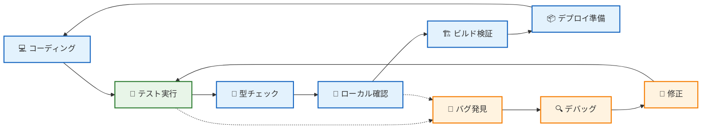
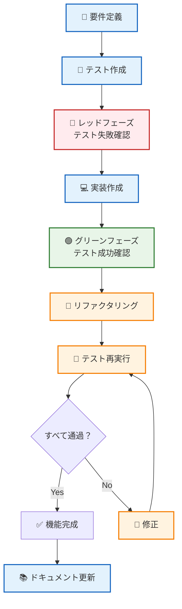
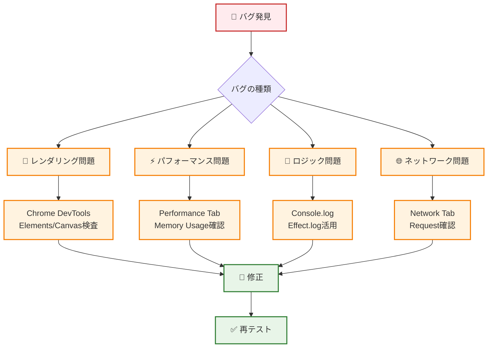

# ⚡ 開発ワークフロー - 生産性最大化への道

## 🧭 ナビゲーション

> **📍 現在位置**: [Quickstart Hub](./README.md) → **Step 3: 開発フロー習得**
> **🎯 目標**: 効率的な開発環境構築と基本ワークフローの習得
> **⏱️ 所要時間**: 5分
> **📝 前提**: [アーキテクチャ理解](./02-architecture-overview.md)完了
> **📚 継続**: [重要概念整理](./04-key-concepts.md)

## 🔄 開発サイクル概観

### 🎯 TypeScript Minecraft 開発の標準フロー



## 💻 開発環境の完全セットアップ

### 🛠️ 推奨開発ツール構成

```typescript
interface OptimalDevEnvironment {
  // 必須ツール
  essential: {
    runtime: "Node.js 18+"
    packageManager: "pnpm" | "npm" | "yarn"
    browser: "Chrome" | "Firefox" | "Safari"
  }

  // 開発用ブラウザ拡張
  browserExtensions: [
    "React Developer Tools",
    "Redux DevTools",
    "Web Developer"
  ]
}
```

### ⚙️ 開発サーバー起動とホットリロード

```bash
# 開発サーバー起動（推奨）
pnpm dev

# 実行結果例
# VITE v7.1.5  ready in 1200 ms
# ➜  Local:   http://localhost:5173/
# ➜  Network: use --host to expose

# ファイル変更時の自動リロード確認
# ✅ src/配下の.tsファイル変更 → 即座反映
# ✅ CSS/スタイル変更 → 即座反映
# ✅ 設定ファイル変更 → サーバー再起動
```

## 🧪 テスト駆動開発 (TDD) フロー

### 🎯 テスト戦略概観



### 🏃‍♂️ テスト実行コマンド集

```bash
# 全テスト実行
pnpm test

# 監視モード（ファイル変更時自動実行）
pnpm test --watch

# カバレッジレポート付き実行
pnpm test --coverage

# 特定ファイルのみテスト
pnpm test src/domain/block/Block.test.ts

# UIモードでテスト実行（ブラウザ表示）
pnpm test --ui
```

### 📝 Effect-TS テストパターン例

```typescript
// src/domain/block/Block.test.ts
import { Effect, TestClock, TestRandom } from "@effect/platform"
import { describe, it, expect } from "vitest"

describe("Block Domain Logic", () => {
  it("should break block with correct tool in expected time", () => {
    const program = Effect.gen(function* (_) {
      // テスト用依存性注入
      const block = createStoneBlock()
      const pickaxe = createDiamondPickaxe()

      // ブロック破壊実行
      const result = yield* _(breakBlock(block, pickaxe))

      // 結果検証
      expect(result.breakTime).toEqual(1500) // ms
      expect(result.drops).toContain(Items.COBBLESTONE)
      expect(result.experience).toBeGreaterThan(0)
    })

    // Effect を同期的にテスト実行
    Effect.runSync(
      program.pipe(
        Effect.provide(TestRandom.deterministic),
        Effect.provide(TestClock.make())
      )
    )
  })
})
```

## 🔍 デバッグ戦略とツール

### 🛠️ 主要デバッグ手法



### 🔧 効果的なデバッグテクニック

#### 1️⃣ **Effect-TS ログ活用**

```typescript
// デバッグ用ログの追加
export const processPlayerMovement = (
  input: PlayerInput,
  currentPosition: Position3D
): Effect.Effect<Position3D, MovementError> =>
  Effect.gen(function* (_) {
    // デバッグログ
    yield* _(Effect.log(`Input received: ${JSON.stringify(input)}`))
    yield* _(Effect.log(`Current position: ${formatPosition(currentPosition)}`))

    const newPosition = yield* _(calculateNewPosition(input, currentPosition))

    // 結果ログ
    yield* _(Effect.log(`New position: ${formatPosition(newPosition)}`))

    return newPosition
  })
```

#### 2️⃣ **ブラウザ DevTools 活用**

```bash
# Console での Effect デバッグ
# 1. F12 でDevTools起動
# 2. Console タブ選択
# 3. 以下コマンドでゲーム状態確認

# グローバル変数アクセス（開発時のみ）
window.gameEngine.getCurrentWorld()
window.gameEngine.getPlayerState()
window.gameEngine.getEntityCount()
```

#### 3️⃣ **パフォーマンス分析**

```typescript
// Performance測定の組み込み
export const renderFrame = Effect.gen(function* (_) {
  const start = performance.now()

  yield* _(clearCanvas)
  yield* _(renderEntities)
  yield* _(renderUI)

  const end = performance.now()

  // フレーム時間が長い場合はログ出力
  if (end - start > 16.67) { // 60FPSを下回る場合
    yield* _(Effect.log(`Slow frame: ${end - start}ms`))
  }
})
```

## 🏗️ ビルドプロセスと最適化

### 📦 本番ビルドの実行

```bash
# 型チェック実行
pnpm type-check

# Linting実行
pnpm lint

# テスト実行
pnpm test

# 本番ビルド
pnpm build

# ビルド結果確認
ls -la dist/
# 期待される出力:
# index.html         - エントリーポイント
# assets/index-*.js   - バンドルされたJavaScript
# assets/index-*.css  - 統合されたCSS
# texture/           - ゲーム用テクスチャ
```

### ⚡ 開発効率化のスクリプト

```json
{
  "scripts": {
    "dev": "vite",
    "build": "tsc && vite build",
    "preview": "vite preview",
    "type-check": "tsc --noEmit",
    "test": "vitest",
    "test:ui": "vitest --ui",
    "test:coverage": "vitest --coverage",
    "lint": "oxlint --deny-warnings",
    "lint:fix": "oxlint --fix",
    "format": "prettier --write .",
    "clean": "rm -rf dist node_modules",
    "reset": "pnpm clean && pnpm install"
  }
}
```

## 🔄 Git ワークフロー（推奨）

### 🌿 ブランチ戦略

```mermaid
gitgraph
    commit id: "Initial"
    branch feature/block-system
    checkout feature/block-system
    commit id: "Add Block entity"
    commit id: "Implement break logic"
    commit id: "Add tests"
    checkout main
    merge feature/block-system
    commit id: "Release v1.1.0"

    branch feature/player-system
    checkout feature/player-system
    commit id: "Add Player entity"
    commit id: "Movement system"
    checkout main
    merge feature/player-system
```

### 📝 コミット規約

```bash
# コミットメッセージ規約
feat: 新機能追加
fix: バグ修正
docs: ドキュメント変更
style: コードスタイル変更
refactor: リファクタリング
test: テスト追加・修正
chore: ビルド・補助ツール変更

# 例
git commit -m "feat(block): add block break animation system"
git commit -m "fix(player): resolve movement collision detection"
git commit -m "test(world): add world generation test cases"
```

## ✅ 5分習得チェックリスト

### 🎯 開発フロー理解度確認

#### 💻 **開発環境**
- [ ] **開発サーバー**: `pnpm dev`でローカル開発可能
- [ ] **ホットリロード**: ファイル変更で自動反映確認
- [ ] **DevTools**: F12でブラウザデバッグツール活用

#### 🧪 **テスト環境**
- [ ] **テスト実行**: `pnpm test`でテスト実行可能
- [ ] **TDD理解**: Red→Green→Refactorサイクル理解
- [ ] **Effect-TSテスト**: 非同期処理のテスト方法理解

#### 🔧 **デバッグ技術**
- [ ] **ログ出力**: Effect.logでデバッグ情報出力
- [ ] **パフォーマンス**: Performance Tabでボトルネック特定
- [ ] **ネットワーク**: Network Tabでリクエスト確認

#### 🏗️ **ビルドプロセス**
- [ ] **型チェック**: TypeScriptエラー確認・修正
- [ ] **本番ビルド**: `pnpm build`で本番用ファイル生成
- [ ] **品質確保**: lint + test + buildの一連フロー理解

## 🎊 実践演習：簡単な機能追加

### 🎯 チャレンジ：新しいブロックタイプ追加

```typescript
// 課題：GoldBlockを追加してみよう
// 1. ドメインモデル定義
export interface GoldBlock extends Block {
  readonly material: "gold"
  readonly hardness: 3.0
  readonly drops: ReadonlyArray<ItemStack>
}

// 2. テスト作成
describe("GoldBlock", () => {
  it("should drop gold ingot when broken with correct tool", () => {
    // テストコード実装
  })
})

// 3. 実装
export const createGoldBlock = (position: Position3D): GoldBlock => ({
  // 実装コード
})

// 4. テスト実行・確認
// pnpm test src/domain/blocks/GoldBlock.test.ts

// 5. ゲーム内確認
// pnpm dev でゲーム起動し、動作確認
```

## 🔗 次のステップ

### 🎉 開発フロー習得完了！

```typescript
interface DevelopmentWorkflowMastery {
  environment: {
    devServerSetup: true
    hotReloadWorking: true
    debugToolsConfigured: true
  }

  testing: {
    testRunning: true
    tddUnderstanding: true
    effectTSTestPatterns: true
  }

  workflow: {
    codeEditBuildCycle: true
    debuggingStrategies: true
    gitWorkflowKnowledge: true
  }

  readyFor: "重要概念の整理と実践的開発"
}
```

### 🚀 推奨継続パス

1. **🧠 概念整理**: [Step 4: Key Concepts](./04-key-concepts.md) - Effect-TS重要パターン習得
2. **📚 詳細学習**: [Development Guides](../03-guides/README.md) - 具体的実装テクニック
3. **🏗️ 実践開発**: [Examples](../06-examples/README.md) - 実際のコード例で学習

### 🎯 さらなる学習リソース

- **🛠️ 開発規約**: [Development Conventions](../03-guides/00-development-conventions.md)
- **🧪 テスト戦略**: [Testing Guide](../03-guides/02-testing-guide.md)
- **🐛 エラー解決**: [Error Resolution](../03-guides/04-error-resolution.md)

---

### 🎊 **おめでとうございます！開発ワークフローを習得しました**

**効率的な開発環境とプロセスを理解し、実際にコードを書いてテストする準備が整いました。次は重要概念を整理して、本格的な開発に進みましょう！**

---

*📍 ドキュメント階層*: **[Home](../../README.md)** → **[Quickstart Hub](./README.md)** → **Step 3: 開発フロー習得**