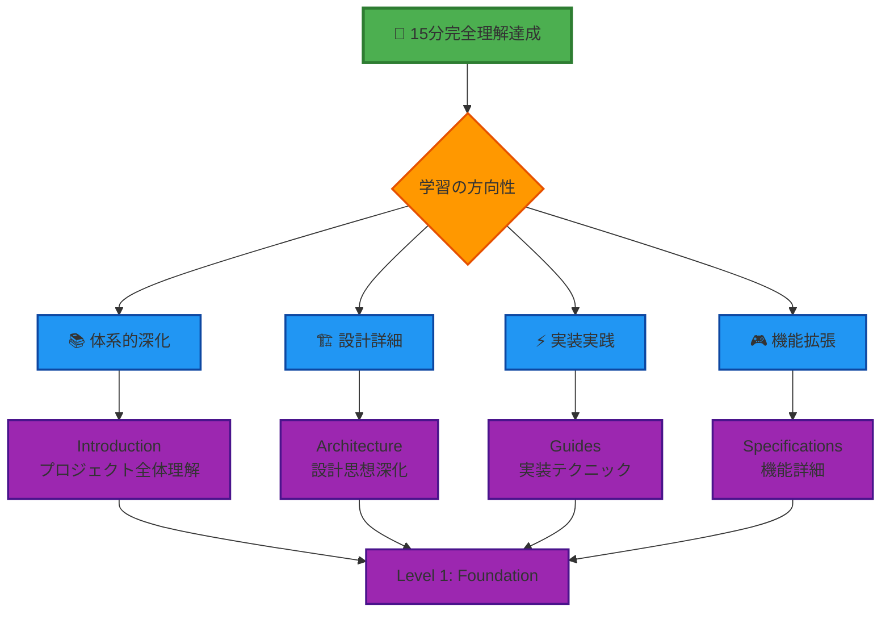

# 🧠 重要概念整理 - Effect-TS 3.17+ 核心パターン

## 🧭 ナビゲーション

> **📍 現在位置**: [Quickstart Hub](./README.md) → **Step 4: 重要概念整理**
> **🎯 目標**: Effect-TS 3.17+の核心パターン習得
> **⏱️ 所要時間**: 数分（リファレンス的活用）
> **📝 前提**: Steps 1-3完了
> **🎊 達成**: **15分完全理解達成**

## 🎊 Quickstart完了おめでとうございます！

このドキュメントは、前の3つのステップで学んだ内容を整理し、実際の開発で頻繁に使用する **Effect-TS 3.17+の重要概念** をリファレンスとしてまとめたものです。

## 🔑 核心パターン一覧

### 1️⃣ **Schema.Struct** - 型安全なデータ定義

```typescript
import { Schema } from "@effect/schema"

// ゲーム内エンティティの定義例
export const PlayerSchema = Schema.Struct({
  id: Schema.String,
  position: Schema.Struct({
    x: Schema.Number,
    y: Schema.Number,
    z: Schema.Number,
  }),
  health: Schema.Number.pipe(
    Schema.between(0, 100)
  ),
  inventory: Schema.Array(Schema.Struct({
    itemId: Schema.String,
    quantity: Schema.Number.pipe(Schema.positive())
  }))
})

// 型推論（自動生成される）
export type Player = Schema.Schema.Type<typeof PlayerSchema>

// 実際の使用例
export const createPlayer = (data: unknown): Effect.Effect<Player, ParseError> =>
  Schema.decodeUnknown(PlayerSchema)(data)
```

**🎯 なぜ Schema.Struct が重要か**:
- **ランタイム検証**: 実行時にデータの整合性を保証
- **自動型推論**: TypeScriptの型を自動生成
- **シリアライゼーション**: JSON ↔ TypeScript の双方向変換

### 2️⃣ **Context.GenericTag** - 依存性注入

```typescript
import { Context } from "effect"

// サービス定義
export class WorldGenerationService extends Context.Tag("WorldGenerationService")<
  WorldGenerationService,
  {
    readonly generateChunk: (position: ChunkPosition) => Effect.Effect<Chunk, GenerationError>
    readonly generateBiome: (seed: number) => Effect.Effect<BiomeType, never>
    readonly placeTrees: (chunk: Chunk, biome: BiomeType) => Effect.Effect<Chunk, never>
  }
>() {}

// サービス実装
export const LiveWorldGenerationService = WorldGenerationService.of({
  generateChunk: (position) =>
    Effect.gen(function* (_) {
      const heightMap = yield* _(generateHeightMap(position))
      const chunk = yield* _(createChunkFromHeightMap(heightMap))
      return chunk
    }),

  generateBiome: (seed) =>
    Effect.succeed(calculateBiome(seed)),

  placeTrees: (chunk, biome) =>
    Effect.succeed(addTreesToChunk(chunk, biome))
})

// 使用例
export const gameInitialization = Effect.gen(function* (_) {
  const worldService = yield* _(WorldGenerationService)
  const initialChunk = yield* _(worldService.generateChunk({ x: 0, z: 0 }))
  return initialChunk
})
```

**🎯 なぜ Context.GenericTag が重要か**:
- **テスタビリティ**: モックサービスに簡単に差し替え可能
- **依存性分離**: 具体実装に依存しない設計
- **型安全性**: コンパイル時に依存関係を検証

### 3️⃣ **Effect.gen** - 非同期処理の組み合わせ

```typescript
// 複雑なゲームロジックの組み合わせ例
export const processPlayerAction = (
  playerId: PlayerId,
  action: PlayerAction
): Effect.Effect<GameState, GameError, WorldService | PlayerService | EventBus> =>
  Effect.gen(function* (_) {
    // 1. プレイヤー状態取得
    const playerService = yield* _(PlayerService)
    const player = yield* _(playerService.getById(playerId))

    // 2. アクション検証
    const validAction = yield* _(validateAction(action, player))

    // 3. 世界状態への影響計算
    const worldService = yield* _(WorldService)
    const worldUpdate = yield* _(worldService.processAction(validAction))

    // 4. プレイヤー状態更新
    const updatedPlayer = yield* _(playerService.update(player, validAction))

    // 5. イベント発行
    const eventBus = yield* _(EventBus)
    yield* _(eventBus.publish(PlayerActionEvent.create(playerId, validAction)))

    // 6. 新しいゲーム状態の構築
    return {
      world: worldUpdate,
      players: [updatedPlayer],
      events: []
    }
  })
```

**🎯 なぜ Effect.gen が重要か**:
- **可読性**: 同期的なコードのような書き味
- **エラー処理**: 途中の処理で失敗時の自動的な中断
- **合成可能性**: 小さな Effect を組み合わせて大きな処理を構築

### 4️⃣ **pipe オペレーター** - 関数合成

```typescript
import { pipe } from "effect"

// データ変換パイプライン
export const processBlockBreaking = (
  rawInput: unknown,
  player: Player
): Effect.Effect<BlockBreakResult, ProcessingError> =>
  pipe(
    // 1. 入力検証
    rawInput,
    Schema.decodeUnknown(BlockBreakInputSchema),

    // 2. 権限チェック
    Effect.flatMap(input => validateBreakPermission(input, player)),

    // 3. ツール有効性確認
    Effect.flatMap(input => validateToolEffectiveness(input)),

    // 4. ブロック破壊実行
    Effect.flatMap(input => executeBlockBreak(input)),

    // 5. ドロップアイテム生成
    Effect.flatMap(result => generateDrops(result)),

    // 6. エラーハンドリング
    Effect.catchAll(error =>
      Effect.succeed({
        success: false,
        error: error.message,
        drops: []
      })
    )
  )
```

**🎯 なぜ pipe が重要か**:
- **関数合成**: 複数の変換処理を順番に適用
- **読みやすさ**: 処理の流れが上から下へ明確
- **再利用性**: パイプライン内の各ステップが独立

### 5️⃣ **エラーハンドリングパターン**

```typescript
// カスタムエラー定義
export class WorldGenerationError extends Schema.Class<WorldGenerationError>("WorldGenerationError")({
  cause: Schema.String,
  coordinates: Schema.optional(Schema.Struct({
    x: Schema.Number,
    z: Schema.Number
  }))
}) {}

export class PlayerNotFoundError extends Schema.Class<PlayerNotFoundError>("PlayerNotFoundError")({
  playerId: Schema.String,
  timestamp: Schema.Date
}) {}

// エラーハンドリング戦略
export const safeWorldGeneration = (
  coordinates: ChunkCoordinates
): Effect.Effect<Chunk, never, WorldService> =>
  Effect.gen(function* (_) {
    const worldService = yield* _(WorldService)

    return yield* _(
      worldService.generateChunk(coordinates),
      // 特定エラーの個別処理
      Effect.catchTag("WorldGenerationError", (error) =>
        Effect.succeed(createEmptyChunk(coordinates))
      ),
      // その他のエラーの汎用処理
      Effect.catchAll((error) =>
        Effect.gen(function* (_) {
          yield* _(Effect.log(`Unexpected generation error: ${error}`))
          return createEmptyChunk(coordinates)
        })
      )
    )
  })
```

**🎯 なぜ型付きエラーハンドリングが重要か**:
- **予測可能性**: 発生する可能性のあるエラーが型で明確
- **適切な処理**: エラーの種類に応じた最適な対処が可能
- **デバッグ支援**: エラーの原因と発生箇所の特定が容易

## 🎯 実際のゲーム機能での応用例

### 🎮 プレイヤー移動システム

```typescript
export const PlayerMovementSystem = Effect.gen(function* (_) {
  // サービス取得
  const inputService = yield* _(InputService)
  const physicsService = yield* _(PhysicsService)
  const worldService = yield* _(WorldService)

  // 入力処理
  const input = yield* _(inputService.getCurrentInput())
  const movement = yield* _(
    pipe(
      input,
      Schema.decodeUnknown(MovementInputSchema),
      Effect.mapError(error => new InvalidInputError({ cause: error }))
    )
  )

  // 物理演算
  const newPosition = yield* _(
    physicsService.calculateMovement(movement),
    Effect.flatMap(pos => worldService.validatePosition(pos)),
    Effect.catchTag("CollisionError", () =>
      Effect.succeed(movement.currentPosition) // 移動をキャンセル
    )
  )

  return { position: newPosition, velocity: movement.velocity }
})
```

## 📚 重要概念クイックリファレンス

### 🔍 よく使用するパターン

| パターン | 使用場面 | 基本形 |
|----------|----------|--------|
| **Schema.Struct** | データ検証・型定義 | `Schema.Struct({ field: Schema.String })` |
| **Context.GenericTag** | サービス定義 | `class Service extends Context.Tag("Service")<...>` |
| **Effect.gen** | 非同期処理組み合わせ | `Effect.gen(function* (_) { ... })` |
| **pipe** | データ変換 | `pipe(data, transform1, transform2)` |
| **Effect.catchAll** | エラー処理 | `effect.pipe(Effect.catchAll(handler))` |

### ⚡ 頻出インポート

```typescript
// 必須インポート
import { Effect, pipe } from "effect"
import { Schema } from "@effect/schema"
import { Context } from "effect"

// ゲーム開発特有
import { Canvas, WebGL } from "@infrastructure/rendering"
import { Input } from "@infrastructure/input"
import { Audio } from "@infrastructure/audio"
```

## 🎊 15分完全理解達成！

### ✅ あなたが今習得している知識

```typescript
interface QuickstartMasteryComplete {
  // Step 1: 基本体験
  gameExperience: {
    canLaunchMinecraft: true
    canPerformBasicActions: true
    understandsGameMechanics: true
  }

  // Step 2: アーキテクチャ理解
  architecturalKnowledge: {
    understandsDDD: true
    graspsECS: true
    comprehendsEffectTS: true
  }

  // Step 3: 開発スキル
  developmentSkills: {
    canSetupDevEnvironment: true
    understandsTestingProcess: true
    knowsDebuggingTechniques: true
  }

  // Step 4: 核心概念
  coreConceptsMastery: {
    schemaStructUsage: true
    contextTagPattern: true
    effectGenComposition: true
    errorHandlingStrategy: true
  }

  // 総合達成
  readyForLevel: "本格的なTypeScript Minecraft開発"
}
```

## 🚀 次のレベルへの推奨パス

### 🎯 学習継続の選択肢



### 🎓 推奨学習継続パス

#### 🥇 **完全理解ルート**（包括的学習）
1. **📚 [Introduction](../00-introduction/README.md)** - プロジェクト全体の詳細理解
2. **🏗️ [Architecture](../01-architecture/README.md)** - 設計思想とパターンの深化
3. **📋 [Specifications](../02-specifications/README.md)** - 各機能の詳細仕様
4. **⚡ [Guides](../03-guides/README.md)** - 実装テクニックと開発手法

#### 🚀 **実践重視ルート**（即戦力育成）
1. **⚡ [Development Guides](../03-guides/README.md)** - 実装テクニック集中学習
2. **🎯 [Pattern Catalog](../07-pattern-catalog/README.md)** - 実装パターン習得
3. **📖 [Examples](../06-examples/README.md)** - 実際のコード例から学習
4. **🔧 [Reference](../05-reference/README.md)** - API・設定リファレンス

#### 🏗️ **設計重視ルート**（アーキテクト養成）
1. **🏗️ [Architecture](../01-architecture/README.md)** - DDD×ECS×Effect-TS詳細
2. **📋 [Specifications](../02-specifications/README.md)** - 機能設計の理解
3. **🎯 [Pattern Catalog](../07-pattern-catalog/README.md)** - 設計パターン活用
4. **⚡ [Guides](../03-guides/README.md)** - 設計を実装に落とし込む技術

## 🎉 Quickstart Hub 完全達成

### 🏆 **おめでとうございます！**

**あなたは15分でTypeScript Minecraft Clone プロジェクトの全体像を完全に理解しました。**

- ✅ **ゲーム体験**: 実際にMinecraftをプレイし基本操作を習得
- ✅ **アーキテクチャ理解**: DDD×ECS×Effect-TSの革新的設計を理解
- ✅ **開発環境**: 効率的な開発ワークフローを構築
- ✅ **核心パターン**: Effect-TS 3.17+の重要概念を習得

### 🌟 **この知識を活かして、本格的なゲーム開発の世界へ進みましょう！**

---

### 🔗 関連リンク

- **🏠 [Quickstart Hub](./README.md)**: 全体ロードマップに戻る
- **📚 [Introduction](../00-introduction/README.md)**: 詳細学習を開始
- **🏗️ [Architecture](../01-architecture/README.md)**: 設計思想を深く理解
- **⚡ [Guides](../03-guides/README.md)**: 実装テクニックを学習

---

*📍 ドキュメント階層*: **[Home](../../README.md)** → **[Quickstart Hub](./README.md)** → **Step 4: 重要概念整理（完了）**