# 🧠 重要概念整理 - Effect-TS 3.17+ 核心パターン

## 🧭 ナビゲーション

> **📍 現在位置**: [Quickstart Hub](./README.md) → **Step 4: 重要概念整理**
> **🎯 目標**: Effect-TS 3.17+の核心パターン習得
> **⏱️ 所要時間**: 数分（リファレンス的活用）
> **📝 前提**: Steps 1-3完了
> **🎊 達成**: **15分完全理解達成**

## 🎊 Quickstart完了おめでとうございます！

このドキュメントは、前の3つのステップで学んだ内容を整理し、実際の開発で頻繁に使用する **Effect-TS 3.17+の重要概念** をリファレンスとしてまとめたものです。

## 🔑 Progressive Effect-TS 3.17+ パターン

### 🎯 Quick Reference - 必須パターン

```bash
# 最重要パターン（これだけは必須）
Schema.Struct  # データ定義・検証
Context.GenericTag  # サービス定義・依存注入
Effect.gen  # 非同期処理合成
pipe  # 関数合成・データ変換
```

<details>
<summary><strong>🔍 詳細パターン解説と実行可能例</strong></summary>

### 1️⃣ **Schema.Struct** - 型安全なデータ定義の完全ガイド

#### 🎯 基本パターン

```typescript
import { Schema } from "@effect/schema"
import { Effect } from "effect"

// ゲーム内エンティティの定義例
export const PlayerSchema = Schema.Struct({
  id: Schema.String.pipe(
    Schema.brand("PlayerId"),  // Brand型でID混同防止
    Schema.description("プレイヤーの一意識別子")
  ),
  position: Schema.Struct({
    x: Schema.Number.pipe(Schema.description("X座標")),
    y: Schema.Number.pipe(Schema.between(-256, 256), Schema.description("Y座標（高度制限）")),
    z: Schema.Number.pipe(Schema.description("Z座標"))
  }),
  health: Schema.Number.pipe(
    Schema.between(0, 100),
    Schema.description("プレイヤーの体力（0-100）")
  ),
  gameMode: Schema.Union(
    Schema.Literal("survival"),
    Schema.Literal("creative"),
    Schema.Literal("adventure")
  ).pipe(Schema.description("ゲームモード")),
  inventory: Schema.Array(Schema.Struct({
    itemId: Schema.String.pipe(
      Schema.brand("ItemId"),
      Schema.description("アイテム識別子")
    ),
    quantity: Schema.Number.pipe(
      Schema.positive(),
      Schema.int(),
      Schema.description("アイテム数量")
    ),
    metadata: Schema.optional(Schema.Record(Schema.String, Schema.Unknown))
  })).pipe(
    Schema.maxLength(36), // Minecraftインベントリサイズ
    Schema.description("プレイヤーインベントリ")
  )
})

// 型推論（自動生成される）
export type Player = Schema.Schema.Type<typeof PlayerSchema>
export type PlayerId = Player["id"]
export type ItemId = Player["inventory"][number]["itemId"]
```

#### ⚡ 実際のゲームでの使用例

```typescript
// プレイヤー作成（安全なデータ変換）
export const createPlayerFromJSON = (jsonData: unknown): Effect.Effect<Player, ParseError> =>
  Schema.decodeUnknown(PlayerSchema)(jsonData)

// プレイヤーデータの更新
export const updatePlayerHealth = (
  player: Player,
  newHealth: number
): Effect.Effect<Player, ValidationError> =>
  Effect.gen(function* (_) {
    // Schema.Structを使用した安全な更新
    return yield* _(
      Schema.decodeUnknown(PlayerSchema)({
        ...player,
        health: newHealth
      })
    )
  })

// 実用例：セーブファイル読み込み
export const loadPlayerFromSave = (saveData: string): Effect.Effect<Player, LoadError> =>
  Effect.gen(function* (_) {
    const parsed = yield* _(
      Effect.try({
        try: () => JSON.parse(saveData),
        catch: (error) => new InvalidJSONError({ cause: error })
      })
    )

    const player = yield* _(
      Schema.decodeUnknown(PlayerSchema)(parsed),
      Effect.mapError(error => new InvalidPlayerDataError({ schemaError: error }))
    )

    // 追加のビジネスルール検証
    if (player.health < 0) {
      return yield* _(Effect.fail(new InvalidHealthError({ health: player.health })))
    }

    return player
  })
```

#### 🔬 高度なSchema活用パターン

```typescript
// カスタムスキーマトランスフォーム
export const WorldPositionSchema = Schema.Struct({
  x: Schema.Number,
  y: Schema.Number,
  z: Schema.Number
}).pipe(
  // カスタム変換：座標を整数に丸める
  Schema.transform(
    Schema.Struct({
      x: Schema.Number,
      y: Schema.Number,
      z: Schema.Number
    }),
    {
      decode: ({ x, y, z }) => ({
        x: Math.floor(x),
        y: Math.floor(y),
        z: Math.floor(z)
      }),
      encode: (pos) => pos
    }
  ),
  Schema.description("ワールド座標（整数座標系）")
)

// 条件付きスキーマ
export const ItemStackSchema = Schema.Struct({
  itemId: Schema.String.pipe(Schema.brand("ItemId")),
  quantity: Schema.Number.pipe(Schema.positive()),
  enchantments: Schema.optional(Schema.Array(Schema.Struct({
    type: Schema.String,
    level: Schema.Number.pipe(Schema.between(1, 255))
  }))),
  durability: Schema.optional(Schema.Number.pipe(Schema.between(0, 100)))
}).pipe(
  // カスタムバリデーション：ツールアイテムには耐久性が必要
  Schema.filter((item) => {
    const toolItems = ["pickaxe", "axe", "shovel", "sword"]
    const isToolItem = toolItems.some(tool => item.itemId.includes(tool))
    return !isToolItem || item.durability !== undefined
  }, {
    message: () => "ツールアイテムには耐久性の指定が必要です"
  })
)
```

**🎯 なぜ Schema.Struct が最重要か**:
- **ランタイム検証**: セーブデータ・ネットワーク通信の安全性確保
- **自動型推論**: TypeScriptコンパイラと完全連携
- **シリアライゼーション**: ゲームデータの永続化・復元
- **開発効率**: データ構造変更時の自動エラー検出
- **デバッグ支援**: 実行時エラーメッセージの詳細化

</details>

<details>
<summary><strong>🔧 実践的なEffect-TSゲーム開発パターン</strong></summary>

### 2️⃣ **Context.GenericTag** - 依存性注入の現代的アプローチ

```typescript
import { Context, Effect, Layer } from "effect"

// サービス定義（新しいContext.GenericTag）
export class WorldGenerationService extends Context.Tag("@services/WorldGeneration")<
  WorldGenerationService,
  {
    readonly generateChunk: (coordinates: ChunkCoordinates) => Effect.Effect<Chunk, GenerationError>
    readonly generateBiome: (seed: WorldSeed, coordinates: ChunkCoordinates) => Effect.Effect<BiomeType, never>
    readonly placeTrees: (chunk: Chunk, biome: BiomeType) => Effect.Effect<Chunk, PlacementError>
    readonly generateOre: (chunk: Chunk, oreType: OreType) => Effect.Effect<Chunk, never>
  }
>() {}

// 実装レイヤー
export const LiveWorldGenerationService = Layer.succeed(
  WorldGenerationService,
  WorldGenerationService.of({
    generateChunk: (coordinates) =>
      Effect.gen(function* (_) {
        // Perlin noise による地形生成
        const heightMap = yield* _(generatePerlinNoise(coordinates))
        const baseChunk = yield* _(createEmptyChunk(coordinates))

        // レイヤーごとの生成
        const terrainChunk = yield* _(applyTerrain(baseChunk, heightMap))
        const caveChunk = yield* _(generateCaves(terrainChunk))
        const oreChunk = yield* _(generateOres(caveChunk))

        return oreChunk
      }),

    generateBiome: (seed, coordinates) =>
      Effect.succeed(
        calculateBiomeType(seed.value, coordinates.x, coordinates.z)
      ),

    placeTrees: (chunk, biome) =>
      Effect.gen(function* (_) {
        if (biome === "forest" || biome === "plains") {
          const treePositions = yield* _(calculateTreePositions(chunk, biome))
          return yield* _(
            Effect.forEach(treePositions, pos => placeTree(chunk, pos), {
              concurrency: "unbounded"
            })
          ).pipe(
            Effect.map(() => chunk)
          )
        }
        return chunk
      }),

    generateOre: (chunk, oreType) =>
      Effect.gen(function* (_) {
        const distribution = getOreDistribution(oreType)
        const positions = yield* _(calculateOrePositions(chunk, distribution))

        return yield* _(
          Effect.forEach(positions, pos =>
            Effect.sync(() => setBlockAt(chunk, pos, createOreBlock(oreType)))
          ),
          Effect.map(() => chunk)
        )
      })
  })
)

// テスト用モック実装
export const TestWorldGenerationService = Layer.succeed(
  WorldGenerationService,
  WorldGenerationService.of({
    generateChunk: (coordinates) =>
      Effect.succeed(createFlatTestChunk(coordinates)),

    generateBiome: () => Effect.succeed("plains"),

    placeTrees: (chunk) => Effect.succeed(chunk),

    generateOre: (chunk) => Effect.succeed(chunk)
  })
)

// 実際の使用例
export const initializeWorld = (worldSize: WorldSize): Effect.Effect<World, WorldError, WorldGenerationService> =>
  Effect.gen(function* (_) {
    const worldGen = yield* _(WorldGenerationService)

    // 並行チャンク生成
    const chunks = yield* _(
      Effect.forEach(
        generateChunkCoordinates(worldSize),
        coordinates => worldGen.generateChunk(coordinates),
        { concurrency: 4 } // CPU使用量制御
      )
    )

    return createWorld(chunks)
  })
```

### 3️⃣ **Effect.gen + yield*** - 非同期処理の革新的合成

```typescript
// 複雑なゲームロジックの合成例：プレイヤーアクション処理
export const processComplexPlayerAction = (
  playerId: PlayerId,
  action: ComplexPlayerAction
): Effect.Effect<ActionResult, ActionError, AllGameServices> =>
  Effect.gen(function* (_) {
    // 1. プレイヤー状態取得
    const playerService = yield* _(PlayerService)
    const player = yield* _(playerService.getById(playerId))

    // 2. 権限チェック（並行実行）
    const [hasPermission, hasResources, isInRange] = yield* _(
      Effect.all([
        checkActionPermission(player, action),
        checkRequiredResources(player, action),
        checkActionRange(player, action)
      ])
    )

    // 3. 早期リターンパターン
    if (!hasPermission) {
      return yield* _(Effect.fail(new InsufficientPermissionError({ action })))
    }

    if (!hasResources) {
      return yield* _(Effect.fail(new InsufficientResourcesError({
        required: action.requiredResources
      })))
    }

    // 4. ワールド状態への影響計算
    const worldService = yield* _(WorldService)
    const affectedChunks = yield* _(worldService.getChunksInRange(action.area))

    // 5. アトミックな更新操作
    const result = yield* _(
      Effect.gen(function* (_) {
        // プレイヤー状態更新
        const updatedPlayer = yield* _(
          playerService.consumeResources(player, action.requiredResources)
        )

        // ワールド更新
        const updatedChunks = yield* _(
          Effect.forEach(
            affectedChunks,
            chunk => applyActionToChunk(chunk, action),
            { concurrency: "unbounded" }
          )
        )

        // イベント発行
        const eventBus = yield* _(EventBus)
        yield* _(
          eventBus.publish(PlayerActionEvent.create({
            playerId,
            action,
            timestamp: new Date(),
            affectedArea: action.area
          }))
        )

        return {
          player: updatedPlayer,
          updatedChunks,
          actionId: generateActionId()
        }
      }),
      // エラー時のロールバック
      Effect.catchAll((error) =>
        Effect.gen(function* (_) {
          yield* _(Effect.log(`Action failed, rolling back: ${error}`))
          // ロールバック処理
          yield* _(playerService.rollbackPlayerState(playerId))
          yield* _(worldService.rollbackChunkStates(affectedChunks.map(c => c.id)))
          return yield* _(Effect.fail(error))
        })
      )
    )

    return result
  })

// より高度な合成：リアクティブゲームループ
export const createReactiveGameLoop = (): Effect.Effect<void, never, AllGameServices> =>
  Effect.gen(function* (_) {
    const gameState = yield* _(GameState)
    const inputService = yield* _(InputService)
    const renderService = yield* _(RenderService)

    // ゲームループストリーム
    yield* _(
      Effect.forever(
        Effect.gen(function* (_) {
          const frameStart = yield* _(Effect.sync(() => performance.now()))

          // 入力処理
          const currentInput = yield* _(inputService.getCurrentInput())

          // ゲーム状態更新
          yield* _(gameState.update(currentInput))

          // 物理シミュレーション
          const physicsService = yield* _(PhysicsService)
          yield* _(physicsService.step(16.67)) // 60FPS

          // レンダリング
          const currentScene = yield* _(gameState.getCurrentScene())
          yield* _(renderService.render(currentScene))

          // フレームレート制御
          const frameEnd = yield* _(Effect.sync(() => performance.now()))
          const frameDuration = frameEnd - frameStart

          if (frameDuration < 16.67) { // 60FPS維持
            yield* _(Effect.sleep(`${16.67 - frameDuration} millis`))
          }
        })
      )
    )
  })
```

### 4️⃣ **高度なエラーハンドリングパターン**

```typescript
// 階層化されたエラー管理
export class GameError extends Schema.Class<GameError>("GameError")({
  cause: Schema.String,
  timestamp: Schema.Date,
  context: Schema.Record(Schema.String, Schema.Unknown)
}) {}

export class WorldError extends GameError.extend<WorldError>("WorldError")({
  worldId: Schema.String.pipe(Schema.brand("WorldId")),
  chunkCoordinates: Schema.optional(Schema.Array(Schema.Number))
}) {}

export class PlayerError extends GameError.extend<PlayerError>("PlayerError")({
  playerId: Schema.String.pipe(Schema.brand("PlayerId")),
  playerState: Schema.String
}) {}

// エラーハンドリング戦略
export const safeGameOperation = <A, E extends GameError>(
  operation: Effect.Effect<A, E, AllGameServices>
): Effect.Effect<A, never, AllGameServices> =>
  operation.pipe(
    // 特定エラーの個別処理
    Effect.catchTag("WorldError", (error) =>
      Effect.gen(function* (_) {
        yield* _(Effect.log(`World error occurred: ${error.cause}`))
        yield* _(notifyPlayer(error.playerId, "ワールドエラーが発生しました"))
        return yield* _(getDefaultWorldState())
      })
    ),
    Effect.catchTag("PlayerError", (error) =>
      Effect.gen(function* (_) {
        yield* _(Effect.log(`Player error: ${error.playerId} - ${error.cause}`))
        yield* _(resetPlayerToSafeState(error.playerId))
        return yield* _(getDefaultPlayerState(error.playerId))
      })
    ),
    // 予期しないエラーの汎用処理
    Effect.catchAll((error) =>
      Effect.gen(function* (_) {
        yield* _(Effect.log(`Unexpected error: ${JSON.stringify(error)}`))
        yield* _(saveErrorReport(error))
        return yield* _(getEmergencyFallbackState())
      })
    )
  )
```

</details>

### 2️⃣ **Context.GenericTag** - 依存性注入

```typescript
import { Context } from "effect"

// サービス定義
export class WorldGenerationService extends Context.Tag("WorldGenerationService")<
  WorldGenerationService,
  {
    readonly generateChunk: (position: ChunkPosition) => Effect.Effect<Chunk, GenerationError>
    readonly generateBiome: (seed: number) => Effect.Effect<BiomeType, never>
    readonly placeTrees: (chunk: Chunk, biome: BiomeType) => Effect.Effect<Chunk, never>
  }
>() {}

// サービス実装
export const LiveWorldGenerationService = WorldGenerationService.of({
  generateChunk: (position) =>
    Effect.gen(function* (_) {
      const heightMap = yield* _(generateHeightMap(position))
      const chunk = yield* _(createChunkFromHeightMap(heightMap))
      return chunk
    }),

  generateBiome: (seed) =>
    Effect.succeed(calculateBiome(seed)),

  placeTrees: (chunk, biome) =>
    Effect.succeed(addTreesToChunk(chunk, biome))
})

// 使用例
export const gameInitialization = Effect.gen(function* (_) {
  const worldService = yield* _(WorldGenerationService)
  const initialChunk = yield* _(worldService.generateChunk({ x: 0, z: 0 }))
  return initialChunk
})
```

**🎯 なぜ Context.GenericTag が重要か**:
- **テスタビリティ**: モックサービスに簡単に差し替え可能
- **依存性分離**: 具体実装に依存しない設計
- **型安全性**: コンパイル時に依存関係を検証

### 3️⃣ **Effect.gen** - 非同期処理の組み合わせ

```typescript
// 複雑なゲームロジックの組み合わせ例
export const processPlayerAction = (
  playerId: PlayerId,
  action: PlayerAction
): Effect.Effect<GameState, GameError, WorldService | PlayerService | EventBus> =>
  Effect.gen(function* (_) {
    // 1. プレイヤー状態取得
    const playerService = yield* _(PlayerService)
    const player = yield* _(playerService.getById(playerId))

    // 2. アクション検証
    const validAction = yield* _(validateAction(action, player))

    // 3. 世界状態への影響計算
    const worldService = yield* _(WorldService)
    const worldUpdate = yield* _(worldService.processAction(validAction))

    // 4. プレイヤー状態更新
    const updatedPlayer = yield* _(playerService.update(player, validAction))

    // 5. イベント発行
    const eventBus = yield* _(EventBus)
    yield* _(eventBus.publish(PlayerActionEvent.create(playerId, validAction)))

    // 6. 新しいゲーム状態の構築
    return {
      world: worldUpdate,
      players: [updatedPlayer],
      events: []
    }
  })
```

**🎯 なぜ Effect.gen が重要か**:
- **可読性**: 同期的なコードのような書き味
- **エラー処理**: 途中の処理で失敗時の自動的な中断
- **合成可能性**: 小さな Effect を組み合わせて大きな処理を構築

### 4️⃣ **pipe オペレーター** - 関数合成

```typescript
import { pipe } from "effect"

// データ変換パイプライン
export const processBlockBreaking = (
  rawInput: unknown,
  player: Player
): Effect.Effect<BlockBreakResult, ProcessingError> =>
  pipe(
    // 1. 入力検証
    rawInput,
    Schema.decodeUnknown(BlockBreakInputSchema),

    // 2. 権限チェック
    Effect.flatMap(input => validateBreakPermission(input, player)),

    // 3. ツール有効性確認
    Effect.flatMap(input => validateToolEffectiveness(input)),

    // 4. ブロック破壊実行
    Effect.flatMap(input => executeBlockBreak(input)),

    // 5. ドロップアイテム生成
    Effect.flatMap(result => generateDrops(result)),

    // 6. エラーハンドリング
    Effect.catchAll(error =>
      Effect.succeed({
        success: false,
        error: error.message,
        drops: []
      })
    )
  )
```

**🎯 なぜ pipe が重要か**:
- **関数合成**: 複数の変換処理を順番に適用
- **読みやすさ**: 処理の流れが上から下へ明確
- **再利用性**: パイプライン内の各ステップが独立

### 5️⃣ **エラーハンドリングパターン**

```typescript
// カスタムエラー定義
export class WorldGenerationError extends Schema.Class<WorldGenerationError>("WorldGenerationError")({
  cause: Schema.String,
  coordinates: Schema.optional(Schema.Struct({
    x: Schema.Number,
    z: Schema.Number
  }))
}) {}

export class PlayerNotFoundError extends Schema.Class<PlayerNotFoundError>("PlayerNotFoundError")({
  playerId: Schema.String,
  timestamp: Schema.Date
}) {}

// エラーハンドリング戦略
export const safeWorldGeneration = (
  coordinates: ChunkCoordinates
): Effect.Effect<Chunk, never, WorldService> =>
  Effect.gen(function* (_) {
    const worldService = yield* _(WorldService)

    return yield* _(
      worldService.generateChunk(coordinates),
      // 特定エラーの個別処理
      Effect.catchTag("WorldGenerationError", (error) =>
        Effect.succeed(createEmptyChunk(coordinates))
      ),
      // その他のエラーの汎用処理
      Effect.catchAll((error) =>
        Effect.gen(function* (_) {
          yield* _(Effect.log(`Unexpected generation error: ${error}`))
          return createEmptyChunk(coordinates)
        })
      )
    )
  })
```

**🎯 なぜ型付きエラーハンドリングが重要か**:
- **予測可能性**: 発生する可能性のあるエラーが型で明確
- **適切な処理**: エラーの種類に応じた最適な対処が可能
- **デバッグ支援**: エラーの原因と発生箇所の特定が容易

## 🎯 実際のゲーム機能での応用例

### 🎮 プレイヤー移動システム

```typescript
export const PlayerMovementSystem = Effect.gen(function* (_) {
  // サービス取得
  const inputService = yield* _(InputService)
  const physicsService = yield* _(PhysicsService)
  const worldService = yield* _(WorldService)

  // 入力処理
  const input = yield* _(inputService.getCurrentInput())
  const movement = yield* _(
    pipe(
      input,
      Schema.decodeUnknown(MovementInputSchema),
      Effect.mapError(error => new InvalidInputError({ cause: error }))
    )
  )

  // 物理演算
  const newPosition = yield* _(
    physicsService.calculateMovement(movement),
    Effect.flatMap(pos => worldService.validatePosition(pos)),
    Effect.catchTag("CollisionError", () =>
      Effect.succeed(movement.currentPosition) // 移動をキャンセル
    )
  )

  return { position: newPosition, velocity: movement.velocity }
})
```

## 📚 重要概念クイックリファレンス

### 🔍 よく使用するパターン

| パターン | 使用場面 | 基本形 |
|----------|----------|--------|
| **Schema.Struct** | データ検証・型定義 | `Schema.Struct({ field: Schema.String })` |
| **Context.GenericTag** | サービス定義 | `class Service extends Context.Tag("Service")<...>` |
| **Effect.gen** | 非同期処理組み合わせ | `Effect.gen(function* (_) { ... })` |
| **pipe** | データ変換 | `pipe(data, transform1, transform2)` |
| **Effect.catchAll** | エラー処理 | `effect.pipe(Effect.catchAll(handler))` |

### ⚡ 頻出インポート

```typescript
// 必須インポート
import { Effect, pipe } from "effect"
import { Schema } from "@effect/schema"
import { Context } from "effect"

// ゲーム開発特有
import { Canvas, WebGL } from "@infrastructure/rendering"
import { Input } from "@infrastructure/input"
import { Audio } from "@infrastructure/audio"
```

## 🎊 15分完全理解達成！

### ✅ あなたが今習得している知識

```typescript
interface QuickstartMasteryComplete {
  // Step 1: 基本体験
  gameExperience: {
    canLaunchMinecraft: true
    canPerformBasicActions: true
    understandsGameMechanics: true
  }

  // Step 2: アーキテクチャ理解
  architecturalKnowledge: {
    understandsDDD: true
    graspsECS: true
    comprehendsEffectTS: true
  }

  // Step 3: 開発スキル
  developmentSkills: {
    canSetupDevEnvironment: true
    understandsTestingProcess: true
    knowsDebuggingTechniques: true
  }

  // Step 4: 核心概念
  coreConceptsMastery: {
    schemaStructUsage: true
    contextTagPattern: true
    effectGenComposition: true
    errorHandlingStrategy: true
  }

  // 総合達成
  readyForLevel: "本格的なTypeScript Minecraft開発"
}
```

## 🚀 次のレベルへの推奨パス

### 🎯 学習継続の選択肢

```mermaid
graph TD
    A[🎊 15分完全理解達成] --> B{学習の方向性}

    B --> C[📚 体系的深化]
    B --> D[🏗️ 設計詳細]
    B --> E[⚡ 実装実践]
    B --> F[🎮 機能拡張]

    C --> C1["Introduction<br/>プロジェクト全体理解"]
    D --> D1["Architecture<br/>設計思想深化"]
    E --> E1["Guides<br/>実装テクニック"]
    F --> F1["Specifications<br/>機能詳細"]

    C1 --> G[Level 1: Foundation]
    D1 --> G
    E1 --> G
    F1 --> G

    classDef complete fill:#4caf50,stroke:#2e7d32,stroke-width:3px
    classDef choice fill:#ff9800,stroke:#e65100,stroke-width:2px
    classDef path fill:#2196f3,stroke:#0d47a1,stroke-width:2px
    classDef next fill:#9c27b0,stroke:#4a148c,stroke-width:2px

    class A complete
    class B choice
    class C,D,E,F path
    class C1,D1,E1,F1,G next
```



### 🎓 推奨学習継続パス

#### 🥇 **完全理解ルート**（包括的学習）
1. **📚 [Introduction](../00-introduction/README.md)** - プロジェクト全体の詳細理解
2. **🏗️ [Architecture](../01-architecture/README.md)** - 設計思想とパターンの深化
3. **📋 [Specifications](../02-specifications/README.md)** - 各機能の詳細仕様
4. **⚡ [Guides](../03-guides/README.md)** - 実装テクニックと開発手法

#### 🚀 **実践重視ルート**（即戦力育成）
1. **⚡ [Development Guides](../03-guides/README.md)** - 実装テクニック集中学習
2. **🎯 [Pattern Catalog](../07-pattern-catalog/README.md)** - 実装パターン習得
3. **📖 [Examples](../06-examples/README.md)** - 実際のコード例から学習
4. **🔧 [Reference](../05-reference/README.md)** - API・設定リファレンス

#### 🏗️ **設計重視ルート**（アーキテクト養成）
1. **🏗️ [Architecture](../01-architecture/README.md)** - DDD×ECS×Effect-TS詳細
2. **📋 [Specifications](../02-specifications/README.md)** - 機能設計の理解
3. **🎯 [Pattern Catalog](../07-pattern-catalog/README.md)** - 設計パターン活用
4. **⚡ [Guides](../03-guides/README.md)** - 設計を実装に落とし込む技術

## 🎉 Quickstart Hub 完全達成

### 🏆 **おめでとうございます！**

**あなたは15分でTypeScript Minecraft Clone プロジェクトの全体像を完全に理解しました。**

- ✅ **ゲーム体験**: 実際にMinecraftをプレイし基本操作を習得
- ✅ **アーキテクチャ理解**: DDD×ECS×Effect-TSの革新的設計を理解
- ✅ **開発環境**: 効率的な開発ワークフローを構築
- ✅ **核心パターン**: Effect-TS 3.17+の重要概念を習得

### 🌟 **この知識を活かして、本格的なゲーム開発の世界へ進みましょう！**

---

### 🔗 関連リンク

- **🏠 [Quickstart Hub](./README.md)**: 全体ロードマップに戻る
- **📚 [Introduction](../00-introduction/README.md)**: 詳細学習を開始
- **🏗️ [Architecture](../01-architecture/README.md)**: 設計思想を深く理解
- **⚡ [Guides](../03-guides/README.md)**: 実装テクニックを学習

---

*📍 ドキュメント階層*: **[Home](../../README.md)** → **[Quickstart Hub](./README.md)** → **Step 4: 重要概念整理（完了）**