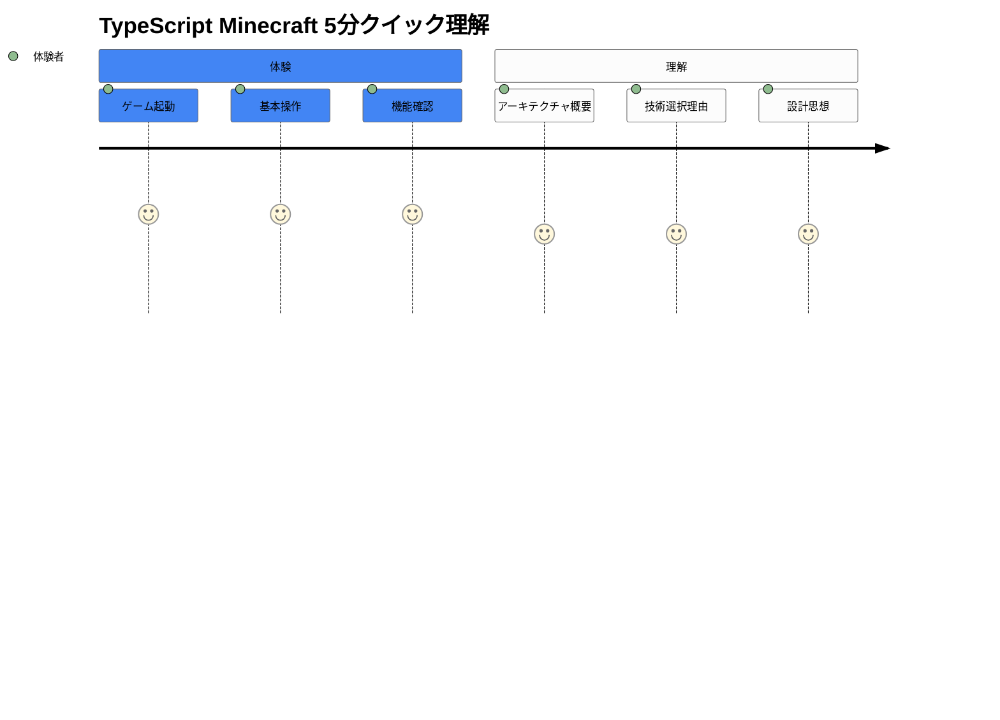
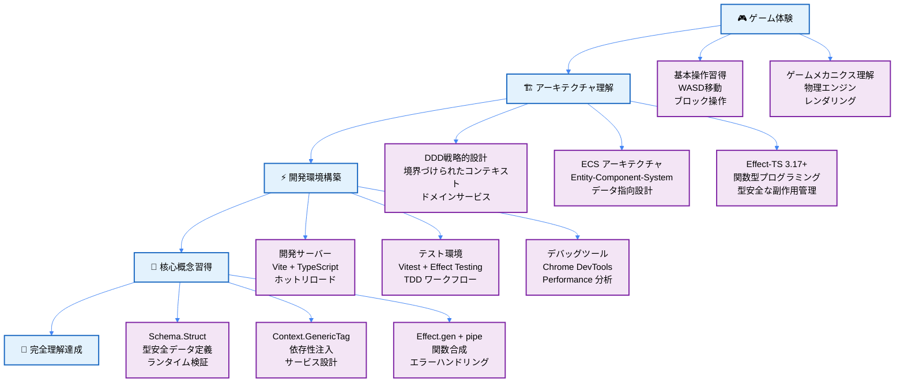
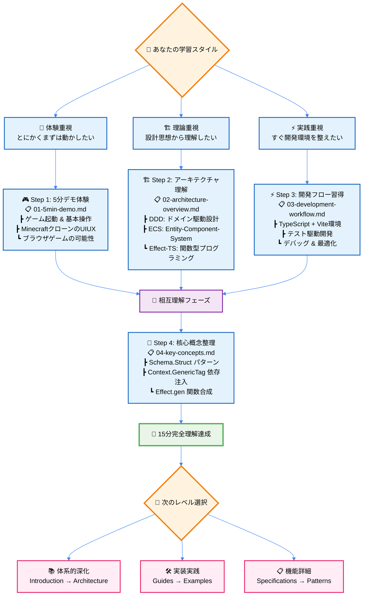
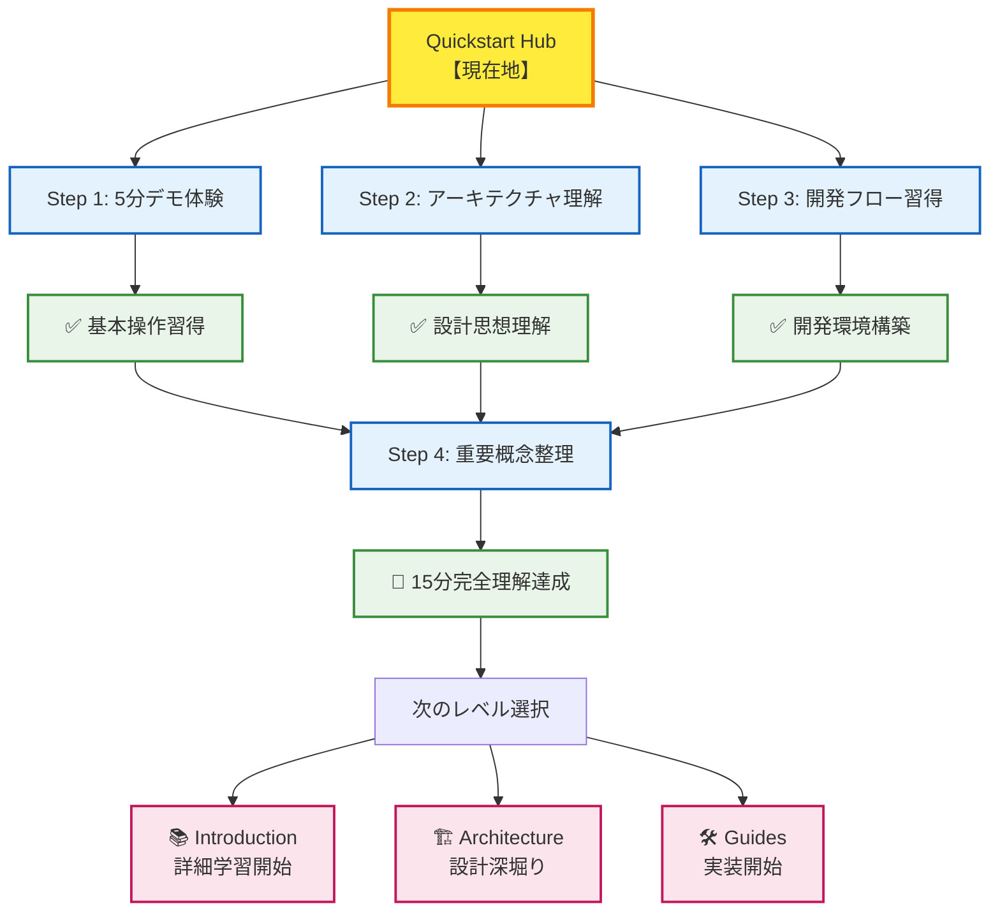

# 🎯 Quickstart Hub - 15分完全理解への道

## 🎮 **ライブデモ - 今すぐプレイ！**

> **🌐 Live Game**: https://minecraft.takeokunn.org
>
> **✨ 最新版が常に自動デプロイ済み！** main ブランチへの全ての変更が2-3分以内に反映されます。
>
> **🎯 推奨ブラウザ**: Chrome, Firefox, Safari（WebGLサポート必要）

### 🕹️ **即座ゲーム体験**
- **WASD**: プレイヤー移動
- **マウス**: 視点変更
- **左クリック**: ブロック破壊
- **右クリック**: ブロック配置
- **スペース**: ジャンプ

## 🧭 スマートナビゲーション

> **📍 現在位置**: ドキュメント → **Quickstart Hub**
> **🎯 最終目標**: 15分でプロジェクト全体像の完全理解
> **⏱️ 段階構成**: 5分体験 → 10分理解 → 15分開発準備
> **👤 対象**: 初回訪問者・技術評価・学習開始希望者

## 📋 Progressive Disclosure 学習ロードマップ

### 🎯 Quick Reference（5分で理解）



<details>
<summary><strong>📖 Deep Dive（10-15分詳細学習）- クリックで展開</strong></summary>



#### 📚 詳細学習パス

| 段階 | 焦点 | 学習目標 | 深化リソース |
|------|------|----------|--------------|
| **体験** | 実際の動作確認 | Minecraftの基本機能理解 | [5分デモ](./01-5min-demo.md) |
| **理解** | 設計思想把握 | DDD×ECS×Effect-TSの統合理解 | [アーキテクチャ概観](./02-architecture-overview.md) |
| **構築** | 開発環境準備 | 効率的な開発フロー習得 | [開発ワークフロー](./03-development-workflow.md) |
| **習得** | 核心パターン | Effect-TS 3.17+実践パターン | [重要概念](./04-key-concepts.md) |

</details>

<details>
<summary><strong>🎓 Expert Notes（上級者向け詳細）- クリックで展開</strong></summary>

### 🏗️ アーキテクチャ深化ポイント

- **戦略的DDD**: 境界づけられたコンテキストの実装戦略
- **ECS最適化**: コンポーネント指向によるパフォーマンス向上
- **Effect-TS高度パターン**: Resource管理、Fiber制御、Stream処理

### ⚡ 開発効率化テクニック

- **型駆動開発**: Schema-firstアプローチの実践
- **テスト戦略**: Property-based testing + Effect testing
- **CI/CD統合**: 型チェック + テスト + ビルドの自動化

### 🎮 ゲーム開発特有の課題

- **リアルタイム制約**: 60FPSを維持するための最適化
- **状態管理**: 複雑なゲーム状態の整合性保証
- **メモリ管理**: WebGL + ECS環境でのGC圧力軽減

</details>

### 🎯 インタラクティブ学習パス



#### 🎯 学習スタイル別推奨ルート

<details>
<summary><strong>🚀 体験重視型の方へ</strong></summary>

**「まず動かしてから理解したい」タイプ**

1. **🎮 [5分デモ](./01-5min-demo.md)**: ゲーム起動・操作体験
2. **⚡ [開発ワークフロー](./03-development-workflow.md)**: 開発環境構築
3. **🏗️ [アーキテクチャ](./02-architecture-overview.md)**: 仕組み理解
4. **🧠 [重要概念](./04-key-concepts.md)**: パターン習得

**特徴**: 手を動かしながら学習、実体験から理解を深める

</details>

<details>
<summary><strong>🏗️ 理論重視型の方へ</strong></summary>

**「設計思想から理解したい」タイプ**

1. **🏗️ [アーキテクチャ](./02-architecture-overview.md)**: DDD×ECS×Effect-TS理解
2. **🧠 [重要概念](./04-key-concepts.md)**: Effect-TSパターン習得
3. **⚡ [開発ワークフロー](./03-development-workflow.md)**: 実装への橋渡し
4. **🎮 [5分デモ](./01-5min-demo.md)**: 理論の実体験

**特徴**: 全体像把握から詳細へ、理論と実践の統合

</details>

<details>
<summary><strong>⚡ 実践重視型の方へ</strong></summary>

**「すぐ開発を始めたい」タイプ**

1. **⚡ [開発ワークフロー](./03-development-workflow.md)**: 開発環境構築
2. **🎮 [5分デモ](./01-5min-demo.md)**: 動作確認とテスト
3. **🧠 [重要概念](./04-key-concepts.md)**: 即戦力パターン
4. **🏗️ [アーキテクチャ](./02-architecture-overview.md)**: 設計根拠理解

**特徴**: 実装ファーストで学習、実際のコード重視

</details>

## 🎮 全コンテンツ一覧（推奨順序）

| ステップ | ドキュメント | 目的 | 所要時間 | 前提知識 |
|---------|-------------|-----|---------|----------|
| **Step 1** | [📋 01-5min-demo.md](./01-5min-demo.md) | 🚀 最速ゲーム体験 | 5分 | なし |
| **Step 2** | [📋 02-architecture-overview.md](./02-architecture-overview.md) | 🏗️ アーキテクチャ理解 | 5分 | 基本的なプログラミング知識 |
| **Step 3** | [📋 03-development-workflow.md](./03-development-workflow.md) | ⚡ 開発フロー習得 | 5分 | TypeScript基礎 |
| **Step 4** | [📋 04-key-concepts.md](./04-key-concepts.md) | 🧠 重要概念整理 | 数分 | 上記3ステップ完了 |

### 📊 学習成果チェックリスト

#### 🎯 5分目標（Step 1完了）
- [ ] ✅ ゲーム画面でMinecraftが動作している
- [ ] 🕹️ WASD移動とマウス視点変更ができる
- [ ] 🔨 ブロック破壊・設置の基本操作ができる

#### 🎯 10分目標（Step 2完了）
- [ ] 🏗️ DDD（ドメイン駆動設計）の基本概念を理解
- [ ] ⚡ Effect-TS 3.17+の役割を理解
- [ ] 🎮 ECS（エンティティコンポーネントシステム）の仕組みを理解

#### 🎯 15分目標（Step 3-4完了）
- [ ] 💻 ローカル開発環境の構築完了
- [ ] 🛠️ 基本的な開発ワークフロー理解
- [ ] 📚 重要なEffect-TSパターン（Schema.Struct、Context.GenericTag等）把握

## 🎊 完了！次のステップへ

### 🌟 15分完全マスタリー達成パス



### 🎯 最適化された学習継続パス

#### 🏁 **レベル1完了者向け**（基本操作習得済み）
1. **技術理解重視**: [Architecture](../01-architecture/README.md) → DDD×ECS×Effect-TS詳細
2. **実装重視**: [Guides](../03-guides/README.md) → 具体的開発手順
3. **包括理解**: [Introduction](../00-introduction/README.md) → 体系的学習

#### 🔄 **反復学習者向け**（技術評価・復習）
1. **仕様詳細**: [Specifications](../02-specifications/README.md) → 機能完全理解
2. **パターン学習**: [Pattern Catalog](../07-pattern-catalog/README.md) → 実装パターン習得
3. **リファレンス**: [Reference](../05-reference/README.md) → API・設定詳細

### 🏆 Quickstart完全達成の証明

すべてのステップを完了した方は、以下の知識を習得しています：

```typescript
// あなたが今理解している TypeScript Minecraft の基本構造
interface QuickstartMastery {
  gameExperience: {
    canLaunchGame: true
    canMove: true
    canBreakBlocks: true
    canPlaceBlocks: true
  }
  architectureUnderstanding: {
    knowsDDD: true
    understandsEffectTS: true
    graspECS: true
  }
  developmentReadiness: {
    hasLocalEnvironment: true
    understandsWorkflow: true
    knowsKeyConcepts: true
  }
}
```

## 🆘 困ったときの緊急ガイド

### ⚡ よくある問題の即座解決

| 問題 | 症状 | 解決法 | 参照 |
|------|------|--------|------|
| **環境問題** | `pnpm install`エラー | Node.js 20+へアップデート | [環境構築](../00-introduction/01-getting-started.md) |
| **表示問題** | 画面が真っ白 | F12でエラー確認 | [トラブルシューティング](../03-guides/04-error-resolution.md) |
| **操作問題** | キーが効かない | ブラウザフォーカス確認 | [基本操作](./01-5min-demo.md#basic-controls) |
| **理解困難** | 概念が複雑 | 段階的学習に戻る | [重要概念](./04-key-concepts.md) |

### 📞 さらなるサポート

- **技術的質問**: [Issue Template](https://github.com/takeokunn/ts-minecraft/issues/new)
- **設計相談**: [Architecture Discussion](../01-architecture/README.md)
- **コミュニティ**: [開発者向けガイド](../03-guides/README.md)

---

### 🚀 **おめでとうございます！**

**あなたは今、Effect-TS 3.17+による最新のゲーム開発アーキテクチャを理解し、実際に動作するMinecraftクローンを体験しました。**

**この15分間で習得した知識を基に、本格的なゲーム開発の世界へ進んでください！**

---

*📍 現在のドキュメント階層*: **[Home](../../README.md)** → **[Quickstart Hub](./README.md)** → *各Stepドキュメントへ*