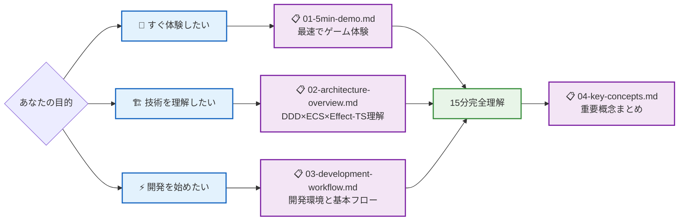
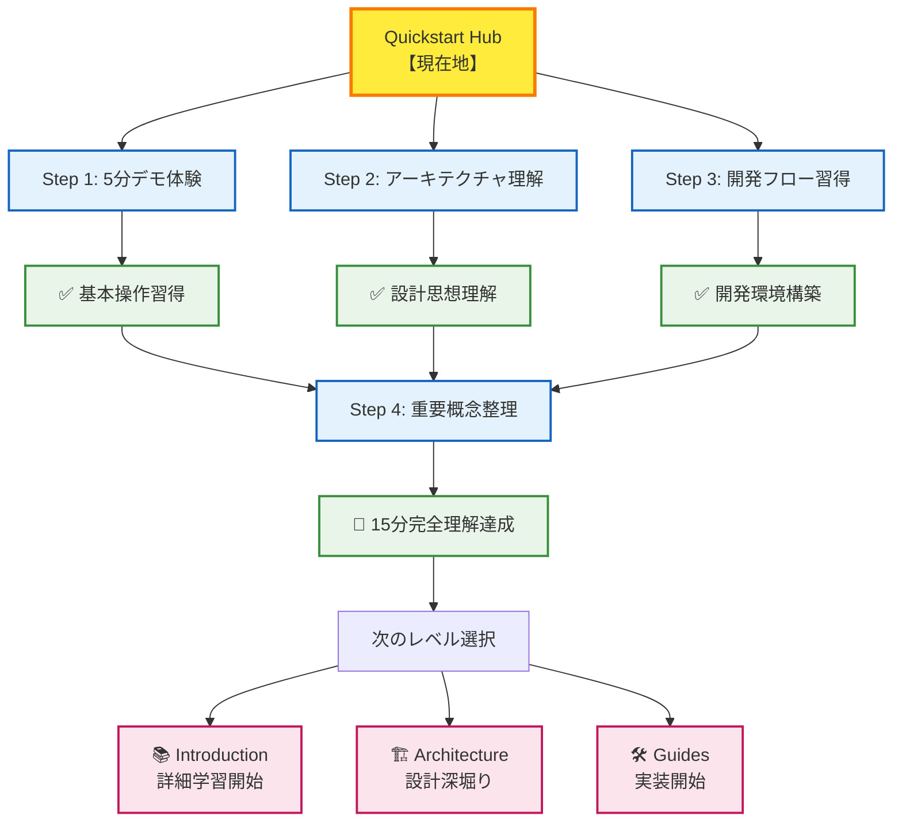

# 🎯 Quickstart Hub - 15分完全理解への道

## 🧭 スマートナビゲーション

> **📍 現在位置**: ドキュメント → **Quickstart Hub**
> **🎯 最終目標**: 15分でプロジェクト全体像の完全理解
> **⏱️ 段階構成**: 5分体験 → 10分理解 → 15分開発準備
> **👤 対象**: 初回訪問者・技術評価・学習開始希望者

## 📋 学習ロードマップ（15分完全ガイド）

```mermaid
journey
    title TypeScript Minecraft 15分マスタリー
    section 5分: 即座体験
      ゲーム起動: 5: User
      基本操作確認: 5: User
      機能体験: 5: User
    section 10分: 全体理解
      アーキテクチャ把握: 5: User
      技術スタック理解: 5: User
      設計思想理解: 5: User
    section 15分: 開発準備
      開発環境構築: 5: User
      基本ワークフロー: 5: User
      重要概念理解: 5: User
```



## 🎮 全コンテンツ一覧（推奨順序）

| ステップ | ドキュメント | 目的 | 所要時間 | 前提知識 |
|---------|-------------|-----|---------|----------|
| **Step 1** | [📋 01-5min-demo.md](./01-5min-demo.md) | 🚀 最速ゲーム体験 | 5分 | なし |
| **Step 2** | [📋 02-architecture-overview.md](./02-architecture-overview.md) | 🏗️ アーキテクチャ理解 | 5分 | 基本的なプログラミング知識 |
| **Step 3** | [📋 03-development-workflow.md](./03-development-workflow.md) | ⚡ 開発フロー習得 | 5分 | TypeScript基礎 |
| **Step 4** | [📋 04-key-concepts.md](./04-key-concepts.md) | 🧠 重要概念整理 | 数分 | 上記3ステップ完了 |

### 📊 学習成果チェックリスト

#### 🎯 5分目標（Step 1完了）
- [ ] ✅ ゲーム画面でMinecraftが動作している
- [ ] 🕹️ WASD移動とマウス視点変更ができる
- [ ] 🔨 ブロック破壊・設置の基本操作ができる

#### 🎯 10分目標（Step 2完了）
- [ ] 🏗️ DDD（ドメイン駆動設計）の基本概念を理解
- [ ] ⚡ Effect-TS 3.17+の役割を理解
- [ ] 🎮 ECS（エンティティコンポーネントシステム）の仕組みを理解

#### 🎯 15分目標（Step 3-4完了）
- [ ] 💻 ローカル開発環境の構築完了
- [ ] 🛠️ 基本的な開発ワークフロー理解
- [ ] 📚 重要なEffect-TSパターン（Schema.Struct、Context.GenericTag等）把握

## 🎊 完了！次のステップへ

### 🌟 15分完全マスタリー達成パス



### 🎯 最適化された学習継続パス

#### 🏁 **レベル1完了者向け**（基本操作習得済み）
1. **技術理解重視**: [Architecture](../01-architecture/README.md) → DDD×ECS×Effect-TS詳細
2. **実装重視**: [Guides](../03-guides/README.md) → 具体的開発手順
3. **包括理解**: [Introduction](../00-introduction/README.md) → 体系的学習

#### 🔄 **反復学習者向け**（技術評価・復習）
1. **仕様詳細**: [Specifications](../02-specifications/README.md) → 機能完全理解
2. **パターン学習**: [Pattern Catalog](../07-pattern-catalog/README.md) → 実装パターン習得
3. **リファレンス**: [Reference](../05-reference/README.md) → API・設定詳細

### 🏆 Quickstart完全達成の証明

すべてのステップを完了した方は、以下の知識を習得しています：

```typescript
// あなたが今理解している TypeScript Minecraft の基本構造
interface QuickstartMastery {
  gameExperience: {
    canLaunchGame: true
    canMove: true
    canBreakBlocks: true
    canPlaceBlocks: true
  }
  architectureUnderstanding: {
    knowsDDD: true
    understandsEffectTS: true
    graspECS: true
  }
  developmentReadiness: {
    hasLocalEnvironment: true
    understandsWorkflow: true
    knowsKeyConcepts: true
  }
}
```

## 🆘 困ったときの緊急ガイド

### ⚡ よくある問題の即座解決

| 問題 | 症状 | 解決法 | 参照 |
|------|------|--------|------|
| **環境問題** | `pnpm install`エラー | Node.js 18+へアップデート | [環境構築](../00-introduction/01-getting-started.md) |
| **表示問題** | 画面が真っ白 | F12でエラー確認 | [トラブルシューティング](../03-guides/04-error-resolution.md) |
| **操作問題** | キーが効かない | ブラウザフォーカス確認 | [基本操作](./01-5min-demo.md#basic-controls) |
| **理解困難** | 概念が複雑 | 段階的学習に戻る | [重要概念](./04-key-concepts.md) |

### 📞 さらなるサポート

- **技術的質問**: [Issue Template](https://github.com/takeokunn/ts-minecraft/issues/new)
- **設計相談**: [Architecture Discussion](../01-architecture/README.md)
- **コミュニティ**: [開発者向けガイド](../03-guides/README.md)

---

### 🚀 **おめでとうございます！**

**あなたは今、Effect-TS 3.17+による最新のゲーム開発アーキテクチャを理解し、実際に動作するMinecraftクローンを体験しました。**

**この15分間で習得した知識を基に、本格的なゲーム開発の世界へ進んでください！**

---

*📍 現在のドキュメント階層*: **[Home](../../README.md)** → **[Quickstart Hub](./README.md)** → *各Stepドキュメントへ*