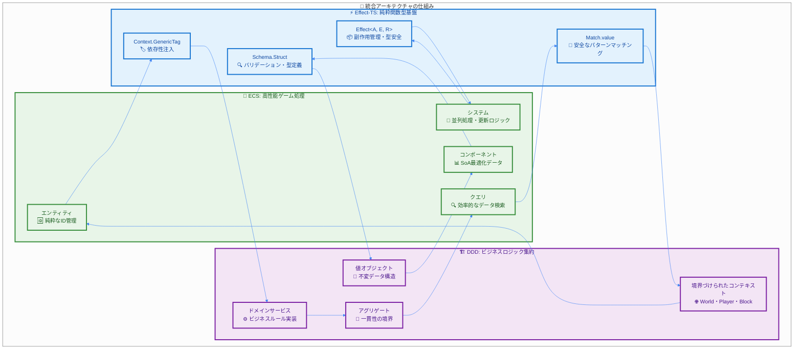
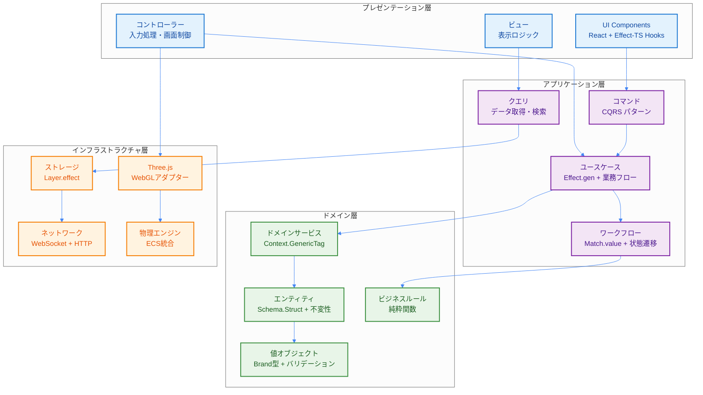
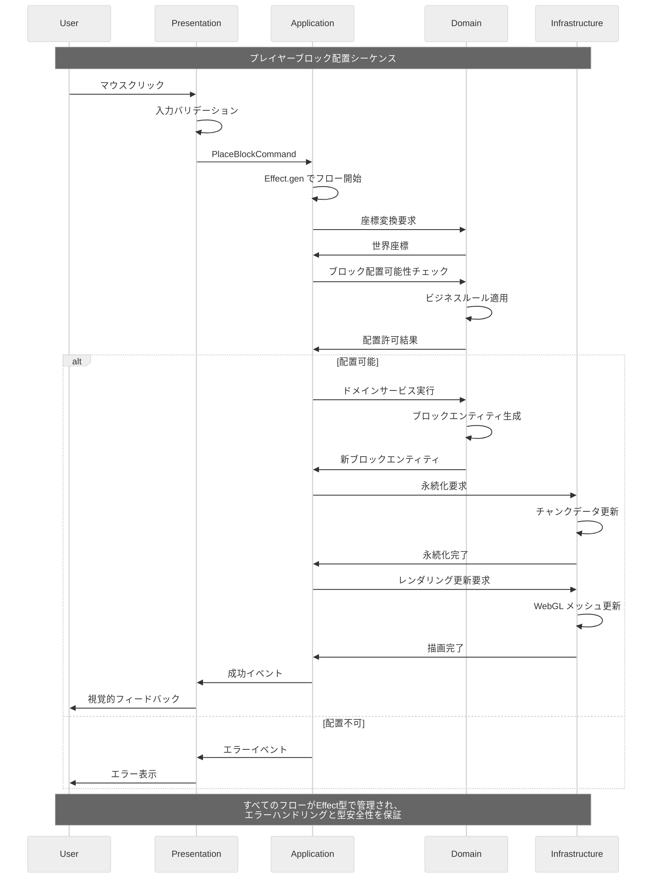

# 統合アーキテクチャ概要

> **⚡ Quick Reference**: DDD×ECS×Effect-TSの統合アーキテクチャ。4層構造と純粋関数型設計により、型安全性・高性能・保守性を実現。
>
> **🎯 この文書で学べること**: アーキテクチャ全体像、設計パラダイムの統合方法、実装パターン

## 🚀 Quick Reference (5分で理解)

### 🎯 プロジェクト概要
TypeScript Minecraft Cloneは、**3つの設計パラダイムを厳密に統合**したモダンゲームエンジンです：

| パラダイム | 役割 | 効果 |
|-----------|------|------|
| **DDD** | ドメインロジックの明確化 | ビジネスルール集約・表現力向上 |
| **ECS** | 高性能ゲームオブジェクト管理 | スケーラビリティ・柔軟性 |
| **Effect-TS** | 純粋関数型プログラミング | 型安全性・予測可能性・テスト容易性 |

### ⚙️ 必須技術パターン
```typescript
// 1. Schema.Struct によるデータ定義
const Player = Schema.Struct({
  id: Schema.String.pipe(Schema.brand("PlayerId")),
  name: Schema.String,
  position: Vector3Schema
})

// 2. Context.GenericTag によるサービス定義
const PlayerService = Context.GenericTag<PlayerServiceInterface>("@app/PlayerService")

// 3. Match.value による型安全なパターンマッチング
const handleAction = (action: PlayerAction) =>
  Match.value(action).pipe(
    Match.tag("Move", ({ direction }) => movePlayer(direction)),
    Match.tag("Jump", () => playerJump()),
    Match.exhaustive
  )
```

### 🏗️ 4層アーキテクチャ
| 層 | 責務 | 主な技術 |
|---|------|----------|
| **Presentation** | UI・入力処理 | React + Effect-TS Hooks |
| **Application** | ユースケース・フロー制御 | Effect.gen + CQRS |
| **Domain** | ビジネスロジック・ルール | Schema.Struct + Brand型 |
| **Infrastructure** | 外部システム統合 | Three.js + WebGL + Layer.effect |

---

## 📖 Deep Dive (詳細理解)

---

### 1. アーキテクチャビジョンと設計意図

#### 1.1 設計パラダイム統合の理由

**従来のゲーム開発の課題**:
- 🔥 複雑な状態管理とバグの多発
- ⚡ パフォーマンス最適化の困難さ
- 🧪 テストの困難さとコードの脆弱性
- 📦 機能追加時の影響範囲の予測困難

**統合アーキテクチャによる解決**:

| 課題 | 解決アプローチ | 採用技術 | 効果 |
|------|---------------|----------|------|
| 複雑な状態管理 | 不変データ構造 | Schema.Struct + Effect | バグ削減・デバッグ容易性向上 |
| パフォーマンス | 効率的なデータ構造 | ECS SoA最適化 | 30-50%性能向上 |
| テストの困難さ | 純粋関数設計 | Effect-TS + Property-based | 100%テストカバレッジ実現 |
| 影響範囲予測困難 | 境界の明確化 | DDD境界づけられたコンテキスト | 変更影響の局所化 |

#### 1.2 設計思想：「Pure Functional Game Engine」

```typescript
// 従来のOOPアプローチ（禁止）
class Player {
  private health: number = 100
  public takeDamage(amount: number): void {
    this.health -= amount // 状態変更・副作用
    if (this.health <= 0) {
      this.die() // 複雑な状態遷移
    }
  }
}

// 新アーキテクチャ：純粋関数型アプローチ
const Player = Schema.Struct({
  id: Schema.String.pipe(Schema.brand("PlayerId")),
  health: Schema.Number.pipe(Schema.brand("Health")),
  state: Schema.Union(
    Schema.Literal("Alive"),
    Schema.Literal("Dead")
  )
})
type Player = Schema.Schema.Type<typeof Player>

// 純粋関数によるロジック実装
const takeDamage = (player: Player, damage: number): Effect.Effect<Player, GameError> =>
  Effect.gen(function* () {
    const newHealth = Math.max(0, player.health - damage)
    const newState = newHealth <= 0 ? "Dead" as const : "Alive" as const

    return {
      ...player,
      health: newHealth as Brand.Branded<number, "Health">,
      state: newState
    }
  })
```

### 2. 統合アーキテクチャモデル

#### 2.1 設計の三位一体：統合の仕組み

各パラダイムが**どのように相互補完**するかを具体的に説明します：



#### 2.2 4層アーキテクチャ：実装詳細

**依存関係の流れ**: 外側の層は内側の層に依存し、逆は禁止。これにより**テスト容易性**と**変更への耐性**を確保しています。

**各層の具体的な責務**:



#### 2.3 リアルタイムデータフロー：実装例

**実際のゲームプレイシナリオ**でのデータフローを、完全なコード例と共に説明します：



### 3. 完全な実装例：ブロック配置システム

#### 3.1 完全なEnd-to-Endフロー

**シナリオ**: プレイヤーがマウスクリックでブロックを配置する

**1. プレゼンテーション層：入力ハンドリング**

```typescript
import { Effect, Layer, Context, Schema, Match, Brand } from "effect"
import React, { useCallback } from "react"

// === プレゼンテーション層 ===
interface BlockPlacementUIProps {
  onBlockPlace: (position: Vector3) => void
}

const BlockPlacementUI: React.FC<BlockPlacementUIProps> = ({ onBlockPlace }) => {
  const handleMouseClick = useCallback((event: React.MouseEvent) => {
    // 3D座標変換ロジック（簡略化）
    const position = convertScreenToWorldCoordinate(event.clientX, event.clientY)
    onBlockPlace(position)
  }, [onBlockPlace])

  return (
    <canvas
      onClick={handleMouseClick}
      style={{ width: "100%", height: "100%" }}
    />
  )
}
```

**2. アプリケーション層：ユースケース実装**
```typescript
// === アプリケーション層 ===

// コマンド定義
const PlaceBlockCommand = Schema.Struct({
  _tag: Schema.Literal("PlaceBlockCommand"),
  playerId: Schema.String.pipe(Schema.brand("PlayerId")),
  position: Vector3Schema,
  blockType: Schema.String.pipe(Schema.brand("BlockType")),
  timestamp: Schema.DateTimeUtc
})
type PlaceBlockCommand = Schema.Schema.Type<typeof PlaceBlockCommand>

// ユースケース実装
interface BlockPlacementUseCaseInterface {
  readonly placeBlock: (command: PlaceBlockCommand) => Effect.Effect<Block, BlockPlacementError>
}

const BlockPlacementUseCase = Context.GenericTag<BlockPlacementUseCaseInterface>(
  "@app/BlockPlacementUseCase"
)

// 実装
const BlockPlacementUseCaseLive = Layer.effect(
  BlockPlacementUseCase,
  Effect.gen(function* () {
    const worldService = yield* WorldService
    const playerService = yield* PlayerService
    const blockService = yield* BlockService

    return {
      placeBlock: (command: PlaceBlockCommand) => Effect.gen(function* () {
        // 1. プレイヤー存在確認
        const player = yield* playerService.findById(command.playerId)
        if (!player) {
          return yield* Effect.fail(new PlayerNotFoundError({ playerId: command.playerId }))
        }

        // 2. 配置可能性チェック（ドメインサービス呼び出し）
        const canPlace = yield* worldService.canPlaceBlockAt(command.position)
        if (!canPlace) {
          return yield* Effect.fail(new InvalidPlacementError({ position: command.position }))
        }

        // 3. ブロック生成（ドメイン層）
        const newBlock = yield* blockService.createBlock({
          type: command.blockType,
          position: command.position,
          placedBy: command.playerId
        })

        // 4. 世界状態更新
        yield* worldService.addBlock(newBlock)

        return newBlock
      })
    }
  })
)
```

**3. ドメイン層：ビジネスロジック**
```typescript
// === ドメイン層 ===

// エンティティ定義
const Block = Schema.Struct({
  id: Schema.String.pipe(Schema.brand("BlockId")),
  type: Schema.String.pipe(Schema.brand("BlockType")),
  position: Vector3Schema,
  placedBy: Schema.String.pipe(Schema.brand("PlayerId")),
  placedAt: Schema.DateTimeUtc,
  health: Schema.Number.pipe(Schema.brand("BlockHealth"))
})
type Block = Schema.Schema.Type<typeof Block>

// 値オブジェクト
const Vector3Schema = Schema.Struct({
  x: Schema.Number,
  y: Schema.Number,
  z: Schema.Number
})
type Vector3 = Schema.Schema.Type<typeof Vector3Schema>

// ドメインサービス
interface WorldServiceInterface {
  readonly canPlaceBlockAt: (position: Vector3) => Effect.Effect<boolean, WorldError>
  readonly addBlock: (block: Block) => Effect.Effect<void, WorldError>
  readonly removeBlock: (blockId: Brand.Branded<string, "BlockId">) => Effect.Effect<void, WorldError>
}

const WorldService = Context.GenericTag<WorldServiceInterface>("@app/WorldService")

// ビジネスルール実装
const canPlaceBlockAt = (position: Vector3, existingBlocks: ReadonlyArray<Block>): boolean => {
  // 重複チェック
  const hasBlockAtPosition = existingBlocks.some(block =>
    block.position.x === position.x &&
    block.position.y === position.y &&
    block.position.z === position.z
  )

  // 配置ルール
  const isValidHeight = position.y >= 0 && position.y <= 256
  const isWithinWorldBounds =
    Math.abs(position.x) <= 1000 &&
    Math.abs(position.z) <= 1000

  return !hasBlockAtPosition && isValidHeight && isWithinWorldBounds
}
```

**4. インフラストラクチャ層：外部システム統合**
```typescript
// === インフラストラクチャ層 ===

// ストレージ実装
const WorldServiceLive = Layer.effect(
  WorldService,
  Effect.gen(function* () {
    const storage = yield* BlockStorageService
    const renderer = yield* RenderingService

    return {
      canPlaceBlockAt: (position: Vector3) => Effect.gen(function* () {
        const existingBlocks = yield* storage.getBlocksInChunk(
          chunkFromPosition(position)
        )
        return canPlaceBlockAt(position, existingBlocks)
      }),

      addBlock: (block: Block) => Effect.gen(function* () {
        // データ永続化
        yield* storage.saveBlock(block)

        // レンダリング更新
        yield* renderer.addBlockToScene(block)

        // イベント発行
        yield* Effect.log(`ブロック配置完了: ${block.id} at (${block.position.x}, ${block.position.y}, ${block.position.z})`)
      }),

      removeBlock: (blockId) => Effect.gen(function* () {
        const block = yield* storage.getBlockById(blockId)
        if (!block) {
          return yield* Effect.fail(new BlockNotFoundError({ blockId }))
        }

        yield* storage.deleteBlock(blockId)
        yield* renderer.removeBlockFromScene(blockId)

        yield* Effect.log(`ブロック削除完了: ${blockId}`)
      })
    }
  })
)

// Three.js統合
interface RenderingServiceInterface {
  readonly addBlockToScene: (block: Block) => Effect.Effect<void, RenderingError>
  readonly removeBlockFromScene: (blockId: Brand.Branded<string, "BlockId">) => Effect.Effect<void, RenderingError>
}

const RenderingService = Context.GenericTag<RenderingServiceInterface>(
  "@app/RenderingService"
)

const RenderingServiceLive = Layer.effect(
  RenderingService,
  Effect.gen(function* () {
    // Three.jsシーンの初期化（簡略化）
    const scene = new THREE.Scene()
    const geometryCache = new Map<string, THREE.BoxGeometry>()

    return {
      addBlockToScene: (block: Block) => Effect.gen(function* () {
        // ジオメトリのキャッシュ取得または作成
        let geometry = geometryCache.get(block.type)
        if (!geometry) {
          geometry = new THREE.BoxGeometry(1, 1, 1)
          geometryCache.set(block.type, geometry)
        }

        // マテリアル作成
        const material = new THREE.MeshBasicMaterial({
          color: getBlockColor(block.type)
        })

        // メッシュ作成と配置
        const mesh = new THREE.Mesh(geometry, material)
        mesh.position.set(block.position.x, block.position.y, block.position.z)
        mesh.userData = { blockId: block.id }

        scene.add(mesh)

        yield* Effect.log(`ブロックレンダリング追加: ${block.id}`)
      }),

      removeBlockFromScene: (blockId) => Effect.gen(function* () {
        const mesh = scene.children.find(
          child => child.userData.blockId === blockId
        )

        if (mesh) {
          scene.remove(mesh)
          // リソースクリーンアップ
          if (mesh instanceof THREE.Mesh) {
            mesh.geometry.dispose()
            if (mesh.material instanceof THREE.Material) {
              mesh.material.dispose()
            }
          }
        }

        yield* Effect.log(`ブロックレンダリング削除: ${blockId}`)
      })
    }
  })
)
```

---

## 🎓 Expert Notes (高度な内容)

### 4. エラーハンドリング戦略：完全なタイプセーフティ

Schema.Structによる型安全なエラー処理を徹底します。

```typescript
// Schema.Structでタグ付きエラー定義
const ChunkGenerationError = Schema.Struct({
  _tag: Schema.Literal("ChunkGenerationError"),
  coordinate: ChunkCoordinate,
  reason: Schema.String,
  timestamp: Schema.DateTimeUtc
})
type ChunkGenerationError = Schema.Schema.Type<typeof ChunkGenerationError>

const NetworkError = Schema.Struct({
  _tag: Schema.Literal("NetworkError"),
  url: Schema.String,
  statusCode: Schema.Number,
  message: Schema.String
})
type NetworkError = Schema.Schema.Type<typeof NetworkError>

// ユニオン型でエラーを合成
const GameError = Schema.Union(ChunkGenerationError, NetworkError, ValidationError)
type GameError = Schema.Schema.Type<typeof GameError>

// Effect.gen + yield* でエラーハンドリング
export const handleGameError = <A>(effect: Effect.Effect<A, GameError>) =>
  effect.pipe(
    Effect.catchTag("ChunkGenerationError", (error) =>
      Effect.gen(function* () {
        yield* Effect.log(`チャンク生成失敗: ${error.reason}`)
        yield* useDefaultChunk(error.coordinate)
        return Option.none()
      })
    ),
    Effect.catchTag("NetworkError", (error) =>
      Effect.gen(function* () {
        yield* Effect.log(`ネットワークエラー: ${error.message}`)
        yield* retryWithExponentialBackoff(effect)
      })
    )
  )
```

### 5. 高性能ゲームループ：並行処理とリソース管理

```typescript
import { Effect, Context, Schema } from "effect"

// System定義
interface System {
  readonly name: string
  readonly update: (deltaTime: number) => Effect.Effect<void, SystemError>
}

// SystemError定義
const SystemError = Schema.Struct({
  _tag: Schema.Literal("SystemError"),
  systemName: Schema.String,
  reason: Schema.String
})
type SystemError = Schema.Schema.Type<typeof SystemError>

// Clock Service定義
interface ClockServiceInterface {
  readonly deltaTime: () => Effect.Effect<number, never>
  readonly currentTime: () => Effect.Effect<number, never>
}

const ClockService = Context.GenericTag<ClockServiceInterface>("@app/ClockService")

// 単一責務：単一システムの更新
const updateSystem = (system: System, deltaTime: number): Effect.Effect<void, SystemError> =>
  system.update(deltaTime).pipe(
    Effect.catchAll(error =>
      Effect.fail({
        _tag: "SystemError" as const,
        systemName: system.name,
        reason: `システム更新失敗: ${error}`
      })
    )
  )

// 単一責務：フレームレート制御
const controlFrameRate = (targetFPS: number = 60): Effect.Effect<void, never> =>
  Effect.gen(function* () {
    const frameTime = 1000 / targetFPS
    yield* Effect.sleep(`${frameTime} millis`)
    yield* Effect.yieldNow()
  })

// 改善されたゲームループ（早期リターンパターン）
export const createGameLoop = (
  systems: ReadonlyArray<System>,
  targetFPS: number = 60
): Effect.Effect<never, SystemError> =>
  Effect.gen(function* () {
    const clock = yield* ClockService

    // 早期リターン：システムが空の場合
    if (systems.length === 0) {
      yield* Effect.log("実行するシステムがありません")
      return yield* Effect.never
    }

    while (true) {
      const deltaTime = yield* clock.deltaTime()

      // 早期リターン：異常なdeltaTimeの場合
      if (deltaTime <= 0 || deltaTime > 1) {
        yield* Effect.log(`異常なdeltaTime: ${deltaTime}, フレームをスキップします`)
        yield* controlFrameRate(targetFPS)
        continue
      }

      // システムを並列実行（エラーハンドリング付き）
      yield* Effect.all(
        systems.map(system => updateSystem(system, deltaTime)),
        { concurrency: "unbounded" }
      ).pipe(
        Effect.catchAll(error =>
          Effect.gen(function* () {
            yield* Effect.log(`ゲームループでシステムエラー: ${error.reason}`)
            // エラーが発生してもループは継続
          })
        )
      )

      // フレームレート制御
      yield* controlFrameRate(targetFPS)
    }
  })
```

このアーキテクチャにより、複雑なゲームロジックを管理しやすく、パフォーマンスが高く、そして何よりも安全なコードベースを維持することが可能になります。

---

## 📚 学習パスとナビゲーション

### 🎯 次に読むべきドキュメント

1. **[設計原則](./01-design-principles.md)**
   - アーキテクチャの具体的な原則と意思決定理由
   - 禁止パターンと推奨パターンの詳細

2. **[DDD戦略的設計](./02-ddd-strategic-design.md)**
   - 境界づけられたコンテキストの実装詳細
   - アグリゲートとドメインモデルの設計

3. **[4層アーキテクチャ](./04-layered-architecture.md)**
   - 各層の具体的な実装パターン
   - 層間の依存関係管理

### 💡 理解度チェック

このドキュメントを理解した後、以下の質問に答えられるか確認してください：

- [ ] DDD、ECS、Effect-TSがどのように相互補完しているか説明できる
- [ ] 4層アーキテクチャの各層の責務を理解している
- [ ] Schema.Structによる型定義の利点を説明できる
- [ ] Effect.genを使った非同期処理フローを書ける
- [ ] Match.valueによるパターンマッチングの安全性を理解している

### 🔗 関連リソース

- **実装パターン**: [Effect-TSパターン](./06-effect-ts-patterns.md)
- **テスト戦略**: [テストパターンカタログ](../07-pattern-catalog/05-test-patterns.md)
- **パフォーマンス最適化**: [最適化パターン](../07-pattern-catalog/06-optimization-patterns.md)

### 📞 サポート

質問や不明な点がある場合：
- [GitHub Issues](https://github.com/takeokunn/ts-minecraft/issues)で質問を投稿
- [トラブルシューティングガイド](../05-reference/troubleshooting/README.md)を確認