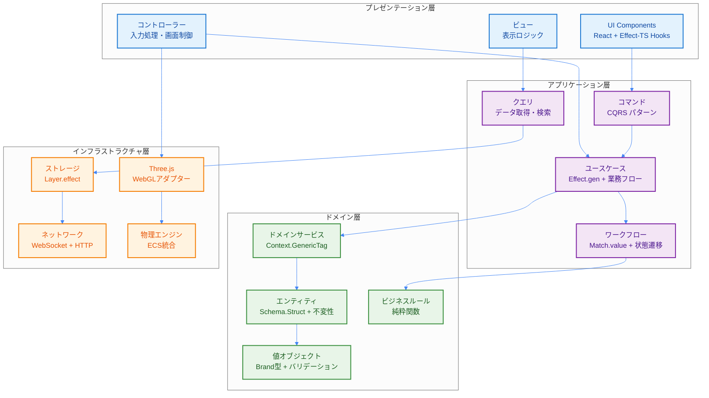
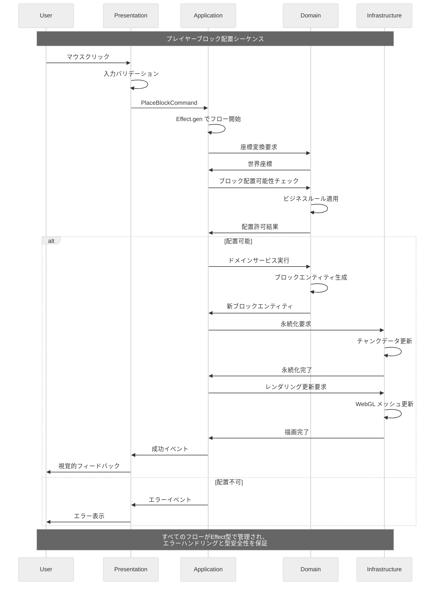

# 統合アーキテクチャ概要

## 1. プロジェクトビジョン

TypeScript Minecraft Cloneは、以下の3つの設計パラダイムを**厳密に**統合した、次世代のボクセルサンドボックスゲームエンジンです：

- **ドメイン駆動設計 (DDD)**: ビジネスロジックの明確な境界と表現力豊かなドメインモデル
- **エンティティコンポーネントシステム (ECS)**: 高性能でスケーラブルなゲームオブジェクト管理
- **Effect-TS**: 純粋関数型プログラミングによる完全な副作用管理

この統合により、**完全な型安全性**、**予測可能性**、**高性能**、**保守性**、**テスト容易性**を高いレベルで実現します。

## 2. 統合アーキテクチャモデル

### 2.1 設計の三位一体

三つの設計パラダイムの統合構造を以下に示します。各層が相互に補完し合い、高品質なソフトウェアアーキテクチャを実現しています。

```mermaid
%%{init: {"theme": "neutral", "themeVariables": {"primaryColor": "#4285f4", "primaryTextColor": "#ffffff", "primaryBorderColor": "#ffffff", "lineColor": "#4285f4", "sectionBkgColor": "#f5f7fa", "tertiaryColor": "#f5f7fa"}}}%%
graph TD
    subgraph EffectTS ["純粋関数型コア (Effect-TS)"]
        subgraph DDD ["ドメイン駆動設計 (DDD)"]
            subgraph ECS ["エンティティコンポーネントシステム (ECS)"]
                Entity["エンティティ<br/>(純粋なID)"]
                Component["コンポーネント<br/>(Schemaによる不変データ)"]
                System["システム<br/>(Effect関数)"]
            end

            Aggregate["アグリゲート<br/>(一貫性の境界)"]
            ValueObject["値オブジェクト<br/>(不変なSchema)"]
            DomainService["ドメインサービス<br/>(純粋関数)"]
        end

        EffectCore["Effect&lt;A, E, R&gt;<br/>(副作用管理)"]
        Layer["Layer<br/>(依存性注入)"]
        Schema["Schema<br/>(型安全なバリデーション)"]
    end

    Entity -.-> Component
    Component -.-> System
    System --> Aggregate
    Aggregate --> ValueObject
    ValueObject --> DomainService
    DomainService --> EffectCore
    EffectCore --> Layer
    Layer --> Schema

    classDef effectBox fill:#e3f2fd,stroke:#1976d2,stroke-width:2px,color:#0d47a1
    classDef dddBox fill:#f3e5f5,stroke:#7b1fa2,stroke-width:2px,color:#4a148c
    classDef ecsBox fill:#e8f5e8,stroke:#388e3c,stroke-width:2px,color:#1b5e20

    class EffectTS,EffectCore,Layer,Schema effectBox
    class DDD,Aggregate,ValueObject,DomainService dddBox
    class ECS,Entity,Component,System ecsBox
```



### 2.2 4層アーキテクチャ

Clean ArchitectureとDDDの原則に基づく、依存関係の明確な4層構造です。内側の層は外側の層に依存せず、高い保守性を実現しています。



### 2.3 データフローとアーキテクチャレイヤー間の相互作用

以下の図は、ユーザーアクションから最終的な状態更新までの完全なデータフローを示しています。



## 3. 主要な特徴と開発ガイドライン

- **🎯 純粋関数型設計**: `class`構文は禁止。Effect-TSによる完全な関数型プログラミング。
- **🚀 最新Effect-TSパターン**: `Schema.Struct`, `@app/ServiceName` (Context.GenericTag), `Match.value` を採用。
- **🏗️ DDD + ECS統合**: 境界づけられたコンテキストとStructure of Arrays (SoA) 最適化を両立。
- **⚡ 高性能アーキテクチャ**: グリーディメッシング、視錐台カリング、Web Workerによる並列処理。
- **🔧 完全型安全**: Schema駆動開発とコンパイル時エラー検出。

### 必須開発パターン (2024年版)

```typescript
import { Effect, Layer, Context, Schema, Match } from "effect"

// 1. Schema.Struct でデータ定義
const Vector3Schema = Schema.Struct({
  x: Schema.Number,
  y: Schema.Number,
  z: Schema.Number
})

const Player = Schema.Struct({
  _tag: Schema.Literal("Player"),
  id: Schema.String.pipe(Schema.brand("PlayerId")),
  name: Schema.String,
  position: Vector3Schema
})
type Player = Schema.Schema.Type<typeof Player>

// エラー定義
const ValidationError = Schema.Struct({
  _tag: Schema.Literal("ValidationError"),
  message: Schema.String,
  cause: Schema.optional(Schema.Unknown)
})
type ValidationError = Schema.Schema.Type<typeof ValidationError>

// PlayerAction定義
const MoveAction = Schema.Struct({
  _tag: Schema.Literal("Move"),
  direction: Vector3Schema
})

const JumpAction = Schema.Struct({
  _tag: Schema.Literal("Jump")
})

const PlayerAction = Schema.Union(MoveAction, JumpAction)
type PlayerAction = Schema.Schema.Type<typeof PlayerAction>

// 2. Context.GenericTag でサービス定義
interface PlayerServiceInterface {
  readonly movePlayer: (direction: Schema.Schema.Type<typeof Vector3Schema>) => Effect.Effect<void, never>
  readonly playerJump: () => Effect.Effect<void, never>
}

const PlayerService = Context.GenericTag<PlayerServiceInterface>("@app/PlayerService")

// 3. Match.value でパターンマッチング
const handlePlayerAction = (action: PlayerAction): Effect.Effect<void, never> =>
  Match.value(action).pipe(
    Match.tag("Move", ({ direction }) =>
      Effect.gen(function* () {
        const playerService = yield* PlayerService
        yield* playerService.movePlayer(direction)
      })
    ),
    Match.tag("Jump", () =>
      Effect.gen(function* () {
        const playerService = yield* PlayerService
        yield* playerService.playerJump()
      })
    ),
    Match.exhaustive
  )

// 4. 早期リターンで最適化
const validatePlayer = (player: unknown): Effect.Effect<Player, ValidationError> =>
  Effect.gen(function* () {
    // 早期リターン: 基本的なバリデーション
    if (!player || typeof player !== "object") {
      return yield* Effect.fail({
        _tag: "ValidationError" as const,
        message: "Invalid player data"
      })
    }

    // Schema による検証
    return yield* Schema.decodeUnknownEither(Player)(player).pipe(
      Effect.mapError(error => ({
        _tag: "ValidationError" as const,
        message: "Player validation failed",
        cause: error
      }))
    )
  })
```

## 4. エラーハンドリング戦略

Schema.Structによる型安全なエラー処理を徹底します。

```typescript
// Schema.Structでタグ付きエラー定義
const ChunkGenerationError = Schema.Struct({
  _tag: Schema.Literal("ChunkGenerationError"),
  coordinate: ChunkCoordinate,
  reason: Schema.String,
  timestamp: Schema.DateTimeUtc
})
type ChunkGenerationError = Schema.Schema.Type<typeof ChunkGenerationError>

const NetworkError = Schema.Struct({
  _tag: Schema.Literal("NetworkError"),
  url: Schema.String,
  statusCode: Schema.Number,
  message: Schema.String
})
type NetworkError = Schema.Schema.Type<typeof NetworkError>

// ユニオン型でエラーを合成
const GameError = Schema.Union(ChunkGenerationError, NetworkError, ValidationError)
type GameError = Schema.Schema.Type<typeof GameError>

// Effect.gen + yield* でエラーハンドリング
export const handleGameError = <A>(effect: Effect.Effect<A, GameError>) =>
  effect.pipe(
    Effect.catchTag("ChunkGenerationError", (error) =>
      Effect.gen(function* () {
        yield* Effect.log(`チャンク生成失敗: ${error.reason}`)
        yield* useDefaultChunk(error.coordinate)
        return Option.none()
      })
    ),
    Effect.catchTag("NetworkError", (error) =>
      Effect.gen(function* () {
        yield* Effect.log(`ネットワークエラー: ${error.message}`)
        yield* retryWithExponentialBackoff(effect)
      })
    )
  )
```

## 5. ゲームループ

```typescript
import { Effect, Context, Schema } from "effect"

// System定義
interface System {
  readonly name: string
  readonly update: (deltaTime: number) => Effect.Effect<void, SystemError>
}

// SystemError定義
const SystemError = Schema.Struct({
  _tag: Schema.Literal("SystemError"),
  systemName: Schema.String,
  reason: Schema.String
})
type SystemError = Schema.Schema.Type<typeof SystemError>

// Clock Service定義
interface ClockServiceInterface {
  readonly deltaTime: () => Effect.Effect<number, never>
  readonly currentTime: () => Effect.Effect<number, never>
}

const ClockService = Context.GenericTag<ClockServiceInterface>("@app/ClockService")

// 単一責務：単一システムの更新
const updateSystem = (system: System, deltaTime: number): Effect.Effect<void, SystemError> =>
  system.update(deltaTime).pipe(
    Effect.catchAll(error =>
      Effect.fail({
        _tag: "SystemError" as const,
        systemName: system.name,
        reason: `システム更新失敗: ${error}`
      })
    )
  )

// 単一責務：フレームレート制御
const controlFrameRate = (targetFPS: number = 60): Effect.Effect<void, never> =>
  Effect.gen(function* () {
    const frameTime = 1000 / targetFPS
    yield* Effect.sleep(`${frameTime} millis`)
    yield* Effect.yieldNow()
  })

// 改善されたゲームループ（早期リターンパターン）
export const createGameLoop = (
  systems: ReadonlyArray<System>,
  targetFPS: number = 60
): Effect.Effect<never, SystemError> =>
  Effect.gen(function* () {
    const clock = yield* ClockService

    // 早期リターン：システムが空の場合
    if (systems.length === 0) {
      yield* Effect.log("実行するシステムがありません")
      return yield* Effect.never
    }

    while (true) {
      const deltaTime = yield* clock.deltaTime()

      // 早期リターン：異常なdeltaTimeの場合
      if (deltaTime <= 0 || deltaTime > 1) {
        yield* Effect.log(`異常なdeltaTime: ${deltaTime}, フレームをスキップします`)
        yield* controlFrameRate(targetFPS)
        continue
      }

      // システムを並列実行（エラーハンドリング付き）
      yield* Effect.all(
        systems.map(system => updateSystem(system, deltaTime)),
        { concurrency: "unbounded" }
      ).pipe(
        Effect.catchAll(error =>
          Effect.gen(function* () {
            yield* Effect.log(`ゲームループでシステムエラー: ${error.reason}`)
            // エラーが発生してもループは継続
          })
        )
      )

      // フレームレート制御
      yield* controlFrameRate(targetFPS)
    }
  })
```

このアーキテクチャにより、複雑なゲームロジックを管理しやすく、パフォーマンスが高く、そして何よりも安全なコードベースを維持することが可能になります。