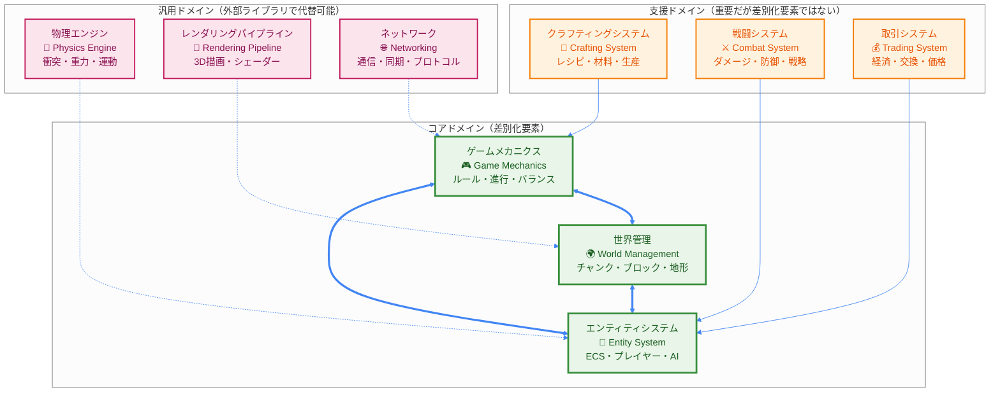

# DDD戦略的設計

```typescript
import { Effect, Match, Option } from "effect"
```

## 1. ドメインコンテキストマップ

TypeScript Minecraft Cloneのドメインは、複数の境界づけられたコンテキスト（Bounded Context）に分割されます。各コンテキストは独立した言語とモデルを持ち、明確に定義された関係性で統合されます。

### 1.1 戦略的設計概観



### 1.2 コンテキスト間の統合パターン

以下の図は、境界づけられたコンテキスト間の統合パターンと情報の流れを詳細に示しています。



## 2. 境界づけられたコンテキスト
### 2.1 世界管理コンテキスト (World Management Context)

**責務**: ゲーム世界の生成、永続化、チャンク管理

```typescript
import { Effect, Context, Schema, Match, Either, Option } from "effect"

// ✅ Brand型で型安全性とドメイン境界を明確化
const WorldId = Schema.String.pipe(Schema.brand("WorldId"))
const WorldSeed = Schema.Number.pipe(Schema.brand("WorldSeed"))
const ChunkId = Schema.String.pipe(Schema.brand("ChunkId"))
const BlockType = Schema.String.pipe(Schema.brand("BlockType"))
const Biome = Schema.String.pipe(Schema.brand("Biome"))

// ✅ 値オブジェクトをSchemaで定義（不変性を保証）
const ChunkCoordinate = Schema.Struct({
  x: Schema.Number,
  z: Schema.Number
}).pipe(
  Schema.brand("ChunkCoordinate"),
  Schema.annotations({
    title: "チャンク座標",
    description: "ワールド内のチャンクの位置を表す値オブジェクト"
  })
)

const Position3D = Schema.Struct({
  x: Schema.Number,
  y: Schema.Number,
  z: Schema.Number
}).pipe(
  Schema.brand("Position3D"),
  Schema.annotations({
    title: "3D座標",
    description: "ワールド内の3次元座標を表す値オブジェクト"
  })
)

// ✅ ドメインイベントをSchemaで定義
const ChunkLoadedEvent = Schema.Struct({
  _tag: Schema.Literal("ChunkLoaded"),
  aggregateId: WorldId,
  chunkId: ChunkId,
  coordinate: ChunkCoordinate,
  timestamp: Schema.Number.pipe(Schema.brand("Timestamp"))
})

const ChunkUnloadedEvent = Schema.Struct({
  _tag: Schema.Literal("ChunkUnloaded"),
  aggregateId: WorldId,
  chunkId: ChunkId,
  coordinate: ChunkCoordinate,
  timestamp: Schema.Number.pipe(Schema.brand("Timestamp"))
})

const WorldDomainEvent = Schema.Union(ChunkLoadedEvent, ChunkUnloadedEvent)
type WorldDomainEvent = Schema.Schema.Type<typeof WorldDomainEvent>

// ✅ アグリゲート境界での検証ルール
const WorldBorder = Schema.Struct({
  size: Schema.Number.pipe(
    Schema.positive(),
    Schema.annotations({ description: "ワールド境界サイズ（正の値）" })
  )
}).pipe(
  Schema.brand("WorldBorder"),
  Schema.annotations({
    title: "ワールド境界",
    description: "ワールドの境界設定を表す値オブジェクト"
  })
)

// ✅ アグリゲートルートをSchemaで定義（不変条件を含む）
const WorldAggregate = Schema.Struct({
  id: WorldId,
  seed: WorldSeed,
  chunks: Schema.Record(ChunkId, Schema.Unknown), // 後でChunk型に差し替え
  worldBorder: WorldBorder,
  spawnPoint: Position3D,
  loadedChunkCount: Schema.Number.pipe(Schema.nonNegative()),
  version: Schema.Number.pipe(Schema.brand("Version"))
}).pipe(
  Schema.brand("WorldAggregate"),
  Schema.annotations({
    title: "ワールドアグリゲート",
    description: "ワールドドメインのアグリゲートルート"
  })
)
type WorldAggregate = Schema.Schema.Type<typeof WorldAggregate>

const Chunk = Schema.Struct({
  id: ChunkId,
  coordinate: ChunkCoordinate,
  blocks: Schema.Array(Schema.Number),
  biome: Biome,
  heightMap: Schema.Array(Schema.Number),
  lightMap: Schema.Array(Schema.Number),
  version: Schema.Number.pipe(Schema.brand("Version"))
}).pipe(
  Schema.brand("Chunk"),
  Schema.annotations({
    title: "チャンクエンティティ",
    description: "ワールドの一部を構成するチャンクエンティティ"
  })
)
type Chunk = Schema.Schema.Type<typeof Chunk>

const Block = Schema.Struct({
  type: BlockType,
  state: Schema.Record(Schema.String, Schema.Unknown),
  metadata: Schema.Record(Schema.String, Schema.Unknown)
}).pipe(
  Schema.brand("Block"),
  Schema.annotations({
    title: "ブロック値オブジェクト",
    description: "ブロックの状態とメタデータを含む値オブジェクト"
  })
)
type Block = Schema.Schema.Type<typeof Block>

// ✅ パターンマッチング対応のエラー型
const WorldManagementError = Schema.Union(
  Schema.Struct({
    _tag: Schema.Literal("ChunkGenerationError"),
    coordinate: ChunkCoordinate,
    reason: Schema.String
  }),
  Schema.Struct({
    _tag: Schema.Literal("WorldPersistenceError"),
    operation: Schema.String,
    reason: Schema.String
  }),
  Schema.Struct({
    _tag: Schema.Literal("WorldLoadError"),
    worldId: WorldId,
    reason: Schema.String
  }),
  Schema.Struct({
    _tag: Schema.Literal("InvariantViolationError"),
    invariant: Schema.String,
    details: Schema.String
  })
)
type WorldManagementError = Schema.Schema.Type<typeof WorldManagementError>

// ✅ リポジトリパターンをEffectサービスで実装
interface WorldRepositoryInterface {
  readonly save: (world: WorldAggregate) => Effect.Effect<void, WorldManagementError>
  readonly findById: (id: WorldId) => Effect.Effect<Option.Option<WorldAggregate>, WorldManagementError>
  readonly exists: (id: WorldId) => Effect.Effect<boolean, WorldManagementError>
}

const WorldRepository = Context.GenericTag<WorldRepositoryInterface>("@world/WorldRepository")

// ✅ ドメインサービスをEffectサービスで定義（集約境界での複雑なビジネスロジック）
interface ChunkGenerationServiceInterface {
  readonly generate: (coordinate: ChunkCoordinate, seed: WorldSeed) =>
    Effect.Effect<Chunk, WorldManagementError>
  readonly validateGeneration: (coordinate: ChunkCoordinate, world: WorldAggregate) =>
    Effect.Effect<boolean, WorldManagementError>
}

const ChunkGenerationService = Context.GenericTag<ChunkGenerationServiceInterface>("@world/ChunkGenerationService")

interface WorldInvariantServiceInterface {
  readonly validateLoadedChunkLimit: (world: WorldAggregate) => Effect.Effect<boolean, never>
  readonly validateChunkConsistency: (world: WorldAggregate, chunk: Chunk) => Effect.Effect<boolean, never>
}

const WorldInvariantService = Context.GenericTag<WorldInvariantServiceInterface>("@world/WorldInvariantService")
```

### 2.2 ゲームメカニクスコンテキスト (Game Mechanics Context)

**責務**: ゲームルール、プレイヤーアクション、ゲーム進行

```typescript
// ゲームメカニクスコンテキスト

// ✅ ユビキタス言語に基づく値オブジェクト定義
const Difficulty = Schema.Union(
  Schema.Literal("Peaceful"),
  Schema.Literal("Easy"),
  Schema.Literal("Normal"),
  Schema.Literal("Hard")
).pipe(
  Schema.brand("Difficulty"),
  Schema.annotations({
    title: "難易度",
    description: "ゲームの難易度設定を表す値オブジェクト"
  })
)
type Difficulty = Schema.Schema.Type<typeof Difficulty>

// ✅ アグリゲート内でのゲームルール
const GameRules = Schema.Struct({
  difficulty: Difficulty,
  pvpEnabled: Schema.Boolean,
  keepInventory: Schema.Boolean,
  mobGriefing: Schema.Boolean,
  daylightCycle: Schema.Boolean,
  weatherCycle: Schema.Boolean
}).pipe(
  Schema.brand("GameRules"),
  Schema.annotations({
    title: "ゲームルール",
    description: "ゲームの基本ルール設定を管理する値オブジェクト"
  })
)
type GameRules = Schema.Schema.Type<typeof GameRules>

// ✅ Brand型でドメイン概念を明確化
const PlayerId = Schema.String.pipe(Schema.brand("PlayerId"))
const ItemId = Schema.String.pipe(Schema.brand("ItemId"))
const EntityId = Schema.String.pipe(Schema.brand("EntityId"))
const RecipeId = Schema.String.pipe(Schema.brand("RecipeId"))

// ✅ 値オブジェクトとして方向性を定義
const Direction3D = Schema.Struct({
  x: Schema.Number,
  y: Schema.Number,
  z: Schema.Number
}).pipe(
  Schema.brand("Direction3D"),
  Schema.annotations({
    title: "3D方向ベクトル",
    description: "3次元空間での移動方向を表す値オブジェクト"
  })
)

// ✅ Position3Dは既に定義済みなので参照

// ✅ ドメインイベント用の基底型
const DomainEventBase = Schema.Struct({
  eventId: Schema.String.pipe(Schema.brand("EventId")),
  aggregateId: Schema.String.pipe(Schema.brand("AggregateId")),
  version: Schema.Number.pipe(Schema.brand("Version")),
  timestamp: Schema.Number.pipe(Schema.brand("Timestamp"))
})

// ✅ プレイヤーアクションをコマンドとして設計
const PlayerCommand = Schema.Union(
  Schema.Struct({
    _tag: Schema.Literal("MoveCommand"),
    playerId: PlayerId,
    direction: Direction3D,
    sprint: Schema.Boolean
  }),
  Schema.Struct({
    _tag: Schema.Literal("JumpCommand"),
    playerId: PlayerId
  }),
  Schema.Struct({
    _tag: Schema.Literal("PlaceBlockCommand"),
    playerId: PlayerId,
    position: Position3D,
    blockType: BlockType
  }),
  Schema.Struct({
    _tag: Schema.Literal("BreakBlockCommand"),
    playerId: PlayerId,
    position: Position3D
  }),
  Schema.Struct({
    _tag: Schema.Literal("UseItemCommand"),
    playerId: PlayerId,
    itemId: ItemId,
    targetEntityId: Schema.optional(EntityId)
  }),
  Schema.Struct({
    _tag: Schema.Literal("OpenInventoryCommand"),
    playerId: PlayerId
  }),
  Schema.Struct({
    _tag: Schema.Literal("CraftCommand"),
    playerId: PlayerId,
    recipeId: RecipeId,
    quantity: Schema.Number.pipe(Schema.positive())
  })
).pipe(
  Schema.brand("PlayerCommand"),
  Schema.annotations({
    title: "プレイヤーコマンド",
    description: "プレイヤーの意図を表現するコマンドオブジェクト"
  })
)
type PlayerCommand = Schema.Schema.Type<typeof PlayerCommand>

// ✅ ゲーム状態のドメインイベント
const GameMechanicsDomainEvent = Schema.Union(
  Schema.Struct({
    _tag: Schema.Literal("PlayerActionExecuted"),
    ...DomainEventBase,
    command: PlayerCommand,
    result: Schema.Union(
      Schema.Struct({ _tag: Schema.Literal("Success"), data: Schema.Unknown }),
      Schema.Struct({ _tag: Schema.Literal("Failure"), error: Schema.String })
    )
  }),
  Schema.Struct({
    _tag: Schema.Literal("GameTimeProgressed"),
    ...DomainEventBase,
    previousTime: Schema.Number.pipe(Schema.brand("GameTime")),
    currentTime: Schema.Number.pipe(Schema.brand("GameTime")),
    deltaTime: Schema.Number
  }),
  Schema.Struct({
    _tag: Schema.Literal("WeatherChanged"),
    ...DomainEventBase,
    previousWeather: Schema.String,
    currentWeather: Schema.String
  })
)
type GameMechanicsDomainEvent = Schema.Schema.Type<typeof GameMechanicsDomainEvent>

// ✅ ゲーム進行アグリゲート
const GameSession = Schema.Struct({
  id: Schema.String.pipe(Schema.brand("GameSessionId")),
  gameRules: GameRules,
  currentTime: Schema.Number.pipe(Schema.brand("GameTime")),
  weather: Schema.Union(
    Schema.Literal("Clear"),
    Schema.Literal("Rain"),
    Schema.Literal("Storm")
  ).pipe(Schema.brand("Weather")),
  activePlayers: Schema.Array(PlayerId),
  version: Schema.Number.pipe(Schema.brand("Version"))
}).pipe(
  Schema.brand("GameSession"),
  Schema.annotations({
    title: "ゲームセッション",
    description: "ゲーム進行状態を管理するアグリゲート"
  })
)
type GameSession = Schema.Schema.Type<typeof GameSession>

// ✅ パターンマッチング対応のエラー型定義
const GameMechanicsError = Schema.Union(
  Schema.Struct({
    _tag: Schema.Literal("CommandValidationError"),
    command: PlayerCommand,
    reason: Schema.String
  }),
  Schema.Struct({
    _tag: Schema.Literal("ActionExecutionError"),
    action: Schema.String,
    playerId: PlayerId,
    reason: Schema.String
  }),
  Schema.Struct({
    _tag: Schema.Literal("ProgressionError"),
    operation: Schema.String,
    reason: Schema.String
  }),
  Schema.Struct({
    _tag: Schema.Literal("RuleViolationError"),
    rule: Schema.String,
    violation: Schema.String
  })
)
type GameMechanicsError = Schema.Schema.Type<typeof GameMechanicsError>

// ✅ コマンドハンドリングのサービス
interface PlayerCommandHandlerInterface {
  readonly handle: (command: PlayerCommand, session: GameSession) =>
    Effect.Effect<GameSession, GameMechanicsError>
  readonly validate: (command: PlayerCommand, session: GameSession) =>
    Effect.Effect<boolean, GameMechanicsError>
}

const PlayerCommandHandler = Context.GenericTag<PlayerCommandHandlerInterface>("@game/PlayerCommandHandler")

// ✅ ゲーム進行サービス
interface GameProgressionServiceInterface {
  readonly tick: (session: GameSession, deltaTime: number) =>
    Effect.Effect<GameSession, GameMechanicsError>
  readonly processTimeProgression: (session: GameSession, deltaTime: number) =>
    Effect.Effect<GameSession, GameMechanicsError>
}

const GameProgressionService = Context.GenericTag<GameProgressionServiceInterface>("@game/GameProgressionService")

// ✅ ルール検証サービス
interface GameRuleValidatorInterface {
  readonly validateAction: (command: PlayerCommand, rules: GameRules) =>
    Effect.Effect<boolean, GameMechanicsError>
  readonly checkRuleViolation: (command: PlayerCommand, session: GameSession) =>
    Effect.Effect<Option.Option<string>, never>
}

const GameRuleValidator = Context.GenericTag<GameRuleValidatorInterface>("@game/GameRuleValidator")
```

### 2.3 エンティティシステムコンテキスト (Entity System Context)

**責務**: エンティティ管理、コンポーネント、動作制御

```typescript
// エンティティシステムコンテキスト

// ✅ ECSアーキテクチャに基づくエンティティタイプ
const EntityType = Schema.Union(
  Schema.Literal("Player"),
  Schema.Literal("Mob"),
  Schema.Literal("Item"),
  Schema.Literal("Projectile"),
  Schema.Literal("Vehicle"),
  Schema.Literal("Block")
).pipe(
  Schema.brand("EntityType"),
  Schema.annotations({
    title: "エンティティタイプ",
    description: "ECSアーキテクチャでのエンティティ分類"
  })
)
type EntityType = Schema.Schema.Type<typeof EntityType>

const ComponentType = Schema.String.pipe(Schema.brand("ComponentType"))

// ✅ ECSコンポーネントを値オブジェクトとして定義
const PositionComponent = Schema.Struct({
  _tag: Schema.Literal("PositionComponent"),
  position: Position3D,
  rotation: Schema.Struct({
    yaw: Schema.Number,
    pitch: Schema.Number
  }).pipe(Schema.brand("Rotation")),
  velocity: Schema.optional(Direction3D)
}).pipe(
  Schema.brand("PositionComponent"),
  Schema.annotations({
    title: "位置コンポーネント",
    description: "エンティティの位置・回転・速度情報"
  })
)
type PositionComponent = Schema.Schema.Type<typeof PositionComponent>

const HealthComponent = Schema.Struct({
  _tag: Schema.Literal("HealthComponent"),
  current: Schema.Number.pipe(Schema.nonNegative()),
  maximum: Schema.Number.pipe(Schema.positive()),
  regenerationRate: Schema.Number.pipe(Schema.nonNegative()),
  lastDamageTime: Schema.optional(Schema.Number.pipe(Schema.brand("Timestamp")))
}).pipe(
  Schema.brand("HealthComponent"),
  Schema.annotations({
    title: "体力コンポーネント",
    description: "エンティティの体力管理"
  })
)
type HealthComponent = Schema.Schema.Type<typeof HealthComponent>

const AIBehaviorType = Schema.Union(
  Schema.Literal("Passive"),
  Schema.Literal("Hostile"),
  Schema.Literal("Neutral"),
  Schema.Literal("Custom")
).pipe(Schema.brand("AIBehaviorType"))

const AIComponent = Schema.Struct({
  _tag: Schema.Literal("AIComponent"),
  behaviorType: AIBehaviorType,
  currentGoal: Schema.optional(Schema.String.pipe(Schema.brand("AIGoal"))),
  pathfinding: Schema.Struct({
    target: Schema.optional(Position3D),
    path: Schema.Array(Position3D)
  }),
  state: Schema.Record(Schema.String, Schema.Unknown)
}).pipe(
  Schema.brand("AIComponent"),
  Schema.annotations({
    title: "AIコンポーネント",
    description: "エンティティのAI行動制御"
  })
)
type AIComponent = Schema.Schema.Type<typeof AIComponent>

// ✅ インベントリを値オブジェクトとして定義
const ItemStack = Schema.Struct({
  itemId: ItemId,
  count: Schema.Number.pipe(Schema.positive()),
  durability: Schema.optional(Schema.Number.pipe(Schema.nonNegative())),
  enchantments: Schema.Record(Schema.String, Schema.Number)
}).pipe(
  Schema.brand("ItemStack"),
  Schema.annotations({
    title: "アイテムスタック",
    description: "アイテムの数量と属性情報"
  })
)
type ItemStack = Schema.Schema.Type<typeof ItemStack>

const InventoryComponent = Schema.Struct({
  _tag: Schema.Literal("InventoryComponent"),
  slots: Schema.Array(Schema.optional(ItemStack)),
  capacity: Schema.Number.pipe(Schema.positive()),
  selectedSlot: Schema.Number.pipe(Schema.nonNegative())
}).pipe(
  Schema.brand("InventoryComponent"),
  Schema.annotations({
    title: "インベントリコンポーネント",
    description: "エンティティのアイテム所持情報"
  })
)
type InventoryComponent = Schema.Schema.Type<typeof InventoryComponent>

const EquipmentSlot = Schema.Union(
  Schema.Literal("helmet"),
  Schema.Literal("chestplate"),
  Schema.Literal("leggings"),
  Schema.Literal("boots"),
  Schema.Literal("mainHand"),
  Schema.Literal("offHand")
).pipe(Schema.brand("EquipmentSlot"))

const EquipmentComponent = Schema.Struct({
  _tag: Schema.Literal("EquipmentComponent"),
  equipment: Schema.Record(EquipmentSlot, Schema.optional(ItemStack))
}).pipe(
  Schema.brand("EquipmentComponent"),
  Schema.annotations({
    title: "装備コンポーネント",
    description: "エンティティの装備情報"
  })
)
type EquipmentComponent = Schema.Schema.Type<typeof EquipmentComponent>

// ✅ ECSコンポーネントの統合型
const Component = Schema.Union(
  PositionComponent,
  HealthComponent,
  AIComponent,
  InventoryComponent,
  EquipmentComponent
)
type Component = Schema.Schema.Type<typeof Component>

// ✅ エンティティアグリゲート（ECSパターン）
const EntityAggregate = Schema.Struct({
  id: EntityId,
  type: EntityType,
  components: Schema.Record(ComponentType, Component),
  version: Schema.Number.pipe(Schema.brand("Version")),
  isActive: Schema.Boolean
}).pipe(
  Schema.brand("EntityAggregate"),
  Schema.annotations({
    title: "エンティティアグリゲート",
    description: "ECSアーキテクチャでのエンティティ管理単位"
  })
)
type EntityAggregate = Schema.Schema.Type<typeof EntityAggregate>

// ✅ ECSドメインイベント
const EntitySystemDomainEvent = Schema.Union(
  Schema.Struct({
    _tag: Schema.Literal("EntitySpawned"),
    ...DomainEventBase,
    entityId: EntityId,
    entityType: EntityType,
    spawnPosition: Position3D
  }),
  Schema.Struct({
    _tag: Schema.Literal("EntityDespawned"),
    ...DomainEventBase,
    entityId: EntityId,
    despawnReason: Schema.String
  }),
  Schema.Struct({
    _tag: Schema.Literal("ComponentAdded"),
    ...DomainEventBase,
    entityId: EntityId,
    componentType: ComponentType,
    component: Component
  }),
  Schema.Struct({
    _tag: Schema.Literal("ComponentRemoved"),
    ...DomainEventBase,
    entityId: EntityId,
    componentType: ComponentType
  }),
  Schema.Struct({
    _tag: Schema.Literal("ComponentModified"),
    ...DomainEventBase,
    entityId: EntityId,
    componentType: ComponentType,
    previousComponent: Component,
    currentComponent: Component
  })
)
type EntitySystemDomainEvent = Schema.Schema.Type<typeof EntitySystemDomainEvent>

// ✅ パターンマッチング対応エラー型
const EntitySystemError = Schema.Union(
  Schema.Struct({
    _tag: Schema.Literal("EntitySpawnError"),
    entityType: EntityType,
    position: Position3D,
    reason: Schema.String
  }),
  Schema.Struct({
    _tag: Schema.Literal("EntityNotFoundError"),
    entityId: EntityId
  }),
  Schema.Struct({
    _tag: Schema.Literal("ComponentError"),
    entityId: EntityId,
    componentType: ComponentType,
    operation: Schema.String,
    reason: Schema.String
  }),
  Schema.Struct({
    _tag: Schema.Literal("SystemExecutionError"),
    systemName: Schema.String,
    reason: Schema.String
  })
)
type EntitySystemError = Schema.Schema.Type<typeof EntitySystemError>

// ✅ ECS リポジトリパターン
interface EntityRepositoryInterface {
  readonly save: (entity: EntityAggregate) => Effect.Effect<void, EntitySystemError>
  readonly findById: (id: EntityId) => Effect.Effect<Option.Option<EntityAggregate>, EntitySystemError>
  readonly findByType: (type: EntityType) => Effect.Effect<ReadonlyArray<EntityAggregate>, EntitySystemError>
  readonly findByComponent: (componentType: ComponentType) => Effect.Effect<ReadonlyArray<EntityAggregate>, EntitySystemError>
}

const EntityRepository = Context.GenericTag<EntityRepositoryInterface>("@entity/EntityRepository")

// ✅ ECSシステム管理サービス
interface EntitySystemManagerInterface {
  readonly spawn: (type: EntityType, position: Position3D, components?: ReadonlyArray<Component>) =>
    Effect.Effect<EntityId, EntitySystemError>

  readonly despawn: (entityId: EntityId, reason?: string) =>
    Effect.Effect<void, EntitySystemError>

  readonly addComponent: (entityId: EntityId, component: Component) =>
    Effect.Effect<EntityAggregate, EntitySystemError>

  readonly removeComponent: (entityId: EntityId, componentType: ComponentType) =>
    Effect.Effect<EntityAggregate, EntitySystemError>

  readonly updateComponent: (entityId: EntityId, component: Component) =>
    Effect.Effect<EntityAggregate, EntitySystemError>
}

const EntitySystemManager = Context.GenericTag<EntitySystemManagerInterface>("@entity/EntitySystemManager")

// ✅ ECS クエリサービス（システム実行用）
interface EntityQueryServiceInterface {
  readonly queryByComponents: (componentTypes: ReadonlyArray<ComponentType>) =>
    Effect.Effect<ReadonlyArray<EntityAggregate>, EntitySystemError>

  readonly queryInRadius: (center: Position3D, radius: number) =>
    Effect.Effect<ReadonlyArray<EntityAggregate>, EntitySystemError>

  readonly queryByPredicate: (predicate: (entity: EntityAggregate) => boolean) =>
    Effect.Effect<ReadonlyArray<EntityAggregate>, EntitySystemError>
}

const EntityQueryService = Context.GenericTag<EntityQueryServiceInterface>("@entity/EntityQueryService")
```

## 3. コンテキスト間の関係

### 3.1 コンテキストマッピング

```typescript
// 共有カーネル (Shared Kernel) - 各コンテキスト間で共有される基本概念

// ✅ 共通の値オブジェクト（既に定義済みの型を活用）
// Position3D, Direction3D は既に各コンテキストで定義済み

// ✅ 境界ボックスを値オブジェクトとして定義
const BoundingBox = Schema.Struct({
  min: Position3D,
  max: Position3D
}).pipe(
  Schema.brand("BoundingBox"),
  Schema.annotations({
    title: "境界ボックス",
    description: "3D空間での境界を表現する値オブジェクト"
  })
)
type BoundingBox = Schema.Schema.Type<typeof BoundingBox>

// ✅ 共有される時間概念
const Timestamp = Schema.Number.pipe(
  Schema.brand("Timestamp"),
  Schema.annotations({
    title: "タイムスタンプ",
    description: "Unix時間ベースのタイムスタンプ"
  })
)

// 腐敗防止層 (Anti-Corruption Layer) - 外部システムとの統合

// ✅ 外部プロトコル定義
const ExternalProtocolPacket = Schema.Struct({
  packetId: Schema.String.pipe(Schema.brand("PacketId")),
  version: Schema.String,
  payload: Schema.Record(Schema.String, Schema.Unknown),
  metadata: Schema.Record(Schema.String, Schema.Unknown)
}).pipe(
  Schema.brand("ExternalProtocolPacket"),
  Schema.annotations({
    title: "外部プロトコルパケット",
    description: "外部システムからのデータパケット"
  })
)
type ExternalProtocolPacket = Schema.Schema.Type<typeof ExternalProtocolPacket>

// ✅ 変換エラー型定義（パターンマッチング対応）
const ProtocolConversionError = Schema.Union(
  Schema.Struct({
    _tag: Schema.Literal("InvalidPacketStructureError"),
    packet: ExternalProtocolPacket,
    missingFields: Schema.Array(Schema.String)
  }),
  Schema.Struct({
    _tag: Schema.Literal("UnknownPacketTypeError"),
    packetType: Schema.String,
    supportedTypes: Schema.Array(Schema.String)
  }),
  Schema.Struct({
    _tag: Schema.Literal("DataTransformationError"),
    field: Schema.String,
    expectedType: Schema.String,
    actualValue: Schema.Unknown
  }),
  Schema.Struct({
    _tag: Schema.Literal("ValidationError"),
    validationErrors: Schema.Array(Schema.String)
  })
)
type ProtocolConversionError = Schema.Schema.Type<typeof ProtocolConversionError>

// ✅ 早期リターンパターンでのバリデーション関数
const validatePacketStructure = (
  packet: ExternalProtocolPacket
): Either.Either<ReadonlyArray<string>, ExternalProtocolPacket> => {
  const missingFields: string[] = []

  if (!packet.packetId) missingFields.push("packetId")
  if (!packet.version) missingFields.push("version")
  if (!packet.payload) missingFields.push("payload")

  return missingFields.length > 0
    ? Either.left(missingFields)
    : Either.right(packet)
}

// ✅ 型安全なデータ変換関数
const convertPosition = (data: Record<string, unknown>): Either.Either<string, Position3D> => {
  const x = typeof data.x === "number" ? data.x : null
  const y = typeof data.y === "number" ? data.y : null
  const z = typeof data.z === "number" ? data.z : null

  // 早期リターン: 必須フィールドチェック
  if (x === null || y === null || z === null) {
    return Either.left("無効な座標データ: x, y, z が必要です")
  }

  return Either.right({ x, y, z } as Position3D)
}

const convertDirection = (data: Record<string, unknown>): Either.Either<string, Direction3D> => {
  const x = typeof data.dx === "number" ? data.dx : 0
  const y = typeof data.dy === "number" ? data.dy : 0
  const z = typeof data.dz === "number" ? data.dz : 0

  return Either.right({ x, y, z } as Direction3D)
}

// ✅ アンチコラプション層のメイン変換サービス
interface ProtocolAdapterInterface {
  readonly convertToPlayerCommand: (packet: ExternalProtocolPacket) =>
    Effect.Effect<PlayerCommand, ProtocolConversionError>
  readonly convertToWorldEvent: (packet: ExternalProtocolPacket) =>
    Effect.Effect<WorldDomainEvent, ProtocolConversionError>
  readonly convertToEntityAction: (packet: ExternalProtocolPacket) =>
    Effect.Effect<EntitySystemDomainEvent, ProtocolConversionError>
}

const ProtocolAdapter = Context.GenericTag<ProtocolAdapterInterface>("@integration/ProtocolAdapter")

// ✅ パターンマッチングでプロトコル変換実装
const protocolToCommandConverter = (
  packet: ExternalProtocolPacket
): Effect.Effect<PlayerCommand, ProtocolConversionError> =>
  Effect.gen(function* () {
    // 早期リターン: パケット構造検証
    const validation = validatePacketStructure(packet)
    if (Either.isLeft(validation)) {
      return yield* Effect.fail({
        _tag: "InvalidPacketStructureError" as const,
        packet,
        missingFields: validation.left
      })
    }

    // Match.valueでパケットタイプ別処理
    return yield* Match.value(packet.packetId).pipe(
      Match.when("player_move", () =>
        Effect.gen(function* () {
          const directionResult = convertDirection(packet.payload)
          if (Either.isLeft(directionResult)) {
            return yield* Effect.fail({
              _tag: "DataTransformationError" as const,
              field: "direction",
              expectedType: "Direction3D",
              actualValue: packet.payload
            })
          }

          const sprint = typeof packet.payload.sprint === "boolean" ? packet.payload.sprint : false

          return {
            _tag: "MoveCommand" as const,
            playerId: packet.payload.playerId as PlayerId,
            direction: directionResult.right,
            sprint
          }
        })
      ),
      Match.when("block_interaction", () =>
        Effect.gen(function* () {
          const positionResult = convertPosition(packet.payload)
          if (Either.isLeft(positionResult)) {
            return yield* Effect.fail({
              _tag: "DataTransformationError" as const,
              field: "position",
              expectedType: "Position3D",
              actualValue: packet.payload
            })
          }

          const actionType = packet.payload.action as string

          return Match.value(actionType).pipe(
            Match.when("place", () => ({
              _tag: "PlaceBlockCommand" as const,
              playerId: packet.payload.playerId as PlayerId,
              position: positionResult.right,
              blockType: packet.payload.blockType as BlockType
            })),
            Match.when("break", () => ({
              _tag: "BreakBlockCommand" as const,
              playerId: packet.payload.playerId as PlayerId,
              position: positionResult.right
            })),
            Match.orElse(() =>
              Effect.fail({
                _tag: "UnknownPacketTypeError" as const,
                packetType: actionType,
                supportedTypes: ["place", "break"]
              })
            )
          )
        })
      ),
      Match.orElse(() =>
        Effect.fail({
          _tag: "UnknownPacketTypeError" as const,
          packetType: packet.packetId,
          supportedTypes: ["player_move", "block_interaction"]
        })
      )
    )
  })
```

### 3.2 統合パターン

```typescript
// 公開言語 (Published Language) - ドメイン間のイベント統合

// ✅ 統合ドメインイベント（各コンテキストのイベントを統合）
const IntegrationDomainEvent = Schema.Union(
  WorldDomainEvent,
  GameMechanicsDomainEvent,
  EntitySystemDomainEvent
).pipe(
  Schema.brand("IntegrationDomainEvent"),
  Schema.annotations({
    title: "統合ドメインイベント",
    description: "コンテキスト間で共有されるドメインイベント"
  })
)
type IntegrationDomainEvent = Schema.Schema.Type<typeof IntegrationDomainEvent>

// ✅ イベントストリーム管理
interface DomainEventBusInterface {
  readonly publish: (event: IntegrationDomainEvent) => Effect.Effect<void, never>
  readonly subscribe: <E extends IntegrationDomainEvent>(
    eventType: E["_tag"],
    handler: (event: E) => Effect.Effect<void, never>
  ) => Effect.Effect<void, never>
  readonly replay: (fromTimestamp: Timestamp) => Effect.Effect<ReadonlyArray<IntegrationDomainEvent>, never>
}

const DomainEventBus = Context.GenericTag<DomainEventBusInterface>("@integration/DomainEventBus")

// 顧客-供給者 (Customer-Supplier) パターン

// ✅ World Management → Entity System (供給者→顧客関係)
interface WorldToEntityAdapterInterface {
  readonly notifyChunkLoaded: (chunkId: ChunkId, coordinate: ChunkCoordinate) =>
    Effect.Effect<void, EntitySystemError>

  readonly notifyChunkUnloaded: (chunkId: ChunkId) =>
    Effect.Effect<void, EntitySystemError>

  readonly getEntitiesInChunk: (chunkId: ChunkId) =>
    Effect.Effect<ReadonlyArray<EntityId>, EntitySystemError>

  readonly validateEntityPosition: (entityId: EntityId, position: Position3D) =>
    Effect.Effect<boolean, WorldManagementError>
}

const WorldToEntityAdapter = Context.GenericTag<WorldToEntityAdapterInterface>("@integration/WorldToEntityAdapter")

// ✅ Game Mechanics → World Management (顧客→供給者関係)
interface GameToWorldAdapterInterface {
  readonly executeBlockChange: (command: PlayerCommand, worldId: WorldId) =>
    Effect.Effect<WorldAggregate, Either.Either<GameMechanicsError, WorldManagementError>>

  readonly validateGameAction: (command: PlayerCommand, world: WorldAggregate) =>
    Effect.Effect<boolean, GameMechanicsError>

  readonly applyEnvironmentalEffects: (session: GameSession, worldId: WorldId) =>
    Effect.Effect<WorldAggregate, GameMechanicsError>
}

const GameToWorldAdapter = Context.GenericTag<GameToWorldAdapterInterface>("@integration/GameToWorldAdapter")

// ✅ パートナーシップパターン - Entity System ↔ Game Mechanics
interface EntityGamePartnershipInterface {
  readonly syncPlayerState: (playerId: PlayerId, session: GameSession) =>
    Effect.Effect<EntityAggregate, Either.Either<EntitySystemError, GameMechanicsError>>

  readonly handlePlayerAction: (command: PlayerCommand, entityId: EntityId) =>
    Effect.Effect<
      { updatedEntity: EntityAggregate; gameResult: GameSession },
      Either.Either<EntitySystemError, GameMechanicsError>
    >

  readonly propagateEntityEvents: (event: EntitySystemDomainEvent) =>
    Effect.Effect<Option.Option<GameMechanicsDomainEvent>, never>
}

const EntityGamePartnership = Context.GenericTag<EntityGamePartnershipInterface>("@integration/EntityGamePartnership")

// ✅ イベント駆動統合の実装例
const domainEventHandler = (event: IntegrationDomainEvent): Effect.Effect<void, never> =>
  Match.value(event).pipe(
    Match.when({ _tag: "ChunkLoaded" }, (chunkEvent) =>
      Effect.gen(function* () {
        // エンティティシステムに新しいチャンクの読み込みを通知
        yield* WorldToEntityAdapter.notifyChunkLoaded(
          chunkEvent.chunkId,
          chunkEvent.coordinate
        ).pipe(
          Effect.catchAll(() => Effect.void) // エラーをログに記録して継続
        )
      })
    ),
    Match.when({ _tag: "EntitySpawned" }, (entityEvent) =>
      Effect.gen(function* () {
        // ゲームメカニクスにエンティティスポーンを通知
        const gameEvent = yield* EntityGamePartnership.propagateEntityEvents(entityEvent)

        yield* Option.match(gameEvent, {
          onNone: () => Effect.void,
          onSome: (event) => DomainEventBus.publish(event)
        })
      })
    ),
    Match.when({ _tag: "PlayerActionExecuted" }, (actionEvent) =>
      Effect.gen(function* () {
        // 成功したアクションをワールド管理とエンティティシステムに伝播
        if (actionEvent.result._tag === "Success") {
          const worldEvent: WorldDomainEvent = {
            _tag: "ChunkLoaded", // 適切なイベントタイプに変更
            eventId: `world-${Date.now()}`,
            aggregateId: "world-1",
            version: 1,
            timestamp: Date.now(),
            // ... その他のフィールド
          } as any // 型の詳細は実装時に調整

          yield* DomainEventBus.publish(worldEvent)
        }
      })
    ),
    Match.orElse(() => Effect.void) // 未知のイベント型は無視
  )

// ✅ アプリケーション統合レイヤー
interface BoundedContextOrchestratorInterface {
  readonly executePlayerCommand: (command: PlayerCommand, sessionId: string) =>
    Effect.Effect<
      {
        gameResult: GameSession
        worldChanges: Option.Option<WorldAggregate>
        entityUpdates: ReadonlyArray<EntityAggregate>
      },
      Either.Either<GameMechanicsError, Either.Either<WorldManagementError, EntitySystemError>>
    >

  readonly handleCrossContextTransaction: (
    worldOperation: Effect.Effect<WorldAggregate, WorldManagementError>,
    entityOperation: Effect.Effect<EntityAggregate, EntitySystemError>,
    gameOperation: Effect.Effect<GameSession, GameMechanicsError>
  ) => Effect.Effect<
    { world: WorldAggregate; entity: EntityAggregate; game: GameSession },
    Either.Either<WorldManagementError, Either.Either<EntitySystemError, GameMechanicsError>>
  >
}

const BoundedContextOrchestrator = Context.GenericTag<BoundedContextOrchestratorInterface>(
  "@integration/BoundedContextOrchestrator"
)
```

## 4. アグリゲート識別

### 4.1 世界アグリゲート (World Aggregate)

```typescript
// 世界管理アグリゲート（改良版）

// ✅ 追加のBrand型定義
const RegionId = Schema.String.pipe(Schema.brand("RegionId"))
const BiomeId = Schema.String.pipe(Schema.brand("BiomeId"))

// ✅ ゲームモード値オブジェクト
const GameMode = Schema.Union(
  Schema.Literal("Survival"),
  Schema.Literal("Creative"),
  Schema.Literal("Adventure"),
  Schema.Literal("Spectator")
).pipe(
  Schema.brand("GameMode"),
  Schema.annotations({
    title: "ゲームモード",
    description: "プレイヤーのゲームモード設定"
  })
)
type GameMode = Schema.Schema.Type<typeof GameMode>

// ✅ ワールド設定値オブジェクト（不変条件を含む）
const WorldSettings = Schema.Struct({
  difficulty: Difficulty,
  gameMode: GameMode,
  maxPlayers: Schema.Number.pipe(Schema.positive()),
  pvpEnabled: Schema.Boolean,
  mobSpawning: Schema.Boolean,
  structures: Schema.Boolean
}).pipe(
  Schema.brand("WorldSettings"),
  Schema.annotations({
    title: "ワールド設定",
    description: "ワールドの基本設定を管理する値オブジェクト"
  })
)
type WorldSettings = Schema.Schema.Type<typeof WorldSettings>

// ✅ 地域情報値オブジェクト
const Region = Schema.Struct({
  id: RegionId,
  chunks: Schema.Array(ChunkId),
  bounds: BoundingBox,
  loadedAt: Timestamp
}).pipe(
  Schema.brand("Region"),
  Schema.annotations({
    title: "地域",
    description: "チャンク群を管理する地域単位"
  })
)
type Region = Schema.Schema.Type<typeof Region>

// ✅ ワールドアグリゲート（完全版）- 既存のWorldAggregateを参照し、拡張
const ExtendedWorldAggregate = Schema.Struct({
  id: WorldId,
  seed: WorldSeed,
  chunks: Schema.Record(ChunkId, Chunk),
  regions: Schema.Record(RegionId, Region),
  worldBorder: WorldBorder,
  spawnPoint: Position3D,
  settings: WorldSettings,
  loadedChunkCount: Schema.Number.pipe(Schema.nonNegative()),
  maxChunkLimit: Schema.Number.pipe(Schema.positive()),
  version: Schema.Number.pipe(Schema.brand("Version")),
  lastSaved: Timestamp
}).pipe(
  Schema.brand("ExtendedWorldAggregate"),
  Schema.annotations({
    title: "拡張ワールドアグリゲート",
    description: "ワールドドメインの完全なアグリゲートルート"
  })
)
type ExtendedWorldAggregate = Schema.Schema.Type<typeof ExtendedWorldAggregate>

// ✅ ドメインルール関数（純粋関数でPBTテスト可能）
const validateChunkCoordinate = (coordinate: ChunkCoordinate): boolean => {
  const { x, z } = coordinate
  return (
    Number.isInteger(x) &&
    Number.isInteger(z) &&
    Math.abs(x) <= 30000000 && // Minecraft世界境界
    Math.abs(z) <= 30000000
  )
}

const calculateChunkDistance = (coord1: ChunkCoordinate, coord2: ChunkCoordinate): number => {
  const dx = coord1.x - coord2.x
  const dz = coord1.z - coord2.z
  return Math.sqrt(dx * dx + dz * dz)
}

const isChunkAdjacent = (chunk1: ChunkCoordinate, chunk2: ChunkCoordinate): boolean => {
  const distance = calculateChunkDistance(chunk1, chunk2)
  return distance <= Math.sqrt(2) // 隣接または対角線隣接
}

// ✅ アグリゲート不変条件（純粋関数）
const WorldInvariants = {
  // チャンク数制限の検証
  chunkLimitCompliance: (world: ExtendedWorldAggregate): boolean =>
    world.loadedChunkCount <= world.maxChunkLimit,

  // スポーン地点がワールド境界内にある
  spawnPointWithinBounds: (world: ExtendedWorldAggregate): boolean => {
    const spawn = world.spawnPoint
    const borderSize = world.worldBorder.size
    return (
      Math.abs(spawn.x) <= borderSize / 2 &&
      Math.abs(spawn.z) <= borderSize / 2
    )
  },

  // ロード済みチャンクがすべて有効な座標にある
  chunksWithinWorldBounds: (world: ExtendedWorldAggregate): boolean => {
    const chunks = Object.values(world.chunks)
    return chunks.every(chunk => validateChunkCoordinate(chunk.coordinate))
  },

  // 地域とチャンクの関係が一貫している
  regionChunkConsistency: (world: ExtendedWorldAggregate): boolean => {
    const regions = Object.values(world.regions)
    const loadedChunks = new Set(Object.keys(world.chunks))

    return regions.every(region =>
      region.chunks.every(chunkId => loadedChunks.has(chunkId))
    )
  }
}

// ✅ ドメインサービス操作（Effect使用）
const WorldAggregateOperations = {
  // チャンク読み込み操作（改良版）
  loadChunk: (world: ExtendedWorldAggregate, coordinate: ChunkCoordinate) =>
    Effect.gen(function* () {
      // 早期リターン: 座標検証
      if (!validateChunkCoordinate(coordinate)) {
        return yield* Effect.fail({
          _tag: "ChunkGenerationError" as const,
          coordinate,
          reason: "無効なチャンク座標です"
        })
      }

      const chunkKey = `${coordinate.x},${coordinate.z}` as ChunkId

      // 早期リターン: 既存チェック
      if (world.chunks[chunkKey]) {
        return yield* Effect.fail({
          _tag: "ChunkGenerationError" as const,
          coordinate,
          reason: "チャンクは既にロード済みです"
        })
      }

      // 早期リターン: 制限チェック
      if (!WorldInvariants.chunkLimitCompliance(world)) {
        return yield* Effect.fail({
          _tag: "InvariantViolationError" as const,
          invariant: "chunkLimitCompliance",
          details: `チャンク数が制限を超えています: ${world.loadedChunkCount}/${world.maxChunkLimit}`
        })
      }

      // チャンク生成
      const chunk = yield* ChunkGenerationService.generate(coordinate, world.seed)

      // 新しい状態の構築
      const updatedWorld: ExtendedWorldAggregate = {
        ...world,
        chunks: { ...world.chunks, [chunkKey]: chunk },
        loadedChunkCount: world.loadedChunkCount + 1,
        version: (world.version + 1) as any // Brand型の制約による型アサーション
      }

      // 不変条件の検証
      const invariantChecks = [
        WorldInvariants.chunkLimitCompliance,
        WorldInvariants.chunksWithinWorldBounds,
        WorldInvariants.regionChunkConsistency
      ]

      for (const checkFn of invariantChecks) {
        if (!checkFn(updatedWorld)) {
          return yield* Effect.fail({
            _tag: "InvariantViolationError" as const,
            invariant: checkFn.name,
            details: `不変条件違反: ${checkFn.name}`
          })
        }
      }

      return updatedWorld
    }),

  // チャンク解放操作
  unloadChunk: (world: ExtendedWorldAggregate, chunkId: ChunkId) =>
    Effect.gen(function* () {
      // 早期リターン: チャンク存在確認
      if (!world.chunks[chunkId]) {
        return yield* Effect.fail({
          _tag: "WorldLoadError" as const,
          worldId: world.id,
          reason: "指定されたチャンクが見つかりません"
        })
      }

      const { [chunkId]: removedChunk, ...remainingChunks } = world.chunks

      const updatedWorld: ExtendedWorldAggregate = {
        ...world,
        chunks: remainingChunks,
        loadedChunkCount: world.loadedChunkCount - 1,
        version: (world.version + 1) as any
      }

      return updatedWorld
    }),

  // ワールド設定更新
  updateSettings: (world: ExtendedWorldAggregate, newSettings: WorldSettings) =>
    Effect.gen(function* () {
      const updatedWorld: ExtendedWorldAggregate = {
        ...world,
        settings: newSettings,
        version: (world.version + 1) as any
      }

      // スポーン地点検証（設定変更後）
      if (!WorldInvariants.spawnPointWithinBounds(updatedWorld)) {
        return yield* Effect.fail({
          _tag: "InvariantViolationError" as const,
          invariant: "spawnPointWithinBounds",
          details: "新しい設定ではスポーン地点が境界外になります"
        })
      }

      return updatedWorld
    })
}
```

### 4.2 プレイヤーアグリゲート (Player Aggregate)

```typescript
// プレイヤーアグリゲート（改良版）

// ✅ プレイヤー固有の値オブジェクト
const PlayerProfile = Schema.Struct({
  name: Schema.String.pipe(Schema.minLength(1), Schema.maxLength(16)),
  uuid: Schema.String.pipe(Schema.brand("PlayerUUID")),
  joinDate: Timestamp,
  lastSeenDate: Timestamp
}).pipe(
  Schema.brand("PlayerProfile"),
  Schema.annotations({
    title: "プレイヤープロフィール",
    description: "プレイヤーの基本情報を管理する値オブジェクト"
  })
)
type PlayerProfile = Schema.Schema.Type<typeof PlayerProfile>

const ExperienceLevel = Schema.Struct({
  level: Schema.Number.pipe(Schema.nonNegative()),
  experience: Schema.Number.pipe(Schema.nonNegative()),
  experienceToNextLevel: Schema.Number.pipe(Schema.positive())
}).pipe(
  Schema.brand("ExperienceLevel"),
  Schema.annotations({
    title: "経験値レベル",
    description: "プレイヤーの経験値とレベル情報"
  })
)
type ExperienceLevel = Schema.Schema.Type<typeof ExperienceLevel>

const PlayerStats = Schema.Struct({
  experienceLevel: ExperienceLevel,
  playtime: Schema.Number.pipe(Schema.nonNegative(), Schema.brand("Playtime")),
  totalBlocksBroken: Schema.Number.pipe(Schema.nonNegative()),
  totalBlocksPlaced: Schema.Number.pipe(Schema.nonNegative()),
  distanceTraveled: Schema.Number.pipe(Schema.nonNegative())
}).pipe(
  Schema.brand("PlayerStats"),
  Schema.annotations({
    title: "プレイヤー統計",
    description: "プレイヤーの各種統計情報"
  })
)
type PlayerStats = Schema.Schema.Type<typeof PlayerStats>

// ✅ エンチャント値オブジェクト
const EnchantmentId = Schema.String.pipe(Schema.brand("EnchantmentId"))
const Enchantment = Schema.Struct({
  id: EnchantmentId,
  level: Schema.Number.pipe(Schema.positive()),
  source: Schema.Union(
    Schema.Literal("enchanting_table"),
    Schema.Literal("anvil"),
    Schema.Literal("book"),
    Schema.Literal("natural")
  )
}).pipe(
  Schema.brand("Enchantment"),
  Schema.annotations({
    title: "エンチャント",
    description: "アイテムのエンチャント効果"
  })
)
type Enchantment = Schema.Schema.Type<typeof Enchantment>

// ✅ 進歩システム
const AdvancementId = Schema.String.pipe(Schema.brand("AdvancementId"))
const AdvancementProgress = Schema.Struct({
  id: AdvancementId,
  completed: Schema.Boolean,
  progress: Schema.Record(Schema.String, Schema.Boolean), // 進歩の段階
  completedAt: Schema.optional(Timestamp)
}).pipe(
  Schema.brand("AdvancementProgress"),
  Schema.annotations({
    title: "進歩の進捗",
    description: "個別の進歩の達成状況"
  })
)
type AdvancementProgress = Schema.Schema.Type<typeof AdvancementProgress>

const PlayerAdvancements = Schema.Struct({
  advancements: Schema.Record(AdvancementId, AdvancementProgress),
  totalCompleted: Schema.Number.pipe(Schema.nonNegative())
}).pipe(
  Schema.brand("PlayerAdvancements"),
  Schema.annotations({
    title: "プレイヤー進歩",
    description: "プレイヤーの進歩達成状況"
  })
)
type PlayerAdvancements = Schema.Schema.Type<typeof PlayerAdvancements>

// ✅ ItemStackは既に別コンテキストで定義済み（参照）

// ✅ プレイヤーインベントリ（ドメイン特化）
const PlayerInventory = Schema.Struct({
  slots: Schema.Array(Schema.optional(ItemStack)),
  selectedSlot: Schema.Number.pipe(Schema.nonNegative()),
  capacity: Schema.Number.pipe(Schema.positive()),
  quickAccessSlots: Schema.Number.pipe(Schema.positive()) // ホットバー
}).pipe(
  Schema.brand("PlayerInventory"),
  Schema.annotations({
    title: "プレイヤーインベントリ",
    description: "プレイヤー専用のインベントリ管理"
  })
)
type PlayerInventory = Schema.Schema.Type<typeof PlayerInventory>

const PlayerEquipment = Schema.Struct({
  equipment: Schema.Record(EquipmentSlot, Schema.optional(ItemStack)),
  totalArmorPoints: Schema.Number.pipe(Schema.nonNegative()),
  totalEnchantmentLevels: Schema.Number.pipe(Schema.nonNegative())
}).pipe(
  Schema.brand("PlayerEquipment"),
  Schema.annotations({
    title: "プレイヤー装備",
    description: "プレイヤーの装備状態管理"
  })
)
type PlayerEquipment = Schema.Schema.Type<typeof PlayerEquipment>

// ✅ プレイヤーアグリゲート（完全版）
const PlayerAggregate = Schema.Struct({
  id: PlayerId,
  profile: PlayerProfile,
  stats: PlayerStats,
  inventory: PlayerInventory,
  equipment: PlayerEquipment,
  advancements: PlayerAdvancements,
  currentWorldId: Schema.optional(WorldId),
  currentPosition: Schema.optional(Position3D),
  gameMode: GameMode,
  version: Schema.Number.pipe(Schema.brand("Version"))
}).pipe(
  Schema.brand("PlayerAggregate"),
  Schema.annotations({
    title: "プレイヤーアグリゲート",
    description: "プレイヤードメインのアグリゲートルート"
  })
)
type PlayerAggregate = Schema.Schema.Type<typeof PlayerAggregate>

// ✅ プレイヤー専用のエラー型（パターンマッチング対応）
const PlayerError = Schema.Union(
  Schema.Struct({
    _tag: Schema.Literal("InventoryFullError"),
    playerId: PlayerId,
    attemptedItem: ItemStack
  }),
  Schema.Struct({
    _tag: Schema.Literal("InvalidEquipmentError"),
    playerId: PlayerId,
    item: ItemStack,
    slot: EquipmentSlot,
    reason: Schema.String
  }),
  Schema.Struct({
    _tag: Schema.Literal("InsufficientExperienceError"),
    playerId: PlayerId,
    required: Schema.Number,
    current: Schema.Number
  }),
  Schema.Struct({
    _tag: Schema.Literal("InventorySlotError"),
    playerId: PlayerId,
    slotIndex: Schema.Number,
    reason: Schema.String
  })
)
type PlayerError = Schema.Schema.Type<typeof PlayerError>

// ✅ プレイヤードメインルール（純粋関数）
const PlayerDomainRules = {
  // インベントリ容量検証
  canAddItem: (inventory: PlayerInventory, item: ItemStack): boolean => {
    const emptySlots = inventory.slots.filter(slot => slot === undefined).length
    return emptySlots > 0
  },

  // アイテム統合可能性チェック
  canStackItems: (existing: ItemStack, newItem: ItemStack): boolean =>
    existing.itemId === newItem.itemId &&
    JSON.stringify(existing.enchantments) === JSON.stringify(newItem.enchantments),

  // 装備可能性検証
  canEquipItem: (item: ItemStack, slot: EquipmentSlot): boolean => {
    const itemName = item.itemId.toLowerCase()

    return Match.value(slot).pipe(
      Match.when("helmet", () => itemName.includes("helmet")),
      Match.when("chestplate", () => itemName.includes("chestplate")),
      Match.when("leggings", () => itemName.includes("leggings")),
      Match.when("boots", () => itemName.includes("boots")),
      Match.when("mainHand", () => !itemName.includes("armor")),
      Match.when("offHand", () => true), // オフハンドは何でも装備可能
      Match.orElse(() => false)
    )
  },

  // 経験値レベル計算
  calculateLevel: (totalExperience: number): ExperienceLevel => {
    const level = Math.floor(Math.sqrt(totalExperience / 100))
    const experienceForCurrentLevel = level * level * 100
    const experienceToNextLevel = (level + 1) * (level + 1) * 100 - totalExperience

    return {
      level,
      experience: totalExperience,
      experienceToNextLevel: Math.max(0, experienceToNextLevel)
    }
  }
}

// ✅ プレイヤーアグリゲート操作（改良版）
const PlayerAggregateOperations = {
  // アイテム追加操作（スタッキング対応）
  addItem: (player: PlayerAggregate, item: ItemStack) =>
    Effect.gen(function* () {
      // 早期リターン: アイテム検証
      if (item.count <= 0) {
        return yield* Effect.fail({
          _tag: "InventorySlotError" as const,
          playerId: player.id,
          slotIndex: -1,
          reason: "無効なアイテム数量です"
        })
      }

      // 既存アイテムとのスタッキング試行
      const inventory = player.inventory
      const stackableSlotIndex = inventory.slots.findIndex((slot, index) => {
        if (!slot) return false
        return PlayerDomainRules.canStackItems(slot, item)
      })

      if (stackableSlotIndex !== -1) {
        // スタッキング可能な場合
        const existingItem = inventory.slots[stackableSlotIndex]!
        const newSlots = [...inventory.slots]
        newSlots[stackableSlotIndex] = {
          ...existingItem,
          count: existingItem.count + item.count
        }

        return {
          ...player,
          inventory: { ...inventory, slots: newSlots }
        }
      }

      // 新しいスロットに配置
      const emptySlotIndex = inventory.slots.findIndex(slot => slot === undefined)
      if (emptySlotIndex === -1) {
        return yield* Effect.fail({
          _tag: "InventoryFullError" as const,
          playerId: player.id,
          attemptedItem: item
        })
      }

      const newSlots = [...inventory.slots]
      newSlots[emptySlotIndex] = item

      return {
        ...player,
        inventory: { ...inventory, slots: newSlots }
      }
    }),

  // 装備操作（改良版）
  equipItem: (player: PlayerAggregate, slotIndex: number, targetSlot: EquipmentSlot) =>
    Effect.gen(function* () {
      const inventory = player.inventory

      // 早期リターン: スロット検証
      if (slotIndex < 0 || slotIndex >= inventory.slots.length) {
        return yield* Effect.fail({
          _tag: "InventorySlotError" as const,
          playerId: player.id,
          slotIndex,
          reason: "無効なインベントリスロットです"
        })
      }

      const item = inventory.slots[slotIndex]
      if (!item) {
        return yield* Effect.fail({
          _tag: "InventorySlotError" as const,
          playerId: player.id,
          slotIndex,
          reason: "スロットにアイテムがありません"
        })
      }

      // 早期リターン: 装備可能性チェック
      if (!PlayerDomainRules.canEquipItem(item, targetSlot)) {
        return yield* Effect.fail({
          _tag: "InvalidEquipmentError" as const,
          playerId: player.id,
          item,
          slot: targetSlot,
          reason: "このアイテムは指定されたスロットに装備できません"
        })
      }

      // 装備交換
      const currentEquipment = player.equipment.equipment[targetSlot]
      const newInventorySlots = [...inventory.slots]
      newInventorySlots[slotIndex] = currentEquipment

      const newEquipment = {
        ...player.equipment.equipment,
        [targetSlot]: item
      }

      return {
        ...player,
        inventory: { ...inventory, slots: newInventorySlots },
        equipment: { ...player.equipment, equipment: newEquipment }
      }
    }),

  // 経験値獲得操作
  gainExperience: (player: PlayerAggregate, amount: number) =>
    Effect.gen(function* () {
      const currentExp = player.stats.experienceLevel.experience
      const newTotalExp = currentExp + amount
      const newLevel = PlayerDomainRules.calculateLevel(newTotalExp)

      return {
        ...player,
        stats: {
          ...player.stats,
          experienceLevel: newLevel
        },
        version: (player.version + 1) as any
      }
    })
}
```

## 5. ドメインイベント設計

### 5.1 イベントソーシング

```typescript
// イベントソーシング（Effect-TS完全対応版）

// ✅ イベントストリーム型定義
const AggregateId = Schema.String.pipe(Schema.brand("AggregateId"))
const EventId = Schema.String.pipe(Schema.brand("EventId"))
const EventVersion = Schema.Number.pipe(Schema.brand("EventVersion"))

// ✅ ドメインイベント基底型
const DomainEventMetadata = Schema.Struct({
  eventId: EventId,
  aggregateId: AggregateId,
  version: EventVersion,
  timestamp: Timestamp,
  correlationId: Schema.optional(Schema.String.pipe(Schema.brand("CorrelationId"))),
  causationId: Schema.optional(Schema.String.pipe(Schema.brand("CausationId")))
}).pipe(
  Schema.brand("DomainEventMetadata"),
  Schema.annotations({
    title: "ドメインイベントメタデータ",
    description: "すべてのドメインイベントに共通するメタデータ"
  })
)
type DomainEventMetadata = Schema.Schema.Type<typeof DomainEventMetadata>

// ✅ イベントストアエラー型
const EventStoreError = Schema.Union(
  Schema.Struct({
    _tag: Schema.Literal("ConcurrencyConflictError"),
    aggregateId: AggregateId,
    expectedVersion: EventVersion,
    actualVersion: EventVersion
  }),
  Schema.Struct({
    _tag: Schema.Literal("AggregateNotFoundError"),
    aggregateId: AggregateId
  }),
  Schema.Struct({
    _tag: Schema.Literal("EventSerializationError"),
    eventId: EventId,
    reason: Schema.String
  }),
  Schema.Struct({
    _tag: Schema.Literal("StorageError"),
    operation: Schema.String,
    reason: Schema.String
  })
)
type EventStoreError = Schema.Schema.Type<typeof EventStoreError>

// ✅ スナップショット型定義
const SnapshotId = Schema.String.pipe(Schema.brand("SnapshotId"))
const AggregateSnapshot = Schema.Struct({
  snapshotId: SnapshotId,
  aggregateId: AggregateId,
  version: EventVersion,
  timestamp: Timestamp,
  data: Schema.Unknown, // アグリゲート状態のJSON
  schemaVersion: Schema.String
}).pipe(
  Schema.brand("AggregateSnapshot"),
  Schema.annotations({
    title: "アグリゲートスナップショット",
    description: "特定時点でのアグリゲート状態の永続化"
  })
)
type AggregateSnapshot = Schema.Schema.Type<typeof AggregateSnapshot>

// ✅ イベントストアインターフェース（Effect対応）
interface EventStoreInterface {
  readonly appendEvents: (
    aggregateId: AggregateId,
    expectedVersion: EventVersion,
    events: ReadonlyArray<IntegrationDomainEvent>
  ) => Effect.Effect<void, EventStoreError>

  readonly loadEvents: (
    aggregateId: AggregateId,
    fromVersion?: EventVersion
  ) => Effect.Effect<ReadonlyArray<IntegrationDomainEvent>, EventStoreError>

  readonly loadEventsFromTimestamp: (
    fromTimestamp: Timestamp,
    toTimestamp?: Timestamp
  ) => Effect.Effect<ReadonlyArray<IntegrationDomainEvent>, EventStoreError>

  readonly subscribe: (
    eventTypes: ReadonlyArray<string>,
    handler: (event: IntegrationDomainEvent) => Effect.Effect<void, never>
  ) => Effect.Effect<void, EventStoreError>
}

const EventStore = Context.GenericTag<EventStoreInterface>("@eventstore/EventStore")

// ✅ スナップショットストアインターフェース
interface SnapshotStoreInterface {
  readonly saveSnapshot: (snapshot: AggregateSnapshot) => Effect.Effect<void, EventStoreError>

  readonly loadLatestSnapshot: (aggregateId: AggregateId) =>
    Effect.Effect<Option.Option<AggregateSnapshot>, EventStoreError>

  readonly loadSnapshotAtVersion: (aggregateId: AggregateId, version: EventVersion) =>
    Effect.Effect<Option.Option<AggregateSnapshot>, EventStoreError>
}

const SnapshotStore = Context.GenericTag<SnapshotStoreInterface>("@eventstore/SnapshotStore")

// ✅ イベント適用パターン（関数型）
const applyEventsToAggregate = <TAggregate>(
  initialState: TAggregate,
  events: ReadonlyArray<IntegrationDomainEvent>,
  reducer: (state: TAggregate, event: IntegrationDomainEvent) => TAggregate
): TAggregate =>
  events.reduce(reducer, initialState)

// ✅ イベント再生サービス
interface EventReplayServiceInterface {
  readonly replayToAggregate: <TAggregate>(
    aggregateId: AggregateId,
    initialState: TAggregate,
    reducer: (state: TAggregate, event: IntegrationDomainEvent) => TAggregate
  ) => Effect.Effect<TAggregate, EventStoreError>

  readonly replayFromSnapshot: <TAggregate>(
    aggregateId: AggregateId,
    initialState: TAggregate,
    reducer: (state: TAggregate, event: IntegrationDomainEvent) => TAggregate
  ) => Effect.Effect<TAggregate, EventStoreError>
}

const EventReplayService = Context.GenericTag<EventReplayServiceInterface>("@eventstore/EventReplayService")

// ✅ イベント再生実装例
const replayWorldAggregate = (
  worldId: WorldId
): Effect.Effect<ExtendedWorldAggregate, EventStoreError> =>
  Effect.gen(function* () {
    // スナップショット読み込み試行
    const snapshot = yield* SnapshotStore.loadLatestSnapshot(worldId as any)

    const baseState = yield* Option.match(snapshot, {
      onNone: () => Effect.succeed(createEmptyWorldAggregate(worldId)),
      onSome: (snap) => Effect.succeed(JSON.parse(snap.data as string) as ExtendedWorldAggregate)
    })

    const fromVersion = Option.isSome(snapshot) ? snapshot.value.version : 0 as EventVersion

    // イベント読み込み
    const events = yield* EventStore.loadEvents(worldId as any, fromVersion)

    // イベント適用
    const finalState = applyEventsToAggregate(
      baseState,
      events,
      (state, event) => {
        return Match.value(event).pipe(
          Match.when({ _tag: "ChunkLoaded" }, (chunkEvent) => ({
            ...state,
            // チャンク読み込み処理
          })),
          Match.when({ _tag: "ChunkUnloaded" }, (chunkEvent) => ({
            ...state,
            // チャンク解放処理
          })),
          Match.orElse(() => state)
        )
      }
    )

    return finalState
  })

// ✅ ヘルパー関数
const createEmptyWorldAggregate = (worldId: WorldId): ExtendedWorldAggregate => ({
  id: worldId,
  seed: 12345 as WorldSeed,
  chunks: {},
  regions: {},
  worldBorder: { size: 60000000 } as WorldBorder,
  spawnPoint: { x: 0, y: 64, z: 0 } as Position3D,
  settings: {
    difficulty: "Normal" as Difficulty,
    gameMode: "Survival" as GameMode,
    maxPlayers: 20,
    pvpEnabled: true,
    mobSpawning: true,
    structures: true
  } as WorldSettings,
  loadedChunkCount: 0,
  maxChunkLimit: 100,
  version: 0 as any,
  lastSaved: Date.now() as Timestamp
})
```

### 5.2 サーガパターン

```typescript
// サーガパターン（Effect-TS完全対応版）

// ✅ サーガ実行状態管理
const SagaId = Schema.String.pipe(Schema.brand("SagaId"))
const SagaStepId = Schema.String.pipe(Schema.brand("SagaStepId"))

const SagaStatus = Schema.Union(
  Schema.Literal("pending"),
  Schema.Literal("running"),
  Schema.Literal("completed"),
  Schema.Literal("failed"),
  Schema.Literal("compensating")
).pipe(
  Schema.brand("SagaStatus"),
  Schema.annotations({
    title: "サーガ実行状態",
    description: "サーガの実行状況を表す"
  })
)
type SagaStatus = Schema.Schema.Type<typeof SagaStatus>

const SagaStep = Schema.Struct({
  stepId: SagaStepId,
  name: Schema.String,
  status: SagaStatus,
  startedAt: Schema.optional(Timestamp),
  completedAt: Schema.optional(Timestamp),
  error: Schema.optional(Schema.String)
}).pipe(
  Schema.brand("SagaStep"),
  Schema.annotations({
    title: "サーガステップ",
    description: "サーガ内の個別実行ステップ"
  })
)
type SagaStep = Schema.Schema.Type<typeof SagaStep>

const SagaExecution = Schema.Struct({
  sagaId: SagaId,
  sagaType: Schema.String,
  status: SagaStatus,
  steps: Schema.Array(SagaStep),
  triggerEvent: IntegrationDomainEvent,
  compensationEvents: Schema.Array(IntegrationDomainEvent),
  startedAt: Timestamp,
  completedAt: Schema.optional(Timestamp)
}).pipe(
  Schema.brand("SagaExecution"),
  Schema.annotations({
    title: "サーガ実行",
    description: "サーガの実行状態を管理する"
  })
)
type SagaExecution = Schema.Schema.Type<typeof SagaExecution>

// ✅ サーガエラー型定義
const SagaError = Schema.Union(
  Schema.Struct({
    _tag: Schema.Literal("SagaStepFailureError"),
    sagaId: SagaId,
    stepId: SagaStepId,
    stepName: Schema.String,
    reason: Schema.String
  }),
  Schema.Struct({
    _tag: Schema.Literal("CompensationFailureError"),
    sagaId: SagaId,
    failedCompensations: Schema.Array(SagaStepId),
    reason: Schema.String
  }),
  Schema.Struct({
    _tag: Schema.Literal("SagaTimeoutError"),
    sagaId: SagaId,
    timeoutAfterMs: Schema.Number
  })
)
type SagaError = Schema.Schema.Type<typeof SagaError>

// ✅ サーガ管理サービス
interface SagaManagerInterface {
  readonly startSaga: (sagaType: string, triggerEvent: IntegrationDomainEvent) =>
    Effect.Effect<SagaId, SagaError>

  readonly executeSagaStep: (sagaId: SagaId, stepId: SagaStepId) =>
    Effect.Effect<void, SagaError>

  readonly compensateSaga: (sagaId: SagaId, reason: string) =>
    Effect.Effect<void, SagaError>

  readonly getSagaStatus: (sagaId: SagaId) =>
    Effect.Effect<Option.Option<SagaExecution>, SagaError>
}

const SagaManager = Context.GenericTag<SagaManagerInterface>("@saga/SagaManager")

// ✅ チャンク生成サーガ実装（完全版）
const ChunkGenerationSaga = {
  // サーガ定義
  sagaType: "ChunkGeneration",

  // サーガステップ定義
  steps: [
    "initializeGeneration",
    "generateTerrain",
    "generateStructures",
    "populateEntities",
    "finalizeChunk"
  ] as const,

  // サーガ実行関数
  execute: (triggerEvent: IntegrationDomainEvent) =>
    Effect.gen(function* () {
      // 早期リターン: イベント型チェック
      if (triggerEvent._tag !== "ChunkLoaded") {
        return yield* Effect.fail({
          _tag: "SagaStepFailureError" as const,
          sagaId: "unknown" as SagaId,
          stepId: "validation" as SagaStepId,
          stepName: "eventValidation",
          reason: "無効なトリガーイベント"
        })
      }

      const sagaId = yield* SagaManager.startSaga("ChunkGeneration", triggerEvent)
      const chunkEvent = triggerEvent as any // 型アサーション

      // ステップ1: 生成初期化
      yield* SagaManager.executeSagaStep(sagaId, "step1" as SagaStepId)
      yield* Effect.gen(function* () {
        yield* DomainEventBus.publish({
          _tag: "ChunkGenerationStarted",
          eventId: `gen-start-${Date.now()}`,
          aggregateId: chunkEvent.aggregateId,
          version: 1,
          timestamp: Date.now(),
          coordinate: chunkEvent.coordinate
        } as any)
      }).pipe(
        Effect.catchAll((error) =>
          SagaManager.compensateSaga(sagaId, `初期化失敗: ${error}`)
        )
      )

      // ステップ2: 地形生成
      yield* SagaManager.executeSagaStep(sagaId, "step2" as SagaStepId)
      const terrain = yield* ChunkGenerationService.generate(
        chunkEvent.coordinate,
        chunkEvent.worldSeed || 12345 as WorldSeed
      ).pipe(
        Effect.catchAll((error) =>
          Effect.gen(function* () {
            yield* SagaManager.compensateSaga(sagaId, `地形生成失敗: ${error}`)
            return yield* Effect.fail(error)
          })
        )
      )

      // ステップ3: 構造物生成
      yield* SagaManager.executeSagaStep(sagaId, "step3" as SagaStepId)
      yield* Effect.gen(function* () {
        // 構造物生成ロジック（簡略化）
        yield* DomainEventBus.publish({
          _tag: "StructuresGenerated",
          eventId: `struct-${Date.now()}`,
          aggregateId: chunkEvent.aggregateId,
          version: 2,
          timestamp: Date.now(),
          coordinate: chunkEvent.coordinate
        } as any)
      }).pipe(
        Effect.catchAll((error) =>
          SagaManager.compensateSaga(sagaId, `構造物生成失敗: ${error}`)
        )
      )

      // ステップ4: エンティティ配置
      yield* SagaManager.executeSagaStep(sagaId, "step4" as SagaStepId)
      yield* Effect.gen(function* () {
        // エンティティ配置ロジック（簡略化）
        yield* DomainEventBus.publish({
          _tag: "EntitiesPlaced",
          eventId: `entities-${Date.now()}`,
          aggregateId: chunkEvent.aggregateId,
          version: 3,
          timestamp: Date.now(),
          coordinate: chunkEvent.coordinate
        } as any)
      }).pipe(
        Effect.catchAll((error) =>
          SagaManager.compensateSaga(sagaId, `エンティティ配置失敗: ${error}`)
        )
      )

      // ステップ5: 最終化
      yield* SagaManager.executeSagaStep(sagaId, "step5" as SagaStepId)
      yield* DomainEventBus.publish({
        _tag: "ChunkGenerationCompleted",
        eventId: `gen-complete-${Date.now()}`,
        aggregateId: chunkEvent.aggregateId,
        version: 4,
        timestamp: Date.now(),
        coordinate: chunkEvent.coordinate,
        chunk: terrain
      } as any)

      return sagaId
    })
}

// ✅ プレイヤーアクション処理サーガ
const PlayerActionSaga = {
  sagaType: "PlayerActionProcessing",

  execute: (command: PlayerCommand) =>
    Effect.gen(function* () {
      const sagaId = yield* SagaManager.startSaga("PlayerActionProcessing", command as any)

      // コマンド種別によるパターンマッチング
      yield* Match.value(command).pipe(
        Match.when({ _tag: "PlaceBlockCommand" }, (placeCommand) =>
          Effect.gen(function* () {
            // 1. ワールド更新
            yield* GameToWorldAdapter.executeBlockChange(command, "world-1" as WorldId).pipe(
              Effect.catchAll((error) =>
                SagaManager.compensateSaga(sagaId, `ブロック配置失敗: ${error}`)
              )
            )

            // 2. エンティティ同期
            yield* EntityGamePartnership.handlePlayerAction(command, command.playerId as any).pipe(
              Effect.catchAll((error) =>
                SagaManager.compensateSaga(sagaId, `エンティティ同期失敗: ${error}`)
              )
            )

            // 3. 成功イベント発行
            yield* DomainEventBus.publish({
              _tag: "PlayerActionExecuted",
              command,
              result: { _tag: "Success", data: {} }
            } as any)
          })
        ),
        Match.when({ _tag: "MoveCommand" }, (moveCommand) =>
          Effect.gen(function* () {
            // プレイヤー移動処理
            yield* EntityGamePartnership.syncPlayerState(
              moveCommand.playerId,
              {} as GameSession
            ).pipe(
              Effect.catchAll((error) =>
                SagaManager.compensateSaga(sagaId, `プレイヤー移動失敗: ${error}`)
              )
            )
          })
        ),
        Match.orElse(() => Effect.void)
      )

      return sagaId
    })
}
```

## 6. まとめ

戦略的設計により：
- **明確な境界**: 各コンテキストが独立して進化可能
- **共通言語**: チーム内での認識の統一
- **統合の明確化**: コンテキスト間の関係が明示的
- **変更の局所化**: 変更の影響範囲を最小化

次のドキュメント：
- [01-tactical-design.md](./01-tactical-design.md) - 戦術的設計パターン
- [02-aggregates.md](./02-aggregates.md) - アグリゲート設計の詳細