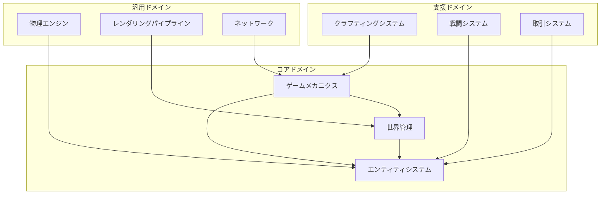

# DDD戦略的設計

```typescript
import { Effect, Match, Option } from "effect"
```

## 1. ドメインコンテキストマップ
  
TypeScript Minecraft Cloneのドメインは、複数の境界づけられたコンテキスト（Bounded Context）に分割されます。



## 2. 境界づけられたコンテキスト
### 2.1 世界管理コンテキスト (World Management Context)

**責務**: ゲーム世界の生成、永続化、チャンク管理

```typescript
import { Effect, Context, Schema } from "effect"

// ✅ Brand型で型安全性向上
const WorldId = Schema.String.pipe(Schema.brand("WorldId"))
const WorldSeed = Schema.Number.pipe(Schema.brand("WorldSeed"))
const ChunkCoordinate = Schema.Struct({
  x: Schema.Number,
  z: Schema.Number
})
const BlockType = Schema.String.pipe(Schema.brand("BlockType"))
const Biome = Schema.String.pipe(Schema.brand("Biome"))

// ✅ Schema.Structで中核概念を定義
const World = Schema.Struct({
  id: WorldId,
  seed: WorldSeed,
  chunks: Schema.Record(Schema.String, Schema.Unknown), // ChunkCollection
  worldBorder: Schema.Struct({
    size: Schema.Number.pipe(Schema.positive())
  }),
  spawnPoint: Schema.Struct({
    x: Schema.Number,
    y: Schema.Number,
    z: Schema.Number
  })
})
type World = Schema.Schema.Type<typeof World>

const Chunk = Schema.Struct({
  coordinate: ChunkCoordinate,
  blocks: Schema.Array(Schema.Number), // BlockArrayを簡略化
  biome: Biome,
  heightMap: Schema.Array(Schema.Number),
  lightMap: Schema.Array(Schema.Number)
})
type Chunk = Schema.Schema.Type<typeof Chunk>

const Block = Schema.Struct({
  type: BlockType,
  state: Schema.Record(Schema.String, Schema.Unknown),
  metadata: Schema.Record(Schema.String, Schema.Unknown)
})
type Block = Schema.Schema.Type<typeof Block>

// ✅ エラー定義
const GenerationError = Schema.Struct({
  _tag: Schema.Literal("GenerationError"),
  coordinate: ChunkCoordinate,
  reason: Schema.String
})
type GenerationError = Schema.Schema.Type<typeof GenerationError>

const PersistenceError = Schema.Struct({
  _tag: Schema.Literal("PersistenceError"),
  operation: Schema.String,
  reason: Schema.String
})
type PersistenceError = Schema.Schema.Type<typeof PersistenceError>

const LoadError = Schema.Struct({
  _tag: Schema.Literal("LoadError"),
  worldId: WorldId,
  reason: Schema.String
})
type LoadError = Schema.Schema.Type<typeof LoadError>

// ✅ Context.GenericTagでドメインサービス定義
interface ChunkGenerationServiceInterface {
  readonly generate: (coordinate: ChunkCoordinate, seed: WorldSeed) =>
    Effect.Effect<Chunk, GenerationError>
}

const ChunkGenerationService = Context.GenericTag<ChunkGenerationServiceInterface>("@app/ChunkGenerationService")

interface WorldPersistenceServiceInterface {
  readonly save: (world: World) => Effect.Effect<void, PersistenceError>
  readonly load: (id: WorldId) => Effect.Effect<World, LoadError>
}

const WorldPersistenceService = Context.GenericTag<WorldPersistenceServiceInterface>("@app/WorldPersistenceService")
```

### 2.2 ゲームメカニクスコンテキスト (Game Mechanics Context)

**責務**: ゲームルール、プレイヤーアクション、ゲーム進行

```typescript
// ゲームメカニクスコンテキスト

// ✅ Schema.Structでゲームルール定義
const Difficulty = Schema.Union(
  Schema.Literal("Peaceful"),
  Schema.Literal("Easy"),
  Schema.Literal("Normal"),
  Schema.Literal("Hard")
)

const GameRules = Schema.Struct({
  difficulty: Difficulty,
  pvpEnabled: Schema.Boolean,
  keepInventory: Schema.Boolean,
  mobGriefing: Schema.Boolean,
  daylightCycle: Schema.Boolean,
  weatherCycle: Schema.Boolean
})
type GameRules = Schema.Schema.Type<typeof GameRules>

// ✅ Brand型と共通型の定義
const Direction = Schema.Struct({
  x: Schema.Number,
  y: Schema.Number,
  z: Schema.Number
})
const Position = Schema.Struct({
  x: Schema.Number,
  y: Schema.Number,
  z: Schema.Number
})
const ItemId = Schema.String.pipe(Schema.brand("ItemId"))
const EntityId = Schema.String.pipe(Schema.brand("EntityId"))
const RecipeId = Schema.String.pipe(Schema.brand("RecipeId"))

// ✅ Schema.Unionでプレイヤーアクション定義
const MoveAction = Schema.Struct({
  _tag: Schema.Literal("Move"),
  direction: Direction,
  sprint: Schema.Boolean
})

const JumpAction = Schema.Struct({
  _tag: Schema.Literal("Jump")
})

const PlaceBlockAction = Schema.Struct({
  _tag: Schema.Literal("PlaceBlock"),
  position: Position,
  block: BlockType
})

const BreakBlockAction = Schema.Struct({
  _tag: Schema.Literal("BreakBlock"),
  position: Position
})

const UseItemAction = Schema.Struct({
  _tag: Schema.Literal("UseItem"),
  item: ItemId,
  target: Schema.optional(EntityId)
})

const OpenInventoryAction = Schema.Struct({
  _tag: Schema.Literal("OpenInventory")
})

const CraftAction = Schema.Struct({
  _tag: Schema.Literal("Craft"),
  recipe: RecipeId
})

const PlayerAction = Schema.Union(
  MoveAction,
  JumpAction,
  PlaceBlockAction,
  BreakBlockAction,
  UseItemAction,
  OpenInventoryAction,
  CraftAction
)
type PlayerAction = Schema.Schema.Type<typeof PlayerAction>

// ✅ ゲーム進行の定義
const GameTime = Schema.Number.pipe(Schema.brand("GameTime"))
const Weather = Schema.Union(
  Schema.Literal("Clear"),
  Schema.Literal("Rain"),
  Schema.Literal("Storm")
)
const GameEvent = Schema.Struct({
  type: Schema.String,
  timestamp: GameTime,
  data: Schema.Unknown
})

const GameProgression = Schema.Struct({
  time: GameTime,
  weather: Weather,
  events: Schema.Array(GameEvent)
})
type GameProgression = Schema.Schema.Type<typeof GameProgression>

// ✅ エラー定義
const ActionError = Schema.Struct({
  _tag: Schema.Literal("ActionError"),
  action: Schema.String,
  reason: Schema.String
})
type ActionError = Schema.Schema.Type<typeof ActionError>

const ProgressionError = Schema.Struct({
  _tag: Schema.Literal("ProgressionError"),
  reason: Schema.String
})
type ProgressionError = Schema.Schema.Type<typeof ProgressionError>

const ActionResult = Schema.Struct({
  success: Schema.Boolean,
  message: Schema.optional(Schema.String),
  worldChanges: Schema.optional(Schema.Unknown)
})
type ActionResult = Schema.Schema.Type<typeof ActionResult>

const GameContext = Schema.Struct({
  playerId: EntityId,
  world: World,
  gameRules: GameRules
})
type GameContext = Schema.Schema.Type<typeof GameContext>

// ✅ Context.GenericTagでドメインサービス定義
interface ActionProcessorInterface {
  readonly process: (action: PlayerAction, context: GameContext) =>
    Effect.Effect<ActionResult, ActionError>
}

const ActionProcessor = Context.GenericTag<ActionProcessorInterface>("@app/ActionProcessor")

interface ProgressionServiceInterface {
  readonly tick: (world: World, deltaTime: number) =>
    Effect.Effect<World, ProgressionError>
}

const ProgressionService = Context.GenericTag<ProgressionServiceInterface>("@app/ProgressionService")
```

### 2.3 エンティティシステムコンテキスト (Entity System Context)

**責務**: エンティティ管理、コンポーネント、動作制御

```typescript
// エンティティシステムコンテキスト

// ✅ Schema.Unionでエンティティタイプ定義
const EntityType = Schema.Union(
  Schema.Literal("Player"),
  Schema.Literal("Mob"),
  Schema.Literal("Item"),
  Schema.Literal("Projectile"),
  Schema.Literal("Vehicle"),
  Schema.Literal("Decoration")
)
type EntityType = Schema.Schema.Type<typeof EntityType>

// ✅ ECSコンポーネントをSchema.Structで定義
const PositionComponent = Schema.Struct({
  _tag: Schema.Literal("PositionComponent"),
  x: Schema.Number,
  y: Schema.Number,
  z: Schema.Number
})
type PositionComponent = Schema.Schema.Type<typeof PositionComponent>

const VelocityComponent = Schema.Struct({
  _tag: Schema.Literal("VelocityComponent"),
  dx: Schema.Number,
  dy: Schema.Number,
  dz: Schema.Number
})
type VelocityComponent = Schema.Schema.Type<typeof VelocityComponent>

const HealthComponent = Schema.Struct({
  _tag: Schema.Literal("HealthComponent"),
  current: Schema.Number.pipe(Schema.nonNegative()),
  max: Schema.Number.pipe(Schema.positive())
})
type HealthComponent = Schema.Schema.Type<typeof HealthComponent>

const AIComponent = Schema.Struct({
  _tag: Schema.Literal("AIComponent"),
  behavior: Schema.String,
  state: Schema.Record(Schema.String, Schema.Unknown)
})
type AIComponent = Schema.Schema.Type<typeof AIComponent>

const InventoryComponent = Schema.Struct({
  _tag: Schema.Literal("InventoryComponent"),
  slots: Schema.Array(Schema.optional(Schema.Unknown)), // ItemStack
  capacity: Schema.Number.pipe(Schema.positive())
})
type InventoryComponent = Schema.Schema.Type<typeof InventoryComponent>

const EquipmentComponent = Schema.Struct({
  _tag: Schema.Literal("EquipmentComponent"),
  helmet: Schema.optional(Schema.Unknown),
  chestplate: Schema.optional(Schema.Unknown),
  leggings: Schema.optional(Schema.Unknown),
  boots: Schema.optional(Schema.Unknown)
})
type EquipmentComponent = Schema.Schema.Type<typeof EquipmentComponent>

// ✅ コンポーネントマップの定義
const ComponentMap = Schema.Struct({
  position: Schema.optional(PositionComponent),
  velocity: Schema.optional(VelocityComponent),
  health: Schema.optional(HealthComponent),
  ai: Schema.optional(AIComponent),
  inventory: Schema.optional(InventoryComponent),
  equipment: Schema.optional(EquipmentComponent)
})
type ComponentMap = Schema.Schema.Type<typeof ComponentMap>

// ✅ エンティティ定義
const Entity = Schema.Struct({
  id: EntityId,
  type: EntityType,
  components: ComponentMap
})
type Entity = Schema.Schema.Type<typeof Entity>

// ✅ エラー定義
const SpawnError = Schema.Struct({
  _tag: Schema.Literal("SpawnError"),
  entityType: EntityType,
  reason: Schema.String
})
type SpawnError = Schema.Schema.Type<typeof SpawnError>

const DespawnError = Schema.Struct({
  _tag: Schema.Literal("DespawnError"),
  entityId: EntityId,
  reason: Schema.String
})
type DespawnError = Schema.Schema.Type<typeof DespawnError>

const QueryError = Schema.Struct({
  _tag: Schema.Literal("QueryError"),
  reason: Schema.String
})
type QueryError = Schema.Schema.Type<typeof QueryError>

// ✅ Context.GenericTagでエンティティ管理サービス定義
interface EntityManagerInterface {
  readonly spawn: (type: EntityType, position: Position) =>
    Effect.Effect<EntityId, SpawnError>

  readonly despawn: (id: EntityId) =>
    Effect.Effect<void, DespawnError>

  readonly query: (predicate: (entity: Entity) => boolean) =>
    Effect.Effect<ReadonlyArray<Entity>, QueryError>
}

const EntityManager = Context.GenericTag<EntityManagerInterface>("@app/EntityManager")
```

## 3. コンテキスト間の関係

### 3.1 コンテキストマッピング

```typescript
// 共有カーネル (Shared Kernel)

// 共通の値オブジェクト
export interface Position {
  readonly x: number
  readonly y: number
  readonly z: number
}

export interface Direction {
  readonly yaw: number
  readonly pitch: number
}

export interface BoundingBox {
  readonly min: Position
  readonly max: Position
}

// 腐敗防止層 (Anti-Corruption Layer)

// ✅ 外部システムのデータ構造定義
const MinecraftPacket = Schema.Struct({
  type: Schema.String,
  data: Schema.Record(Schema.String, Schema.Unknown)
})
type MinecraftPacket = Schema.Schema.Type<typeof MinecraftPacket>

const ConversionError = Schema.Struct({
  _tag: Schema.Literal("ConversionError"),
  packet: MinecraftPacket,
  reason: Schema.String
})
type ConversionError = Schema.Schema.Type<typeof ConversionError>

// ✅ 純粋関数で方向計算（PBTテスト可能）
const calculateDirection = (data: Record<string, unknown>): Direction => ({
  x: typeof data.x === "number" ? data.x : 0,
  y: typeof data.y === "number" ? data.y : 0,
  z: typeof data.z === "number" ? data.z : 0
})

// ✅ 早期リターンパターンで変換検証
const validatePacketData = (packet: MinecraftPacket): boolean => {
  // 早期リターン: 基本構造チェック
  if (!packet || !packet.type || !packet.data) return false
  // 早期リターン: データがオブジェクトかどうか
  if (typeof packet.data !== "object") return false
  return true
}

// ✅ 外部システムとの変換層（改善版）
export const fromMinecraftProtocol = (
  packet: MinecraftPacket
): Effect.Effect<PlayerAction, ConversionError> =>
  Effect.gen(function* () {
    // 早期リターン: パケット検証
    if (!validatePacketData(packet)) {
      return yield* Effect.fail({
        _tag: "ConversionError" as const,
        packet,
        reason: "無効なパケット構造"
      })
    }

    // Match.valueでパターンマッチング
    return yield* Match.value(packet.type).pipe(
      Match.when("player_position", () =>
        Effect.gen(function* () {
          const direction = calculateDirection(packet.data)
          const sprint = typeof packet.data.sprinting === "boolean" ? packet.data.sprinting : false

          return {
            _tag: "Move" as const,
            direction,
            sprint
          }
        })
      ),
      Match.when("block_place", () =>
        Effect.gen(function* () {
          // 早期リターン: positionチェック
          if (!packet.data.position || !packet.data.blockId) {
            return yield* Effect.fail({
              _tag: "ConversionError" as const,
              packet,
              reason: "positionまたはblockIdがありません"
            })
          }

          return {
            _tag: "PlaceBlock" as const,
            position: packet.data.position as Position,
            block: packet.data.blockId as BlockType
          }
        })
      ),
      Match.orElse(() =>
        Effect.fail({
          _tag: "ConversionError" as const,
          packet,
          reason: `不明なパケットタイプ: ${packet.type}`
        })
      )
    )
  })
```

### 3.2 統合パターン

```typescript
// 公開言語 (Published Language)

export type WorldEvent =
  | ChunkGeneratedEvent
  | ChunkUnloadedEvent
  | BlockChangedEvent

export interface ChunkGeneratedEvent {
  readonly _tag: "ChunkGenerated"
  readonly coordinate: ChunkCoordinate
  readonly timestamp: Timestamp
}

export interface BlockChangedEvent {
  readonly _tag: "BlockChanged"
  readonly position: Position
  readonly oldBlock: BlockType
  readonly newBlock: BlockType
  readonly cause: EntityId | "Natural"
}

// 顧客-供給者 (Customer-Supplier)

// World Management は Entity System のサプライヤー
export const worldToEntityAdapter = {
  getEntitiesInChunk: (chunk: Chunk): ReadonlyArray<EntityId> =>
    chunk.entities,

  notifyChunkLoaded: (coordinate: ChunkCoordinate) =>
    Effect.gen(function* () {
      const entities = yield* EntityManager.query(
        withinChunk(coordinate)
      )
      yield* activateEntities(entities)
    })
}
```

## 4. アグリゲート識別

### 4.1 世界アグリゲート (World Aggregate)

```typescript
// 世界アグリゲート

// ✅ Brand型と関連型定義
const ChunkId = Schema.String.pipe(Schema.brand("ChunkId"))
const RegionId = Schema.String.pipe(Schema.brand("RegionId"))

const WorldSettings = Schema.Struct({
  difficulty: Difficulty,
  gameMode: Schema.Union(
    Schema.Literal("Survival"),
    Schema.Literal("Creative"),
    Schema.Literal("Adventure"),
    Schema.Literal("Spectator")
  ),
  maxPlayers: Schema.Number.pipe(Schema.positive())
})
type WorldSettings = Schema.Schema.Type<typeof WorldSettings>

// ✅ アグリゲートルートをSchema.Structで定義
const WorldAggregate = Schema.Struct({
  id: WorldId,
  chunks: Schema.Record(ChunkId, Chunk),
  loadedRegions: Schema.Array(RegionId),
  worldSettings: WorldSettings
})
type WorldAggregate = Schema.Schema.Type<typeof WorldAggregate>

// ✅ エラー定義
const ChunkNotLoadableError = Schema.Struct({
  _tag: Schema.Literal("ChunkNotLoadableError"),
  coordinate: ChunkCoordinate,
  reason: Schema.String
})
type ChunkNotLoadableError = Schema.Schema.Type<typeof ChunkNotLoadableError>

const InvariantViolationError = Schema.Struct({
  _tag: Schema.Literal("InvariantViolationError"),
  invariant: Schema.String,
  details: Schema.String
})
type InvariantViolationError = Schema.Schema.Type<typeof InvariantViolationError>

// ✅ 純粋関数で不変条件チェック（PBTテスト可能）
const validateBoundaries = (chunk: Chunk, adjacent: ReadonlyArray<Chunk>): boolean => {
  // 簡略化された境界チェックロジック
  return adjacent.every(adj =>
    Math.abs(adj.coordinate.x - chunk.coordinate.x) <= 1 &&
    Math.abs(adj.coordinate.z - chunk.coordinate.z) <= 1
  )
}

const isRegionSetContinuous = (regions: ReadonlyArray<RegionId>): boolean => {
  // 簡略化された連続性チェック
  return regions.length > 0 // 実装例
}

// ✅ 不変条件の関数型定義
export const worldAggregateInvariants = {
  // チャンクは隣接チャンクとの一貫性を保つ
  adjacentChunkConsistency: (world: WorldAggregate): boolean => {
    const chunks = Object.values(world.chunks)

    for (const chunk of chunks) {
      const adjacent = chunks.filter(c =>
        Math.abs(c.coordinate.x - chunk.coordinate.x) <= 1 &&
        Math.abs(c.coordinate.z - chunk.coordinate.z) <= 1 &&
        c !== chunk
      )

      // 早期リターン: 境界検証失敗
      if (!validateBoundaries(chunk, adjacent)) {
        return false
      }
    }
    return true
  },

  // ロード済み領域は連続している
  loadedRegionContinuity: (world: WorldAggregate): boolean => {
    return isRegionSetContinuous(world.loadedRegions)
  }
}

// ✅ 単一責務のヘルパー関数
const validateChunkLoadable = (
  world: WorldAggregate,
  coordinate: ChunkCoordinate
): Effect.Effect<boolean, never> =>
  Effect.gen(function* () {
    // 早期リターン: 既にロード済みの場合
    const chunkKey = `${coordinate.x},${coordinate.z}` as ChunkId
    if (world.chunks[chunkKey]) {
      return false
    }

    // メモリ制限チェックなど
    const loadedCount = Object.keys(world.chunks).length
    return loadedCount < 100 // 最大チャンク数制限
  })

const generateOrLoadChunk = (
  coordinate: ChunkCoordinate
): Effect.Effect<Chunk, GenerationError> =>
  Effect.succeed({
    coordinate,
    blocks: new Array(16 * 16 * 16).fill(1),
    biome: "Plains" as Biome,
    heightMap: new Array(16 * 16).fill(64),
    lightMap: new Array(16 * 16 * 16).fill(15)
  })

// ✅ アグリゲート操作（改善版）
export const worldAggregateOperations = {
  loadChunk: (world: WorldAggregate, coordinate: ChunkCoordinate) =>
    Effect.gen(function* () {
      // 早期リターン: チャンクロード可能性チェック
      const loadable = yield* validateChunkLoadable(world, coordinate)
      if (!loadable) {
        return yield* Effect.fail({
          _tag: "ChunkNotLoadableError" as const,
          coordinate,
          reason: "チャンクは既にロード済みか、メモリ制限を超えています"
        })
      }

      const chunk = yield* generateOrLoadChunk(coordinate)
      const chunkKey = `${coordinate.x},${coordinate.z}` as ChunkId

      const updatedWorld: WorldAggregate = {
        ...world,
        chunks: {
          ...world.chunks,
          [chunkKey]: chunk
        }
      }

      // 早期リターン: 不変条件チェック
      const isConsistent = worldAggregateInvariants.adjacentChunkConsistency(updatedWorld)
      if (!isConsistent) {
        return yield* Effect.fail({
          _tag: "InvariantViolationError" as const,
          invariant: "adjacentChunkConsistency",
          details: `チャンクの一貫性維持に失敗: ${coordinate.x},${coordinate.z}`
        })
      }

      return updatedWorld
    })
}
```

### 4.2 プレイヤーアグリゲート (Player Aggregate)

```typescript
// プレイヤーアグリゲート

// ✅ Brand型と関連型定義
const PlayerId = Schema.String.pipe(Schema.brand("PlayerId"))

const PlayerProfile = Schema.Struct({
  name: Schema.String.pipe(Schema.minLength(1)),
  uuid: Schema.String.pipe(Schema.brand("UUID")),
  joinDate: Schema.Number.pipe(Schema.brand("Timestamp"))
})

const PlayerStats = Schema.Struct({
  level: Schema.Number.pipe(Schema.nonNegative()),
  experience: Schema.Number.pipe(Schema.nonNegative()),
  playtime: Schema.Number.pipe(Schema.nonNegative())
})

const Enchantment = Schema.Struct({
  id: Schema.String.pipe(Schema.brand("EnchantmentId")),
  level: Schema.Number.pipe(Schema.positive())
})

const Advancements = Schema.Struct({
  completed: Schema.Array(Schema.String),
  progress: Schema.Record(Schema.String, Schema.Number)
})

// ✅ 値オブジェクトをSchema.Structで定義
const ItemStack = Schema.Struct({
  item: ItemId,
  count: Schema.Number.pipe(Schema.positive()),
  damage: Schema.Number.pipe(Schema.nonNegative()),
  enchantments: Schema.Array(Enchantment)
})
type ItemStack = Schema.Schema.Type<typeof ItemStack>

// ✅ エンティティをSchema.Structで定義
const Inventory = Schema.Struct({
  slots: Schema.Array(Schema.optional(ItemStack)),
  selectedSlot: Schema.Number.pipe(Schema.nonNegative()),
  capacity: Schema.Number.pipe(Schema.positive())
})
type Inventory = Schema.Schema.Type<typeof Inventory>

const Equipment = Schema.Struct({
  helmet: Schema.optional(ItemStack),
  chestplate: Schema.optional(ItemStack),
  leggings: Schema.optional(ItemStack),
  boots: Schema.optional(ItemStack)
})
type Equipment = Schema.Schema.Type<typeof Equipment>

// ✅ アグリゲートルートをSchema.Structで定義
const PlayerAggregate = Schema.Struct({
  id: PlayerId,
  profile: PlayerProfile,
  stats: PlayerStats,
  inventory: Inventory,
  equipment: Equipment,
  advancements: Advancements
})
type PlayerAggregate = Schema.Schema.Type<typeof PlayerAggregate>

// ✅ エラー定義
const InventoryFullError = Schema.Struct({
  _tag: Schema.Literal("InventoryFullError"),
  playerId: PlayerId
})
type InventoryFullError = Schema.Schema.Type<typeof InventoryFullError>

const InvalidItemError = Schema.Struct({
  _tag: Schema.Literal("InvalidItemError"),
  item: ItemStack,
  reason: Schema.String
})
type InvalidItemError = Schema.Schema.Type<typeof InvalidItemError>

const InvalidSlotIndexError = Schema.Struct({
  _tag: Schema.Literal("InvalidSlotIndexError"),
  slotIndex: Schema.Number,
  maxSlots: Schema.Number
})
type InvalidSlotIndexError = Schema.Schema.Type<typeof InvalidSlotIndexError>

const SlotEmptyError = Schema.Struct({
  _tag: Schema.Literal("SlotEmptyError"),
  slotIndex: Schema.Number
})
type SlotEmptyError = Schema.Schema.Type<typeof SlotEmptyError>

const NotEquipableError = Schema.Struct({
  _tag: Schema.Literal("NotEquipableError"),
  item: ItemStack
})
type NotEquipableError = Schema.Schema.Type<typeof NotEquipableError>

// ✅ 純粋関数でヘルパー関数（PBTテスト可能）
const findEmptySlot = (inventory: Inventory): number | null => {
  for (let i = 0; i < inventory.slots.length; i++) {
    if (!inventory.slots[i]) {
      return i
    }
  }
  return null
}

const getEquipmentSlot = (item: ItemId): keyof Equipment | null => {
  // 簡略化された装備スロット判定
  const itemName = item.toLowerCase()
  if (itemName.includes("helmet")) return "helmet"
  if (itemName.includes("chestplate")) return "chestplate"
  if (itemName.includes("leggings")) return "leggings"
  if (itemName.includes("boots")) return "boots"
  return null
}

const setSlot = (
  slots: ReadonlyArray<ItemStack | undefined>,
  index: number,
  item: ItemStack
): ReadonlyArray<ItemStack | undefined> => {
  const newSlots = [...slots]
  newSlots[index] = item
  return newSlots
}

// ✅ アグリゲート操作（改善版）
export const playerAggregateOperations = {
  addItem: (player: PlayerAggregate, item: ItemStack) =>
    Effect.gen(function* () {
      // 早期リターン: アイテム数量チェック
      if (item.count <= 0) {
        return yield* Effect.fail({
          _tag: "InvalidItemError" as const,
          item,
          reason: "アイテム数量は正の値である必要があります"
        })
      }

      // 早期リターン: 空きスロットチェック
      const emptySlot = findEmptySlot(player.inventory)
      if (emptySlot === null) {
        return yield* Effect.fail({
          _tag: "InventoryFullError" as const,
          playerId: player.id
        })
      }

      return {
        ...player,
        inventory: {
          ...player.inventory,
          slots: setSlot(player.inventory.slots, emptySlot, item)
        }
      }
    }),

  equipItem: (player: PlayerAggregate, slotIndex: number) =>
    Effect.gen(function* () {
      // 早期リターン: スロット範囲チェック
      if (slotIndex < 0 || slotIndex >= player.inventory.slots.length) {
        return yield* Effect.fail({
          _tag: "InvalidSlotIndexError" as const,
          slotIndex,
          maxSlots: player.inventory.slots.length
        })
      }

      // 早期リターン: アイテム存在チェック
      const item = player.inventory.slots[slotIndex]
      if (!item) {
        return yield* Effect.fail({
          _tag: "SlotEmptyError" as const,
          slotIndex
        })
      }

      // 早期リターン: 装備可能性チェック
      const equipmentSlot = getEquipmentSlot(item.item)
      if (!equipmentSlot) {
        return yield* Effect.fail({
          _tag: "NotEquipableError" as const,
          item
        })
      }

      // 装備アイテムの交換
      const currentEquipment = player.equipment[equipmentSlot]
      const newSlots = setSlot(player.inventory.slots, slotIndex, currentEquipment)

      return {
        ...player,
        inventory: {
          ...player.inventory,
          slots: newSlots
        },
        equipment: {
          ...player.equipment,
          [equipmentSlot]: item
        }
      }
    })
}
```

## 5. ドメインイベント設計

### 5.1 イベントソーシング

```typescript
// イベントソーシング

// イベントストア
export interface EventStore {
  append: (aggregateId: AggregateId, events: ReadonlyArray<DomainEvent>) =>
    Effect.Effect<void, EventStoreError>

  load: (aggregateId: AggregateId) =>
    Effect.Effect<ReadonlyArray<DomainEvent>, EventStoreError>

  subscribe: (handler: EventHandler) =>
    Effect.Effect<Subscription, SubscriptionError>
}

// イベント適用
export const applyEvents = <T>(
  initial: T,
  events: ReadonlyArray<DomainEvent>,
  reducer: (state: T, event: DomainEvent) => T
): T =>
  events.reduce(reducer, initial)

// スナップショット
export interface SnapshotStore {
  save: (aggregateId: AggregateId, snapshot: Snapshot) =>
    Effect.Effect<void, SnapshotError>

  load: (aggregateId: AggregateId) =>
    Effect.Effect<Option.Option<Snapshot>, SnapshotError>
}
```

### 5.2 サーガパターン

```typescript
// サーガ

// チャンク生成サーガ
export const chunkGenerationSaga = Effect.gen(function* () {
  const events = yield* EventStore.subscribe(isChunkRequestedEvent)

  yield* Stream.runForEach(events, (event) =>
    Effect.gen(function* () {
      // 1. チャンク生成開始
      yield* publishEvent(ChunkGenerationStarted(event.coordinate))

      try {
        // 2. 地形生成
        const terrain = yield* generateTerrain(event.coordinate)
        yield* publishEvent(TerrainGenerated(event.coordinate))

        // 3. 構造物生成
        const structures = yield* generateStructures(event.coordinate)
        yield* publishEvent(StructuresGenerated(event.coordinate))

        // 4. エンティティ配置
        const entities = yield* placeEntities(event.coordinate)
        yield* publishEvent(EntitiesPlaced(event.coordinate))

        // 5. チャンク生成完了
        yield* publishEvent(ChunkGenerationCompleted(event.coordinate))
      } catch (error) {
        // 補償トランザクション
        yield* publishEvent(ChunkGenerationFailed(event.coordinate, error))
        yield* rollbackChunkGeneration(event.coordinate)
      }
    })
  )
})
```

## 6. まとめ

戦略的設計により：
- **明確な境界**: 各コンテキストが独立して進化可能
- **共通言語**: チーム内での認識の統一
- **統合の明確化**: コンテキスト間の関係が明示的
- **変更の局所化**: 変更の影響範囲を最小化

次のドキュメント：
- [01-tactical-design.md](./01-tactical-design.md) - 戦術的設計パターン
- [02-aggregates.md](./02-aggregates.md) - アグリゲート設計の詳細