# DDD戦略的設計 - 境界づけられたコンテキスト

> **⚡ Quick Reference**: ゲームドメインを6つの境界づけられたコンテキストに分割。コアドメイン（World・GameMechanics・Entity）、支援ドメイン（Crafting・Combat・Trading）、汎用ドメイン（Physics・Rendering・Network）に分類し、明確な統合パターンで結合。
>
> **🎯 この文書で学べること**: 戦略的設計概念、ドメインコンテキストマップ、アグリゲート設計、実装パターン

---

## 🚀 Quick Reference (5分で理解)

### 📋 コンテキスト分類と優先順位

| 分類 | コンテキスト | 責務 | 投資レベル | Effect-TS重点 |
|------|------------|------|------------|---------------|
| **🔥 コア** | World Management | チャンク・ブロック・地形 | 最大 | Schema + Aggregate |
| **🔥 コア** | Game Mechanics | ルール・進行・バランス | 最大 | Match.value + Effect.gen |
| **🔥 コア** | Entity System | ECS・プレイヤー・AI | 最大 | Context.GenericTag |
| **⚙️ 支援** | Crafting System | レシピ・材料・生産 | 中程度 | Brand型 + Validation |
| **⚙️ 支援** | Combat System | ダメージ・防御・戦略 | 中程度 | Early Return + Error |
| **🔧 汎用** | Physics/Rendering | 物理・描画・ネットワーク | 最小 | Layer + Adapter |

### 🔗 統合パターンマップ

```mermaid
%%{init: {"theme": "neutral", "themeVariables": {"primaryColor": "#4285f4", "primaryTextColor": "#ffffff", "primaryBorderColor": "#ffffff", "lineColor": "#4285f4", "sectionBkgColor": "#f5f7fa", "tertiaryColor": "#f5f7fa"}}}%%
graph LR
    subgraph Core ["🔥 コアドメイン"]
        World["🌍 World<br/>Management"]
        Game["🎮 Game<br/>Mechanics"]
        Entity["🤖 Entity<br/>System"]
    end

    subgraph Support ["⚙️ 支援ドメイン"]
        Craft["🔨 Crafting"]
        Combat["⚔️ Combat"]
        Trade["💰 Trading"]
    end

    subgraph Generic ["🔧 汎用ドメイン"]
        Physics["📐 Physics"]
        Render["🎨 Render"]
        Network["🌐 Network"]
    end

    %% 統合パターン
    World <-->|Shared Kernel| Entity
    Game <-->|Partnership| World
    Game -->|Customer-Supplier| Entity

    Craft -->|Published Language| Game
    Combat -->|Event-Driven| Entity
    Trade -->|ACL| Game

    Physics -.->|Adapter| Entity
    Render -.->|Facade| World
    Network -.->|Gateway| Game

    classDef coreStyle fill:#e8f5e8,stroke:#388e3c,stroke-width:3px
    classDef supportStyle fill:#fff3e0,stroke:#f57c00,stroke-width:2px
    classDef genericStyle fill:#fce4ec,stroke:#c2185b,stroke-width:2px

    class World,Game,Entity coreStyle
    class Craft,Combat,Trade supportStyle
    class Physics,Render,Network genericStyle
```



---

## 📖 Deep Dive (詳細理解)

### 1. 戦略的設計概観：ドメインの複雑性管理

#### 1.1 なぜ境界づけられたコンテキストが必要なのか

**問題**: Minecraft規模のゲームでは、単一のモデルでは複雑性が爆発的に増大
- 🔥 **Player**エンティティが持つ責務: 位置・体力・インベントリ・権限・統計・UI状態...
- 📈 **相互依存の増大**: 一つの変更が予想外の箇所に影響
- 🧠 **認知負荷の増大**: 開発者が理解すべき概念が多すぎる

**解決**: 境界づけられたコンテキストによる**概念的分割**
- 🎯 **明確な責務分割**: 各コンテキストは単一の責務に集中
- 🛡️ **変更の局所化**: 影響範囲を予測可能にする
- 💬 **ユビキタス言語**: チーム内で統一された専門用語

#### 1.2 ドメインコンテキストマップ



#### 1.3 コンテキスト間統合パターンの実装詳細

**統合パターンの選択理由**と**Effect-TSでの具体的実装方法**:


### 2. 境界づけられたコンテキストの実装詳細
#### 2.1 🌍 World Management Context（コアドメイン）

**戦略的重要性**: ゲーム体験の根幹を支える差別化要素
**投資レベル**: 最大（自社開発・継続改善）
**主要責務**:
- 🗺️ ワールド生成とチャンク管理
- 🧱 ブロック操作とバリデーション
- 🌲 地形・バイオーム・構造物生成
- 💾 ワールドデータの永続化

**完全なEffect-TS 3.17+パターンによる実装**:

```typescript
import { Effect, Context, Schema, Match, Brand } from "effect"

// ✅ Brand型で型安全性とドメイン境界を明確化
const WorldId = Schema.String.pipe(Schema.brand("WorldId"))
type WorldId = Brand.Branded<string, "WorldId">

const ChunkId = Schema.String.pipe(Schema.brand("ChunkId"))
type ChunkId = Brand.Branded<string, "ChunkId">

const BlockType = Schema.String.pipe(Schema.brand("BlockType"))
type BlockType = Brand.Branded<string, "BlockType">

// ✅ Schema.Structで値オブジェクト定義（設計原則準拠）
const ChunkCoordinate = Schema.Struct({
  x: Schema.Number,
  z: Schema.Number
}).pipe(
  Schema.brand("ChunkCoordinate"),
  Schema.annotations({
    identifier: "ChunkCoordinate",
    title: "チャンク座標",
    description: "ワールド内のチャンクの位置を表す値オブジェクト"
  })
)
type ChunkCoordinate = Schema.Schema.Type<typeof ChunkCoordinate>

const Position3D = Schema.Struct({
  x: Schema.Number,
  y: Schema.Number,
  z: Schema.Number
}).pipe(
  Schema.brand("Position3D"),
  Schema.annotations({
    identifier: "Position3D",
    title: "3D座標",
    description: "ワールド内の3次元座標を表す値オブジェクト"
  })
)
type Position3D = Schema.Schema.Type<typeof Position3D>

// ✅ 純粋関数によるドメインルール実装
const ChunkCoordinateRules = {
  // ドメインルール: 座標の有効性検証
  isValid: (coord: ChunkCoordinate): boolean => {
    return (
      Number.isInteger(coord.x) &&
      Number.isInteger(coord.z) &&
      Math.abs(coord.x) <= 30000000 &&
      Math.abs(coord.z) <= 30000000
    )
  },

  // ドメインルール: 距離計算
  distanceTo: (from: ChunkCoordinate, to: ChunkCoordinate): number => {
    const dx = from.x - to.x
    const dz = from.z - to.z
    return Math.sqrt(dx * dx + dz * dz)
  },

  // ドメインルール: 隣接チェック
  isAdjacentTo: (coord1: ChunkCoordinate, coord2: ChunkCoordinate): boolean => {
    return ChunkCoordinateRules.distanceTo(coord1, coord2) <= Math.sqrt(2)
  },

  // ドメインルール: チャンクID生成
  toChunkId: (coord: ChunkCoordinate): ChunkId => {
    return `chunk_${coord.x}_${coord.z}` as ChunkId
  }
}

const Position3DRules = {
  // ドメインルール: ワールド境界内チェック
  isWithinBounds: (pos: Position3D, worldBorderSize: number): boolean => {
    const halfSize = worldBorderSize / 2
    return (
      Math.abs(pos.x) <= halfSize &&
      Math.abs(pos.z) <= halfSize &&
      pos.y >= -64 &&
      pos.y <= 320
    )
  },

  // ドメインルール: チャンク座標への変換
  toChunkCoordinate: (pos: Position3D): ChunkCoordinate => {
    return {
      x: Math.floor(pos.x / 16),
      z: Math.floor(pos.z / 16)
    } as ChunkCoordinate
  },

  // ドメインルール: 距離計算
  distanceTo: (from: Position3D, to: Position3D): number => {
    const dx = from.x - to.x
    const dy = from.y - to.y
    const dz = from.z - to.z
    return Math.sqrt(dx * dx + dy * dy + dz * dz)
  }
}

// ✅ ドメインイベントをSchema.Structで定義（設計原則準拠）
const ChunkLoadedEvent = Schema.Struct({
  _tag: Schema.Literal("ChunkLoaded"),
  aggregateId: WorldId,
  chunkId: ChunkId,
  coordinate: ChunkCoordinate,
  timestamp: Schema.DateTimeUtc
}).pipe(
  Schema.annotations({
    identifier: "ChunkLoadedEvent",
    title: "チャンク読み込みイベント",
    description: "チャンクが読み込まれた際に発行されるドメインイベント"
  })
)
type ChunkLoadedEvent = Schema.Schema.Type<typeof ChunkLoadedEvent>

const ChunkUnloadedEvent = Schema.Struct({
  _tag: Schema.Literal("ChunkUnloaded"),
  aggregateId: WorldId,
  chunkId: ChunkId,
  coordinate: ChunkCoordinate,
  timestamp: Schema.DateTimeUtc
}).pipe(
  Schema.annotations({
    identifier: "ChunkUnloadedEvent",
    title: "チャンク解放イベント",
    description: "チャンクが解放された際に発行されるドメインイベント"
  })
)
type ChunkUnloadedEvent = Schema.Schema.Type<typeof ChunkUnloadedEvent>

// ✅ Union型でドメインイベントを統合
const WorldDomainEvent = Schema.Union(ChunkLoadedEvent, ChunkUnloadedEvent)
type WorldDomainEvent = Schema.Schema.Type<typeof WorldDomainEvent>

// ✅ WorldBorderを値オブジェクトとして定義
const WorldBorder = Schema.Struct({
  size: Schema.Number.pipe(
    Schema.positive(),
    Schema.annotations({ description: "ワールド境界サイズ（正の値）" })
  )
}).pipe(
  Schema.brand("WorldBorder"),
  Schema.annotations({
    identifier: "WorldBorder",
    title: "ワールド境界",
    description: "ワールドの境界設定を表す値オブジェクト"
  })
)
type WorldBorder = Schema.Schema.Type<typeof WorldBorder>

// ✅ Context.GenericTagでサービス定義
interface WorldServiceInterface {
  readonly generateChunk: (coord: ChunkCoordinate) => Effect.Effect<ChunkId, WorldError>
  readonly loadChunk: (id: ChunkId) => Effect.Effect<void, WorldError>
  readonly unloadChunk: (id: ChunkId) => Effect.Effect<void, WorldError>
  readonly placeBlock: (pos: Position3D, blockType: BlockType) => Effect.Effect<void, WorldError>
}

const WorldService = Context.GenericTag<WorldServiceInterface>("@app/WorldService")

// ✅ エラー定義
const WorldError = Schema.Struct({
  _tag: Schema.Literal("WorldError"),
  reason: Schema.String,
  code: Schema.String,
  context: Schema.optional(Schema.Record(Schema.String, Schema.Unknown))
}).pipe(
  Schema.annotations({
    identifier: "WorldError",
    title: "ワールド管理エラー",
    description: "World Managementコンテキストで発生するエラー"
  })
)
type WorldError = Schema.Schema.Type<typeof WorldError>
```

---

## 📚 学習パスと次のステップ

### 🎯 以下のドキュメントで実装詳細を確認

1. **[設計原則](./01-design-principles.md)**
   - Schema.Structによるドメインモデリング原則
   - 純粋関数による業務ルール実装

2. **[4層アーキテクチャ](./04-layered-architecture.md)**
   - ドメイン層の具体的な実装パターン
   - コンテキスト間統合の技術詳細

3. **[ECS統合](./05-ecs-integration.md)**
   - Entity Systemコンテキストとの統合方法
   - パフォーマンス最適化のテクニック

### 📝 理解度チェック

このドキュメントを理解した後、以下ができるようになるはずです：

- [ ] 6つの境界づけられたコンテキストの責務を説明できる
- [ ] コア・支援・汎用ドメインの違いを理解している
- [ ] Schema.Structで値オブジェクトを定義できる
- [ ] 純粋関数でドメインルールを実装できる
- [ ] Context.GenericTagでドメインサービスを定義できる
- [ ] 統合パターン（Shared Kernel、Customer-Supplier等）を適用できる

### 🔗 関連リソース

- **実装例**: [ドメインモデリングパターン](../07-pattern-catalog/01-domain-patterns.md)
- **テスト戦略**: [DDDテストパターン](../07-pattern-catalog/05-test-patterns.md)
- **パフォーマンス**: [ドメイン最適化パターン](../07-pattern-catalog/06-optimization-patterns.md)
const WorldAggregate = Schema.Struct({
  id: WorldId,
  seed: WorldSeed,
  chunks: Schema.Record(Schema.String, Schema.Unknown),
  worldBorder: WorldBorder.schema,
  spawnPoint: Position3D.schema,
  loadedChunkCount: Schema.Number.pipe(Schema.nonNegative()),
  version: Schema.Number.pipe(Schema.brand("Version"))
}).pipe(
  Schema.brand("WorldAggregate"),
  Schema.annotations({
    title: "ワールドアグリゲート",
    description: "ワールドドメインのアグリゲートルート"
  })
)

interface WorldAggregate extends Schema.Schema.Type<typeof WorldAggregate> {}

// ドメイン不変条件
const validateWorldInvariants = (world: WorldAggregate): ReadonlyArray<Effect.Effect<void, { readonly _tag: string; readonly message: string }>> => {
  return [
    // チャンク数制限の検証
    world.loadedChunkCount <= 1000
      ? Effect.void
      : Effect.fail({ _tag: "ChunkLimitExceeded", message: `チャンク数が制限を超過: ${world.loadedChunkCount}/1000` }),

    // スポーン地点が境界内にある
    world.worldBorder.containsPosition(world.spawnPoint)
      ? Effect.void
      : Effect.fail({ _tag: "SpawnPointOutOfBounds", message: "スポーン地点が境界外です" }),
  ]
}

// 不変条件を検証
const validateWorldInvariantsEffect = (world: WorldAggregate): Effect.Effect<void, { readonly _tag: string; readonly message: string }> => {
  return Effect.allSuccesses(validateWorldInvariants(world)).pipe(
    Effect.asVoid
  )
}

// ドメインルール: チャンク読み込み
const loadChunk = (world: WorldAggregate, chunkId: string, chunk: Chunk): Effect.Effect<WorldAggregate, { readonly _tag: string; readonly message: string }> => {
  if (world.chunks[chunkId]) {
    return Effect.fail({ _tag: "ChunkAlreadyLoaded", message: `チャンクは既に読み込み済み: ${chunkId}` })
  }

  const newWorld: WorldAggregate = {
    ...world,
    chunks: { ...world.chunks, [chunkId]: chunk },
    loadedChunkCount: world.loadedChunkCount + 1,
    version: world.version + 1
  }

  return validateWorldInvariantsEffect(newWorld).pipe(
    Effect.map(() => newWorld)
  )
}

// ドメインルール: チャンク解放
const unloadChunk = (world: WorldAggregate, chunkId: string): Effect.Effect<WorldAggregate, { readonly _tag: string; readonly message: string }> => {
  if (!world.chunks[chunkId]) {
    return Effect.fail({ _tag: "ChunkNotFound", message: `チャンクが見つかりません: ${chunkId}` })
  }

  const { [chunkId]: removed, ...remainingChunks } = world.chunks

  return Effect.succeed({
    ...world,
    chunks: remainingChunks,
    loadedChunkCount: world.loadedChunkCount - 1,
    version: world.version + 1
  })
}

const Chunk = Schema.Struct({
  id: ChunkId,
  coordinate: ChunkCoordinate.schema,
  blocks: Schema.Array(Schema.Number),
  biome: Biome,
  heightMap: Schema.Array(Schema.Number),
  lightMap: Schema.Array(Schema.Number),
  version: Schema.Number.pipe(Schema.brand("Version"))
}).pipe(
  Schema.brand("Chunk"),
  Schema.annotations({
    title: "チャンクエンティティ",
    description: "ワールドの一部を構成するチャンクエンティティ"
  })
)

interface Chunk extends Schema.Schema.Type<typeof Chunk> {}

// ✅ Match.valueによるドメインルール: ブロック取得 - 型安全な境界チェック
const getBlockAt = (chunk: Chunk, x: number, y: number, z: number): Option.Option<number> => {
  // ✅ 座標検証をMatch.valueで型安全かつ表現力豊かに
  return Match.value({ x, y, z }).pipe(
    Match.when(
      ({ x, y, z }) => x >= 0 && x < 16 && y >= 0 && y < 256 && z >= 0 && z < 16,
      ({ x, y, z }) => {
        const index = y * 256 + z * 16 + x;
        return Option.some(chunk.blocks[index] ?? 0);
      }
    ),
    Match.orElse(() => Option.none()) // 無効な座標の場合
  );
}

// ✅ Match.valueによるドメインルール: ブロック設置 - エラーハンドリング統合
const setBlockAt = (chunk: Chunk, x: number, y: number, z: number, blockType: number): Effect.Effect<Chunk, { readonly _tag: "InvalidCoordinate" }> => {
  // ✅ 座標バリデーションとブロック設置を統合したパターンマッチング
  return Match.value({ x, y, z, blockType }).pipe(
    Match.when(
      ({ x, y, z }) => x >= 0 && x < 16 && y >= 0 && y < 256 && z >= 0 && z < 16,
      ({ x, y, z, blockType }) => {
        const index = y * 256 + z * 16 + x;
        const newBlocks = [...chunk.blocks];
        newBlocks[index] = blockType

        return Effect.succeed({
          ...chunk,
          blocks: newBlocks,
          version: chunk.version + 1
        })
      }
    ),
    Match.orElse(() => Effect.fail({ _tag: "InvalidCoordinate" }))
  )
}

// ドメインルール: 高さ取得
const getHeightAt = (chunk: Chunk, x: number, z: number): Option.Option<number> => {
  if (x < 0 || x >= 16 || z < 0 || z >= 16) {
    return Option.none()
  }
  return Option.some(chunk.heightMap[z * 16 + x] ?? 0)
}

const Block = Schema.Struct({
  type: BlockType,
  state: Schema.Record(Schema.String, Schema.Unknown),
  metadata: Schema.Record(Schema.String, Schema.Unknown)
}).pipe(
  Schema.brand("Block"),
  Schema.annotations({
    title: "ブロック値オブジェクト",
    description: "ブロックの状態とメタデータを含む値オブジェクト"
  })
)

interface Block extends Schema.Schema.Type<typeof Block> {}

// ドメインルール: ブロックの硬度取得
const getBlockHardness = (block: Block): number => {
  const hardnessMap: Record<string, number> = {
    "stone": 1.5,
    "dirt": 0.5,
    "grass": 0.6,
    "sand": 0.5,
    "wood": 2.0,
    "water": -1, // 破壊不可
    "air": 0
  }
  return hardnessMap[block.type] ?? 1.0
}

// ドメインルール: 破壊可能性チェック
const canBreakBlock = (block: Block): boolean => {
  return getBlockHardness(block) >= 0
}

// ドメインルール: 状態更新
const updateBlockState = (block: Block, key: string, value: unknown): Block => {
  return {
    ...block,
    state: { ...block.state, [key]: value }
  }
}

// ✅ Schema.TaggedErrorでエラー型を定義
const ChunkGenerationError = Schema.TaggedError("ChunkGenerationError", {
  coordinate: ChunkCoordinate.schema,
  reason: Schema.String
})

const WorldPersistenceError = Schema.TaggedError("WorldPersistenceError", {
  operation: Schema.String,
  reason: Schema.String
})

const WorldLoadError = Schema.TaggedError("WorldLoadError", {
  worldId: WorldId,
  reason: Schema.String
})

const InvariantViolationError = Schema.TaggedError("InvariantViolationError", {
  invariant: Schema.String,
  details: Schema.String
})

type WorldManagementError =
  | ChunkGenerationError
  | WorldPersistenceError
  | WorldLoadError
  | InvariantViolationError

// ✅ リポジトリパターンをEffectサービスで実装
class WorldRepository extends Context.Tag("@world/WorldRepository")<
  WorldRepository,
  {
    readonly save: (world: WorldAggregate) => Effect.Effect<void, WorldManagementError>
    readonly findById: (id: Schema.Schema.Type<typeof WorldId>) => Effect.Effect<Option.Option<WorldAggregate>, WorldManagementError>
    readonly exists: (id: Schema.Schema.Type<typeof WorldId>) => Effect.Effect<boolean, WorldManagementError>
    readonly findByIds: (ids: ReadonlyArray<Schema.Schema.Type<typeof WorldId>>) => Effect.Effect<ReadonlyArray<WorldAggregate>, WorldManagementError>
    readonly delete: (id: Schema.Schema.Type<typeof WorldId>) => Effect.Effect<void, WorldManagementError>
  }
>() {}

// ✅ ドメインサービスをEffect.Tagで定義
class ChunkGenerationService extends Context.Tag("@world/ChunkGenerationService")<
  ChunkGenerationService,
  {
    readonly generate: (coordinate: ChunkCoordinate, seed: Schema.Schema.Type<typeof WorldSeed>) => Effect.Effect<Chunk, WorldManagementError>
    readonly validateGeneration: (coordinate: ChunkCoordinate, world: WorldAggregate) => Effect.Effect<boolean, WorldManagementError>
    readonly generateTerrain: (coordinate: ChunkCoordinate, seed: Schema.Schema.Type<typeof WorldSeed>) => Effect.Effect<ReadonlyArray<number>, WorldManagementError>
    readonly generateBiome: (coordinate: ChunkCoordinate, seed: Schema.Schema.Type<typeof WorldSeed>) => Effect.Effect<Schema.Schema.Type<typeof Biome>, WorldManagementError>
  }
>() {
  // ファクトリーメソッドでサービス実装を提供
  static live = Context.gen(function* () {
    return ChunkGenerationService.of({
      generate: (coordinate, seed) =>
        Effect.gen(function* () {
          // 早期リターン: 座標検証
          if (!coordinate.isValid()) {
            return yield* Effect.fail(new ChunkGenerationError({
              coordinate,
              reason: "無効なチャンク座標"
            }))
          }

          const terrain = yield* ChunkGenerationService.generateTerrain(coordinate, seed)
          const biome = yield* ChunkGenerationService.generateBiome(coordinate, seed)

          return new Chunk({
            id: `${coordinate.x},${coordinate.z}` as Schema.Schema.Type<typeof ChunkId>,
            coordinate,
            blocks: terrain,
            biome,
            heightMap: Array.from({ length: 256 }, () => 64),
            lightMap: Array.from({ length: 256 * 16 }, () => 15),
            version: 1
          })
        }),

      validateGeneration: (coordinate, world) =>
        Effect.succeed(
          coordinate.isValid() &&
          world.worldBorder.containsPosition(new Position3D({
            x: coordinate.x * 16,
            y: 64,
            z: coordinate.z * 16
          }))
        ),

      generateTerrain: (coordinate, seed) =>
        Effect.succeed(Array.from({ length: 256 * 16 * 16 }, (_, i) => {
          // 簡単な地形生成ロジック
          const y = Math.floor(i / (16 * 16))
          const noise = Math.sin(coordinate.x * 0.1 + coordinate.z * 0.1 + seed * 0.001)
          const height = 64 + Math.floor(noise * 10)
          return y <= height ? (y <= 60 ? 1 : 2) : 0 // 1=stone, 2=dirt, 0=air
        })),

      generateBiome: (coordinate, seed) =>
        Effect.succeed(
          (() => {
            const temp = Math.sin(coordinate.x * 0.01 + seed * 0.001)
            return temp > 0.5 ? "desert" as Schema.Schema.Type<typeof Biome> : "plains" as Schema.Schema.Type<typeof Biome>
          })()
        )
    })
  })
}

class WorldInvariantService extends Context.Tag("@world/WorldInvariantService")<
  WorldInvariantService,
  {
    readonly validateLoadedChunkLimit: (world: WorldAggregate) => Effect.Effect<boolean, never>
    readonly validateChunkConsistency: (world: WorldAggregate, chunk: Chunk) => Effect.Effect<boolean, never>
    readonly validateWorldBounds: (world: WorldAggregate) => Effect.Effect<boolean, never>
  }
>() {
  static live = Context.gen(function* () {
    return WorldInvariantService.of({
      validateLoadedChunkLimit: (world) =>
        Effect.succeed(world.loadedChunkCount <= 1000),

      validateChunkConsistency: (world, chunk) =>
        Effect.succeed(
          chunk.coordinate.isValid() &&
          world.worldBorder.containsPosition(
            new Position3D({
              x: chunk.coordinate.x * 16,
              y: 64,
              z: chunk.coordinate.z * 16
            })
          )
        ),

      validateWorldBounds: (world) =>
        Effect.succeed(
          world.spawnPoint.isWithinBounds(world.worldBorder.size)
        )
    })
  })
}
```

### 2.2 ゲームメカニクスコンテキスト (Game Mechanics Context)

**責務**: ゲームルール、プレイヤーアクション、ゲーム進行

```typescript
// ゲームメカニクスコンテキスト

// ✅ Brand型で難易度を定義
const Difficulty = Schema.Literal("Peaceful", "Easy", "Normal", "Hard").pipe(
  Schema.brand("Difficulty"),
  Schema.annotations({
    title: "難易度",
    description: "ゲームの難易度設定を表す値オブジェクト"
  })
)
type Difficulty = Schema.Schema.Type<typeof Difficulty>

// ✅ Data.Classでゲームルール値オブジェクトを定義
class GameRules extends Data.Class<{
  readonly difficulty: Schema.Schema.Type<typeof Difficulty>
  readonly pvpEnabled: boolean
  readonly keepInventory: boolean
  readonly mobGriefing: boolean
  readonly daylightCycle: boolean
  readonly weatherCycle: boolean
}>() {
  static schema = Schema.Struct({
    difficulty: Difficulty,
    pvpEnabled: Schema.Boolean,
    keepInventory: Schema.Boolean,
    mobGriefing: Schema.Boolean,
    daylightCycle: Schema.Boolean,
    weatherCycle: Schema.Boolean
  }).pipe(
    Schema.brand("GameRules"),
    Schema.annotations({
      title: "ゲームルール",
      description: "ゲームの基本ルール設定を管理する値オブジェクト"
    })
  )

// ドメインルール: 難易度に基づく設定適用
const createGameRulesForDifficulty = (difficulty: Schema.Schema.Type<typeof Difficulty>): GameRules => {
  return Match.value(difficulty).pipe(
    Match.when("Peaceful", () => ({
      difficulty,
      pvpEnabled: false,
      keepInventory: true,
      mobGriefing: false,
      daylightCycle: true,
      weatherCycle: true
    })),
    Match.when("Easy", () => ({
      difficulty,
      pvpEnabled: true,
      keepInventory: false,
      mobGriefing: true,
      daylightCycle: true,
      weatherCycle: true
    })),
    Match.when("Normal", () => ({
      difficulty,
      pvpEnabled: true,
      keepInventory: false,
      mobGriefing: true,
      daylightCycle: true,
      weatherCycle: true
    })),
    Match.when("Hard", () => ({
      difficulty,
      pvpEnabled: true,
      keepInventory: false,
      mobGriefing: true,
      daylightCycle: true,
      weatherCycle: true
    })),
    Match.exhaustive
  )
}

// ドメインルール: 難易度変更
const withDifficulty = (gameRules: GameRules, newDifficulty: Schema.Schema.Type<typeof Difficulty>): GameRules => {
  return createGameRulesForDifficulty(newDifficulty)
}

// ドメインルール: PvP設定変更
const withPvpEnabled = (gameRules: GameRules, enabled: boolean): GameRules => {
  return { ...gameRules, pvpEnabled: enabled }
}

// ✅ Brand型でドメイン概念を明確化
const PlayerId = Schema.String.pipe(Schema.brand("PlayerId"))
const ItemId = Schema.String.pipe(Schema.brand("ItemId"))
const EntityId = Schema.String.pipe(Schema.brand("EntityId"))
const RecipeId = Schema.String.pipe(Schema.brand("RecipeId"))

// ✅ Data.Classで方向ベクトルを定義
class Direction3D extends Data.Class<{
  readonly x: number
  readonly y: number
  readonly z: number
}>() {
  static schema = Schema.Struct({
    x: Schema.Number,
    y: Schema.Number,
    z: Schema.Number
  }).pipe(
    Schema.brand("Direction3D"),
    Schema.annotations({
      title: "3D方向ベクトル",
      description: "3次元空間での移動方向を表す値オブジェクト"
    })
  )

  // ドメインルール: ベクトルの長さ
  magnitude(): number {
    return Math.sqrt(this.x * this.x + this.y * this.y + this.z * this.z)
  }

  // ドメインルール: 正規化
  normalize(): Direction3D {
    const mag = this.magnitude()
    if (mag === 0) return this

    return new Direction3D({
      x: this.x / mag,
      y: this.y / mag,
      z: this.z / mag
    })
  }

  // ドメインルール: ゼロベクトルチェック
  isZero(): boolean {
    return this.x === 0 && this.y === 0 && this.z === 0
  }

  // ドメインルール: スカラー乗算
  scale(factor: number): Direction3D {
    return new Direction3D({
      x: this.x * factor,
      y: this.y * factor,
      z: this.z * factor
    })
  }

  // ドメインルール: 静的ファクトリーメソッド
  static readonly ZERO = new Direction3D({ x: 0, y: 0, z: 0 })
  static readonly FORWARD = new Direction3D({ x: 0, y: 0, z: 1 })
  static readonly BACKWARD = new Direction3D({ x: 0, y: 0, z: -1 })
  static readonly LEFT = new Direction3D({ x: -1, y: 0, z: 0 })
  static readonly RIGHT = new Direction3D({ x: 1, y: 0, z: 0 })
  static readonly UP = new Direction3D({ x: 0, y: 1, z: 0 })
  static readonly DOWN = new Direction3D({ x: 0, y: -1, z: 0 })
}

// ✅ Position3Dは既に定義済みなので参照

// ✅ Data.Classでドメインイベント基底クラスを定義
abstract class DomainEventBase extends Data.Class<{
  readonly eventId: Schema.Schema.Type<typeof Schema.UUID>
  readonly aggregateId: string
  readonly version: number
  readonly timestamp: Date
}>() {
  static schema = Schema.Struct({
    eventId: Schema.UUID,
    aggregateId: Schema.String.pipe(Schema.brand("AggregateId")),
    version: Schema.Number.pipe(Schema.brand("Version")),
    timestamp: Schema.DateFromSelf
  })

  // ドメインルール: イベントの順序性チェック
  isAfter(other: DomainEventBase): boolean {
    if (this.aggregateId !== other.aggregateId) {
      throw new Error("異なるアグリゲートのイベントを比較できません")
    }
    return this.version > other.version
  }

  // ドメインルール: イベントの有効性チェック
  isValid(): boolean {
    return (
      this.version >= 0 &&
      this.aggregateId.length > 0 &&
      this.timestamp.getTime() <= Date.now()
    )
  }
}

// ✅ Data.TaggedClassでプレイヤーコマンドを定義
class MoveCommand extends Data.TaggedClass("MoveCommand")<{
  readonly playerId: Schema.Schema.Type<typeof PlayerId>
  readonly direction: Direction3D
  readonly sprint: boolean
}>() {
  static schema = Schema.Struct({
    _tag: Schema.Literal("MoveCommand"),
    playerId: PlayerId,
    direction: Direction3D.schema,
    sprint: Schema.Boolean
  })

  // ドメインルール: 移動コマンドの有効性
  isValid(): boolean {
    return !this.direction.isZero()
  }

  // ドメインルール: 移動速度計算
  getMovementSpeed(): number {
    return this.sprint ? 1.3 : 1.0
  }
}

class JumpCommand extends Data.TaggedClass("JumpCommand")<{
  readonly playerId: Schema.Schema.Type<typeof PlayerId>
}>() {
  static schema = Schema.Struct({
    _tag: Schema.Literal("JumpCommand"),
    playerId: PlayerId
  })
}

class PlaceBlockCommand extends Data.TaggedClass("PlaceBlockCommand")<{
  readonly playerId: Schema.Schema.Type<typeof PlayerId>
  readonly position: Position3D
  readonly blockType: Schema.Schema.Type<typeof BlockType>
}>() {
  static schema = Schema.Struct({
    _tag: Schema.Literal("PlaceBlockCommand"),
    playerId: PlayerId,
    position: Position3D.schema,
    blockType: BlockType
  })

  // ドメインルール: ブロック配置の有効性
  isValidPlacement(worldBorderSize: number): boolean {
    return this.position.isWithinBounds(worldBorderSize)
  }
}

class BreakBlockCommand extends Data.TaggedClass("BreakBlockCommand")<{
  readonly playerId: Schema.Schema.Type<typeof PlayerId>
  readonly position: Position3D
}>() {
  static schema = Schema.Struct({
    _tag: Schema.Literal("BreakBlockCommand"),
    playerId: PlayerId,
    position: Position3D.schema
  })
}

class UseItemCommand extends Data.TaggedClass("UseItemCommand")<{
  readonly playerId: Schema.Schema.Type<typeof PlayerId>
  readonly itemId: Schema.Schema.Type<typeof ItemId>
  readonly targetEntityId: Option.Option<Schema.Schema.Type<typeof EntityId>>
}>() {
  static schema = Schema.Struct({
    _tag: Schema.Literal("UseItemCommand"),
    playerId: PlayerId,
    itemId: ItemId,
    targetEntityId: Schema.optionalWith(EntityId, { as: "Option" })
  })
}

class OpenInventoryCommand extends Data.TaggedClass("OpenInventoryCommand")<{
  readonly playerId: Schema.Schema.Type<typeof PlayerId>
}>() {
  static schema = Schema.Struct({
    _tag: Schema.Literal("OpenInventoryCommand"),
    playerId: PlayerId
  })
}

class CraftCommand extends Data.TaggedClass("CraftCommand")<{
  readonly playerId: Schema.Schema.Type<typeof PlayerId>
  readonly recipeId: Schema.Schema.Type<typeof RecipeId>
  readonly quantity: number
}>() {
  static schema = Schema.Struct({
    _tag: Schema.Literal("CraftCommand"),
    playerId: PlayerId,
    recipeId: RecipeId,
    quantity: Schema.Number.pipe(Schema.positive())
  })

  // ドメインルール: クラフト数量の有効性
  isValidQuantity(): boolean {
    return this.quantity > 0 && this.quantity <= 64
  }
}

// コマンドの統合型
type PlayerCommand =
  | MoveCommand
  | JumpCommand
  | PlaceBlockCommand
  | BreakBlockCommand
  | UseItemCommand
  | OpenInventoryCommand
  | CraftCommand

const PlayerCommandSchema = Schema.Union(
  MoveCommand.schema,
  JumpCommand.schema,
  PlaceBlockCommand.schema,
  BreakBlockCommand.schema,
  UseItemCommand.schema,
  OpenInventoryCommand.schema,
  CraftCommand.schema
).pipe(
  Schema.annotations({
    title: "プレイヤーコマンド",
    description: "プレイヤーの意図を表現するコマンドオブジェクト"
  })
)

// ✅ Data.TaggedClassでゲームメカニクスイベントを定義
class PlayerActionExecuted extends DomainEventBase {
  readonly _tag = "PlayerActionExecuted" as const
  readonly command: PlayerCommand
  readonly result: ActionResult

  constructor(data: {
    eventId: Schema.Schema.Type<typeof Schema.UUID>
    aggregateId: string
    version: number
    timestamp: Date
    command: PlayerCommand
    result: ActionResult
  }) {
    super(data)
    this.command = data.command
    this.result = data.result
  }

  static schema = Schema.Struct({
    _tag: Schema.Literal("PlayerActionExecuted"),
    eventId: Schema.UUID,
    aggregateId: Schema.String,
    version: Schema.Number,
    timestamp: Schema.DateFromSelf,
    command: PlayerCommandSchema,
    result: ActionResultSchema
  })
}

class GameTimeProgressed extends DomainEventBase {
  readonly _tag = "GameTimeProgressed" as const
  readonly previousTime: number
  readonly currentTime: number
  readonly deltaTime: number

  constructor(data: {
    eventId: Schema.Schema.Type<typeof Schema.UUID>
    aggregateId: string
    version: number
    timestamp: Date
    previousTime: number
    currentTime: number
    deltaTime: number
  }) {
    super(data)
    this.previousTime = data.previousTime
    this.currentTime = data.currentTime
    this.deltaTime = data.deltaTime
  }

  static schema = Schema.Struct({
    _tag: Schema.Literal("GameTimeProgressed"),
    eventId: Schema.UUID,
    aggregateId: Schema.String,
    version: Schema.Number,
    timestamp: Schema.DateFromSelf,
    previousTime: Schema.Number.pipe(Schema.brand("GameTime")),
    currentTime: Schema.Number.pipe(Schema.brand("GameTime")),
    deltaTime: Schema.Number
  })
}

class WeatherChanged extends DomainEventBase {
  readonly _tag = "WeatherChanged" as const
  readonly previousWeather: string
  readonly currentWeather: string

  constructor(data: {
    eventId: Schema.Schema.Type<typeof Schema.UUID>
    aggregateId: string
    version: number
    timestamp: Date
    previousWeather: string
    currentWeather: string
  }) {
    super(data)
    this.previousWeather = data.previousWeather
    this.currentWeather = data.currentWeather
  }

  static schema = Schema.Struct({
    _tag: Schema.Literal("WeatherChanged"),
    eventId: Schema.UUID,
    aggregateId: Schema.String,
    version: Schema.Number,
    timestamp: Schema.DateFromSelf,
    previousWeather: Schema.String,
    currentWeather: Schema.String
  })
}

// アクション結果の型定義
class ActionSuccess extends Data.TaggedClass("Success")<{
  readonly data: unknown
}>() {
  static schema = Schema.Struct({
    _tag: Schema.Literal("Success"),
    data: Schema.Unknown
  })
}

class ActionFailure extends Data.TaggedClass("Failure")<{
  readonly error: string
}>() {
  static schema = Schema.Struct({
    _tag: Schema.Literal("Failure"),
    error: Schema.String
  })
}

type ActionResult = ActionSuccess | ActionFailure
const ActionResultSchema = Schema.Union(ActionSuccess.schema, ActionFailure.schema)

// イベントの統合型
type GameMechanicsDomainEvent = PlayerActionExecuted | GameTimeProgressed | WeatherChanged

// ✅ Data.Classでゲームセッションアグリゲートを定義
const Weather = Schema.Literal("Clear", "Rain", "Storm").pipe(
  Schema.brand("Weather")
)
type Weather = Schema.Schema.Type<typeof Weather>

class GameSession extends Data.Class<{
  readonly id: string
  readonly gameRules: GameRules
  readonly currentTime: number
  readonly weather: Weather
  readonly activePlayers: ReadonlyArray<Schema.Schema.Type<typeof PlayerId>>
  readonly version: number
}>() {
  static schema = Schema.Struct({
    id: Schema.String.pipe(Schema.brand("GameSessionId")),
    gameRules: GameRules.schema,
    currentTime: Schema.Number.pipe(Schema.brand("GameTime")),
    weather: Weather,
    activePlayers: Schema.Array(PlayerId),
    version: Schema.Number.pipe(Schema.brand("Version"))
  }).pipe(
    Schema.brand("GameSession"),
    Schema.annotations({
      title: "ゲームセッション",
      description: "ゲーム進行状態を管理するアグリゲート"
    })
  )

  // ドメイン不変条件: アクティブプレイヤー数制限
  private validatePlayerLimit(): boolean {
    return this.activePlayers.length <= 100
  }

  // ✅ Match.valueによるドメインルール: プレイヤー参加 - 複数条件の統合的判定
  addPlayer(playerId: Schema.Schema.Type<typeof PlayerId>): Effect.Effect<GameSession, { readonly _tag: "PlayerLimitExceeded" }> {
    // ✅ プレイヤー存在チェックと制限チェックを統合したパターンマッチング
    return Match.value(this.activePlayers.includes(playerId)).pipe(
      Match.when(true, () =>
        Effect.succeed(this) // 既存プレイヤーはそのまま返す
      ),
      Match.when(false, () => {
        const newPlayers = [...this.activePlayers, playerId];
        // ✅ ネストしたMatch.valueでプレイヤー数制限チェック
        return Match.value(newPlayers.length).pipe(
          Match.when(Match.number.greaterThan(100), () =>
            Effect.fail({ _tag: "PlayerLimitExceeded" })
          ),
          Match.orElse(() =>
            Effect.succeed(new GameSession({
      ...this,
      activePlayers: newPlayers,
      version: this.version + 1
    }))
  }

  // ドメインルール: プレイヤー退場
  removePlayer(playerId: Schema.Schema.Type<typeof PlayerId>): GameSession {
    return new GameSession({
      ...this,
      activePlayers: this.activePlayers.filter(id => id !== playerId),
      version: this.version + 1
    })
  }

  // ドメインルール: 時間進行
  progressTime(deltaTime: number): GameSession {
    return new GameSession({
      ...this,
      currentTime: this.currentTime + deltaTime,
      version: this.version + 1
    })
  }

  // ドメインルール: 天気変更
  changeWeather(newWeather: Weather): GameSession {
    return new GameSession({
      ...this,
      weather: newWeather,
      version: this.version + 1
    })
  }

  // ドメインルール: ゲームルール更新
  updateGameRules(newRules: GameRules): GameSession {
    return new GameSession({
      ...this,
      gameRules: newRules,
      version: this.version + 1
    })
  }

  // ドメインクエリ: プレイヤーがアクティブか
  isPlayerActive(playerId: Schema.Schema.Type<typeof PlayerId>): boolean {
    return this.activePlayers.includes(playerId)
  }

  // ドメインクエリ: セッションがアクティブか
  isActive(): boolean {
    return this.activePlayers.length > 0
  }
}

// ✅ Data.TaggedErrorでゲームメカニクスエラーを定義
class CommandValidationError extends Data.TaggedError("CommandValidationError")<{
  readonly command: PlayerCommand
  readonly reason: string
}>() {}

class ActionExecutionError extends Data.TaggedError("ActionExecutionError")<{
  readonly action: string
  readonly playerId: Schema.Schema.Type<typeof PlayerId>
  readonly reason: string
}>() {}

class ProgressionError extends Data.TaggedError("ProgressionError")<{
  readonly operation: string
  readonly reason: string
}>() {}

class RuleViolationError extends Data.TaggedError("RuleViolationError")<{
  readonly rule: string
  readonly violation: string
}>() {}

type GameMechanicsError =
  | CommandValidationError
  | ActionExecutionError
  | ProgressionError
  | RuleViolationError

// ✅ Effect.Tagでゲームメカニクスサービスを定義
class PlayerCommandHandler extends Context.Tag("@game/PlayerCommandHandler")<
  PlayerCommandHandler,
  {
    readonly handle: (command: PlayerCommand, session: GameSession) => Effect.Effect<GameSession, GameMechanicsError>
    readonly validate: (command: PlayerCommand, session: GameSession) => Effect.Effect<boolean, GameMechanicsError>
    readonly executeCommand: (command: PlayerCommand, session: GameSession) => Effect.Effect<ActionResult, GameMechanicsError>
  }
>() {
  static live = Context.gen(function* () {
    const ruleValidator = yield* GameRuleValidator

    return PlayerCommandHandler.of({
      handle: (command, session) =>
        Effect.gen(function* () {
          // 早期リターン: コマンド検証
          const isValid = yield* PlayerCommandHandler.validate(command, session)
          if (!isValid) {
            return yield* Effect.fail(new CommandValidationError({
              command,
              reason: "コマンド検証に失敗しました"
            }))
          }

          // パターンマッチングでコマンド処理
          return yield* Match.value(command).pipe(
            Match.when({ _tag: "MoveCommand" }, (moveCmd) =>
              Effect.succeed(session.progressTime(0.1))
            ),
            Match.when({ _tag: "JumpCommand" }, () =>
              Effect.succeed(session)
            ),
            Match.when({ _tag: "PlaceBlockCommand" }, (placeCmd) =>
              Effect.gen(function* () {
                // ブロック配置ロジック
                if (!placeCmd.isValidPlacement(60000000)) {
                  return yield* Effect.fail(new ActionExecutionError({
                    action: "PlaceBlock",
                    playerId: placeCmd.playerId,
                    reason: "無効な位置です"
                  }))
                }
                return session
              })
            ),
            Match.orElse(() => Effect.succeed(session))
          )
        }),

      validate: (command, session) =>
        Effect.gen(function* () {
          // 基本検証
          if (!session.isPlayerActive(command.playerId)) {
            return false
          }

          // コマンド固有の検証
          return yield* Match.value(command).pipe(
            Match.when({ _tag: "MoveCommand" }, (moveCmd) =>
              Effect.succeed(moveCmd.isValid())
            ),
            Match.when({ _tag: "CraftCommand" }, (craftCmd) =>
              Effect.succeed(craftCmd.isValidQuantity())
            ),
            Match.orElse(() => Effect.succeed(true))
          )
        }),

      executeCommand: (command, session) =>
        Effect.gen(function* () {
          try {
            const newSession = yield* PlayerCommandHandler.handle(command, session)
            return new ActionSuccess({ data: newSession })
          } catch (error) {
            return new ActionFailure({ error: String(error) })
          }
        })
    })
  })
}

class GameProgressionService extends Context.Tag("@game/GameProgressionService")<
  GameProgressionService,
  {
    readonly tick: (session: GameSession, deltaTime: number) => Effect.Effect<GameSession, GameMechanicsError>
    readonly processTimeProgression: (session: GameSession, deltaTime: number) => Effect.Effect<GameSession, GameMechanicsError>
    readonly processWeatherCycle: (session: GameSession) => Effect.Effect<GameSession, GameMechanicsError>
  }
>() {
  static live = Context.gen(function* () {
    return GameProgressionService.of({
      tick: (session, deltaTime) =>
        Effect.gen(function* () {
          let updatedSession = session

          // 時間進行
          if (updatedSession.gameRules.daylightCycle) {
            updatedSession = yield* GameProgressionService.processTimeProgression(updatedSession, deltaTime)
          }

          // 天気サイクル
          if (updatedSession.gameRules.weatherCycle) {
            updatedSession = yield* GameProgressionService.processWeatherCycle(updatedSession)
          }

          return updatedSession
        }),

      processTimeProgression: (session, deltaTime) =>
        Effect.succeed(session.progressTime(deltaTime)),

      processWeatherCycle: (session) =>
        Effect.gen(function* () {
          // 簡単な天気変更ロジック
          const random = Math.random()
          if (random < 0.001) {
            const newWeather: Weather = session.weather === "Clear" ? "Rain" : "Clear"
            return session.changeWeather(newWeather)
          }
          return session
        })
    })
  })
}

class GameRuleValidator extends Context.Tag("@game/GameRuleValidator")<
  GameRuleValidator,
  {
    readonly validateAction: (command: PlayerCommand, rules: GameRules) => Effect.Effect<boolean, GameMechanicsError>
    readonly checkRuleViolation: (command: PlayerCommand, session: GameSession) => Effect.Effect<Option.Option<string>, never>
    readonly canExecuteInDifficulty: (command: PlayerCommand, difficulty: Schema.Schema.Type<typeof Difficulty>) => Effect.Effect<boolean, never>
  }
>() {
  static live = Context.gen(function* () {
    return GameRuleValidator.of({
      validateAction: (command, rules) =>
        Effect.gen(function* () {
          return yield* Match.value(command).pipe(
            Match.when({ _tag: "PlaceBlockCommand" }, () =>
              Effect.succeed(true) // 基本的にブロック配置は許可
            ),
            Match.when({ _tag: "BreakBlockCommand" }, () =>
              Effect.succeed(rules.difficulty !== "Peaceful")
            ),
            Match.orElse(() => Effect.succeed(true))
          )
        }),

      checkRuleViolation: (command, session) =>
        Effect.gen(function* () {
          const rules = session.gameRules

          return yield* Match.value(command).pipe(
            Match.when({ _tag: "UseItemCommand" }, () =>
              rules.difficulty === "Peaceful" && command.targetEntityId
                ? Effect.succeed(Option.some("ピースフルモードでは攻撃できません"))
                : Effect.succeed(Option.none())
            ),
            Match.orElse(() => Effect.succeed(Option.none()))
          )
        }),

      canExecuteInDifficulty: (command, difficulty) =>
        Effect.succeed(
          Match.value(difficulty).pipe(
            Match.when("Peaceful", () => command._tag !== "UseItemCommand"),
            Match.orElse(() => true)
          )
        )
    })
  })
}
```

### 2.3 エンティティシステムコンテキスト (Entity System Context)

**責務**: エンティティ管理、コンポーネント、動作制御

```typescript
// エンティティシステムコンテキスト

// ✅ Brand型でECSエンティティタイプを定義
const EntityType = Schema.Literal(
  "Player",
  "Mob",
  "Item",
  "Projectile",
  "Vehicle",
  "Block"
).pipe(
  Schema.brand("EntityType"),
  Schema.annotations({
    title: "エンティティタイプ",
    description: "ECSアーキテクチャでのエンティティ分類"
  })
)
type EntityType = Schema.Schema.Type<typeof EntityType>

const ComponentType = Schema.String.pipe(Schema.brand("ComponentType"))

// ✅ Data.ClassでECSコンポーネントを定義
class Rotation extends Data.Class<{
  readonly yaw: number
  readonly pitch: number
}>() {
  static schema = Schema.Struct({
    yaw: Schema.Number,
    pitch: Schema.Number
  }).pipe(Schema.brand("Rotation"))

  // ドメインルール: 回転の正規化
  normalize(): Rotation {
    return new Rotation({
      yaw: ((this.yaw % 360) + 360) % 360, // 0-360度に正規化
      pitch: Math.max(-90, Math.min(90, this.pitch)) // -90から90度に制限
    })
  }

  // ドメインルール: 方向ベクトルへ変換
  toDirection(): Direction3D {
    const yawRad = (this.yaw * Math.PI) / 180
    const pitchRad = (this.pitch * Math.PI) / 180

    return new Direction3D({
      x: -Math.sin(yawRad) * Math.cos(pitchRad),
      y: -Math.sin(pitchRad),
      z: Math.cos(yawRad) * Math.cos(pitchRad)
    })
  }
}

class PositionComponent extends Data.TaggedClass("PositionComponent")<{
  readonly position: Position3D
  readonly rotation: Rotation
  readonly velocity: Option.Option<Direction3D>
}>() {
  static schema = Schema.Struct({
    _tag: Schema.Literal("PositionComponent"),
    position: Position3D.schema,
    rotation: Rotation.schema,
    velocity: Schema.optionalWith(Direction3D.schema, { as: "Option" })
  }).pipe(
    Schema.brand("PositionComponent"),
    Schema.annotations({
      title: "位置コンポーネント",
      description: "エンティティの位置・回転・速度情報"
    })
  )

  // ドメインルール: 位置更新
  move(direction: Direction3D, distance: number): PositionComponent {
    const newPosition = new Position3D({
      x: this.position.x + direction.x * distance,
      y: this.position.y + direction.y * distance,
      z: this.position.z + direction.z * distance
    })

    return new PositionComponent({
      ...this,
      position: newPosition
    })
  }

  // ドメインルール: 回転更新
  rotate(yawDelta: number, pitchDelta: number): PositionComponent {
    const newRotation = new Rotation({
      yaw: this.rotation.yaw + yawDelta,
      pitch: this.rotation.pitch + pitchDelta
    }).normalize()

    return new PositionComponent({
      ...this,
      rotation: newRotation
    })
  }

  // ドメインルール: 速度適用
  applyVelocity(deltaTime: number): PositionComponent {
    return Option.match(this.velocity, {
      onNone: () => this,
      onSome: (vel) => this.move(vel, deltaTime)
    })
  }
}

class HealthComponent extends Data.TaggedClass("HealthComponent")<{
  readonly current: number
  readonly maximum: number
  readonly regenerationRate: number
  readonly lastDamageTime: Option.Option<Date>
}>() {
  static schema = Schema.Struct({
    _tag: Schema.Literal("HealthComponent"),
    current: Schema.Number.pipe(Schema.nonNegative()),
    maximum: Schema.Number.pipe(Schema.positive()),
    regenerationRate: Schema.Number.pipe(Schema.nonNegative()),
    lastDamageTime: Schema.optionalWith(Schema.DateFromSelf, { as: "Option" })
  }).pipe(
    Schema.brand("HealthComponent"),
    Schema.annotations({
      title: "体力コンポーネント",
      description: "エンティティの体力管理"
    })
  )

  // ドメイン不変条件: 現在HPは最大HPを超えない
  private validateHealth(): boolean {
    return this.current <= this.maximum && this.current >= 0
  }

  // ドメインルール: ダメージ適用
  takeDamage(damage: number): Effect.Effect<HealthComponent, { readonly _tag: "InvalidDamage" }> {
    if (damage < 0) {
      return Effect.fail({ _tag: "InvalidDamage" })
    }

    const newCurrent = Math.max(0, this.current - damage)
    const component = new HealthComponent({
      ...this,
      current: newCurrent,
      lastDamageTime: Option.some(new Date())
    })

    return component.validateHealth()
      ? Effect.succeed(component)
      : Effect.fail({ _tag: "InvalidDamage" })
  }

  // ドメインルール: 回復適用
  heal(amount: number): Effect.Effect<HealthComponent, { readonly _tag: "InvalidHeal" }> {
    if (amount < 0) {
      return Effect.fail({ _tag: "InvalidHeal" })
    }

    const newCurrent = Math.min(this.maximum, this.current + amount)
    const component = new HealthComponent({
      ...this,
      current: newCurrent
    })

    return Effect.succeed(component)
  }

  // ドメインルール: 自然回復
  regenerate(deltaTime: number): HealthComponent {
    if (this.current >= this.maximum || this.regenerationRate === 0) {
      return this
    }

    const regenAmount = this.regenerationRate * deltaTime
    const newCurrent = Math.min(this.maximum, this.current + regenAmount)

    return new HealthComponent({
      ...this,
      current: newCurrent
    })
  }

  // ドメインクエリ: 生存状態
  isAlive(): boolean {
    return this.current > 0
  }

  // ドメインクエリ: 最大HPか
  isAtMaxHealth(): boolean {
    return this.current >= this.maximum
  }

  // ドメインクエリ: HP率
  getHealthPercentage(): number {
    return this.maximum > 0 ? this.current / this.maximum : 0
  }
}

const AIBehaviorType = Schema.Union(
  Schema.Literal("Passive"),
  Schema.Literal("Hostile"),
  Schema.Literal("Neutral"),
  Schema.Literal("Custom")
).pipe(Schema.brand("AIBehaviorType"))

const AIComponent = Schema.Struct({
  _tag: Schema.Literal("AIComponent"),
  behaviorType: AIBehaviorType,
  currentGoal: Schema.optional(Schema.String.pipe(Schema.brand("AIGoal"))),
  pathfinding: Schema.Struct({
    target: Schema.optional(Position3D),
    path: Schema.Array(Position3D)
  }),
  state: Schema.Record(Schema.String, Schema.Unknown)
}).pipe(
  Schema.brand("AIComponent"),
  Schema.annotations({
    title: "AIコンポーネント",
    description: "エンティティのAI行動制御"
  })
)
type AIComponent = Schema.Schema.Type<typeof AIComponent>

// ✅ インベントリを値オブジェクトとして定義
const ItemStack = Schema.Struct({
  itemId: ItemId,
  count: Schema.Number.pipe(Schema.positive()),
  durability: Schema.optional(Schema.Number.pipe(Schema.nonNegative())),
  enchantments: Schema.Record(Schema.String, Schema.Number)
}).pipe(
  Schema.brand("ItemStack"),
  Schema.annotations({
    title: "アイテムスタック",
    description: "アイテムの数量と属性情報"
  })
)
type ItemStack = Schema.Schema.Type<typeof ItemStack>

const InventoryComponent = Schema.Struct({
  _tag: Schema.Literal("InventoryComponent"),
  slots: Schema.Array(Schema.optional(ItemStack)),
  capacity: Schema.Number.pipe(Schema.positive()),
  selectedSlot: Schema.Number.pipe(Schema.nonNegative())
}).pipe(
  Schema.brand("InventoryComponent"),
  Schema.annotations({
    title: "インベントリコンポーネント",
    description: "エンティティのアイテム所持情報"
  })
)
type InventoryComponent = Schema.Schema.Type<typeof InventoryComponent>

const EquipmentSlot = Schema.Union(
  Schema.Literal("helmet"),
  Schema.Literal("chestplate"),
  Schema.Literal("leggings"),
  Schema.Literal("boots"),
  Schema.Literal("mainHand"),
  Schema.Literal("offHand")
).pipe(Schema.brand("EquipmentSlot"))

const EquipmentComponent = Schema.Struct({
  _tag: Schema.Literal("EquipmentComponent"),
  equipment: Schema.Record(EquipmentSlot, Schema.optional(ItemStack))
}).pipe(
  Schema.brand("EquipmentComponent"),
  Schema.annotations({
    title: "装備コンポーネント",
    description: "エンティティの装備情報"
  })
)
type EquipmentComponent = Schema.Schema.Type<typeof EquipmentComponent>

// ✅ ECSコンポーネントの統合型
const Component = Schema.Union(
  PositionComponent,
  HealthComponent,
  AIComponent,
  InventoryComponent,
  EquipmentComponent
)
type Component = Schema.Schema.Type<typeof Component>

// ✅ エンティティアグリゲート（ECSパターン）
const EntityAggregate = Schema.Struct({
  id: EntityId,
  type: EntityType,
  components: Schema.Record(ComponentType, Component),
  version: Schema.Number.pipe(Schema.brand("Version")),
  isActive: Schema.Boolean
}).pipe(
  Schema.brand("EntityAggregate"),
  Schema.annotations({
    title: "エンティティアグリゲート",
    description: "ECSアーキテクチャでのエンティティ管理単位"
  })
)
type EntityAggregate = Schema.Schema.Type<typeof EntityAggregate>

// ✅ ECSドメインイベント
const EntitySystemDomainEvent = Schema.Union(
  Schema.Struct({
    _tag: Schema.Literal("EntitySpawned"),
    ...DomainEventBase,
    entityId: EntityId,
    entityType: EntityType,
    spawnPosition: Position3D
  }),
  Schema.Struct({
    _tag: Schema.Literal("EntityDespawned"),
    ...DomainEventBase,
    entityId: EntityId,
    despawnReason: Schema.String
  }),
  Schema.Struct({
    _tag: Schema.Literal("ComponentAdded"),
    ...DomainEventBase,
    entityId: EntityId,
    componentType: ComponentType,
    component: Component
  }),
  Schema.Struct({
    _tag: Schema.Literal("ComponentRemoved"),
    ...DomainEventBase,
    entityId: EntityId,
    componentType: ComponentType
  }),
  Schema.Struct({
    _tag: Schema.Literal("ComponentModified"),
    ...DomainEventBase,
    entityId: EntityId,
    componentType: ComponentType,
    previousComponent: Component,
    currentComponent: Component
  })
)
type EntitySystemDomainEvent = Schema.Schema.Type<typeof EntitySystemDomainEvent>

// ✅ パターンマッチング対応エラー型
const EntitySystemError = Schema.Union(
  Schema.Struct({
    _tag: Schema.Literal("EntitySpawnError"),
    entityType: EntityType,
    position: Position3D,
    reason: Schema.String
  }),
  Schema.Struct({
    _tag: Schema.Literal("EntityNotFoundError"),
    entityId: EntityId
  }),
  Schema.Struct({
    _tag: Schema.Literal("ComponentError"),
    entityId: EntityId,
    componentType: ComponentType,
    operation: Schema.String,
    reason: Schema.String
  }),
  Schema.Struct({
    _tag: Schema.Literal("SystemExecutionError"),
    systemName: Schema.String,
    reason: Schema.String
  })
)
type EntitySystemError = Schema.Schema.Type<typeof EntitySystemError>

// ✅ ECS リポジトリパターン
interface EntityRepositoryInterface {
  readonly save: (entity: EntityAggregate) => Effect.Effect<void, EntitySystemError>
  readonly findById: (id: EntityId) => Effect.Effect<Option.Option<EntityAggregate>, EntitySystemError>
  readonly findByType: (type: EntityType) => Effect.Effect<ReadonlyArray<EntityAggregate>, EntitySystemError>
  readonly findByComponent: (componentType: ComponentType) => Effect.Effect<ReadonlyArray<EntityAggregate>, EntitySystemError>
}

const EntityRepository = Context.GenericTag<EntityRepositoryInterface>("@entity/EntityRepository")

// ✅ ECSシステム管理サービス
interface EntitySystemManagerInterface {
  readonly spawn: (type: EntityType, position: Position3D, components?: ReadonlyArray<Component>) =>
    Effect.Effect<EntityId, EntitySystemError>

  readonly despawn: (entityId: EntityId, reason?: string) =>
    Effect.Effect<void, EntitySystemError>

  readonly addComponent: (entityId: EntityId, component: Component) =>
    Effect.Effect<EntityAggregate, EntitySystemError>

  readonly removeComponent: (entityId: EntityId, componentType: ComponentType) =>
    Effect.Effect<EntityAggregate, EntitySystemError>

  readonly updateComponent: (entityId: EntityId, component: Component) =>
    Effect.Effect<EntityAggregate, EntitySystemError>
}

const EntitySystemManager = Context.GenericTag<EntitySystemManagerInterface>("@entity/EntitySystemManager")

// ✅ ECS クエリサービス（システム実行用）
interface EntityQueryServiceInterface {
  readonly queryByComponents: (componentTypes: ReadonlyArray<ComponentType>) =>
    Effect.Effect<ReadonlyArray<EntityAggregate>, EntitySystemError>

  readonly queryInRadius: (center: Position3D, radius: number) =>
    Effect.Effect<ReadonlyArray<EntityAggregate>, EntitySystemError>

  readonly queryByPredicate: (predicate: (entity: EntityAggregate) => boolean) =>
    Effect.Effect<ReadonlyArray<EntityAggregate>, EntitySystemError>
}

const EntityQueryService = Context.GenericTag<EntityQueryServiceInterface>("@entity/EntityQueryService")
```

## 3. コンテキスト間の関係

### 3.1 コンテキストマッピング

```typescript
// 共有カーネル (Shared Kernel) - 各コンテキスト間で共有される基本概念

// ✅ 共通の値オブジェクト（既に定義済みの型を活用）
// Position3D, Direction3D は既に各コンテキストで定義済み

// ✅ 境界ボックスを値オブジェクトとして定義
const BoundingBox = Schema.Struct({
  min: Position3D,
  max: Position3D
}).pipe(
  Schema.brand("BoundingBox"),
  Schema.annotations({
    title: "境界ボックス",
    description: "3D空間での境界を表現する値オブジェクト"
  })
)
type BoundingBox = Schema.Schema.Type<typeof BoundingBox>

// ✅ 共有される時間概念
const Timestamp = Schema.Number.pipe(
  Schema.brand("Timestamp"),
  Schema.annotations({
    title: "タイムスタンプ",
    description: "Unix時間ベースのタイムスタンプ"
  })
)

// 腐敗防止層 (Anti-Corruption Layer) - 外部システムとの統合

// ✅ 外部プロトコル定義
const ExternalProtocolPacket = Schema.Struct({
  packetId: Schema.String.pipe(Schema.brand("PacketId")),
  version: Schema.String,
  payload: Schema.Record(Schema.String, Schema.Unknown),
  metadata: Schema.Record(Schema.String, Schema.Unknown)
}).pipe(
  Schema.brand("ExternalProtocolPacket"),
  Schema.annotations({
    title: "外部プロトコルパケット",
    description: "外部システムからのデータパケット"
  })
)
type ExternalProtocolPacket = Schema.Schema.Type<typeof ExternalProtocolPacket>

// ✅ 変換エラー型定義（パターンマッチング対応）
const ProtocolConversionError = Schema.Union(
  Schema.Struct({
    _tag: Schema.Literal("InvalidPacketStructureError"),
    packet: ExternalProtocolPacket,
    missingFields: Schema.Array(Schema.String)
  }),
  Schema.Struct({
    _tag: Schema.Literal("UnknownPacketTypeError"),
    packetType: Schema.String,
    supportedTypes: Schema.Array(Schema.String)
  }),
  Schema.Struct({
    _tag: Schema.Literal("DataTransformationError"),
    field: Schema.String,
    expectedType: Schema.String,
    actualValue: Schema.Unknown
  }),
  Schema.Struct({
    _tag: Schema.Literal("ValidationError"),
    validationErrors: Schema.Array(Schema.String)
  })
)
type ProtocolConversionError = Schema.Schema.Type<typeof ProtocolConversionError>

// ✅ 早期リターンパターンでのバリデーション関数
const validatePacketStructure = (
  packet: ExternalProtocolPacket
): Either.Either<ReadonlyArray<string>, ExternalProtocolPacket> => {
  const missingFields: string[] = []

  if (!packet.packetId) missingFields.push("packetId")
  if (!packet.version) missingFields.push("version")
  if (!packet.payload) missingFields.push("payload")

  return missingFields.length > 0
    ? Either.left(missingFields)
    : Either.right(packet)
}

// ✅ 型安全なデータ変換関数
const convertPosition = (data: Record<string, unknown>): Either.Either<string, Position3D> => {
  const x = typeof data.x === "number" ? data.x : null
  const y = typeof data.y === "number" ? data.y : null
  const z = typeof data.z === "number" ? data.z : null

  // 早期リターン: 必須フィールドチェック
  if (x === null || y === null || z === null) {
    return Either.left("無効な座標データ: x, y, z が必要です")
  }

  return Either.right({ x, y, z } as Position3D)
}

const convertDirection = (data: Record<string, unknown>): Either.Either<string, Direction3D> => {
  const x = typeof data.dx === "number" ? data.dx : 0
  const y = typeof data.dy === "number" ? data.dy : 0
  const z = typeof data.dz === "number" ? data.dz : 0

  return Either.right({ x, y, z } as Direction3D)
}

// ✅ アンチコラプション層のメイン変換サービス
interface ProtocolAdapterInterface {
  readonly convertToPlayerCommand: (packet: ExternalProtocolPacket) =>
    Effect.Effect<PlayerCommand, ProtocolConversionError>
  readonly convertToWorldEvent: (packet: ExternalProtocolPacket) =>
    Effect.Effect<WorldDomainEvent, ProtocolConversionError>
  readonly convertToEntityAction: (packet: ExternalProtocolPacket) =>
    Effect.Effect<EntitySystemDomainEvent, ProtocolConversionError>
}

const ProtocolAdapter = Context.GenericTag<ProtocolAdapterInterface>("@integration/ProtocolAdapter")

// ✅ パターンマッチングでプロトコル変換実装
const protocolToCommandConverter = (
  packet: ExternalProtocolPacket
): Effect.Effect<PlayerCommand, ProtocolConversionError> =>
  Effect.gen(function* () {
    // 早期リターン: パケット構造検証
    const validation = validatePacketStructure(packet)
    if (Either.isLeft(validation)) {
      return yield* Effect.fail({
        _tag: "InvalidPacketStructureError" as const,
        packet,
        missingFields: validation.left
      })
    }

    // Match.valueでパケットタイプ別処理
    return yield* Match.value(packet.packetId).pipe(
      Match.when("player_move", () =>
        Effect.gen(function* () {
          const directionResult = convertDirection(packet.payload)
          if (Either.isLeft(directionResult)) {
            return yield* Effect.fail({
              _tag: "DataTransformationError" as const,
              field: "direction",
              expectedType: "Direction3D",
              actualValue: packet.payload
            })
          }

          const sprint = typeof packet.payload.sprint === "boolean" ? packet.payload.sprint : false

          return {
            _tag: "MoveCommand" as const,
            playerId: packet.payload.playerId as PlayerId,
            direction: directionResult.right,
            sprint
          }
        })
      ),
      Match.when("block_interaction", () =>
        Effect.gen(function* () {
          const positionResult = convertPosition(packet.payload)
          if (Either.isLeft(positionResult)) {
            return yield* Effect.fail({
              _tag: "DataTransformationError" as const,
              field: "position",
              expectedType: "Position3D",
              actualValue: packet.payload
            })
          }

          const actionType = packet.payload.action as string

          return Match.value(actionType).pipe(
            Match.when("place", () => ({
              _tag: "PlaceBlockCommand" as const,
              playerId: packet.payload.playerId as PlayerId,
              position: positionResult.right,
              blockType: packet.payload.blockType as BlockType
            })),
            Match.when("break", () => ({
              _tag: "BreakBlockCommand" as const,
              playerId: packet.payload.playerId as PlayerId,
              position: positionResult.right
            })),
            Match.orElse(() =>
              Effect.fail({
                _tag: "UnknownPacketTypeError" as const,
                packetType: actionType,
                supportedTypes: ["place", "break"]
              })
            )
          )
        })
      ),
      Match.orElse(() =>
        Effect.fail({
          _tag: "UnknownPacketTypeError" as const,
          packetType: packet.packetId,
          supportedTypes: ["player_move", "block_interaction"]
        })
      )
    )
  })
```

### 3.2 統合パターン

```typescript
// 公開言語 (Published Language) - ドメイン間のイベント統合

// ✅ 統合ドメインイベント（各コンテキストのイベントを統合）
const IntegrationDomainEvent = Schema.Union(
  WorldDomainEvent,
  GameMechanicsDomainEvent,
  EntitySystemDomainEvent
).pipe(
  Schema.brand("IntegrationDomainEvent"),
  Schema.annotations({
    title: "統合ドメインイベント",
    description: "コンテキスト間で共有されるドメインイベント"
  })
)
type IntegrationDomainEvent = Schema.Schema.Type<typeof IntegrationDomainEvent>

// ✅ イベントストリーム管理
interface DomainEventBusInterface {
  readonly publish: (event: IntegrationDomainEvent) => Effect.Effect<void, never>
  readonly subscribe: <E extends IntegrationDomainEvent>(
    eventType: E["_tag"],
    handler: (event: E) => Effect.Effect<void, never>
  ) => Effect.Effect<void, never>
  readonly replay: (fromTimestamp: Timestamp) => Effect.Effect<ReadonlyArray<IntegrationDomainEvent>, never>
}

const DomainEventBus = Context.GenericTag<DomainEventBusInterface>("@integration/DomainEventBus")

// 顧客-供給者 (Customer-Supplier) パターン

// ✅ World Management → Entity System (供給者→顧客関係)
interface WorldToEntityAdapterInterface {
  readonly notifyChunkLoaded: (chunkId: ChunkId, coordinate: ChunkCoordinate) =>
    Effect.Effect<void, EntitySystemError>

  readonly notifyChunkUnloaded: (chunkId: ChunkId) =>
    Effect.Effect<void, EntitySystemError>

  readonly getEntitiesInChunk: (chunkId: ChunkId) =>
    Effect.Effect<ReadonlyArray<EntityId>, EntitySystemError>

  readonly validateEntityPosition: (entityId: EntityId, position: Position3D) =>
    Effect.Effect<boolean, WorldManagementError>
}

const WorldToEntityAdapter = Context.GenericTag<WorldToEntityAdapterInterface>("@integration/WorldToEntityAdapter")

// ✅ Game Mechanics → World Management (顧客→供給者関係)
interface GameToWorldAdapterInterface {
  readonly executeBlockChange: (command: PlayerCommand, worldId: WorldId) =>
    Effect.Effect<WorldAggregate, Either.Either<GameMechanicsError, WorldManagementError>>

  readonly validateGameAction: (command: PlayerCommand, world: WorldAggregate) =>
    Effect.Effect<boolean, GameMechanicsError>

  readonly applyEnvironmentalEffects: (session: GameSession, worldId: WorldId) =>
    Effect.Effect<WorldAggregate, GameMechanicsError>
}

const GameToWorldAdapter = Context.GenericTag<GameToWorldAdapterInterface>("@integration/GameToWorldAdapter")

// ✅ パートナーシップパターン - Entity System ↔ Game Mechanics
interface EntityGamePartnershipInterface {
  readonly syncPlayerState: (playerId: PlayerId, session: GameSession) =>
    Effect.Effect<EntityAggregate, Either.Either<EntitySystemError, GameMechanicsError>>

  readonly handlePlayerAction: (command: PlayerCommand, entityId: EntityId) =>
    Effect.Effect<
      { updatedEntity: EntityAggregate; gameResult: GameSession },
      Either.Either<EntitySystemError, GameMechanicsError>
    >

  readonly propagateEntityEvents: (event: EntitySystemDomainEvent) =>
    Effect.Effect<Option.Option<GameMechanicsDomainEvent>, never>
}

const EntityGamePartnership = Context.GenericTag<EntityGamePartnershipInterface>("@integration/EntityGamePartnership")

// ✅ イベント駆動統合の実装例
const domainEventHandler = (event: IntegrationDomainEvent): Effect.Effect<void, never> =>
  Match.value(event).pipe(
    Match.when({ _tag: "ChunkLoaded" }, (chunkEvent) =>
      Effect.gen(function* () {
        // エンティティシステムに新しいチャンクの読み込みを通知
        yield* WorldToEntityAdapter.notifyChunkLoaded(
          chunkEvent.chunkId,
          chunkEvent.coordinate
        ).pipe(
          Effect.catchAll(() => Effect.void) // エラーをログに記録して継続
        )
      })
    ),
    Match.when({ _tag: "EntitySpawned" }, (entityEvent) =>
      Effect.gen(function* () {
        // ゲームメカニクスにエンティティスポーンを通知
        const gameEvent = yield* EntityGamePartnership.propagateEntityEvents(entityEvent)

        yield* Option.match(gameEvent, {
          onNone: () => Effect.void,
          onSome: (event) => DomainEventBus.publish(event)
        })
      })
    ),
    Match.when({ _tag: "PlayerActionExecuted" }, (actionEvent) =>
      Effect.gen(function* () {
        // 成功したアクションをワールド管理とエンティティシステムに伝播
        if (actionEvent.result._tag === "Success") {
          const worldEvent: WorldDomainEvent = {
            _tag: "ChunkLoaded", // 適切なイベントタイプに変更
            eventId: `world-${Date.now()}`,
            aggregateId: "world-1",
            version: 1,
            timestamp: Date.now(),
            // ... その他のフィールド
          } as any // 型の詳細は実装時に調整

          yield* DomainEventBus.publish(worldEvent)
        }
      })
    ),
    Match.orElse(() => Effect.void) // 未知のイベント型は無視
  )

// ✅ アプリケーション統合レイヤー
interface BoundedContextOrchestratorInterface {
  readonly executePlayerCommand: (command: PlayerCommand, sessionId: string) =>
    Effect.Effect<
      {
        gameResult: GameSession
        worldChanges: Option.Option<WorldAggregate>
        entityUpdates: ReadonlyArray<EntityAggregate>
      },
      Either.Either<GameMechanicsError, Either.Either<WorldManagementError, EntitySystemError>>
    >

  readonly handleCrossContextTransaction: (
    worldOperation: Effect.Effect<WorldAggregate, WorldManagementError>,
    entityOperation: Effect.Effect<EntityAggregate, EntitySystemError>,
    gameOperation: Effect.Effect<GameSession, GameMechanicsError>
  ) => Effect.Effect<
    { world: WorldAggregate; entity: EntityAggregate; game: GameSession },
    Either.Either<WorldManagementError, Either.Either<EntitySystemError, GameMechanicsError>>
  >
}

const BoundedContextOrchestrator = Context.GenericTag<BoundedContextOrchestratorInterface>(
  "@integration/BoundedContextOrchestrator"
)
```

## 4. アグリゲート識別

### 4.1 世界アグリゲート (World Aggregate)

```typescript
// 世界管理アグリゲート（改良版）

// ✅ 追加のBrand型定義
const RegionId = Schema.String.pipe(Schema.brand("RegionId"))
const BiomeId = Schema.String.pipe(Schema.brand("BiomeId"))

// ✅ ゲームモード値オブジェクト
const GameMode = Schema.Union(
  Schema.Literal("Survival"),
  Schema.Literal("Creative"),
  Schema.Literal("Adventure"),
  Schema.Literal("Spectator")
).pipe(
  Schema.brand("GameMode"),
  Schema.annotations({
    title: "ゲームモード",
    description: "プレイヤーのゲームモード設定"
  })
)
type GameMode = Schema.Schema.Type<typeof GameMode>

// ✅ ワールド設定値オブジェクト（不変条件を含む）
const WorldSettings = Schema.Struct({
  difficulty: Difficulty,
  gameMode: GameMode,
  maxPlayers: Schema.Number.pipe(Schema.positive()),
  pvpEnabled: Schema.Boolean,
  mobSpawning: Schema.Boolean,
  structures: Schema.Boolean
}).pipe(
  Schema.brand("WorldSettings"),
  Schema.annotations({
    title: "ワールド設定",
    description: "ワールドの基本設定を管理する値オブジェクト"
  })
)
type WorldSettings = Schema.Schema.Type<typeof WorldSettings>

// ✅ 地域情報値オブジェクト
const Region = Schema.Struct({
  id: RegionId,
  chunks: Schema.Array(ChunkId),
  bounds: BoundingBox,
  loadedAt: Timestamp
}).pipe(
  Schema.brand("Region"),
  Schema.annotations({
    title: "地域",
    description: "チャンク群を管理する地域単位"
  })
)
type Region = Schema.Schema.Type<typeof Region>

// ✅ ワールドアグリゲート（完全版）- 既存のWorldAggregateを参照し、拡張
const ExtendedWorldAggregate = Schema.Struct({
  id: WorldId,
  seed: WorldSeed,
  chunks: Schema.Record(ChunkId, Chunk),
  regions: Schema.Record(RegionId, Region),
  worldBorder: WorldBorder,
  spawnPoint: Position3D,
  settings: WorldSettings,
  loadedChunkCount: Schema.Number.pipe(Schema.nonNegative()),
  maxChunkLimit: Schema.Number.pipe(Schema.positive()),
  version: Schema.Number.pipe(Schema.brand("Version")),
  lastSaved: Timestamp
}).pipe(
  Schema.brand("ExtendedWorldAggregate"),
  Schema.annotations({
    title: "拡張ワールドアグリゲート",
    description: "ワールドドメインの完全なアグリゲートルート"
  })
)
type ExtendedWorldAggregate = Schema.Schema.Type<typeof ExtendedWorldAggregate>

// ✅ ドメインルール関数（純粋関数でPBTテスト可能）
const validateChunkCoordinate = (coordinate: ChunkCoordinate): boolean => {
  const { x, z } = coordinate
  return (
    Number.isInteger(x) &&
    Number.isInteger(z) &&
    Math.abs(x) <= 30000000 && // Minecraft世界境界
    Math.abs(z) <= 30000000
  )
}

const calculateChunkDistance = (coord1: ChunkCoordinate, coord2: ChunkCoordinate): number => {
  const dx = coord1.x - coord2.x
  const dz = coord1.z - coord2.z
  return Math.sqrt(dx * dx + dz * dz)
}

const isChunkAdjacent = (chunk1: ChunkCoordinate, chunk2: ChunkCoordinate): boolean => {
  const distance = calculateChunkDistance(chunk1, chunk2)
  return distance <= Math.sqrt(2) // 隣接または対角線隣接
}

// ✅ アグリゲート不変条件（純粋関数）
const WorldInvariants = {
  // チャンク数制限の検証
  chunkLimitCompliance: (world: ExtendedWorldAggregate): boolean =>
    world.loadedChunkCount <= world.maxChunkLimit,

  // スポーン地点がワールド境界内にある
  spawnPointWithinBounds: (world: ExtendedWorldAggregate): boolean => {
    const spawn = world.spawnPoint
    const borderSize = world.worldBorder.size
    return (
      Math.abs(spawn.x) <= borderSize / 2 &&
      Math.abs(spawn.z) <= borderSize / 2
    )
  },

  // ロード済みチャンクがすべて有効な座標にある
  chunksWithinWorldBounds: (world: ExtendedWorldAggregate): boolean => {
    const chunks = Object.values(world.chunks)
    return chunks.every(chunk => validateChunkCoordinate(chunk.coordinate))
  },

  // 地域とチャンクの関係が一貫している
  regionChunkConsistency: (world: ExtendedWorldAggregate): boolean => {
    const regions = Object.values(world.regions)
    const loadedChunks = new Set(Object.keys(world.chunks))

    return regions.every(region =>
      region.chunks.every(chunkId => loadedChunks.has(chunkId))
    )
  }
}

// ✅ ドメインサービス操作（Effect使用）
const WorldAggregateOperations = {
  // チャンク読み込み操作（改良版）
  loadChunk: (world: ExtendedWorldAggregate, coordinate: ChunkCoordinate) =>
    Effect.gen(function* () {
      // 早期リターン: 座標検証
      if (!validateChunkCoordinate(coordinate)) {
        return yield* Effect.fail({
          _tag: "ChunkGenerationError" as const,
          coordinate,
          reason: "無効なチャンク座標です"
        })
      }

      const chunkKey = `${coordinate.x},${coordinate.z}` as ChunkId

      // 早期リターン: 既存チェック
      if (world.chunks[chunkKey]) {
        return yield* Effect.fail({
          _tag: "ChunkGenerationError" as const,
          coordinate,
          reason: "チャンクは既にロード済みです"
        })
      }

      // 早期リターン: 制限チェック
      if (!WorldInvariants.chunkLimitCompliance(world)) {
        return yield* Effect.fail({
          _tag: "InvariantViolationError" as const,
          invariant: "chunkLimitCompliance",
          details: `チャンク数が制限を超えています: ${world.loadedChunkCount}/${world.maxChunkLimit}`
        })
      }

      // チャンク生成
      const chunk = yield* ChunkGenerationService.generate(coordinate, world.seed)

      // 新しい状態の構築
      const updatedWorld: ExtendedWorldAggregate = {
        ...world,
        chunks: { ...world.chunks, [chunkKey]: chunk },
        loadedChunkCount: world.loadedChunkCount + 1,
        version: (world.version + 1) as any // Brand型の制約による型アサーション
      }

      // 不変条件の検証
      const invariantChecks = [
        WorldInvariants.chunkLimitCompliance,
        WorldInvariants.chunksWithinWorldBounds,
        WorldInvariants.regionChunkConsistency
      ]

      for (const checkFn of invariantChecks) {
        if (!checkFn(updatedWorld)) {
          return yield* Effect.fail({
            _tag: "InvariantViolationError" as const,
            invariant: checkFn.name,
            details: `不変条件違反: ${checkFn.name}`
          })
        }
      }

      return updatedWorld
    }),

  // チャンク解放操作
  unloadChunk: (world: ExtendedWorldAggregate, chunkId: ChunkId) =>
    Effect.gen(function* () {
      // 早期リターン: チャンク存在確認
      if (!world.chunks[chunkId]) {
        return yield* Effect.fail({
          _tag: "WorldLoadError" as const,
          worldId: world.id,
          reason: "指定されたチャンクが見つかりません"
        })
      }

      const { [chunkId]: removedChunk, ...remainingChunks } = world.chunks

      const updatedWorld: ExtendedWorldAggregate = {
        ...world,
        chunks: remainingChunks,
        loadedChunkCount: world.loadedChunkCount - 1,
        version: (world.version + 1) as any
      }

      return updatedWorld
    }),

  // ワールド設定更新
  updateSettings: (world: ExtendedWorldAggregate, newSettings: WorldSettings) =>
    Effect.gen(function* () {
      const updatedWorld: ExtendedWorldAggregate = {
        ...world,
        settings: newSettings,
        version: (world.version + 1) as any
      }

      // スポーン地点検証（設定変更後）
      if (!WorldInvariants.spawnPointWithinBounds(updatedWorld)) {
        return yield* Effect.fail({
          _tag: "InvariantViolationError" as const,
          invariant: "spawnPointWithinBounds",
          details: "新しい設定ではスポーン地点が境界外になります"
        })
      }

      return updatedWorld
    })
}
```

### 4.2 プレイヤーアグリゲート (Player Aggregate)

```typescript
// プレイヤーアグリゲート（改良版）

// ✅ プレイヤー固有の値オブジェクト
const PlayerProfile = Schema.Struct({
  name: Schema.String.pipe(Schema.minLength(1), Schema.maxLength(16)),
  uuid: Schema.String.pipe(Schema.brand("PlayerUUID")),
  joinDate: Timestamp,
  lastSeenDate: Timestamp
}).pipe(
  Schema.brand("PlayerProfile"),
  Schema.annotations({
    title: "プレイヤープロフィール",
    description: "プレイヤーの基本情報を管理する値オブジェクト"
  })
)
type PlayerProfile = Schema.Schema.Type<typeof PlayerProfile>

const ExperienceLevel = Schema.Struct({
  level: Schema.Number.pipe(Schema.nonNegative()),
  experience: Schema.Number.pipe(Schema.nonNegative()),
  experienceToNextLevel: Schema.Number.pipe(Schema.positive())
}).pipe(
  Schema.brand("ExperienceLevel"),
  Schema.annotations({
    title: "経験値レベル",
    description: "プレイヤーの経験値とレベル情報"
  })
)
type ExperienceLevel = Schema.Schema.Type<typeof ExperienceLevel>

const PlayerStats = Schema.Struct({
  experienceLevel: ExperienceLevel,
  playtime: Schema.Number.pipe(Schema.nonNegative(), Schema.brand("Playtime")),
  totalBlocksBroken: Schema.Number.pipe(Schema.nonNegative()),
  totalBlocksPlaced: Schema.Number.pipe(Schema.nonNegative()),
  distanceTraveled: Schema.Number.pipe(Schema.nonNegative())
}).pipe(
  Schema.brand("PlayerStats"),
  Schema.annotations({
    title: "プレイヤー統計",
    description: "プレイヤーの各種統計情報"
  })
)
type PlayerStats = Schema.Schema.Type<typeof PlayerStats>

// ✅ エンチャント値オブジェクト
const EnchantmentId = Schema.String.pipe(Schema.brand("EnchantmentId"))
const Enchantment = Schema.Struct({
  id: EnchantmentId,
  level: Schema.Number.pipe(Schema.positive()),
  source: Schema.Union(
    Schema.Literal("enchanting_table"),
    Schema.Literal("anvil"),
    Schema.Literal("book"),
    Schema.Literal("natural")
  )
}).pipe(
  Schema.brand("Enchantment"),
  Schema.annotations({
    title: "エンチャント",
    description: "アイテムのエンチャント効果"
  })
)
type Enchantment = Schema.Schema.Type<typeof Enchantment>

// ✅ 進歩システム
const AdvancementId = Schema.String.pipe(Schema.brand("AdvancementId"))
const AdvancementProgress = Schema.Struct({
  id: AdvancementId,
  completed: Schema.Boolean,
  progress: Schema.Record(Schema.String, Schema.Boolean), // 進歩の段階
  completedAt: Schema.optional(Timestamp)
}).pipe(
  Schema.brand("AdvancementProgress"),
  Schema.annotations({
    title: "進歩の進捗",
    description: "個別の進歩の達成状況"
  })
)
type AdvancementProgress = Schema.Schema.Type<typeof AdvancementProgress>

const PlayerAdvancements = Schema.Struct({
  advancements: Schema.Record(AdvancementId, AdvancementProgress),
  totalCompleted: Schema.Number.pipe(Schema.nonNegative())
}).pipe(
  Schema.brand("PlayerAdvancements"),
  Schema.annotations({
    title: "プレイヤー進歩",
    description: "プレイヤーの進歩達成状況"
  })
)
type PlayerAdvancements = Schema.Schema.Type<typeof PlayerAdvancements>

// ✅ ItemStackは既に別コンテキストで定義済み（参照）

// ✅ プレイヤーインベントリ（ドメイン特化）
const PlayerInventory = Schema.Struct({
  slots: Schema.Array(Schema.optional(ItemStack)),
  selectedSlot: Schema.Number.pipe(Schema.nonNegative()),
  capacity: Schema.Number.pipe(Schema.positive()),
  quickAccessSlots: Schema.Number.pipe(Schema.positive()) // ホットバー
}).pipe(
  Schema.brand("PlayerInventory"),
  Schema.annotations({
    title: "プレイヤーインベントリ",
    description: "プレイヤー専用のインベントリ管理"
  })
)
type PlayerInventory = Schema.Schema.Type<typeof PlayerInventory>

const PlayerEquipment = Schema.Struct({
  equipment: Schema.Record(EquipmentSlot, Schema.optional(ItemStack)),
  totalArmorPoints: Schema.Number.pipe(Schema.nonNegative()),
  totalEnchantmentLevels: Schema.Number.pipe(Schema.nonNegative())
}).pipe(
  Schema.brand("PlayerEquipment"),
  Schema.annotations({
    title: "プレイヤー装備",
    description: "プレイヤーの装備状態管理"
  })
)
type PlayerEquipment = Schema.Schema.Type<typeof PlayerEquipment>

// ✅ プレイヤーアグリゲート（完全版）
const PlayerAggregate = Schema.Struct({
  id: PlayerId,
  profile: PlayerProfile,
  stats: PlayerStats,
  inventory: PlayerInventory,
  equipment: PlayerEquipment,
  advancements: PlayerAdvancements,
  currentWorldId: Schema.optional(WorldId),
  currentPosition: Schema.optional(Position3D),
  gameMode: GameMode,
  version: Schema.Number.pipe(Schema.brand("Version"))
}).pipe(
  Schema.brand("PlayerAggregate"),
  Schema.annotations({
    title: "プレイヤーアグリゲート",
    description: "プレイヤードメインのアグリゲートルート"
  })
)
type PlayerAggregate = Schema.Schema.Type<typeof PlayerAggregate>

// ✅ プレイヤー専用のエラー型（パターンマッチング対応）
const PlayerError = Schema.Union(
  Schema.Struct({
    _tag: Schema.Literal("InventoryFullError"),
    playerId: PlayerId,
    attemptedItem: ItemStack
  }),
  Schema.Struct({
    _tag: Schema.Literal("InvalidEquipmentError"),
    playerId: PlayerId,
    item: ItemStack,
    slot: EquipmentSlot,
    reason: Schema.String
  }),
  Schema.Struct({
    _tag: Schema.Literal("InsufficientExperienceError"),
    playerId: PlayerId,
    required: Schema.Number,
    current: Schema.Number
  }),
  Schema.Struct({
    _tag: Schema.Literal("InventorySlotError"),
    playerId: PlayerId,
    slotIndex: Schema.Number,
    reason: Schema.String
  })
)
type PlayerError = Schema.Schema.Type<typeof PlayerError>

// ✅ プレイヤードメインルール（純粋関数）
const PlayerDomainRules = {
  // インベントリ容量検証
  canAddItem: (inventory: PlayerInventory, item: ItemStack): boolean => {
    const emptySlots = inventory.slots.filter(slot => slot === undefined).length
    return emptySlots > 0
  },

  // アイテム統合可能性チェック
  canStackItems: (existing: ItemStack, newItem: ItemStack): boolean =>
    existing.itemId === newItem.itemId &&
    JSON.stringify(existing.enchantments) === JSON.stringify(newItem.enchantments),

  // 装備可能性検証
  canEquipItem: (item: ItemStack, slot: EquipmentSlot): boolean => {
    const itemName = item.itemId.toLowerCase()

    return Match.value(slot).pipe(
      Match.when("helmet", () => itemName.includes("helmet")),
      Match.when("chestplate", () => itemName.includes("chestplate")),
      Match.when("leggings", () => itemName.includes("leggings")),
      Match.when("boots", () => itemName.includes("boots")),
      Match.when("mainHand", () => !itemName.includes("armor")),
      Match.when("offHand", () => true), // オフハンドは何でも装備可能
      Match.orElse(() => false)
    )
  },

  // 経験値レベル計算
  calculateLevel: (totalExperience: number): ExperienceLevel => {
    const level = Math.floor(Math.sqrt(totalExperience / 100))
    const experienceForCurrentLevel = level * level * 100
    const experienceToNextLevel = (level + 1) * (level + 1) * 100 - totalExperience

    return {
      level,
      experience: totalExperience,
      experienceToNextLevel: Math.max(0, experienceToNextLevel)
    }
  }
}

// ✅ プレイヤーアグリゲート操作（改良版）
const PlayerAggregateOperations = {
  // アイテム追加操作（スタッキング対応）
  addItem: (player: PlayerAggregate, item: ItemStack) =>
    Effect.gen(function* () {
      // 早期リターン: アイテム検証
      if (item.count <= 0) {
        return yield* Effect.fail({
          _tag: "InventorySlotError" as const,
          playerId: player.id,
          slotIndex: -1,
          reason: "無効なアイテム数量です"
        })
      }

      // 既存アイテムとのスタッキング試行
      const inventory = player.inventory
      const stackableSlotIndex = inventory.slots.findIndex((slot, index) => {
        if (!slot) return false
        return PlayerDomainRules.canStackItems(slot, item)
      })

      if (stackableSlotIndex !== -1) {
        // スタッキング可能な場合
        const existingItem = inventory.slots[stackableSlotIndex]!
        const newSlots = [...inventory.slots]
        newSlots[stackableSlotIndex] = {
          ...existingItem,
          count: existingItem.count + item.count
        }

        return {
          ...player,
          inventory: { ...inventory, slots: newSlots }
        }
      }

      // 新しいスロットに配置
      const emptySlotIndex = inventory.slots.findIndex(slot => slot === undefined)
      if (emptySlotIndex === -1) {
        return yield* Effect.fail({
          _tag: "InventoryFullError" as const,
          playerId: player.id,
          attemptedItem: item
        })
      }

      const newSlots = [...inventory.slots]
      newSlots[emptySlotIndex] = item

      return {
        ...player,
        inventory: { ...inventory, slots: newSlots }
      }
    }),

  // 装備操作（改良版）
  equipItem: (player: PlayerAggregate, slotIndex: number, targetSlot: EquipmentSlot) =>
    Effect.gen(function* () {
      const inventory = player.inventory

      // 早期リターン: スロット検証
      if (slotIndex < 0 || slotIndex >= inventory.slots.length) {
        return yield* Effect.fail({
          _tag: "InventorySlotError" as const,
          playerId: player.id,
          slotIndex,
          reason: "無効なインベントリスロットです"
        })
      }

      const item = inventory.slots[slotIndex]
      if (!item) {
        return yield* Effect.fail({
          _tag: "InventorySlotError" as const,
          playerId: player.id,
          slotIndex,
          reason: "スロットにアイテムがありません"
        })
      }

      // 早期リターン: 装備可能性チェック
      if (!PlayerDomainRules.canEquipItem(item, targetSlot)) {
        return yield* Effect.fail({
          _tag: "InvalidEquipmentError" as const,
          playerId: player.id,
          item,
          slot: targetSlot,
          reason: "このアイテムは指定されたスロットに装備できません"
        })
      }

      // 装備交換
      const currentEquipment = player.equipment.equipment[targetSlot]
      const newInventorySlots = [...inventory.slots]
      newInventorySlots[slotIndex] = currentEquipment

      const newEquipment = {
        ...player.equipment.equipment,
        [targetSlot]: item
      }

      return {
        ...player,
        inventory: { ...inventory, slots: newInventorySlots },
        equipment: { ...player.equipment, equipment: newEquipment }
      }
    }),

  // 経験値獲得操作
  gainExperience: (player: PlayerAggregate, amount: number) =>
    Effect.gen(function* () {
      const currentExp = player.stats.experienceLevel.experience
      const newTotalExp = currentExp + amount
      const newLevel = PlayerDomainRules.calculateLevel(newTotalExp)

      return {
        ...player,
        stats: {
          ...player.stats,
          experienceLevel: newLevel
        },
        version: (player.version + 1) as any
      }
    })
}
```

## 5. ドメインイベント設計

### 5.1 イベントソーシング

```typescript
// イベントソーシング（Effect-TS完全対応版）

// ✅ イベントストリーム型定義
const AggregateId = Schema.String.pipe(Schema.brand("AggregateId"))
const EventId = Schema.String.pipe(Schema.brand("EventId"))
const EventVersion = Schema.Number.pipe(Schema.brand("EventVersion"))

// ✅ ドメインイベント基底型
const DomainEventMetadata = Schema.Struct({
  eventId: EventId,
  aggregateId: AggregateId,
  version: EventVersion,
  timestamp: Timestamp,
  correlationId: Schema.optional(Schema.String.pipe(Schema.brand("CorrelationId"))),
  causationId: Schema.optional(Schema.String.pipe(Schema.brand("CausationId")))
}).pipe(
  Schema.brand("DomainEventMetadata"),
  Schema.annotations({
    title: "ドメインイベントメタデータ",
    description: "すべてのドメインイベントに共通するメタデータ"
  })
)
type DomainEventMetadata = Schema.Schema.Type<typeof DomainEventMetadata>

// ✅ イベントストアエラー型
const EventStoreError = Schema.Union(
  Schema.Struct({
    _tag: Schema.Literal("ConcurrencyConflictError"),
    aggregateId: AggregateId,
    expectedVersion: EventVersion,
    actualVersion: EventVersion
  }),
  Schema.Struct({
    _tag: Schema.Literal("AggregateNotFoundError"),
    aggregateId: AggregateId
  }),
  Schema.Struct({
    _tag: Schema.Literal("EventSerializationError"),
    eventId: EventId,
    reason: Schema.String
  }),
  Schema.Struct({
    _tag: Schema.Literal("StorageError"),
    operation: Schema.String,
    reason: Schema.String
  })
)
type EventStoreError = Schema.Schema.Type<typeof EventStoreError>

// ✅ スナップショット型定義
const SnapshotId = Schema.String.pipe(Schema.brand("SnapshotId"))
const AggregateSnapshot = Schema.Struct({
  snapshotId: SnapshotId,
  aggregateId: AggregateId,
  version: EventVersion,
  timestamp: Timestamp,
  data: Schema.Unknown, // アグリゲート状態のJSON
  schemaVersion: Schema.String
}).pipe(
  Schema.brand("AggregateSnapshot"),
  Schema.annotations({
    title: "アグリゲートスナップショット",
    description: "特定時点でのアグリゲート状態の永続化"
  })
)
type AggregateSnapshot = Schema.Schema.Type<typeof AggregateSnapshot>

// ✅ イベントストアインターフェース（Effect対応）
interface EventStoreInterface {
  readonly appendEvents: (
    aggregateId: AggregateId,
    expectedVersion: EventVersion,
    events: ReadonlyArray<IntegrationDomainEvent>
  ) => Effect.Effect<void, EventStoreError>

  readonly loadEvents: (
    aggregateId: AggregateId,
    fromVersion?: EventVersion
  ) => Effect.Effect<ReadonlyArray<IntegrationDomainEvent>, EventStoreError>

  readonly loadEventsFromTimestamp: (
    fromTimestamp: Timestamp,
    toTimestamp?: Timestamp
  ) => Effect.Effect<ReadonlyArray<IntegrationDomainEvent>, EventStoreError>

  readonly subscribe: (
    eventTypes: ReadonlyArray<string>,
    handler: (event: IntegrationDomainEvent) => Effect.Effect<void, never>
  ) => Effect.Effect<void, EventStoreError>
}

const EventStore = Context.GenericTag<EventStoreInterface>("@eventstore/EventStore")

// ✅ スナップショットストアインターフェース
interface SnapshotStoreInterface {
  readonly saveSnapshot: (snapshot: AggregateSnapshot) => Effect.Effect<void, EventStoreError>

  readonly loadLatestSnapshot: (aggregateId: AggregateId) =>
    Effect.Effect<Option.Option<AggregateSnapshot>, EventStoreError>

  readonly loadSnapshotAtVersion: (aggregateId: AggregateId, version: EventVersion) =>
    Effect.Effect<Option.Option<AggregateSnapshot>, EventStoreError>
}

const SnapshotStore = Context.GenericTag<SnapshotStoreInterface>("@eventstore/SnapshotStore")

// ✅ イベント適用パターン（関数型）
const applyEventsToAggregate = <TAggregate>(
  initialState: TAggregate,
  events: ReadonlyArray<IntegrationDomainEvent>,
  reducer: (state: TAggregate, event: IntegrationDomainEvent) => TAggregate
): TAggregate =>
  events.reduce(reducer, initialState)

// ✅ イベント再生サービス
interface EventReplayServiceInterface {
  readonly replayToAggregate: <TAggregate>(
    aggregateId: AggregateId,
    initialState: TAggregate,
    reducer: (state: TAggregate, event: IntegrationDomainEvent) => TAggregate
  ) => Effect.Effect<TAggregate, EventStoreError>

  readonly replayFromSnapshot: <TAggregate>(
    aggregateId: AggregateId,
    initialState: TAggregate,
    reducer: (state: TAggregate, event: IntegrationDomainEvent) => TAggregate
  ) => Effect.Effect<TAggregate, EventStoreError>
}

const EventReplayService = Context.GenericTag<EventReplayServiceInterface>("@eventstore/EventReplayService")

// ✅ イベント再生実装例
const replayWorldAggregate = (
  worldId: WorldId
): Effect.Effect<ExtendedWorldAggregate, EventStoreError> =>
  Effect.gen(function* () {
    // スナップショット読み込み試行
    const snapshot = yield* SnapshotStore.loadLatestSnapshot(worldId as any)

    const baseState = yield* Option.match(snapshot, {
      onNone: () => Effect.succeed(createEmptyWorldAggregate(worldId)),
      onSome: (snap) => Effect.succeed(JSON.parse(snap.data as string) as ExtendedWorldAggregate)
    })

    const fromVersion = Option.isSome(snapshot) ? snapshot.value.version : 0 as EventVersion

    // イベント読み込み
    const events = yield* EventStore.loadEvents(worldId as any, fromVersion)

    // イベント適用
    const finalState = applyEventsToAggregate(
      baseState,
      events,
      (state, event) => {
        return Match.value(event).pipe(
          Match.when({ _tag: "ChunkLoaded" }, (chunkEvent) => ({
            ...state,
            // チャンク読み込み処理
          })),
          Match.when({ _tag: "ChunkUnloaded" }, (chunkEvent) => ({
            ...state,
            // チャンク解放処理
          })),
          Match.orElse(() => state)
        )
      }
    )

    return finalState
  })

// ✅ ヘルパー関数
const createEmptyWorldAggregate = (worldId: WorldId): ExtendedWorldAggregate => ({
  id: worldId,
  seed: 12345 as WorldSeed,
  chunks: {},
  regions: {},
  worldBorder: { size: 60000000 } as WorldBorder,
  spawnPoint: { x: 0, y: 64, z: 0 } as Position3D,
  settings: {
    difficulty: "Normal" as Difficulty,
    gameMode: "Survival" as GameMode,
    maxPlayers: 20,
    pvpEnabled: true,
    mobSpawning: true,
    structures: true
  } as WorldSettings,
  loadedChunkCount: 0,
  maxChunkLimit: 100,
  version: 0 as any,
  lastSaved: Date.now() as Timestamp
})
```

### 5.2 サーガパターン

```typescript
// サーガパターン（Effect-TS完全対応版）

// ✅ サーガ実行状態管理
const SagaId = Schema.String.pipe(Schema.brand("SagaId"))
const SagaStepId = Schema.String.pipe(Schema.brand("SagaStepId"))

const SagaStatus = Schema.Union(
  Schema.Literal("pending"),
  Schema.Literal("running"),
  Schema.Literal("completed"),
  Schema.Literal("failed"),
  Schema.Literal("compensating")
).pipe(
  Schema.brand("SagaStatus"),
  Schema.annotations({
    title: "サーガ実行状態",
    description: "サーガの実行状況を表す"
  })
)
type SagaStatus = Schema.Schema.Type<typeof SagaStatus>

const SagaStep = Schema.Struct({
  stepId: SagaStepId,
  name: Schema.String,
  status: SagaStatus,
  startedAt: Schema.optional(Timestamp),
  completedAt: Schema.optional(Timestamp),
  error: Schema.optional(Schema.String)
}).pipe(
  Schema.brand("SagaStep"),
  Schema.annotations({
    title: "サーガステップ",
    description: "サーガ内の個別実行ステップ"
  })
)
type SagaStep = Schema.Schema.Type<typeof SagaStep>

const SagaExecution = Schema.Struct({
  sagaId: SagaId,
  sagaType: Schema.String,
  status: SagaStatus,
  steps: Schema.Array(SagaStep),
  triggerEvent: IntegrationDomainEvent,
  compensationEvents: Schema.Array(IntegrationDomainEvent),
  startedAt: Timestamp,
  completedAt: Schema.optional(Timestamp)
}).pipe(
  Schema.brand("SagaExecution"),
  Schema.annotations({
    title: "サーガ実行",
    description: "サーガの実行状態を管理する"
  })
)
type SagaExecution = Schema.Schema.Type<typeof SagaExecution>

// ✅ サーガエラー型定義
const SagaError = Schema.Union(
  Schema.Struct({
    _tag: Schema.Literal("SagaStepFailureError"),
    sagaId: SagaId,
    stepId: SagaStepId,
    stepName: Schema.String,
    reason: Schema.String
  }),
  Schema.Struct({
    _tag: Schema.Literal("CompensationFailureError"),
    sagaId: SagaId,
    failedCompensations: Schema.Array(SagaStepId),
    reason: Schema.String
  }),
  Schema.Struct({
    _tag: Schema.Literal("SagaTimeoutError"),
    sagaId: SagaId,
    timeoutAfterMs: Schema.Number
  })
)
type SagaError = Schema.Schema.Type<typeof SagaError>

// ✅ サーガ管理サービス
interface SagaManagerInterface {
  readonly startSaga: (sagaType: string, triggerEvent: IntegrationDomainEvent) =>
    Effect.Effect<SagaId, SagaError>

  readonly executeSagaStep: (sagaId: SagaId, stepId: SagaStepId) =>
    Effect.Effect<void, SagaError>

  readonly compensateSaga: (sagaId: SagaId, reason: string) =>
    Effect.Effect<void, SagaError>

  readonly getSagaStatus: (sagaId: SagaId) =>
    Effect.Effect<Option.Option<SagaExecution>, SagaError>
}

const SagaManager = Context.GenericTag<SagaManagerInterface>("@saga/SagaManager")

// ✅ チャンク生成サーガ実装（完全版）
const ChunkGenerationSaga = {
  // サーガ定義
  sagaType: "ChunkGeneration",

  // サーガステップ定義
  steps: [
    "initializeGeneration",
    "generateTerrain",
    "generateStructures",
    "populateEntities",
    "finalizeChunk"
  ] as const,

  // サーガ実行関数
  execute: (triggerEvent: IntegrationDomainEvent) =>
    Effect.gen(function* () {
      // 早期リターン: イベント型チェック
      if (triggerEvent._tag !== "ChunkLoaded") {
        return yield* Effect.fail({
          _tag: "SagaStepFailureError" as const,
          sagaId: "unknown" as SagaId,
          stepId: "validation" as SagaStepId,
          stepName: "eventValidation",
          reason: "無効なトリガーイベント"
        })
      }

      const sagaId = yield* SagaManager.startSaga("ChunkGeneration", triggerEvent)
      const chunkEvent = triggerEvent as any // 型アサーション

      // ステップ1: 生成初期化
      yield* SagaManager.executeSagaStep(sagaId, "step1" as SagaStepId)
      yield* Effect.gen(function* () {
        yield* DomainEventBus.publish({
          _tag: "ChunkGenerationStarted",
          eventId: `gen-start-${Date.now()}`,
          aggregateId: chunkEvent.aggregateId,
          version: 1,
          timestamp: Date.now(),
          coordinate: chunkEvent.coordinate
        } as any)
      }).pipe(
        Effect.catchAll((error) =>
          SagaManager.compensateSaga(sagaId, `初期化失敗: ${error}`)
        )
      )

      // ステップ2: 地形生成
      yield* SagaManager.executeSagaStep(sagaId, "step2" as SagaStepId)
      const terrain = yield* ChunkGenerationService.generate(
        chunkEvent.coordinate,
        chunkEvent.worldSeed || 12345 as WorldSeed
      ).pipe(
        Effect.catchAll((error) =>
          Effect.gen(function* () {
            yield* SagaManager.compensateSaga(sagaId, `地形生成失敗: ${error}`)
            return yield* Effect.fail(error)
          })
        )
      )

      // ステップ3: 構造物生成
      yield* SagaManager.executeSagaStep(sagaId, "step3" as SagaStepId)
      yield* Effect.gen(function* () {
        // 構造物生成ロジック（簡略化）
        yield* DomainEventBus.publish({
          _tag: "StructuresGenerated",
          eventId: `struct-${Date.now()}`,
          aggregateId: chunkEvent.aggregateId,
          version: 2,
          timestamp: Date.now(),
          coordinate: chunkEvent.coordinate
        } as any)
      }).pipe(
        Effect.catchAll((error) =>
          SagaManager.compensateSaga(sagaId, `構造物生成失敗: ${error}`)
        )
      )

      // ステップ4: エンティティ配置
      yield* SagaManager.executeSagaStep(sagaId, "step4" as SagaStepId)
      yield* Effect.gen(function* () {
        // エンティティ配置ロジック（簡略化）
        yield* DomainEventBus.publish({
          _tag: "EntitiesPlaced",
          eventId: `entities-${Date.now()}`,
          aggregateId: chunkEvent.aggregateId,
          version: 3,
          timestamp: Date.now(),
          coordinate: chunkEvent.coordinate
        } as any)
      }).pipe(
        Effect.catchAll((error) =>
          SagaManager.compensateSaga(sagaId, `エンティティ配置失敗: ${error}`)
        )
      )

      // ステップ5: 最終化
      yield* SagaManager.executeSagaStep(sagaId, "step5" as SagaStepId)
      yield* DomainEventBus.publish({
        _tag: "ChunkGenerationCompleted",
        eventId: `gen-complete-${Date.now()}`,
        aggregateId: chunkEvent.aggregateId,
        version: 4,
        timestamp: Date.now(),
        coordinate: chunkEvent.coordinate,
        chunk: terrain
      } as any)

      return sagaId
    })
}

// ✅ プレイヤーアクション処理サーガ
const PlayerActionSaga = {
  sagaType: "PlayerActionProcessing",

  execute: (command: PlayerCommand) =>
    Effect.gen(function* () {
      const sagaId = yield* SagaManager.startSaga("PlayerActionProcessing", command as any)

      // コマンド種別によるパターンマッチング
      yield* Match.value(command).pipe(
        Match.when({ _tag: "PlaceBlockCommand" }, (placeCommand) =>
          Effect.gen(function* () {
            // 1. ワールド更新
            yield* GameToWorldAdapter.executeBlockChange(command, "world-1" as WorldId).pipe(
              Effect.catchAll((error) =>
                SagaManager.compensateSaga(sagaId, `ブロック配置失敗: ${error}`)
              )
            )

            // 2. エンティティ同期
            yield* EntityGamePartnership.handlePlayerAction(command, command.playerId as any).pipe(
              Effect.catchAll((error) =>
                SagaManager.compensateSaga(sagaId, `エンティティ同期失敗: ${error}`)
              )
            )

            // 3. 成功イベント発行
            yield* DomainEventBus.publish({
              _tag: "PlayerActionExecuted",
              command,
              result: { _tag: "Success", data: {} }
            } as any)
          })
        ),
        Match.when({ _tag: "MoveCommand" }, (moveCommand) =>
          Effect.gen(function* () {
            // プレイヤー移動処理
            yield* EntityGamePartnership.syncPlayerState(
              moveCommand.playerId,
              {} as GameSession
            ).pipe(
              Effect.catchAll((error) =>
                SagaManager.compensateSaga(sagaId, `プレイヤー移動失敗: ${error}`)
              )
            )
          })
        ),
        Match.orElse(() => Effect.void)
      )

      return sagaId
    })
}
```

## 6. まとめ

戦略的設計により：
- **明確な境界**: 各コンテキストが独立して進化可能
- **共通言語**: チーム内での認識の統一
- **統合の明確化**: コンテキスト間の関係が明示的
- **変更の局所化**: 変更の影響範囲を最小化

次のドキュメント：
- [01-tactical-design.md](./01-tactical-design.md) - 戦術的設計パターン
- [02-aggregates.md](./02-aggregates.md) - アグリゲート設計の詳細