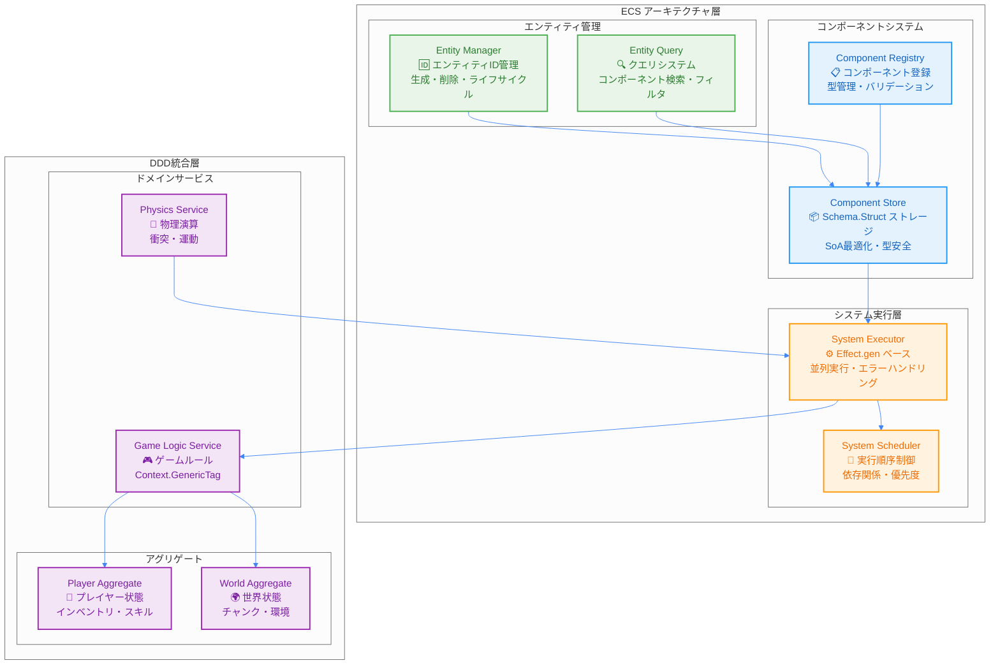
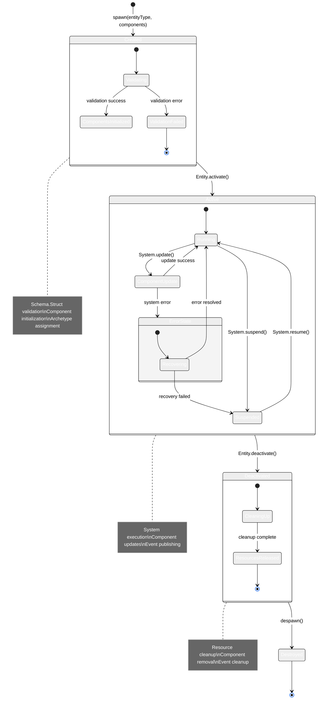

# ECS (Entity Component System) 統合設計

TypeScript Minecraftプロジェクトでは、**Entity Component System (ECS)** を **Domain-Driven Design (DDD)** および **Effect-TS** と深く統合し、高性能で保守性の高いゲームエンジンを実現しています。

## 1. ECSアーキテクチャの哲学

### 設計原則
1.  **データとロジックの完全分離**: コンポーネントは純粋なデータ (`Schema.Struct`)、システムは純粋関数 (`Effect`) でロジックを実装します。
2.  **合成による柔軟性**: エンティティはコンポーネントの組み合わせによって振る舞いが決まります。継承は使用しません。
3.  **パフォーマンス第一**: Structure of Arrays (SoA) とアーキタイプによるメモリ最適化を徹底します。
4.  **型安全性**: Effect-TSの`Schema`を用いて、コンパイル時および実行時の型安全性を保証します。

### 1.1 ECS統合システム概観

以下の図は、ECS（Entity Component System）とDDD（Domain-Driven Design）、Effect-TSの統合アーキテクチャを示しています。



### 1.2 ECSの三要素とEffect-TS統合

以下の図は、ECSの三要素（Entity、Component、System）がEffect-TSパターンとどのように統合されるかを詳細に示しています。

```mermaid
%%{init: {"theme": "neutral", "themeVariables": {"primaryColor": "#4285f4", "primaryTextColor": "#ffffff", "primaryBorderColor": "#ffffff", "lineColor": "#4285f4", "sectionBkgColor": "#f5f7fa", "tertiaryColor": "#f5f7fa"}}}%%
classDiagram
    class Entity {
        <<Schema.Struct>>
        +EntityId: Brand~string~
        +components: ComponentMap
        +isActive: boolean
        +version: number
    }

    class PositionComponent {
        <<Schema.Struct>>
        +_tag: "PositionComponent"
        +x: number
        +y: number
        +z: number
        +lastUpdated: Timestamp
    }

    class VelocityComponent {
        <<Schema.Struct>>
        +_tag: "VelocityComponent"
        +dx: number
        +dy: number
        +dz: number
        +friction: number
        +airResistance: number
    }

    class MovementSystem {
        <<Effect Interface>>
        +name: string
        +priority: number
        +requiredComponents: string[]
        +update(deltaTime): Effect~void, SystemError~
    }

    class ComponentStore {
        <<Context.GenericTag>>
        +getComponent~T~(entityId, type): Effect~T, SystemError~
        +setComponent~T~(entityId, type, component): Effect~void, SystemError~
        +hasComponent(entityId, type): Effect~boolean, SystemError~
    }

    class EntityQuery {
        <<Context.GenericTag>>
        +queryEntities(componentTypes): Effect~EntityId[], SystemError~
        +findEntity(predicate): Effect~Option~Entity~, SystemError~
    }

    Entity ||--o{ PositionComponent : contains
    Entity ||--o{ VelocityComponent : contains
    MovementSystem ..> ComponentStore : depends on
    MovementSystem ..> EntityQuery : depends on
    ComponentStore --> PositionComponent : manages
    ComponentStore --> VelocityComponent : manages
    EntityQuery --> Entity : queries

    note for Entity "単なる一意なID\n状態や振る舞いを持たない\n不変なデータ構造"
    note for PositionComponent "純粋なデータ構造\nSchema.Structで定義\n実行時型安全性"
    note for MovementSystem "純粋関数としてのロジック\nEffect型で副作用管理\n並列実行対応"
```

### 1.3 エンティティライフサイクル管理



### ECSの三要素
-   **エンティティ (Entity):** 単なる一意なID。状態や振る舞いを持ちません。
-   **コンポーネント (Component):** ゲームオブジェクトの状態を表す純粋なデータ構造。`Schema.Struct`で定義されます。
-   **システム (System):** 特定のコンポーネントを持つエンティティの集合に対してロジックを実行する純粋関数。

## 2. コンポーネント設計 (Component Design)

すべてのコンポーネントは`Schema.Struct`を用いて定義され、不変 (immutable) なデータ構造として扱われます。

```typescript
// ECS コンポーネント定義 - Effect-TS パターン
import { Schema, Effect, Context, Match, Stream, Ref } from "effect"

// ✅ Branded 型でエンティティIDとコンポーネントIDの型安全性
export type EntityId = string & { readonly _tag: "EntityId" }
export type ComponentId = string & { readonly _tag: "ComponentId" }
export type Timestamp = number & { readonly _tag: "Timestamp" }

const EntityId = Schema.String.pipe(Schema.brand("EntityId"))
const ComponentId = Schema.String.pipe(Schema.brand("ComponentId"))
const Timestamp = Schema.Number.pipe(Schema.brand("Timestamp"))

// ✅ ベースコンポーネントの定義
const BaseComponent = Schema.Struct({
  entityId: EntityId,
  lastUpdated: Timestamp,
  version: Schema.Number.pipe(Schema.nonNegative())
})

// ✅ Position コンポーネント - Stream対応の位置情報
export const PositionComponent = Schema.Struct({
  _tag: Schema.Literal("PositionComponent"),
  x: Schema.Number,
  y: Schema.Number,
  z: Schema.Number
}).pipe(Schema.extend(BaseComponent))

export interface PositionComponent extends Schema.Schema.Type<typeof PositionComponent> {}

// ✅ Velocity コンポーネント - 物理制約とパターンマッチング
export const VelocityComponent = Schema.Struct({
  _tag: Schema.Literal("VelocityComponent"),
  dx: Schema.Number.pipe(Schema.between(-100, 100)),
  dy: Schema.Number.pipe(Schema.between(-100, 100)),
  dz: Schema.Number.pipe(Schema.between(-100, 100)),
  friction: Schema.Number.pipe(Schema.between(0, 1)),
  airResistance: Schema.Number.pipe(Schema.between(0, 1))
}).pipe(Schema.extend(BaseComponent))

export interface VelocityComponent extends Schema.Schema.Type<typeof VelocityComponent> {}

// ✅ Health コンポーネント - リアクティブ更新対応
export const HealthComponent = Schema.Struct({
  _tag: Schema.Literal("HealthComponent"),
  current: Schema.Number.pipe(Schema.nonNegative()),
  max: Schema.Number.pipe(Schema.positive()),
  regenerationRate: Schema.Number.pipe(Schema.nonNegative()),
  lastDamageTime: Schema.optional(Timestamp)
}).pipe(Schema.extend(BaseComponent))

export interface HealthComponent extends Schema.Schema.Type<typeof HealthComponent> {}

// ✅ Component Union型とパターンマッチング用
export const Component = Schema.Union(
  PositionComponent,
  VelocityComponent,
  HealthComponent
)

export type Component = Schema.Schema.Type<typeof Component>

// ✅ コンポーネントタイプガード（パターンマッチング）
export const matchComponent = <R>(component: Component) =>
  Match.value(component).pipe(
    Match.tag("PositionComponent", (pos) => ({ type: "position" as const, data: pos })),
    Match.tag("VelocityComponent", (vel) => ({ type: "velocity" as const, data: vel })),
    Match.tag("HealthComponent", (health) => ({ type: "health" as const, data: health })),
    Match.exhaustive
  )
```

## 3. システム設計 (System Design)

システムは、特定のコンポーネントを持つエンティティをクエリし、それらのデータに対して操作を行う純粋関数です。副作用はすべて`Effect`型で管理されます。

```typescript
// ECS システム設計 - Effect Services & Stream パターン
import { Effect, Context, Schema, Stream, Ref, Match } from "effect"

// ✅ システムエラーの詳細定義
export const SystemError = Schema.TaggedError("SystemError")({
  systemName: Schema.String,
  entityId: Schema.optional(EntityId),
  reason: Schema.String,
  stackTrace: Schema.optional(Schema.String)
})

export interface SystemError extends Schema.Schema.Type<typeof SystemError> {}

// ✅ Effect Services によるシステム定義
export interface ECSSystem extends Context.Tag<"ECSSystem", {
  readonly name: string
  readonly priority: number
  readonly requiredComponents: ReadonlyArray<string>
  readonly update: (deltaTime: number) => Effect.Effect<void, SystemError>
  readonly stream: Stream.Stream<Component, SystemError>
}> {}

export const ECSSystem = Context.GenericTag<ECSSystem>("@minecraft/ECSSystem")

// ✅ Component Store Service - Ref使用
export interface ComponentStore extends Context.Tag<"ComponentStore", {
  readonly getComponent: <T extends Component>(
    entityId: EntityId,
    componentType: T["_tag"]
  ) => Effect.Effect<T, SystemError>
  readonly setComponent: <T extends Component>(
    entityId: EntityId,
    component: T
  ) => Effect.Effect<void, SystemError>
  readonly hasComponent: (
    entityId: EntityId,
    componentType: Component["_tag"]
  ) => Effect.Effect<boolean, SystemError>
  readonly streamComponents: <T extends Component>(
    componentType: T["_tag"]
  ) => Stream.Stream<T, SystemError>
  readonly componentState: Ref.Ref<Map<EntityId, Component[]>>
}> {}

export const ComponentStore = Context.GenericTag<ComponentStore>("@minecraft/ComponentStore")

// ✅ Entity Query Service - Stream対応
export interface EntityQuery extends Context.Tag<"EntityQuery", {
  readonly queryEntities: (query: EntityQueryPattern) => Effect.Effect<ReadonlyArray<EntityId>, SystemError>
  readonly streamEntities: (query: EntityQueryPattern) => Stream.Stream<EntityId, SystemError>
  readonly findEntity: (predicate: (id: EntityId) => Effect.Effect<boolean, SystemError>) => Effect.Effect<Option.Option<EntityId>, SystemError>
}> {}

export const EntityQuery = Context.GenericTag<EntityQuery>("@minecraft/EntityQuery")

// ✅ クエリパターン定義
export const EntityQueryPattern = Schema.Struct({
  all: Schema.Array(Schema.String),
  any: Schema.optional(Schema.Array(Schema.String)),
  none: Schema.optional(Schema.Array(Schema.String)),
  limit: Schema.optional(Schema.Number.pipe(Schema.positive()))
})

export interface EntityQueryPattern extends Schema.Schema.Type<typeof EntityQueryPattern> {}

// ✅ 純粋関数での物理計算（Property-based testing対応）
const calculateNewPosition = (
  position: PositionComponent,
  velocity: VelocityComponent,
  deltaTime: number
): Effect.Effect<PositionComponent, never> =>
  Effect.succeed({
    ...position,
    x: position.x + velocity.dx * deltaTime * Math.pow(velocity.friction, deltaTime),
    y: position.y + velocity.dy * deltaTime * Math.pow(velocity.airResistance, deltaTime),
    z: position.z + velocity.dz * deltaTime * Math.pow(velocity.friction, deltaTime),
    lastUpdated: Date.now() as Timestamp,
    version: position.version + 1
  })

// ✅ 早期リターンとパターンマッチング
const validateDeltaTime = (deltaTime: number): Effect.Effect<number, SystemError> =>
  Match.value(deltaTime).pipe(
    Match.when((dt) => dt <= 0, () => Effect.fail(
      SystemError.make({
        systemName: "MovementSystem",
        reason: "DeltaTime must be positive"
      })
    )),
    Match.when((dt) => dt > 1, () => Effect.fail(
      SystemError.make({
        systemName: "MovementSystem",
        reason: "DeltaTime too large"
      })
    )),
    Match.orElse(() => Effect.succeed(deltaTime))
  )

// ✅ Movement System with Streams
export const createMovementSystem = (): Effect.Effect<ECSSystem, never> =>
  Effect.succeed({
    name: "MovementSystem",
    priority: 100,
    requiredComponents: ["PositionComponent", "VelocityComponent"],

    update: (deltaTime: number) =>
      Effect.gen(function* () {
        yield* validateDeltaTime(deltaTime)

        const componentStore = yield* ComponentStore
        const entityQuery = yield* EntityQuery

        const entities = yield* entityQuery.queryEntities({
          all: ["PositionComponent", "VelocityComponent"],
          none: ["FrozenComponent"]
        })

        // 早期リターン
        if (entities.length === 0) return

        // 並列処理でコンポーネント更新
        yield* Effect.forEach(entities, (entityId) =>
          Effect.gen(function* () {
            const position = yield* componentStore.getComponent(entityId, "PositionComponent")
            const velocity = yield* componentStore.getComponent(entityId, "VelocityComponent")

            const newPosition = yield* calculateNewPosition(position, velocity, deltaTime)
            yield* componentStore.setComponent(entityId, newPosition)
          }),
          { concurrency: "unbounded" }
        )
      }),

    stream: Stream.gen(function* () {
      const componentStore = yield* ComponentStore

      // リアクティブコンポーネントストリーム
      yield* componentStore.streamComponents("PositionComponent")
      yield* componentStore.streamComponents("VelocityComponent")
    })
  })
```

## 4. パフォーマンス最適化

### 4.1. Structure of Arrays (SoA)

パフォーマンスを最大化するため、コンポーネントデータはStructure of Arrays (SoA) 形式でメモリに格納されます。これにより、キャッシュ効率が劇的に向上し、SIMD (Single Instruction, Multiple Data) による並列処理が可能になります。

```typescript
// SoA (Structure of Arrays) パフォーマンス最適化 - Effect-TS & Stream パターン
import { Schema, Effect, Stream, Ref, Match } from "effect"

// ✅ SoA Component Storage - Ref & Stream 対応
export const ComponentStorage = Schema.Struct({
  // ✅ Position SoA - SIMD最適化対応
  positions: Schema.Struct({
    x: Schema.instanceOf(Float32Array),
    y: Schema.instanceOf(Float32Array),
    z: Schema.instanceOf(Float32Array),
    lastUpdated: Schema.instanceOf(Float64Array)
  }),

  // ✅ Velocity SoA - 物理演算最適化
  velocities: Schema.Struct({
    dx: Schema.instanceOf(Float32Array),
    dy: Schema.instanceOf(Float32Array),
    dz: Schema.instanceOf(Float32Array),
    friction: Schema.instanceOf(Float32Array),
    airResistance: Schema.instanceOf(Float32Array)
  }),

  // ✅ Health SoA - リアクティブ更新対応
  health: Schema.Struct({
    current: Schema.instanceOf(Float32Array),
    max: Schema.instanceOf(Float32Array),
    regenerationRate: Schema.instanceOf(Float32Array)
  }),

  // ✅ メタデータ & バージョン管理
  entityCount: Schema.Number.pipe(Schema.nonNegative()),
  capacity: Schema.Number.pipe(Schema.positive()),
  version: Schema.Number.pipe(Schema.nonNegative()),
  archetype: Schema.optional(Schema.String.pipe(Schema.brand("ArchetypeId")))
})

export interface ComponentStorage extends Schema.Schema.Type<typeof ComponentStorage> {}

// ✅ SoA Service - Effect Service パターン
export interface SoAStorageService extends Context.Tag<"SoAStorage", {
  readonly storage: Ref.Ref<ComponentStorage>
  readonly updates: Stream.Stream<StorageUpdate, never>
  readonly createStorage: (capacity: number) => Effect.Effect<ComponentStorage, never>
  readonly batchUpdate: (
    updateFn: (storage: ComponentStorage) => ComponentStorage,
    options?: BatchOptions
  ) => Effect.Effect<void, StorageError>
  readonly queryBatch: (
    startIndex: number,
    batchSize: number
  ) => Effect.Effect<ComponentBatch, StorageError>
}> {}

export const SoAStorageService = Context.GenericTag<SoAStorageService>("@minecraft/SoAStorage")

// ✅ Storage Update Events
export const StorageUpdate = Schema.TaggedUnion("_tag", {
  BatchProcessed: Schema.Struct({
    _tag: Schema.Literal("BatchProcessed"),
    batchSize: Schema.Number.pipe(Schema.positive()),
    processingTime: Schema.Number.pipe(Schema.nonNegative()),
    entitiesAffected: Schema.Number.pipe(Schema.nonNegative())
  }),
  VersionUpdated: Schema.Struct({
    _tag: Schema.Literal("VersionUpdated"),
    oldVersion: Schema.Number,
    newVersion: Schema.Number
  })
})

export interface StorageUpdate extends Schema.Schema.Type<typeof StorageUpdate> {}

// ✅ Batch Options & Error Handling
export const BatchOptions = Schema.Struct({
  concurrency: Schema.optional(Schema.Union(Schema.Number.pipe(Schema.positive()), Schema.Literal("unbounded"))),
  chunkSize: Schema.optional(Schema.Number.pipe(Schema.positive()).pipe(Schema.default(64))),
  simdOptimized: Schema.optional(Schema.Boolean.pipe(Schema.default(true)))
})

export interface BatchOptions extends Schema.Schema.Type<typeof BatchOptions> {}

export const StorageError = Schema.TaggedError("StorageError")({
  operation: Schema.String,
  reason: Schema.String,
  entityIndex: Schema.optional(Schema.Number)
})

export interface StorageError extends Schema.Schema.Type<typeof StorageError> {}

// ✅ 純粋関数でSoA操作（Property-based testing対応）
export const createComponentStorage = (capacity: number): Effect.Effect<ComponentStorage, never> =>
  Effect.succeed({
    positions: {
      x: new Float32Array(capacity),
      y: new Float32Array(capacity),
      z: new Float32Array(capacity),
      lastUpdated: new Float64Array(capacity)
    },
    velocities: {
      dx: new Float32Array(capacity),
      dy: new Float32Array(capacity),
      dz: new Float32Array(capacity),
      friction: new Float32Array(capacity).fill(0.98), // デフォルト摩擦
      airResistance: new Float32Array(capacity).fill(0.99) // デフォルト空気抵抗
    },
    health: {
      current: new Float32Array(capacity).fill(100),
      max: new Float32Array(capacity).fill(100),
      regenerationRate: new Float32Array(capacity).fill(1)
    },
    entityCount: 0,
    capacity,
    version: 1
  })

// ✅ SIMD最適化 バッチ処理 - Effect & Stream
export const createSIMDProcessor = () =>
  Effect.gen(function* () {
    return {
      // ✅ 物理演算バッチ処理（並列化）
      updatePositionsBatch: (
        storage: ComponentStorage,
        deltaTime: number,
        options: BatchOptions = {}
      ): Effect.Effect<ComponentStorage, StorageError> =>
        Effect.gen(function* () {
          const batchSize = options.chunkSize ?? 64
          const batches = Math.ceil(storage.entityCount / batchSize)

          if (storage.entityCount === 0) return storage

          // バッチ処理のストリーム生成
          const batchStream = Stream.range(0, batches).pipe(
            Stream.map(batchIndex => ({
              startIndex: batchIndex * batchSize,
              endIndex: Math.min((batchIndex + 1) * batchSize, storage.entityCount)
            }))
          )

          // 新しいストレージを作成（不変性維持）
          const newStorage: ComponentStorage = {
            ...storage,
            positions: {
              x: new Float32Array(storage.positions.x),
              y: new Float32Array(storage.positions.y),
              z: new Float32Array(storage.positions.z),
              lastUpdated: new Float64Array(storage.positions.lastUpdated)
            },
            version: storage.version + 1
          }

          // 並列バッチ処理
          yield* batchStream.pipe(
            Stream.mapEffect(({ startIndex, endIndex }) =>
              Effect.gen(function* () {
                // SIMD最適化されたベクトル演算
                for (let i = startIndex; i < endIndex; i++) {
                  const friction = Math.pow(storage.velocities.friction[i], deltaTime)
                  const airResistance = Math.pow(storage.velocities.airResistance[i], deltaTime)

                  newStorage.positions.x[i] += storage.velocities.dx[i] * deltaTime * friction * airResistance
                  newStorage.positions.y[i] += storage.velocities.dy[i] * deltaTime * airResistance
                  newStorage.positions.z[i] += storage.velocities.dz[i] * deltaTime * friction * airResistance
                  newStorage.positions.lastUpdated[i] = Date.now()
                }
              })
            ),
            Stream.runDrain
          )

          return newStorage
        }),

      // ✅ ヘルス再生処理（Stream使用）
      regenerateHealthStream: (
        storage: ComponentStorage,
        deltaTime: number
      ): Stream.Stream<ComponentStorage, StorageError> =>
        Stream.gen(function* () {
          if (storage.entityCount === 0) {
            yield* Stream.succeed(storage)
            return
          }

          const newStorage = { ...storage, version: storage.version + 1 }

          // ヘルス再生をストリーム処理
          for (let i = 0; i < storage.entityCount; i++) {
            const maxHealth = storage.health.max[i]
            const currentHealth = storage.health.current[i]
            const regenRate = storage.health.regenerationRate[i]

            if (currentHealth < maxHealth) {
              newStorage.health.current[i] = Math.min(
                maxHealth,
                currentHealth + regenRate * deltaTime
              )
            }
          }

          yield* Stream.succeed(newStorage)
        })
    }
  })
```

### 4.2. アーキタイプ (Archetypes)

同じコンポーネントの組み合わせを持つエンティティは、「アーキタイプ」としてグループ化されます。システムはアーキタイプ単位で処理を行うため、条件分岐が不要になり、非常に高速なイテレーションが可能です。

```typescript
// アーキタイプ最適化 - Effect Services & Stream パターン
import { Effect, Stream, Context, Match, Ref } from "effect"

// ✅ アーキタイプ定義 - Branded型とパターンマッチング対応
export type ArchetypeId = string & { readonly _tag: "ArchetypeId" }

export const Archetype = Schema.Struct({
  id: Schema.String.pipe(Schema.brand("ArchetypeId")),
  componentTypes: Schema.Array(Schema.String).pipe(Schema.minItems(1)),
  storage: ComponentStorage,
  entityIds: Schema.Array(EntityId),
  count: Schema.Number.pipe(Schema.nonNegative()),
  lastUpdated: Timestamp,
  priority: Schema.Number.pipe(Schema.int()).pipe(Schema.default(100))
})

export interface Archetype extends Schema.Schema.Type<typeof Archetype> {}

// ✅ 高度なクエリパターン - パターンマッチング対応
export const ArchetypeQuery = Schema.Struct({
  all: Schema.Array(Schema.String),
  any: Schema.optional(Schema.Array(Schema.String)),
  none: Schema.optional(Schema.Array(Schema.String)),
  limit: Schema.optional(Schema.Number.pipe(Schema.positive())),
  priority: Schema.optional(Schema.Number),
  spatialBounds: Schema.optional(Schema.Struct({
    minX: Schema.Number, maxX: Schema.Number,
    minY: Schema.Number, maxY: Schema.Number,
    minZ: Schema.Number, maxZ: Schema.Number
  }))
})

export interface ArchetypeQuery extends Schema.Schema.Type<typeof ArchetypeQuery> {}

// ✅ アーキタイプマッチング - 早期リターン + パターンマッチング
const matchesArchetypeQuery = (archetype: Archetype, query: ArchetypeQuery): Effect.Effect<boolean, never> =>
  Effect.gen(function* () {
    // 早期リターン: all 条件チェック
    if (!query.all.every(component => archetype.componentTypes.includes(component))) {
      return false
    }

    // パターンマッチングによる条件チェック
    return Match.value(query).pipe(
      Match.when(
        (q) => q.none && q.none.some(component => archetype.componentTypes.includes(component)),
        () => false
      ),
      Match.when(
        (q) => q.any && !q.any.some(component => archetype.componentTypes.includes(component)),
        () => false
      ),
      Match.when(
        (q) => q.priority && archetype.priority < q.priority,
        () => false
      ),
      Match.orElse(() => true)
    )
  })

// ✅ Archetype Store Service - Stream & 空間インデックス対応
export interface ArchetypeStore extends Context.Tag<"ArchetypeStore", {
  readonly archetypes: Ref.Ref<Map<ArchetypeId, Archetype>>
  readonly queryArchetypes: (query: ArchetypeQuery) => Effect.Effect<ReadonlyArray<Archetype>, SystemError>
  readonly streamArchetypes: (query: ArchetypeQuery) => Stream.Stream<Archetype, SystemError>
  readonly getArchetype: (id: ArchetypeId) => Effect.Effect<Option.Option<Archetype>, SystemError>
  readonly spatialIndex: Ref.Ref<SpatialIndex>
  readonly updateArchetype: (archetype: Archetype) => Effect.Effect<void, SystemError>
}> {}

export const ArchetypeStore = Context.GenericTag<ArchetypeStore>("@minecraft/ArchetypeStore")

// ✅ 空間インデックス for 空間クエリ最適化
export const SpatialIndex = Schema.Struct({
  grid: Schema.Record({
    key: Schema.String, // "x,y,z" 形式
    value: Schema.Array(EntityId)
  }),
  cellSize: Schema.Number.pipe(Schema.positive()).pipe(Schema.default(16)),
  bounds: Schema.Struct({
    minX: Schema.Number, maxX: Schema.Number,
    minY: Schema.Number, maxY: Schema.Number,
    minZ: Schema.Number, maxZ: Schema.Number
  })
})

export interface SpatialIndex extends Schema.Schema.Type<typeof SpatialIndex> {}

// ✅ 高度なクエリビルダー - Stream対応
export const createArchetypeQueryBuilder = () => ({
  // 基本的な移動可能エンティティクエリ
  movableEntities: (): ArchetypeQuery => ({
    all: ["PositionComponent", "VelocityComponent"],
    none: ["FrozenComponent", "DisabledComponent"]
  }),

  // 戦闘可能エンティティクエリ
  combatEntities: (): ArchetypeQuery => ({
    all: ["PositionComponent", "HealthComponent"],
    any: ["WeaponComponent", "DefenseComponent"],
    none: ["DeadComponent"]
  }),

  // 空間範囲内エンティティクエリ
  entitiesInBounds: (bounds: {
    minX: number, maxX: number,
    minY: number, maxY: number,
    minZ: number, maxZ: number
  }): ArchetypeQuery => ({
    all: ["PositionComponent"],
    spatialBounds: bounds
  })
})

// ✅ 並列アーキタイプ処理 - Stream & 最適化
export const createArchetypeProcessor = () =>
  Effect.gen(function* () {
    const archetypeStore = yield* ArchetypeStore
    const simdProcessor = yield* createSIMDProcessor()

    return {
      // ✅ 移動システム処理（並列化 + Stream）
      processMovableArchetypes: (deltaTime: number): Effect.Effect<void, SystemError> =>
        Effect.gen(function* () {
          const queryBuilder = createArchetypeQueryBuilder()
          const query = queryBuilder.movableEntities()

          // Stream による リアクティブ処理
          yield* archetypeStore.streamArchetypes(query).pipe(
            Stream.filter((archetype) => archetype.count > 0),
            Stream.mapEffect((archetype) =>
              Effect.gen(function* () {
                // SIMD最適化されたバッチ処理
                const updatedStorage = yield* simdProcessor.updatePositionsBatch(
                  archetype.storage,
                  deltaTime,
                  { concurrency: "unbounded", simdOptimized: true }
                )

                const updatedArchetype: Archetype = {
                  ...archetype,
                  storage: updatedStorage,
                  lastUpdated: Date.now() as Timestamp
                }

                yield* archetypeStore.updateArchetype(updatedArchetype)
              })
            ),
            Stream.runDrain
          )
        }),

      // ✅ ヘルス再生システム（Stream処理）
      processHealthRegeneration: (deltaTime: number): Effect.Effect<void, SystemError> =>
        Effect.gen(function* () {
          const query: ArchetypeQuery = {
            all: ["HealthComponent"],
            none: ["DeadComponent"]
          }

          yield* archetypeStore.streamArchetypes(query).pipe(
            Stream.filter((archetype) => archetype.count > 0),
            Stream.flatMap((archetype) =>
              simdProcessor.regenerateHealthStream(archetype.storage, deltaTime)
            ),
            Stream.mapEffect((updatedStorage) =>
              Effect.gen(function* () {
                // アーキタイプの更新処理
                const archetype = yield* archetypeStore.getArchetype(updatedStorage.archetype!)
                return Match.value(archetype).pipe(
                  Match.when(Option.isSome, (some) =>
                    archetypeStore.updateArchetype({
                      ...some.value,
                      storage: updatedStorage,
                      lastUpdated: Date.now() as Timestamp
                    })
                  ),
                  Match.orElse(() => Effect.void)
                )
              })
            ),
            Stream.runDrain
          )
        }),

      // ✅ 空間クエリ最適化処理
      querySpatialEntities: (bounds: {
        minX: number, maxX: number,
        minY: number, maxY: number,
        minZ: number, maxZ: number
      }): Effect.Effect<ReadonlyArray<EntityId>, SystemError> =>
        Effect.gen(function* () {
          const queryBuilder = createArchetypeQueryBuilder()
          const query = queryBuilder.entitiesInBounds(bounds)

          const entities: EntityId[] = []

          yield* archetypeStore.streamArchetypes(query).pipe(
            Stream.mapEffect((archetype) =>
              Effect.gen(function* () {
                // 空間フィルタリング
                for (let i = 0; i < archetype.count; i++) {
                  const x = archetype.storage.positions.x[i]
                  const y = archetype.storage.positions.y[i]
                  const z = archetype.storage.positions.z[i]

                  if (x >= bounds.minX && x <= bounds.maxX &&
                      y >= bounds.minY && y <= bounds.maxY &&
                      z >= bounds.minZ && z <= bounds.maxZ) {
                    entities.push(archetype.entityIds[i])
                  }
                }
              })
            ),
            Stream.runDrain
          )

          return entities
        })
    }
  })
```

## 5. DDDとの統合

ECSは主にドメイン層とアプリケーション層で利用されます。

-   **ドメイン層:**
    -   コンポーネントの`Schema`を定義します。
    -   エンティティの概念を管理します。
-   **アプリケーション層:**
    -   システムを定義し、ドメインサービスを呼び出してビジネスロジックを実行します。
    -   クエリを実行して、特定のエンティティの集合を取得します。

この統合により、ドメインの関心事とゲームオブジェクトのデータ構造が明確に分離され、コードの保守性と拡張性が向上します。