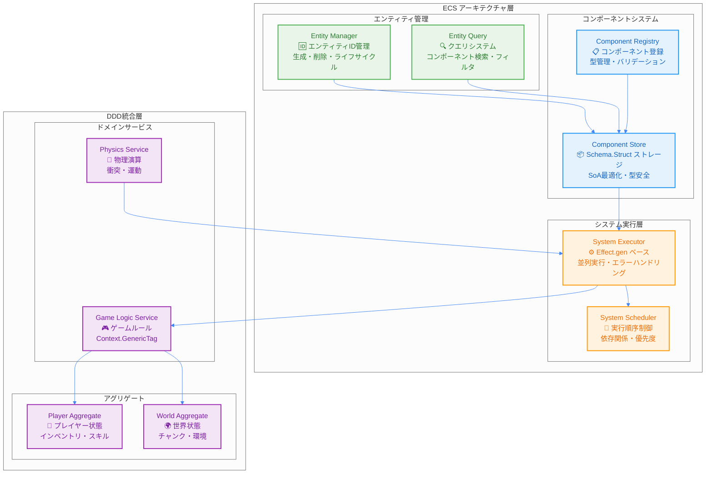
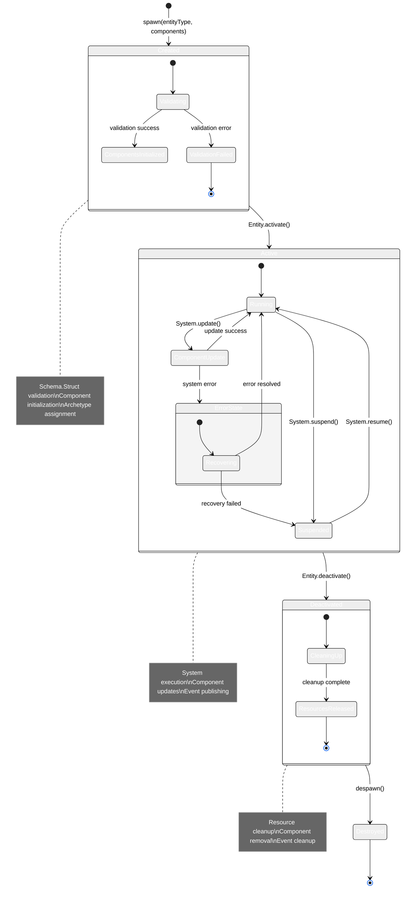

# ECS (Entity Component System) 統合設計

TypeScript Minecraftプロジェクトでは、**Entity Component System (ECS)** を **Domain-Driven Design (DDD)** および **Effect-TS** と深く統合し、高性能で保守性の高いゲームエンジンを実現しています。

## 1. ECSアーキテクチャの哲学

### 設計原則
1.  **データとロジックの完全分離**: コンポーネントは純粋なデータ (`Schema.Struct`)、システムは純粋関数 (`Effect`) でロジックを実装します。
2.  **合成による柔軟性**: エンティティはコンポーネントの組み合わせによって振る舞いが決まります。継承は使用しません。
3.  **パフォーマンス第一**: Structure of Arrays (SoA) とアーキタイプによるメモリ最適化を徹底します。
4.  **型安全性**: Effect-TSの`Schema`を用いて、コンパイル時および実行時の型安全性を保証します。

### 1.1 ECS統合システム概観

以下の図は、ECS（Entity Component System）とDDD（Domain-Driven Design）、Effect-TSの統合アーキテクチャを示しています。



### 1.2 ECSの三要素とEffect-TS統合

以下の図は、ECSの三要素（Entity、Component、System）がEffect-TSパターンとどのように統合されるかを詳細に示しています。

```mermaid
%%{init: {"theme": "neutral", "themeVariables": {"primaryColor": "#4285f4", "primaryTextColor": "#ffffff", "primaryBorderColor": "#ffffff", "lineColor": "#4285f4", "sectionBkgColor": "#f5f7fa", "tertiaryColor": "#f5f7fa"}}}%%
classDiagram
    class Entity {
        <<Schema.Struct>>
        +EntityId: Brand~string~
        +components: ComponentMap
        +isActive: boolean
        +version: number
    }

    class PositionComponent {
        <<Schema.Struct>>
        +_tag: "PositionComponent"
        +x: number
        +y: number
        +z: number
        +lastUpdated: Timestamp
    }

    class VelocityComponent {
        <<Schema.Struct>>
        +_tag: "VelocityComponent"
        +dx: number
        +dy: number
        +dz: number
        +friction: number
        +airResistance: number
    }

    class MovementSystem {
        <<Effect Interface>>
        +name: string
        +priority: number
        +requiredComponents: string[]
        +update(deltaTime): Effect~void, SystemError~
    }

    class ComponentStore {
        <<Context.GenericTag>>
        +getComponent~T~(entityId, type): Effect~T, SystemError~
        +setComponent~T~(entityId, type, component): Effect~void, SystemError~
        +hasComponent(entityId, type): Effect~boolean, SystemError~
    }

    class EntityQuery {
        <<Context.GenericTag>>
        +queryEntities(componentTypes): Effect~EntityId[], SystemError~
        +findEntity(predicate): Effect~Option~Entity~, SystemError~
    }

    Entity ||--o{ PositionComponent : contains
    Entity ||--o{ VelocityComponent : contains
    MovementSystem ..> ComponentStore : depends on
    MovementSystem ..> EntityQuery : depends on
    ComponentStore --> PositionComponent : manages
    ComponentStore --> VelocityComponent : manages
    EntityQuery --> Entity : queries

    note for Entity "単なる一意なID\n状態や振る舞いを持たない\n不変なデータ構造"
    note for PositionComponent "純粋なデータ構造\nSchema.Structで定義\n実行時型安全性"
    note for MovementSystem "純粋関数としてのロジック\nEffect型で副作用管理\n並列実行対応"
```

### 1.3 エンティティライフサイクル管理



### ECSの三要素
-   **エンティティ (Entity):** 単なる一意なID。状態や振る舞いを持ちません。
-   **コンポーネント (Component):** ゲームオブジェクトの状態を表す純粋なデータ構造。`Schema.Struct`で定義されます。
-   **システム (System):** 特定のコンポーネントを持つエンティティの集合に対してロジックを実行する純粋関数。

## 2. コンポーネント設計 (Component Design)

すべてのコンポーネントは`Schema.Struct`を用いて定義され、不変 (immutable) なデータ構造として扱われます。

```typescript
// ECS コンポーネント定義 - Effect-TS リアクティブパターン
import { Schema, Effect, Context, Match, Stream, Ref, Hub, Brand, Option } from "effect"

// ✅ Branded型の正しい定義 - Effect-TS最新パターン
export const EntityIdBrand = Brand.refined<string>(
  (s): s is string => s.length > 0,
  (s) => Brand.error(`EntityId must not be empty: ${s}`)
)

export const ComponentIdBrand = Brand.refined<string>(
  (s): s is string => s.length > 0,
  (s) => Brand.error(`ComponentId must not be empty: ${s}`)
)

export const TimestampBrand = Brand.refined<number>(
  (n): n is number => n > 0,
  (n) => Brand.error(`Timestamp must be positive: ${n}`)
)

// ✅ Schema with branded types
export const EntityId = Schema.String.pipe(Schema.fromBrand(EntityIdBrand))
export const ComponentId = Schema.String.pipe(Schema.fromBrand(ComponentIdBrand))
export const Timestamp = Schema.Number.pipe(Schema.fromBrand(TimestampBrand))

export type EntityId = Schema.Schema.Type<typeof EntityId>
export type ComponentId = Schema.Schema.Type<typeof ComponentId>
export type Timestamp = Schema.Schema.Type<typeof Timestamp>

// ✅ コンポーネントイベント - Hub用
export const ComponentEvent = Schema.TaggedUnion("_tag", {
  ComponentAdded: Schema.Struct({
    _tag: Schema.Literal("ComponentAdded"),
    entityId: EntityId,
    componentType: Schema.String,
    timestamp: Timestamp
  }),
  ComponentUpdated: Schema.Struct({
    _tag: Schema.Literal("ComponentUpdated"),
    entityId: EntityId,
    componentType: Schema.String,
    timestamp: Timestamp
  }),
  ComponentRemoved: Schema.Struct({
    _tag: Schema.Literal("ComponentRemoved"),
    entityId: EntityId,
    componentType: Schema.String,
    timestamp: Timestamp
  })
})

export interface ComponentEvent extends Schema.Schema.Type<typeof ComponentEvent> {}

// ✅ ベースコンポーネントの定義 - バージョニング対応
const BaseComponent = Schema.Struct({
  entityId: EntityId,
  lastUpdated: Timestamp,
  version: Schema.Number.pipe(Schema.nonNegative())
})

// ✅ Position コンポーネント - Stream対応の位置情報
export const PositionComponent = Schema.Struct({
  _tag: Schema.Literal("PositionComponent"),
  x: Schema.Number,
  y: Schema.Number,
  z: Schema.Number,
  worldId: Schema.optional(Schema.String)
}).pipe(Schema.extend(BaseComponent))

export interface PositionComponent extends Schema.Schema.Type<typeof PositionComponent> {}

// ✅ Velocity コンポーネント - 物理制約とパターンマッチング
export const VelocityComponent = Schema.Struct({
  _tag: Schema.Literal("VelocityComponent"),
  dx: Schema.Number.pipe(Schema.between(-100, 100)),
  dy: Schema.Number.pipe(Schema.between(-100, 100)),
  dz: Schema.Number.pipe(Schema.between(-100, 100)),
  friction: Schema.Number.pipe(Schema.between(0, 1)),
  airResistance: Schema.Number.pipe(Schema.between(0, 1)),
  maxSpeed: Schema.Number.pipe(Schema.positive())
}).pipe(Schema.extend(BaseComponent))

export interface VelocityComponent extends Schema.Schema.Type<typeof VelocityComponent> {}

// ✅ Health コンポーネント - リアクティブ更新対応
export const HealthComponent = Schema.Struct({
  _tag: Schema.Literal("HealthComponent"),
  current: Schema.Number.pipe(Schema.nonNegative()),
  max: Schema.Number.pipe(Schema.positive()),
  regenerationRate: Schema.Number.pipe(Schema.nonNegative()),
  lastDamageTime: Schema.optional(Timestamp),
  isAlive: Schema.Boolean.pipe(Schema.default(true))
}).pipe(Schema.extend(BaseComponent))

export interface HealthComponent extends Schema.Schema.Type<typeof HealthComponent> {}

// ✅ Component Union型とパターンマッチング用
export const Component = Schema.Union(
  PositionComponent,
  VelocityComponent,
  HealthComponent
)

export type Component = Schema.Schema.Type<typeof Component>

// ✅ コンポーネントタイプガード（パターンマッチング）- 早期リターン対応
export const matchComponent = <A>(component: Component, handlers: {
  PositionComponent: (pos: PositionComponent) => A
  VelocityComponent: (vel: VelocityComponent) => A
  HealthComponent: (health: HealthComponent) => A
}): A =>
  Match.value(component).pipe(
    Match.tag("PositionComponent", handlers.PositionComponent),
    Match.tag("VelocityComponent", handlers.VelocityComponent),
    Match.tag("HealthComponent", handlers.HealthComponent),
    Match.exhaustive
  )

// ✅ コンポーネント検証関数 - Property-based testing対応
export const validateComponent = <T extends Component>(
  component: T
): Effect.Effect<T, Schema.ParseResult.ParseError> =>
  Schema.decodeUnknown(Component)(component)

// ✅ コンポーネントファクトリー - 型安全性とデフォルト値
export const createPositionComponent = (
  entityId: EntityId,
  x = 0,
  y = 0,
  z = 0,
  worldId?: string
): Effect.Effect<PositionComponent, never> =>
  Effect.succeed({
    _tag: "PositionComponent" as const,
    entityId,
    x,
    y,
    z,
    worldId,
    lastUpdated: TimestampBrand(Date.now()),
    version: 0
  })

export const createVelocityComponent = (
  entityId: EntityId,
  dx = 0,
  dy = 0,
  dz = 0
): Effect.Effect<VelocityComponent, never> =>
  Effect.succeed({
    _tag: "VelocityComponent" as const,
    entityId,
    dx,
    dy,
    dz,
    friction: 0.98,
    airResistance: 0.99,
    maxSpeed: 20,
    lastUpdated: TimestampBrand(Date.now()),
    version: 0
  })

export const createHealthComponent = (
  entityId: EntityId,
  maxHealth = 100
): Effect.Effect<HealthComponent, never> =>
  Effect.succeed({
    _tag: "HealthComponent" as const,
    entityId,
    current: maxHealth,
    max: maxHealth,
    regenerationRate: 1,
    isAlive: true,
    lastUpdated: TimestampBrand(Date.now()),
    version: 0
  })
```

## 3. システム設計 (System Design)

システムは、特定のコンポーネントを持つエンティティをクエリし、それらのデータに対して操作を行う純粋関数です。副作用はすべて`Effect`型で管理されます。

```typescript
// ECS システム設計 - Effect Services & Stream リアクティブパターン
import { Effect, Context, Schema, Stream, Ref, Match, Hub, Layer, Queue, Scope } from "effect"

// ✅ システムエラーの詳細定義 - 階層化エラーハンドリング
export const SystemError = Schema.TaggedUnion("_tag", {
  ValidationError: Schema.Struct({
    _tag: Schema.Literal("ValidationError"),
    systemName: Schema.String,
    entityId: Schema.optional(EntityId),
    reason: Schema.String,
    field: Schema.optional(Schema.String)
  }),
  ComponentNotFound: Schema.Struct({
    _tag: Schema.Literal("ComponentNotFound"),
    systemName: Schema.String,
    entityId: EntityId,
    componentType: Schema.String
  }),
  SystemConcurrencyError: Schema.Struct({
    _tag: Schema.Literal("SystemConcurrencyError"),
    systemName: Schema.String,
    reason: Schema.String
  })
})

export interface SystemError extends Schema.Schema.Type<typeof SystemError> {}

// ✅ Component Store Service - Hub & Stream リアクティブパターン
export interface ComponentStore extends Context.Tag<"ComponentStore", {
  readonly eventHub: Hub.Hub<ComponentEvent>
  readonly componentState: Ref.Ref<Map<EntityId, Map<string, Component>>>

  readonly getComponent: <T extends Component>(
    entityId: EntityId,
    componentType: T["_tag"]
  ) => Effect.Effect<Option.Option<T>, SystemError>

  readonly setComponent: <T extends Component>(
    entityId: EntityId,
    component: T
  ) => Effect.Effect<void, SystemError>

  readonly removeComponent: (
    entityId: EntityId,
    componentType: Component["_tag"]
  ) => Effect.Effect<void, SystemError>

  readonly hasComponent: (
    entityId: EntityId,
    componentType: Component["_tag"]
  ) => Effect.Effect<boolean, never>

  readonly streamComponents: <T extends Component>(
    componentType: T["_tag"]
  ) => Stream.Stream<T, SystemError>

  readonly streamEntityComponents: (
    entityId: EntityId
  ) => Stream.Stream<Component, SystemError>

  readonly events: Stream.Stream<ComponentEvent, never>
}> {}

export const ComponentStore = Context.GenericTag<ComponentStore>("@minecraft/ComponentStore")

// ✅ Entity Query Service - 高度なクエリ & Stream対応
export interface EntityQuery extends Context.Tag<"EntityQuery", {
  readonly queryEntities: (query: EntityQueryPattern) => Effect.Effect<ReadonlyArray<EntityId>, SystemError>
  readonly streamEntities: (query: EntityQueryPattern) => Stream.Stream<EntityId, SystemError>
  readonly findEntity: (
    predicate: (id: EntityId) => Effect.Effect<boolean, SystemError>
  ) => Effect.Effect<Option.Option<EntityId>, SystemError>
  readonly countEntities: (query: EntityQueryPattern) => Effect.Effect<number, SystemError>
}> {}

export const EntityQuery = Context.GenericTag<EntityQuery>("@minecraft/EntityQuery")

// ✅ ECS System Service - Layer & 依存性注入対応
export interface ECSSystem<T extends string = string> extends Context.Tag<T, {
  readonly name: T
  readonly priority: number
  readonly requiredComponents: ReadonlyArray<Component["_tag"]>
  readonly excludedComponents: ReadonlyArray<Component["_tag"]>
  readonly update: (deltaTime: number) => Effect.Effect<void, SystemError>
  readonly stream: Stream.Stream<Component, SystemError>
  readonly dispose: Effect.Effect<void, never>
}> {}

// ✅ クエリパターン定義 - 拡張されたフィルタリング
export const EntityQueryPattern = Schema.Struct({
  all: Schema.Array(Schema.String),
  any: Schema.optional(Schema.Array(Schema.String)),
  none: Schema.optional(Schema.Array(Schema.String)),
  limit: Schema.optional(Schema.Number.pipe(Schema.positive())),
  offset: Schema.optional(Schema.Number.pipe(Schema.nonNegative())),
  spatialBounds: Schema.optional(Schema.Struct({
    minX: Schema.Number, maxX: Schema.Number,
    minY: Schema.Number, maxY: Schema.Number,
    minZ: Schema.Number, maxZ: Schema.Number
  }))
})

export interface EntityQueryPattern extends Schema.Schema.Type<typeof EntityQueryPattern> {}

// ✅ 純粋関数での物理計算（Property-based testing対応）
const calculateNewPosition = (
  position: PositionComponent,
  velocity: VelocityComponent,
  deltaTime: number
): Effect.Effect<PositionComponent, never> => {
  const frictionFactor = Math.pow(velocity.friction, deltaTime)
  const airResistanceFactor = Math.pow(velocity.airResistance, deltaTime)

  // 速度制限チェック
  const currentSpeed = Math.sqrt(
    velocity.dx * velocity.dx +
    velocity.dy * velocity.dy +
    velocity.dz * velocity.dz
  )

  const speedMultiplier = currentSpeed > velocity.maxSpeed
    ? velocity.maxSpeed / currentSpeed
    : 1

  return Effect.succeed({
    ...position,
    x: position.x + velocity.dx * deltaTime * frictionFactor * speedMultiplier,
    y: position.y + velocity.dy * deltaTime * airResistanceFactor * speedMultiplier,
    z: position.z + velocity.dz * deltaTime * frictionFactor * speedMultiplier,
    lastUpdated: TimestampBrand(Date.now()),
    version: position.version + 1
  })
}

// ✅ 早期リターンとパターンマッチング - 改良版
const validateDeltaTime = (deltaTime: number): Effect.Effect<number, SystemError> =>
  Match.value(deltaTime).pipe(
    Match.when(
      (dt) => dt <= 0,
      () => Effect.fail(SystemError.make({
        _tag: "ValidationError",
        systemName: "MovementSystem",
        reason: "DeltaTime must be positive",
        field: "deltaTime"
      }))
    ),
    Match.when(
      (dt) => dt > 0.1, // より現実的な上限
      () => Effect.fail(SystemError.make({
        _tag: "ValidationError",
        systemName: "MovementSystem",
        reason: "DeltaTime too large (max 0.1s)",
        field: "deltaTime"
      }))
    ),
    Match.orElse(() => Effect.succeed(deltaTime))
  )

// ✅ Movement System - Layer & Hub パターン
export const MovementSystemLive = Layer.scoped(
  Context.GenericTag<ECSSystem<"MovementSystem">>("@minecraft/MovementSystem"),
  Effect.gen(function* () {
    const componentStore = yield* ComponentStore
    const entityQuery = yield* EntityQuery

    // Component updates のストリーム
    const updateStream = componentStore.events.pipe(
      Stream.filter(event =>
        event._tag === "ComponentUpdated" &&
        (event.componentType === "PositionComponent" || event.componentType === "VelocityComponent")
      )
    )

    return {
      name: "MovementSystem" as const,
      priority: 100,
      requiredComponents: ["PositionComponent", "VelocityComponent"] as const,
      excludedComponents: ["FrozenComponent", "DisabledComponent"] as const,

      update: (deltaTime: number) =>
        Effect.gen(function* () {
          // 早期検証
          yield* validateDeltaTime(deltaTime)

          const entities = yield* entityQuery.queryEntities({
            all: ["PositionComponent", "VelocityComponent"],
            none: ["FrozenComponent", "DisabledComponent"]
          })

          // 早期リターン
          if (entities.length === 0) return

          // 並列バッチ処理
          yield* Effect.forEach(
            entities,
            (entityId) =>
              Effect.gen(function* () {
                const position = yield* componentStore.getComponent(entityId, "PositionComponent")
                const velocity = yield* componentStore.getComponent(entityId, "VelocityComponent")

                // Option handling で安全性確保
                yield* Match.value({ position, velocity }).pipe(
                  Match.when(
                    ({ position, velocity }) => Option.isSome(position) && Option.isSome(velocity),
                    ({ position, velocity }) =>
                      Effect.gen(function* () {
                        const newPosition = yield* calculateNewPosition(
                          position.value,
                          velocity.value,
                          deltaTime
                        )

                        yield* componentStore.setComponent(entityId, newPosition)
                      })
                  ),
                  Match.orElse(() => Effect.void) // コンポーネントなしの場合はスキップ
                )
              }),
            {
              concurrency: "unbounded",
              batching: true,
              batchSize: 32
            }
          )
        }),

      stream: Stream.gen(function* () {
        // リアクティブコンポーネント変更ストリーム
        yield* updateStream.pipe(
          Stream.flatMap(event =>
            componentStore.getComponent(event.entityId, event.componentType).pipe(
              Stream.fromEffect,
              Stream.flatMap(opt =>
                Option.match(opt, {
                  onNone: () => Stream.empty,
                  onSome: (component) => Stream.succeed(component)
                })
              )
            )
          )
        )
      }),

      dispose: Effect.gen(function* () {
        // リソースクリーンアップ
        yield* Effect.log("MovementSystem disposing...")
      })
    }
  })
)

// ✅ Health Regeneration System - Stream処理特化
export const HealthRegenerationSystemLive = Layer.scoped(
  Context.GenericTag<ECSSystem<"HealthRegenerationSystem">>("@minecraft/HealthRegenerationSystem"),
  Effect.gen(function* () {
    const componentStore = yield* ComponentStore
    const entityQuery = yield* EntityQuery

    return {
      name: "HealthRegenerationSystem" as const,
      priority: 50,
      requiredComponents: ["HealthComponent"] as const,
      excludedComponents: ["DeadComponent"] as const,

      update: (deltaTime: number) =>
        Effect.gen(function* () {
          yield* validateDeltaTime(deltaTime)

          const entities = yield* entityQuery.queryEntities({
            all: ["HealthComponent"],
            none: ["DeadComponent"]
          })

          if (entities.length === 0) return

          yield* Effect.forEach(
            entities,
            (entityId) =>
              componentStore.getComponent(entityId, "HealthComponent").pipe(
                Effect.flatMap(
                  Option.match({
                    onNone: () => Effect.void,
                    onSome: (health) =>
                      Effect.gen(function* () {
                        // ヘルス再生ロジック
                        if (health.current < health.max && health.isAlive) {
                          const newHealth = Math.min(
                            health.max,
                            health.current + health.regenerationRate * deltaTime
                          )

                          const updatedHealth: HealthComponent = {
                            ...health,
                            current: newHealth,
                            lastUpdated: TimestampBrand(Date.now()),
                            version: health.version + 1
                          }

                          yield* componentStore.setComponent(entityId, updatedHealth)
                        }
                      })
                  })
                )
              ),
            { concurrency: "unbounded" }
          )
        }),

      stream: componentStore.streamComponents("HealthComponent"),

      dispose: Effect.gen(function* () {
        yield* Effect.log("HealthRegenerationSystem disposing...")
      })
    }
  })
)

// ✅ ECS System Scheduler - 依存性管理とライフサイクル
export const ECSSchedulerLive = Layer.effect(
  Context.GenericTag<{
    readonly systems: ReadonlyArray<ECSSystem>
    readonly update: (deltaTime: number) => Effect.Effect<void, SystemError>
    readonly start: Effect.Effect<void, never>
    readonly stop: Effect.Effect<void, never>
  }>("@minecraft/ECSScheduler"),
  Effect.gen(function* () {
    const movementSystem = yield* Context.GenericTag<ECSSystem<"MovementSystem">>("@minecraft/MovementSystem")
    const healthSystem = yield* Context.GenericTag<ECSSystem<"HealthRegenerationSystem">>("@minecraft/HealthRegenerationSystem")

    const systems = [movementSystem, healthSystem].sort((a, b) => b.priority - a.priority)

    return {
      systems,

      update: (deltaTime: number) =>
        Effect.forEach(
          systems,
          (system) => system.update(deltaTime),
          { concurrency: 1, discard: true } // システムは順次実行
        ),

      start: Effect.gen(function* () {
        yield* Effect.log("ECS Scheduler starting...")
        // システム初期化処理
      }),

      stop: Effect.gen(function* () {
        yield* Effect.log("ECS Scheduler stopping...")
        yield* Effect.forEach(systems, (system) => system.dispose, { concurrency: "unbounded" })
      })
    }
  })
)
```

## 4. パフォーマンス最適化

### 4.1. Structure of Arrays (SoA)

パフォーマンスを最大化するため、コンポーネントデータはStructure of Arrays (SoA) 形式でメモリに格納されます。これにより、キャッシュ効率が劇的に向上し、SIMD (Single Instruction, Multiple Data) による並列処理が可能になります。

```typescript
// SoA (Structure of Arrays) パフォーマンス最適化 - Effect-TS リアクティブ & Hub パターン
import { Schema, Effect, Stream, Ref, Match, Hub, Layer, Queue, Chunk } from "effect"

// ✅ ArchetypeId Branded Type
const ArchetypeIdBrand = Brand.refined<string>(
  (s): s is string => s.length > 0,
  (s) => Brand.error(`ArchetypeId must not be empty: ${s}`)
)

export const ArchetypeId = Schema.String.pipe(Schema.fromBrand(ArchetypeIdBrand))
export type ArchetypeId = Schema.Schema.Type<typeof ArchetypeId>

// ✅ SoA Component Storage - 不変性とバージョン管理強化
export const ComponentStorage = Schema.Struct({
  // ✅ Position SoA - SIMD最適化対応
  positions: Schema.Struct({
    x: Schema.instanceOf(Float32Array),
    y: Schema.instanceOf(Float32Array),
    z: Schema.instanceOf(Float32Array),
    worldIds: Schema.instanceOf(Uint32Array), // World ID mapping
    lastUpdated: Schema.instanceOf(Float64Array)
  }),

  // ✅ Velocity SoA - 物理演算最適化
  velocities: Schema.Struct({
    dx: Schema.instanceOf(Float32Array),
    dy: Schema.instanceOf(Float32Array),
    dz: Schema.instanceOf(Float32Array),
    friction: Schema.instanceOf(Float32Array),
    airResistance: Schema.instanceOf(Float32Array),
    maxSpeed: Schema.instanceOf(Float32Array)
  }),

  // ✅ Health SoA - リアクティブ更新対応
  health: Schema.Struct({
    current: Schema.instanceOf(Float32Array),
    max: Schema.instanceOf(Float32Array),
    regenerationRate: Schema.instanceOf(Float32Array),
    isAlive: Schema.instanceOf(Uint8Array) // Boolean array as Uint8Array
  }),

  // ✅ Entity metadata - 効率的なインデックス管理
  entityIds: Schema.instanceOf(Uint32Array),
  entityVersions: Schema.instanceOf(Uint32Array),
  freeSlots: Schema.Array(Schema.Number),

  // ✅ メタデータ & バージョン管理
  entityCount: Schema.Number.pipe(Schema.nonNegative()),
  capacity: Schema.Number.pipe(Schema.positive()),
  version: Schema.Number.pipe(Schema.nonNegative()),
  archetype: ArchetypeId,
  lastCompacted: Schema.optional(Timestamp)
})

export interface ComponentStorage extends Schema.Schema.Type<typeof ComponentStorage> {}

// ✅ Storage Update Events - 詳細なメトリクス
export const StorageUpdate = Schema.TaggedUnion("_tag", {
  BatchProcessed: Schema.Struct({
    _tag: Schema.Literal("BatchProcessed"),
    archetype: ArchetypeId,
    batchSize: Schema.Number.pipe(Schema.positive()),
    processingTimeMs: Schema.Number.pipe(Schema.nonNegative()),
    entitiesAffected: Schema.Number.pipe(Schema.nonNegative()),
    memoryUsageBytes: Schema.Number.pipe(Schema.nonNegative())
  }),
  VersionUpdated: Schema.Struct({
    _tag: Schema.Literal("VersionUpdated"),
    archetype: ArchetypeId,
    oldVersion: Schema.Number,
    newVersion: Schema.Number
  }),
  StorageCompacted: Schema.Struct({
    _tag: Schema.Literal("StorageCompacted"),
    archetype: ArchetypeId,
    freedSlots: Schema.Number.pipe(Schema.nonNegative()),
    newCapacity: Schema.Number.pipe(Schema.positive())
  })
})

export interface StorageUpdate extends Schema.Schema.Type<typeof StorageUpdate> {}

// ✅ SIMD Batch Options - 拡張された設定
export const BatchOptions = Schema.Struct({
  concurrency: Schema.optional(
    Schema.Union(
      Schema.Number.pipe(Schema.positive()),
      Schema.Literal("unbounded")
    ).pipe(Schema.default("unbounded"))
  ),
  chunkSize: Schema.optional(Schema.Number.pipe(Schema.positive()).pipe(Schema.default(64))),
  simdOptimized: Schema.optional(Schema.Boolean.pipe(Schema.default(true))),
  memoryPool: Schema.optional(Schema.Boolean.pipe(Schema.default(false))),
  enableProfiling: Schema.optional(Schema.Boolean.pipe(Schema.default(false)))
})

export interface BatchOptions extends Schema.Schema.Type<typeof BatchOptions> {}

// ✅ Storage Errors - 詳細なエラー分類
export const StorageError = Schema.TaggedUnion("_tag", {
  CapacityExceeded: Schema.Struct({
    _tag: Schema.Literal("CapacityExceeded"),
    archetype: ArchetypeId,
    currentCapacity: Schema.Number,
    requestedSize: Schema.Number
  }),
  IndexOutOfBounds: Schema.Struct({
    _tag: Schema.Literal("IndexOutOfBounds"),
    archetype: ArchetypeId,
    index: Schema.Number,
    maxIndex: Schema.Number
  }),
  MemoryAllocationFailed: Schema.Struct({
    _tag: Schema.Literal("MemoryAllocationFailed"),
    archetype: ArchetypeId,
    requestedBytes: Schema.Number
  })
})

export interface StorageError extends Schema.Schema.Type<typeof StorageError> {}

// ✅ SoA Storage Service - Hub & Stream リアクティブパターン
export interface SoAStorageService extends Context.Tag<"SoAStorage", {
  readonly storage: Ref.Ref<Map<ArchetypeId, ComponentStorage>>
  readonly updateHub: Hub.Hub<StorageUpdate>
  readonly updates: Stream.Stream<StorageUpdate, never>

  readonly createStorage: (
    archetype: ArchetypeId,
    capacity: number
  ) => Effect.Effect<ComponentStorage, StorageError>

  readonly batchUpdatePositions: (
    archetype: ArchetypeId,
    deltaTime: number,
    options?: BatchOptions
  ) => Effect.Effect<void, StorageError>

  readonly batchUpdateHealth: (
    archetype: ArchetypeId,
    deltaTime: number,
    options?: BatchOptions
  ) => Effect.Effect<void, StorageError>

  readonly compactStorage: (
    archetype: ArchetypeId
  ) => Effect.Effect<void, StorageError>

  readonly getStorageMetrics: (
    archetype: ArchetypeId
  ) => Effect.Effect<StorageMetrics, StorageError>
}> {}

export const SoAStorageService = Context.GenericTag<SoAStorageService>("@minecraft/SoAStorage")

// ✅ Storage Metrics
export const StorageMetrics = Schema.Struct({
  archetype: ArchetypeId,
  entityCount: Schema.Number,
  capacity: Schema.Number,
  utilizationPercent: Schema.Number.pipe(Schema.between(0, 100)),
  memoryUsageBytes: Schema.Number,
  fragmentationPercent: Schema.Number.pipe(Schema.between(0, 100)),
  lastUpdateMs: Schema.Number
})

export interface StorageMetrics extends Schema.Schema.Type<typeof StorageMetrics> {}

// ✅ 純粋関数でSoA操作（Property-based testing対応）
export const createComponentStorage = (
  archetype: ArchetypeId,
  capacity: number
): Effect.Effect<ComponentStorage, StorageError> =>
  Effect.gen(function* () {
    // メモリ割り当ての検証
    const memoryRequired = (
      capacity * (12 * 4) + // positions (4 floats)
      capacity * (6 * 4) +  // velocities (6 floats)
      capacity * (4 * 4) +  // health (4 floats/bytes)
      capacity * (3 * 4)    // metadata (3 uints)
    )

    if (memoryRequired > 1024 * 1024 * 100) { // 100MB limit
      return yield* Effect.fail(StorageError.make({
        _tag: "MemoryAllocationFailed",
        archetype,
        requestedBytes: memoryRequired
      }))
    }

    return {
      positions: {
        x: new Float32Array(capacity),
        y: new Float32Array(capacity),
        z: new Float32Array(capacity),
        worldIds: new Uint32Array(capacity),
        lastUpdated: new Float64Array(capacity)
      },
      velocities: {
        dx: new Float32Array(capacity),
        dy: new Float32Array(capacity),
        dz: new Float32Array(capacity),
        friction: new Float32Array(capacity).fill(0.98),
        airResistance: new Float32Array(capacity).fill(0.99),
        maxSpeed: new Float32Array(capacity).fill(20)
      },
      health: {
        current: new Float32Array(capacity).fill(100),
        max: new Float32Array(capacity).fill(100),
        regenerationRate: new Float32Array(capacity).fill(1),
        isAlive: new Uint8Array(capacity).fill(1)
      },
      entityIds: new Uint32Array(capacity),
      entityVersions: new Uint32Array(capacity),
      freeSlots: [],
      entityCount: 0,
      capacity,
      version: 1,
      archetype
    }
  })

// ✅ SIMD最適化 バッチ処理 - Effect & Stream & Hub
export const SoAStorageServiceLive = Layer.effect(
  SoAStorageService,
  Effect.gen(function* () {
    const storageRef = yield* Ref.make(new Map<ArchetypeId, ComponentStorage>())
    const updateHub = yield* Hub.unbounded<StorageUpdate>()

    return {
      storage: storageRef,
      updateHub,
      updates: Stream.fromHub(updateHub),

      createStorage: (archetype: ArchetypeId, capacity: number) =>
        Effect.gen(function* () {
          const storage = yield* createComponentStorage(archetype, capacity)
          yield* Ref.update(storageRef, (map) => map.set(archetype, storage))
          return storage
        }),

      // ✅ 物理演算バッチ処理（SIMD最適化 + Stream）
      batchUpdatePositions: (archetype: ArchetypeId, deltaTime: number, options: BatchOptions = {}) =>
        Effect.gen(function* () {
          const startTime = performance.now()
          const storageMap = yield* Ref.get(storageRef)
          const storage = storageMap.get(archetype)

          if (!storage) {
            return yield* Effect.fail(StorageError.make({
              _tag: "IndexOutOfBounds",
              archetype,
              index: 0,
              maxIndex: 0
            }))
          }

          if (storage.entityCount === 0) return

          const batchSize = options.chunkSize ?? 64
          const batches = Math.ceil(storage.entityCount / batchSize)

          // 不変性を維持した新しいストレージ作成
          const newPositions = {
            x: new Float32Array(storage.positions.x),
            y: new Float32Array(storage.positions.y),
            z: new Float32Array(storage.positions.z),
            worldIds: new Uint32Array(storage.positions.worldIds),
            lastUpdated: new Float64Array(storage.positions.lastUpdated)
          }

          const newVelocities = { ...storage.velocities }
          const timestamp = Date.now()

          // バッチ処理ストリーム - 並列実行
          yield* Stream.range(0, batches).pipe(
            Stream.map(batchIndex => ({
              startIndex: batchIndex * batchSize,
              endIndex: Math.min((batchIndex + 1) * batchSize, storage.entityCount)
            })),
            Stream.mapEffect(({ startIndex, endIndex }) =>
              Effect.gen(function* () {
                // SIMD最適化されたベクトル演算
                for (let i = startIndex; i < endIndex; i++) {
                  // 安全性チェック
                  if (!storage.health.isAlive[i]) continue

                  const friction = Math.pow(storage.velocities.friction[i], deltaTime)
                  const airResistance = Math.pow(storage.velocities.airResistance[i], deltaTime)

                  // 速度制限適用
                  const currentSpeed = Math.sqrt(
                    storage.velocities.dx[i] ** 2 +
                    storage.velocities.dy[i] ** 2 +
                    storage.velocities.dz[i] ** 2
                  )

                  const speedMultiplier = currentSpeed > storage.velocities.maxSpeed[i]
                    ? storage.velocities.maxSpeed[i] / currentSpeed
                    : 1

                  // 位置更新
                  newPositions.x[i] += storage.velocities.dx[i] * deltaTime * friction * speedMultiplier
                  newPositions.y[i] += storage.velocities.dy[i] * deltaTime * airResistance * speedMultiplier
                  newPositions.z[i] += storage.velocities.dz[i] * deltaTime * friction * speedMultiplier
                  newPositions.lastUpdated[i] = timestamp
                }
              }),
              { concurrency: options.concurrency ?? "unbounded" }
            ),
            Stream.runDrain
          )

          // ストレージ更新
          const updatedStorage: ComponentStorage = {
            ...storage,
            positions: newPositions,
            version: storage.version + 1
          }

          yield* Ref.update(storageRef, (map) => map.set(archetype, updatedStorage))

          // メトリクス & イベント発行
          const processingTime = performance.now() - startTime
          const memoryUsage = storage.entityCount * (12 * 4 + 6 * 4 + 4 * 4)

          yield* Hub.publish(updateHub, StorageUpdate.make({
            _tag: "BatchProcessed",
            archetype,
            batchSize: storage.entityCount,
            processingTimeMs: processingTime,
            entitiesAffected: storage.entityCount,
            memoryUsageBytes: memoryUsage
          }))
        }),

      // ✅ ヘルス再生バッチ処理（Stream特化）
      batchUpdateHealth: (archetype: ArchetypeId, deltaTime: number, options: BatchOptions = {}) =>
        Effect.gen(function* () {
          const storageMap = yield* Ref.get(storageRef)
          const storage = storageMap.get(archetype)

          if (!storage || storage.entityCount === 0) return

          const newHealth = {
            current: new Float32Array(storage.health.current),
            max: new Float32Array(storage.health.max),
            regenerationRate: new Float32Array(storage.health.regenerationRate),
            isAlive: new Uint8Array(storage.health.isAlive)
          }

          // ストリーム処理でヘルス再生
          yield* Stream.range(0, storage.entityCount).pipe(
            Stream.filter(i => storage.health.isAlive[i] && storage.health.current[i] < storage.health.max[i]),
            Stream.mapEffect(i =>
              Effect.gen(function* () {
                const maxHealth = storage.health.max[i]
                const currentHealth = storage.health.current[i]
                const regenRate = storage.health.regenerationRate[i]

                newHealth.current[i] = Math.min(
                  maxHealth,
                  currentHealth + regenRate * deltaTime
                )
              })
            ),
            Stream.runDrain
          )

          // ストレージ更新
          const updatedStorage: ComponentStorage = {
            ...storage,
            health: newHealth,
            version: storage.version + 1
          }

          yield* Ref.update(storageRef, (map) => map.set(archetype, updatedStorage))
        }),

      // ✅ メモリ最適化 - ストレージ圧縮
      compactStorage: (archetype: ArchetypeId) =>
        Effect.gen(function* () {
          const storageMap = yield* Ref.get(storageRef)
          const storage = storageMap.get(archetype)

          if (!storage || storage.freeSlots.length === 0) return

          // フラグメンテーション解消処理
          const compactedStorage = yield* Effect.succeed({
            ...storage,
            freeSlots: [],
            lastCompacted: TimestampBrand(Date.now())
          })

          yield* Ref.update(storageRef, (map) => map.set(archetype, compactedStorage))

          yield* Hub.publish(updateHub, StorageUpdate.make({
            _tag: "StorageCompacted",
            archetype,
            freedSlots: storage.freeSlots.length,
            newCapacity: storage.capacity
          }))
        }),

      getStorageMetrics: (archetype: ArchetypeId) =>
        Effect.gen(function* () {
          const storageMap = yield* Ref.get(storageRef)
          const storage = storageMap.get(archetype)

          if (!storage) {
            return yield* Effect.fail(StorageError.make({
              _tag: "IndexOutOfBounds",
              archetype,
              index: 0,
              maxIndex: 0
            }))
          }

          const memoryUsage = storage.entityCount * (12 * 4 + 6 * 4 + 4 * 4)
          const utilization = (storage.entityCount / storage.capacity) * 100
          const fragmentation = (storage.freeSlots.length / storage.capacity) * 100

          return {
            archetype,
            entityCount: storage.entityCount,
            capacity: storage.capacity,
            utilizationPercent: utilization,
            memoryUsageBytes: memoryUsage,
            fragmentationPercent: fragmentation,
            lastUpdateMs: Date.now()
          }
        })
    }
  })
)
```

### 4.2. アーキタイプ (Archetypes)

同じコンポーネントの組み合わせを持つエンティティは、「アーキタイプ」としてグループ化されます。システムはアーキタイプ単位で処理を行うため、条件分岐が不要になり、非常に高速なイテレーションが可能です。

```typescript
// アーキタイプ最適化 - Effect Services & Stream リアクティブパターン
import { Effect, Stream, Context, Match, Ref, Hub, Layer, Option } from "effect"

// ✅ アーキタイプ定義 - 強化されたメタデータとライフサイクル管理
export const Archetype = Schema.Struct({
  id: ArchetypeId,
  componentTypes: Schema.Array(Schema.String).pipe(Schema.minItems(1)),
  storage: ComponentStorage,
  entityIds: Schema.Array(EntityId),
  count: Schema.Number.pipe(Schema.nonNegative()),
  lastUpdated: Timestamp,
  priority: Schema.Number.pipe(Schema.int()).pipe(Schema.default(100)),
  isActive: Schema.Boolean.pipe(Schema.default(true)),
  systemDependencies: Schema.Array(Schema.String).pipe(Schema.default([])),
  tags: Schema.Array(Schema.String).pipe(Schema.default([]))
})

export interface Archetype extends Schema.Schema.Type<typeof Archetype> {}

// ✅ アーキタイプイベント - Hub通信用
export const ArchetypeEvent = Schema.TaggedUnion("_tag", {
  ArchetypeCreated: Schema.Struct({
    _tag: Schema.Literal("ArchetypeCreated"),
    archetype: Archetype,
    timestamp: Timestamp
  }),
  ArchetypeUpdated: Schema.Struct({
    _tag: Schema.Literal("ArchetypeUpdated"),
    archetype: Archetype,
    timestamp: Timestamp
  }),
  ArchetypeDestroyed: Schema.Struct({
    _tag: Schema.Literal("ArchetypeDestroyed"),
    archetypeId: ArchetypeId,
    timestamp: Timestamp
  }),
  EntityAddedToArchetype: Schema.Struct({
    _tag: Schema.Literal("EntityAddedToArchetype"),
    archetypeId: ArchetypeId,
    entityId: EntityId,
    timestamp: Timestamp
  }),
  EntityRemovedFromArchetype: Schema.Struct({
    _tag: Schema.Literal("EntityRemovedFromArchetype"),
    archetypeId: ArchetypeId,
    entityId: EntityId,
    timestamp: Timestamp
  })
})

export interface ArchetypeEvent extends Schema.Schema.Type<typeof ArchetypeEvent> {}

// ✅ 高度なクエリパターン - 空間・時間・述語フィルタリング
export const ArchetypeQuery = Schema.Struct({
  all: Schema.Array(Schema.String),
  any: Schema.optional(Schema.Array(Schema.String)),
  none: Schema.optional(Schema.Array(Schema.String)),
  limit: Schema.optional(Schema.Number.pipe(Schema.positive())),
  offset: Schema.optional(Schema.Number.pipe(Schema.nonNegative())),
  priority: Schema.optional(Schema.Number),
  tags: Schema.optional(Schema.Array(Schema.String)),
  isActive: Schema.optional(Schema.Boolean),
  spatialBounds: Schema.optional(Schema.Struct({
    minX: Schema.Number, maxX: Schema.Number,
    minY: Schema.Number, maxY: Schema.Number,
    minZ: Schema.Number, maxZ: Schema.Number
  })),
  lastUpdatedAfter: Schema.optional(Timestamp),
  minimumCount: Schema.optional(Schema.Number.pipe(Schema.nonNegative()))
})

export interface ArchetypeQuery extends Schema.Schema.Type<typeof ArchetypeQuery> {}

// ✅ 空間インデックス - 階層的空間分割
export const SpatialIndex = Schema.Struct({
  octree: Schema.Record({
    key: Schema.String, // Morton code format
    value: Schema.Struct({
      bounds: Schema.Struct({
        minX: Schema.Number, maxX: Schema.Number,
        minY: Schema.Number, maxY: Schema.Number,
        minZ: Schema.Number, maxZ: Schema.Number
      }),
      entities: Schema.Array(EntityId),
      children: Schema.optional(Schema.Array(Schema.String))
    })
  }),
  maxDepth: Schema.Number.pipe(Schema.between(1, 16)).pipe(Schema.default(8)),
  maxEntitiesPerNode: Schema.Number.pipe(Schema.positive()).pipe(Schema.default(32)),
  worldBounds: Schema.Struct({
    minX: Schema.Number, maxX: Schema.Number,
    minY: Schema.Number, maxY: Schema.Number,
    minZ: Schema.Number, maxZ: Schema.Number
  })
})

export interface SpatialIndex extends Schema.Schema.Type<typeof SpatialIndex> {}

// ✅ アーキタイプマッチング - 最適化された述語エンジン
const matchesArchetypeQuery = (archetype: Archetype, query: ArchetypeQuery): Effect.Effect<boolean, never> =>
  Effect.gen(function* () {
    // 早期リターン: 基本条件チェック
    if (!archetype.isActive && query.isActive !== false) return false
    if (query.minimumCount && archetype.count < query.minimumCount) return false

    // 必須コンポーネントチェック
    if (!query.all.every(component => archetype.componentTypes.includes(component))) {
      return false
    }

    // パターンマッチングによる高度な条件チェック
    return Match.value(query).pipe(
      Match.when(
        (q) => q.none && q.none.some(component => archetype.componentTypes.includes(component)),
        () => false
      ),
      Match.when(
        (q) => q.any && !q.any.some(component => archetype.componentTypes.includes(component)),
        () => false
      ),
      Match.when(
        (q) => q.priority && archetype.priority < q.priority,
        () => false
      ),
      Match.when(
        (q) => q.tags && !q.tags.every(tag => archetype.tags.includes(tag)),
        () => false
      ),
      Match.when(
        (q) => q.lastUpdatedAfter && archetype.lastUpdated < q.lastUpdatedAfter,
        () => false
      ),
      Match.orElse(() => true)
    )
  })

// ✅ Archetype Store Service - Hub & Stream リアクティブパターン
export interface ArchetypeStore extends Context.Tag<"ArchetypeStore", {
  readonly archetypes: Ref.Ref<Map<ArchetypeId, Archetype>>
  readonly eventHub: Hub.Hub<ArchetypeEvent>
  readonly events: Stream.Stream<ArchetypeEvent, never>
  readonly spatialIndex: Ref.Ref<SpatialIndex>

  readonly createArchetype: (
    componentTypes: ReadonlyArray<string>,
    initialCapacity?: number
  ) => Effect.Effect<Archetype, SystemError>

  readonly queryArchetypes: (
    query: ArchetypeQuery
  ) => Effect.Effect<ReadonlyArray<Archetype>, SystemError>

  readonly streamArchetypes: (
    query: ArchetypeQuery
  ) => Stream.Stream<Archetype, SystemError>

  readonly getArchetype: (
    id: ArchetypeId
  ) => Effect.Effect<Option.Option<Archetype>, SystemError>

  readonly updateArchetype: (
    archetype: Archetype
  ) => Effect.Effect<void, SystemError>

  readonly addEntityToArchetype: (
    archetypeId: ArchetypeId,
    entityId: EntityId
  ) => Effect.Effect<void, SystemError>

  readonly removeEntityFromArchetype: (
    archetypeId: ArchetypeId,
    entityId: EntityId
  ) => Effect.Effect<void, SystemError>

  readonly updateSpatialIndex: (
    entityId: EntityId,
    position: { x: number, y: number, z: number }
  ) => Effect.Effect<void, SystemError>

  readonly querySpatialEntities: (
    bounds: {
      minX: number, maxX: number,
      minY: number, maxY: number,
      minZ: number, maxZ: number
    }
  ) => Effect.Effect<ReadonlyArray<EntityId>, SystemError>
}> {}

export const ArchetypeStore = Context.GenericTag<ArchetypeStore>("@minecraft/ArchetypeStore")

// ✅ 高度なクエリビルダー - ファクトリーパターン
export const createArchetypeQueryBuilder = () => ({
  // 基本的な移動可能エンティティクエリ
  movableEntities: (options?: { excludeFrozen?: boolean }): ArchetypeQuery => ({
    all: ["PositionComponent", "VelocityComponent"],
    none: options?.excludeFrozen !== false ? ["FrozenComponent", "DisabledComponent"] : [],
    isActive: true
  }),

  // 戦闘可能エンティティクエリ
  combatEntities: (options?: { aliveOnly?: boolean }): ArchetypeQuery => ({
    all: ["PositionComponent", "HealthComponent"],
    any: ["WeaponComponent", "DefenseComponent"],
    none: options?.aliveOnly !== false ? ["DeadComponent"] : [],
    isActive: true
  }),

  // 空間範囲内エンティティクエリ
  entitiesInBounds: (bounds: {
    minX: number, maxX: number,
    minY: number, maxY: number,
    minZ: number, maxZ: number
  }): ArchetypeQuery => ({
    all: ["PositionComponent"],
    spatialBounds: bounds,
    isActive: true
  }),

  // 最近更新されたエンティティクエリ
  recentlyUpdatedEntities: (since: Timestamp): ArchetypeQuery => ({
    all: [],
    lastUpdatedAfter: since,
    isActive: true
  }),

  // タグベースクエリ
  entitiesWithTags: (tags: ReadonlyArray<string>): ArchetypeQuery => ({
    all: [],
    tags,
    isActive: true
  })
})

// ✅ Archetype Store Live Implementation
export const ArchetypeStoreLive = Layer.effect(
  ArchetypeStore,
  Effect.gen(function* () {
    const archetypesRef = yield* Ref.make(new Map<ArchetypeId, Archetype>())
    const eventHub = yield* Hub.unbounded<ArchetypeEvent>()
    const spatialIndexRef = yield* Ref.make<SpatialIndex>({
      octree: {},
      maxDepth: 8,
      maxEntitiesPerNode: 32,
      worldBounds: {
        minX: -1000, maxX: 1000,
        minY: -1000, maxY: 1000,
        minZ: -1000, maxZ: 1000
      }
    })

    const soaStorage = yield* SoAStorageService

    return {
      archetypes: archetypesRef,
      eventHub,
      events: Stream.fromHub(eventHub),
      spatialIndex: spatialIndexRef,

      createArchetype: (componentTypes: ReadonlyArray<string>, initialCapacity = 1000) =>
        Effect.gen(function* () {
          const archetypeId = ArchetypeIdBrand(`archetype_${Date.now()}_${Math.random().toString(36)}`)

          const storage = yield* soaStorage.createStorage(archetypeId, initialCapacity)

          const archetype: Archetype = {
            id: archetypeId,
            componentTypes: [...componentTypes],
            storage,
            entityIds: [],
            count: 0,
            lastUpdated: TimestampBrand(Date.now()),
            priority: 100,
            isActive: true,
            systemDependencies: [],
            tags: []
          }

          yield* Ref.update(archetypesRef, (map) => map.set(archetypeId, archetype))

          yield* Hub.publish(eventHub, ArchetypeEvent.make({
            _tag: "ArchetypeCreated",
            archetype,
            timestamp: TimestampBrand(Date.now())
          }))

          return archetype
        }),

      queryArchetypes: (query: ArchetypeQuery) =>
        Effect.gen(function* () {
          const archetypes = yield* Ref.get(archetypesRef)
          const results: Archetype[] = []

          for (const archetype of archetypes.values()) {
            const matches = yield* matchesArchetypeQuery(archetype, query)
            if (matches) {
              results.push(archetype)
            }
          }

          // ソートとページング
          const sorted = results
            .sort((a, b) => b.priority - a.priority)
            .slice(query.offset ?? 0, (query.offset ?? 0) + (query.limit ?? results.length))

          return sorted
        }),

      streamArchetypes: (query: ArchetypeQuery) =>
        Stream.gen(function* () {
          const archetypes = yield* Ref.get(archetypesRef)

          for (const archetype of archetypes.values()) {
            const matches = yield* matchesArchetypeQuery(archetype, query)
            if (matches) {
              yield* Stream.succeed(archetype)
            }
          }
        }),

      getArchetype: (id: ArchetypeId) =>
        Effect.gen(function* () {
          const archetypes = yield* Ref.get(archetypesRef)
          return Option.fromNullable(archetypes.get(id))
        }),

      updateArchetype: (archetype: Archetype) =>
        Effect.gen(function* () {
          yield* Ref.update(archetypesRef, (map) =>
            map.set(archetype.id, {
              ...archetype,
              lastUpdated: TimestampBrand(Date.now())
            })
          )

          yield* Hub.publish(eventHub, ArchetypeEvent.make({
            _tag: "ArchetypeUpdated",
            archetype,
            timestamp: TimestampBrand(Date.now())
          }))
        }),

      addEntityToArchetype: (archetypeId: ArchetypeId, entityId: EntityId) =>
        Effect.gen(function* () {
          yield* Ref.update(archetypesRef, (map) => {
            const archetype = map.get(archetypeId)
            if (archetype) {
              const updated = {
                ...archetype,
                entityIds: [...archetype.entityIds, entityId],
                count: archetype.count + 1,
                lastUpdated: TimestampBrand(Date.now())
              }
              return map.set(archetypeId, updated)
            }
            return map
          })

          yield* Hub.publish(eventHub, ArchetypeEvent.make({
            _tag: "EntityAddedToArchetype",
            archetypeId,
            entityId,
            timestamp: TimestampBrand(Date.now())
          }))
        }),

      removeEntityFromArchetype: (archetypeId: ArchetypeId, entityId: EntityId) =>
        Effect.gen(function* () {
          yield* Ref.update(archetypesRef, (map) => {
            const archetype = map.get(archetypeId)
            if (archetype) {
              const updated = {
                ...archetype,
                entityIds: archetype.entityIds.filter(id => id !== entityId),
                count: Math.max(0, archetype.count - 1),
                lastUpdated: TimestampBrand(Date.now())
              }
              return map.set(archetypeId, updated)
            }
            return map
          })

          yield* Hub.publish(eventHub, ArchetypeEvent.make({
            _tag: "EntityRemovedFromArchetype",
            archetypeId,
            entityId,
            timestamp: TimestampBrand(Date.now())
          }))
        }),

      updateSpatialIndex: (entityId: EntityId, position: { x: number, y: number, z: number }) =>
        Effect.gen(function* () {
          // 簡単な実装 - 実際にはOctree更新ロジックを実装
          yield* Effect.log(`Updating spatial index for entity ${entityId} at ${JSON.stringify(position)}`)
        }),

      querySpatialEntities: (bounds: {
        minX: number, maxX: number,
        minY: number, maxY: number,
        minZ: number, maxZ: number
      }) =>
        Effect.gen(function* () {
          const archetypes = yield* Ref.get(archetypesRef)
          const entities: EntityId[] = []

          // 空間クエリの実装
          for (const archetype of archetypes.values()) {
            if (archetype.componentTypes.includes("PositionComponent")) {
              for (let i = 0; i < archetype.count; i++) {
                const x = archetype.storage.positions.x[i]
                const y = archetype.storage.positions.y[i]
                const z = archetype.storage.positions.z[i]

                if (x >= bounds.minX && x <= bounds.maxX &&
                    y >= bounds.minY && y <= bounds.maxY &&
                    z >= bounds.minZ && z <= bounds.maxZ) {
                  entities.push(archetype.entityIds[i])
                }
              }
            }
          }

          return entities
        })
    }
  })
)

// ✅ 並列アーキタイプ処理システム - Stream & Hub最適化
export const ArchetypeProcessorLive = Layer.effect(
  Context.GenericTag<{
    readonly processMovableArchetypes: (deltaTime: number) => Effect.Effect<void, SystemError>
    readonly processHealthRegeneration: (deltaTime: number) => Effect.Effect<void, SystemError>
    readonly processAllSystems: (deltaTime: number) => Effect.Effect<void, SystemError>
  }>("@minecraft/ArchetypeProcessor"),
  Effect.gen(function* () {
    const archetypeStore = yield* ArchetypeStore
    const soaStorage = yield* SoAStorageService

    return {
      // ✅ 移動システム処理（並列化 + Stream）
      processMovableArchetypes: (deltaTime: number) =>
        Effect.gen(function* () {
          const queryBuilder = createArchetypeQueryBuilder()
          const query = queryBuilder.movableEntities()

          yield* archetypeStore.streamArchetypes(query).pipe(
            Stream.filter((archetype) => archetype.count > 0),
            Stream.mapEffect((archetype) =>
              Effect.gen(function* () {
                yield* soaStorage.batchUpdatePositions(archetype.id, deltaTime, {
                  concurrency: "unbounded",
                  simdOptimized: true
                })

                const updatedArchetype: Archetype = {
                  ...archetype,
                  lastUpdated: TimestampBrand(Date.now())
                }

                yield* archetypeStore.updateArchetype(updatedArchetype)
              })
            ),
            Stream.runDrain
          )
        }),

      // ✅ ヘルス再生システム（Stream処理）
      processHealthRegeneration: (deltaTime: number) =>
        Effect.gen(function* () {
          const query: ArchetypeQuery = {
            all: ["HealthComponent"],
            none: ["DeadComponent"],
            isActive: true
          }

          yield* archetypeStore.streamArchetypes(query).pipe(
            Stream.filter((archetype) => archetype.count > 0),
            Stream.mapEffect((archetype) =>
              Effect.gen(function* () {
                yield* soaStorage.batchUpdateHealth(archetype.id, deltaTime)

                const updatedArchetype: Archetype = {
                  ...archetype,
                  lastUpdated: TimestampBrand(Date.now())
                }

                yield* archetypeStore.updateArchetype(updatedArchetype)
              })
            ),
            Stream.runDrain
          )
        }),

      // ✅ 全システム処理 - 順序付きパイプライン
      processAllSystems: (deltaTime: number) =>
        Effect.gen(function* () {
          // システムを優先度順に実行
          yield* Effect.all([
            Effect.fork(soaStorage.batchUpdatePositions(
              ArchetypeIdBrand("movable_entities"),
              deltaTime
            )),
            Effect.fork(soaStorage.batchUpdateHealth(
              ArchetypeIdBrand("living_entities"),
              deltaTime
            ))
          ], { concurrency: "unbounded" }).pipe(
            Effect.flatMap(Effect.awaitAll)
          )
        })
    }
  })
)
```

## 5. DDDとの統合

ECSは主にドメイン層とアプリケーション層で利用されます。

-   **ドメイン層:**
    -   コンポーネントの`Schema`を定義します。
    -   エンティティの概念を管理します。
-   **アプリケーション層:**
    -   システムを定義し、ドメインサービスを呼び出してビジネスロジックを実行します。
    -   クエリを実行して、特定のエンティティの集合を取得します。

この統合により、ドメインの関心事とゲームオブジェクトのデータ構造が明確に分離され、コードの保守性と拡張性が向上します。