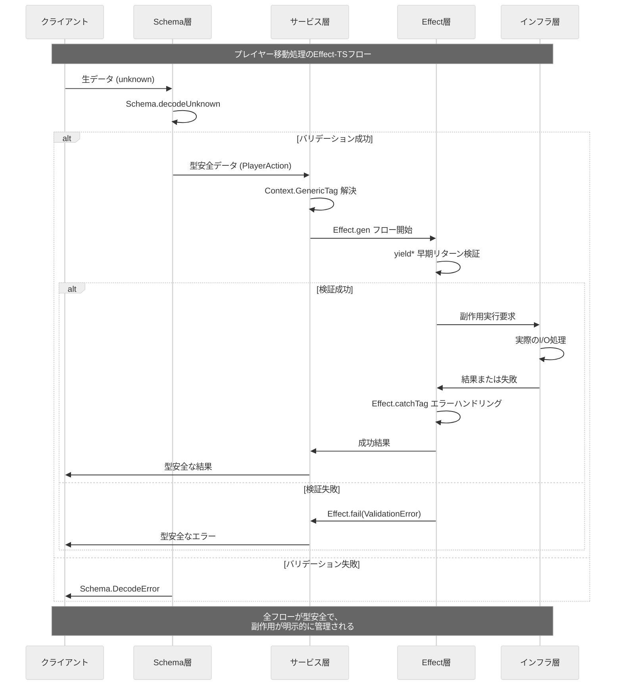

# Effect-TS 利用パターン

## 🧭 ナビゲーション

> **📍 現在位置**: [ホーム](../README.md) → [アーキテクチャ](./README.md) → **Effect-TSパターン**
>
> **🎯 学習目標**: Effect-TS 3.17+の最新パターン完全理解
>
> **⏱️ 所要時間**: 45分（実践的理解）
>
> **📚 前提知識**: [基本アーキテクチャ](./00-overall-design.md) → [設計原則](./01-design-principles.md)

### 📋 関連ドキュメント
- **前のステップ**: [ECS統合](./05-ecs-integration.md) - アーキテクチャ基盤理解
- **次のステップ**: [開発規約](../03-guides/00-development-conventions.md) - 実装ガイドライン
- **実践的応用**: [実装例](../06-examples/README.md) - 具体的コード例

---

TypeScript Minecraftプロジェクトでは、**Effect-TS 3.17+** を全面的に採用し、型安全で合成可能な純粋関数型プログラミングを実践しています。この文書では、プロジェクト全体で遵守すべきEffect-TSの最新パターンを解説します。

## 1. 基本思想: すべてはEffect

あらゆる副作用（ファイルI/O、ネットワーク、DOM操作、乱数生成、現在時刻の取得など）は `Effect` 型でカプセル化します。これにより、副作用を型シグネチャレベルで明示し、プログラムの予測可能性とテスト容易性を高めます。

### 1.1 Effect-TSアーキテクチャ概観

以下の図は、Effect-TS 3.17+パターンによる純粋関数型プログラミングアーキテクチャを示しています。

```mermaid
%%{init: {"theme": "neutral", "themeVariables": {"primaryColor": "#4285f4", "primaryTextColor": "#ffffff", "primaryBorderColor": "#ffffff", "lineColor": "#4285f4", "sectionBkgColor": "#f5f7fa", "tertiaryColor": "#f5f7fa"}}}%%
graph TB
    subgraph EffectCore ["Effect コア抽象化"]
        subgraph DataLayer ["データ層 - Schema駆動"]
            SchemaStruct["Schema.Struct<br/>📋 データ定義<br/>型安全・バリデーション"]
            BrandTypes["Brand Types<br/>🏷️ 型安全性強化<br/>PlayerId, EntityId"]
            ValidationLayer["Validation Layer<br/>✅ 実行時検証<br/>decode・encode"]
        end

        subgraph EffectLayer ["Effect管理層"]
            EffectGen["Effect.gen<br/>🔄 合成パターン<br/>yield* + 線形フロー"]
            ErrorHandling["Error Handling<br/>❌ 型安全エラー<br/>catchTag・fail"]
            ResourceMgmt["Resource Management<br/>🔧 リソース管理<br/>acquire・release"]
        end

        subgraph ServiceLayer ["サービス層"]
            ContextTag["Context.Tag<br/>🏢 サービス定義<br/>class extends Context.Tag"]
            LayerSystem["Layer System<br/>🧱 依存性注入<br/>Layer.effect・provide"]
            ServiceComposition["Service Composition<br/>🔗 合成・組み立て<br/>pipe・compose"]
        end
    end

    subgraph PatternLayer ["パターン適用層"]
        subgraph MatchingLayer ["パターンマッチング"]
            MatchValue["Match.value<br/>🎯 安全なマッチング<br/>網羅性チェック"]
            TaggedUnions["Tagged Unions<br/>📝 判別可能合併型<br/>_tag ベース"]
        end

        subgraph FunctionalLayer ["関数型パターン"]
            PureFunctions["Pure Functions<br/>🧮 純粋関数<br/>副作用分離"]
            ImmutableData["Immutable Data<br/>📚 不変データ<br/>ReadonlyArray・HashMap"]
            EarlyReturn["Early Return<br/>⚡ 早期リターン<br/>ガード節・フェイルファスト"]
        end
    end

    SchemaStruct --> ValidationLayer
    ValidationLayer --> BrandTypes
    BrandTypes --> EffectGen

    EffectGen --> ErrorHandling
    ErrorHandling --> ResourceMgmt
    ResourceMgmt --> ContextTag

    ContextTag --> LayerSystem
    LayerSystem --> ServiceComposition

    ServiceComposition --> MatchValue
    MatchValue --> TaggedUnions
    TaggedUnions --> PureFunctions

    PureFunctions --> ImmutableData
    ImmutableData --> EarlyReturn

    classDef dataStyle fill:#e3f2fd,stroke:#1976d2,stroke-width:2px,color:#0d47a1
    classDef effectStyle fill:#e8f5e8,stroke:#388e3c,stroke-width:2px,color:#1b5e20
    classDef serviceStyle fill:#fff3e0,stroke:#f57c00,stroke-width:2px,color:#e65100
    classDef patternStyle fill:#f3e5f5,stroke:#7b1fa2,stroke-width:2px,color:#4a148c
    classDef functionalStyle fill:#fce4ec,stroke:#c2185b,stroke-width:2px,color:#880e4f

    class SchemaStruct,BrandTypes,ValidationLayer dataStyle
    class EffectGen,ErrorHandling,ResourceMgmt effectStyle
    class ContextTag,LayerSystem,ServiceComposition serviceStyle
    class MatchValue,TaggedUnions patternStyle
    class PureFunctions,ImmutableData,EarlyReturn functionalStyle
```



### 1.2 Effect-TSデータフロー

以下は、典型的なEffect-TSアプリケーションにおけるデータの流れを示しています。すべての副作用がEffect型で管理され、型安全な合成が実現されています。



```typescript
import { Effect, Schema, Context, Layer, Stream, Hub, Queue, STM, TRef, Scope } from "effect";

// Effect<SuccessType, ErrorType, RequirementType>
type AppEffect<A, E = never> = Effect.Effect<A, E, AppServices>;

// ✅ Schema.Structによる高度なデータ定義（classは使用禁止）
const Position = Schema.Struct({
  x: Schema.Number.pipe(
    Schema.int(),
    Schema.greaterThanOrEqualTo(-30_000_000),
    Schema.lessThanOrEqualTo(30_000_000),
    Schema.brand("WorldX")
  ),
  y: Schema.Number.pipe(
    Schema.int(),
    Schema.greaterThanOrEqualTo(-64),
    Schema.lessThanOrEqualTo(320),
    Schema.brand("WorldY")
  ),
  z: Schema.Number.pipe(
    Schema.int(),
    Schema.greaterThanOrEqualTo(-30_000_000),
    Schema.lessThanOrEqualTo(30_000_000),
    Schema.brand("WorldZ")
  )
}).pipe(
  Schema.annotations({
    identifier: "Position",
    title: "3D座標",
    description: "ワールド内の3次元座標を表す（Minecraft座標系準拠）"
  })
);
type Position = Schema.Schema.Type<typeof Position>;

// ✅ 最新パターン: Context.Tag による型安全なサービス定義
class CoreServices extends Context.Tag("CoreServices")<CoreServices, {
  readonly worldService: WorldService,
  readonly playerService: PlayerService,
  readonly chunkService: ChunkService,
  readonly eventHub: Hub.Hub<GameEvent>,
  readonly commandQueue: Queue.Queue<GameCommand>,
  readonly metricsRef: TRef.TRef<SystemMetrics>
}> {}

// ✅ リアクティブイベントシステム
const GameEvent = Schema.Union(
  Schema.Struct({
    _tag: Schema.Literal("PlayerJoined"),
    playerId: Schema.String.pipe(Schema.brand("PlayerId")),
    position: Position,
    timestamp: Schema.Number.pipe(Schema.brand("Timestamp"))
  }),
  Schema.Struct({
    _tag: Schema.Literal("BlockChanged"),
    position: Position,
    oldBlock: Schema.String.pipe(Schema.brand("BlockId")),
    newBlock: Schema.String.pipe(Schema.brand("BlockId")),
    playerId: Schema.optional(Schema.String.pipe(Schema.brand("PlayerId")))
  }),
  Schema.Struct({
    _tag: Schema.Literal("ChunkLoaded"),
    chunkId: Schema.String.pipe(Schema.brand("ChunkId")),
    loadTime: Schema.Number.pipe(Schema.brand("Duration"))
  })
);
type GameEvent = Schema.Schema.Type<typeof GameEvent>;

// ✅ システムメトリクス定義
const SystemMetrics = Schema.Struct({
  playersOnline: Schema.Number.pipe(Schema.nonNegative()),
  chunksLoaded: Schema.Number.pipe(Schema.nonNegative()),
  blocksPerSecond: Schema.Number.pipe(Schema.nonNegative()),
  averageTickTime: Schema.Number.pipe(Schema.nonNegative()),
  memoryUsage: Schema.Number.pipe(Schema.nonNegative()),
  networkBytesPerSecond: Schema.Number.pipe(Schema.nonNegative())
});
type SystemMetrics = Schema.Schema.Type<typeof SystemMetrics>;
```

## 2. 主要な利用パターン

### 2.1. `Effect.gen` + `yield*` による合成（最新推奨）

**Effect-TS 3.17+ 最新パターン**: `Effect.gen` と `yield*` を使用した線形な処理フローが推奨されます。これにより、非同期処理を同期的に記述でき、可読性が向上します。

```typescript
import { Effect, Schema, Context, Stream, Hub, Queue, Match, Schedule, Duration, STM } from "effect";

// ✅ 最新パターン（Stream + Hub + Queue統合による高度なリアクティブ処理）
const createReactiveGameSystem = Effect.gen(function* () {
  // ✅ 高性能イベントハブとコマンドキューの構築
  const eventHub = yield* Hub.bounded<GameEvent>(1000);
  const commandQueue = yield* Queue.bounded<GameCommand>(500);
  const metricsRef = yield* TRef.make<SystemMetrics>({
    playersOnline: 0,
    chunksLoaded: 0,
    blocksPerSecond: 0,
    averageTickTime: 16.67,
    memoryUsage: 0,
    networkBytesPerSecond: 0
  });

  // ✅ イベント処理ストリーム（バックプレッシャー対応）
  const eventProcessingStream = Stream.fromHub(eventHub).pipe(
    Stream.buffer({ capacity: 100, strategy: "dropping" }),
    Stream.groupedWithin(50, Duration.millis(16)), // 60 FPS同期
    Stream.mapEffect(events =>
      Effect.gen(function* () {
        // ✅ Match.valueによる早期リターン - 型安全で拡張可能
        yield* Match.value(events.length).pipe(
          Match.when(0, () => Effect.void), // 空配列の場合は何もしない
          Match.orElse(() => Effect.gen(function* () {
            // ✅ イベントタイプ別並列処理
            const grouped = groupEventsByType(events);

            yield* Effect.all([
              processPlayerEvents(grouped.playerEvents),
              processBlockEvents(grouped.blockEvents),
              processChunkEvents(grouped.chunkEvents)
            ], { concurrency: 3 });

            // ✅ STMによるメトリクス更新
            yield* STM.gen(function* () {
              const currentMetrics = yield* STM.get(metricsRef);
              yield* STM.set(metricsRef, {
                ...currentMetrics,
                blocksPerSecond: grouped.blockEvents.length / 0.016,
                lastProcessedEvents: events.length,
                timestamp: Date.now()
              } as SystemMetrics);
            }).pipe(STM.commit);
          }))
        );

        // この部分は既に上の変換に含まれているため削除
      })
    )
  );

  return { eventHub, commandQueue, metricsRef, eventProcessingStream };
});

// ✅ 早期リターンパターンとStream統合 - Match.valueによる型安全な条件分岐
const processWorldUpdate = (worldState: WorldState): Effect.Effect<WorldState, WorldError> =>
  Effect.gen(function* () {
    // ✅ Match.valueによる早期リターン - 従来のif文より型安全で拡張可能
    return yield* Match.value(worldState.pendingUpdates.length).pipe(
      Match.when(0, () => Effect.succeed(worldState)), // 空の更新の場合はそのまま返す
      Match.orElse((updateCount) => Effect.gen(function* () {
        yield* Effect.log(`${updateCount}個のワールド更新を処理中`)

        const coreServices = yield* CoreServices;

    // ✅ ストリーミング処理でメモリ効率最適化
    const processedUpdates = yield* Stream.fromIterable(worldState.pendingUpdates).pipe(
      Stream.filter(update => isValidUpdate(update)),
      Stream.mapEffect(update =>
        Match.value(update).pipe(
          Match.tag("BlockUpdate", ({ position, blockId }) =>
            Effect.gen(function* () {
              yield* coreServices.worldService.setBlock(position, blockId);
              yield* Hub.publish(coreServices.eventHub, {
                _tag: "BlockChanged" as const,
                position,
                oldBlock: worldState.getBlock(position),
                newBlock: blockId
              });
              return update;
            })
          ),
          Match.tag("PlayerUpdate", ({ playerId, position }) =>
            Effect.gen(function* () {
              yield* coreServices.playerService.updatePosition(playerId, position);
              return update;
            })
          ),
          Match.exhaustive
        ).pipe(
          Effect.catchAll(error =>
            Effect.gen(function* () {
              yield* Effect.logError(`更新処理失敗: ${error}`);
              return update; // 失敗したアップデートも返す（ログ出力済み）
            })
          )
        )
      ),
      Stream.buffer({ capacity: 200 }),
      Stream.runCollect
    );

    return {
      ...worldState,
      pendingUpdates: [],
      lastUpdate: Date.now(),
      processedUpdates: processedUpdates.length
    };
  });

// ✅ 高度な並列処理とResource管理
const createManagedWorldSession = Effect.scoped(
  Effect.gen(function* () {
    // ✅ Scopedリソース管理
    const worldResource = yield* Effect.acquireRelease(
      Effect.gen(function* () {
        yield* Effect.log("ワールドリソースを初期化中");
        const world = yield* createWorld();
        const systems = yield* initializeGameSystems();
        return { world, systems };
      }),
      ({ world, systems }) =>
        Effect.gen(function* () {
          yield* Effect.log("ワールドセッションを終了中");
          yield* saveWorldState(world);
          yield* shutdownGameSystems(systems);
        })
    );

    // ✅ 並列システム起動
    const { eventHub, commandQueue, metricsRef } = yield* createReactiveGameSystem();

    // ✅ 複数ストリームの並列処理
    const gameLoopFiber = yield* Effect.fork(
      Stream.fromSchedule(Schedule.fixed(Duration.millis(50))).pipe( // 20 TPS
        Stream.zipWithIndex,
        Stream.mapEffect(([_, tick]) =>
          Effect.gen(function* () {
            const startTime = yield* Effect.sync(() => performance.now());

            // ✅ コマンド処理
            const commands = yield* Queue.takeAll(commandQueue);
            yield* processGameCommands(commands);

            // ✅ ワールド更新
            const worldState = yield* getWorldState();
            yield* processWorldUpdate(worldState);

            const deltaTime = yield* Effect.sync(() => performance.now() - startTime);

            // ✅ パフォーマンスメトリクス
            yield* STM.update(metricsRef, metrics => ({
              ...metrics,
              averageTickTime: (metrics.averageTickTime * 0.9) + (deltaTime * 0.1),
              totalTicks: tick
            })).pipe(STM.commit);

            if (deltaTime > 25) { // 25ms以上は警告
              yield* Effect.logWarning(`長時間tick: ${deltaTime.toFixed(2)}ms`);
            }
          })
        ),
        Stream.runDrain
      )
    );

    return {
      worldResource,
      eventHub,
      commandQueue,
      metricsRef,
      gameLoopFiber
    };
  })
);

// ✅ 高性能バッチ処理パターン
const processBatchedChunkLoading = (chunkIds: ReadonlyArray<string>): Effect.Effect<ReadonlyArray<Chunk>, ChunkError> =>
  Effect.gen(function* () {
    // ✅ 早期リターン: 空の要求
    if (chunkIds.length === 0) {
      return [];
    }

    const coreServices = yield* CoreServices;

    // ✅ ストリームによる最適化されたバッチ処理
    const chunks = yield* Stream.fromIterable(chunkIds).pipe(
      Stream.buffer({ capacity: 32 }),
      Stream.mapEffect(chunkId =>
        coreServices.chunkService.loadChunk(chunkId).pipe(
          Effect.timeout(Duration.seconds(5)),
          Effect.retry(Schedule.exponential(Duration.millis(100)).pipe(
            Schedule.compose(Schedule.recurs(3))
          )),
          Effect.tap(chunk =>
            Hub.publish(coreServices.eventHub, {
              _tag: "ChunkLoaded" as const,
              chunkId,
              loadTime: chunk.loadTime
            })
          ),
          Effect.catchAll(error =>
            Effect.gen(function* () {
              yield* Effect.logError(`チャンクロード失敗: ${chunkId} - ${error}`);
              return createEmptyChunk(chunkId);
            })
          )
        )
      ),
      Stream.runCollect
    );

    yield* Effect.log(`${chunks.length}個のチャンクを正常にロードしました`);
    return chunks;
  });
```

### 2.2. `Schema` によるデータ定義とバリデーション

`class` や `interface` の代わりに `Schema.Struct` を用いて、すべてのデータ構造を定義します。これにより、型定義と実行時バリデーションを同時に実現します。

```typescript
import { Schema, Brand } from "effect";

// ✅ 最新パターン: 包括的Schema定義とバリデーション
const Position = Schema.Struct({
  x: Schema.Number.pipe(
    Schema.int(),
    Schema.greaterThanOrEqualTo(-30_000_000),
    Schema.lessThanOrEqualTo(30_000_000)
  ),
  y: Schema.Number.pipe(
    Schema.int(),
    Schema.greaterThanOrEqualTo(-64),
    Schema.lessThanOrEqualTo(320)
  ),
  z: Schema.Number.pipe(
    Schema.int(),
    Schema.greaterThanOrEqualTo(-30_000_000),
    Schema.lessThanOrEqualTo(30_000_000)
  )
}).pipe(
  Schema.annotations({
    identifier: "Position",
    title: "Minecraft座標",
    description: "Minecraftワールドの有効な座標範囲内の3D位置"
  })
);
type Position = Schema.Schema.Type<typeof Position>;

// ✅ Brand型による型安全性の向上
const ChunkId = Schema.String.pipe(
  Schema.pattern(/^chunk_-?\d+_-?\d+$/),
  Schema.brand("ChunkId")
);
type ChunkId = Schema.Schema.Type<typeof ChunkId>;

const EntityId = Schema.String.pipe(
  Schema.uuid(),
  Schema.brand("EntityId")
);
type EntityId = Schema.Schema.Type<typeof EntityId>;

// ✅ 複雑なSchema組み合わせ
const Block = Schema.Struct({
  id: Schema.String.pipe(Schema.brand("BlockId")),
  metadata: Schema.optional(
    Schema.Record({
      key: Schema.String,
      value: Schema.Union(
        Schema.String,
        Schema.Number,
        Schema.Boolean
      )
    })
  ),
  lightLevel: Schema.Number.pipe(
    Schema.int(),
    Schema.greaterThanOrEqualTo(0),
    Schema.lessThanOrEqualTo(15)
  ),
  hardness: Schema.Number.pipe(Schema.nonNegative())
}).pipe(
  Schema.annotations({
    identifier: "Block",
    title: "ブロック",
    description: "Minecraftワールドのブロック定義"
  })
);
type Block = Schema.Schema.Type<typeof Block>;

// ✅ Union型とパターンマッチング連携
const Direction = Schema.Literal("north", "south", "east", "west", "up", "down");
type Direction = Schema.Schema.Type<typeof Direction>;

// ✅ 実行時バリデーション関数
const validatePosition = (input: unknown): Effect.Effect<Position, Schema.ParseError> =>
  Schema.decodeUnknown(Position)(input);

const encodePosition = (position: Position): unknown =>
  Schema.encodeSync(Position)(position);

// ✅ カスタムSchema変換
const Vector3 = Schema.transform(
  Schema.Struct({
    x: Schema.Number,
    y: Schema.Number,
    z: Schema.Number
  }),
  Position,
  {
    decode: ({ x, y, z }) => ({ x: Math.round(x), y: Math.round(y), z: Math.round(z) }),
    encode: (position) => position
  }
).pipe(
  Schema.annotations({
    identifier: "Vector3",
    title: "Vector3からPositionへの変換"
  })
);
```

### 2.3. `Context.Tag` によるサービス定義（最新パターン）

**Effect-TS 3.17+ 最新パターン**: サービス（依存関係）は `Context.Tag` を用いて定義します。`ServiceName` という命名規則を遵守し、プロジェクト内での一貫性を保ちます。

```typescript
import { Context, Effect, Schema } from "effect";

// ✅ 最新パターン（Context.Tag）
class WorldService extends Context.Tag("WorldService")<WorldService, {
  readonly getBlock: (pos: Position) => Effect.Effect<Block, BlockNotFoundError>;
  readonly setBlock: (pos: Position, block: Block) => Effect.Effect<void, BlockSetError>;
  readonly getChunk: (chunkId: ChunkId) => Effect.Effect<Chunk, ChunkNotFoundError>;
  readonly isValidPosition: (pos: Position) => Effect.Effect<boolean, never>;
}> {}

// ✅ エラー型の定義（Schema.TaggedError使用）
class BlockNotFoundError extends Schema.TaggedError<BlockNotFoundError>()(
  "BlockNotFoundError",
  {
    position: Position,
    message: Schema.String
  }
) {}

class BlockSetError extends Schema.TaggedError<BlockSetError>()(
  "BlockSetError",
  {
    position: Position,
    reason: Schema.String
  }
) {}
```

### 2.4. `Layer` による依存性注入

サービスの具体的な実装は `Layer` を用いて提供します。これにより、実装とインターフェースが分離され、テスト時にはモック実装に容易に差し替えられます。

```typescript
import { Layer, Effect, Context, Resource, ManagedRuntime, Stream, Hub, Queue, STM, TRef, Scope } from "effect";

// ✅ 最新パターン: 高度なレイヤードアーキテクチャとリアクティブシステム
const makeWorldServiceLive = Effect.gen(function* () {
  // ✅ 依存サービスの取得と型安全性
  const chunkService = yield* ChunkService;
  const blockService = yield* BlockService;
  const logger = yield* Logger;
  const metrics = yield* Metrics;
  const eventHub = yield* EventHub; // ✅ イベントハブの統合

  // ✅ リソース取得と初期化（Scopedリソース管理）
  const worldConfig = yield* loadWorldConfig();
  const worldBounds = yield* loadWorldBounds();

  // ✅ STMによるWorldState管理
  const worldStateRef = yield* TRef.make<WorldState>({
    loadedChunks: new Map(),
    activeUpdates: [],
    blockCache: new Map(),
    lastUpdate: Date.now()
  });

  // ✅ ヘルスチェック（改良版）
  yield* logger.info("WorldServiceを初期化中");
  yield* metrics.incrementCounter("world_service_initializations");

  // ✅ リアクティブなブロック変更通知システム
  const blockChangeStream = Stream.fromHub(eventHub).pipe(
    Stream.filter(event => event._tag === "BlockChanged"),
    Stream.buffer({ capacity: 500, strategy: "dropping" }),
    Stream.mapEffect(event =>
      Effect.gen(function* () {
        // ✅ 隣接チャンクのライト更新
        yield* updateLightingInAdjacentChunks(event.position);
        // ✅ クライアントへの変更通知
        yield* notifyClientsOfBlockChange(event);
      })
    )
  );

  // ✅ バックグラウンドでブロック変更処理
  yield* Effect.fork(blockChangeStream.pipe(Stream.runDrain));

  // ✅ より堅牢なバリデーション関数（STM統合）
  const validatePosition = (pos: Position): Effect.Effect<boolean, never> =>
    STM.gen(function* () {
      const state = yield* STM.get(worldStateRef);
      return isPositionInBounds(pos, worldBounds) &&
             !state.activeUpdates.some(update => positionsEqual(update.position, pos));
    }).pipe(STM.commit);

  return WorldService.of({
    // ✅ 高性能ブロック取得（キャッシュ統合）
    getBlock: (pos) =>
      Effect.gen(function* () {
        // ✅ 早期リターン: バリデーション
        const isValid = yield* validatePosition(pos);
        if (!isValid) {
          return yield* Effect.fail({
            _tag: "BlockNotFoundError" as const,
            position: pos,
            message: `座標 ${pos.x},${pos.y},${pos.z} は無効です`,
            bounds: worldBounds
          });
        }

        // ✅ STMキャッシュ確認
        const cachedBlock = yield* STM.gen(function* () {
          const state = yield* STM.get(worldStateRef);
          return state.blockCache.get(positionToKey(pos));
        }).pipe(STM.commit);

        if (cachedBlock) {
          yield* metrics.incrementCounter("block_cache_hits");
          return cachedBlock;
        }

        // ✅ メトリクス収集
        yield* metrics.incrementCounter("block_get_requests");

        // ✅ 並列データ取得（改良版）
        const chunk = yield* chunkService.getChunkForPosition(pos).pipe(
          Effect.timeout(Duration.seconds(2)),
          Effect.retry(Schedule.exponential(Duration.millis(100)).pipe(
            Schedule.compose(Schedule.recurs(3))
          ))
        );

        const block = yield* blockService.getBlockFromChunk(chunk, pos);

        // ✅ STMキャッシュ更新
        yield* STM.update(worldStateRef, state => ({
          ...state,
          blockCache: new Map(state.blockCache).set(positionToKey(pos), block)
        })).pipe(STM.commit);

        yield* logger.debug(`ブロック取得: ${pos.x},${pos.y},${pos.z} = ${block.id}`);
        return block;
      }),

    // ✅ アトミックブロック設置（STM統合）
    setBlock: (pos, block) =>
      Effect.gen(function* () {
        // ✅ STMアトミック更新
        yield* STM.gen(function* () {
          const state = yield* STM.get(worldStateRef);

          // 同時更新チェック
          if (state.activeUpdates.some(update => positionsEqual(update.position, pos))) {
            yield* STM.retry; // 他の更新が完了するまで待機
          }

          // 更新開始をマーク
          yield* STM.set(worldStateRef, {
            ...state,
            activeUpdates: [...state.activeUpdates, { position: pos, startTime: Date.now() }]
          });
        }).pipe(STM.commit);

        try {
          // ✅ 実際のブロック設置
          yield* blockService.setBlock(pos, block);

          // ✅ イベント発行
          yield* Hub.publish(eventHub, {
            _tag: "BlockChanged" as const,
            position: pos,
            oldBlock: yield* getBlock(pos).pipe(Effect.orElse(() => Effect.succeed(null))),
            newBlock: block.id
          });

          yield* metrics.incrementCounter("block_set_operations");
          yield* logger.info(`ブロック設置成功: ${pos.x},${pos.y},${pos.z} = ${block.id}`);

        } finally {
          // ✅ 更新完了のマーク（必ず実行）
          yield* STM.update(worldStateRef, state => ({
            ...state,
            activeUpdates: state.activeUpdates.filter(update =>
              !positionsEqual(update.position, pos)
            ),
            blockCache: new Map(state.blockCache).set(positionToKey(pos), block)
          })).pipe(STM.commit);
        }
      }),

    // ✅ 高性能チャンク取得
    getChunk: (chunkId) =>
      Effect.gen(function* () {
        // ✅ STMチャンクキャッシュ確認
        const cachedChunk = yield* STM.gen(function* () {
          const state = yield* STM.get(worldStateRef);
          return state.loadedChunks.get(chunkId);
        }).pipe(STM.commit);

        if (cachedChunk) {
          yield* metrics.incrementCounter("chunk_cache_hits");
          return cachedChunk;
        }

        const chunk = yield* chunkService.getChunk(chunkId).pipe(
          Effect.tap(() => metrics.incrementCounter("chunk_requests")),
          Effect.timeout(Duration.seconds(5))
        );

        // ✅ チャンクキャッシュ更新
        yield* STM.update(worldStateRef, state => ({
          ...state,
          loadedChunks: new Map(state.loadedChunks).set(chunkId, chunk)
        })).pipe(STM.commit);

        return chunk;
      }),

    isValidPosition: validatePosition,

    // ✅ ストリームベースバッチ処理
    getBlocks: (positions) =>
      Effect.gen(function* () {
        // ✅ 早期リターン: 空の配列
        if (positions.length === 0) {
          return [];
        }

        yield* metrics.incrementCounter("batch_block_requests");

        // ✅ ストリーミングバッチ処理
        const blocks = yield* Stream.fromIterable(positions).pipe(
          Stream.buffer({ capacity: 64 }),
          Stream.mapEffect(pos => getBlock(pos).pipe(
            Effect.catchAll(error =>
              Effect.gen(function* () {
                yield* logger.warn(`ブロック取得失敗: ${pos.x},${pos.y},${pos.z} - ${error}`);
                return createAirBlock(pos); // デフォルトで空気ブロック
              })
            )
          )),
          Stream.runCollect
        );

        return blocks;
      }),

    // ✅ 新機能: ワールド統計取得
    getWorldStats: () =>
      STM.gen(function* () {
        const state = yield* STM.get(worldStateRef);
        const currentMetrics = yield* STM.get(metricsRef);

        return {
          loadedChunks: state.loadedChunks.size,
          cachedBlocks: state.blockCache.size,
          activeUpdates: state.activeUpdates.length,
          totalBlocks: currentMetrics.blocksPerSecond * 60, // 1分あたり
          memoryUsage: currentMetrics.memoryUsage,
          uptime: Date.now() - state.lastUpdate
        };
      }).pipe(STM.commit),

    // ✅ 新機能: リアクティブヘルスチェック
    healthCheck: () =>
      Effect.gen(function* () {
        const stats = yield* getWorldStats();
        const isHealthy = stats.activeUpdates < 100 &&
                         stats.memoryUsage < 1000000000; // 1GB未満

        return {
          status: isHealthy ? "healthy" : "degraded",
          stats,
          timestamp: Date.now()
        };
      })
  });
});

// ✅ 高度なLayer構成（環境別設定と依存関係管理）
const createWorldServiceLayer = (environment: "dev" | "prod" | "test") => {
  const baseLayer = Layer.effect(WorldService, makeWorldServiceLive);

  const dependencyLayer = Layer.mergeAll(
    ChunkServiceLive,
    BlockServiceLive,
    LoggerLive,
    MetricsLive,
    EventHubLive,
    STMRuntimeLive
  );

  const configLayer = Match.value(environment).pipe(
    Match.tag("dev", () => Layer.succeed(WorldConfig, {
      maxLoadedChunks: 1000,
      blockCacheSize: 10000,
      enableDebugLogging: true,
      lightingUpdateInterval: Duration.millis(50)
    })),
    Match.tag("prod", () => Layer.succeed(WorldConfig, {
      maxLoadedChunks: 5000,
      blockCacheSize: 100000,
      enableDebugLogging: false,
      lightingUpdateInterval: Duration.millis(100)
    })),
    Match.tag("test", () => Layer.succeed(WorldConfig, {
      maxLoadedChunks: 10,
      blockCacheSize: 100,
      enableDebugLogging: true,
      lightingUpdateInterval: Duration.millis(10)
    })),
    Match.exhaustive
  );

  return baseLayer.pipe(
    Layer.provide(dependencyLayer),
    Layer.provide(configLayer)
  );
};

// ✅ 環境別Layer設定（改良版）
export const WorldServiceDev = createWorldServiceLayer("dev");
export const WorldServiceProd = createWorldServiceLayer("prod");
export const WorldServiceTest = createWorldServiceLayer("test");

// ✅ ManagedRuntimeによる統合アプリケーション管理
export const createWorldRuntime = (environment: "dev" | "prod" | "test" = "dev") => {
  const worldLayer = Match.value(environment).pipe(
    Match.tag("dev", () => WorldServiceDev),
    Match.tag("prod", () => WorldServiceProd),
    Match.tag("test", () => WorldServiceTest),
    Match.exhaustive
  );

  // ✅ 統合アプリケーションLayer
  const appLayer = Layer.mergeAll(
    worldLayer,
    NetworkServiceLive,
    DatabaseLive,
    FileSystemLive
  ).pipe(
    Layer.catchAll(error =>
      Layer.fail(new ApplicationError({
        message: `アプリケーション初期化失敗: ${error}`,
        environment,
        timestamp: Date.now()
      }))
    )
  );

  return ManagedRuntime.make(appLayer);
};

// ✅ 高度なテスト統合Layer
export const createTestEnvironment = () => {
  const mockServices = Layer.mergeAll(
    Layer.succeed(WorldService, createMockWorldService()),
    Layer.succeed(EventHub, Hub.unbounded<GameEvent>()),
    Layer.succeed(Logger, createTestLogger()),
    Layer.succeed(Metrics, createTestMetrics())
  );

  return ManagedRuntime.make(mockServices);
};
```

### 2.5. `Match.value` によるパターンマッチング

**Effect-TS 最新パターン**: `Match.value` を使用してタグ付きユニオンの網羅的なパターンマッチングを行います。`Match.tag` や `Match.tagStartsWith` と組み合わせて使用します。

```typescript
import { Match, Effect } from "effect";

// Schema.Structでタグ付きユニオンを定義
const MoveAction = Schema.Struct({
  _tag: Schema.Literal("Move"),
  direction: Direction,
  playerId: PlayerId
});

const AttackAction = Schema.Struct({
  _tag: Schema.Literal("Attack"),
  targetId: EntityId,
  damage: Schema.Number.pipe(Schema.positive())
});

const UseItemAction = Schema.Struct({
  _tag: Schema.Literal("UseItem"),
  itemId: ItemId,
  playerId: PlayerId
});

const GameAction = Schema.Union(MoveAction, AttackAction, UseItemAction);
type GameAction = Schema.Schema.Type<typeof GameAction>;

// ✅ 最新パターン（Match.value + Match.tag）
const handleAction = (action: GameAction): Effect.Effect<ActionResult, ActionError> =>
  Match.value(action).pipe(
    Match.tag("Move", ({ direction, playerId }) =>
      handleMove(playerId, direction)
    ),
    Match.tag("Attack", ({ targetId, damage }) =>
      handleAttack(targetId, damage)
    ),
    Match.tag("UseItem", ({ itemId, playerId }) =>
      handleItemUse(playerId, itemId)
    ),
    Match.exhaustive
  );

// ✅ 条件付きマッチング（最新パターン）
const processPlayerAction = (playerId: PlayerId, action: GameAction): Effect.Effect<void, ActionError> =>
  Match.value(action).pipe(
    Match.when(
      (action): action is Extract<GameAction, { _tag: "Move" }> => action._tag === "Move",
      ({ direction }) => executeMove(playerId, direction)
    ),
    Match.when(
      (action): action is Extract<GameAction, { _tag: "Attack" }> => action._tag === "Attack",
      ({ targetId, damage }) => executeAttack(playerId, targetId, damage)
    ),
    Match.orElse(() => Effect.fail({
      _tag: "InvalidActionError" as const,
      action,
      message: "アクションは許可されていません"
    }))
  );

// ✅ タグの部分マッチング
const isPlayerAction = (action: GameAction): boolean =>
  Match.value(action).pipe(
    Match.tagStartsWith("Move", () => true),
    Match.tagStartsWith("UseItem", () => true),
    Match.orElse(() => false)
  );
```

### 2.6. タグ付きエラー (`Tagged Errors`)

エラーは `Schema.Struct` を用いてタグ付きユニオン型として定義します。これにより、`Effect.catchTag` を使った型安全なエラーハンドリングが可能になります。

```typescript
import { Schema } from "effect";

// ✅ Schema ベースのエラー定義（改善版）
const NetworkError = Schema.Struct({
  _tag: Schema.Literal("NetworkError"),
  message: Schema.String.pipe(Schema.nonEmpty()),
  code: Schema.Number.pipe(Schema.int(), Schema.nonNegative()),
  timestamp: Schema.Number.pipe(Schema.brand("Timestamp")),
  retryCount: Schema.optional(Schema.Number.pipe(Schema.nonNegative()))
})
type NetworkError = Schema.Schema.Type<typeof NetworkError>

// ✅ エラーファクトリー関数
const createNetworkError = (
  message: string,
  code: number,
  retryCount?: number
): NetworkError => ({
  _tag: "NetworkError",
  message,
  code,
  timestamp: Date.now() as any,
  retryCount
})

const ValidationError = Schema.Struct({
  _tag: Schema.Literal("ValidationError"),
  field: Schema.String.pipe(Schema.nonEmpty()),
  value: Schema.Unknown,
  constraints: Schema.Array(Schema.String)
})
type ValidationError = Schema.Schema.Type<typeof ValidationError>

type AppError = NetworkError | ValidationError

const operation = Effect.succeed("data").pipe(
  Effect.catchTag("NetworkError", (e) => Effect.log(`ネットワークエラー: ${e.message}`)),
  Effect.catchTag("ValidationError", (e) => Effect.log(`バリデーションエラー: ${e.field}`))
);
```

### 2.7. 不変データ構造

すべてのデータ構造は不変 (immutable) として扱います。状態を変更する場合は、常に新しいインスタンスを作成します。`HashMap`, `HashSet`, `List` などの永続データ構造を積極的に利用します。

```typescript
import { HashMap } from "effect";

const addItem = (inventory: HashMap.HashMap<string, number>, item: string, count: number) =>
  HashMap.set(inventory, item, (HashMap.get(inventory, item).pipe(Option.getOrElse(() => 0)) + count));
```

### 2.8. 純粋関数の分離と早期リターンパターン

**2024年最新パターン**: 副作用と純粋関数を明確に分離し、早期リターンパターンを活用してネストを浅く保ちます。

```typescript
// ✅ 純粋関数として分離
const calculateDistance = (from: Position, to: Position): number =>
  Math.sqrt(
    Math.pow(to.x - from.x, 2) +
    Math.pow(to.y - from.y, 2) +
    Math.pow(to.z - from.z, 2)
  )

const isValidPosition = (position: Position, worldBounds: WorldBounds): boolean =>
  position.x >= worldBounds.min.x && position.x <= worldBounds.max.x &&
  position.y >= worldBounds.min.y && position.y <= worldBounds.max.y &&
  position.z >= worldBounds.min.z && position.z <= worldBounds.max.z

// ✅ 早期リターンによるネスト削減（改善版）
const MAX_MOVE_DISTANCE = 100 // 定数定義

// MoveError定義
const MoveError = Schema.Union(
  Schema.Struct({
    _tag: Schema.Literal("PlayerCannotMoveError"),
    playerId: Schema.String,
    reason: Schema.String
  }),
  Schema.Struct({
    _tag: Schema.Literal("MoveDistanceTooFarError"),
    playerId: Schema.String,
    attemptedDistance: Schema.Number,
    maxDistance: Schema.Number
  }),
  Schema.Struct({
    _tag: Schema.Literal("InvalidPositionError"),
    position: Position,
    bounds: Schema.Unknown
  })
)
type MoveError = Schema.Schema.Type<typeof MoveError>

const movePlayer = (playerId: string, targetPosition: Position): Effect.Effect<void, MoveError> =>
  Effect.gen(function* () {
    const player = yield* getPlayer(playerId)

    // 早期リターン: プレイヤーが移動可能でない場合
    if (!player.canMove) {
      return yield* Effect.fail({
        _tag: "PlayerCannotMoveError" as const,
        playerId,
        reason: "プレイヤーは移動できません"
      })
    }

    // 早期リターン: 距離が無効な場合
    const distance = calculateDistance(player.position, targetPosition)
    if (distance > MAX_MOVE_DISTANCE) {
      return yield* Effect.fail({
        _tag: "MoveDistanceTooFarError" as const,
        playerId,
        attemptedDistance: distance,
        maxDistance: MAX_MOVE_DISTANCE
      })
    }

    const bounds = yield* getWorldBounds()

    // 早期リターン: 位置が無効な場合
    if (!isValidPosition(targetPosition, bounds)) {
      return yield* Effect.fail({
        _tag: "InvalidPositionError" as const,
        position: targetPosition,
        bounds
      })
    }

    // メイン処理
    yield* updatePlayerPosition(playerId, targetPosition)
    yield* Effect.log(`プレイヤー ${playerId} が ${targetPosition.x},${targetPosition.y},${targetPosition.z} に移動しました`)
  })

// ✅ ReadonlyArray操作の活用（改善版）
const processEntities = (entities: ReadonlyArray<Entity>): Effect.Effect<ReadonlyArray<ProcessedEntity>, ProcessError> =>
  Effect.gen(function* () {
    // 早期リターン: エンティティが空
    if (entities.length === 0) {
      yield* Effect.log("処理するエンティティがありません")
      return []
    }

    // ✅ 関数型パイプラインでデータ処理
    const activeEntities = ReadonlyArray.filter(entities, entity => entity.active)

    // 早期リターン: アクティブなエンティティがない
    if (activeEntities.length === 0) {
      yield* Effect.log("アクティブなエンティティが見つかりません")
      return []
    }

    yield* Effect.log(`${entities.length}個中${activeEntities.length}個のアクティブなエンティティを処理中`)

    // ✅ バッチ処理でパフォーマンス向上
    const batchSize = 50
    const batches = ReadonlyArray.chunksOf(activeEntities, batchSize)
    const results: ProcessedEntity[] = []

    for (const batch of batches) {
      const batchResults = yield* Effect.all(
        ReadonlyArray.map(batch, entity => processEntity(entity)),
        { concurrency: "unbounded" }
      )
      results.push(...batchResults)
    }

    return results
  })
```

### 2.9. Brand型とSchema検証の活用

```typescript
// ✅ Brand型による型安全性の向上
export const PlayerId = Schema.String.pipe(Schema.brand("PlayerId"))
export type PlayerId = Schema.Schema.Type<typeof PlayerId>

export const Health = Schema.Number.pipe(
  Schema.nonNegative(),
  Schema.lessThanOrEqualTo(100),
  Schema.brand("Health")
)
export type Health = Schema.Schema.Type<typeof Health>

// ✅ 実行時検証と組み合わせ
const validatePlayerData = (input: unknown): Effect.Effect<PlayerData, ValidationError> =>
  Schema.decodeUnknownEither(PlayerData)(input).pipe(
    Effect.mapError(error => new ValidationError({ cause: error }))
  )
```

## 3. アンチパターン（絶対に避けるべきパターン）

### 3.1. クラスベースの設計（使用禁止）
```typescript
// ❌ 絶対に避けるべきパターン - classの使用
// class PlayerManager {
//   constructor(private worldService: WorldService) {}
//
//   async movePlayer(id: string, pos: Position): Promise<void> {
//     // 実装...
//   }
// }

// ❌ Data.Classの使用（古いパターン）
// import { Data } from "effect";
// class Player extends Data.Class<{ id: string; name: string }> {}

// ✅ 正しいEffect-TSパターン
const Player = Schema.Struct({
  id: PlayerId,
  name: Schema.String,
  position: Position,
  health: Health
});
type Player = Schema.Schema.Type<typeof Player>;

interface PlayerServiceInterface {
  readonly movePlayer: (id: PlayerId, pos: Position) => Effect.Effect<void, MoveError>
  readonly getPlayer: (id: PlayerId) => Effect.Effect<Option.Option<Player>, never>
  readonly updatePlayerPosition: (id: PlayerId, position: Position) => Effect.Effect<void, MoveError>
}

class PlayerService extends Context.Tag("PlayerService")<PlayerService, PlayerServiceInterface> {}
```

### 3.2. 古いAPIパターンの使用（避けるべき）
```typescript
// ❌ 避けるべきパターン - Context.GenericTag（古いAPI）
// const OldService = Context.GenericTag<OldServiceInterface>("@app/OldService");

// ❌ Data.TaggedErrorの使用（古いAPI）
// class NetworkError extends Data.TaggedError("NetworkError")<{
//   message: string;
// }> {}

// ❌ Data.Classの使用（古いAPI）
// class Player extends Data.Class<{ id: string; name: string }> {}

// ✅ 正しい最新パターン - Context.GenericTag
interface NewServiceInterface {
  readonly processData: (data: unknown) => Effect.Effect<ProcessedData, ValidationError>
  readonly validateInput: (input: unknown) => Effect.Effect<boolean, never>
}

class NewService extends Context.Tag("NewService")<NewService, NewServiceInterface> {}

// ✅ Schema.TaggedErrorによる最新のエラー定義
export class NetworkError extends Schema.TaggedError("NetworkError")<{
  readonly message: string
  readonly code: number
  readonly timestamp: number
  readonly retryCount?: number
}> {}

// ✅ Schema.Structでデータ定義
const Player = Schema.Struct({
  id: Schema.String.pipe(Schema.brand("PlayerId")),
  name: Schema.String.pipe(Schema.nonEmpty()),
  position: Position,
  health: Health
}).pipe(
  Schema.annotations({
    identifier: "Player",
    description: "プレイヤーエンティティ"
  })
);
type Player = Schema.Schema.Type<typeof Player>;
```

### 3.3. if/else/switchの多用
```typescript
// ❌ 避けるべきパターン - if/else/switch
const processCommand = (command: Command) => {
  if (command.type === "move") {
    return handleMove(command);
  } else if (command.type === "attack") {
    return handleAttack(command);
  } else {
    return handleDefault(command);
  }
};

// ✅ Match.valueを使用（改善版）
const Command = Schema.Union(
  Schema.Struct({ _tag: Schema.Literal("Move"), direction: Vector3, playerId: PlayerId }),
  Schema.Struct({ _tag: Schema.Literal("Attack"), targetId: EntityId, damage: Schema.Number.pipe(Schema.positive()) }),
  Schema.Struct({ _tag: Schema.Literal("UseItem"), itemId: ItemId, targetPosition: Schema.optional(Position) }),
  Schema.Struct({ _tag: Schema.Literal("Chat"), message: Schema.String.pipe(Schema.nonEmpty()) })
)
type Command = Schema.Schema.Type<typeof Command>

const CommandError = Schema.Struct({
  _tag: Schema.Literal("CommandError"),
  command: Command,
  reason: Schema.String
})
type CommandError = Schema.Schema.Type<typeof CommandError>

// ✅ 単一責務のハンドラー関数
const handleMoveCommand = ({ direction, playerId }: { direction: Vector3; playerId: PlayerId }) =>
  Effect.gen(function* () {
    yield* Effect.log(`プレイヤー ${playerId} を移動中`)
    yield* movePlayer(playerId, direction)
  })

const handleAttackCommand = ({ targetId, damage }: { targetId: EntityId; damage: number }) =>
  Effect.gen(function* () {
    yield* Effect.log(`ターゲット ${targetId} に ${damage} ダメージで攻撃中`)
    yield* attackEntity(targetId, damage)
  })

const handleUseItemCommand = ({ itemId, targetPosition }: { itemId: ItemId; targetPosition?: Position }) =>
  Effect.gen(function* () {
    yield* Effect.log(`アイテム ${itemId} を使用中${targetPosition ? ` at ${targetPosition.x},${targetPosition.y},${targetPosition.z}` : ""}`)
    yield* useItem(itemId, targetPosition)
  })

const handleChatCommand = ({ message }: { message: string }) =>
  Effect.gen(function* () {
    yield* Effect.log(`チャット: ${message}`)
    yield* broadcastMessage(message)
  })

// ✅ 改善されたコマンド処理
const processCommand = (command: Command): Effect.Effect<void, CommandError> =>
  Match.value(command).pipe(
    Match.tag("Move", handleMoveCommand),
    Match.tag("Attack", handleAttackCommand),
    Match.tag("UseItem", handleUseItemCommand),
    Match.tag("Chat", handleChatCommand),
    Match.exhaustive
  ).pipe(
    Effect.catchAll(error =>
      Effect.gen(function* () {
        yield* Effect.log(`コマンド処理失敗: ${error}`)
        return yield* Effect.fail({
          _tag: "CommandError" as const,
          command,
          reason: String(error)
        })
      })
    )
  )
```

### 3.4. Match.valueパターンの教育的価値と型安全性の向上

上記のMatch.value変換により実現される重要な改善点：

#### 🎯 **型安全性の向上**
```typescript
// ❌ 従来のif文 - TypeScriptでもランタイムエラーのリスク
if (events.length === 0) return; // 値の比較のみ、型チェック不十分

// ✅ Match.value - 型レベルでの保証
Match.value(events.length).pipe(
  Match.when(0, () => Effect.void), // 型システムが値を保証
  Match.orElse(() => /* 処理 */)    // exhaustiveで網羅性チェック
);
```

#### 🔍 **網羅性チェック (Exhaustiveness)**
```typescript
// ✅ Match.exhaustiveによる型レベルでの網羅性保証
Match.value(command).pipe(
  Match.tag("Move", handleMoveCommand),
  Match.tag("Attack", handleAttackCommand),
  Match.tag("UseItem", handleUseItemCommand),
  Match.tag("Chat", handleChatCommand),
  Match.exhaustive // ← 新しいコマンド追加時にコンパイルエラーで気づける
);
```

#### 📈 **拡張性とメンテナンス性**
- **条件追加**: 新しい分岐をMatch.whenで簡単に追加
- **型安全**: Tagged Unionで新しいケースを追加した際の変更漏れ防止
- **可読性**: 条件とアクションが明確に分離されたパターン
- **合成可能**: 複数のMatch.valueをpipeで組み合わせ可能

#### 🧪 **テスタビリティの向上**
```typescript
// ✅ 各分岐を独立してテスト可能
describe("Match.valueパターン", () => {
  it("空イベント配列の場合、何も処理しない", async () => {
    const result = await Match.value([].length).pipe(
      Match.when(0, () => Effect.succeed("empty")),
      Match.orElse(() => Effect.succeed("non-empty"))
    );
    expect(result).toBe("empty");
  });
});
```

## 4. プロジェクト固有の実装パターン

### 4.1. ECS (Entity Component System) との統合

```typescript
// コンポーネントのSchema定義
const PositionComponent = Schema.Struct({
  _tag: Schema.Literal("PositionComponent"),
  x: Schema.Number,
  y: Schema.Number,
  z: Schema.Number
});

const VelocityComponent = Schema.Struct({
  _tag: Schema.Literal("VelocityComponent"),
  dx: Schema.Number,
  dy: Schema.Number,
  dz: Schema.Number
});

// システムの定義
interface MovementSystemInterface {
  readonly update: (deltaTime: number) => Effect.Effect<void, SystemError>
}

class MovementSystem extends Context.Tag("MovementSystem")<MovementSystem, MovementSystemInterface> {}

// ✅ ECSとの統合（改善版）
interface MovementSystemInterface {
  readonly name: string
  readonly priority: number
  readonly update: (deltaTime: number) => Effect.Effect<void, SystemError>
  readonly initialize: () => Effect.Effect<void, SystemError>
  readonly cleanup: () => Effect.Effect<void, SystemError>
}

class MovementSystem extends Context.Tag("MovementSystem")<MovementSystem, MovementSystemInterface> {}

// ✅ World Service定義
interface WorldServiceInterface {
  readonly getEntitiesWithComponents: (components: ReadonlyArray<string>) => Effect.Effect<ReadonlyArray<EntityId>, SystemError>
  readonly updateEntity: (entityId: EntityId, updates: Record<string, unknown>) => Effect.Effect<void, SystemError>
}

class WorldService extends Context.Tag("WorldService")<WorldService, WorldServiceInterface> {}

// ✅ 単一責務のエンティティ更新関数
const updateEntityPosition = (
  entityId: EntityId,
  deltaTime: number,
  worldService: WorldServiceInterface
): Effect.Effect<void, SystemError> =>
  Effect.gen(function* () {
    // 早期リターン: deltaTime検証
    if (deltaTime <= 0 || deltaTime > 1) {
      return yield* Effect.fail({
        _tag: "SystemError" as const,
        systemName: "MovementSystem",
        entityId,
        reason: `無効なdeltaTime: ${deltaTime}`
      })
    }

    try {
      // コンポーネント取得と更新処理は簡略化
      yield* worldService.updateEntity(entityId, {
        lastUpdated: Date.now()
      })
    } catch (error) {
      yield* Effect.fail({
        _tag: "SystemError" as const,
        systemName: "MovementSystem",
        entityId,
        reason: `エンティティの更新に失敗: ${error}`
      })
    }
  })

// ✅ 改善されたLayer実装
const makeMovementSystemLive = Effect.gen(function* () => {
  const worldService = yield* WorldService

  return MovementSystem.of({
    name: "MovementSystem",
    priority: 100,

    initialize: () =>
      Effect.gen(function* () {
        yield* Effect.log("MovementSystemを初期化中")
        // 初期化処理
      }),

    cleanup: () =>
      Effect.gen(function* () {
        yield* Effect.log("MovementSystemをクリーンアップ中")
        // クリーンアップ処理
      }),

    update: (deltaTime) =>
      Effect.gen(function* () {
        // 早期リターン: システム入力検証
        if (deltaTime <= 0) {
          yield* Effect.log("MovementSystemの更新をスキップ: 無効なdeltaTime")
          return
        }

        const entities = yield* worldService.getEntitiesWithComponents(["PositionComponent", "VelocityComponent"])

        // 早期リターン: エンティティがない
        if (entities.length === 0) {
          return
        }

        yield* Effect.log(`${entities.length}個のエンティティをMovementSystemで更新中`)

        // ✅ バッチ処理でパフォーマンス向上
        const batchSize = 100
        const batches = ReadonlyArray.chunksOf(entities, batchSize)

        for (const batch of batches) {
          yield* Effect.all(
            ReadonlyArray.map(batch, entityId =>
              updateEntityPosition(entityId, deltaTime, worldService)
            ),
            { concurrency: "unbounded" }
          ).pipe(
            Effect.catchAll(error =>
              Effect.gen(function* () {
                yield* Effect.log(`MovementSystemでのバッチ処理失敗: ${error}`)
                // バッチ失敗でも継続
              })
            )
          )
        }
      })
  })
})

const MovementSystemLive = Layer.effect(MovementSystem, makeMovementSystemLive)
```

### 4.2. Structure of Arrays (SoA) パフォーマンス最適化

```typescript
// ✅ TypedArrayを使用した高速なコンポーネントストレージ（改善版）
const CHUNK_SIZE = 16
const CHUNK_VOLUME = CHUNK_SIZE * CHUNK_SIZE * CHUNK_SIZE

const LightSource = Schema.Struct({
  x: Schema.Number.pipe(Schema.int()),
  y: Schema.Number.pipe(Schema.int()),
  z: Schema.Number.pipe(Schema.int()),
  intensity: Schema.Number.pipe(Schema.nonNegative(), Schema.lessThanOrEqualTo(15)),
  color: Schema.optional(Schema.Struct({
    r: Schema.Number.pipe(Schema.nonNegative(), Schema.lessThanOrEqualTo(1)),
    g: Schema.Number.pipe(Schema.nonNegative(), Schema.lessThanOrEqualTo(1)),
    b: Schema.Number.pipe(Schema.nonNegative(), Schema.lessThanOrEqualTo(1))
  }))
})
type LightSource = Schema.Schema.Type<typeof LightSource>

const ChunkData = Schema.Struct({
  blocks: Schema.instanceOf(Uint8Array),
  metadata: Schema.instanceOf(Uint16Array), // ✅ 16bitでより詳細なメタデータ
  lightLevels: Schema.instanceOf(Uint8Array),
  // ✅ パフォーマンスメタデータ
  lastLightUpdate: Schema.Number.pipe(Schema.brand("Timestamp")),
  version: Schema.Number.pipe(Schema.nonNegative())
})
type ChunkData = Schema.Schema.Type<typeof ChunkData>

// ✅ 純粋関数でバッチ処理最適化
const processLightBatch = (
  lightLevels: Uint8Array,
  startIndex: number,
  lightSources: ReadonlyArray<LightSource>,
  chunkSize: number = CHUNK_SIZE
): void => {
  const endIndex = Math.min(startIndex + 4, lightLevels.length)

  for (let i = startIndex; i < endIndex; i++) {
    // 早期リターン: インデックス範囲チェック
    if (i >= lightLevels.length) break

    // 3D座標への変換
    const x = i % chunkSize
    const y = Math.floor(i / (chunkSize * chunkSize))
    const z = Math.floor((i % (chunkSize * chunkSize)) / chunkSize)

    let maxLightLevel = 0

    // ✅ 光源からの光強度計算
    for (const source of lightSources) {
      const distance = Math.sqrt(
        Math.pow(source.x - x, 2) +
        Math.pow(source.y - y, 2) +
        Math.pow(source.z - z, 2)
      )

      // 早期リターン: 距離が遠い
      if (distance > source.intensity) continue

      const lightLevel = Math.max(0, source.intensity - Math.floor(distance))
      maxLightLevel = Math.max(maxLightLevel, lightLevel)
    }

    lightLevels[i] = Math.min(15, maxLightLevel)
  }
}

// ✅ 改善されたライト更新関数
const updateLightLevels = (
  chunk: ChunkData,
  lightSources: ReadonlyArray<LightSource>
): ChunkData => {
  // 早期リターン: ライトソースがない
  if (lightSources.length === 0) {
    return {
      ...chunk,
      lightLevels: new Uint8Array(chunk.lightLevels.length).fill(0),
      lastLightUpdate: Date.now() as any,
      version: chunk.version + 1
    }
  }

  // ✅ 不変性維持のため新しい配列作成
  const newLightLevels = new Uint8Array(chunk.lightLevels)

  // ✅ SIMD最適化されたバッチ処理（4ブロックずつ）
  for (let i = 0; i < newLightLevels.length; i += 4) {
    processLightBatch(newLightLevels, i, lightSources)
  }

  return {
    ...chunk,
    lightLevels: newLightLevels,
    lastLightUpdate: Date.now() as any,
    version: chunk.version + 1
  }
}

// ✅ 非同期ライト更新関数
const updateLightLevelsAsync = (
  chunk: ChunkData,
  lightSources: ReadonlyArray<LightSource>
): Effect.Effect<ChunkData, never> =>
  Effect.gen(function* () {
    // ✅ Web Workerでの並列処理をシミュレート
    yield* Effect.sleep("1 millis") // メインスレッドをブロックしない
    const result = updateLightLevels(chunk, lightSources)
    yield* Effect.log(`チャンクバージョン ${result.version} のライト更新完了`)
    return result
  })
```

### 4.3. 高度なEffect-TSパターン（Fiber & Stream）

**最新Effect-TSパターン**: Fiber管理とStream処理を活用した高度な非同期パターンです。

```typescript
import { Effect, Fiber, Stream, Schedule, Duration, STM, TRef, Queue, Scope, Hub, ManagedRuntime } from "effect";

// ✅ 最新パターン: 高度なFiber管理とStream/Hub/Queueによるリアクティブアーキテクチャ
const GameLoop = Schema.Struct({
  tickRate: Schema.Number.pipe(Schema.positive(), Schema.lessThanOrEqualTo(100)),
  isRunning: Schema.Boolean,
  lastTick: Schema.Number.pipe(Schema.brand("Timestamp")),
  totalTicks: Schema.Number.pipe(Schema.nonNegative()),
  averageDeltaTime: Schema.Number.pipe(Schema.nonNegative()),
  systemLoad: Schema.Number.pipe(Schema.nonNegative(), Schema.lessThanOrEqualTo(1))
}).pipe(
  Schema.annotations({
    identifier: "GameLoop",
    title: "ゲームループ状態",
    description: "ゲームループの実行状態とパフォーマンス統計（最新リアクティブ対応）"
  })
);
type GameLoop = Schema.Schema.Type<typeof GameLoop>;

// ✅ 高度なゲーム状態管理（Hub統合）
const createAdvancedGameLoopState = (): Effect.Effect<{
  gameLoopRef: TRef.TRef<GameLoop>,
  commandQueue: Queue.Queue<GameCommand>,
  eventHub: Hub.Hub<GameEvent>,
  systemMetricsRef: TRef.TRef<SystemMetrics>,
  supervisorRef: TRef.TRef<Option.Option<Fiber.RuntimeFiber<void, never>>>,
  performanceStream: Stream.Stream<PerformanceMetrics, never, never>
}, never> =>
  Effect.gen(function* () {
    // ✅ 基本状態参照
    const gameLoopRef = yield* TRef.make<GameLoop>({
      tickRate: 20,
      isRunning: false,
      lastTick: Date.now() as any,
      totalTicks: 0,
      averageDeltaTime: 16.67,
      systemLoad: 0
    });

    // ✅ コマンドキューとイベントハブ（バックプレッシャー対応）
    const commandQueue = yield* Queue.bounded<GameCommand>(1000);
    const eventHub = yield* Hub.bounded<GameEvent>(2000);
    const systemMetricsRef = yield* TRef.make<SystemMetrics>({
      playersOnline: 0,
      chunksLoaded: 0,
      blocksPerSecond: 0,
      averageTickTime: 16.67,
      memoryUsage: 0,
      networkBytesPerSecond: 0
    });

    const supervisorRef = yield* TRef.make(Option.none<Fiber.RuntimeFiber<void, never>>());

    // ✅ パフォーマンス監視ストリーム
    const performanceStream = Stream.fromHub(eventHub).pipe(
      Stream.filter(event => event._tag === "PerformanceUpdate"),
      Stream.buffer({ capacity: 100, strategy: "dropping" }),
      Stream.map(event => event as PerformanceMetrics)
    );

    return {
      gameLoopRef,
      commandQueue,
      eventHub,
      systemMetricsRef,
      supervisorRef,
      performanceStream
    };
  });

// ✅ 最新パターン: リアクティブゲームループ（Stream + Hub + STM統合）
const runAdvancedGameLoop = (
  tickRate: number,
  gameState: {
    gameLoopRef: TRef.TRef<GameLoop>,
    commandQueue: Queue.Queue<GameCommand>,
    eventHub: Hub.Hub<GameEvent>,
    systemMetricsRef: TRef.TRef<SystemMetrics>,
    supervisorRef: TRef.TRef<Option.Option<Fiber.RuntimeFiber<void, never>>>,
    performanceStream: Stream.Stream<PerformanceMetrics, never, never>
  }
): Effect.Effect<Fiber.RuntimeFiber<void, never>, never> =>
  Effect.gen(function* () {
    // ✅ パフォーマンス監視ファイバー（バックグラウンド処理）
    const performanceMonitorFiber = yield* Effect.fork(
      gameState.performanceStream.pipe(
        Stream.groupedWithin(10, Duration.millis(1000)), // 1秒ごとに10個ずつまとめて処理
        Stream.mapEffect(metrics =>
          Effect.gen(function* () {
            if (metrics.length === 0) return;

            const avgMetrics = calculateAverageMetrics(metrics);

            yield* STM.update(gameState.systemMetricsRef, current => ({
              ...current,
              averageTickTime: avgMetrics.tickTime,
              memoryUsage: avgMetrics.memoryUsage,
              systemLoad: avgMetrics.systemLoad
            })).pipe(STM.commit);

            // ✅ パフォーマンス警告
            if (avgMetrics.tickTime > 25) {
              yield* Effect.logWarning(`パフォーマンス警告: 平均 tick 時間 ${avgMetrics.tickTime.toFixed(2)}ms`);
            }
          })
        ),
        Stream.runDrain
      )
    );

    // ✅ コマンド処理ストリーム（並列処理対応）
    const commandProcessingFiber = yield* Effect.fork(
      Stream.fromQueue(gameState.commandQueue).pipe(
        Stream.buffer({ capacity: 50, strategy: "dropping" }),
        Stream.groupedWithin(25, Duration.millis(8)), // 125 FPS相当でバッチ処理
        Stream.mapEffect(commands =>
          Effect.gen(function* () {
            if (commands.length === 0) return;

            // ✅ コマンドタイプ別分類と並列処理
            const grouped = groupCommandsByType(commands);

            yield* Effect.all([
              processMovementCommands(grouped.movement),
              processBlockCommands(grouped.block),
              processChatCommands(grouped.chat),
              processInventoryCommands(grouped.inventory)
            ], { concurrency: 4 });

            // ✅ 処理結果をイベントとして発行
            for (const result of grouped.results) {
              yield* Hub.publish(gameState.eventHub, {
                _tag: "CommandProcessed" as const,
                commandId: result.id,
                success: result.success,
                timestamp: Date.now()
              });
            }
          })
        ),
        Stream.runDrain
      )
    );

    // ✅ メインゲームループファイバー（最適化された並列システム処理）
    const gameLoopFiber = yield* Effect.fork(
      Stream.fromSchedule(Schedule.fixed(Duration.millis(1000 / tickRate))).pipe(
        Stream.zipWithIndex,
        Stream.mapEffect(([_, tickIndex]) =>
          Effect.gen(function* () {
            const startTime = yield* Effect.sync(() => performance.now());

            // ✅ STMでアトミックな状態更新（改良版）
            yield* STM.gen(function* () {
              const current = yield* STM.get(gameState.gameLoopRef);
              const deltaTime = startTime - current.lastTick;

              yield* STM.set(gameState.gameLoopRef, {
                ...current,
                lastTick: Date.now() as any,
                totalTicks: current.totalTicks + 1,
                isRunning: true,
                systemLoad: calculateSystemLoad(deltaTime, current.averageDeltaTime)
              });
            }).pipe(STM.commit);

            // ✅ システム更新（3段階パイプライン処理）
            yield* processSystemsPipeline(startTime);

            const deltaTime = yield* Effect.sync(() => performance.now() - startTime);

            // ✅ パフォーマンスメトリクス発行
            yield* Hub.publish(gameState.eventHub, {
              _tag: "PerformanceUpdate" as const,
              tickTime: deltaTime,
              tickIndex,
              memoryUsage: yield* getMemoryUsage(),
              systemLoad: deltaTime / (1000 / tickRate),
              timestamp: Date.now()
            });

            // ✅ 適応的フレームレート調整
            if (deltaTime > 30) { // 30ms以上は動的調整
              yield* STM.update(gameState.gameLoopRef, state => ({
                ...state,
                systemLoad: Math.min(1, state.systemLoad * 1.1)
              })).pipe(STM.commit);

              yield* Effect.logWarning(
                `高負荷tick検出: ${deltaTime.toFixed(2)}ms (Tick: ${tickIndex}), ` +
                `システム負荷を調整中`
              );
            }

            // ✅ 動的パフォーマンス統計更新
            yield* STM.gen(function* () {
              const current = yield* STM.get(gameState.gameLoopRef);
              const newAverage = (current.averageDeltaTime * 0.95) + (deltaTime * 0.05);
              yield* STM.set(gameState.gameLoopRef, {
                ...current,
                averageDeltaTime: newAverage
              });
            }).pipe(STM.commit);
          })
        ),
        Stream.runDrain
      )
    );

    // ✅ 全ファイバーをスーパーバイザーに登録
    yield* STM.set(gameState.supervisorRef, Option.some(gameLoopFiber)).pipe(STM.commit);
    yield* Effect.log(`リアクティブゲームループ開始 @ ${tickRate} TPS`);

    // ✅ ファイバーグループの監視とクリーンアップ
    yield* Effect.addFinalizer(() =>
      Effect.gen(function* () {
        yield* Effect.log("ゲームループ終了処理開始");
        yield* Fiber.interrupt(performanceMonitorFiber);
        yield* Fiber.interrupt(commandProcessingFiber);
        yield* Effect.log("ゲームループクリーンアップ完了");
      })
    );

    return gameLoopFiber;
  });

// ✅ 高度な並行システム処理（パイプライン最適化）
const processSystemsParallel = (deltaTime: number): Effect.Effect<void, SystemError> =>
  Effect.gen(function* () {
    // ✅ Stage 1: 独立システムの並行実行
    const stage1Systems = [
      updateInputSystem(deltaTime),
      updateSoundSystem(deltaTime),
      updateParticleSystem(deltaTime),
      updateUISystem(deltaTime)
    ];

    yield* Effect.all(stage1Systems, {
      concurrency: "unbounded",
      batching: true
    });

    // ✅ Stage 2: 物理とMovement（依存関係あり）
    const stage2Systems = [
      updateMovementSystem(deltaTime),
      updatePhysicsSystem(deltaTime)
    ];

    for (const system of stage2Systems) {
      yield* system;
    }

    // ✅ Stage 3: 結果に依存するシステム
    const stage3Systems = [
      updateCollisionSystem(deltaTime),
      updateRenderingSystem(deltaTime),
      updateNetworkingSystem(deltaTime)
    ];

    yield* Effect.all(stage3Systems, {
      concurrency: 3,
      batching: true
    });
  });

// ✅ Stream + STM による高度な入力処理
const processPlayerInputs = (): Effect.Effect<void, never> =>
  Effect.gen(function* () {
    // ✅ 入力キューの作成
    const inputQueue = yield* Queue.bounded<PlayerInput>(256);
    const processedInputsRef = yield* TRef.make(0);

    // ✅ 入力収集ストリーム
    const inputCollectorFiber = yield* Effect.fork(
      createInputEventStream().pipe(
        Stream.buffer({ capacity: 64, strategy: "dropping" }),
        Stream.filter(input => validateInput(input)),
        Stream.tap(input => Queue.offer(inputQueue, input)),
        Stream.runDrain
      )
    );

    // ✅ 入力処理ストリーム（バッチ処理）
    yield* Stream.fromQueue(inputQueue).pipe(
      Stream.groupedWithin(10, Duration.millis(16)), // 最大10個または16ms
      Stream.mapEffect(inputs =>
        Effect.gen(function* () {
          if (inputs.length === 0) return;

          // ✅ 入力の前処理とデデュープ
          const dedupedInputs = deduplicateInputs(inputs);

          // ✅ 並列処理
          yield* Effect.all(
            ReadonlyArray.map(dedupedInputs, input =>
              processInput(input).pipe(
                Effect.catchAll(error =>
                  Effect.gen(function* () {
                    yield* Effect.log(`入力処理エラー: ${error}`);
                  })
                )
              )
            ),
            { concurrency: 4 }
          );

          // ✅ 統計更新
          yield* STM.update(processedInputsRef, count => count + inputs.length).pipe(
            STM.commit
          );
        })
      ),
      Stream.runDrain
    );

    // ✅ クリーンアップ
    yield* Fiber.interrupt(inputCollectorFiber);
  });

// ✅ スコープ管理によるリソース管理（改良版）
const withWorldSession = <A, E, R>(
  operation: Effect.Effect<A, E, R>
): Effect.Effect<A, E, R> =>
  Effect.scoped(
    Effect.gen(function* () {
      // ✅ スコープ内でのリソース管理
      yield* Effect.log("ワールドセッションを初期化中");

      // ✅ リソース取得（自動的にスコープで管理される）
      const world = yield* Effect.acquireRelease(
        createWorld(),
        world => Effect.gen(function* () {
          yield* Effect.log("ワールドを保存中");
          yield* saveWorld(world);
        })
      );

      const systems = yield* Effect.acquireRelease(
        initializeSystems(),
        systems => Effect.gen(function* () {
          yield* Effect.log("システムを停止中");
          yield* stopSystems(systems);
        })
      );

      const networkSession = yield* Effect.acquireRelease(
        startNetworkSession(),
        session => Effect.gen(function* () {
          yield* Effect.log("ネットワークセッションを終了中");
          yield* stopNetworkSession(session);
        })
      );

      // ✅ システム開始
      yield* startSystems(systems);
      yield* Effect.log("ワールドセッション開始完了");

      // ✅ 操作実行
      const result = yield* operation;

      yield* Effect.log("ワールドセッション正常終了");
      return result;
    })
  );

// ✅ STM を使った高度な状態管理例
const createSharedGameState = () =>
  Effect.gen(function* () {
    const playersRef = yield* TRef.make(new Map<string, Player>());
    const worldStateRef = yield* TRef.make<WorldState>({
      time: 0,
      weather: "clear",
      difficulty: "normal"
    });
    const metricsRef = yield* TRef.make({
      totalPlayers: 0,
      ticksPerSecond: 0,
      memoryUsage: 0
    });

    // ✅ アトミックなプレイヤー操作
    const addPlayer = (player: Player): Effect.Effect<boolean, never> =>
      STM.gen(function* () {
        const players = yield* STM.get(playersRef);
        if (players.has(player.id)) {
          return false; // 既に存在
        }

        const newPlayers = new Map(players).set(player.id, player);
        yield* STM.set(playersRef, newPlayers);

        // ✅ メトリクス更新も同じトランザクション内
        yield* STM.update(metricsRef, metrics => ({
          ...metrics,
          totalPlayers: newPlayers.size
        }));

        return true;
      }).pipe(STM.commit);

    // ✅ 複合操作（複数の状態を同時に更新）
    const advanceTime = (deltaTime: number): Effect.Effect<void, never> =>
      STM.gen(function* () {
        const worldState = yield* STM.get(worldStateRef);
        const newTime = worldState.time + deltaTime;

        // ✅ 時間に応じた天候変化
        let newWeather = worldState.weather;
        if (newTime > 12000 && worldState.weather === "clear") {
          newWeather = Math.random() > 0.8 ? "rain" : "clear";
        }

        yield* STM.set(worldStateRef, {
          ...worldState,
          time: newTime % 24000, // 24時間サイクル
          weather: newWeather
        });
      }).pipe(STM.commit);

    return {
      addPlayer,
      advanceTime,
      getPlayers: () => STM.get(playersRef).pipe(STM.commit),
      getWorldState: () => STM.get(worldStateRef).pipe(STM.commit),
      getMetrics: () => STM.get(metricsRef).pipe(STM.commit)
    };
  });
```

### 4.4. Property-Based Testing (PBT) 対応パターン

**最新Effect-TSパターン**: すべての関数をProperty-Based Testing（PBT）で検証可能にするため、小さく、純粋で、焦点を絞った関数設計を実践します。

```typescript
import { Schema, Effect, Match, ReadonlyArray } from "effect";

// ✅ PBT対応のためのピュア関数分離
const INVENTORY_MAX_SIZE = 36;

// Schemaによる型安全なデータ定義
const ItemStack = Schema.Struct({
  itemId: Schema.String.pipe(Schema.brand("ItemId")),
  quantity: Schema.Number.pipe(Schema.int(), Schema.positive(), Schema.lessThanOrEqualTo(64)),
  metadata: Schema.optional(Schema.Record({ key: Schema.String, value: Schema.Unknown }))
});
type ItemStack = Schema.Schema.Type<typeof ItemStack>;

const Inventory = Schema.Struct({
  slots: Schema.Array(Schema.optional(ItemStack)),
  maxSize: Schema.Number.pipe(Schema.int(), Schema.positive())
});
type Inventory = Schema.Schema.Type<typeof Inventory>;

// ✅ 純粋関数（PBTテスト可能）
const canStackItems = (existing: ItemStack, newStack: ItemStack): boolean =>
  existing.itemId === newStack.itemId &&
  existing.quantity + newStack.quantity <= 64;

const findEmptySlot = (inventory: Inventory): number | undefined =>
  ReadonlyArray.findIndex(inventory.slots, slot => slot === undefined);

const findStackableSlot = (inventory: Inventory, itemStack: ItemStack): number | undefined =>
  ReadonlyArray.findIndex(inventory.slots, slot =>
    slot !== undefined && canStackItems(slot, itemStack)
  );

// ✅ 不変操作（PBTテスト可能）
const addItemToInventory = (
  inventory: Inventory,
  itemStack: ItemStack
): { success: boolean; updatedInventory: Inventory; remainingStack?: ItemStack } => {
  // 早期リターン: インベントリサイズ検証
  if (inventory.slots.length > inventory.maxSize) {
    return { success: false, updatedInventory: inventory };
  }

  // スタック可能なスロットを検索
  const stackableSlotIndex = findStackableSlot(inventory, itemStack);
  if (stackableSlotIndex !== -1) {
    const existingStack = inventory.slots[stackableSlotIndex]!;
    const combinedQuantity = existingStack.quantity + itemStack.quantity;

    if (combinedQuantity <= 64) {
      // 完全にスタック可能
      const newSlots = [...inventory.slots];
      newSlots[stackableSlotIndex] = {
        ...existingStack,
        quantity: combinedQuantity
      };
      return {
        success: true,
        updatedInventory: { ...inventory, slots: newSlots }
      };
    } else {
      // 部分スタック
      const newSlots = [...inventory.slots];
      newSlots[stackableSlotIndex] = {
        ...existingStack,
        quantity: 64
      };
      const remaining = combinedQuantity - 64;
      return {
        success: true,
        updatedInventory: { ...inventory, slots: newSlots },
        remainingStack: { ...itemStack, quantity: remaining }
      };
    }
  }

  // 空のスロットを検索
  const emptySlotIndex = findEmptySlot(inventory);
  if (emptySlotIndex !== -1) {
    const newSlots = [...inventory.slots];
    newSlots[emptySlotIndex] = itemStack;
    return {
      success: true,
      updatedInventory: { ...inventory, slots: newSlots }
    };
  }

  // インベントリが満杯
  return { success: false, updatedInventory: inventory, remainingStack: itemStack };
};

// ✅ Effect内での利用（副作用分離）
const InventoryError = Schema.Struct({
  _tag: Schema.Literal("InventoryError"),
  playerId: Schema.String.pipe(Schema.brand("PlayerId")),
  reason: Schema.String
});
type InventoryError = Schema.Schema.Type<typeof InventoryError>;

const addItemToPlayerInventory = (
  playerId: string,
  itemStack: ItemStack
): Effect.Effect<boolean, InventoryError> =>
  Effect.gen(function* () {
    const playerInventory = yield* getPlayerInventory(playerId);

    // 純粋関数を呼び出し
    const result = addItemToInventory(playerInventory, itemStack);

    // 早期リターン: 追加失敗
    if (!result.success) {
      return yield* Effect.fail({
        _tag: "InventoryError" as const,
        playerId: playerId as any,
        reason: "インベントリにアイテムを追加できません"
      });
    }

    // インベントリ更新
    yield* updatePlayerInventory(playerId, result.updatedInventory);
    yield* Effect.log(`アイテム ${itemStack.itemId} をプレイヤー ${playerId} に追加しました`);

    // 残りアイテムの処理
    if (result.remainingStack) {
      yield* Effect.log(`${result.remainingStack.quantity}個のアイテムを追加できませんでした`);
      // 地面にドロップする等の処理
      yield* dropItemOnGround(playerId, result.remainingStack);
    }

    return result.success;
  });

// ✅ PBT テスト例（fast-checkライブラリ使用想定）
/*
import fc from "fast-check";

// アイテムスタック生成器
const ItemStackArbitrary = fc.record({
  itemId: fc.string().map(s => s as any),
  quantity: fc.integer({ min: 1, max: 64 }),
  metadata: fc.option(fc.dictionary(fc.string(), fc.anything()), { nil: undefined })
});

// インベントリ生成器
const InventoryArbitrary = fc.record({
  slots: fc.array(fc.option(ItemStackArbitrary, { nil: undefined }), { maxLength: 36 }),
  maxSize: fc.constant(36)
});

// Property: インベントリにアイテムを追加しても不変性は保たれる
fc.property(
  InventoryArbitrary,
  ItemStackArbitrary,
  (inventory, itemStack) => {
    const result = addItemToInventory(inventory, itemStack);
    // 元のインベントリは変更されていない
    expect(inventory).toEqual(inventory);
    // 結果のインベントリは有効
    expect(result.updatedInventory.slots.length).toBeLessThanOrEqual(result.updatedInventory.maxSize);
  }
);
*/
```

## 5. 最新Effect-TS統合パターン（2024年最新）

### 5.1. ManagedRuntimeによる統合アプリケーション管理

**Effect-TS 3.17+ 最新パターン**: アプリケーション全体のライフサイクルとリソース管理を統一的に扱います。

```typescript
import { ManagedRuntime, Layer, Effect, Schedule, Duration } from "effect";

// ✅ 統合アプリケーションLayer
const AppLayer = Layer.mergeAll(
  // コアサービス
  WorldServiceLive,
  PlayerServiceLive,
  ChunkServiceLive,

  // インフラストラクチャ
  LoggerLive,
  MetricsLive,
  DatabaseLive,

  // 外部システム
  NetworkServiceLive,
  FileSystemLive
).pipe(
  Layer.provide(ConfigLive),
  Layer.tapError(error =>
    Effect.gen(function* () {
      yield* Effect.logError(`アプリケーション初期化失敗: ${error}`);
      yield* Effect.die(error);
    })
  )
);

// ✅ アプリケーションランタイム
export const AppRuntime = ManagedRuntime.make(AppLayer);

// ✅ 統合ヘルスチェック
const healthCheck = (): Effect.Effect<HealthStatus, HealthCheckError> =>
  Effect.gen(function* () {
    const worldService = yield* WorldService;
    const playerService = yield* PlayerService;
    const networkService = yield* NetworkService;

    // ✅ 並列ヘルスチェック
    const checks = yield* Effect.all([
      worldService.healthCheck().pipe(Effect.timeout("2 seconds")),
      playerService.healthCheck().pipe(Effect.timeout("2 seconds")),
      networkService.healthCheck().pipe(Effect.timeout("2 seconds"))
    ], {
      concurrency: "unbounded",
      mode: "either"
    });

    const healthStatus = analyzeHealthResults(checks);

    yield* Effect.log(`ヘルスチェック完了: ${healthStatus.status}`);
    return healthStatus;
  });

// ✅ グレースフルシャットダウン
const gracefulShutdown = (signal: string): Effect.Effect<void, never> =>
  Effect.gen(function* () {
    yield* Effect.log(`シャットダウンシグナル受信: ${signal}`);

    // ✅ 段階的シャットダウン
    yield* Effect.log("新しい接続を拒否中...");
    yield* stopAcceptingNewConnections();

    yield* Effect.log("既存の接続を完了待ち...");
    yield* waitForExistingConnections().pipe(
      Effect.timeout("30 seconds"),
      Effect.orElse(() => Effect.log("タイムアウト: 強制終了"))
    );

    yield* Effect.log("リソースクリーンアップ中...");
    yield* AppRuntime.dispose();

    yield* Effect.log("シャットダウン完了");
  });

// ✅ メインアプリケーション
const main = Effect.gen(function* () {
  // ✅ シグナルハンドラー設定
  yield* Effect.addFinalizer(() => gracefulShutdown("CLEANUP"));

  // ✅ ヘルスチェック開始
  const healthCheckFiber = yield* Effect.fork(
    healthCheck().pipe(
      Effect.repeat(Schedule.fixed("30 seconds")),
      Effect.forever
    )
  );

  // ✅ メインゲームループ開始
  const gameState = yield* createGameLoopState();
  const gameLoopFiber = yield* runGameLoop(20, gameState);

  // ✅ アプリケーション実行
  yield* Effect.log("TypeScript Minecraft サーバー開始");
  yield* Effect.never; // 永続実行
});

// ✅ アプリケーション起動
export const startApplication = () =>
  AppRuntime.runPromise(main).catch(error => {
    console.error("アプリケーション起動失敗:", error);
    process.exit(1);
  });
```

### 5.2. Schema駆動API設計

```typescript
// ✅ API Schema定義
const PlayerActionRequest = Schema.Struct({
  playerId: Schema.String.pipe(Schema.uuid(), Schema.brand("PlayerId")),
  action: Schema.Union(
    Schema.Struct({
      _tag: Schema.Literal("Move"),
      direction: Schema.Literal("north", "south", "east", "west"),
      distance: Schema.Number.pipe(Schema.positive(), Schema.lessThanOrEqualTo(10))
    }),
    Schema.Struct({
      _tag: Schema.Literal("PlaceBlock"),
      position: Position,
      blockType: Schema.String.pipe(Schema.brand("BlockType"))
    }),
    Schema.Struct({
      _tag: Schema.Literal("Chat"),
      message: Schema.String.pipe(Schema.nonEmpty(), Schema.maxLength(256))
    })
  ),
  timestamp: Schema.Number.pipe(Schema.brand("Timestamp"))
}).pipe(
  Schema.annotations({
    identifier: "PlayerActionRequest",
    title: "プレイヤーアクション要求",
    description: "クライアントからのプレイヤーアクション要求"
  })
);

const PlayerActionResponse = Schema.Struct({
  success: Schema.Boolean,
  result: Schema.optional(Schema.Unknown),
  error: Schema.optional(Schema.String),
  serverTimestamp: Schema.Number.pipe(Schema.brand("Timestamp"))
});

// ✅ 型安全APIハンドラー
const handlePlayerAction = (
  request: Schema.Schema.Type<typeof PlayerActionRequest>
): Effect.Effect<Schema.Schema.Type<typeof PlayerActionResponse>, ApiError> =>
  Effect.gen(function* () {
    const startTime = yield* Effect.sync(() => Date.now());

    const result = yield* Match.value(request.action).pipe(
      Match.tag("Move", ({ direction, distance }) =>
        movePlayer(request.playerId, direction, distance)
      ),
      Match.tag("PlaceBlock", ({ position, blockType }) =>
        placeBlock(request.playerId, position, blockType)
      ),
      Match.tag("Chat", ({ message }) =>
        sendChatMessage(request.playerId, message)
      ),
      Match.exhaustive
    ).pipe(
      Effect.catchTag("InvalidAction", () =>
        Effect.succeed({ _tag: "ActionRejected" as const })
      )
    );

    return {
      success: true,
      result,
      error: undefined,
      serverTimestamp: Date.now() as any
    };
  }).pipe(
    Effect.catchAll(error =>
      Effect.succeed({
        success: false,
        result: undefined,
        error: String(error),
        serverTimestamp: Date.now() as any
      })
    )
  );
```

## 6. まとめ

**Effect-TS 3.17+ の最新パターン**を活用することで、以下のメリットを享受できます。

### 必須パターン（Effect-TS 3.17+）
- **✅ Schema.Struct + annotations**: すべてのデータ定義とBrand型による型安全性
- **✅ Context.Tag**: サービス定義の統一 (`class extends Context.Tag`)
- **✅ Effect.gen + yield***: 非同期処理の線形化と早期リターン
- **✅ Match.value + Match.exhaustive**: 網羅的パターンマッチング
- **✅ Layer.effect + Layer.mergeAll**: 依存性注入の標準化と初期化/クリーンアップ
- **✅ STM + TRef**: アトミックな状態管理と並行制御
- **✅ Stream + Queue**: 高性能データストリーミング
- **✅ ManagedRuntime**: アプリケーションレベルのリソース管理
- **✅ Effect.scoped**: 自動リソース管理
- **✅ ReadonlyArray**: 関数型データ操作とバッチ処理
- **✅ 純粋関数分離**: PBTテスト可能な小さく焦点を絞った関数設計

### 禁止事項（古いAPIと非推奨パターン）
- ❌ **通常のclassキーワードの使用**（Schema.Structと純粋関数で代替）
- ❌ Data.Class, Data.TaggedError（古いAPI - Schema.Struct/Schema.TaggedErrorを使用）
- ❌ Context.GenericTag（古いAPI - Context.Tagを使用）
- ❌ if/else/switchの多用（Match.valueを使用）
- ❌ async/await, Promise（Effect.genを使用）
- ❌ mutableな操作（不変データ構造を使用）
- ❌ 手動リソース管理（Effect.scoped, ManagedRuntimeを使用）
- ❌ グローバル状態（STM + TRefによる管理された状態を使用）

> **重要**: `Schema.TaggedError`は正しいパターンであり継続使用。ただし、通常の`class`キーワードでのビジネスロジック定義は完全禁止。

### 高度なパフォーマンス最適化パターン
- **✅ Effect.all + concurrency**: 並列処理とバッチング最適化
- **✅ Stream.buffer + groupedWithin**: 効率的なデータストリーミング
- **✅ STM transactions**: 高速並行状態管理
- **✅ Schedule strategies**: インテリジェントな再試行とバックオフ
- **✅ Resource pooling**: Effect.acquireReleaseによるリソースプール
- **✅ Structured concurrency**: Fiberベースの並行性管理

### 最新の統合パターン
- **✅ ManagedRuntime**: アプリケーション全体のライフサイクル管理
- **✅ Schema-driven APIs**: 型安全なAPI設計と実行時検証
- **✅ Effect.scoped + Effect.acquireRelease**: 自動リソース管理
- **✅ Layer composition**: モジュラーな依存性注入
- **✅ Error boundaries**: 構造化されたエラーハンドリング
- **✅ Metrics and observability**: ビルトインの監視と計測

### 関数型プログラミング原則
- **✅ 単一責任**: 一つの関数は一つの責任のみ持つ
- **✅ 不変性**: すべてのデータ構造は不変として扱う
- **✅ 純粋性**: 副作用と純粋計算を明確に分離
- **✅ 合成性**: 小さな関数を組み合わせて複雑な処理を構築
- **✅ 型安全**: Schemaとユニオン型による実行時型検証

### パフォーマンス最適化パターン
- **✅ Structure of Arrays (SoA)**: TypedArrayとSIMD最適化メモリレイアウト
- **✅ バッチ処理**: キャッシュライン最適化とパフォーマンス向上
- **✅ Effect.all + concurrency**: 非同期並列処理とエラーハンドリング
- **✅ アーキタイプベースECS**: 高速クエリとシステム実行
- **✅ Web Worker統合**: CPU集約的処理のオフロード
- **✅ メモリプール**: オブジェクト生成コストの削減

### テスト戦略（Effect-TS 3.17+ 対応）
- **✅ Property-Based Testing**: 純粋関数の包括的検証
- **✅ Layer-based Testing**: Layer.succeedによるモック注入とテスト環境分離
- **✅ Effect Testing**: Effect.runSyncとEffect.runPromiseによる効果のテスト
- **✅ STM Testing**: トランザクショナルメモリのアトミック性テスト
- **✅ Stream Testing**: ストリーム処理のパイプラインテスト
- **✅ Schema Testing**: データ検証とエンコーディング/デコーディングテスト
- **✅ 統合テスト**: ManagedRuntimeによるエンドツーエンドテスト

```typescript
// ✅ 最新Effect-TS 3.17+ テストパターン（Stream + Hub + STM統合）
import { Effect, Layer, TestClock, TestContext, Stream, Hub, Queue, STM, TRef, ManagedRuntime } from "effect";

// ✅ 高度なテスト環境Layer構築
const createAdvancedTestEnvironment = () => {
  const testWorldService = Layer.effect(
    WorldService,
    Effect.gen(function* () {
      // ✅ テスト用STM状態管理
      const worldStateRef = yield* TRef.make<Map<string, Block>>(new Map());
      const metricsRef = yield* TRef.make<SystemMetrics>({
        playersOnline: 1,
        chunksLoaded: 5,
        blocksPerSecond: 0,
        averageTickTime: 16.67,
        memoryUsage: 1000000,
        networkBytesPerSecond: 0
      });

      return WorldService.of({
        getBlock: (pos) =>
          STM.gen(function* () {
            const worldState = yield* STM.get(worldStateRef);
            const block = worldState.get(positionToKey(pos));
            return block ?? createDefaultTestBlock(pos);
          }).pipe(STM.commit),

        setBlock: (pos, block) =>
          STM.gen(function* () {
            yield* STM.update(worldStateRef, state =>
              new Map(state).set(positionToKey(pos), block)
            );
            yield* STM.update(metricsRef, metrics => ({
              ...metrics,
              blocksPerSecond: metrics.blocksPerSecond + 1
            }));
          }).pipe(STM.commit),

        getChunk: () => Effect.succeed(createTestChunk()),
        isValidPosition: () => Effect.succeed(true),
        getBlocks: (positions) => Effect.succeed(positions.map(createDefaultTestBlock)),

        // ✅ テスト用追加メソッド
        getWorldStats: () =>
          STM.gen(function* () {
            const worldState = yield* STM.get(worldStateRef);
            const metrics = yield* STM.get(metricsRef);
            return {
              loadedChunks: 5,
              cachedBlocks: worldState.size,
              activeUpdates: 0,
              totalBlocks: metrics.blocksPerSecond * 60,
              memoryUsage: metrics.memoryUsage,
              uptime: 1000
            };
          }).pipe(STM.commit),

        healthCheck: () =>
          Effect.succeed({
            status: "healthy" as const,
            stats: { uptime: 1000, memoryUsage: 1000000 },
            timestamp: Date.now()
          })
      });
    })
  );

  // ✅ リアクティブテスト環境（Hub/Queue統合）
  const testEventHub = Layer.effect(
    EventHub,
    Effect.gen(function* () {
      const hub = yield* Hub.bounded<GameEvent>(100);

      // ✅ テスト用イベント自動生成
      yield* Effect.fork(
        Stream.fromSchedule(Schedule.fixed(Duration.millis(100))).pipe(
          Stream.take(5), // テスト用に5個のイベント生成
          Stream.mapEffect(() =>
            Hub.publish(hub, {
              _tag: "BlockChanged" as const,
              position: createTestPosition(),
              oldBlock: "minecraft:air" as any,
              newBlock: "minecraft:stone" as any
            })
          ),
          Stream.runDrain
        )
      );

      return hub;
    })
  );

  // ✅ 統合テストLayer
  const testLayer = Layer.mergeAll(
    testWorldService,
    testEventHub,
    Layer.succeed(CommandQueue, Queue.bounded<GameCommand>(50)),
    Layer.succeed(Logger, createTestLogger()),
    Layer.succeed(Metrics, createTestMetrics()),
    TestContext.TestContext,
    TestClock.TestClock
  );

  return ManagedRuntime.make(testLayer);
};

// ✅ Stream/Hub統合テスト例
const testReactiveGameSystem = Effect.gen(function* () {
  const runtime = yield* createAdvancedTestEnvironment();

  // ✅ イベント処理テスト
  const eventTest = yield* runtime.runPromise(
    Effect.gen(function* () {
      const eventHub = yield* EventHub;
      const events: GameEvent[] = [];

      // イベント収集ストリーム
      const eventCollectionFiber = yield* Effect.fork(
        Stream.fromHub(eventHub).pipe(
          Stream.take(3),
          Stream.tap(event => Effect.sync(() => events.push(event))),
          Stream.runDrain
        )
      );

      // テストイベント発行
      yield* Hub.publish(eventHub, {
        _tag: "PlayerJoined" as const,
        playerId: "test-player" as any,
        position: createTestPosition(),
        timestamp: Date.now() as any
      });

      yield* Fiber.join(eventCollectionFiber);
      return events;
    })
  );

  return eventTest;
});

// ✅ STM統合テスト例
const testSTMWorldState = Effect.gen(function* () {
  const runtime = yield* createAdvancedTestEnvironment();

  const stmTest = yield* runtime.runPromise(
    Effect.gen(function* () {
      const worldService = yield* WorldService;

      // ✅ 並行ブロック設置テスト
      const testPositions = [
        createTestPosition(0, 0, 0),
        createTestPosition(1, 0, 0),
        createTestPosition(2, 0, 0)
      ];

      const testBlock = createTestBlock("minecraft:stone");

      // 並行設置実行
      yield* Effect.all(
        testPositions.map(pos => worldService.setBlock(pos, testBlock)),
        { concurrency: "unbounded" }
      );

      // 結果確認
      const results = yield* Effect.all(
        testPositions.map(pos => worldService.getBlock(pos)),
        { concurrency: "unbounded" }
      );

      return results.every(block => block.id === "minecraft:stone");
    })
  );

  return stmTest;
});

// ✅ Property-Based Testing統合テスト
const testPropertyBasedGameLogic = Effect.gen(function* () {
  // ✅ Pure function property test
  const inventoryPropertyTest = fc.property(
    InventoryArbitrary,
    ItemStackArbitrary,
    (inventory, itemStack) => {
      const result = addItemToInventory(inventory, itemStack);

      // プロパティ: 元のインベントリは不変
      return inventory === inventory && // 参照同一性確認
             result.updatedInventory.slots.length <= result.updatedInventory.maxSize;
    }
  );

  // ✅ Effect-based property test
  const effectPropertyTest = yield* Effect.gen(function* () {
    const runtime = yield* createAdvancedTestEnvironment();

    return yield* runtime.runPromise(
      fc.asyncProperty(
        PlayerIdArbitrary,
        PositionArbitrary,
        async (playerId, position) => {
          return await Effect.runPromise(
            Effect.gen(function* () {
              const worldService = yield* WorldService;

              // テスト: 有効な位置は常に検証に成功する
              const isValid = yield* worldService.isValidPosition(position);
              return typeof isValid === "boolean";
            })
          );
        }
      )
    );
  });

  return { inventoryPropertyTest, effectPropertyTest };
});

// ✅ アサーション例
const runAllTests = Effect.gen(function* () {
  // リアクティブシステムテスト
  const reactiveTest = yield* testReactiveGameSystem;
  console.assert(reactiveTest.length >= 3, "イベント処理テスト失敗");

  // STM並行性テスト
  const stmTest = yield* testSTMWorldState;
  console.assert(stmTest === true, "STM並行性テスト失敗");

  // Property-basedテスト
  const propertyTests = yield* testPropertyBasedGameLogic;
  console.assert(fc.check(propertyTests.inventoryPropertyTest), "Property-basedテスト失敗");

  yield* Effect.log("全テスト完了: リアクティブシステム、STM並行性、Property-basedテスト");
});

// ✅ テスト実行
Effect.runPromise(runAllTests).then(() => {
  console.log("Effect-TS 3.17+ 統合テスト完了");
}).catch(error => {
  console.error("テスト失敗:", error);
});
```

## 7. 実践的ガイドライン

### 7.1. 開発ワークフロー
1. **Schema定義**: まずデータ構造をSchema.Structで定義
2. **純粋関数実装**: ビジネスロジックを純粋関数として分離実装
3. **Effect統合**: 副作用を伴う操作をEffect.genで統合
4. **Layer組み立て**: 依存関係をLayerで構成
5. **テスト作成**: 各レイヤーでの単体・統合テスト実装
6. **ManagedRuntime統合**: アプリケーション全体の統合

### 7.2. パフォーマンス考慮事項
- **バッチ処理**: ReadonlyArray.chunksOfとEffect.allを活用
- **並列処理**: concurrency: "unbounded"で最大性能を引き出す
- **ストリーミング**: Stream.bufferでメモリ効率を最適化
- **リソース管理**: Effect.acquireReleaseで確実なクリーンアップ
- **状態管理**: STMで競合状態を排除

### 7.3. エラー戦略
- **構造化エラー**: Schema.TaggedErrorによる型安全なエラー定義
- **エラー境界**: Effect.catchTagsによる包括的エラーハンドリング
- **再試行戦略**: Scheduleによるインテリジェントなリトライ
- **フォールバック**: Effect.orElseによる代替処理

このガイドに従うことで、TypeScript Minecraftプロジェクトは**最新のEffect-TS 3.17+パターン**を活用した、保守性・テスト性・パフォーマンスに優れたコードベースを実現できます。

## 重要な原則（厳守）

### ✅ 採用必須パターン
- **Schema.Struct + Brand型**: すべてのデータ定義
- **Context.Tag**: サービス定義統一 (`class extends Context.Tag`)
- **Effect.gen + yield***: 非同期処理の標準化
- **Match.value + exhaustive**: パターンマッチング
- **STM + TRef**: 並行状態管理
- **Stream + Queue**: データストリーミング
- **ManagedRuntime**: アプリケーション管理
- **純粋関数分離**: ビジネスロジックの関数型実装

### ❌ 完全禁止パターン
- **通常のclassキーワード**: ビジネスロジックでの使用禁止
- **Data.Class/Data.TaggedError**: 古いAPI、Schema系で代替
- **async/await/Promise**: Effect.genで代替
- **手動リソース管理**: Effect.scopedで代替
- **グローバル状態**: STMによる管理状態で代替

すべての新機能開発および既存コードのリファクタリングは、ここに示されたEffect-TS 3.17+パターンに厳密に従って実行してください。このガイドラインは、プロジェクトの技術的負債を防ぎ、長期的な保守性を保証します。
