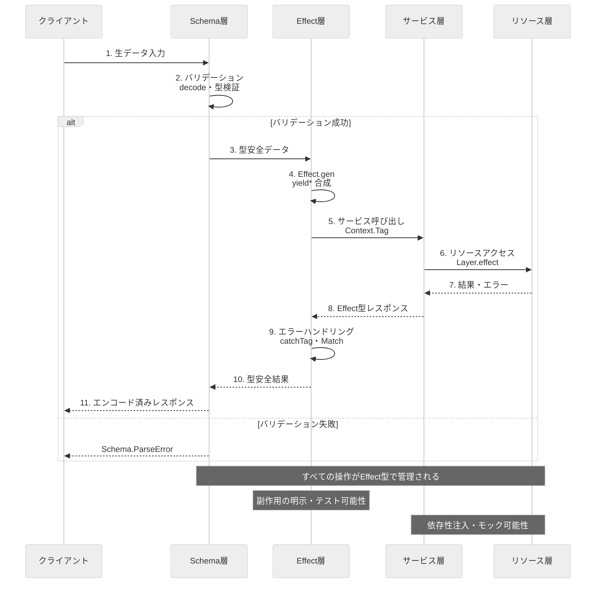

# Effect-TS 基本概念

このドキュメントでは、TypeScript Minecraftプロジェクトにおける**Effect-TS 3.17+** の基本概念とコアパターンを解説します。すべての開発者が理解すべき核となるパターンに焦点を当てています。

> 📖 **関連ドキュメント**: [Effect-TS サービスパターン](./06b-effect-ts-services.md) | [Effect-TS エラーハンドリング](./06c-effect-ts-error-handling.md)

## 1. 基本思想: すべてはEffect

あらゆる副作用（ファイルI/O、ネットワーク、DOM操作、乱数生成、現在時刻の取得など）は `Effect` 型でカプセル化します。これにより、副作用を型シグネチャレベルで明示し、プログラムの予測可能性とテスト容易性を高めます。

### 1.1 Effect-TSアーキテクチャ概観

以下の図は、Effect-TS 3.17+パターンによる純粋関数型プログラミングアーキテクチャを示しています。

```mermaid
%%{init: {"theme": "neutral", "themeVariables": {"primaryColor": "#4285f4", "primaryTextColor": "#ffffff", "primaryBorderColor": "#ffffff", "lineColor": "#4285f4", "sectionBkgColor": "#f5f7fa", "tertiaryColor": "#f5f7fa"}}}%%
graph TB
    subgraph EffectCore ["Effect コア抽象化"]
        subgraph DataLayer ["データ層 - Schema駆動"]
            SchemaStruct["Schema.Struct<br/>📋 データ定義<br/>型安全・バリデーション"]
            BrandTypes["Brand Types<br/>🏷️ 型安全性強化<br/>PlayerId, EntityId"]
            ValidationLayer["Validation Layer<br/>✅ 実行時検証<br/>decode・encode"]
        end

        subgraph EffectLayer ["Effect管理層"]
            EffectGen["Effect.gen<br/>🔄 合成パターン<br/>yield* + 線形フロー"]
            ErrorHandling["Error Handling<br/>❌ 型安全エラー<br/>catchTag・fail"]
            ResourceMgmt["Resource Management<br/>🔧 リソース管理<br/>acquire・release"]
        end

        subgraph ServiceLayer ["サービス層"]
            ContextTag["Context.Tag<br/>🏢 サービス定義<br/>class extends Context.Tag"]
            LayerSystem["Layer System<br/>🧱 依存性注入<br/>Layer.effect・provide"]
            ServiceComposition["Service Composition<br/>🔗 合成・組み立て<br/>pipe・compose"]
        end
    end

    subgraph PatternLayer ["パターン適用層"]
        subgraph MatchingLayer ["パターンマッチング"]
            MatchValue["Match.value<br/>🎯 安全なマッチング<br/>網羅性チェック"]
            TaggedUnions["Tagged Unions<br/>📝 判別可能合併型<br/>_tag ベース"]
        end

        subgraph FunctionalLayer ["関数型パターン"]
            PureFunctions["Pure Functions<br/>🧮 純粋関数<br/>副作用分離"]
            ImmutableData["Immutable Data<br/>📚 不変データ<br/>ReadonlyArray・HashMap"]
            EarlyReturn["Early Return<br/>⚡ 早期リターン<br/>ガード節・フェイルファスト"]
        end
    end

    SchemaStruct --> ValidationLayer
    ValidationLayer --> BrandTypes
    BrandTypes --> EffectGen

    EffectGen --> ErrorHandling
    ErrorHandling --> ResourceMgmt
    ResourceMgmt --> ContextTag

    ContextTag --> LayerSystem
    LayerSystem --> ServiceComposition

    ServiceComposition --> MatchValue
    MatchValue --> TaggedUnions
    TaggedUnions --> PureFunctions

    PureFunctions --> ImmutableData
    ImmutableData --> EarlyReturn

    classDef dataStyle fill:#e3f2fd,stroke:#1976d2,stroke-width:2px,color:#0d47a1
    classDef effectStyle fill:#e8f5e8,stroke:#388e3c,stroke-width:2px,color:#1b5e20
    classDef serviceStyle fill:#fff3e0,stroke:#f57c00,stroke-width:2px,color:#e65100
    classDef patternStyle fill:#f3e5f5,stroke:#7b1fa2,stroke-width:2px,color:#4a148c
    classDef functionalStyle fill:#fce4ec,stroke:#c2185b,stroke-width:2px,color:#880e4f

    class SchemaStruct,BrandTypes,ValidationLayer dataStyle
    class EffectGen,ErrorHandling,ResourceMgmt effectStyle
    class ContextTag,LayerSystem,ServiceComposition serviceStyle
    class MatchValue,TaggedUnions patternStyle
    class PureFunctions,ImmutableData,EarlyReturn functionalStyle
```



### 1.2 Effect-TSデータフロー

以下は、典型的なEffect-TSアプリケーションにおけるデータの流れを示しています。すべての副作用がEffect型で管理され、型安全な合成が実現されています。



## 2. コアパターン

### 2.1. `Effect.gen` + `yield*` による合成（最新推奨）

**Effect-TS 3.17+ 最新パターン**: `Effect.gen` と `yield*` を使用した線形な処理フローが推奨されます。これにより、非同期処理を同期的に記述でき、可読性が向上します。

```typescript
import { Effect, Schema, Context, Stream, Match } from "effect";

// ✅ 最新パターン（Effect.gen + yield* + Schema統合）
const complexOperation = Effect.gen(function* () {
  const config = yield* getConfig();

  // ✅ Schema検証付きデータ取得（最新API使用）
  const data = yield* fetchData(config.apiUrl).pipe(
    Effect.flatMap(raw => Effect.try({
      try: () => Schema.decodeUnknownSync(DataSchema)(raw),
      catch: (error) => new ValidationError({ cause: error, input: raw })
    }))
  );

  const processed = yield* processData(data);
  yield* saveResult(processed);
  return processed;
});

// ✅ 早期リターンパターンと包括的エラーハンドリング
const operationWithErrorHandling = Effect.gen(function* () {
  const config = yield* getConfig();

  // ✅ 早期リターン: 設定検証
  if (!config.enabled) {
    return yield* Effect.fail(
      Schema.encodeSync(ConfigError)({
        _tag: "ConfigDisabledError",
        message: "設定が無効です"
      })
    );
  }

  // ✅ 包括的エラー処理とフォールバック
  const data = yield* fetchData(config.apiUrl).pipe(
    Effect.catchTags({
      NetworkError: (error) =>
        Effect.gen(function* () {
          yield* Effect.log(`ネットワークエラー: ${error.message}, デフォルトデータを使用`);
          return defaultData;
        }),
      TimeoutError: () =>
        Effect.gen(function* () {
          yield* Effect.log("タイムアウト: キャッシュデータを試行");
          return yield* getCachedData().pipe(
            Effect.orElse(() => Effect.succeed(defaultData))
          );
        })
    })
  );

  return yield* processData(data);
});

// ✅ 高度な並列処理とバッチング
const parallelOperation = Effect.gen(function* () {
  // ✅ bindAllで並列実行とエラー処理
  const result = yield* Effect.Do.pipe(
    Effect.bind("timestamp", () => Effect.sync(() => Date.now())),
    Effect.bindAll(
      ({ timestamp }) => ({
        userData: fetchUserData().pipe(
          Effect.timeout("5 seconds"),
          Effect.retry(Schedule.exponential("100 millis", 2).pipe(
            Schedule.compose(Schedule.recurs(3))
          ))
        ),
        configData: fetchConfigData(),
        settingsData: fetchSettingsData()
      }),
      { concurrency: "unbounded", mode: "either" }
    ),
    Effect.tap(({ timestamp }) =>
      Effect.log(`並列操作完了: ${Date.now() - timestamp}ms`)
    )
  );

  // ✅ エラー結果の処理
  const userData = yield* Match.value(result.userData).pipe(
    Match.tag("Right", ({ right }) => Effect.succeed(right)),
    Match.tag("Left", ({ left }) =>
      Effect.gen(function* () {
        yield* Effect.log(`ユーザーデータ取得失敗: ${left}`);
        return yield* getDefaultUserData();
      })
    ),
    Match.exhaustive
  );

  return {
    userData,
    configData: result.configData,
    settingsData: result.settingsData,
    timestamp: result.timestamp
  };
});
```

### 2.2. `Schema` によるデータ定義とバリデーション

`class` や `interface` の代わりに `Schema.Struct` を用いて、すべてのデータ構造を定義します。これにより、型定義と実行時バリデーションを同時に実現します。

```typescript
import { Schema, Brand } from "effect";

// ✅ 最新パターン: 包括的Schema定義とバリデーション
const Position = Schema.Struct({
  x: Schema.Number.pipe(
    Schema.int(),
    Schema.greaterThanOrEqualTo(-30_000_000),
    Schema.lessThanOrEqualTo(30_000_000)
  ),
  y: Schema.Number.pipe(
    Schema.int(),
    Schema.greaterThanOrEqualTo(-64),
    Schema.lessThanOrEqualTo(320)
  ),
  z: Schema.Number.pipe(
    Schema.int(),
    Schema.greaterThanOrEqualTo(-30_000_000),
    Schema.lessThanOrEqualTo(30_000_000)
  )
}).pipe(
  Schema.annotations({
    identifier: "Position",
    title: "Minecraft座標",
    description: "Minecraftワールドの有効な座標範囲内の3D位置"
  })
);
type Position = Schema.Schema.Type<typeof Position>;

// ✅ Brand型とContext.GenericTag統合パターン
const ChunkId = Schema.String.pipe(
  Schema.pattern(/^chunk_-?\d+_-?\d+$/),
  Schema.brand("ChunkId")
);
type ChunkId = Schema.Schema.Type<typeof ChunkId>;

const EntityId = Schema.String.pipe(
  Schema.uuid(),
  Schema.brand("EntityId")
);
type EntityId = Schema.Schema.Type<typeof EntityId>;

const PlayerId = Schema.String.pipe(
  Schema.uuid(),
  Schema.brand("PlayerId")
);
type PlayerId = Schema.Schema.Type<typeof PlayerId>;

// ✅ Context.GenericTag使用例（最新パターン）
export interface WorldService {
  readonly getBlock: (pos: Position) => Effect.Effect<Block, BlockNotFoundError>
  readonly setBlock: (pos: Position, block: Block) => Effect.Effect<void, BlockSetError>
  readonly isValidPosition: (pos: Position) => Effect.Effect<boolean, never>
}
export const WorldService = Context.GenericTag<WorldService>("@minecraft/WorldService")

// ✅ 複雑なSchema組み合わせ
const Block = Schema.Struct({
  id: Schema.String.pipe(Schema.brand("BlockId")),
  metadata: Schema.optional(
    Schema.Record({
      key: Schema.String,
      value: Schema.Union(
        Schema.String,
        Schema.Number,
        Schema.Boolean
      )
    })
  ),
  lightLevel: Schema.Number.pipe(
    Schema.int(),
    Schema.greaterThanOrEqualTo(0),
    Schema.lessThanOrEqualTo(15)
  ),
  hardness: Schema.Number.pipe(Schema.nonNegative())
}).pipe(
  Schema.annotations({
    identifier: "Block",
    title: "ブロック",
    description: "Minecraftワールドのブロック定義"
  })
);
type Block = Schema.Schema.Type<typeof Block>;

// ✅ Union型とパターンマッチング連携
const Direction = Schema.Literal("north", "south", "east", "west", "up", "down");
type Direction = Schema.Schema.Type<typeof Direction>;

// ✅ 実行時バリデーション関数
const validatePosition = (input: unknown): Effect.Effect<Position, Schema.ParseError> =>
  Schema.decodeUnknown(Position)(input);

const encodePosition = (position: Position): unknown =>
  Schema.encodeSync(Position)(position);

// ✅ カスタムSchema変換
const Vector3 = Schema.transform(
  Schema.Struct({
    x: Schema.Number,
    y: Schema.Number,
    z: Schema.Number
  }),
  Position,
  {
    // decode: Vector3 -> Position
    decode: (vector) => ({
      x: Math.round(vector.x),
      y: Math.round(vector.y),
      z: Math.round(vector.z)
    }),
    // encode: Position -> Vector3
    encode: (position) => ({
      x: position.x,
      y: position.y,
      z: position.z
    })
  }
);
```

### 2.3. `Match.value` によるパターンマッチング

`if/else` や `switch` 文の代わりに `Match.value` を使用します。これにより、網羅性チェックと型安全性が保証されます。

```typescript
import { Match, Option, Either, Effect } from "effect";

// ✅ 基本的なパターンマッチング
const processDirection = (direction: Direction) =>
  Match.value(direction).pipe(
    Match.when("north", () => ({ x: 0, z: -1 })),
    Match.when("south", () => ({ x: 0, z: 1 })),
    Match.when("east", () => ({ x: 1, z: 0 })),
    Match.when("west", () => ({ x: -1, z: 0 })),
    Match.when("up", () => ({ x: 0, y: 1 })),
    Match.when("down", () => ({ x: 0, y: -1 })),
    Match.exhaustive  // コンパイル時に網羅性をチェック
  );

// ✅ Option型との組み合わせ（最新Match.tags パターン）
const handleOptionalData = (data: Option.Option<string>) =>
  Match.value(data).pipe(
    Match.tags({
      Some: ({ value }) => Effect.succeed(`データ: ${value}`),
      None: () => Effect.fail(new Error("データが見つかりません"))
    })
  );

// ✅ Either型との組み合わせ（Match.tags 最新パターン）
const handleResult = <E, A>(result: Either.Either<E, A>) =>
  Match.value(result).pipe(
    Match.tags({
      Right: ({ right }) => Effect.succeed(right),
      Left: ({ left }) => Effect.fail(left)
    })
  );

// ✅ 複合的なパターンマッチング
const processGameInput = (input: GameInput) =>
  Match.value(input).pipe(
    Match.when(
      (i): i is KeyboardInput => i._tag === "KeyboardInput",
      (input) => handleKeyboardInput(input.key, input.modifiers)
    ),
    Match.when(
      (i): i is MouseInput => i._tag === "MouseInput",
      (input) => handleMouseInput(input.button, input.position)
    ),
    Match.when(
      (i): i is TouchInput => i._tag === "TouchInput",
      (input) => handleTouchInput(input.touches)
    ),
    Match.exhaustive
  );
```

### 2.4. 不変データ構造

すべてのデータ構造は不変（immutable）として扱います。Effect-TSの提供するデータ構造を活用します。

```typescript
import { HashMap, Array as Arr, Record, Schema } from "effect";

// ✅ 不変コレクションの使用
const GameState = Schema.Struct({
  players: Schema.ReadonlyMap({
    key: Schema.String.pipe(Schema.brand("PlayerId")),
    value: PlayerSchema
  }),
  blocks: Schema.ReadonlyMap({
    key: Schema.String.pipe(Schema.brand("BlockId")),
    value: BlockSchema
  }),
  chunks: Schema.ReadonlyArray(ChunkSchema)
});
type GameState = Schema.Schema.Type<typeof GameState>;

// ✅ 不変更新パターン
const updatePlayerPosition = (
  state: GameState,
  playerId: PlayerId,
  newPosition: Position
): Effect.Effect<GameState, PlayerNotFoundError> =>
  Effect.gen(function* () {
    const currentPlayer = state.players.get(playerId);

    if (Option.isNone(currentPlayer)) {
      return yield* Effect.fail({
        _tag: "PlayerNotFoundError" as const,
        playerId,
        message: `プレイヤー ${playerId} が見つかりません`
      });
    }

    const updatedPlayer = {
      ...currentPlayer.value,
      position: newPosition,
      lastUpdated: new Date().toISOString()
    };

    return {
      ...state,
      players: state.players.set(playerId, updatedPlayer)
    };
  });

// ✅ 配列操作の不変パターン
const addBlockToChunk = (chunk: Chunk, block: Block): Chunk => ({
  ...chunk,
  blocks: Arr.append(chunk.blocks, block),
  lastModified: new Date().toISOString()
});

const removeBlockFromChunk = (chunk: Chunk, blockId: BlockId): Chunk => ({
  ...chunk,
  blocks: Arr.filter(chunk.blocks, (block) => block.id !== blockId),
  lastModified: new Date().toISOString()
});
```

### 2.5. 純粋関数の分離と早期リターンパターン

副作用のない純粋関数と副作用のある関数を明確に分離し、早期リターンパターンを活用します。

```typescript
// ✅ 純粋関数: 副作用なし
const calculateDistance = (pos1: Position, pos2: Position): number =>
  Math.sqrt(
    Math.pow(pos2.x - pos1.x, 2) +
    Math.pow(pos2.y - pos1.y, 2) +
    Math.pow(pos2.z - pos1.z, 2)
  );

const isWithinRange = (pos1: Position, pos2: Position, maxDistance: number): boolean =>
  calculateDistance(pos1, pos2) <= maxDistance;

const getChunkCoordinate = (position: Position): ChunkCoordinate => ({
  x: Math.floor(position.x / 16),
  z: Math.floor(position.z / 16)
});

// ✅ Effect関数: 副作用あり + 早期リターンパターン
const movePlayer = (
  playerId: PlayerId,
  newPosition: Position
): Effect.Effect<Player, PlayerMoveError, GameStateService> =>
  Effect.gen(function* () {
    const gameState = yield* GameStateService;

    // ✅ 早期リターン: プレイヤー存在チェック
    const currentPlayer = yield* gameState.getPlayer(playerId).pipe(
      Effect.mapError(() => ({
        _tag: "PlayerNotFoundError" as const,
        playerId,
        message: "プレイヤーが見つかりません"
      }))
    );

    // ✅ 早期リターン: 位置バリデーション
    const isValidPosition = yield* validateWorldPosition(newPosition);
    if (!isValidPosition) {
      return yield* Effect.fail({
        _tag: "InvalidPositionError" as const,
        position: newPosition,
        message: "無効な位置です"
      });
    }

    // ✅ 早期リターン: 移動距離チェック
    const distance = calculateDistance(currentPlayer.position, newPosition);
    if (distance > MAX_MOVE_DISTANCE) {
      return yield* Effect.fail({
        _tag: "TooFarMoveError" as const,
        from: currentPlayer.position,
        to: newPosition,
        distance,
        maxDistance: MAX_MOVE_DISTANCE
      });
    }

    // ✅ 正常パス: プレイヤー更新
    const updatedPlayer = {
      ...currentPlayer,
      position: newPosition,
      lastMoved: new Date().toISOString()
    };

    yield* gameState.updatePlayer(playerId, updatedPlayer);
    yield* logPlayerMove(playerId, currentPlayer.position, newPosition);

    return updatedPlayer;
  });
```

## 3. Effect型シグネチャの読み方

Effect-TSの型シグネチャを正しく読み理解することは重要です。

```typescript
// Effect<Success, Error, Requirements>の構造
type MyEffect = Effect.Effect<
  string,           // Success: 成功時の戻り値型
  NetworkError,     // Error: 失敗時のエラー型
  DatabaseService   // Requirements: 必要な依存関係
>;

// ✅ 複数のエラー型
type MultiErrorEffect = Effect.Effect<
  User,
  UserNotFoundError | ValidationError | DatabaseError,
  DatabaseService | LoggingService
>;

// ✅ エラーなしのEffect
type SafeEffect = Effect.Effect<string, never, ConfigService>;

// ✅ 依存関係なしのEffect
type IndependentEffect = Effect.Effect<number, ParseError, never>;

// ✅ Context要件の明示的管理
interface AppServices extends WorldService, PlayerService, ChunkService {}
```

## まとめ

このドキュメントで解説した基本パターンは、すべてのEffect-TSコードの基礎となります：

### 必須パターン（Effect-TS 3.17+）
1. **Effect.gen + yield*** による線形な合成
2. **Schema.Struct** による型安全なデータ定義（Data.struct使用禁止）
3. **Context.GenericTag** による依存性注入
4. **Match.value + Match.tags** による網羅的パターンマッチング
5. **不変データ構造** の一貫した使用
6. **純粋関数と副作用の分離**
7. **早期リターンパターン** による最大3レベルネスト
8. **Effect.catchTags** による型安全エラーハンドリング
9. **PBTフレンドリー** な単一責任関数設計

### 禁止パターン（Effect-TS 3.17+）
1. **class** ベースの設計（Context.GenericTagを使用）
2. **Data.struct** の使用（Schema.Structを使用）
3. **if/else/switch** の多用（Match.value + Match.tagsを使用）
4. **任意の型（any、unknown）** の使用
5. **可変データ構造** の使用
6. **try/catch** による例外処理（Effect.catchTagsを使用）
7. **3レベル超えのネスト** （早期リターンで解決）
8. **単一責任原則違反の関数** （PBTフレンドリー設計）
9. **手動エラーハンドリング** （Schema.TaggedError使用）

これらの基本パターンを理解した上で、[サービスパターン](./06b-effect-ts-services.md)や[エラーハンドリング](./06c-effect-ts-error-handling.md)に進むことを推奨します。