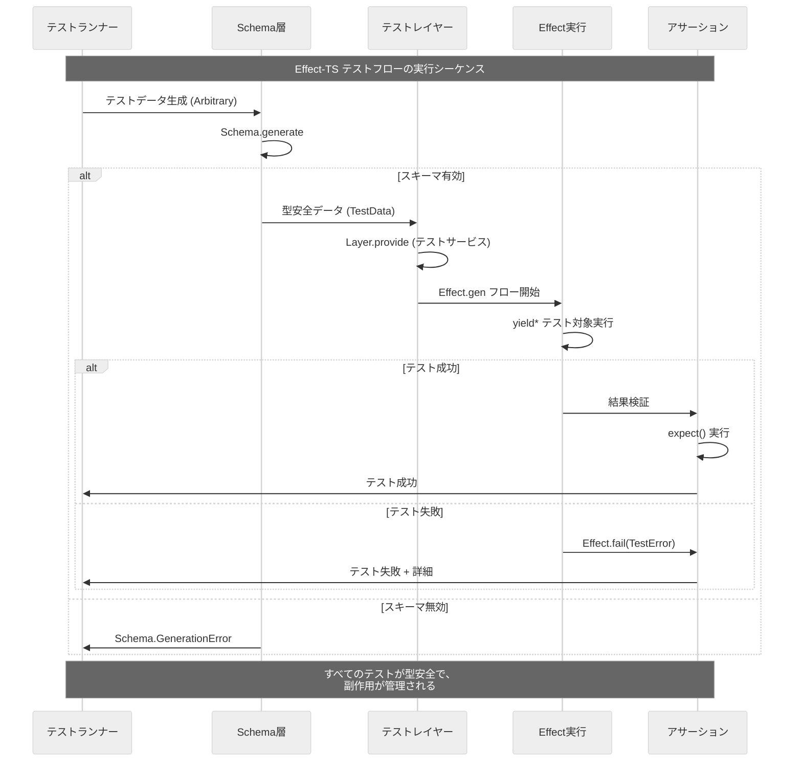

# Effect-TS テスティング戦略

TypeScript Minecraftプロジェクトでは、**Effect-TS 3.17+** の最新テスティングパターンを採用し、型安全で合成可能なテスト戦略を実践しています。この文書では、プロジェクト全体で遵守すべきテスト手法とパターンを解説します。

## 1. テストアーキテクチャ概観

### 1.1 Effect-TSテストエコシステム

```mermaid
%%{init: {"theme": "neutral", "themeVariables": {"primaryColor": "#4285f4", "primaryTextColor": "#ffffff", "primaryBorderColor": "#ffffff", "lineColor": "#4285f4", "sectionBkgColor": "#f5f7fa", "tertiaryColor": "#f5f7fa"}}}%%
graph TB
    subgraph TestCore ["Effect-TS テストコア"]
        subgraph TestLayers ["テストレイヤー管理"]
            LayerTest["Layer Testing<br/>🧱 依存注入テスト<br/>モック・スタブ管理"]
            ServiceTest["Service Testing<br/>🏢 サービス単体テスト<br/>型安全なテスト境界"]
            IntegrationTest["Integration Testing<br/>🔗 統合テスト<br/>レイヤー組み合わせ"]
        end

        subgraph EffectTest ["Effect テスト管理"]
            EffectRunning["Effect Running<br/>⚡ Effect実行<br/>runSync・runPromise"]
            ErrorTesting["Error Testing<br/>❌ エラーテスト<br/>catchTag・fail検証"]
            ResourceTesting["Resource Testing<br/>🔧 リソーステスト<br/>acquire・release検証"]
        end

        subgraph PropertyTest ["Property-Based Testing"]
            FastCheck["Fast-Check<br/>🎲 プロパティテスト<br/>Arbitrary統合"]
            SchemaGen["Schema Generation<br/>📋 スキーマ生成<br/>自動テストデータ"]
            Invariants["Invariant Testing<br/>✅ 不変条件検証<br/>ビジネスルール"]
        end
    end

    subgraph TestTools ["テストツール層"]
        subgraph VitestIntegration ["Vitest 統合"]
            VitestRunner["Vitest Runner<br/>🏃 テスト実行<br/>並列・ウォッチ"]
            TestContext["Test Context<br/>📝 テスト環境<br/>TestClock・TestRandom"]
            SnapshotTest["Snapshot Testing<br/>📸 スナップショット<br/>Schema出力検証"]
        end

        subgraph STMTest ["STM テスト"]
            ConcurrentTest["Concurrent Testing<br/>🔄 並行テスト<br/>レースコンディション"]
            AtomicTest["Atomic Testing<br/>⚛️ アトミック操作<br/>トランザクション検証"]
            StateTest["State Testing<br/>📊 状態テスト<br/>TRef・Queue検証"]
        end
    end

    LayerTest --> ServiceTest
    ServiceTest --> IntegrationTest
    IntegrationTest --> EffectRunning

    EffectRunning --> ErrorTesting
    ErrorTesting --> ResourceTesting
    ResourceTesting --> FastCheck

    FastCheck --> SchemaGen
    SchemaGen --> Invariants

    Invariants --> VitestRunner
    VitestRunner --> TestContext
    TestContext --> SnapshotTest

    SnapshotTest --> ConcurrentTest
    ConcurrentTest --> AtomicTest
    AtomicTest --> StateTest

    classDef layerStyle fill:#e3f2fd,stroke:#1976d2,stroke-width:2px,color:#0d47a1
    classDef effectStyle fill:#e8f5e8,stroke:#388e3c,stroke-width:2px,color:#1b5e20
    classDef propertyStyle fill:#fff3e0,stroke:#f57c00,stroke-width:2px,color:#e65100
    classDef toolStyle fill:#f3e5f5,stroke:#7b1fa2,stroke-width:2px,color:#4a148c
    classDef stmStyle fill:#fce4ec,stroke:#c2185b,stroke-width:2px,color:#880e4f

    class LayerTest,ServiceTest,IntegrationTest layerStyle
    class EffectRunning,ErrorTesting,ResourceTesting effectStyle
    class FastCheck,SchemaGen,Invariants propertyStyle
    class VitestRunner,TestContext,SnapshotTest toolStyle
    class ConcurrentTest,AtomicTest,StateTest stmStyle
```



### 1.2 テストデータフロー



## 2. Layer-based Testing パターン

### 2.1 テスト用Layerの構築

```typescript
import { Layer, Effect, Context, TestClock, TestRandom } from "effect";
import { it, expect } from "@effect/vitest";

// ✅ テスト用サービス定義
const TestWorldService = Layer.succeed(
  WorldService,
  {
    getBlock: (pos: Position) =>
      Effect.succeed({
        id: "minecraft:stone" as any,
        metadata: undefined,
        lightLevel: 0,
        hardness: 1.5
      }),

    setBlock: (pos: Position, block: Block) =>
      Effect.gen(function* () {
        yield* Effect.log(`テスト: ブロック設置 ${pos.x},${pos.y},${pos.z} = ${block.id}`);
        return void 0;
      }),

    getChunk: (chunkId: ChunkId) =>
      Effect.succeed({
        id: chunkId,
        position: { x: 0, z: 0 },
        blocks: new Uint8Array(4096),
        entities: []
      }),

    isValidPosition: (pos: Position) => Effect.succeed(true)
  }
);

// ✅ 統合テストレイヤー
const TestAppLayer = Layer.mergeAll(
  TestWorldService,
  TestContext.TestContext,
  TestClock.default,
  TestRandom.deterministic
);

// ✅ Layer-based テストパターン（@effect/vitest使用）
it.effect("should provide mock WorldService through Layer", () =>
  Effect.gen(function* () {
    const worldService = yield* WorldService;

    const block = yield* worldService.getBlock({ x: 0, y: 64, z: 0 });

    expect(block.id).toBe("minecraft:stone");
    expect(block.hardness).toBe(1.5);
  }).pipe(Effect.provide(TestAppLayer))
);

it.effect("should handle block placement through test layer", () =>
  Effect.gen(function* () {
    const worldService = yield* WorldService;

    const block: Block = {
      id: "minecraft:dirt" as any,
      metadata: undefined,
      lightLevel: 0,
      hardness: 0.5
    };

    yield* worldService.setBlock({ x: 1, y: 64, z: 1 }, block);

      // テストでは setBlock が正常に完了することを検証
      const result = yield* Effect.succeed("placement_successful");
      expect(result).toBe("placement_successful");
    });

    await Effect.runPromise(test.pipe(Effect.provide(TestAppLayer)));
  });
});
```

### 2.2 TestServices とモック実装

```typescript
// ✅ 高度なテストサービス（状態管理付き）
const makeTestWorldServiceWithState = Effect.gen(function* () {
  const stateRef = yield* Ref.make(new Map<string, Block>());
  const metricsRef = yield* Ref.make({ blocksPlaced: 0, blocksRetrieved: 0 });

  const positionToKey = (pos: Position): string => `${pos.x},${pos.y},${pos.z}`;

  return {
    getBlock: (pos: Position) =>
      Effect.gen(function* () {
        const state = yield* Ref.get(stateRef);
        const key = positionToKey(pos);

        yield* Ref.update(metricsRef, m => ({ ...m, blocksRetrieved: m.blocksRetrieved + 1 }));

        const block = state.get(key);
        if (block) {
          return block;
        }

        return {
          id: "minecraft:air" as any,
          metadata: undefined,
          lightLevel: 0,
          hardness: 0
        };
      }),

    setBlock: (pos: Position, block: Block) =>
      Effect.gen(function* () {
        const key = positionToKey(pos);

        yield* Ref.update(stateRef, state => new Map(state).set(key, block));
        yield* Ref.update(metricsRef, m => ({ ...m, blocksPlaced: m.blocksPlaced + 1 }));

        yield* Effect.log(`テスト状態: ブロック ${block.id} を ${key} に設置`);
      }),

    getChunk: (chunkId: ChunkId) =>
      Effect.succeed({
        id: chunkId,
        position: { x: 0, z: 0 },
        blocks: new Uint8Array(4096),
        entities: []
      }),

    isValidPosition: (pos: Position) =>
      Effect.succeed(
        pos.x >= -30000000 && pos.x <= 30000000 &&
        pos.y >= -64 && pos.y <= 320 &&
        pos.z >= -30000000 && pos.z <= 30000000
      ),

    // ✅ テスト用のメトリクス取得メソッド
    getTestMetrics: () => Ref.get(metricsRef),
    getTestState: () => Ref.get(stateRef)
  });
});

const TestWorldServiceWithState = Layer.effect(WorldService, makeTestWorldServiceWithState);

// ✅ 統合テスト例（状態管理）
describe("Stateful WorldService Testing", () => {
  it("should track block placement and retrieval", async () => {
    const test = Effect.gen(function* () {
      const worldService = yield* WorldService;

      // ブロック設置
      const block: Block = {
        id: "minecraft:stone" as any,
        metadata: undefined,
        lightLevel: 0,
        hardness: 1.5
      };

      yield* worldService.setBlock({ x: 10, y: 64, z: 10 }, block);
      yield* worldService.setBlock({ x: 11, y: 64, z: 10 }, block);

      // ブロック取得
      const retrievedBlock1 = yield* worldService.getBlock({ x: 10, y: 64, z: 10 });
      const retrievedBlock2 = yield* worldService.getBlock({ x: 11, y: 64, z: 10 });
      const emptyBlock = yield* worldService.getBlock({ x: 0, y: 0, z: 0 });

      // 状態確認
      const metrics = yield* (worldService as any).getTestMetrics();

      expect(retrievedBlock1.id).toBe("minecraft:stone");
      expect(retrievedBlock2.id).toBe("minecraft:stone");
      expect(emptyBlock.id).toBe("minecraft:air");

      expect(metrics.blocksPlaced).toBe(2);
      expect(metrics.blocksRetrieved).toBe(3);
    });

    await Effect.runPromise(test.pipe(Effect.provide(TestWorldServiceWithState)));
  });
});
```

## 3. Property-Based Testing with Fast-Check

### 3.1 Schema統合プロパティテスト

```typescript
import * as fc from "fast-check";

// ✅ Arbitrary生成器の定義
const PositionArbitrary = fc.record({
  x: fc.integer({ min: -30000000, max: 30000000 }),
  y: fc.integer({ min: -64, max: 320 }),
  z: fc.integer({ min: -30000000, max: 30000000 })
});

const BlockArbitrary = fc.record({
  id: fc.oneof(
    fc.constant("minecraft:stone"),
    fc.constant("minecraft:dirt"),
    fc.constant("minecraft:grass"),
    fc.constant("minecraft:air")
  ).map(id => id as any),
  metadata: fc.option(fc.dictionary(fc.string(), fc.anything()), { nil: undefined }),
  lightLevel: fc.integer({ min: 0, max: 15 }),
  hardness: fc.float({ min: 0, max: 100 })
});

// ✅ Property-based テストの実装
describe("WorldService Property-Based Tests", () => {
  it.prop([PositionArbitrary, BlockArbitrary])("block placement and retrieval should be consistent",
    async (position, block) => {
      const test = Effect.gen(function* () {
        const worldService = yield* WorldService;

        // ブロック設置
        yield* worldService.setBlock(position, block);

        // 即座に取得
        const retrievedBlock = yield* worldService.getBlock(position);

        // プロパティ検証: 設置したブロックが正確に取得できる
        expect(retrievedBlock.id).toBe(block.id);
        expect(retrievedBlock.lightLevel).toBe(block.lightLevel);
        expect(retrievedBlock.hardness).toBe(block.hardness);
      });

      await Effect.runPromise(test.pipe(Effect.provide(TestWorldServiceWithState)));
    }
  );

  it.prop([fc.array(PositionArbitrary, { minLength: 1, maxLength: 10 })])("position validation should be transitive",
    async (positions) => {
      const test = Effect.gen(function* () {
        const worldService = yield* WorldService;

        for (const position of positions) {
          const isValid = yield* worldService.isValidPosition(position);

          // プロパティ検証: 有効な座標は常に一貫している
          const expectedValid =
            position.x >= -30000000 && position.x <= 30000000 &&
            position.y >= -64 && position.y <= 320 &&
            position.z >= -30000000 && position.z <= 30000000;

          expect(isValid).toBe(expectedValid);
        }
      });

      await Effect.runPromise(test.pipe(Effect.provide(TestAppLayer)));
    }
  );
});
```

### 3.2 高度なプロパティテスト (インバリアント検証)

```typescript
// ✅ インベントリシステムのプロパティテスト
const ItemStackArbitrary = fc.record({
  itemId: fc.oneof(
    fc.constant("minecraft:stone"),
    fc.constant("minecraft:dirt"),
    fc.constant("minecraft:wood")
  ).map(id => id as any),
  quantity: fc.integer({ min: 1, max: 64 }),
  metadata: fc.option(fc.dictionary(fc.string(), fc.anything()), { nil: undefined })
});

const InventoryArbitrary = fc.record({
  slots: fc.array(fc.option(ItemStackArbitrary, { nil: undefined }), { maxLength: 36 }),
  maxSize: fc.constant(36)
});

describe("Inventory System Property Tests", () => {
  it.prop([InventoryArbitrary, ItemStackArbitrary])("adding items preserves inventory invariants",
    async (inventory, itemStack) => {
      const result = addItemToInventory(inventory, itemStack);

      // インバリアント1: インベントリサイズは不変
      expect(result.updatedInventory.slots.length).toBeLessThanOrEqual(result.updatedInventory.maxSize);

      // インバリアント2: 元のインベントリは変更されない
      expect(inventory.slots).toEqual(inventory.slots); // 参照同一性確認

      // ✅ Match.valueによる型安全なテスト分岐 - 条件に応じたバリデーション
      Match.value(result.success).pipe(
        Match.when(true, () => {
          // インバリアント3: 成功時は必ずアイテムが追加される
          const totalQuantity = result.updatedInventory.slots
            .filter(slot => slot !== undefined && slot.itemId === itemStack.itemId)
            .reduce((sum, slot) => sum + slot!.quantity, 0);

          const originalQuantity = inventory.slots
            .filter(slot => slot !== undefined && slot.itemId === itemStack.itemId)
            .reduce((sum, slot) => sum + slot!.quantity, 0);

          const expectedQuantity = originalQuantity + itemStack.quantity - (result.remainingStack?.quantity ?? 0);
          expect(totalQuantity).toBe(expectedQuantity);
        }),
        Match.orElse(() => {
          // 失敗時のバリデーション（必要に応じて追加）
        })
      );

      // ✅ 残りアイテムの検証もMatch.valueで型安全に
      Match.value(result.remainingStack).pipe(
        Match.when(Match.defined, (remainingStack) => {
          // インバリアント4: 残りアイテムは元のアイテムと同一性を持つ
          expect(remainingStack.itemId).toBe(itemStack.itemId);
          expect(remainingStack.quantity).toBeGreaterThan(0);
          expect(remainingStack.quantity).toBeLessThanOrEqual(itemStack.quantity);
        }),
        Match.orElse(() => {
          // 残りアイテムが無い場合の処理（必要に応じて）
        })
      );
    }
  );

  it.prop([InventoryArbitrary])("empty inventory operations are idempotent",
    async (inventory) => {
      const emptySlots = inventory.slots.filter(slot => slot === undefined).length;
      const emptySlotIndex = findEmptySlot(inventory);

      if (emptySlots > 0) {
        expect(emptySlotIndex).toBeGreaterThanOrEqual(0);
        expect(emptySlotIndex).toBeLessThan(inventory.slots.length);
        expect(inventory.slots[emptySlotIndex!]).toBeUndefined();
      } else {
        expect(emptySlotIndex).toBeUndefined();
      }
    }
  );
});
```

## 4. STM (Software Transactional Memory) テスト

### 4.1 並行状態管理テスト

```typescript
import { STM, TRef, Effect, Fiber, TestClock } from "effect";

// ✅ STMベースの並行テスト
describe("STM Concurrent Testing", () => {
  it("should handle concurrent player actions atomically", async () => {
    const test = Effect.gen(function* () {
      // 共有状態の初期化
      const playersRef = yield* TRef.make(new Map<string, Player>());
      const worldStateRef = yield* TRef.make<WorldState>({
        time: 0,
        weather: "clear" as const,
        difficulty: "normal" as const
      });

      // 並行プレイヤー追加操作
      const addPlayer = (player: Player): Effect.Effect<boolean, never> =>
        STM.gen(function* () {
          const players = yield* STM.get(playersRef);
          if (players.has(player.id)) {
            return false;
          }

          const newPlayers = new Map(players).set(player.id, player);
          yield* STM.set(playersRef, newPlayers);
          return true;
        }).pipe(STM.commit);

      // 10個のプレイヤーを並行追加
      const players: Player[] = Array.from({ length: 10 }, (_, i) => ({
        id: `player-${i}` as any,
        name: `Player${i}`,
        position: { x: i, y: 64, z: i },
        health: 100 as any
      }));

      const addResults = yield* Effect.all(
        players.map(player => addPlayer(player)),
        { concurrency: "unbounded" }
      );

      // 検証: すべてのプレイヤーが正常に追加された
      expect(addResults.every(result => result === true)).toBe(true);

      const finalPlayers = yield* STM.get(playersRef).pipe(STM.commit);
      expect(finalPlayers.size).toBe(10);

      // 検証: 全プレイヤーが存在する
      for (const player of players) {
        expect(finalPlayers.has(player.id)).toBe(true);
      }
    });

    await Effect.runPromise(test.pipe(Effect.provide(TestContext.TestContext)));
  });

  it("should handle concurrent world time updates", async () => {
    const test = Effect.gen(function* () {
      const worldStateRef = yield* TRef.make<WorldState>({
        time: 0,
        weather: "clear" as const,
        difficulty: "normal" as const
      });

      const advanceTime = (deltaTime: number): Effect.Effect<void, never> =>
        STM.gen(function* () {
          const worldState = yield* STM.get(worldStateRef);
          const newTime = worldState.time + deltaTime;

          yield* STM.set(worldStateRef, {
            ...worldState,
            time: newTime % 24000 // 24時間サイクル
          });
        }).pipe(STM.commit);

      // 複数のファイバーで時間を進める
      const timeFibers = yield* Effect.all([
        Effect.fork(Effect.all(Array(100).fill(0).map(() => advanceTime(1)))),
        Effect.fork(Effect.all(Array(100).fill(0).map(() => advanceTime(2)))),
        Effect.fork(Effect.all(Array(100).fill(0).map(() => advanceTime(3))))
      ]);

      // すべてのファイバー完了を待つ
      yield* Effect.all(timeFibers.map(fiber => Fiber.join(fiber)));

      const finalState = yield* STM.get(worldStateRef).pipe(STM.commit);

      // 検証: 時間が正確に進んでいる（600 = 100*1 + 100*2 + 100*3）
      expect(finalState.time).toBe(600);
    });

    await Effect.runPromise(test.pipe(Effect.provide(TestContext.TestContext)));
  });
});
```

### 4.2 TestClock と TestRandom を使用した決定論的テスト

```typescript
describe("Deterministic Testing with TestClock and TestRandom", () => {
  it("should handle time-based operations predictably", async () => {
    const test = Effect.gen(function* () {
      const clock = yield* TestClock.TestClock;
      const random = yield* TestRandom.TestRandom;

      // 決定論的ランダム値設定
      yield* TestRandom.setSeed(random, 12345);

      // 時間ベースの操作をテスト
      const startTime = yield* clock.currentTimeMillis;

      const randomValue = yield* Random.next;
      const delayedOperation = Effect.gen(function* () {
        yield* Effect.sleep("5 seconds");
        const endTime = yield* clock.currentTimeMillis;
        return endTime - startTime;
      });

      const operationFiber = yield* Effect.fork(delayedOperation);

      // 時間を手動で進める
      yield* TestClock.adjust(clock, "2 seconds");
      yield* TestClock.adjust(clock, "3 seconds");

      const elapsedTime = yield* Fiber.join(operationFiber);

      // 検証
      expect(elapsedTime).toBe(5000); // 正確に5秒
      expect(randomValue).toBe(0.5488135039273248); // seed=12345での最初の値
    });

    const testLayer = Layer.mergeAll(
      TestClock.default,
      TestRandom.deterministic
    );

    await Effect.runPromise(test.pipe(Effect.provide(testLayer)));
  });

  it("should handle scheduled operations with TestClock", async () => {
    const test = Effect.gen(function* () {
      const clock = yield* TestClock.TestClock;
      const counterRef = yield* Ref.make(0);

      // スケジュール操作
      const scheduledTask = Effect.gen(function* () {
        yield* Ref.update(counterRef, n => n + 1);
        yield* Effect.log("Scheduled task executed");
      });

      // 1秒ごとに実行するスケジュール
      const scheduledFiber = yield* Effect.fork(
        scheduledTask.pipe(
          Effect.repeat(Schedule.fixed("1 second")),
          Effect.take(5) // 5回実行
        )
      );

      // 時間を段階的に進める
      for (let i = 0; i < 5; i++) {
        yield* TestClock.adjust(clock, "1 second");
      }

      yield* Fiber.join(scheduledFiber);

      const finalCount = yield* Ref.get(counterRef);
      expect(finalCount).toBe(5);
    });

    await Effect.runPromise(test.pipe(Effect.provide(TestClock.default)));
  });
});
```

## 5. エラーハンドリングテスト

### 5.1 Tagged Error テスト

```typescript
// ✅ エラー型の定義
const TestMoveError = Schema.Union(
  Schema.Struct({
    _tag: Schema.Literal("PlayerNotFoundError"),
    playerId: Schema.String.pipe(Schema.brand("PlayerId")),
    message: Schema.String
  }),
  Schema.Struct({
    _tag: Schema.Literal("InvalidPositionError"),
    position: Position,
    bounds: Schema.Unknown
  }),
  Schema.Struct({
    _tag: Schema.Literal("MovementBlockedError"),
    playerId: Schema.String.pipe(Schema.brand("PlayerId")),
    reason: Schema.String
  })
);
type TestMoveError = Schema.Schema.Type<typeof TestMoveError>;

// ✅ エラーを含むサービス実装
const makeTestPlayerServiceWithErrors = Effect.gen(function* () => {
  const playersRef = yield* Ref.make(new Map<string, Player>());

  return PlayerService.of({
    movePlayer: (playerId: string, position: Position) =>
      Effect.gen(function* () {
        const players = yield* Ref.get(playersRef);
        const player = players.get(playerId);

        // ✅ Match.valueによる包括的エラーハンドリング - 段階的な検証
        return yield* Match.value(player).pipe(
          Match.when(Match.undefined, () => Effect.fail({
            _tag: "PlayerNotFoundError" as const,
            playerId: playerId as any,
            message: `プレイヤー ${playerId} が見つかりません`
          })),
          Match.when(Match.defined, (validPlayer) =>
            // ネストした位置検証
            Match.value(position.y).pipe(
              Match.when(Match.number.lessThan(-64), () => Effect.fail({
                _tag: "InvalidPositionError" as const,
            position,
            bounds: { minY: -64, maxY: 320 }
          });
        }

        // エラーケース3: 移動がブロックされている
        if (position.x === 0 && position.z === 0) {
          return yield* Effect.fail({
            _tag: "MovementBlockedError" as const,
            playerId: playerId as any,
            reason: "スポーン地点には移動できません"
          });
        }

        // 正常ケース: プレイヤー移動
        const updatedPlayer = { ...player, position };
        yield* Ref.update(playersRef, players =>
          new Map(players).set(playerId, updatedPlayer)
        );
      }),

    getPlayer: (playerId: string) =>
      Effect.gen(function* () {
        const players = yield* Ref.get(playersRef);
        return Option.fromNullable(players.get(playerId));
      }),

    addPlayer: (player: Player) =>
      Effect.gen(function* () {
        yield* Ref.update(playersRef, players =>
          new Map(players).set(player.id, player)
        );
      })
  });
});

const TestPlayerServiceWithErrors = Layer.effect(PlayerService, makeTestPlayerServiceWithErrors);

describe("Error Handling Tests", () => {
  it("should handle PlayerNotFoundError correctly", async () => {
    const test = Effect.gen(function* () {
      const playerService = yield* PlayerService;

      const result = yield* playerService.movePlayer("nonexistent", { x: 10, y: 64, z: 10 }).pipe(
        Effect.either
      );

      expect(result._tag).toBe("Left");
      if (result._tag === "Left") {
        expect(result.left._tag).toBe("PlayerNotFoundError");
        expect(result.left.playerId).toBe("nonexistent");
      }
    });

    await Effect.runPromise(test.pipe(Effect.provide(TestPlayerServiceWithErrors)));
  });

  it("should handle InvalidPositionError with specific error details", async () => {
    const test = Effect.gen(function* () {
      const playerService = yield* PlayerService;

      // プレイヤーを追加
      yield* playerService.addPlayer({
        id: "test-player" as any,
        name: "TestPlayer",
        position: { x: 0, y: 64, z: 0 },
        health: 100 as any
      });

      const result = yield* playerService.movePlayer("test-player", { x: 10, y: 400, z: 10 }).pipe(
        Effect.either
      );

      expect(result._tag).toBe("Left");
      if (result._tag === "Left") {
        expect(result.left._tag).toBe("InvalidPositionError");
        expect(result.left.position.y).toBe(400);
        expect((result.left.bounds as any).maxY).toBe(320);
      }
    });

    await Effect.runPromise(test.pipe(Effect.provide(TestPlayerServiceWithErrors)));
  });

  it("should handle errors with Match pattern", async () => {
    const test = Effect.gen(function* () {
      const playerService = yield* PlayerService;

      const result = yield* playerService.movePlayer("test", { x: 0, y: 0, z: 0 }).pipe(
        Effect.either
      );

      const errorMessage = yield* Match.value(result).pipe(
        Match.tag("Left", ({ left: error }) =>
          Match.value(error).pipe(
            Match.tag("PlayerNotFoundError", ({ playerId, message }) =>
              Effect.succeed(`Player error: ${message} (ID: ${playerId})`)
            ),
            Match.tag("InvalidPositionError", ({ position }) =>
              Effect.succeed(`Position error: Invalid Y coordinate ${position.y}`)
            ),
            Match.tag("MovementBlockedError", ({ reason }) =>
              Effect.succeed(`Movement blocked: ${reason}`)
            ),
            Match.exhaustive
          )
        ),
        Match.tag("Right", () => Effect.succeed("Operation successful")),
        Match.exhaustive
      );

      expect(errorMessage).toContain("Player error:");
    });

    await Effect.runPromise(test.pipe(Effect.provide(TestPlayerServiceWithErrors)));
  });
});
```

## 6. Performance Testing とメトリクス

### 6.1 パフォーマンス測定統合

```typescript
import { Metric, Effect } from "effect";

describe("Performance Testing", () => {
  it("should measure block placement performance", async () => {
    const test = Effect.gen(function* () {
      const blockPlacementCounter = Metric.counter("block_placements");
      const blockPlacementTimer = Metric.timer("block_placement_duration");

      const worldService = yield* WorldService;

      const performanceTest = Effect.gen(function* () {
        const block: Block = {
          id: "minecraft:stone" as any,
          metadata: undefined,
          lightLevel: 0,
          hardness: 1.5
        };

        yield* blockPlacementCounter.increment;
        const startTime = yield* Effect.sync(() => performance.now());

        yield* worldService.setBlock({ x: 5, y: 64, z: 5 }, block);

        const endTime = yield* Effect.sync(() => performance.now());
        yield* blockPlacementTimer.update(endTime - startTime);
      });

      // 100回のブロック設置を実行
      yield* Effect.all(
        Array(100).fill(0).map(() => performanceTest),
        { concurrency: 10 }
      );

      const counterValue = yield* blockPlacementCounter.value;
      const timerValue = yield* blockPlacementTimer.value;

      expect(counterValue.count).toBe(100);
      expect(timerValue.count).toBe(100);
      expect(timerValue.sum).toBeGreaterThan(0);

      const averageTime = timerValue.sum / timerValue.count;
      expect(averageTime).toBeLessThan(10); // 10ms以下であることを確認

      yield* Effect.log(`平均ブロック設置時間: ${averageTime.toFixed(2)}ms`);
    });

    await Effect.runPromise(test.pipe(Effect.provide(TestWorldServiceWithState)));
  });

  it("should handle concurrent operations under load", async () => {
    const test = Effect.gen(function* () {
      const concurrentOperations = 50;
      const operationsPerBatch = 10;

      const worldService = yield* WorldService;

      const operationBatch = Effect.all(
        Array(operationsPerBatch).fill(0).map((_, i) =>
          Effect.gen(function* () {
            const position: Position = {
              x: Math.floor(i / 10),
              y: 64,
              z: i % 10
            };

            const block: Block = {
              id: "minecraft:dirt" as any,
              metadata: undefined,
              lightLevel: 0,
              hardness: 0.5
            };

            yield* worldService.setBlock(position, block);
            const retrievedBlock = yield* worldService.getBlock(position);

            expect(retrievedBlock.id).toBe("minecraft:dirt");
          })
        ),
        { concurrency: "unbounded" }
      );

      const startTime = yield* Effect.sync(() => performance.now());

      // 並行バッチ実行
      yield* Effect.all(
        Array(concurrentOperations).fill(0).map(() => operationBatch),
        { concurrency: 10 }
      );

      const endTime = yield* Effect.sync(() => performance.now());
      const totalTime = endTime - startTime;

      const totalOperations = concurrentOperations * operationsPerBatch * 2; // set + get
      const operationsPerSecond = (totalOperations / totalTime) * 1000;

      yield* Effect.log(`総処理時間: ${totalTime.toFixed(2)}ms`);
      yield* Effect.log(`処理能力: ${operationsPerSecond.toFixed(0)} ops/sec`);

      expect(operationsPerSecond).toBeGreaterThan(1000); // 1000 ops/sec以上
    });

    await Effect.runPromise(test.pipe(Effect.provide(TestWorldServiceWithState)));
  });
});
```

## 7. テストユーティリティとヘルパー関数

### 7.1 テストデータファクトリー

```typescript
// ✅ テストデータファクトリー
export const TestDataFactory = {
  createPlayer: (overrides: Partial<Player> = {}): Player => ({
    id: `player-${Math.random().toString(36).substr(2, 9)}` as any,
    name: `TestPlayer`,
    position: { x: 0, y: 64, z: 0 },
    health: 100 as any,
    ...overrides
  }),

  createBlock: (overrides: Partial<Block> = {}): Block => ({
    id: "minecraft:stone" as any,
    metadata: undefined,
    lightLevel: 0,
    hardness: 1.5,
    ...overrides
  }),

  createPosition: (overrides: Partial<Position> = {}): Position => ({
    x: 0,
    y: 64,
    z: 0,
    ...overrides
  }),

  createInventory: (overrides: Partial<Inventory> = {}): Inventory => ({
    slots: new Array(36).fill(undefined),
    maxSize: 36,
    ...overrides
  })
};

// ✅ アサーション ヘルパー
export const TestAssertions = {
  expectPosition: (actual: Position, expected: Position) => {
    expect(actual.x).toBe(expected.x);
    expect(actual.y).toBe(expected.y);
    expect(actual.z).toBe(expected.z);
  },

  expectBlock: (actual: Block, expected: Partial<Block>) => {
    if (expected.id) expect(actual.id).toBe(expected.id);
    if (expected.lightLevel !== undefined) expect(actual.lightLevel).toBe(expected.lightLevel);
    if (expected.hardness !== undefined) expect(actual.hardness).toBe(expected.hardness);
  },

  expectInventoryInvariant: (inventory: Inventory) => {
    expect(inventory.slots.length).toBeLessThanOrEqual(inventory.maxSize);

    // スロット内のアイテムスタックが有効であることを確認
    for (const slot of inventory.slots) {
      if (slot !== undefined) {
        expect(slot.quantity).toBeGreaterThan(0);
        expect(slot.quantity).toBeLessThanOrEqual(64);
        expect(typeof slot.itemId).toBe("string");
      }
    }
  }
};

// ✅ テストセットアップユーティリティ
export const TestSetup = {
  withWorldService: <A, E, R>(
    operation: Effect.Effect<A, E, R | WorldService>
  ): Effect.Effect<A, E, R> =>
    operation.pipe(Effect.provide(TestWorldServiceWithState)),

  withPlayerService: <A, E, R>(
    operation: Effect.Effect<A, E, R | PlayerService>
  ): Effect.Effect<A, E, R> =>
    operation.pipe(Effect.provide(TestPlayerServiceWithErrors)),

  withTestEnvironment: <A, E, R>(
    operation: Effect.Effect<A, E, R | WorldService | PlayerService | TestContext.TestContext>
  ): Effect.Effect<A, E, R> => {
    const testLayer = Layer.mergeAll(
      TestWorldServiceWithState,
      TestPlayerServiceWithErrors,
      TestContext.TestContext
    );
    return operation.pipe(Effect.provide(testLayer));
  },

  expectSuccess: <A, E>(effect: Effect.Effect<A, E>): Promise<A> =>
    Effect.runPromise(effect),

  expectFailure: <A, E>(effect: Effect.Effect<A, E>): Promise<E> =>
    Effect.runPromise(effect.pipe(Effect.flip))
};
```

### 7.2 統合テスト例

```typescript
describe("Integration Tests with Test Utilities", () => {
  it("should handle complex player-world interactions", async () => {
    const test = Effect.gen(function* () {
      const worldService = yield* WorldService;
      const playerService = yield* PlayerService;

      // テストデータ作成
      const player = TestDataFactory.createPlayer({
        name: "IntegrationTestPlayer",
        position: { x: 10, y: 64, z: 10 }
      });

      const block = TestDataFactory.createBlock({
        id: "minecraft:diamond_block" as any,
        hardness: 5.0
      });

      // プレイヤー追加
      yield* playerService.addPlayer(player);

      // プレイヤーが存在することを確認
      const retrievedPlayer = yield* playerService.getPlayer(player.id);
      expect(Option.isSome(retrievedPlayer)).toBe(true);

      // プレイヤーの位置にブロック設置
      yield* worldService.setBlock(player.position, block);

      // ブロックが正しく設置されたことを確認
      const placedBlock = yield* worldService.getBlock(player.position);
      TestAssertions.expectBlock(placedBlock, {
        id: "minecraft:diamond_block" as any,
        hardness: 5.0
      });

      // プレイヤーを新しい位置に移動
      const newPosition = TestDataFactory.createPosition({ x: 15, y: 64, z: 15 });
      yield* playerService.movePlayer(player.id, newPosition);

      // 移動後のプレイヤー確認
      const movedPlayer = yield* playerService.getPlayer(player.id);
      if (Option.isSome(movedPlayer)) {
        TestAssertions.expectPosition(movedPlayer.value.position, newPosition);
      }
    });

    await TestSetup.expectSuccess(
      TestSetup.withTestEnvironment(test)
    );
  });
});
```

## 8. まとめ

### 8.1 Effect-TS テストの最新パターン

**Effect-TS 3.17+** でのテスト戦略により、以下のメリットを実現：

#### 必須テストパターン
- **✅ Layer-based Testing**: 依存性注入とモック管理
- **✅ Property-Based Testing**: Fast-Checkによる網羅的テスト
- **✅ STM Testing**: 並行状態管理のアトミック性検証
- **✅ Effect.either + Match**: 型安全なエラーハンドリングテスト
- **✅ TestClock + TestRandom**: 決定論的時間・乱数テスト
- **✅ Performance Testing**: メトリクス統合パフォーマンス測定

#### テスト品質保証
- **✅ 型安全性**: Schemaベースのテストデータ生成
- **✅ 決定論性**: TestClockとTestRandomによる再現可能テスト
- **✅ 分離性**: Layer provideMerge による依存関係分離
- **✅ 並行性**: STMによる安全な並行テスト
- **✅ 観測可能性**: Metricによるテスト実行パフォーマンス計測

#### 禁止事項
- ❌ **async/await テスト**: Effect.runPromise を使用
- ❌ **手動モック管理**: Layer.succeed でサービス提供
- ❌ **グローバルテスト状態**: STM + TRef で管理
- ❌ **非決定論的テスト**: TestClock + TestRandom で制御

この包括的なテスト戦略により、TypeScript Minecraftプロジェクトは高品質で保守性の高いコードベースを維持できます。