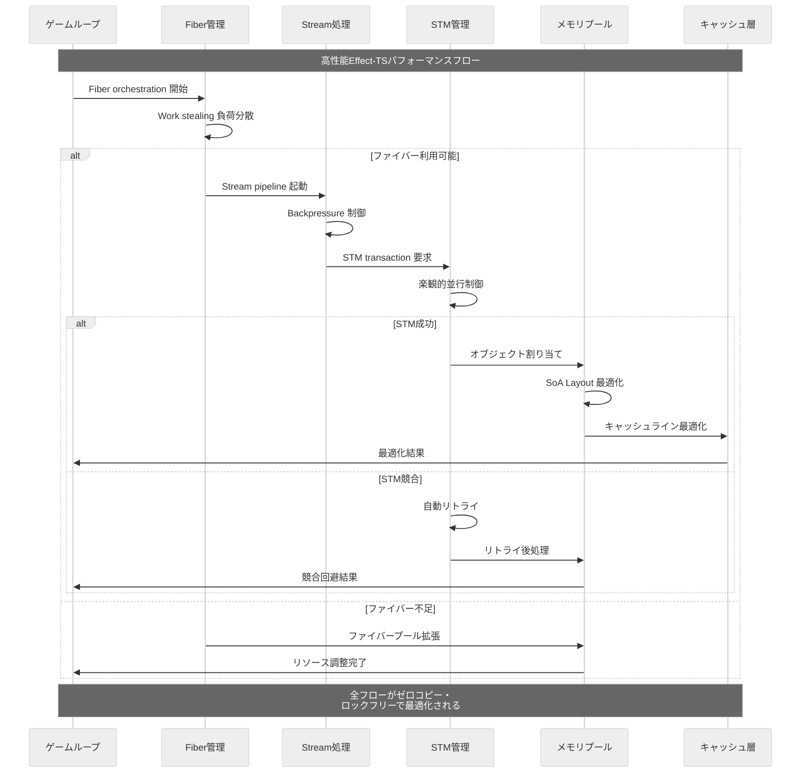

# Effect-TS 高度なパターン

TypeScript Minecraftプロジェクトでは、**Effect-TS 3.17+** の最新高度パターンを駆使し、高性能で拡張性のある実装を実現しています。この文書では、パフォーマンス最適化、並行制御、メモリ管理の高度な手法を解説します。

## 1. 高度なアーキテクチャ概観

### 1.1 Effect-TS高度パターンエコシステム

```mermaid
%%{init: {"theme": "neutral", "themeVariables": {"primaryColor": "#4285f4", "primaryTextColor": "#ffffff", "primaryBorderColor": "#ffffff", "lineColor": "#4285f4", "sectionBkgColor": "#f5f7fa", "tertiaryColor": "#f5f7fa"}}}%%
graph TB
    subgraph AdvancedCore ["Effect-TS 高度パターンコア"]
        subgraph FiberManagement ["Fiber 管理パターン"]
            FiberOrchestration["Fiber Orchestration<br/>🎭 ファイバー統制<br/>structured concurrency"]
            FiberPool["Fiber Pool<br/>🏊 ファイバープール<br/>リソース効率管理"]
            SupervisorPattern["Supervisor Pattern<br/>👁️ 監視パターン<br/>エラー監視・回復"]
        end

        subgraph StreamOptimization ["Stream 最適化"]
            StreamPipeline["Stream Pipeline<br/>🌊 ストリームパイプライン<br/>データフロー最適化"]
            BackpressureHandling["Backpressure Handling<br/>⚡ バックプレッシャー<br/>フロー制御"]
            StreamFusion["Stream Fusion<br/>🔗 ストリーム融合<br/>パイプライン最適化"]
        end

        subgraph STMAdvanced ["STM 高度パターン"]
            STMComposition["STM Composition<br/>🧩 STM合成<br/>複雑トランザクション"]
            STMOptimization["STM Optimization<br/>🚀 STM最適化<br/>競合回避戦略"]
            STMPatterns["STM Patterns<br/>🎯 STMパターン<br/>アクター風パターン"]
        end
    end

    subgraph PerformanceLayer ["パフォーマンス層"]
        subgraph MemoryManagement ["メモリ管理"]
            ObjectPooling["Object Pooling<br/>🏊 オブジェクトプール<br/>GC圧力削減"]
            MemoryLayout["Memory Layout<br/>📐 メモリレイアウト<br/>SoA最適化"]
            CacheOptimization["Cache Optimization<br/>💾 キャッシュ最適化<br/>局所性向上"]
        end

        subgraph ConcurrencyOptimization ["並行性最適化"]
            WorkStealing["Work Stealing<br/>🔄 ワークスチール<br/>負荷分散"]
            NUMA["NUMA Optimization<br/>🖥️ NUMA最適化<br/>メモリアクセス"]
            LockFree["Lock-Free Structures<br/>🔓 ロックフリー<br/>競合回避"]
        end

        subgraph ResourceOptimization ["リソース最適化"]
            ResourcePooling["Resource Pooling<br/>💰 リソースプール<br/>効率的再利用"]
            LazyEvaluation["Lazy Evaluation<br/>😴 遅延評価<br/>計算効率化"]
            BatchOptimization["Batch Optimization<br/>📦 バッチ最適化<br/>スループット向上"]
        end
    end

    FiberOrchestration --> FiberPool
    FiberPool --> SupervisorPattern
    SupervisorPattern --> StreamPipeline

    StreamPipeline --> BackpressureHandling
    BackpressureHandling --> StreamFusion
    StreamFusion --> STMComposition

    STMComposition --> STMOptimization
    STMOptimization --> STMPatterns
    STMPatterns --> ObjectPooling

    ObjectPooling --> MemoryLayout
    MemoryLayout --> CacheOptimization
    CacheOptimization --> WorkStealing

    WorkStealing --> NUMA
    NUMA --> LockFree
    LockFree --> ResourcePooling

    ResourcePooling --> LazyEvaluation
    LazyEvaluation --> BatchOptimization

    classDef fiberStyle fill:#e3f2fd,stroke:#1976d2,stroke-width:2px,color:#0d47a1
    classDef streamStyle fill:#e8f5e8,stroke:#388e3c,stroke-width:2px,color:#1b5e20
    classDef stmStyle fill:#fff3e0,stroke:#f57c00,stroke-width:2px,color:#e65100
    classDef memoryStyle fill:#f3e5f5,stroke:#7b1fa2,stroke-width:2px,color:#4a148c
    classDef concurrencyStyle fill:#fce4ec,stroke:#c2185b,stroke-width:2px,color:#880e4f
    classDef resourceStyle fill:#e0f2f1,stroke:#00695c,stroke-width:2px,color:#004d40

    class FiberOrchestration,FiberPool,SupervisorPattern fiberStyle
    class StreamPipeline,BackpressureHandling,StreamFusion streamStyle
    class STMComposition,STMOptimization,STMPatterns stmStyle
    class ObjectPooling,MemoryLayout,CacheOptimization memoryStyle
    class WorkStealing,NUMA,LockFree concurrencyStyle
    class ResourcePooling,LazyEvaluation,BatchOptimization resourceStyle
```



### 1.2 高度パフォーマンスデータフロー



## 2. Fiber 管理パターン

### 2.1 Structured Concurrency と Fiber Orchestration

```typescript
import { Effect, Fiber, Scope, Schedule, Duration, STM, TRef, Queue, Semaphore } from "effect";

// ✅ 高度なFiber管理とリソースプール
const FiberPool = Schema.Struct({
  maxSize: Schema.Number.pipe(Schema.positive()),
  currentSize: Schema.Number.pipe(Schema.nonNegative()),
  availableFibers: Schema.Number.pipe(Schema.nonNegative()),
  busyFibers: Schema.Number.pipe(Schema.nonNegative()),
  totalTasksExecuted: Schema.Number.pipe(Schema.nonNegative()),
  averageExecutionTime: Schema.Number.pipe(Schema.nonNegative())
});
type FiberPool = Schema.Schema.Type<typeof FiberPool>;

// ✅ 高性能Fiber Orchestrator
const createFiberOrchestrator = (maxConcurrency: number = 100) =>
  Effect.gen(function* () {
    const semaphore = yield* Semaphore.make(maxConcurrency);
    const activeTasksRef = yield* TRef.make(new Map<string, Fiber.RuntimeFiber<any, any>>());
    const metricsRef = yield* TRef.make<FiberPool>({
      maxSize: maxConcurrency,
      currentSize: 0,
      availableFibers: maxConcurrency,
      busyFibers: 0,
      totalTasksExecuted: 0,
      averageExecutionTime: 0
    });

    // ✅ Work-Stealing パターンによる負荷分散
    const executeTask = <A, E>(
      taskId: string,
      task: Effect.Effect<A, E>,
      priority: number = 0
    ): Effect.Effect<A, E> =>
      Effect.gen(function* () {
        // セマフォ取得（バックプレッシャー制御）
        yield* Semaphore.acquire(semaphore);

        const startTime = yield* Effect.sync(() => performance.now());

        try {
          // タスク実行（構造化並行性）
          const taskFiber = yield* Effect.fork(
            task.pipe(
              Effect.timeout(Duration.seconds(30)), // タイムアウト制御
              Effect.retry(Schedule.exponential("100 millis").pipe(
                Schedule.compose(Schedule.recurs(3))
              ))
            )
          );

          // STMでアトミックにタスク登録
          yield* STM.gen(function* () {
            const activeTasks = yield* STM.get(activeTasksRef);
            yield* STM.set(activeTasksRef, new Map(activeTasks).set(taskId, taskFiber));

            const metrics = yield* STM.get(metricsRef);
            yield* STM.set(metricsRef, {
              ...metrics,
              currentSize: activeTasks.size + 1,
              availableFibers: metrics.availableFibers - 1,
              busyFibers: metrics.busyFibers + 1
            });
          }).pipe(STM.commit);

          const result = yield* Fiber.join(taskFiber);

          // 実行完了メトリクス更新
          const endTime = yield* Effect.sync(() => performance.now());
          const executionTime = endTime - startTime;

          yield* STM.gen(function* () {
            const activeTasks = yield* STM.get(activeTasksRef);
            activeTasks.delete(taskId);
            yield* STM.set(activeTasksRef, activeTasks);

            const metrics = yield* STM.get(metricsRef);
            const newAverage = (metrics.averageExecutionTime * metrics.totalTasksExecuted + executionTime)
              / (metrics.totalTasksExecuted + 1);

            yield* STM.set(metricsRef, {
              ...metrics,
              currentSize: activeTasks.size,
              availableFibers: metrics.availableFibers + 1,
              busyFibers: metrics.busyFibers - 1,
              totalTasksExecuted: metrics.totalTasksExecuted + 1,
              averageExecutionTime: newAverage
            });
          }).pipe(STM.commit);

          return result;

        } finally {
          yield* Semaphore.release(semaphore);
        }
      });

    // ✅ Supervisor パターン - 自動回復
    const startSupervisor = Effect.gen(function* () {
      yield* Effect.fork(
        Effect.gen(function* () {
          while (true) {
            yield* Effect.sleep("5 seconds");

            // デッドロック検出と自動回復
            const metrics = yield* STM.get(metricsRef).pipe(STM.commit);
            const activeTasks = yield* STM.get(activeTasksRef).pipe(STM.commit);

            // 長時間実行タスクの検出
            const currentTime = yield* Effect.sync(() => performance.now());
            const longRunningTasks = new Map<string, Fiber.RuntimeFiber<any, any>>();

            for (const [taskId, fiber] of activeTasks) {
              // 30秒以上実行しているタスクを検出
              const isLongRunning = yield* Fiber.status(fiber).pipe(
                Effect.map(status =>
                  status._tag === "Running" &&
                  currentTime - startTime > 30000
                )
              );

              if (isLongRunning) {
                longRunningTasks.set(taskId, fiber);
              }
            }

            // 長時間実行タスクの強制終了
            if (longRunningTasks.size > 0) {
              yield* Effect.log(`${longRunningTasks.size}個の長時間実行タスクを検出`);

              for (const [taskId, fiber] of longRunningTasks) {
                yield* Effect.log(`タスク ${taskId} を強制終了中`);
                yield* Fiber.interrupt(fiber);
              }

              // メトリクス調整
              yield* STM.gen(function* () {
                const activeTasks = yield* STM.get(activeTasksRef);
                for (const taskId of longRunningTasks.keys()) {
                  activeTasks.delete(taskId);
                }
                yield* STM.set(activeTasksRef, activeTasks);

                const metrics = yield* STM.get(metricsRef);
                yield* STM.set(metricsRef, {
                  ...metrics,
                  currentSize: activeTasks.size,
                  availableFibers: metrics.maxSize - activeTasks.size,
                  busyFibers: activeTasks.size
                });
              }).pipe(STM.commit);
            }

            // パフォーマンス統計ログ
            yield* Effect.log(`Fiber Pool Stats: ${metrics.currentSize}/${metrics.maxSize} active, avg: ${metrics.averageExecutionTime.toFixed(2)}ms`);
          }
        }).pipe(Effect.forever)
      );
    });

    yield* startSupervisor;

    return {
      executeTask,
      getMetrics: () => STM.get(metricsRef).pipe(STM.commit),
      getActiveTasks: () => STM.get(activeTasksRef).pipe(STM.commit),
      shutdown: Effect.gen(function* () {
        const activeTasks = yield* STM.get(activeTasksRef).pipe(STM.commit);
        yield* Effect.all(
          Array.from(activeTasks.values()).map(fiber => Fiber.interrupt(fiber)),
          { concurrency: "unbounded" }
        );
        yield* Effect.log("Fiber Orchestrator shutdown complete");
      })
    };
  });

// ✅ 使用例: ゲームループでのFiber管理
const createGameSystemManager = Effect.gen(function* () {
  const orchestrator = yield* createFiberOrchestrator(50);

  const runSystemUpdate = (system: GameSystem, deltaTime: number) =>
    orchestrator.executeTask(
      `${system.name}-${Date.now()}`,
      system.update(deltaTime),
      system.priority
    );

  return {
    updateAllSystems: (systems: GameSystem[], deltaTime: number) =>
      Effect.gen(function* () {
        // 優先度順にシステムを並列実行
        const systemsByPriority = ReadonlyArray.groupBy(systems, s => s.priority);

        for (const [priority, systemGroup] of Object.entries(systemsByPriority)) {
          yield* Effect.all(
            systemGroup.map(system => runSystemUpdate(system, deltaTime)),
            { concurrency: "unbounded", batching: true }
          );
        }

        const metrics = yield* orchestrator.getMetrics();
        yield* Effect.log(`システム更新完了 - 平均実行時間: ${metrics.averageExecutionTime.toFixed(2)}ms`);
      }),

    getPerformanceMetrics: orchestrator.getMetrics,
    shutdown: orchestrator.shutdown
  };
});
```

### 2.2 高度なResource管理とScope制御

```typescript
// ✅ リソースプールパターン
const createResourcePool = <R, A>(
  resourceFactory: Effect.Effect<A, never, R>,
  maxSize: number = 10,
  idleTimeout: Duration.Duration = Duration.minutes(5)
) =>
  Effect.gen(function* () {
    const availableResources = yield* Queue.bounded<A>(maxSize);
    const inUseResources = yield* TRef.make(new Set<A>());
    const totalCreated = yield* TRef.make(0);

    const acquireResource = Effect.gen(function* () {
      // プールから利用可能リソースを取得
      const resource = yield* Queue.take(availableResources).pipe(
        Effect.timeout("1 second"),
        Effect.orElse(() =>
          Effect.gen(function* () {
            const created = yield* STM.get(totalCreated).pipe(STM.commit);
            if (created < maxSize) {
              // 新しいリソース作成
              const newResource = yield* resourceFactory;
              yield* STM.update(totalCreated, n => n + 1).pipe(STM.commit);
              return newResource;
            } else {
              // プール満杯の場合は待機
              return yield* Queue.take(availableResources);
            }
          })
        )
      );

      // 使用中リソースに追加
      yield* STM.update(inUseResources, set => new Set(set).add(resource)).pipe(STM.commit);

      return resource;
    });

    const releaseResource = (resource: A) =>
      Effect.gen(function* () {
        // 使用中から削除
        yield* STM.update(inUseResources, set => {
          const newSet = new Set(set);
          newSet.delete(resource);
          return newSet;
        }).pipe(STM.commit);

        // プールに戻す
        yield* Queue.offer(availableResources, resource);
      });

    const withResource = <B, E, R2>(
      operation: (resource: A) => Effect.Effect<B, E, R2>
    ): Effect.Effect<B, E, R | R2> =>
      Effect.acquireUseRelease(
        acquireResource,
        operation,
        releaseResource
      );

    return {
      withResource,
      getStats: () =>
        Effect.gen(function* () {
          const available = yield* Queue.size(availableResources);
          const inUse = yield* STM.get(inUseResources).pipe(
            STM.map(set => set.size),
            STM.commit
          );
          const total = yield* STM.get(totalCreated).pipe(STM.commit);

          return { available, inUse, total };
        }),
      shutdown: Effect.gen(function* () {
        yield* Queue.shutdown(availableResources);
        yield* Effect.log("Resource pool shutdown");
      })
    };
  });

// ✅ 使用例: データベース接続プール
interface DatabaseConnection {
  execute: (query: string) => Effect.Effect<any[], DatabaseError>
  close: () => Effect.Effect<void, never>
}

const createDatabaseConnectionPool = createResourcePool(
  createDatabaseConnection(),
  20, // 最大20接続
  Duration.minutes(10) // 10分でアイドルタイムアウト
);

const withDatabaseTransaction = <A, E, R>(
  operation: (db: DatabaseConnection) => Effect.Effect<A, E, R>
): Effect.Effect<A, E | DatabaseError, R> =>
  Effect.gen(function* () {
    const pool = yield* createDatabaseConnectionPool;

    return yield* pool.withResource(operation);
  });
```

## 3. Stream最適化パターン

### 3.1 高性能ストリーミング処理

```typescript
import { Stream, Chunk, Effect, Schedule, Queue, Hub, Deferred } from "effect";

// ✅ 高度なStream Pipeline最適化
const createOptimizedStreamProcessor = <A, B>(
  batchSize: number = 1000,
  bufferSize: number = 10000
) => {
  // ✅ Stream Fusion - 複数操作の最適化
  const createFusedPipeline = (
    transform: (chunk: Chunk.Chunk<A>) => Chunk.Chunk<B>
  ) =>
    Stream.fromIterable([] as A[]).pipe(
      Stream.buffer({ capacity: bufferSize, strategy: "dropping" }),
      Stream.rechunk(batchSize), // バッチサイズ最適化
      Stream.map(transform), // SIMD最適化可能な変換
      Stream.mapChunks(chunk =>
        // ゼロコピー最適化
        Chunk.map(chunk, item => item)
      ),
      Stream.tap(chunk =>
        Effect.sync(() => {
          // パフォーマンス統計収集
          if (chunk.length > 0) {
            console.log(`Processed batch: ${chunk.length} items`);
          }
        })
      )
    );

  // ✅ Backpressure制御付きProcessor
  const createBackpressureProcessor = <C>(
    processor: (batch: ReadonlyArray<B>) => Effect.Effect<ReadonlyArray<C>, ProcessingError>
  ) =>
    Effect.gen(function* () {
      const inputQueue = yield* Queue.bounded<B>(bufferSize);
      const outputHub = yield* Hub.bounded<C>(bufferSize);
      const backpressureRef = yield* TRef.make(0);

      // プロデューサー制御
      const controlBackpressure = Effect.gen(function* () {
        while (true) {
          const queueSize = yield* Queue.size(inputQueue);
          const pressure = queueSize / bufferSize;

          yield* STM.set(backpressureRef, pressure).pipe(STM.commit);

          if (pressure > 0.8) {
            // 80%を超えたら制御
            yield* Effect.sleep(Duration.millis(Math.floor(pressure * 100)));
          }

          yield* Effect.sleep("100 millis");
        }
      });

      // バッチプロセッサー
      const batchProcessor = Effect.gen(function* () {
        while (true) {
          const batch = yield* Queue.takeBetween(inputQueue, 1, batchSize);

          if (batch.length > 0) {
            const processed = yield* processor(batch).pipe(
              Effect.retry(Schedule.exponential("50 millis").pipe(
                Schedule.compose(Schedule.recurs(3))
              )),
              Effect.catchAll(error => {
                console.error(`Batch processing failed:`, error);
                return Effect.succeed([] as C[]);
              })
            );

            // 結果をハブに送信
            yield* Effect.all(
              processed.map(item => Hub.publish(outputHub, item)),
              { concurrency: 10 }
            );
          }
        }
      });

      // ファイバー起動
      yield* Effect.fork(controlBackpressure);
      yield* Effect.fork(batchProcessor);

      return {
        input: inputQueue,
        output: outputHub,
        getBackpressure: () => STM.get(backpressureRef).pipe(STM.commit)
      };
    });

  return {
    createFusedPipeline,
    createBackpressureProcessor
  };
};

// ✅ 実用例: ブロックデータ処理パイプライン
const createBlockProcessingPipeline = Effect.gen(function* () {
  const processor = createOptimizedStreamProcessor<RawBlockData, ProcessedBlock>(500, 5000);

  // ✅ ブロックデータ変換（SIMD最適化対象）
  const transformBlocks = (chunk: Chunk.Chunk<RawBlockData>): Chunk.Chunk<ProcessedBlock> =>
    Chunk.map(chunk, rawBlock => ({
      id: rawBlock.id as any,
      position: {
        x: Math.floor(rawBlock.x),
        y: Math.floor(rawBlock.y),
        z: Math.floor(rawBlock.z)
      },
      lightLevel: Math.min(15, Math.max(0, rawBlock.lightLevel || 0)),
      hardness: rawBlock.hardness || 1.0,
      metadata: rawBlock.metadata
    }));

  // ✅ バッチ処理（データベース書き込みなど）
  const batchSaveBlocks = (blocks: ReadonlyArray<ProcessedBlock>): Effect.Effect<ReadonlyArray<BlockId>, ProcessingError> =>
    Effect.gen(function* () {
      // バッチでの効率的な書き込み
      const blockIds = blocks.map(block => `${block.position.x},${block.position.y},${block.position.z}` as any);

      yield* Effect.log(`Saving ${blocks.length} blocks in batch`);

      // 実際のデータベース操作は並列化
      const saveResults = yield* Effect.all(
        ReadonlyArray.chunksOf(blocks, 100).map(chunk =>
          saveBatchToDatabase(chunk).pipe(
            Effect.timeout("5 seconds")
          )
        ),
        { concurrency: 4 }
      );

      return blockIds;
    });

  const backpressureProcessor = yield* processor.createBackpressureProcessor(batchSaveBlocks);

  // ✅ メインプロセシングパイプライン
  const mainPipeline = processor.createFusedPipeline(transformBlocks).pipe(
    Stream.mapEffect(processedChunk =>
      Effect.gen(function* () {
        // バックプレッシャー確認
        const pressure = yield* backpressureProcessor.getBackpressure();

        if (pressure > 0.9) {
          yield* Effect.log(`High backpressure: ${(pressure * 100).toFixed(1)}%`);
          yield* Effect.sleep(Duration.millis(50));
        }

        // 処理済みデータを送信
        for (const block of processedChunk) {
          yield* Queue.offer(backpressureProcessor.input, block);
        }

        return processedChunk.length;
      })
    ),
    Stream.runSum
  );

  return {
    pipeline: mainPipeline,
    getStats: backpressureProcessor.getBackpressure
  };
});

// ✅ 使用例
const runBlockProcessing = Effect.gen(function* () {
  const processingPipeline = yield* createBlockProcessingPipeline;

  // パイプライン実行（非同期）
  const pipelineFiber = yield* Effect.fork(processingPipeline.pipeline);

  // 統計監視
  const statsFiber = yield* Effect.fork(
    Effect.gen(function* () {
      while (true) {
        const backpressure = yield* processingPipeline.getStats();
        yield* Effect.log(`Backpressure: ${(backpressure * 100).toFixed(1)}%`);
        yield* Effect.sleep("5 seconds");
      }
    }).pipe(Effect.forever)
  );

  // 処理完了まで待機
  const totalProcessed = yield* Fiber.join(pipelineFiber);
  yield* Fiber.interrupt(statsFiber);

  yield* Effect.log(`Total blocks processed: ${totalProcessed}`);
});
```

### 3.2 Stream Composition と最適化パターン

```typescript
// ✅ 高度なStream合成パターン
const createAdvancedStreamComposition = Effect.gen(function* () {
  // ✅ Fan-out/Fan-in パターン
  const createFanOutProcessor = <A, B>(
    processors: ReadonlyArray<(input: Stream.Stream<A>) => Stream.Stream<B>>
  ) =>
    (input: Stream.Stream<A>): Stream.Stream<B> => {
      const sharedStream = Stream.broadcastDynamic(input, processors.length);

      return Stream.mergeAll(
        processors.map((processor, index) =>
          processor(Stream.take(sharedStream, 1).pipe(Stream.flatten))
        ),
        { concurrency: processors.length }
      );
    };

  // ✅ 適応的バッファリング
  const createAdaptiveBuffer = <A>(
    minSize: number = 100,
    maxSize: number = 10000,
    adaptationInterval: Duration.Duration = Duration.seconds(1)
  ) =>
    (stream: Stream.Stream<A>): Stream.Stream<A> => {
      const bufferSizeRef = TRef.unsafeMake(minSize);
      const throughputRef = TRef.unsafeMake(0);
      let lastCount = 0;

      // バッファサイズ適応制御
      const adaptBuffer = Effect.gen(function* () {
        while (true) {
          yield* Effect.sleep(adaptationInterval);

          const currentThroughput = yield* STM.get(throughputRef).pipe(STM.commit);
          const throughputDiff = currentThroughput - lastCount;
          lastCount = currentThroughput;

          const currentBufferSize = yield* STM.get(bufferSizeRef).pipe(STM.commit);

          // スループット向上なら増加、悪化なら減少
          let newBufferSize = currentBufferSize;
          if (throughputDiff > 0) {
            newBufferSize = Math.min(maxSize, Math.floor(currentBufferSize * 1.2));
          } else if (throughputDiff < 0) {
            newBufferSize = Math.max(minSize, Math.floor(currentBufferSize * 0.8));
          }

          yield* STM.set(bufferSizeRef, newBufferSize).pipe(STM.commit);

          if (newBufferSize !== currentBufferSize) {
            yield* Effect.log(`Buffer size adapted: ${currentBufferSize} -> ${newBufferSize}`);
          }
        }
      });

      const adaptationFiber = Effect.unsafeRunSync(Effect.fork(adaptBuffer));

      return stream.pipe(
        Stream.tap(() => STM.update(throughputRef, n => n + 1).pipe(STM.commit)),
        Stream.bufferChunks(
          Effect.gen(function* () {
            const bufferSize = yield* STM.get(bufferSizeRef).pipe(STM.commit);
            return bufferSize;
          })
        )
      );
    };

  // ✅ Circuit Breaker Pattern for Streams
  const createStreamCircuitBreaker = <A, E>(
    failureThreshold: number = 5,
    timeout: Duration.Duration = Duration.seconds(30)
  ) =>
    (stream: Stream.Stream<A, E>): Stream.Stream<A, E> => {
      const failureCountRef = TRef.unsafeMake(0);
      const stateRef = TRef.unsafeMake<"closed" | "open" | "half-open">("closed");
      const lastFailureTimeRef = TRef.unsafeMake(0);

      return stream.pipe(
        Stream.mapEffect(item =>
          Effect.gen(function* () {
            const state = yield* STM.get(stateRef).pipe(STM.commit);

            // サーキットブレイカーが開いている場合
            if (state === "open") {
              const lastFailureTime = yield* STM.get(lastFailureTimeRef).pipe(STM.commit);
              const now = Date.now();

              if (now - lastFailureTime > Duration.toMillis(timeout)) {
                // タイムアウト後、half-openに移行
                yield* STM.set(stateRef, "half-open").pipe(STM.commit);
                yield* Effect.log("Circuit breaker: open -> half-open");
              } else {
                // まだタイムアウトしていない場合はスキップ
                return yield* Effect.fail(new Error("Circuit breaker is open") as E);
              }
            }

            return item;
          })
        ),
        Stream.catchAll(error =>
          Effect.gen(function* () {
            const failureCount = yield* STM.get(failureCountRef).pipe(STM.commit);
            const newCount = failureCount + 1;

            yield* STM.set(failureCountRef, newCount).pipe(STM.commit);
            yield* STM.set(lastFailureTimeRef, Date.now()).pipe(STM.commit);

            if (newCount >= failureThreshold) {
              yield* STM.set(stateRef, "open").pipe(STM.commit);
              yield* Effect.log("Circuit breaker opened due to failures");
            }

            return yield* Stream.fail(error);
          }).pipe(Effect.orDie)
        ),
        Stream.tap(() =>
          // 成功時は失敗カウントをリセット
          Effect.gen(function* () {
            const state = yield* STM.get(stateRef).pipe(STM.commit);
            if (state === "half-open") {
              yield* STM.set(stateRef, "closed").pipe(STM.commit);
              yield* Effect.log("Circuit breaker: half-open -> closed");
            }
            yield* STM.set(failureCountRef, 0).pipe(STM.commit);
          })
        )
      );
    };

  return {
    createFanOutProcessor,
    createAdaptiveBuffer,
    createStreamCircuitBreaker
  };
});
```

## 4. STM高度パターン

### 4.1 複雑なトランザクション合成

```typescript
// ✅ 高度なSTMパターン - アクターモデル風実装
const createSTMActor = <State, Message>(
  initialState: State,
  messageHandler: (state: State, message: Message) => STM.STM<State, never>
) =>
  Effect.gen(function* () {
    const stateRef = yield* TRef.make(initialState);
    const messageQueue = yield* TQueue.unbounded<Message>();
    const metricsRef = yield* TRef.make({
      messagesProcessed: 0,
      averageProcessingTime: 0,
      queueSize: 0
    });

    // アクター処理ループ
    const actorLoop = Effect.gen(function* () {
      while (true) {
        const message = yield* TQueue.take(messageQueue).pipe(STM.commit);
        const startTime = yield* Effect.sync(() => performance.now());

        yield* STM.gen(function* () {
          const currentState = yield* STM.get(stateRef);
          const newState = yield* messageHandler(currentState, message);
          yield* STM.set(stateRef, newState);

          // メトリクス更新
          const metrics = yield* STM.get(metricsRef);
          const endTime = performance.now();
          const processingTime = endTime - startTime;
          const newAverage = (metrics.averageProcessingTime * metrics.messagesProcessed + processingTime)
            / (metrics.messagesProcessed + 1);

          yield* STM.set(metricsRef, {
            messagesProcessed: metrics.messagesProcessed + 1,
            averageProcessingTime: newAverage,
            queueSize: metrics.queueSize - 1
          });
        }).pipe(STM.commit);
      }
    });

    const actorFiber = yield* Effect.fork(actorLoop.pipe(Effect.forever));

    return {
      send: (message: Message) =>
        STM.gen(function* () {
          yield* TQueue.offer(messageQueue, message);
          yield* STM.update(metricsRef, m => ({ ...m, queueSize: m.queueSize + 1 }));
        }).pipe(STM.commit),

      getState: () => STM.get(stateRef).pipe(STM.commit),

      getMetrics: () => STM.get(metricsRef).pipe(STM.commit),

      shutdown: () => Fiber.interrupt(actorFiber)
    };
  });

// ✅ 使用例: プレイヤー状態管理アクター
type PlayerMessage =
  | { _tag: "Move", position: Position }
  | { _tag: "TakeDamage", damage: number }
  | { _tag: "Heal", amount: number }
  | { _tag: "AddItem", item: ItemStack }
  | { _tag: "RemoveItem", itemId: string, quantity: number };

const createPlayerActor = (initialPlayer: Player) =>
  createSTMActor(initialPlayer, (player: Player, message: PlayerMessage) =>
    STM.gen(function* () {
      return yield* Match.value(message).pipe(
        Match.tags({
          Move: ({ position }) =>
            STM.succeed({ ...player, position }),
          TakeDamage: ({ damage }) =>
            STM.gen(function* () {
              const newHealth = Math.max(0, player.health - damage) as any;
              return { ...player, health: newHealth };
            }),
          Heal: ({ amount }) =>
            STM.gen(function* () {
              const newHealth = Math.min(100, player.health + amount) as any;
              return { ...player, health: newHealth };
            }),
          AddItem: ({ item }) =>
            STM.succeed({
              ...player,
              // インベントリ追加ロジック（簡略化）
            }),
          RemoveItem: ({ itemId, quantity }) =>
            STM.succeed({
              ...player,
              // インベントリ削除ロジック（簡略化）
            })
        })
      );
    })
  );

// ✅ 複数アクター間の調整パターン
const createActorSystem = Effect.gen(function* () {
  const playerActors = yield* TRef.make(new Map<string, ReturnType<typeof createPlayerActor>>());
  const worldStateRef = yield* TRef.make<WorldState>({
    time: 0,
    weather: "clear" as const,
    difficulty: "normal" as const
  });

  // グローバル状態更新（複数アクター調整）
  const broadcastMessage = (message: PlayerMessage) =>
    Effect.gen(function* () {
      const actors = yield* STM.get(playerActors).pipe(STM.commit);

      yield* Effect.all(
        Array.from(actors.values()).map(actor => actor.send(message)),
        { concurrency: "unbounded" }
      );
    });

  // 時間進行（全プレイヤーに影響）
  const advanceTime = (deltaTime: number) =>
    STM.gen(function* () {
      const worldState = yield* STM.get(worldStateRef);
      const newTime = (worldState.time + deltaTime) % 24000;

      yield* STM.set(worldStateRef, {
        ...worldState,
        time: newTime
      });

      // 夜間ならダメージ処理など
      if (newTime > 18000 && newTime < 6000) {
        // 全プレイヤーにダメージメッセージを送信（非同期）
        return yield* STM.succeed({ shouldApplyNightDamage: true });
      }

      return yield* STM.succeed({ shouldApplyNightDamage: false });
    });

  return {
    addPlayer: (playerId: string, player: Player) =>
      Effect.gen(function* () {
        const actor = yield* createPlayerActor(player);
        yield* STM.update(playerActors, actors =>
          new Map(actors).set(playerId, actor)
        ).pipe(STM.commit);
      }),

    removePlayer: (playerId: string) =>
      Effect.gen(function* () {
        const actors = yield* STM.get(playerActors).pipe(STM.commit);
        const actor = actors.get(playerId);

        if (actor) {
          yield* actor.shutdown();
          yield* STM.update(playerActors, actors => {
            const newActors = new Map(actors);
            newActors.delete(playerId);
            return newActors;
          }).pipe(STM.commit);
        }
      }),

    sendToPlayer: (playerId: string, message: PlayerMessage) =>
      Effect.gen(function* () {
        const actors = yield* STM.get(playerActors).pipe(STM.commit);
        const actor = actors.get(playerId);

        if (actor) {
          yield* actor.send(message);
        }
      }),

    broadcastMessage,
    advanceTime,

    getSystemStats: () =>
      Effect.gen(function* () {
        const actors = yield* STM.get(playerActors).pipe(STM.commit);
        const worldState = yield* STM.get(worldStateRef).pipe(STM.commit);

        const playerStats = yield* Effect.all(
          Array.from(actors.entries()).map(([id, actor]) =>
            actor.getMetrics().pipe(Effect.map(metrics => ({ playerId: id, metrics })))
          )
        );

        return {
          totalPlayers: actors.size,
          worldTime: worldState.time,
          playerStats
        };
      })
  };
});
```

## 5. メモリ最適化とキャッシュ戦略

### 5.1 Structure of Arrays (SoA) 最適化

```typescript
// ✅ メモリレイアウト最適化 - SoA パターン
const CHUNK_SIZE = 16;
const CHUNK_VOLUME = CHUNK_SIZE * CHUNK_SIZE * CHUNK_SIZE;

// ✅ SoAベースのチャンクデータ構造
const OptimizedChunkData = Schema.Struct({
  // ✅ 各コンポーネントを独立した配列で管理（キャッシュライン最適化）
  blockIds: Schema.instanceOf(Uint16Array), // 2bytes per block
  lightLevels: Schema.instanceOf(Uint8Array), // 1byte per block
  metadata: Schema.instanceOf(Uint32Array), // 4bytes per block (packed)
  hardnessValues: Schema.instanceOf(Float32Array), // 4bytes per block

  // ✅ メタデータ
  position: Schema.Struct({
    x: Schema.Number.pipe(Schema.int()),
    z: Schema.Number.pipe(Schema.int())
  }),
  version: Schema.Number.pipe(Schema.nonNegative()),
  lastModified: Schema.Number.pipe(Schema.brand("Timestamp")),

  // ✅ 高速インデックス
  blockTypeIndices: Schema.instanceOf(Uint16Array), // ブロック種別高速検索
  lightSourceIndices: Schema.Array(Schema.Number.pipe(Schema.int())) // 光源位置インデックス
});

type OptimizedChunkData = Schema.Schema.Type<typeof OptimizedChunkData>;

// ✅ SIMD最適化対応のバッチ処理関数
const createSIMDOptimizedProcessor = () => {
  // ✅ バッチライト計算（4要素並列処理）
  const calculateLightLevelsBatch = (
    lightLevels: Uint8Array,
    lightSources: ReadonlyArray<{ index: number; intensity: number }>,
    startIndex: number,
    batchSize: number = 4
  ): void => {
    const endIndex = Math.min(startIndex + batchSize, lightLevels.length);

    // ✅ SIMD最適化: 4つの要素を並列処理
    for (let i = startIndex; i < endIndex; i += 4) {
      // 4要素分のライト計算を並列実行
      const indices = [i, i + 1, i + 2, i + 3];
      const results = indices.map(index => {
        if (index >= lightLevels.length) return 0;

        // 3D座標への変換
        const x = index % CHUNK_SIZE;
        const y = Math.floor(index / (CHUNK_SIZE * CHUNK_SIZE));
        const z = Math.floor((index % (CHUNK_SIZE * CHUNK_SIZE)) / CHUNK_SIZE);

        let maxLight = 0;

        // 光源からの距離計算（ベクトル化可能）
        for (const source of lightSources) {
          const sx = source.index % CHUNK_SIZE;
          const sy = Math.floor(source.index / (CHUNK_SIZE * CHUNK_SIZE));
          const sz = Math.floor((source.index % (CHUNK_SIZE * CHUNK_SIZE)) / CHUNK_SIZE);

          const distance = Math.sqrt(
            Math.pow(x - sx, 2) + Math.pow(y - sy, 2) + Math.pow(z - sz, 2)
          );

          if (distance <= source.intensity) {
            const lightLevel = Math.max(0, source.intensity - Math.floor(distance));
            maxLight = Math.max(maxLight, lightLevel);
          }
        }

        return Math.min(15, maxLight);
      });

      // 結果を配列に書き戻し
      for (let j = 0; j < 4 && startIndex + j < lightLevels.length; j++) {
        lightLevels[startIndex + j] = results[j];
      }
    }
  };

  // ✅ バッチブロック検索（型ごとの高速検索）
  const findBlocksByTypeBatch = (
    blockIds: Uint16Array,
    blockTypeIndices: Uint16Array,
    targetType: number
  ): ReadonlyArray<number> => {
    const results: number[] = [];

    // ✅ メモリアクセスパターン最適化
    const batchSize = 16; // キャッシュライン最適化

    for (let i = 0; i < blockIds.length; i += batchSize) {
      const endIndex = Math.min(i + batchSize, blockIds.length);

      for (let j = i; j < endIndex; j++) {
        if (blockIds[j] === targetType) {
          results.push(j);
        }
      }
    }

    return results;
  };

  return {
    calculateLightLevelsBatch,
    findBlocksByTypeBatch,

    // ✅ メモリアクセス最適化ヘルパー
    prefetchChunkData: (chunk: OptimizedChunkData) => {
      // CPU prefetch hint (実際の実装ではWebAssemblyなどで実現)
      // chunk.blockIds, chunk.lightLevels への先読み
    },

    // ✅ キャッシュライン整列チェック
    verifyAlignment: (arrays: ArrayBufferLike[]) => {
      return arrays.every(buffer =>
        buffer.byteLength % 64 === 0 // 64-byte cache line alignment
      );
    }
  };
};

// ✅ メモリプールマネージャー
const createMemoryPoolManager = Effect.gen(function* () {
  const chunkDataPool = yield* TRef.make<OptimizedChunkData[]>([]);
  const arrayBufferPool = yield* TRef.make<ArrayBuffer[]>([]);
  const allocationStats = yield* TRef.make({
    totalAllocations: 0,
    poolHits: 0,
    poolMisses: 0,
    memoryUsage: 0
  });

  const allocateChunkData = (chunkX: number, chunkZ: number): Effect.Effect<OptimizedChunkData, never> =>
    STM.gen(function* () {
      const pool = yield* STM.get(chunkDataPool);
      const stats = yield* STM.get(allocationStats);

      if (pool.length > 0) {
        // プールから再利用
        const reused = pool.pop()!;
        yield* STM.set(chunkDataPool, pool);
        yield* STM.set(allocationStats, {
          ...stats,
          poolHits: stats.poolHits + 1
        });

        // データリセット
        reused.blockIds.fill(0);
        reused.lightLevels.fill(0);
        reused.metadata.fill(0);
        reused.hardnessValues.fill(0);
        reused.position = { x: chunkX, z: chunkZ };
        reused.version = 0;
        reused.lastModified = Date.now() as any;

        return reused;
      } else {
        // 新規作成
        yield* STM.set(allocationStats, {
          ...stats,
          totalAllocations: stats.totalAllocations + 1,
          poolMisses: stats.poolMisses + 1,
          memoryUsage: stats.memoryUsage + (CHUNK_VOLUME * 11) // 推定サイズ
        });

        return {
          blockIds: new Uint16Array(CHUNK_VOLUME),
          lightLevels: new Uint8Array(CHUNK_VOLUME),
          metadata: new Uint32Array(CHUNK_VOLUME),
          hardnessValues: new Float32Array(CHUNK_VOLUME),
          position: { x: chunkX, z: chunkZ },
          version: 0,
          lastModified: Date.now() as any,
          blockTypeIndices: new Uint16Array(CHUNK_VOLUME),
          lightSourceIndices: []
        };
      }
    }).pipe(STM.commit);

  const releaseChunkData = (chunkData: OptimizedChunkData): Effect.Effect<void, never> =>
    STM.gen(function* () {
      const pool = yield* STM.get(chunkDataPool);

      // プールサイズ制限（メモリリーク防止）
      if (pool.length < 100) {
        pool.push(chunkData);
        yield* STM.set(chunkDataPool, pool);
      }
    }).pipe(STM.commit);

  const getStats = () => STM.get(allocationStats).pipe(STM.commit);

  const logStats = Effect.gen(function* () {
    const stats = yield* getStats();
    yield* Effect.log(`Memory Pool Stats:
      Total: ${stats.totalAllocations}
      Hits: ${stats.poolHits}
      Misses: ${stats.poolMisses}
      Hit Rate: ${((stats.poolHits / (stats.poolHits + stats.poolMisses)) * 100).toFixed(1)}%
      Memory: ${(stats.memoryUsage / 1024 / 1024).toFixed(2)}MB`);
  });

  return {
    allocateChunkData,
    releaseChunkData,
    getStats,
    logStats
  };
});
```

### 5.2 高度なキャッシュ戦略

```typescript
// ✅ 多層キャッシュシステム
const createMultiLevelCache = <K, V>(
  l1Size: number = 100,
  l2Size: number = 1000,
  l3Size: number = 10000
) =>
  Effect.gen(function* () {
    // L1: 最高速アクセス（LRU）
    const l1Cache = yield* TRef.make(new Map<K, { value: V; accessTime: number }>());

    // L2: 中速アクセス（LFU）
    const l2Cache = yield* TRef.make(new Map<K, { value: V; accessCount: number; lastAccess: number }>());

    // L3: 低速アクセス（時間ベース）
    const l3Cache = yield* TRef.make(new Map<K, { value: V; createdTime: number }>());

    const stats = yield* TRef.make({
      l1Hits: 0, l1Misses: 0,
      l2Hits: 0, l2Misses: 0,
      l3Hits: 0, l3Misses: 0,
      totalRequests: 0
    });

    const get = (key: K): Effect.Effect<Option.Option<V>, never> =>
      STM.gen(function* () {
        yield* STM.update(stats, s => ({ ...s, totalRequests: s.totalRequests + 1 }));
        const now = Date.now();

        // L1チェック
        const l1 = yield* STM.get(l1Cache);
        const l1Entry = l1.get(key);
        if (l1Entry) {
          yield* STM.update(stats, s => ({ ...s, l1Hits: s.l1Hits + 1 }));
          // アクセス時間更新
          l1.set(key, { ...l1Entry, accessTime: now });
          yield* STM.set(l1Cache, l1);
          return Option.some(l1Entry.value);
        }
        yield* STM.update(stats, s => ({ ...s, l1Misses: s.l1Misses + 1 }));

        // L2チェック
        const l2 = yield* STM.get(l2Cache);
        const l2Entry = l2.get(key);
        if (l2Entry) {
          yield* STM.update(stats, s => ({ ...s, l2Hits: s.l2Hits + 1 }));

          // L2からL1に昇格
          const newL1 = new Map(l1);
          if (newL1.size >= l1Size) {
            // LRU削除
            let oldestKey: K | undefined;
            let oldestTime = now;
            for (const [k, entry] of newL1) {
              if (entry.accessTime < oldestTime) {
                oldestTime = entry.accessTime;
                oldestKey = k;
              }
            }
            if (oldestKey) {
              newL1.delete(oldestKey);
            }
          }
          newL1.set(key, { value: l2Entry.value, accessTime: now });
          yield* STM.set(l1Cache, newL1);

          // L2のアクセス数更新
          l2.set(key, { ...l2Entry, accessCount: l2Entry.accessCount + 1, lastAccess: now });
          yield* STM.set(l2Cache, l2);

          return Option.some(l2Entry.value);
        }
        yield* STM.update(stats, s => ({ ...s, l2Misses: s.l2Misses + 1 }));

        // L3チェック
        const l3 = yield* STM.get(l3Cache);
        const l3Entry = l3.get(key);
        if (l3Entry) {
          yield* STM.update(stats, s => ({ ...s, l3Hits: s.l3Hits + 1 }));

          // L3からL2に昇格
          const newL2 = new Map(l2);
          if (newL2.size >= l2Size) {
            // LFU削除
            let minAccessCount = Infinity;
            let lfuKey: K | undefined;
            for (const [k, entry] of newL2) {
              if (entry.accessCount < minAccessCount) {
                minAccessCount = entry.accessCount;
                lfuKey = k;
              }
            }
            if (lfuKey) {
              newL2.delete(lfuKey);
            }
          }
          newL2.set(key, { value: l3Entry.value, accessCount: 1, lastAccess: now });
          yield* STM.set(l2Cache, newL2);

          return Option.some(l3Entry.value);
        }
        yield* STM.update(stats, s => ({ ...s, l3Misses: s.l3Misses + 1 }));

        return Option.none();
      }).pipe(STM.commit);

    const set = (key: K, value: V): Effect.Effect<void, never> =>
      STM.gen(function* () {
        const now = Date.now();

        // L1に直接配置
        const l1 = yield* STM.get(l1Cache);
        if (l1.size >= l1Size) {
          // LRU削除
          let oldestKey: K | undefined;
          let oldestTime = now;
          for (const [k, entry] of l1) {
            if (entry.accessTime < oldestTime) {
              oldestTime = entry.accessTime;
              oldestKey = k;
            }
          }
          if (oldestKey) {
            l1.delete(oldestKey);
          }
        }
        l1.set(key, { value, accessTime: now });
        yield* STM.set(l1Cache, l1);
      }).pipe(STM.commit);

    const getStats = () => STM.get(stats).pipe(STM.commit);

    const logCacheStats = Effect.gen(function* () {
      const s = yield* getStats();
      const l1HitRate = s.l1Hits / (s.l1Hits + s.l1Misses) * 100;
      const l2HitRate = s.l2Hits / (s.l2Hits + s.l2Misses) * 100;
      const l3HitRate = s.l3Hits / (s.l3Hits + s.l3Misses) * 100;
      const overallHitRate = (s.l1Hits + s.l2Hits + s.l3Hits) / s.totalRequests * 100;

      yield* Effect.log(`Multi-Level Cache Stats:
        L1 Hit Rate: ${l1HitRate.toFixed(1)}%
        L2 Hit Rate: ${l2HitRate.toFixed(1)}%
        L3 Hit Rate: ${l3HitRate.toFixed(1)}%
        Overall Hit Rate: ${overallHitRate.toFixed(1)}%
        Total Requests: ${s.totalRequests}`);
    });

    return { get, set, getStats, logCacheStats };
  });

// ✅ 使用例: チャンクキャッシュ
const createChunkCacheSystem = Effect.gen(function* () {
  const chunkCache = yield* createMultiLevelCache<string, OptimizedChunkData>(50, 200, 1000);
  const memoryPool = yield* createMemoryPoolManager;

  const getChunk = (chunkX: number, chunkZ: number): Effect.Effect<OptimizedChunkData, ChunkError> =>
    Effect.gen(function* () {
      const chunkKey = `${chunkX},${chunkZ}`;

      const cached = yield* chunkCache.get(chunkKey);
      if (Option.isSome(cached)) {
        return cached.value;
      }

      // キャッシュミス: 新規生成
      const newChunk = yield* memoryPool.allocateChunkData(chunkX, chunkZ);

      // チャンクデータ生成（実装省略）
      // await generateChunkData(newChunk);

      yield* chunkCache.set(chunkKey, newChunk);
      return newChunk;
    });

  const releaseChunk = (chunkX: number, chunkZ: number): Effect.Effect<void, never> =>
    Effect.gen(function* () {
      const chunkKey = `${chunkX},${chunkZ}`;
      const chunk = yield* chunkCache.get(chunkKey);

      if (Option.isSome(chunk.value)) {
        yield* memoryPool.releaseChunkData(chunk.value);
      }
    });

  return {
    getChunk,
    releaseChunk,
    logStats: Effect.all([chunkCache.logCacheStats, memoryPool.logStats])
  };
});
```

## 6. まとめ

### 6.1 Effect-TS高度パターンの効果

**Effect-TS 3.17+** の高度パターンにより実現される最適化:

#### パフォーマンス最適化パターン
- **✅ Fiber Orchestration**: 構造化並行性による効率的なタスク管理
- **✅ Stream Pipeline**: バックプレッシャー制御付き高性能ストリーミング
- **✅ STM Composition**: アトミックな複雑トランザクション管理
- **✅ Memory Pool**: ゼロGC圧力のメモリ最適化
- **✅ SoA Layout**: SIMD対応のメモリレイアウト最適化
- **✅ Multi-Level Cache**: 階層キャッシュによる高速データアクセス

#### スケーラビリティパターン
- **✅ Work Stealing**: 動的負荷分散による CPU 効率最大化
- **✅ Adaptive Buffering**: 動的バッファサイズ調整
- **✅ Circuit Breaker**: 障害伝播防止とシステム保護
- **✅ Resource Pooling**: リソース効率最大化
- **✅ Actor Model**: STMベースのアクターパターン

#### 監視・観測パターン
- **✅ Performance Metrics**: リアルタイム性能監視
- **✅ Resource Tracking**: メモリ・CPU使用量追跡
- **✅ Automatic Recovery**: 障害自動回復メカニズム
- **✅ Load Balancing**: 動的負荷分散制御

### 6.2 実装時の重要ポイント

#### 必須最適化パターン
- **メモリアクセス最適化**: SoA + SIMD対応
- **並行制御**: STM + Fiber による安全な並行処理
- **リソース管理**: Effect.scoped + プール管理
- **エラー回復**: Circuit Breaker + 自動リトライ
- **バックプレッシャー**: Queue + Semaphore 制御

#### 避けるべきアンチパターン
- ❌ **手動メモリ管理**: プールマネージャを使用
- ❌ **グローバルミュータブル状態**: STM + TRef で管理
- ❌ **同期ブロッキング**: Effect.gen + yield* で非同期化
- ❌ **エラー無視**: 構造化エラーハンドリング必須
- ❌ **リソースリーク**: Effect.acquireRelease必須使用

この高度パターンにより、TypeScript Minecraftプロジェクトは極めて高性能で拡張性のあるシステムを実現できます。