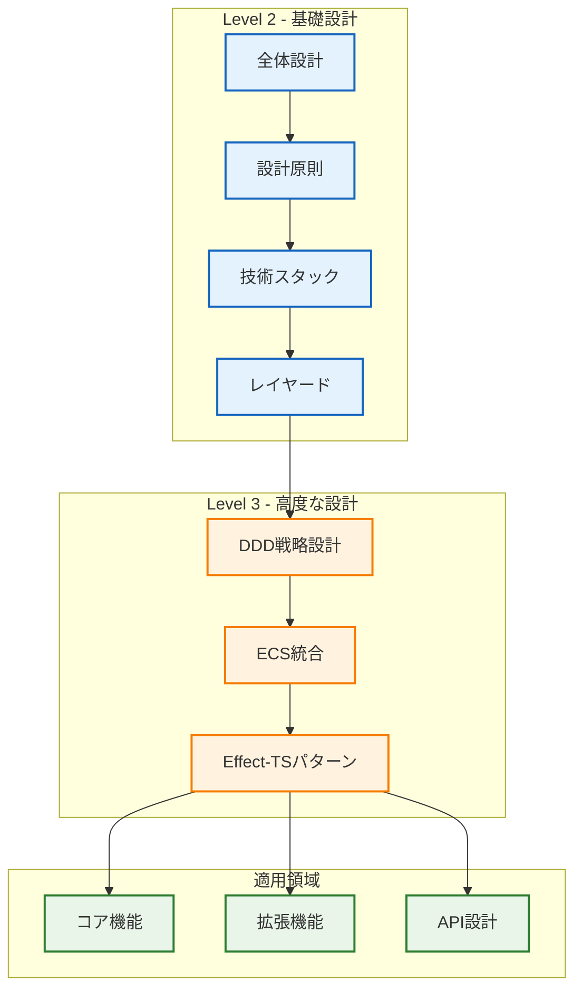

# アーキテクチャ設計（Level 2-3 推奨）

## 🧭 スマートナビゲーション

> **📍 現在位置**: ホーム → アーキテクチャ
> **🎯 学習目標**: DDD・ECS・Effect-TS統合理解
> **⏱️ 所要時間**: 45-60分
> **📚 前提知識**: [プロジェクト概要](../00-introduction/00-project-overview.md)

TypeScript Minecraft Cloneプロジェクトのアーキテクチャ設計に関するドキュメント群です。

## 📊 アーキテクチャマップ

## 📚 ドキュメント一覧

### 🏗️ Level 2 - 基礎設計（必須）

- **[全体設計](00-overall-design.md)** - システム全体のアーキテクチャ概要
  - **前提知識**: [プロジェクト概要](../00-introduction/00-project-overview.md)
  - **次のステップ**: [設計原則](01-design-principles.md)
  - **関連項目**: [コア機能概要](../02-specifications/00-core-features/README.md)

- **[設計原則](01-design-principles.md)** - プロジェクトの設計原則と思想
  - **前提知識**: [全体設計](00-overall-design.md)
  - **次のステップ**: [技術スタック](03-technology-stack.md)
  - **関連項目**: [開発規約](../03-guides/00-development-conventions.md)

- **[技術スタック](03-technology-stack.md)** - 採用技術とその選択理由
  - **前提知識**: [設計原則](01-design-principles.md)
  - **次のステップ**: [レイヤードアーキテクチャ](04-layered-architecture.md)
  - **関連項目**: [スタートガイド](../00-introduction/01-getting-started.md)

- **[レイヤードアーキテクチャ](04-layered-architecture.md)** - 4層アーキテクチャの詳細
  - **前提知識**: [技術スタック](03-technology-stack.md)
  - **次のステップ**: [DDD戦略設計](02-ddd-strategic-design.md)
  - **関連項目**: [エントリーポイント](../03-guides/01-entry-points.md)

### 🎯 Level 3 - 高度な設計（推奨）

- **[DDD戦略設計](02-ddd-strategic-design.md)** - ドメイン駆動設計の戦略的パターン
  - **前提知識**: [レイヤードアーキテクチャ](04-layered-architecture.md)
  - **次のステップ**: [ECS統合](05-ecs-integration.md)
  - **関連項目**: [ドメインAPI設計](../02-specifications/02-api-design/00-domain-application-apis.md)

- **[ECS統合](05-ecs-integration.md)** - Entity Component Systemの統合方法
  - **前提知識**: [DDD戦略設計](02-ddd-strategic-design.md)
  - **次のステップ**: [Effect-TSパターン](06-effect-ts-patterns.md)
  - **関連項目**: [エンティティシステム](../02-specifications/00-core-features/04-entity-system.md)

- **[Effect-TSパターン](06-effect-ts-patterns.md)** - 関数型プログラミングパターン
  - **前提知識**: [ECS統合](05-ecs-integration.md)
  - **次のステップ**: [開発規約](../03-guides/00-development-conventions.md)
  - **関連項目**: [Effect-TSテストパターン](../03-guides/07-effect-ts-testing-patterns.md)

## アーキテクチャの特徴

### 🏗️ **レイヤード設計**
- **ドメイン**: ドメインロジックの中核
- **アプリケーション**: アプリケーションサービス
- **インフラストラクチャ**: 技術的実装
- **プレゼンテーション**: UI/UXレイヤー

### 🎯 **DDD適用**
- 戦略的設計による境界づけられたコンテキスト
- 戦術的パターンによる型安全性
- ドメインイベントによる疎結合

### ⚡ **ECS統合**
- 高性能なゲームループ
- コンポーネント指向設計
- データ指向最適化

### 🔄 **関数型パターン**
- Effect-TSによる副作用管理
- 型安全な依存性注入
- 宣言的プログラミング

## 関連リソース

- **[仕様書](../02-specifications/)** - 詳細な機能仕様
- **[ガイド](../03-guides/)** - 実装・テストガイド
- **[用語集](../04-appendix/00-glossary.md)** - 技術用語定義

## クイックスタート

1. **[全体設計](00-overall-design.md)** でシステム概要を把握
2. **[設計原則](01-design-principles.md)** で設計思想を理解
3. **[DDD戦略設計](02-ddd-strategic-design.md)** でドメイン構造を学習
4. **[ECS統合](05-ecs-integration.md)** でゲームアーキテクチャを理解

---

💡 **ヒント**: 新規開発者は上記の順序で読み進めることを推奨します。
