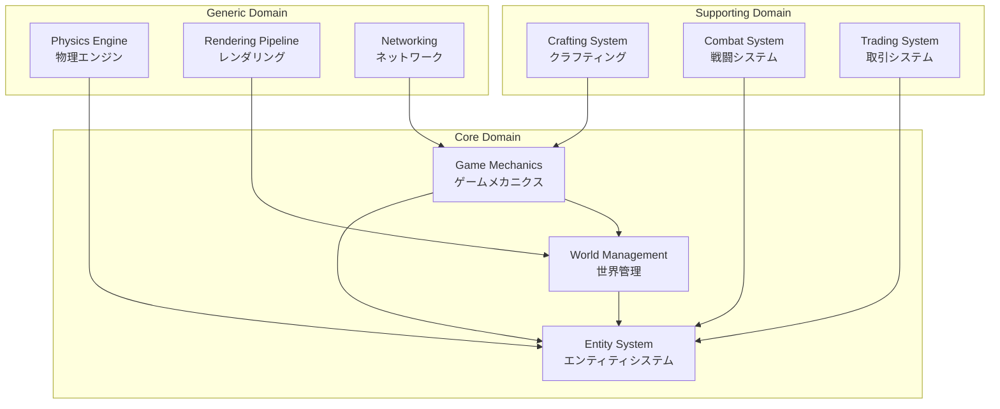

# DDD戦略的設計

```typescript
import { Effect, Match, Option } from "effect"
```

## 1. ドメインコンテキストマップ
  
TypeScript Minecraft Cloneのドメインは、複数の境界づけられたコンテキスト（Bounded Context）に分割されます。



## 2. 境界づけられたコンテキスト
### 2.1 World Management Context（世界管理コンテキスト）

**責務**: ゲーム世界の生成、永続化、チャンク管理

```typescript
// ユビキタス言語 - World Management Context

// 中核概念
export interface World {
  readonly id: WorldId
  readonly seed: WorldSeed
  readonly chunks: ChunkCollection
  readonly worldBorder: WorldBorder
  readonly spawnPoint: SpawnPoint
}

export interface Chunk {
  readonly coordinate: ChunkCoordinate
  readonly blocks: BlockArray
  readonly biome: Biome
  readonly heightMap: HeightMap
  readonly lightMap: LightMap
}

export interface Block {
  readonly type: BlockType
  readonly state: BlockState
  readonly metadata: BlockMetadata
}

// ドメインサービス
export interface ChunkGenerationService {
  generate: (coordinate: ChunkCoordinate, seed: WorldSeed) =>
    Effect.Effect<Chunk, GenerationError>
}

export interface WorldPersistenceService {
  save: (world: World) => Effect.Effect<void, PersistenceError>
  load: (id: WorldId) => Effect.Effect<World, LoadError>
}
```

### 2.2 Game Mechanics Context（ゲームメカニクスコンテキスト）

**責務**: ゲームルール、プレイヤーアクション、ゲーム進行

```typescript
// Game Mechanics Context

// ゲームルール
export interface GameRules {
  readonly difficulty: Difficulty
  readonly pvpEnabled: boolean
  readonly keepInventory: boolean
  readonly mobGriefing: boolean
  readonly daylightCycle: boolean
  readonly weatherCycle: boolean
}

// プレイヤーアクション
export type PlayerAction =
  | { _tag: "Move"; direction: Direction; sprint: boolean }
  | { _tag: "Jump" }
  | { _tag: "PlaceBlock"; position: Position; block: BlockType }
  | { _tag: "BreakBlock"; position: Position }
  | { _tag: "UseItem"; item: ItemId; target?: EntityId }
  | { _tag: "OpenInventory" }
  | { _tag: "Craft"; recipe: RecipeId }

// ゲーム進行
export interface GameProgression {
  readonly time: GameTime
  readonly weather: Weather
  readonly events: ReadonlyArray<GameEvent>
}

// ドメインサービス
export interface ActionProcessor {
  process: (action: PlayerAction, context: GameContext) =>
    Effect.Effect<ActionResult, ActionError>
}

export interface ProgressionService {
  tick: (world: World, deltaTime: number) =>
    Effect.Effect<World, ProgressionError>
}
```

### 2.3 Entity System Context（エンティティシステムコンテキスト）

**責務**: エンティティ管理、コンポーネント、動作制御

```typescript
// Entity System Context

// エンティティ定義
export interface Entity {
  readonly id: EntityId
  readonly type: EntityType
  readonly components: ComponentMap
}

export type EntityType =
  | "Player"
  | "Mob"
  | "Item"
  | "Projectile"
  | "Vehicle"
  | "Decoration"

// コンポーネント型
export interface ComponentMap {
  readonly position?: PositionComponent
  readonly velocity?: VelocityComponent
  readonly health?: HealthComponent
  readonly ai?: AIComponent
  readonly inventory?: InventoryComponent
  readonly equipment?: EquipmentComponent
}

// エンティティ管理
export interface EntityManager {
  spawn: (type: EntityType, position: Position) =>
    Effect.Effect<EntityId, SpawnError>

  despawn: (id: EntityId) =>
    Effect.Effect<void, DespawnError>

  query: <T extends ComponentMap>(predicate: ComponentPredicate<T>) =>
    Effect.Effect<ReadonlyArray<Entity>, QueryError>
}
```

## 3. コンテキスト間の関係

### 3.1 コンテキストマッピング

```typescript
// Shared Kernel (共有カーネル)

// 共通の値オブジェクト
export interface Position {
  readonly x: number
  readonly y: number
  readonly z: number
}

export interface Direction {
  readonly yaw: number
  readonly pitch: number
}

export interface BoundingBox {
  readonly min: Position
  readonly max: Position
}

// Anti-Corruption Layer (腐敗防止層)

// 外部システムとの変換層
export const fromMinecraftProtocol = (
  packet: MinecraftPacket
): Effect.Effect<PlayerAction, ConversionError> =>
  Match.value(packet.type).pipe(
    Match.when("player_position", () =>
      Effect.succeed({
        _tag: "Move" as const,
        direction: calculateDirection(packet.data),
        sprint: packet.data.sprinting
      })
    ),
    Match.when("block_place", () =>
      Effect.succeed({
        _tag: "PlaceBlock" as const,
        position: packet.data.position,
        block: packet.data.blockId
      })
    ),
    Match.orElse(() => Effect.fail(new UnknownPacketError(packet)))
  )
```

### 3.2 統合パターン

```typescript
// Published Language (公開言語)

export type WorldEvent =
  | ChunkGeneratedEvent
  | ChunkUnloadedEvent
  | BlockChangedEvent

export interface ChunkGeneratedEvent {
  readonly _tag: "ChunkGenerated"
  readonly coordinate: ChunkCoordinate
  readonly timestamp: Timestamp
}

export interface BlockChangedEvent {
  readonly _tag: "BlockChanged"
  readonly position: Position
  readonly oldBlock: BlockType
  readonly newBlock: BlockType
  readonly cause: EntityId | "Natural"
}

// Customer-Supplier (顧客-供給者)

// World Management は Entity System のサプライヤー
export const worldToEntityAdapter = {
  getEntitiesInChunk: (chunk: Chunk): ReadonlyArray<EntityId> =>
    chunk.entities,

  notifyChunkLoaded: (coordinate: ChunkCoordinate) =>
    Effect.gen(function* () {
      const entities = yield* EntityManager.query(
        withinChunk(coordinate)
      )
      yield* activateEntities(entities)
    })
}
```

## 4. アグリゲート識別

### 4.1 World Aggregate（世界アグリゲート）

```typescript
// World Aggregate

// アグリゲートルート
export interface WorldAggregate {
  readonly id: WorldId
  readonly chunks: ReadonlyMap<ChunkId, Chunk>
  readonly loadedRegions: ReadonlySet<RegionId>
  readonly worldSettings: WorldSettings
}

// 不変条件
export const worldAggregateInvariants = {
  // チャンクは隣接チャンクとの一貫性を保つ
  adjacentChunkConsistency: (world: WorldAggregate): boolean => {
    for (const [id, chunk] of world.chunks) {
      const adjacent = getAdjacentChunks(world, chunk.coordinate)
      if (!validateBoundaries(chunk, adjacent)) {
        return false
      }
    }
    return true
  },

  // ロード済み領域は連続している
  loadedRegionContinuity: (world: WorldAggregate): boolean => {
    return isRegionSetContinuous(world.loadedRegions)
  }
}

// アグリゲート操作
export const worldAggregateOperations = {
  loadChunk: (world: WorldAggregate, coordinate: ChunkCoordinate) =>
    Effect.gen(function* () {
      // 早期リターン: チャンクロード可能性チェック
      const loadable = yield* validateChunkLoadable(world, coordinate)
      if (!loadable) {
        return yield* Effect.fail(new ChunkNotLoadableError({ coordinate }))
      }

      const chunk = yield* generateOrLoadChunk(coordinate)
      const adjacentUpdates = yield* updateAdjacentChunks(world, chunk)

      const updatedWorld = {
        ...world,
        chunks: new Map([
          ...world.chunks,
          [chunk.id, chunk],
          ...adjacentUpdates
        ])
      }

      // 早期リターン: 不変条件チェック
      const isConsistent = worldAggregateInvariants.adjacentChunkConsistency(updatedWorld)
      if (!isConsistent) {
        return yield* Effect.fail(new InvariantViolationError())
      }

      return updatedWorld
    })
}
```

### 4.2 Player Aggregate（プレイヤーアグリゲート）

```typescript
// Player Aggregate

// アグリゲートルート
export interface PlayerAggregate {
  readonly id: PlayerId
  readonly profile: PlayerProfile
  readonly stats: PlayerStats
  readonly inventory: Inventory
  readonly equipment: Equipment
  readonly advancements: Advancements
}

// エンティティ
export interface Inventory {
  readonly slots: ReadonlyArray<ItemStack | null>
  readonly selectedSlot: number
}

export interface Equipment {
  readonly helmet: ItemStack | null
  readonly chestplate: ItemStack | null
  readonly leggings: ItemStack | null
  readonly boots: ItemStack | null
}

// 値オブジェクト
export interface ItemStack {
  readonly item: ItemId
  readonly count: number
  readonly damage: number
  readonly enchantments: ReadonlyArray<Enchantment>
}

// アグリゲート操作
export const playerAggregateOperations = {
  addItem: (player: PlayerAggregate, item: ItemStack) =>
    Effect.gen(function* () {
      // 早期リターン: 空きスロットチェック
      const emptySlot = findEmptySlot(player.inventory)
      if (!emptySlot) {
        return yield* Effect.fail(new InventoryFullError())
      }

      // 早期リターン: アイテム有効性チェック
      if (item.count <= 0) {
        return yield* Effect.fail(new InvalidItemError({ item }))
      }

      return {
        ...player,
        inventory: {
          ...player.inventory,
          slots: setSlot(player.inventory.slots, emptySlot, item)
        }
      }
    }),

  equipItem: (player: PlayerAggregate, slotIndex: number) =>
    Effect.gen(function* () {
      // 早期リターン: スロット範囲チェック
      if (slotIndex < 0 || slotIndex >= player.inventory.slots.length) {
        return yield* Effect.fail(new InvalidSlotIndexError({ slotIndex }))
      }

      // 早期リターン: アイテム存在チェック
      const item = player.inventory.slots[slotIndex]
      if (!item) {
        return yield* Effect.fail(new SlotEmptyError())
      }

      // 早期リターン: 装備可能性チェック
      const equipmentSlot = getEquipmentSlot(item.item)
      if (!equipmentSlot) {
        return yield* Effect.fail(new NotEquipableError())
      }

      return swapEquipment(player, slotIndex, equipmentSlot)
    })
}
```

## 5. ドメインイベント設計

### 5.1 イベントソーシング

```typescript
// Event Sourcing

// イベントストア
export interface EventStore {
  append: (aggregateId: AggregateId, events: ReadonlyArray<DomainEvent>) =>
    Effect.Effect<void, EventStoreError>

  load: (aggregateId: AggregateId) =>
    Effect.Effect<ReadonlyArray<DomainEvent>, EventStoreError>

  subscribe: (handler: EventHandler) =>
    Effect.Effect<Subscription, SubscriptionError>
}

// イベント適用
export const applyEvents = <T>(
  initial: T,
  events: ReadonlyArray<DomainEvent>,
  reducer: (state: T, event: DomainEvent) => T
): T =>
  events.reduce(reducer, initial)

// スナップショット
export interface SnapshotStore {
  save: (aggregateId: AggregateId, snapshot: Snapshot) =>
    Effect.Effect<void, SnapshotError>

  load: (aggregateId: AggregateId) =>
    Effect.Effect<Option.Option<Snapshot>, SnapshotError>
}
```

### 5.2 サーガパターン

```typescript
// Sagas

// チャンク生成サーガ
export const chunkGenerationSaga = Effect.gen(function* () {
  const events = yield* EventStore.subscribe(isChunkRequestedEvent)

  yield* Stream.runForEach(events, (event) =>
    Effect.gen(function* () {
      // 1. チャンク生成開始
      yield* publishEvent(ChunkGenerationStarted(event.coordinate))

      try {
        // 2. 地形生成
        const terrain = yield* generateTerrain(event.coordinate)
        yield* publishEvent(TerrainGenerated(event.coordinate))

        // 3. 構造物生成
        const structures = yield* generateStructures(event.coordinate)
        yield* publishEvent(StructuresGenerated(event.coordinate))

        // 4. エンティティ配置
        const entities = yield* placeEntities(event.coordinate)
        yield* publishEvent(EntitiesPlaced(event.coordinate))

        // 5. チャンク生成完了
        yield* publishEvent(ChunkGenerationCompleted(event.coordinate))
      } catch (error) {
        // 補償トランザクション
        yield* publishEvent(ChunkGenerationFailed(event.coordinate, error))
        yield* rollbackChunkGeneration(event.coordinate)
      }
    })
  )
})
```

## 6. まとめ

戦略的設計により：
- **明確な境界**: 各コンテキストが独立して進化可能
- **共通言語**: チーム内での認識の統一
- **統合の明確化**: コンテキスト間の関係が明示的
- **変更の局所化**: 変更の影響範囲を最小化

次のドキュメント：
- [01-tactical-design.md](./01-tactical-design.md) - 戦術的設計パターン
- [02-aggregates.md](./02-aggregates.md) - アグリゲート設計の詳細
