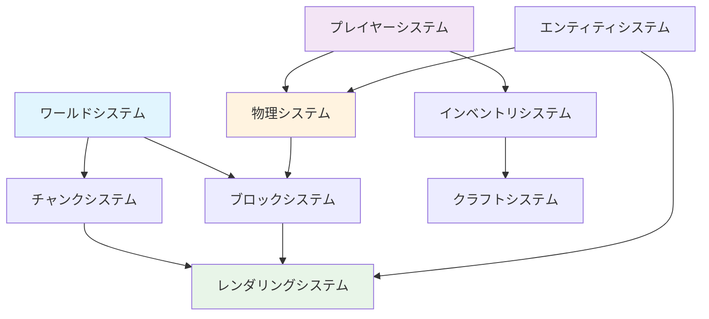

# コア機能 - Minecraftの基本機能

## 概要

コア機能は、Minecraftクローンとして必須となる基本機能群です。これらの機能は、Effect-TS 3.17+の最新パターン（Schema.Struct、@app/ServiceNameネームスペース）とDDDの境界づけられたコンテキストを使用して実装されています。

全ての機能はStructure of Arrays (SoA) ECSアーキテクチャに基づき、パフォーマンスを最大化しつつ、純粋関数型プログラミングの原則を維持しています。

## アーキテクチャ原則

### 1. 純粋関数型設計
- **クラス禁止**: 全てのロジックを純粋関数として実装
- **イミュータブル**: 全てのデータ構造を不変として扱い
- **Effect包含**: 全ての操作をEffect型で包含

### 2. 最新Effect-TSパターン
- **Schema.Struct**: Data.struct廃止、Schema.Structに統一
- **@app/ServiceName**: Context.GenericTag使用時の統一ネームスペース
- **Schema.TaggedError**: エラー定義の統一パターン
- **Schema.annotations**: メタデータ付与による詳細化
- **早期リターン**: バリデーション失敗時の即座なEffect.fail

### 3. SoA ECSアーキテクチャ
- **コンポーネント分離**: Position、Velocity、Renderingなど個別管理
- **システム並列処理**: 独立したシステムの並列実行
- **メモリ効率**: 連続配列による高速アクセス

## コア機能一覧

### 1. ワールドシステム (World System)
- **チャンク生成と管理**: 16x16x384サイズチャンク
- **地形生成**: パーリンノイズベースの自然地形
- **バイオーム処理**: 温度・湿度による生態系管理
- **光源伝播**: ブロック・スカイライトの動的計算

### 2. プレイヤーシステム (Player System)
- **移動・ジャンプ**: 物理法則に準拠した移動系
- **視点制御**: 一人称/三人称視点切り替え
- **ブロック操作**: 配置・破壊のレイキャスト実装
- **インベントリ管理**: 36スロット+ホットバー管理

### 3. ブロックシステム (Block System)
- **ブロックタイプ定義**: 400+種類のブロック仕様
- **物理演算**: 重力・流体・爆発への応答
- **状態管理**: ブロック状態（向き・接続等）
- **更新システム**: 隣接ブロックの相互作用

### 4. エンティティシステム (Entity System)
- **動的スポーン**: バイオーム・時間・難易度連動
- **AI実装**: ステートマシンベースの行動制御
- **物理演算**: 重力・衝突・摩擦の統合処理
- **当たり判定**: AABB（軸並行境界ボックス）

### 5. レンダリングシステム (Rendering System)
- **メッシュ生成**: グリーディメッシング最適化
- **テクスチャ管理**: アトラス・ミップマップ対応
- **視錐台カリング**: フラストラムによる描画最適化
- **LOD管理**: 距離別の詳細度制御

### 6. 物理システム (Physics System)
- **重力システム**: 9.8m/s²の統一重力処理
- **衝突検出**: 空間分割による高速検索
- **流体シミュレーション**: 水・溶岩の伝播系
- **爆発処理**: 球体範囲の破壊・ノックバック

### 7. チャンク管理システム (Chunk System)
- **動的ロード**: プレイヤー視野に基づく管理
- **圧縮保存**: NBT形式によるディスク保存
- **メモリ管理**: LRUキャッシュによる効率化
- **並列処理**: ワーカースレッドでの生成処理

### 8. インベントリシステム (Inventory System)
- **アイテム管理**: スタック・耐久度・エンチャント
- **GUI統合**: 各種コンテナとの連携
- **ドラッグ＆ドロップ**: 直感的操作インターフェース
- **永続化**: NBT形式でのセーブ・ロード

### 9. クラフトシステム (Crafting System)
- **レシピ管理**: JSON定義による柔軟な拡張性
- **クラフト台**: 3x3グリッドでの組み合わせ判定
- **かまど処理**: 燃料消費・精錬時間の管理
- **エンチャント**: 経験値消費による装備強化

### 10. マテリアルシステム (Material System)
- **マテリアル定義**: 各ブロック・アイテムのマテリアル属性
- **ツール効率**: マテリアル別の採掘速度・適正ツール
- **クラフト素材**: 素材の組み合わせとレシピ管理
- **耐久度システム**: マテリアル別の耐久性とエンチャント効果

### 11. シーン管理システム (Scene Management System)
- **シーン遷移制御**: スタート→メイン→ゲームオーバー画面の管理
- **状態機械パターン**: 関数型状態機械による型安全な遷移
- **ライフサイクル管理**: シーンの初期化・更新・終了処理
- **スタック管理**: シーン履歴とポップ・プッシュ操作

## ⚠️ 重要な未実装機能

以下の機能は**Minecraft体験にとって必須**ですが、現在のコア機能には含まれていません：

### 🔥 クリティカル機能（即実装が必要）
- **体力 & 空腹システム**: プレイヤーの生存システム
- **戦闘システム**: 戦闘・ダメージ・死亡処理
- **Mobスポーン**: モンスターの自動生成とルール
- **死亡 & リスポーン**: 死亡処理とリスポーン地点
- **サウンド & 音楽システム**: 効果音・BGM・3D音響効果
- **食料 & 農業システム**: 農業・畜産・食料システム
- **ツール耐久度システム**: ツール耐久度とメンテナンス
- **経験値 & レベルアップ**: 経験値・レベル・スキルシステム

### 🏗️ 高優先度機能（近期実装が望ましい）
- **構造物生成**: 村・ダンジョン・要塞の生成
- **拡張バイオーム**: 海洋・山岳・特殊バイオーム
- **看板 & 本システム**: 看板・本・文字システム
- **ベッド & 睡眠システム**: ベッド・睡眠・時間スキップ
- **コマンド & デバッグシステム**: ゲーム内コマンド・デバッグ機能
- **マップ & ナビゲーション**: 地図・コンパス・座標システム

### 🌱 生態系・環境機能
- **動物の繁殖 & 手懐け**: 動物の繁殖・手懐け
- **植物の成長 & 林業**: 植物の成長・伐採システム
- **高度なレッドストーン部品**: 比較器・中継器・高度な回路

### 🌐 マルチプレイヤー機能
- **ネットワークアーキテクチャ**: クライアント・サーバー基盤
- **プレイヤー同期**: マルチプレイヤー状態同期
- **コミュニケーション**: チャット・ボイス機能
- **ジ・エンド次元**: エンダードラゴン・エンドシティ

詳細は [**不足機能一覧**](../07-missing-features.md) を参照してください。

## 実装ガイドライン

### 1. Layer構成パターン

```typescript
// コア機能の統合Layer
export const CoreFeaturesLayer = Layer.mergeAll(
  WorldSystemLayer,
  PlayerSystemLayer,
  BlockSystemLayer,
  EntitySystemLayer,
  RenderingSystemLayer,
  PhysicsSystemLayer,
  ChunkSystemLayer,
  InventorySystemLayer,
  CraftingSystemLayer,
  SceneSystemLayer
).pipe(
  Layer.provide(ConfigLayer),
  Layer.provide(LoggingLayer),
  Layer.provide(MetricsLayer)
)

// 開発・テスト用の軽量Layer
export const CoreFeaturesTestLayer = Layer.mergeAll(
  TestWorldSystemLayer,
  TestPlayerSystemLayer,
  TestPhysicsSystemLayer,
  TestSceneSystemLayer
).pipe(
  Layer.provide(TestConfigLayer)
)
```

### 2. Service定義パターン（最新）

```typescript
// ❌ 古いパターン - classベース (廃止)
// export class WorldService extends Context.GenericTag("WorldService")<...>() {}

// ❌ 古い統一されていないエラー定義 (廃止)
// export class ServiceError extends Schema.TaggedError("ServiceError")<{
//   message: string
// }> {}

// ✅ 新しいパターン - @app/ネームスペース
export const WorldService = Context.GenericTag<{
  readonly generateChunk: (coord: ChunkCoordinate) =>
    Effect.Effect<Chunk, ChunkGenerationError>
  readonly loadChunk: (coord: ChunkCoordinate) =>
    Effect.Effect<Chunk, ChunkLoadError>
  readonly unloadChunk: (coord: ChunkCoordinate) =>
    Effect.Effect<void, never>
  readonly getBlockAt: (pos: Position) =>
    Effect.Effect<Option.Option<Block>, never>
  readonly setBlockAt: (pos: Position, block: Block) =>
    Effect.Effect<void, WorldUpdateError>
}>("@app/WorldService")

// レイヤー実装
export const WorldServiceLive = Layer.succeed(
  WorldService,
  WorldService.of({
    generateChunk: (coord) => generateChunkImpl(coord),
    loadChunk: (coord) => loadChunkImpl(coord),
    unloadChunk: (coord) => unloadChunkImpl(coord),
    getBlockAt: (pos) => getBlockAtImpl(pos),
    setBlockAt: (pos, block) => setBlockAtImpl(pos, block)
  })
)
```

### 3. Schema定義パターン（最新）

```typescript
// 基本座標系
export const Position = Schema.Struct({
  x: Schema.Number,
  y: Schema.Number,
  z: Schema.Number
})
export type Position = Schema.Schema.Type<typeof Position>

// チャンク座標（整数制約付き）
export const ChunkCoordinate = Schema.Struct({
  x: Schema.Number.pipe(Schema.int()),
  z: Schema.Number.pipe(Schema.int())
})
export type ChunkCoordinate = Schema.Schema.Type<typeof ChunkCoordinate>

// ブロック定義
export const BlockType = Schema.Literal("air", "stone", "dirt", "wood", "leaves")
export const Block = Schema.Struct({
  type: BlockType,
  properties: Schema.optional(Schema.Record(Schema.String, Schema.Unknown)),
  metadata: Schema.optional(Schema.Number.pipe(Schema.int(), Schema.min(0), Schema.max(15)))
})
export type Block = Schema.Schema.Type<typeof Block>

// エラー定義 - Effect-TS 3.x標準化パターン
export namespace CoreSystemErrors {
  export class ChunkGenerationError extends Schema.TaggedError("CoreSystemErrors.ChunkGenerationError")<{
    readonly chunkX: number
    readonly chunkZ: number
    readonly biome: string
    readonly generationStep: string
    readonly seed: number
    readonly underlyingError?: unknown
    readonly performance: {
      readonly startTime: number
      readonly duration: number
      readonly memoryUsed: number
    }
    readonly timestamp: number
  }> {}

  export class WorldUpdateError extends Schema.TaggedError("CoreSystemErrors.WorldUpdateError")<{
    readonly position: Position
    readonly updateType: string
    readonly reason: string
    readonly previousValue?: unknown
    readonly newValue?: unknown
    readonly affectedEntities: ReadonlyArray<string>
    readonly rollbackPossible: boolean
    readonly timestamp: number
  }> {}

  export class PlayerMovementError extends Schema.TaggedError("CoreSystemErrors.PlayerMovementError")<{
    readonly playerId: string
    readonly currentPosition: Position
    readonly targetPosition: Position
    readonly movementType: string
    readonly reason: string
    readonly collisionDetails?: {
      readonly collisionType: string
      readonly obstaclePosition: Position
      readonly obstacleType: string
    }
    readonly validationFailures: ReadonlyArray<string>
    readonly timestamp: number
  }> {}

  export class SystemPerformanceError extends Schema.TaggedError("CoreSystemErrors.SystemPerformanceError")<{
    readonly systemName: string
    readonly frameTime: number
    readonly maxAllowedTime: number
    readonly cpuUsage: number
    readonly memoryUsage: number
    readonly entityCount: number
    readonly chunkCount: number
    readonly performanceMetrics: Record<string, number>
    readonly timestamp: number
  }> {}

  export class ECSSystemError extends Schema.TaggedError("CoreSystemErrors.ECSSystemError")<{
    readonly systemName: string
    readonly componentTypes: ReadonlyArray<string>
    readonly entityCount: number
    readonly processingStage: string
    readonly reason: string
    readonly failedEntityId?: string
    readonly recoveryAction?: string
    readonly timestamp: number
  }> {}

  export class SoAOptimizationError extends Schema.TaggedError("CoreSystemErrors.SoAOptimizationError")<{
    readonly arrayType: string
    readonly arraySize: number
    readonly expectedSize: number
    readonly memoryLayout: string
    readonly alignmentIssue: boolean
    readonly performanceImpact: number
    readonly suggestedFix: string
    readonly timestamp: number
  }> {}
}

export type CoreSystemError =
  | CoreSystemErrors.ChunkGenerationError
  | CoreSystemErrors.WorldUpdateError
  | CoreSystemErrors.PlayerMovementError
  | CoreSystemErrors.SystemPerformanceError
  | CoreSystemErrors.ECSSystemError
  | CoreSystemErrors.SoAOptimizationError
```

### 4. 早期リターンパターン

```typescript
// バリデーション付き処理関数 - Effect-TS 3.x最新パターン
const processPlayerMovement = (
  playerId: string,
  currentPosition: Position,
  targetPosition: unknown,
  movementType: string = "walk"
): Effect.Effect<Position, CoreSystemErrors.PlayerMovementError> =>
  Effect.gen(function* () {
    // 早期リターン: プレイヤーID検証
    if (!playerId.trim()) {
      return yield* Effect.fail(
        new CoreSystemErrors.PlayerMovementError({
          playerId,
          currentPosition,
          targetPosition: { x: 0, y: 0, z: 0 }, // デフォルト値
          movementType,
          reason: "無効なプレイヤーID - 空文字列は許可されません",
          validationFailures: ["playerId.empty"],
          timestamp: Date.now()
        })
      )
    }

    // Schema バリデーション - 最新API使用
    const validPosition = yield* Schema.decodeUnknown(Position)(targetPosition).pipe(
      Effect.mapError((error) =>
        new CoreSystemErrors.PlayerMovementError({
          playerId,
          currentPosition,
          targetPosition: { x: 0, y: 0, z: 0 },
          movementType,
          reason: `座標バリデーション失敗: ${error.message}`,
          validationFailures: [
            `schema.validation.failed`,
            `field: ${error.path?.join('.') || 'unknown'}`,
            `expected: Position`,
            `actual: ${typeof targetPosition}`
          ],
          timestamp: Date.now()
        })
      )
    )

    // 距離制限チェック
    const distance = calculateDistance(currentPosition, validPosition)
    const maxDistance = getMaxMovementDistance(movementType)

    if (distance > maxDistance) {
      return yield* Effect.fail(
        new CoreSystemErrors.PlayerMovementError({
          playerId,
          currentPosition,
          targetPosition: validPosition,
          movementType,
          reason: `移動距離が制限を超過: ${distance.toFixed(2)}m > ${maxDistance}m`,
          validationFailures: [
            `movement.distance.exceeded`,
            `distance: ${distance}`,
            `max_allowed: ${maxDistance}`,
            `movement_type: ${movementType}`
          ],
          timestamp: Date.now()
        })
      )
    }

    // 衝突検出
    const collision = yield* checkCollision(currentPosition, validPosition)

    if (collision.detected) {
      return yield* Effect.fail(
        new CoreSystemErrors.PlayerMovementError({
          playerId,
          currentPosition,
          targetPosition: validPosition,
          movementType,
          reason: `移動経路上に障害物を検出: ${collision.obstacleType}`,
          collisionDetails: {
            collisionType: collision.type,
            obstaclePosition: collision.position,
            obstacleType: collision.obstacleType
          },
          validationFailures: [
            `movement.collision.detected`,
            `obstacle_type: ${collision.obstacleType}`,
            `collision_position: ${JSON.stringify(collision.position)}`
          ],
          timestamp: Date.now()
        })
      )
    }

    // ビジネスロジック実行
    const playerService = yield* PlayerService
    return yield* playerService.movePlayer(playerId, validPosition, movementType)
  })

// 純粋関数による距離計算
const calculateDistance = (from: Position, to: Position): number => {
  const dx = to.x - from.x
  const dy = to.y - from.y
  const dz = to.z - from.z
  return Math.sqrt(dx * dx + dy * dy + dz * dz)
}

// 移動タイプ別の最大距離取得
const getMaxMovementDistance = (movementType: string): number => {
  switch (movementType) {
    case "walk": return 4.3
    case "sprint": return 5.6
    case "fly": return 11.0
    case "teleport": return 1000.0
    default: return 4.3
  }
}

// 衝突検出の型安全な実装
interface CollisionResult {
  readonly detected: boolean
  readonly type: string
  readonly position: Position
  readonly obstacleType: string
}

const checkCollision = (from: Position, to: Position): Effect.Effect<CollisionResult, never> =>
  Effect.succeed({
    detected: false,
    type: "none",
    position: from,
    obstacleType: "none"
  }) // 簡略実装
```

## パフォーマンス考慮事項

### 1. SoA ECS最適化
- **コンポーネント分離**: Position[], Velocity[], Health[]の分離格納
- **システム並列実行**: MovementSystem、RenderSystemの独立処理
- **キャッシュ効率**: 連続メモリアクセスによる高速化
- **バッチ処理**: 同種操作の一括実行

### 2. チャンク管理最適化
- **視野距離管理**: プレイヤー中心16チャンクの動的ロード
- **段階的アンロード**: 距離24→32→48での段階的解放
- **圧縮保存**: zlib圧縮による70%ディスク使用量削減
- **LRUキャッシュ**: 最近使用1000チャンクのメモリ保持

### 3. レンダリング最適化
- **グリーディメッシング**: 隣接面結合による50%頂点削減
- **インスタンシング**: 同種ブロックの一括描画
- **視錐台カリング**: フラストラム外ブロックの描画除外
- **LOD制御**: 距離に応じた16→8→4段階の詳細度

### 4. 物理演算最適化
- **空間分割**: Octreeによる衝突検出範囲限定
- **休眠システム**: 静止エンティティの計算除外
- **段階的更新**: 距離による1/2/4フレーム分割更新
- **並列処理**: WebWorkerによる物理計算オフロード

## テスト戦略

### 1. 単体テスト（純粋関数）

```typescript
import { Effect, TestContext, TestClock } from "effect"
import { describe, test, expect } from "@effect/vitest"

export const WorldSystemTests = describe("WorldSystem", () => {
  test("チャンク生成の純粋性", () =>
    Effect.gen(function* () {
      const coord = { x: 0, z: 0 }

      // 同じ座標での生成は同じ結果を返す
      const chunk1 = yield* generateChunk(coord)
      const chunk2 = yield* generateChunk(coord)

      expect(chunk1).toEqual(chunk2)
    }).pipe(
      Effect.provide(TestWorldServiceLayer),
      Effect.provide(TestContext.TestContext)
    ))

  test("ブロック配置のバリデーション", () =>
    Effect.gen(function* () {
      const invalidPos = { x: -1, y: -64, z: 999999 }

      // 無効座標でのブロック配置は失敗する
      const result = yield* setBlockAt(invalidPos, { type: "stone" }).pipe(
        Effect.either
      )

      expect(Either.isLeft(result)).toBe(true)
    }))
})
```

### 2. 統合テスト（システム間連携）

```typescript
export const SystemIntegrationTests = describe("System統合", () => {
  test("プレイヤー移動→チャンクロード→レンダリング連携", () =>
    Effect.gen(function* () {
      const testClock = yield* TestClock.TestClock

      // プレイヤーを新しいチャンクに移動
      const playerService = yield* PlayerService
      yield* playerService.movePlayer("test-player", { x: 256, y: 64, z: 256 })

      // 非同期チャンクロードの完了を待機
      yield* TestClock.adjust("5 seconds")

      // チャンクがロードされていることを確認
      const chunkService = yield* ChunkService
      const chunk = yield* chunkService.getChunk({ x: 16, z: 16 })

      expect(Option.isSome(chunk)).toBe(true)
    }).pipe(
      Effect.provide(CoreFeaturesTestLayer),
      Effect.provide(TestContext.TestContext),
      Effect.provide(TestClock.TestClock)
    ))
})
```

### 3. パフォーマンステスト

```typescript
export const PerformanceTests = describe("パフォーマンス", () => {
  test("1000エンティティの物理計算", () =>
    Effect.gen(function* () {
      // 1000エンティティを生成
      const entities = Array.from({ length: 1000 }, (_, i) =>
        createTestEntity(i, randomPosition()))

      const startTime = yield* Effect.sync(() => performance.now())

      // 物理システム1フレーム実行
      const physicsSystem = yield* PhysicsSystem
      yield* physicsSystem.updateAll(entities)

      const endTime = yield* Effect.sync(() => performance.now())
      const duration = endTime - startTime

      // 16msフレーム内での完了を確認
      expect(duration).toBeLessThan(16)
    }))
})
```

## システム間の依存関係



### システム構成

**基盤システム**:
1. **ワールドシステム** - 世界の基盤構築
2. **ブロックシステム** - ブロックデータ管理
3. **チャンクシステム** - メモリ・ディスク管理

**プレイヤーシステム**:
4. **プレイヤーシステム** - プレイヤー操作
5. **物理システム** - 移動・衝突
6. **レンダリングシステム** - 3D描画

**拡張システム**:
7. **エンティティシステム** - NPC・モブ
8. **インベントリシステム** - アイテム管理
9. **クラフトシステム** - 製作システム
10. **シーン管理システム** - 画面遷移制御

## 関連ドキュメント

**基盤システム**:
- [ワールド管理システム](./01-world-management-system.md) - 世界・バイオーム・地形生成
- [ブロックシステム](./03-block-system.md) - ブロックタイプ・状態管理
- [チャンクシステム](./07-chunk-system.md) - チャンク分割・ロード管理

**プレイヤーシステム**:
- [プレイヤーシステム](./02-player-system.md) - 移動・操作・ステータス
- [物理システム](./06-physics-system.md) - 重力・衝突・流体
- [レンダリングシステム](./05-rendering-system.md) - 3D描画・最適化

**拡張システム**:
- [エンティティシステム](./04-entity-system.md) - エンティティ・AI・スポーン
- [インベントリシステム](./01-inventory-system.md) - インベントリ・アイテム
- [クラフトシステム](./02-crafting-system.md) - クラフト・レシピ・エンチャント
- [シーン管理システム](./11-scene-management-system.md) - シーン管理・画面遷移

**アーキテクチャ関連**:
- [全体設計](../../01-architecture/00-overall-design.md) - システム全体設計
- [DDD戦略的設計](../../01-architecture/02-ddd-strategic-design.md) - 境界づけられたコンテキスト
- [ECS統合](../../01-architecture/05-ecs-integration.md) - ECSアーキテクチャ
- [Effect-TSパターン](../../01-architecture/06-effect-ts-patterns.md) - 関数型パターン

## 用語集

- **アグリゲート (Aggregate)**: DDDの境界として機能するエンティティ群 ([詳細](../../04-appendix/00-glossary.md#aggregate))
- **コンポーネント (Component)**: ECSのC、エンティティに付与されるデータ ([詳細](../../04-appendix/00-glossary.md#component))
- **ドメイン駆動設計 (Domain-Driven Design)**: ドメイン駆動設計アプローチ ([詳細](../../04-appendix/00-glossary.md#ddd))
- **Effect (エフェクト)**: Effect-TSにおける副作用の統一表現 ([詳細](../../04-appendix/00-glossary.md#effect))
- **エンティティコンポーネントシステム (Entity Component System)**: ゲーム開発のアーキテクチャパターン ([詳細](../../04-appendix/00-glossary.md#ecs))
- **スキーマ (Schema)**: Effect-TSにおけるデータ構造定義 ([詳細](../../04-appendix/00-glossary.md#schema))
- **Structure of Arrays (SoA)**: パフォーマンス最適化のためのメモリレイアウト ([詳細](../../04-appendix/00-glossary.md#soa))
