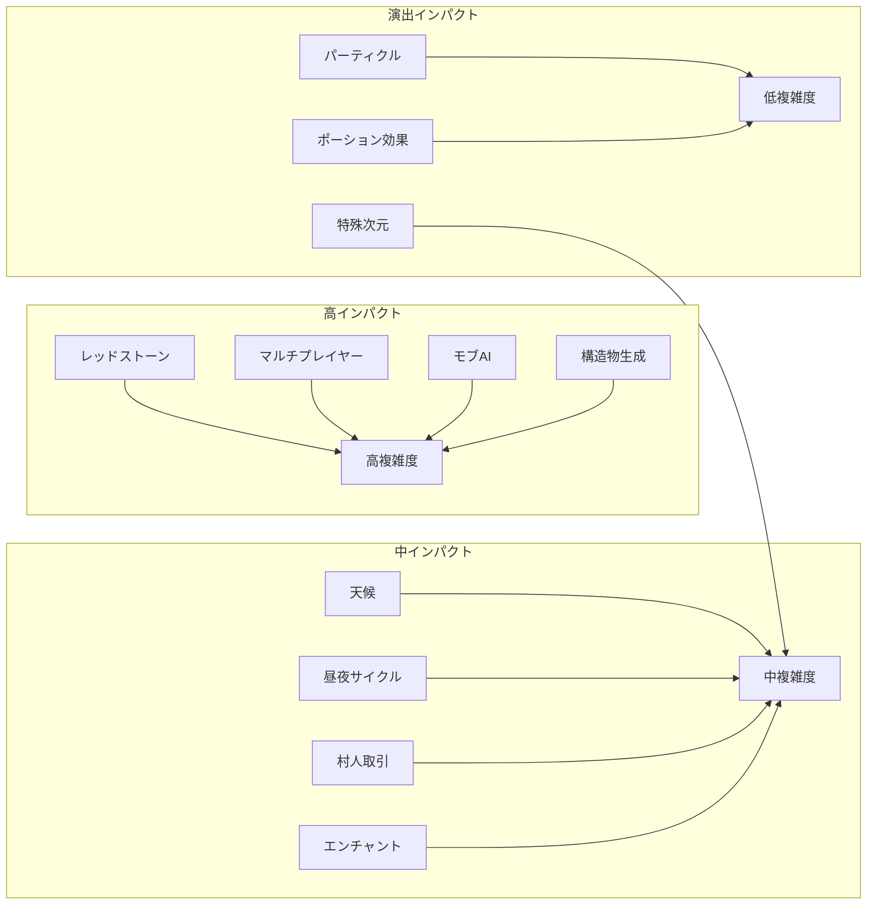
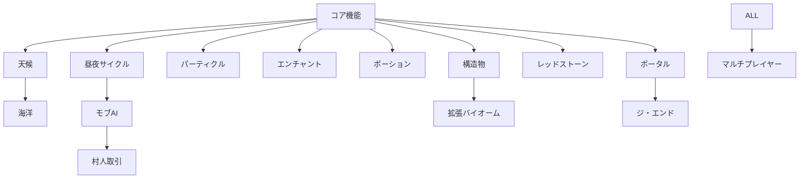

# 拡張機能仕様書

Minecraft Cloneの高度なゲーム機能と体験向上のための仕様書です。これらはコア機能に加えて、より豊かで奥深いゲーム体験を提供します。

## ✨ 機能カテゴリ

### 🔧 **エンジニアリング・テクノロジー**
- **[レッドストーンシステム](01-redstone-system.md)** - 論理回路、自動化、メカニズム
- **[エンチャントシステム](06-enchantment-system.md)** - アイテム強化、魔法効果

### 🌦️ **環境・世界システム**
- **[天候システム](02-weather-system.md)** - 雨、雪、雷、気候変動
- **[昼夜サイクル](03-day-night-cycle.md)** - 時間経過、光源、季節変化
- **[拡張バイオームシステム](12-extended-biome-system.md)** - 多様な生態系、特殊地形

### 🧬 **生物・AI・相互作用**
- **[モブAIシステム](04-mob-ai-system.md)** - 人工知能、行動パターン、学習
- **[村人取引](05-villager-trading.md)** - 経済システム、NPC相互作用
- **[ポーション効果](07-potion-effects.md)** - バフ・デバフ、魔法システム

### 🌊 **特殊環境・地形**
- **[海洋・水中システム](11-ocean-underwater-system.md)** - 海洋生物、水中呼吸、水流
- **[構造物生成](09-structure-generation.md)** - 村、遺跡、ダンジョン生成

### 🌌 **次元・ポータル**
- **[ネザーポータル](08-nether-portals.md)** - 異次元移動、ポータル技術
- **[ジ・エンド次元](13-the-end-dimension.md)** - エンドラゴン、エンダーパール

### 🎨 **視覚効果・演出**
- **[パーティクルシステム](14-particle-system.md)** - 視覚効果、環境演出

### 🌐 **ネットワーク・マルチプレイ**
- **[マルチプレイヤーアーキテクチャ](10-multiplayer-architecture.md)** - オンライン対応、同期システム

## 🎯 機能マトリックス

### 実装複雑度 vs 体験インパクト

## 🚀 開発ロードマップ

### Phase 1: 基盤システム
**前提条件**: [コア機能](../00-core-features/) Tier1-2 完成
1. **昼夜サイクル** - 時間管理基盤
2. **天候システム** - 環境変化基盤
3. **パーティクルシステム** - 視覚効果基盤

### Phase 2: インタラクティブ要素
4. **エンチャント** - アイテムシステム拡張
5. **ポーション効果** - プレイヤー状態拡張
6. **村人取引** - NPC相互作用

### Phase 3: 高度なシステム
7. **モブAI** - 複雑な行動パターン
8. **構造物生成** - ワールド生成拡張
9. **拡張バイオーム** - 環境多様化

### Phase 4: エンジニアリング・次元
10. **レッドストーン** - 論理システム
11. **ネザーポータル** - 次元システム
12. **海洋・水中** - 特殊環境
13. **ジ・エンド** - エンドゲームコンテンツ

### Phase 5: スケールアウト
14. **マルチプレイヤー** - ネットワーク対応

## 🔗 システム依存関係

## 💡 実装戦略

### 🧩 **モジュラー設計**
各拡張機能は独立したモジュールとして設計し、
コア機能への影響を最小限に抑制します。

### 🎚️ **段階的実装**
複雑な機能は基本版から始めて、
段階的に機能を拡張していきます。

**例: レッドストーンシステム**
1. 基本回路 (AND, OR, NOT)
2. 信号伝播
3. 複雑な回路 (時計、計算機)
4. 自動化システム

### 🔄 **互換性維持**
新機能追加時も既存のセーブデータと
下位互換性を維持します。

## 📊 品質基準

### ⚡ **パフォーマンス**
- **フレームレート**: 60fps維持
- **メモリ使用量**: コア機能+20%以内
- **ネットワーク**: レイテンシ100ms以内

### 🧪 **テストカバレッジ**
- **ユニットテスト**: 80%以上
- **統合テスト**: 主要フロー100%
- **E2Eテスト**: クリティカルパス100%

### 🔐 **セキュリティ**
- **入力検証**: 全外部入力
- **権限管理**: マルチプレイヤー機能
- **データ整合性**: セーブデータ保護

## 🔗 関連ドキュメント

- **[コア機能](../00-core-features/)** - 基盤システムの仕様
- **[API設計](../02-api-design/)** - システム間インタフェース
- **[アーキテクチャ](../../01-architecture/)** - システム設計原則
- **[開発ガイド](../../03-guides/)** - 実装・テスト手法

---

🎮 **注意**: 拡張機能は段階的に実装し、各フェーズでプレイヤー体験の向上を確認しながら進めてください。