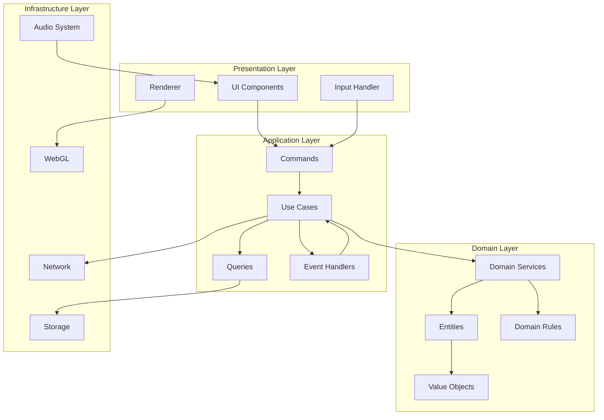
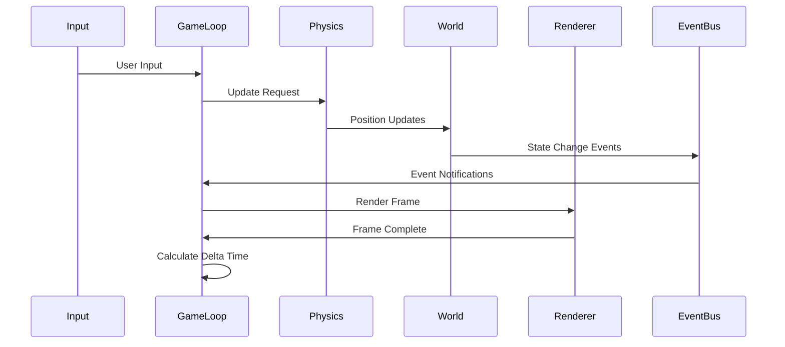
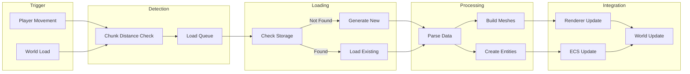
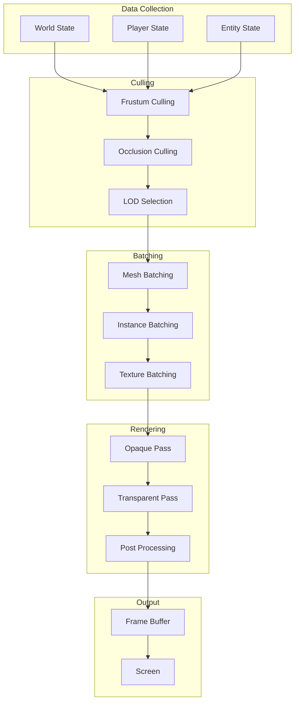

# データフロー図

## 概要

TypeScript Minecraftにおけるデータの流れを視覚的に表現した仕様書です。DDD層構造に基づいたデータフローと、Effect-TSによる関数型データ変換パイプラインを定義します。

## レイヤー間データフロー



## コアゲームループのデータフロー



## プレイヤーアクションフロー

### ブロック配置フロー

```typescript
// データフロー定義
export const BlockPlacementFlow = {
  // 1. Input Layer
  input: (event: MouseEvent) => ({
    button: event.button,
    position: { x: event.clientX, y: event.clientY },
    timestamp: Date.now()
  }),

  // 2. Presentation to Application
  toCommand: (input: Input): PlaceBlockCommand => ({
    _tag: 'PlaceBlock',
    playerId: getCurrentPlayerId(),
    screenPosition: input.position,
    timestamp: input.timestamp
  }),

  // 3. Application Processing
  processCommand: (cmd: PlaceBlockCommand) => Effect.gen(function* () {
    // 座標変換
    const worldPos = yield* screenToWorld(cmd.screenPosition)

    // バリデーション
    yield* validatePlacement(worldPos)

    // ドメインロジック実行
    const block = yield* BlockService.pipe(
      Effect.flatMap(service =>
        service.place({
          blockType: getSelectedBlock(),
          position: worldPos
        })
      )
    )

    // イベント発行
    yield* EventBusService.pipe(
      Effect.flatMap(bus =>
        bus.publish({
          _tag: 'BlockPlaced',
          position: worldPos,
          blockType: block.type,
          placedBy: cmd.playerId
        })
      )
    )

    return block
  }),

  // 4. Domain to Infrastructure
  persistBlock: (block: Block) => Effect.gen(function* () {
    const storage = yield* ChunkStorageAdapter
    const chunk = toChunkPosition(block.position)

    yield* storage.updateChunk({
      position: chunk,
      updates: [block]
    })
  }),

  // 5. Rendering Update
  updateVisuals: (block: Block) => Effect.gen(function* () {
    const renderer = yield* WebGLRendererAdapter

    yield* renderer.updateMesh({
      meshId: getMeshId(block.position),
      updates: {
        geometry: createBlockGeometry(block.type),
        material: getBlockMaterial(block.type)
      }
    })
  })
}
```

## チャンクロードフロー



### チャンクロード実装

```typescript
export const ChunkLoadingFlow = {
  // トリガー検出
  detectRequiredChunks: (playerPos: Position, renderDistance: number) =>
    Effect.gen(function* () {
      const centerChunk = toChunkPosition(playerPos)
      const required = getChunksInRadius(centerChunk, renderDistance)
      const loaded = yield* getLoadedChunks()

      return Array.differenceWith(
        required,
        loaded,
        (a, b) => a.x === b.x && a.z === b.z
      )
    }),

  // ロードパイプライン
  loadChunkPipeline: (position: ChunkPosition) =>
    pipe(
      // ストレージチェック
      ChunkStorageAdapter.pipe(
        Effect.flatMap(storage =>
          storage.loadChunk({
            worldId: getCurrentWorldId(),
            position
          })
        )
      ),

      // 存在しない場合は生成
      Effect.catchTag('NotFoundError', () =>
        ChunkService.pipe(
          Effect.flatMap(service =>
            service.generate({
              x: position.x,
              z: position.z,
              seed: getWorldSeed()
            })
          )
        )
      ),

      // メッシュ構築
      Effect.flatMap(chunk =>
        Effect.all({
          chunk: Effect.succeed(chunk),
          mesh: buildChunkMesh(chunk),
          entities: extractEntities(chunk)
        })
      ),

      // レンダラー更新
      Effect.tap(({ mesh }) =>
        WebGLRendererAdapter.pipe(
          Effect.flatMap(renderer =>
            renderer.createMesh({
              geometry: mesh.geometry,
              material: mesh.material
            })
          )
        )
      ),

      // ECS更新
      Effect.tap(({ entities }) =>
        Effect.all(
          entities.map(entity =>
            EntityService.pipe(
              Effect.flatMap(service =>
                service.spawn(entity)
              )
            )
          )
        )
      ),

      // イベント発行
      Effect.tap(() =>
        EventBusService.pipe(
          Effect.flatMap(bus =>
            bus.publish({
              _tag: 'ChunkLoaded',
              chunkPosition: position,
              entities: 0
            })
          )
        )
      )
    ),

  // バッチロード最適化
  batchLoadChunks: (positions: ReadonlyArray<ChunkPosition>) =>
    Effect.all(
      positions.map(loadChunkPipeline),
      { concurrency: 4, batching: true }
    )
}
```

## インベントリ操作フロー

```typescript
export const InventoryDataFlow = {
  // アイテム移動フロー
  moveItem: (from: SlotRef, to: SlotRef) =>
    pipe(
      // 1. 入力検証
      validateSlotRefs(from, to),

      // 2. 現在の状態取得
      Effect.flatMap(() =>
        Effect.all({
          fromSlot: getSlotContent(from),
          toSlot: getSlotContent(to)
        })
      ),

      // 3. ビジネスルール適用
      Effect.flatMap(({ fromSlot, toSlot }) =>
        applyStackingRules(fromSlot, toSlot)
      ),

      // 4. 状態更新
      Effect.flatMap(transaction =>
        InventoryService.pipe(
          Effect.flatMap(service =>
            service.moveItem({
              from,
              to,
              amount: transaction.amount
            })
          )
        )
      ),

      // 5. UI更新
      Effect.tap(result =>
        updateInventoryUI(result)
      ),

      // 6. イベント通知
      Effect.tap(result =>
        EventBusService.pipe(
          Effect.flatMap(bus =>
            bus.publish({
              _tag: 'ItemMoved',
              from,
              to,
              item: result.item
            })
          )
        )
      )
    ),

  // クラフティングフロー
  craftItem: (recipe: Recipe) =>
    pipe(
      // 材料チェック
      checkIngredients(recipe),

      // 材料消費
      Effect.flatMap(ingredients =>
        consumeIngredients(ingredients)
      ),

      // アイテム生成
      Effect.flatMap(() =>
        createCraftedItem(recipe.output)
      ),

      // インベントリ追加
      Effect.flatMap(item =>
        addToInventory(item)
      ),

      // 実績チェック
      Effect.tap(item =>
        checkCraftingAchievements(item, recipe)
      )
    )
}
```

## レンダリングパイプライン



### レンダリング実装

```typescript
export const RenderingPipeline = {
  // フレーム描画フロー
  renderFrame: (deltaTime: number) =>
    Effect.gen(function* () {
      // ビューデータ収集
      const viewData = yield* collectViewData()

      // カリング
      const visible = yield* pipe(
        viewData,
        frustumCulling,
        Effect.flatMap(occlusionCulling),
        Effect.flatMap(selectLODs)
      )

      // バッチング
      const batches = yield* pipe(
        visible,
        createMeshBatches,
        Effect.flatMap(createInstanceBatches),
        Effect.flatMap(optimizeTextureBatches)
      )

      // レンダリングパス
      yield* pipe(
        batches,
        renderOpaquePass,
        Effect.flatMap(renderTransparentPass),
        Effect.flatMap(applyPostProcessing),
        Effect.flatMap(presentFrame)
      )

      // メトリクス更新
      yield* updateRenderMetrics(deltaTime)
    }),

  // ビューデータ収集
  collectViewData: () =>
    Effect.all({
      camera: getCameraData(),
      chunks: getVisibleChunks(),
      entities: getVisibleEntities(),
      particles: getActiveParticles(),
      lighting: getLightingData()
    }),

  // フラスタムカリング
  frustumCulling: (data: ViewData) =>
    Effect.gen(function* () {
      const frustum = createFrustum(data.camera)

      return {
        chunks: data.chunks.filter(chunk =>
          frustum.intersectsBox(getChunkBounds(chunk))
        ),
        entities: data.entities.filter(entity =>
          frustum.containsPoint(entity.position)
        ),
        particles: data.particles // パーティクルは常に表示
      }
    })
}
```

## ネットワーク同期フロー

```typescript
export const NetworkSyncFlow = {
  // 状態同期フロー
  syncState: () =>
    Stream.gen(function* () {
      const ws = yield* WebSocketAdapter

      // 受信ストリーム
      const incoming = ws.receive('game-connection').pipe(
        Stream.map(msg => parseNetworkMessage(msg)),
        Stream.filter(isValidMessage)
      )

      // 送信ストリーム
      const outgoing = yield* EventBusService.pipe(
        Effect.map(bus =>
          bus.subscribe({
            filter: isNetworkRelevant
          }).pipe(
            Stream.map(serializeEvent),
            Stream.tap(data =>
              ws.send({
                connectionId: 'game-connection',
                data
              })
            )
          )
        )
      )

      // 双方向同期
      return Stream.merge(
        incoming.pipe(Stream.map(applyRemoteState)),
        outgoing.pipe(Stream.map(confirmLocalState))
      )
    }),

  // 予測と調整
  clientPrediction: (input: PlayerInput) =>
    Effect.gen(function* () {
      // ローカル予測
      const predicted = yield* predictMovement(input)
      yield* applyLocalState(predicted)

      // サーバー送信
      yield* sendToServer(input)

      // サーバー応答待機
      const confirmed = yield* waitForConfirmation(input.id)

      // 調整
      if (!statesMatch(predicted, confirmed)) {
        yield* reconcileState(predicted, confirmed)
      }
    })
}
```

## パフォーマンス最適化フロー

```typescript
export const OptimizationFlow = {
  // メモリ管理フロー
  memoryManagement: Stream.gen(function* () {
    const metrics = yield* MetricsAdapter

    return Stream.periodic(Duration.seconds(1)).pipe(
      Stream.mapEffect(() =>
        Effect.gen(function* () {
          const usage = yield* metrics.getMemoryUsage()

          if (usage.percent > 80) {
            // アンロード優先度計算
            const chunks = yield* getLoadedChunks()
            const sorted = sortByDistance(chunks, getPlayerPosition())
            const toUnload = sorted.slice(Math.floor(sorted.length * 0.3))

            // アンロード実行
            yield* Effect.all(
              toUnload.map(unloadChunk),
              { concurrency: 2 }
            )

            // ガベージコレクション強制
            yield* forceGC()
          }
        })
      )
    )
  }),

  // バッチ処理最適化
  batchOptimization: <T>(
    items: ReadonlyArray<T>,
    process: (item: T) => Effect.Effect<void, Error>
  ) =>
    pipe(
      Chunk.fromIterable(items),
      Chunk.chunksOf(100),
      Stream.fromIterable,
      Stream.mapEffect(
        batch => Effect.all(
          Array.from(batch).map(process),
          { concurrency: 4 }
        ),
        { concurrency: 2 }
      ),
      Stream.runDrain
    )
}
```