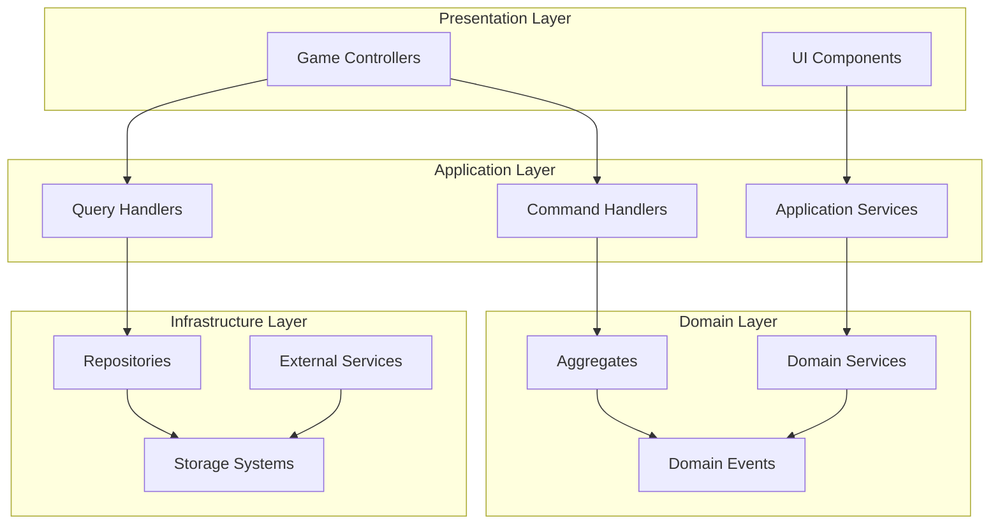

# API設計仕様書

TypeScript Minecraft Cloneプロジェクトのシステム間通信とデータフローに関するAPI仕様書です。

## 🔌 API階層構造

### 🏗️ **アーキテクチャレベルのAPI**
- **[ドメイン・アプリケーションAPI](00-domain-application-apis.md)** - ビジネスロジック層のインタフェース設計
- **[インフラストラクチャAPI](01-infrastructure-apis.md)** - 技術基盤層のサービスインタフェース

### 📡 **通信・データフロー**
- **[イベントバス仕様](02-event-bus-specification.md)** - システム間の非同期メッセージング
- **[データフロー図](03-data-flow-diagram.md)** - システム全体のデータの流れと変換

## 🎯 API設計原則

### 🔒 **型安全性**
Effect-TSのSchemaシステムを活用した完全な型安全性を実現:

```typescript
// API定義例
export const GetChunkAPI = Schema.Struct({
  request: Schema.Struct({
    coordinate: ChunkCoordinate,
    includeEntities: Schema.Boolean
  }),
  response: Schema.Union(
    Schema.Struct({
      _tag: Schema.Literal("Success"),
      chunk: ChunkSchema,
      entities: Schema.Array(EntitySchema)
    }),
    Schema.Struct({
      _tag: Schema.Literal("Error"),
      error: ChunkLoadError
    })
  )
})
```

### 🔄 **非同期処理**
全てのAPIはEffect型による統一された非同期処理:

```typescript
export const chunkService = Context.GenericTag<{
  readonly getChunk: (coord: ChunkCoordinate) => Effect.Effect<
    Chunk,
    ChunkLoadError,
    ChunkRepository
  >
}>()("@minecraft/ChunkService")
```

### 📊 **観測可能性**
全APIコールのログ、メトリクス、トレーシングを標準装備。

## 🏛️ レイヤー別API構造



## 📡 通信パターン

### 🚀 **同期通信 (Request/Response)**
直接的なデータ要求・応答パターン:
- ワールドデータ取得
- プレイヤー情報問い合わせ
- システム状態確認

### 🔔 **非同期通信 (Event-Driven)**
イベントドリブンな疎結合通信:
- ブロック配置イベント
- プレイヤー移動通知
- エンティティ生成・削除

### 📤 **ストリーミング**
継続的なデータ配信:
- チャンクストリーミング
- リアルタイムワールド同期
- マルチプレイヤー状態同期

## 🔧 API実装パターン

### 🏷️ **Service定義パターン**
```typescript
// 統一されたService定義
export const WorldService = Context.GenericTag<{
  readonly generateChunk: (coord: ChunkCoordinate) => Effect.Effect<Chunk, GenerationError>
  readonly saveChunk: (chunk: Chunk) => Effect.Effect<void, SaveError>
  readonly loadChunk: (coord: ChunkCoordinate) => Effect.Effect<Chunk, LoadError>
}>()("@minecraft/WorldService")
```

### ⚠️ **エラーハンドリング**
```typescript
// 統一されたエラー型
export class ChunkServiceError extends Schema.TaggedError("ChunkServiceError")<{
  cause: "NotFound" | "Corrupted" | "NetworkError"
  coordinate: ChunkCoordinate
  message: string
}> {}
```

### 🔍 **バリデーション**
```typescript
// 入力バリデーション
const validateChunkRequest = Schema.decodeUnknownSync(ChunkRequestSchema)

export const getChunk = (rawRequest: unknown) =>
  Effect.gen(function* () {
    const request = yield* Effect.try(() => validateChunkRequest(rawRequest))
    const chunk = yield* ChunkService.loadChunk(request.coordinate)
    return chunk
  })
```

## 📊 パフォーマンス考慮事項

### ⚡ **最適化戦略**
- **キャッシュ**: 頻繁に参照されるデータの効率的なキャッシュ
- **バッチ処理**: 複数のリクエストをまとめて処理
- **レイジーローディング**: 必要時のみデータ読み込み
- **圧縮**: ネットワーク通信での圧縮適用

### 📈 **スケーラビリティ**
- **非同期処理**: Effect.genを用いた効率的な並行処理
- **背景処理**: 重い処理の背景実行
- **リソースプール**: コネクションプール等のリソース管理

## 🔐 セキュリティ仕様

### 🛡️ **入力検証**
全てのAPIエンドポイントでSchema.jsによる
厳密な入力検証を実施。

### 🔑 **認証・認可**
マルチプレイヤー機能における:
- JWT認証
- ロールベースアクセス制御
- APIレート制限

### 🔒 **データ保護**
- 機密データの暗号化
- 安全な通信プロトコル
- セキュアなセーブデータ

## 📈 監視・メトリクス

### 📊 **APIメトリクス**
- リクエスト数・レスポンス時間
- エラー率・成功率
- リソース使用量

### 📝 **ログ出力**
- 構造化ログ（JSON形式）
- コンテキスト情報付与
- トレースID連携

## 🧪 テスト戦略

### 🔬 **API Testing**
- **Contract Testing**: API仕様の契約テスト
- **Integration Testing**: システム間連携テスト
- **Performance Testing**: 負荷テスト・ストレステスト

### 📝 **ドキュメント生成**
Schema定義からのAPI仕様書自動生成。

## 🔗 関連ドキュメント

- **[コア機能](../00-core-features/)** - API利用システムの詳細
- **[データモデル](../03-data-models/)** - API交換データの構造
- **[アーキテクチャ](../../01-architecture/)** - API設計の基盤思想
- **[セキュリティ仕様](../04-security-specification.md)** - セキュリティ要件詳細

---

🔧 **重要**: API変更時は下位互換性を維持し、適切なバージョニング戦略を適用してください。