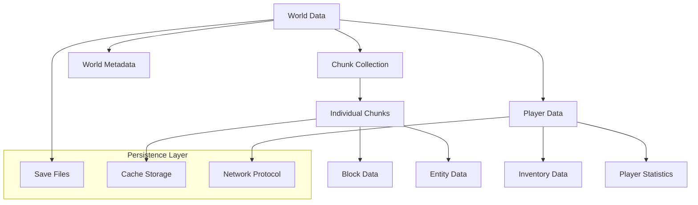

# データモデル仕様書

TypeScript Minecraft Cloneプロジェクトのデータ構造、永続化、ストレージに関する仕様書です。

## 📊 データアーキテクチャ概要

### 🏗️ **階層構造**


## 📋 データモデル仕様書一覧

### 🌍 **ワールドデータ**
- **[ワールドデータ構造](00-world-data-structure.md)** - ゲーム世界全体のデータ構造設計
- **[チャンク形式](01-chunk-format.md)** - 16x16x256ブロック単位のデータ形式
- **[セーブファイル形式](02-save-file-format.md)** - ゲーム状態の永続化フォーマット

## 🎯 設計原則

### 📐 **型安全性**
Effect-TS Schemaによる完全な型安全性を実現:

```typescript
// 統一されたデータ定義パターン
export const BlockSchema = Schema.Struct({
  id: Schema.String,
  type: MaterialType,
  position: Position3D,
  metadata: Schema.Record(Schema.String, Schema.Unknown),
  state: BlockState
})

export type Block = Schema.Schema.Type<typeof BlockSchema>
```

### 🔄 **イミュータブル性**
すべてのデータモデルは不変性を保持し、
変更は新しいインスタンスの生成として表現:

```typescript
// 不変更新パターン
export const updateBlock = (world: World, position: Position3D, newBlock: Block): World =>
  pipe(
    world,
    World.updateChunk(getChunkCoordinate(position), chunk =>
      Chunk.setBlock(chunk, position, newBlock)
    )
  )
```

### ⚡ **パフォーマンス最適化**
- **遅延読み込み**: 必要時のみデータロード
- **効率的なシリアライゼーション**: バイナリ形式での高速I/O
- **圧縮**: データサイズ削減と転送速度向上
- **差分更新**: 変更分のみの同期

## 🗂️ データカテゴリ

### 🌐 **静的ワールドデータ**
変更頻度が低い、世界の基本構造:
- **地形データ**: 高度、バイオーム、地質情報
- **構造物データ**: 建物、遺跡、自然構造
- **リソース分布**: 鉱石、植物、水源配置

### 🏃 **動的ゲーム状態**
常に変化するゲーム実行時データ:
- **エンティティ位置**: プレイヤー、モブ、アイテム
- **ブロック変更**: 建築、破壊、相互作用
- **時間状態**: ゲーム内時刻、天候、季節

### 👤 **プレイヤーデータ**
個別プレイヤーに関連する情報:
- **キャラクター状態**: 体力、空腹度、経験値
- **所持品**: インベントリ、装備、エンダーチェスト
- **進行状況**: 実績、統計、探索履歴

## 💾 ストレージ戦略

### 🗄️ **ファイルベースストレージ**
```
saves/
├── world_name/
│   ├── world.json          # ワールド設定
│   ├── players/            # プレイヤーデータ
│   │   ├── uuid1.json
│   │   └── uuid2.json
│   └── chunks/             # チャンクデータ
│       ├── 0_0.chunk       # 圧縮バイナリ
│       ├── 0_1.chunk
│       └── region_0_0/     # リージョン単位
│           └── chunks.dat
```

### ⚡ **キャッシュシステム**
```typescript
// メモリキャッシュ戦略
export interface ChunkCache {
  readonly active: Map<ChunkCoordinate, Chunk>    // アクティブチャンク
  readonly nearby: Map<ChunkCoordinate, Chunk>    // 近傍チャンク
  readonly dirty: Set<ChunkCoordinate>            // 未保存チャンク
}
```

### 🌐 **ネットワーク同期**
```typescript
// 同期データ形式
export const NetworkUpdate = Schema.Union(
  BlockUpdate,        // ブロック変更
  EntityUpdate,       // エンティティ状態
  ChunkUnload,        // チャンク解除
  PlayerSync          // プレイヤー同期
)
```

## 🔢 バージョン管理

### 📈 **データマイグレーション**
```typescript
// バージョン間移行
export const migrate = (version: number, data: unknown): Effect.Effect<
  LatestData,
  MigrationError,
  Logger
> =>
  Effect.gen(function* () {
    yield* Logger.info(`Migrating from version ${version}`)

    switch (version) {
      case 1: return yield* migrateV1ToV2(data)
      case 2: return yield* migrateV2ToV3(data)
      default: return yield* Effect.fail(new UnsupportedVersion(version))
    }
  })
```

### 🔒 **下位互換性**
- セーブファイルの自動マイグレーション
- 古いバージョンの読み取り対応
- 段階的な機能移行サポート

## 📊 データ検証・整合性

### ✅ **バリデーション**
```typescript
// データ整合性チェック
export const validateWorldData = (data: unknown): Effect.Effect<
  World,
  ValidationError,
  never
> =>
  Schema.decodeUnknown(WorldSchema)(data)
    .pipe(
      Effect.tap(validateChunkConsistency),
      Effect.tap(validatePlayerReferences),
      Effect.mapError(ValidationError.from)
    )
```

### 🔍 **整合性チェック**
- チャンク境界の連続性
- エンティティ参照の有効性
- インベントリアイテムの妥当性
- ワールド座標の範囲チェック

## 🚀 パフォーマンス最適化

### 📈 **メトリクス**
- **読み込み時間**: < 100ms (チャンク)
- **書き込み時間**: < 50ms (チャンク)
- **メモリ使用量**: < 4GB (大規模ワールド)
- **ディスク使用量**: 効率的な圧縮率 60%+

### ⚡ **最適化戦略**
```typescript
// 効率的なデータアクセス
export const optimizedChunkLoader = Effect.gen(function* () {
  // 並列読み込み
  const chunks = yield* Effect.all(
    coordinates.map(coord => loadChunk(coord)),
    { concurrency: 4 }
  )

  // バックグラウンド書き込み
  yield* Effect.fork(
    saveChunks(dirtyChunks)
  )

  return chunks
})
```

## 🔐 セキュリティ考慮事項

### 🛡️ **データ保護**
- セーブファイルの暗号化（オプション）
- チート検知システム
- データ改ざん防止

### 🔑 **アクセス制御**
- ファイルシステム権限
- プレイヤーデータ分離
- 管理者権限管理

## 🧪 テスト戦略

### 🔬 **データテスト**
```typescript
describe("World Data Persistence", () => {
  it("should maintain data integrity across save/load cycles", () =>
    Effect.gen(function* () {
      const originalWorld = yield* generateTestWorld()

      yield* saveWorld("test_world", originalWorld)
      const loadedWorld = yield* loadWorld("test_world")

      expect(loadedWorld).toEqual(originalWorld)
    }))
})
```

### 📊 **パフォーマンステスト**
- 大量データのロード・セーブ時間測定
- メモリリーク検出
- 並行アクセステスト

## 🔗 関連ドキュメント

- **[API設計](../02-api-design/)** - データアクセスAPI
- **[コア機能](../00-core-features/)** - データ利用システム
- **[セキュリティ仕様](../04-security-specification.md)** - データ保護要件
- **[アーキテクチャ](../../01-architecture/)** - システム設計基盤

---

💾 **重要**: データモデルの変更時は下位互換性とマイグレーション戦略を必ず検討してください。