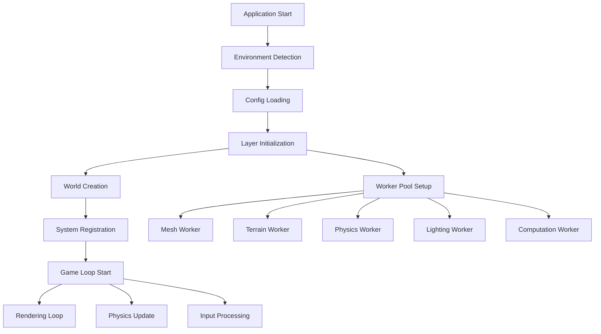

# エントリーポイント解説

このドキュメントでは、最新のEffect-TSパターン（2024年版）を使用したts-minecraftプロジェクトの各エントリーポイントと起動フローについて詳しく解説します。Schema-based設定、関数型アプローチ、型安全な初期化プロセスを中心に扱います。

## 主要エントリーポイント

### 1. メインエントリーポイント (`src/main.ts`)

アプリケーション全体の中核となるエントリーポイントです。ゲームエンジンの初期化とゲームループの管理を行います。

```typescript
// Schema-based設定管理に最新パターンを適用
const GameMode = Schema.Literal("CREATIVE", "SURVIVAL")

const Position = Schema.Struct({
  x: Schema.Number,
  y: Schema.Number,
  z: Schema.Number
})

const WorldConfig = Schema.Struct({
  seed: Schema.Number.pipe(Schema.int()),
  renderDistance: Schema.Number.pipe(Schema.positive(), Schema.lessThanOrEqualTo(32)),
  simulationDistance: Schema.Number.pipe(Schema.positive(), Schema.lessThanOrEqualTo(16))
})

const PlayerConfig = Schema.Struct({
  name: Schema.String.pipe(Schema.minLength(1), Schema.maxLength(16)),
  gameMode: GameMode,
  position: Position
})

const PerformanceConfig = Schema.Struct({
  targetFPS: Schema.Number.pipe(Schema.positive(), Schema.between(30, 144)),
  enableVSync: Schema.Boolean,
  enablePerformanceMonitoring: Schema.Boolean
})

const AppConfigSchema = Schema.Struct({
  world: WorldConfig,
  player: PlayerConfig,
  performance: PerformanceConfig
})

type AppConfig = Schema.Schema.Type<typeof AppConfigSchema>

const AppInitError = Schema.Struct({
  _tag: Schema.Literal("AppInitError"),
  message: Schema.String,
  stage: Schema.String,
  timestamp: Schema.DateTimeUtc,
  cause: Schema.optional(Schema.Unknown)
})

type AppInitError = Schema.Schema.Type<typeof AppInitError>

// 純粋関数で設定検証を分離
const validateAppConfig = (input: unknown): AppConfig => {
  try {
    return Schema.decodeUnknownSync(AppConfigSchema)(input)
  } catch (cause) {
    throw {
      _tag: "AppInitError" as const,
      message: "Invalid application config",
      stage: "config_validation",
      timestamp: new Date().toISOString(),
      cause
    }
  }
}

// 純粋関数でコンフィグが有効かチェック
const isValidAppConfig = (config: AppConfig): boolean => {
  return config.world.seed !== 0 &&
         config.player.name.trim().length > 0 &&
         config.performance.targetFPS > 0 &&
         config.performance.targetFPS <= 144
}

// 早期リターンパターンでメイン関数を構成
const main = (configInput: unknown): Effect.Effect<void, AppInitError, never> =>
  Effect.gen(function* () {
    // 早期リターン: 設定バリデーション
    const config = validateAppConfig(configInput)

    if (!isValidAppConfig(config)) {
      return yield* Effect.fail({
        _tag: "AppInitError" as const,
        message: "Config validation failed",
        stage: "config_validation",
        timestamp: new Date().toISOString(),
        cause: "Invalid configuration values"
      })
    }

    yield* Effect.logInfo(`Application starting with config: ${JSON.stringify(config)}`)

    // 段階的な初期化プロセス
    const worldService = yield* initializeWorld(config.world)
    const playerService = yield* initializePlayer(config.player, worldService)
    const renderService = yield* initializeRenderer(config.performance)

    // ゲームループ開始
    yield* startGameLoop({
      world: worldService,
      player: playerService,
      renderer: renderService,
      targetFPS: config.performance.targetFPS
    })
  })

// 純粋関数で詳細な検証ロジックを実装
const validateWorldConfig = (world: AppConfig['world']): string[] => {
  const errors: string[] = []

  if (world.seed === 0) errors.push("World seed cannot be zero")
  if (world.renderDistance > 32) errors.push("Render distance too high")
  if (world.simulationDistance > world.renderDistance) {
    errors.push("Simulation distance cannot exceed render distance")
  }

  return errors
}

const validatePlayerConfig = (player: AppConfig['player']): string[] => {
  const errors: string[] = []

  if (player.name.trim().length === 0) errors.push("Player name is required")
  if (player.position.y < 0 || player.position.y > 320) {
    errors.push("Player Y position out of bounds")
  }

  return errors
}

const validatePerformanceConfig = (performance: AppConfig['performance']): string[] => {
  const errors: string[] = []

  if (performance.targetFPS < 30) errors.push("Target FPS too low")
  if (performance.targetFPS > 144) errors.push("Target FPS too high")

  return errors
}
```

**主な責任**:
- ワールドの初期化
- ゲームシステムの起動
- ゲームループの実行
- エラーハンドリング

**起動フロー**:
1. プレイヤーアーキタイプの受け取り
2. ワールドサービスの取得
3. ワールドの初期化
4. ゲームループの開始

### 2. Webアプリエントリーポイント (`src/presentation/web/main.ts`)

Webブラウザ向けのユーザーインターフェースとレンダリングを担当するエントリーポイントです。

```typescript
// Webアプリケーションの開始
const startWebApplication = () => {
  return Effect.runFork(WebApp)
}
```

**主な責任**:
- DOM操作とイベントハンドリング
- Three.jsによる3Dレンダリング
- ユーザー入力の処理
- プレゼンテーションレイヤーの管理

**起動フロー**:
1. DOMの初期化
2. Three.jsレンダラーのセットアップ
3. イベントリスナーの登録
4. レンダリングループの開始

## Workerエントリーポイント

重い処理をメインスレッドから分離するために、複数のWeb Workerを使用しています。

### 1. メッシュ生成Worker (`mesh-generation.worker.ts`)

```typescript
// メッシュ生成の主要処理
const generateMeshData = (chunkData: ChunkData) => 
  Effect.gen(function* () {
    const neighbors = yield* createNeighborLookup(chunkData)
    const faces = yield* generateBlockFaces(chunkData, neighbors)
    const optimized = yield* applyOptimizations(faces)
    return createTransferableVertexData(optimized)
  })
```

**責任**:
- チャンクデータからメッシュを生成
- 面の最適化（Greedy Meshing）
- 転送可能なバッファの作成

### 2. 地形生成Worker (`terrain-generation.worker.ts`)

**責任**:
- ノイズベースの地形生成
- バイオーム生成
- 鉱物配置

### 3. 物理演算Worker (`physics.worker.ts`)

**責任**:
- 衝突判定
- 剛体シミュレーション
- パーティクルシステム

### 4. ライティングWorker (`lighting.worker.ts`)

**責任**:
- ライトの伝播計算
- 影の生成
- アンビエントオクルージョン

### 5. 計算Worker (`computation.worker.ts`)

**責任**:
- 汎用的な数値計算
- データ変換処理
- バックグラウンド処理

## テストエントリーポイント

### Vitestテスト設定

```typescript
// vitest.config.ts での設定
export default defineConfig({
  test: {
    environment: 'jsdom', // DOM APIが必要なテスト用
    globals: true,        // グローバルテスト関数の有効化
  },
})
```

**レイヤー別テスト構成**:

- `vitest.shared.config.ts` - 共通ライブラリのテスト
- `vitest.infrastructure.config.ts` - インフラレイヤーのテスト  
- `vitest.presentation.config.ts` - プレゼンテーションレイヤーのテスト

## 起動フローの詳細

### 完全な起動シーケンス



### 1. 環境検出フェーズ

```typescript
const environment = Effect.gen(function* () {
  const capabilities = yield* detectCapabilities
  const config = yield* loadConfig(capabilities)
  return { capabilities, config }
})
```

- WebGPU/WebGL対応の確認
- デバイス性能の評価
- 最適な設定の決定

### 2. 設定読み込みフェーズ

```typescript
const appConfig = Effect.gen(function* () {
  const userConfig = yield* loadUserConfig
  const gameConfig = yield* loadGameConfig  
  const infraConfig = yield* loadInfrastructureConfig
  return mergeConfigs(userConfig, gameConfig, infraConfig)
})
```

### 3. レイヤー初期化フェーズ

依存性注入とサービスの初期化：

```typescript
const AppLive = Layer.mergeAll(
  ConfigServiceLive,
  RendererLive,
  InputServiceLive,
  PhysicsEngineLive,
  TerrainGeneratorLive,
)
```

### 4. ワールド作成とシステム登録

```typescript
const initialize = Effect.gen(function* () {
  const world = yield* World.create
  yield* registerCoreSystems(world)
  yield* registerGameSystems(world)
  yield* registerRenderingSystems(world)
  return world
})
```

### 5. ゲームループ開始

```typescript
const gameLoop = (systems: GameSystemFunction[]) =>
  Effect.gen(function* () {
    while (true) {
      const deltaTime = yield* getDeltaTime
      yield* Effect.allPar(systems.map(system => system(deltaTime)))
      yield* Effect.sleep(16) // ~60 FPS
    }
  })
```

## エラーハンドリング

各エントリーポイントでの適切なエラーハンドリング：

### メインエントリー

```typescript
const handleMainErrors = (error: AppInitError | GameLoopError) =>
  match(error, {
    AppInitError: (err) => 
      Effect.log(`Initialization failed: ${err.message}`) *>
      Effect.fail(err),
    GameLoopError: (err) =>
      Effect.log(`Game loop error: ${err.message}`) *>
      restartGameLoop,
  })
```

### Workerエラー

```typescript
const workerErrorHandler = (error: WorkerError) =>
  Effect.gen(function* () {
    yield* Effect.log(`Worker error: ${error.message}`)
    yield* reportErrorToMain(error)
    
    // 重要でないWorkerは再起動
    if (error.severity === "recoverable") {
      yield* restartWorker
    }
  })
```

## デバッグとプロファイリング

### 開発時の起動オプション

```typescript
// 開発環境での追加初期化
if (process.env.NODE_ENV === 'development') {
  yield* initializeDevTools
  yield* startPerformanceMonitoring
  yield* enableHotReload
}
```

### プロファイリング有効化

```typescript
const profilingConfig = {
  enableFPSCounter: true,
  enableMemoryMonitor: true,
  enableWorkerProfiling: true,
  logSystemTiming: true,
}
```

## パフォーマンス最適化

### 遅延初期化

重要でない機能は必要な時まで初期化を遅延：

```typescript
const lazyServices = {
  audioEngine: lazy(() => createAudioEngine()),
  particleSystem: lazy(() => createParticleSystem()),
  networkManager: lazy(() => createNetworkManager()),
}
```

### Worker Pool の最適化

```typescript
const workerPoolConfig = {
  meshWorkers: Math.min(navigator.hardwareConcurrency, 4),
  computeWorkers: Math.max(1, navigator.hardwareConcurrency - 2),
  dedicatedPhysicsWorker: true,
}
```

このエントリーポイントの理解により、アプリケーションの全体的な構造と起動プロセスを把握できます。