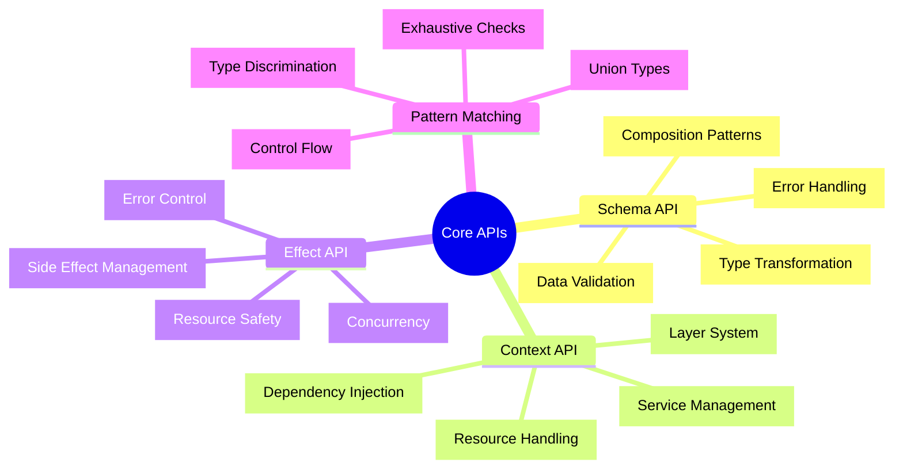

# 🔌 Core APIs - Effect-TS 3.17+完全マスタリー

## 🧭 スマートナビゲーション

> **📍 現在位置**: Reference → API Reference → **Core APIs**
> **🎯 最終目標**: Effect-TS 3.17+完全習得・実践活用
> **⏱️ 所要時間**: 30-45分（中級〜上級者向け）
> **👤 対象**: 中級〜上級TypeScript開発者・関数型プログラミング実践者

**⚡ TypeScript Minecraft Clone開発を支えるEffect-TS基盤技術の完全理解**

## 📊 Core APIs体系マップ



## 🔍 Schema API - 型安全データ処理の中核

### 📋 基本Schema定義パターン

#### ✅ **基本型Schema**
```typescript
import { Schema } from "effect"

// 基本プリミティブ型
const StringSchema = Schema.String       // string
const NumberSchema = Schema.Number       // number
const BooleanSchema = Schema.Boolean     // boolean
const BigIntSchema = Schema.BigInt       // bigint
const DateSchema = Schema.Date           // Date（文字列からの変換含む）

// 型安全リテラル
const BlockType = Schema.Literal("stone", "grass", "dirt", "wood")
// type BlockType = "stone" | "grass" | "dirt" | "wood"
```

#### ⭐ **Minecraft特化Schema実装例**

```typescript
// 座標系Schema - 3D位置の型安全表現
export const PositionSchema = Schema.Struct({
  x: Schema.Number.pipe(Schema.int()),           // 整数制約
  y: Schema.Number.pipe(
    Schema.int(),
    Schema.between(0, 255)                        // Y軸範囲制限（Minecraft仕様）
  ),
  z: Schema.Number.pipe(Schema.int())
}).annotations({
  identifier: "Position",
  description: "3D world position with Minecraft constraints"
})

// type Position = { readonly x: number, readonly y: number, readonly z: number }
export type Position = typeof PositionSchema.Type

// チャンク座標Schema - チャンク単位の管理
export const ChunkCoordinateSchema = Schema.Struct({
  chunkX: Schema.Number.pipe(Schema.int()),
  chunkZ: Schema.Number.pipe(Schema.int())
}).annotations({
  identifier: "ChunkCoordinate"
})

// プレイヤー状態Schema - 複合データ構造
export const PlayerStateSchema = Schema.Struct({
  id: Schema.String.pipe(Schema.uuid()),         // UUID制約
  username: Schema.String.pipe(
    Schema.minLength(3),
    Schema.maxLength(16),
    Schema.pattern(/^[a-zA-Z0-9_]+$/)           // Minecraft username規則
  ),
  position: PositionSchema,
  health: Schema.Number.pipe(
    Schema.between(0, 20),                       // Minecraft health system
    Schema.multipleOf(0.5)                      // 0.5刻み（ハート単位）
  ),
  inventory: Schema.Array(ItemStackSchema),
  gamemode: Schema.Literal("survival", "creative", "spectator")
}).annotations({
  identifier: "PlayerState",
  description: "Complete player state representation"
})

// アイテムスタックSchema - インベントリシステム
export const ItemStackSchema = Schema.Struct({
  itemType: Schema.String,
  quantity: Schema.Number.pipe(
    Schema.int(),
    Schema.between(1, 64)                        // Minecraft stack limit
  ),
  metadata: Schema.optional(Schema.Record({
    key: Schema.String,
    value: Schema.Unknown
  }))
}).annotations({
  identifier: "ItemStack"
})
```

### 🔄 Schema変換・検証パターン

#### ✅ **デコード・エンコード処理**
```typescript
import { Schema, Either, ParseResult } from "effect"

// 安全なデコード処理
const decodePlayerState = (input: unknown): Either.Either<PlayerState, ParseResult.ParseError> =>
  Schema.decodeUnknownEither(PlayerStateSchema)(input)

// 実用例: APIレスポンス処理
const processPlayerData = (apiResponse: unknown) =>
  pipe(
    apiResponse,
    decodePlayerState,
    Either.match({
      onLeft: (error) => {
        console.error("Player data validation failed:", error)
        return null
      },
      onRight: (playerState) => {
        console.log("Player loaded:", playerState.username)
        return playerState
      }
    })
  )

// 同期的デコード（エラー時例外）
const decodePlayerStateSync = (input: unknown): PlayerState =>
  Schema.decodeUnknownSync(PlayerStateSchema)(input)

// エンコード（外部送信用）
const encodePlayerState = (playerState: PlayerState): unknown =>
  Schema.encodeSync(PlayerStateSchema)(playerState)
```

#### 🎯 **高度なSchema合成パターン**
```typescript
// Union型Schema - 判別可能なUnion
export const GameEventSchema = Schema.Union(
  Schema.Struct({
    type: Schema.Literal("block_break"),
    position: PositionSchema,
    blockType: BlockType,
    player: PlayerStateSchema
  }),
  Schema.Struct({
    type: Schema.Literal("player_join"),
    player: PlayerStateSchema,
    timestamp: Schema.Date
  }),
  Schema.Struct({
    type: Schema.Literal("chat_message"),
    player: PlayerStateSchema,
    message: Schema.String.pipe(Schema.maxLength(256)),
    timestamp: Schema.Date
  })
).annotations({
  identifier: "GameEvent"
})

// 再帰的Schema - ツリー構造
export const WorldRegionSchema: Schema.Schema<WorldRegion> = Schema.Struct({
  name: Schema.String,
  bounds: Schema.Struct({
    min: PositionSchema,
    max: PositionSchema
  }),
  chunks: Schema.Array(ChunkCoordinateSchema),
  subRegions: Schema.suspend(() => Schema.Array(WorldRegionSchema))  // 再帰
}).annotations({
  identifier: "WorldRegion"
})

// 条件付きSchema - 複雑なバリデーション
export const BlockPlacementSchema = Schema.Struct({
  position: PositionSchema,
  blockType: BlockType,
  player: PlayerStateSchema
}).pipe(
  Schema.filter(({ position, player }) =>
    // プレイヤーから5ブロック以内の配置のみ許可
    Math.abs(position.x - player.position.x) <= 5 &&
    Math.abs(position.z - player.position.z) <= 5,
    {
      message: () => "Block placement too far from player"
    }
  )
)
```

## 🏗️ Context API - 依存性注入システム

### 📋 Context基本パターン

#### ✅ **サービス定義とTag作成**
```typescript
import { Context, Effect, Layer } from "effect"

// WorldService - ワールド管理の抽象化
export interface WorldService {
  readonly loadChunk: (coord: ChunkCoordinate) => Effect.Effect<Chunk, ChunkLoadError>
  readonly saveChunk: (chunk: Chunk) => Effect.Effect<void, ChunkSaveError>
  readonly generateChunk: (coord: ChunkCoordinate) => Effect.Effect<Chunk, GenerationError>
  readonly unloadChunk: (coord: ChunkCoordinate) => Effect.Effect<void, never>
}

export const WorldService = Context.GenericTag<WorldService>("WorldService")

// PlayerService - プレイヤー管理
export interface PlayerService {
  readonly getPlayer: (id: string) => Effect.Effect<PlayerState, PlayerNotFoundError>
  readonly updatePlayer: (player: PlayerState) => Effect.Effect<void, PlayerUpdateError>
  readonly movePlayer: (id: string, position: Position) => Effect.Effect<void, MovementError>
}

export const PlayerService = Context.GenericTag<PlayerService>("PlayerService")

// RenderService - レンダリングシステム
export interface RenderService {
  readonly renderFrame: () => Effect.Effect<void, RenderError>
  readonly updateCamera: (position: Position, rotation: Rotation) => Effect.Effect<void, never>
  readonly loadTexture: (path: string) => Effect.Effect<Texture, AssetLoadError>
}

export const RenderService = Context.GenericTag<RenderService>("RenderService")
```

#### ⭐ **実装Layer定義**
```typescript
// WorldService実装
export const WorldServiceLive: Layer.Layer<WorldService, ConfigError> = Layer.effect(
  WorldService,
  Effect.gen(function* () {
    // 設定とリソース取得
    const config = yield* Config.string("WORLD_PATH")
    const fileSystem = yield* FileSystem

    // チャンクキャッシュ
    const chunkCache = new Map<string, Chunk>()

    return WorldService.of({
      loadChunk: (coord) => Effect.gen(function* () {
        const key = `${coord.chunkX},${coord.chunkZ}`

        // キャッシュチェック
        if (chunkCache.has(key)) {
          return chunkCache.get(key)!
        }

        // ファイルから読み込み
        const chunkPath = `${config}/chunks/${key}.chunk`
        const exists = yield* fileSystem.exists(chunkPath)

        if (exists) {
          const data = yield* fileSystem.readFile(chunkPath)
          const chunk = yield* Schema.decodeUnknown(ChunkSchema)(JSON.parse(data))
          chunkCache.set(key, chunk)
          return chunk
        }

        // 生成
        return yield* generateChunk(coord)
      }),

      saveChunk: (chunk) => Effect.gen(function* () {
        const key = `${chunk.coordinate.chunkX},${chunk.coordinate.chunkZ}`
        const chunkPath = `${config}/chunks/${key}.chunk`
        const data = Schema.encodeSync(ChunkSchema)(chunk)

        yield* fileSystem.writeFile(chunkPath, JSON.stringify(data))
        chunkCache.set(key, chunk)
      }),

      generateChunk: (coord) => Effect.gen(function* () {
        // 地形生成ロジック
        const blocks = generateTerrain(coord)
        const chunk: Chunk = {
          coordinate: coord,
          blocks,
          generated: true,
          modified: false
        }
        return chunk
      }),

      unloadChunk: (coord) => Effect.sync(() => {
        const key = `${coord.chunkX},${coord.chunkZ}`
        chunkCache.delete(key)
      })
    })
  })
)

// PlayerService実装
export const PlayerServiceLive: Layer.Layer<PlayerService, never> = Layer.effect(
  PlayerService,
  Effect.gen(function* () {
    const players = new Map<string, PlayerState>()

    return PlayerService.of({
      getPlayer: (id) => Effect.gen(function* () {
        const player = players.get(id)
        if (!player) {
          return yield* Effect.fail(new PlayerNotFoundError({ playerId: id }))
        }
        return player
      }),

      updatePlayer: (player) => Effect.sync(() => {
        players.set(player.id, player)
      }),

      movePlayer: (id, position) => Effect.gen(function* () {
        const player = yield* getPlayer(id)
        const updatedPlayer = { ...player, position }
        yield* updatePlayer(updatedPlayer)
      })
    })
  })
)

// Layer合成 - 依存関係の組み立て
export const GameLayer = Layer.mergeAll(
  WorldServiceLive,
  PlayerServiceLive,
  RenderServiceLive
).pipe(
  Layer.provide(FileSystemLive),
  Layer.provide(ConfigLive)
)
```

### 🔄 Context使用パターン

#### ✅ **サービス利用の実装例**
```typescript
// ゲームロジック実装 - Contextを活用
export const processPlayerMovement = (
  playerId: string,
  newPosition: Position
): Effect.Effect<void, MovementError | ChunkLoadError, WorldService | PlayerService> =>
  Effect.gen(function* () {
    // 必要なサービス取得
    const worldService = yield* WorldService
    const playerService = yield* PlayerService

    // プレイヤー情報取得
    const player = yield* playerService.getPlayer(playerId)

    // 移動先チャンクの確認・読み込み
    const targetChunk = getChunkCoordinate(newPosition)
    const currentChunk = getChunkCoordinate(player.position)

    if (!isEqual(targetChunk, currentChunk)) {
      // チャンク境界越えの場合、新チャンクを読み込み
      yield* worldService.loadChunk(targetChunk)
    }

    // プレイヤー位置更新
    yield* playerService.movePlayer(playerId, newPosition)
  })

// ゲームメインループ
export const gameLoop: Effect.Effect<void, never, WorldService | PlayerService | RenderService> =
  Effect.gen(function* () {
    const renderService = yield* RenderService

    yield* Effect.forever(
      Effect.gen(function* () {
        // フレームレンダリング
        yield* renderService.renderFrame()

        // 16ms待機（60FPS）
        yield* Effect.sleep("16 millis")
      })
    )
  })

// アプリケーション実行
const runGame = gameLoop.pipe(
  Effect.provide(GameLayer),
  Effect.catchAll((error) =>
    Effect.sync(() => console.error("Game error:", error))
  )
)

Effect.runPromise(runGame)
```

## ⚡ Effect API - 副作用と制御フロー

### 📋 Effect基本パターン

#### ✅ **基本的なEffect操作**
```typescript
import { Effect, pipe } from "effect"

// 基本Effect作成
const simpleEffect = Effect.sync(() => "Hello World")
const asyncEffect = Effect.promise(() => fetch("/api/data"))
const failingEffect = Effect.fail(new Error("Something went wrong"))

// Effect合成
const composedEffect = Effect.gen(function* () {
  const data = yield* asyncEffect
  const processed = yield* processData(data)
  return processed
})

// エラーハンドリング
const safeEffect = composedEffect.pipe(
  Effect.catchAll((error) =>
    Effect.sync(() => {
      console.error("Error occurred:", error)
      return defaultValue
    })
  )
)
```

#### ⭐ **Minecraft特化Effect実装**
```typescript
// リソース安全な操作
export const renderChunkSafely = (
  chunk: Chunk
): Effect.Effect<void, RenderError, RenderService> =>
  Effect.gen(function* () {
    const renderService = yield* RenderService

    yield* Effect.acquireUseRelease(
      // リソース取得
      Effect.sync(() => renderService.createMesh(chunk)),

      // 使用
      (mesh) => Effect.gen(function* () {
        yield* renderService.addToScene(mesh)
        yield* renderService.renderFrame()
      }),

      // リソース解放
      (mesh) => Effect.sync(() => renderService.disposeMesh(mesh))
    )
  })

// 並行処理 - 複数チャンクの同時読み込み
export const loadChunksParallel = (
  coordinates: ChunkCoordinate[]
): Effect.Effect<Chunk[], ChunkLoadError, WorldService> =>
  Effect.gen(function* () {
    const worldService = yield* WorldService

    // 最大4並行で処理
    yield* Effect.forEach(
      coordinates,
      (coord) => worldService.loadChunk(coord),
      { concurrency: 4 }
    )
  })

// タイムアウト処理
export const loadChunkWithTimeout = (
  coord: ChunkCoordinate
): Effect.Effect<Chunk, ChunkLoadError | TimeoutError, WorldService> =>
  Effect.gen(function* () {
    const worldService = yield* WorldService

    yield* worldService.loadChunk(coord).pipe(
      Effect.timeout("5 seconds"),
      Effect.mapError((error) =>
        error instanceof TimeoutException
          ? new TimeoutError({ operation: "loadChunk", coordinate: coord })
          : error
      )
    )
  })
```

## 🔀 Pattern Matching - 型安全な分岐処理

### 📋 Match基本パターン

#### ✅ **基本的なパターンマッチング**
```typescript
import { Match, pipe } from "effect"

// 値によるマッチング
const processGameEvent = (event: GameEvent) =>
  pipe(
    event,
    Match.value,
    Match.when({ type: "block_break" }, (e) =>
      Effect.gen(function* () {
        console.log(`Block broken at ${e.position.x}, ${e.position.y}, ${e.position.z}`)
        yield* updateWorldState(e)
      })
    ),
    Match.when({ type: "player_join" }, (e) =>
      Effect.gen(function* () {
        console.log(`Player ${e.player.username} joined`)
        yield* notifyOtherPlayers(e.player)
      })
    ),
    Match.when({ type: "chat_message" }, (e) =>
      Effect.gen(function* () {
        console.log(`${e.player.username}: ${e.message}`)
        yield* broadcastMessage(e)
      })
    ),
    Match.exhaustive // 型安全性保証
  )

// 型ガードとの組み合わせ
const processInput = (input: unknown) =>
  pipe(
    input,
    Match.value,
    Match.when(Schema.is(PlayerStateSchema), handlePlayerState),
    Match.when(Schema.is(ChunkCoordinateSchema), handleChunkCoordinate),
    Match.orElse(() => Effect.fail(new InvalidInputError()))
  )
```

#### ⭐ **高度なパターンマッチング活用**
```typescript
// Result/Errorパターン
const handleChunkLoadResult = (
  result: Either.Either<Chunk, ChunkLoadError>
) =>
  pipe(
    result,
    Match.value,
    Match.when(Either.isRight, ({ right: chunk }) =>
      Effect.gen(function* () {
        console.log(`Chunk loaded: ${chunk.coordinate.chunkX}, ${chunk.coordinate.chunkZ}`)
        yield* addChunkToWorld(chunk)
      })
    ),
    Match.when(Either.isLeft, ({ left: error }) =>
      Match.value(error).pipe(
        Match.when(
          (err): err is ChunkNotFoundError => err._tag === "ChunkNotFoundError",
          (err) => Effect.gen(function* () {
            console.log("Chunk not found, generating new chunk")
            yield* generateAndSaveChunk(err.coordinate)
          })
        ),
        Match.when(
          (err): err is ChunkCorruptedError => err._tag === "ChunkCorruptedError",
          (err) => Effect.gen(function* () {
            console.error("Chunk corrupted, regenerating")
            yield* regenerateChunk(err.coordinate)
          })
        ),
        Match.orElse((err) => Effect.fail(err))
      )
    ),
    Match.exhaustive
  )

// Option型の処理
const findPlayerAndUpdate = (playerId: string, update: PlayerUpdate) =>
  pipe(
    getPlayerOptional(playerId),
    Match.value,
    Match.when(Option.isSome, ({ value: player }) =>
      updatePlayer({ ...player, ...update })
    ),
    Match.when(Option.isNone, () =>
      Effect.fail(new PlayerNotFoundError({ playerId }))
    ),
    Match.exhaustive
  )
```

## 🎯 実用的活用例・ベストプラクティス

### 🚀 **プロダクション対応パターン**

```typescript
// エラー階層の定義
export class GameError extends Schema.TaggedError<GameError>()("GameError", {
  message: Schema.String,
  timestamp: Schema.DateTimeUtc
}) {}

export class WorldError extends GameError.refine<WorldError>()("WorldError", {
  worldName: Schema.String
}) {}

export class ChunkLoadError extends WorldError.refine<ChunkLoadError>()("ChunkLoadError", {
  coordinate: ChunkCoordinateSchema
}) {}

// 統合されたゲームサービス
export const GameService = Context.GenericTag<{
  readonly startGame: () => Effect.Effect<GameState, GameError>
  readonly stopGame: () => Effect.Effect<void, never>
  readonly processFrame: () => Effect.Effect<void, GameError>
}>()("GameService")

// メインゲームループの実装
export const gameMain = Effect.gen(function* () {
  const gameService = yield* GameService

  // ゲーム開始
  const gameState = yield* gameService.startGame()
  console.log("Game started successfully")

  // メインループ
  yield* Effect.forever(
    gameService.processFrame().pipe(
      Effect.catchAll((error) =>
        Effect.gen(function* () {
          console.error("Frame processing error:", error)
          // エラーログ記録
          yield* logError(error)
          // 復旧試行
          yield* attemptRecovery(error)
        })
      )
    )
  )
}).pipe(
  Effect.provide(GameLayer),
  Effect.scoped, // リソース自動管理
  Effect.catchAll((error) =>
    Effect.gen(function* () {
      console.error("Fatal game error:", error)
      yield* cleanup()
      yield* Effect.fail(error)
    })
  )
)
```

## 📊 パフォーマンス考慮事項

### ⚡ **最適化のポイント**

1. **Schema検証の最適化**
   - 頻繁に使用するSchemaはキャッシュ化
   - 部分的検証の活用（`Schema.partial`）
   - バッチ処理での検証（`Effect.forEach`）

2. **Context管理の効率化**
   - Layer合成の最適化
   - 不要なサービス依存の除去
   - リソースプールの活用

3. **Effect合成の最適化**
   - 不要な中間値の削減
   - 並行処理の適切な活用
   - メモリリークの防止

---

### 🏆 **Core APIs完全習得の効果**

**✅ 型安全性**: Schema APIによる100%型安全なデータ処理
**✅ 依存管理**: Context APIによる疎結合アーキテクチャ実現
**✅ エラー制御**: Effect APIによる予測可能なエラーハンドリング
**✅ 制御フロー**: Pattern Matchingによる直感的な分岐処理

**Effect-TS 3.17+を完全マスターして、プロダクションレベルのMinecraft Cloneを構築しましょう！**

---

*📍 現在のドキュメント階層*: **[Home](../../../README.md)** → **[Reference](../README.md)** → **[API Reference](./README.md)** → **Core APIs**