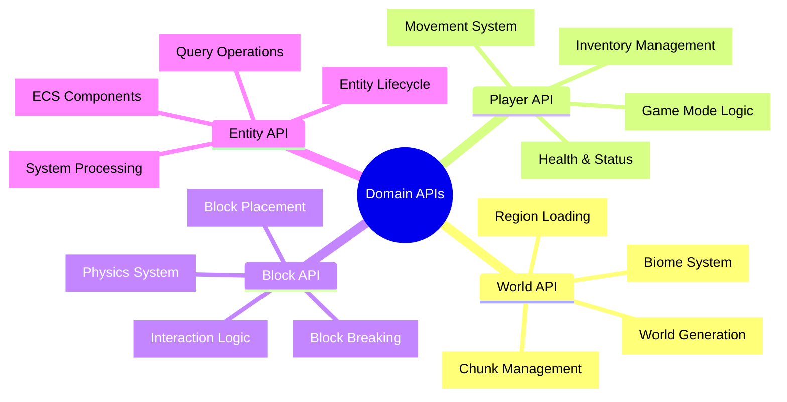

# 🎮 Domain APIs - ゲームドメイン完全マスタリー

## 🧭 スマートナビゲーション

> **📍 現在位置**: Reference → API Reference → **Domain APIs**
> **🎯 最終目標**: Minecraftゲームロジック完全実装・最適化
> **⏱️ 所要時間**: 45-60分（上級者向け）
> **👤 対象**: 上級開発者・ゲームアーキテクト・ドメインエキスパート

**🎯 Minecraftの複雑なゲームロジックを型安全・関数型で実装する完全ガイド**

## 📊 Domain APIs体系マップ



## 🌍 World API - ワールド管理システム

### 📋 World基本データ構造

#### ✅ **コアデータ定義**
```typescript
import { Schema, Effect, Context } from "effect"

// ワールド基本情報
export const WorldMetadataSchema = Schema.Struct({
  name: Schema.String.pipe(
    Schema.minLength(1),
    Schema.maxLength(32)
  ),
  seed: Schema.BigInt,
  gamemode: Schema.Literal("survival", "creative", "hardcore"),
  difficulty: Schema.Literal("peaceful", "easy", "normal", "hard"),
  createdAt: Schema.DateTimeUtc,
  lastPlayed: Schema.DateTimeUtc,
  version: Schema.String
}).annotations({
  identifier: "WorldMetadata"
})

// チャンクデータ構造
export const ChunkSchema = Schema.Struct({
  coordinate: ChunkCoordinateSchema,
  blocks: Schema.Array(Schema.Array(Schema.Array(BlockSchema))), // [x][y][z]
  biome: BiomeSchema,
  generated: Schema.Boolean,
  modified: Schema.Boolean,
  entities: Schema.Array(EntitySchema),
  lastUpdated: Schema.DateTimeUtc
}).annotations({
  identifier: "Chunk"
})

// ブロック定義
export const BlockSchema = Schema.Struct({
  type: Schema.Literal(
    "air", "stone", "grass", "dirt", "cobblestone",
    "wood", "sand", "gravel", "water", "lava"
  ),
  metadata: Schema.optional(Schema.Record({
    key: Schema.String,
    value: Schema.Unknown
  })),
  lightLevel: Schema.Number.pipe(
    Schema.int(),
    Schema.between(0, 15)
  )
}).annotations({
  identifier: "Block"
})

// バイオーム定義
export const BiomeSchema = Schema.Struct({
  type: Schema.Literal(
    "plains", "forest", "desert", "mountains",
    "ocean", "taiga", "swampland"
  ),
  temperature: Schema.Number.pipe(Schema.between(-2, 2)),
  rainfall: Schema.Number.pipe(Schema.between(0, 2)),
  grassColor: Schema.String,
  foliageColor: Schema.String
}).annotations({
  identifier: "Biome"
})
```

#### ⭐ **WorldService実装**
```typescript
// ワールド管理サービス
export interface WorldService {
  // チャンク操作
  readonly loadChunk: (coord: ChunkCoordinate) => Effect.Effect<Chunk, ChunkLoadError>
  readonly saveChunk: (chunk: Chunk) => Effect.Effect<void, ChunkSaveError>
  readonly unloadChunk: (coord: ChunkCoordinate) => Effect.Effect<void, never>

  // ワールド生成
  readonly generateChunk: (coord: ChunkCoordinate) => Effect.Effect<Chunk, GenerationError>
  readonly generateStructure: (type: StructureType, position: Position) => Effect.Effect<void, GenerationError>

  // ブロック操作
  readonly getBlock: (position: Position) => Effect.Effect<Block, BlockNotFoundError>
  readonly setBlock: (position: Position, block: Block) => Effect.Effect<void, BlockUpdateError>

  // ワールド情報
  readonly getWorldInfo: () => Effect.Effect<WorldMetadata, never>
  readonly updateWorldInfo: (metadata: Partial<WorldMetadata>) => Effect.Effect<void, never>
}

export const WorldService = Context.GenericTag<WorldService>("WorldService")

// 実装例
export const WorldServiceLive = Layer.effect(
  WorldService,
  Effect.gen(function* () {
    const fileSystem = yield* FileSystem
    const config = yield* Config.nested("world")

    // チャンクキャッシュ (LRU)
    const chunkCache = new Map<string, Chunk>()
    const cacheMaxSize = 1000

    // 地形生成器
    const terrainGenerator = createTerrainGenerator(config.seed)

    return WorldService.of({
      loadChunk: (coord) => Effect.gen(function* () {
        const key = coordToString(coord)

        // キャッシュ確認
        if (chunkCache.has(key)) {
          return chunkCache.get(key)!
        }

        // ディスクから読み込み
        const chunkPath = `chunks/${key}.json`
        const exists = yield* fileSystem.exists(chunkPath)

        if (exists) {
          const data = yield* fileSystem.readFile(chunkPath)
          const chunk = yield* Schema.decodeUnknown(ChunkSchema)(
            JSON.parse(data)
          )

          // キャッシュに追加
          addToCache(chunkCache, key, chunk)
          return chunk
        }

        // 生成が必要
        return yield* generateChunk(coord)
      }),

      generateChunk: (coord) => Effect.gen(function* () {
        // バイオーム決定
        const biome = terrainGenerator.getBiome(coord)

        // 地形生成
        const blocks = terrainGenerator.generateTerrain(coord, biome)

        // 構造物生成
        const structures = terrainGenerator.generateStructures(coord, biome)

        const chunk: Chunk = {
          coordinate: coord,
          blocks,
          biome,
          generated: true,
          modified: false,
          entities: [],
          lastUpdated: new Date()
        }

        // 構造物を配置
        yield* Effect.forEach(structures, ({ type, position }) =>
          generateStructure(type, position)
        )

        return chunk
      }),

      getBlock: (position) => Effect.gen(function* () {
        const chunkCoord = positionToChunkCoord(position)
        const chunk = yield* loadChunk(chunkCoord)

        const localPos = globalToLocalPosition(position)
        const block = chunk.blocks[localPos.x]?.[localPos.y]?.[localPos.z]

        if (!block) {
          return yield* Effect.fail(new BlockNotFoundError({ position }))
        }

        return block
      }),

      setBlock: (position, block) => Effect.gen(function* () {
        const chunkCoord = positionToChunkCoord(position)
        const chunk = yield* loadChunk(chunkCoord)

        const localPos = globalToLocalPosition(position)

        // ブロック更新
        const updatedChunk = {
          ...chunk,
          blocks: updateBlockArray(chunk.blocks, localPos, block),
          modified: true,
          lastUpdated: new Date()
        }

        // キャッシュ更新
        const key = coordToString(chunkCoord)
        chunkCache.set(key, updatedChunk)

        // 隣接チャンクの更新チェック
        yield* updateAdjacentChunks(position, block)
      })
    })
  })
)
```

### 🔄 World高度な操作パターン

#### ✅ **複雑なワールド操作**
```typescript
// 範囲ブロック操作
export const fillRegion = (
  min: Position,
  max: Position,
  blockType: BlockType
): Effect.Effect<void, BlockUpdateError, WorldService> =>
  Effect.gen(function* () {
    const worldService = yield* WorldService

    // 範囲内の全座標を生成
    const positions = generatePositionsInRange(min, max)

    // バッチでブロック更新（チャンク単位で最適化）
    const chunkGroups = groupPositionsByChunk(positions)

    yield* Effect.forEach(
      chunkGroups,
      ({ chunk, positions }) => Effect.gen(function* () {
        // チャンクを一度だけロード
        const chunkData = yield* worldService.loadChunk(chunk)

        // バッチ更新
        const updatedBlocks = positions.reduce((blocks, pos) => {
          const local = globalToLocalPosition(pos)
          return updateBlockArray(blocks, local, { type: blockType, lightLevel: 0 })
        }, chunkData.blocks)

        // チャンク保存
        yield* worldService.saveChunk({
          ...chunkData,
          blocks: updatedBlocks,
          modified: true
        })
      }),
      { concurrency: 4 } // 並列処理
    )
  })

// 構造物配置システム
export const placeStructure = (
  structureType: StructureType,
  position: Position,
  rotation: Rotation = 0
): Effect.Effect<void, StructurePlacementError, WorldService> =>
  Effect.gen(function* () {
    const worldService = yield* WorldService

    // 構造物テンプレート取得
    const template = getStructureTemplate(structureType)
    const rotatedTemplate = rotateStructure(template, rotation)

    // 配置可能性チェック
    const canPlace = yield* checkStructurePlacement(position, rotatedTemplate)
    if (!canPlace) {
      return yield* Effect.fail(
        new StructurePlacementError({
          structure: structureType,
          position,
          reason: "Invalid placement location"
        })
      )
    }

    // ブロック配置
    yield* Effect.forEach(
      rotatedTemplate.blocks,
      ({ offset, block }) => {
        const worldPos = addPositions(position, offset)
        return worldService.setBlock(worldPos, block)
      }
    )

    // エンティティ配置
    yield* Effect.forEach(
      rotatedTemplate.entities,
      ({ offset, entity }) => {
        const worldPos = addPositions(position, offset)
        return spawnEntity(entity, worldPos)
      }
    )
  })
```

## 👤 Player API - プレイヤーシステム

### 📋 Player基本データ構造

#### ✅ **プレイヤー状態定義**
```typescript
// プレイヤー基本状態
export const PlayerStateSchema = Schema.Struct({
  id: Schema.String.pipe(Schema.uuid()),
  username: Schema.String.pipe(
    Schema.minLength(3),
    Schema.maxLength(16),
    Schema.pattern(/^[a-zA-Z0-9_]+$/)
  ),

  // 位置・移動
  position: PositionSchema,
  velocity: VelocitySchema,
  rotation: RotationSchema,
  onGround: Schema.Boolean,

  // ステータス
  health: Schema.Number.pipe(
    Schema.between(0, 20),
    Schema.multipleOf(0.5)
  ),
  hunger: Schema.Number.pipe(
    Schema.between(0, 20),
    Schema.int()
  ),
  experience: Schema.Number.pipe(Schema.nonNegative()),
  level: Schema.Number.pipe(Schema.int(), Schema.nonNegative()),

  // ゲーム設定
  gamemode: Schema.Literal("survival", "creative", "spectator"),
  flying: Schema.Boolean,

  // インベントリ
  inventory: InventorySchema,
  selectedSlot: Schema.Number.pipe(
    Schema.int(),
    Schema.between(0, 8)
  ),

  // その他
  lastActive: Schema.DateTimeUtc,
  settings: PlayerSettingsSchema
}).annotations({
  identifier: "PlayerState"
})

// インベントリシステム
export const InventorySchema = Schema.Struct({
  hotbar: Schema.Array(Schema.NullOr(ItemStackSchema)).pipe(
    Schema.length(9)
  ),
  main: Schema.Array(Schema.NullOr(ItemStackSchema)).pipe(
    Schema.length(27)
  ),
  armor: Schema.Struct({
    helmet: Schema.NullOr(ItemStackSchema),
    chestplate: Schema.NullOr(ItemStackSchema),
    leggings: Schema.NullOr(ItemStackSchema),
    boots: Schema.NullOr(ItemStackSchema)
  }),
  offhand: Schema.NullOr(ItemStackSchema)
}).annotations({
  identifier: "Inventory"
})

// アイテムスタック
export const ItemStackSchema = Schema.Struct({
  itemType: Schema.String,
  quantity: Schema.Number.pipe(
    Schema.int(),
    Schema.between(1, 64)
  ),
  durability: Schema.optional(Schema.Number.pipe(
    Schema.int(),
    Schema.nonNegative()
  )),
  enchantments: Schema.optional(Schema.Array(EnchantmentSchema)),
  metadata: Schema.optional(Schema.Record({
    key: Schema.String,
    value: Schema.Unknown
  }))
}).annotations({
  identifier: "ItemStack"
})
```

#### ⭐ **PlayerService実装**
```typescript
export interface PlayerService {
  // プレイヤー管理
  readonly getPlayer: (id: string) => Effect.Effect<PlayerState, PlayerNotFoundError>
  readonly updatePlayer: (player: PlayerState) => Effect.Effect<void, PlayerUpdateError>
  readonly removePlayer: (id: string) => Effect.Effect<void, never>

  // 移動システム
  readonly movePlayer: (id: string, position: Position) => Effect.Effect<void, MovementError>
  readonly setVelocity: (id: string, velocity: Velocity) => Effect.Effect<void, never>
  readonly teleportPlayer: (id: string, position: Position) => Effect.Effect<void, TeleportError>

  // インベントリ管理
  readonly addItem: (id: string, item: ItemStack) => Effect.Effect<boolean, InventoryError>
  readonly removeItem: (id: string, slot: number, quantity?: number) => Effect.Effect<ItemStack | null, InventoryError>
  readonly swapItems: (id: string, slot1: number, slot2: number) => Effect.Effect<void, InventoryError>

  // ステータス管理
  readonly heal: (id: string, amount: number) => Effect.Effect<void, never>
  readonly damage: (id: string, amount: number, source?: DamageSource) => Effect.Effect<void, never>
  readonly setGamemode: (id: string, gamemode: GameMode) => Effect.Effect<void, never>
}

export const PlayerService = Context.GenericTag<PlayerService>("PlayerService")

// 実装
export const PlayerServiceLive = Layer.effect(
  PlayerService,
  Effect.gen(function* () {
    const players = new Map<string, PlayerState>()
    const worldService = yield* WorldService

    return PlayerService.of({
      movePlayer: (id, newPosition) => Effect.gen(function* () {
        const player = yield* getPlayer(id)

        // 移動可能性チェック
        const canMove = yield* checkMovement(player.position, newPosition)
        if (!canMove) {
          return yield* Effect.fail(
            new MovementError({
              playerId: id,
              from: player.position,
              to: newPosition
            })
          )
        }

        // 衝突検出
        const collision = yield* checkCollision(newPosition, player)
        if (collision) {
          // 地面接触判定
          const onGround = collision.type === "ground"
          newPosition = collision.correctedPosition
        }

        // チャンク境界チェック
        const oldChunk = positionToChunkCoord(player.position)
        const newChunk = positionToChunkCoord(newPosition)

        if (!isEqual(oldChunk, newChunk)) {
          // 新チャンク読み込み
          yield* worldService.loadChunk(newChunk)
        }

        // プレイヤー更新
        const updatedPlayer = {
          ...player,
          position: newPosition,
          onGround: collision?.type === "ground" ?? false,
          lastActive: new Date()
        }

        yield* updatePlayer(updatedPlayer)
      }),

      addItem: (id, item) => Effect.gen(function* () {
        const player = yield* getPlayer(id)
        const inventory = player.inventory

        // 既存スタックに追加試行
        const existingSlot = findMatchingItemStack(inventory, item)
        if (existingSlot !== -1) {
          const existing = getInventoryItem(inventory, existingSlot)!
          const maxStack = getMaxStackSize(item.itemType)
          const canAdd = Math.min(
            item.quantity,
            maxStack - existing.quantity
          )

          if (canAdd > 0) {
            const updatedStack = {
              ...existing,
              quantity: existing.quantity + canAdd
            }

            const updatedInventory = setInventoryItem(
              inventory,
              existingSlot,
              updatedStack
            )

            yield* updatePlayer({
              ...player,
              inventory: updatedInventory
            })

            return canAdd === item.quantity
          }
        }

        // 空きスロット検索
        const emptySlot = findEmptySlot(inventory)
        if (emptySlot !== -1) {
          const updatedInventory = setInventoryItem(
            inventory,
            emptySlot,
            item
          )

          yield* updatePlayer({
            ...player,
            inventory: updatedInventory
          })

          return true
        }

        // インベントリ満杯
        return false
      }),

      damage: (id, amount, source) => Effect.gen(function* () {
        const player = yield* getPlayer(id)

        // ダメージ軽減計算
        const reducedDamage = calculateDamageReduction(
          amount,
          player.inventory.armor,
          source
        )

        const newHealth = Math.max(0, player.health - reducedDamage)

        const updatedPlayer = {
          ...player,
          health: newHealth
        }

        yield* updatePlayer(updatedPlayer)

        // 死亡処理
        if (newHealth <= 0) {
          yield* handlePlayerDeath(player, source)
        }
      })
    })
  })
)
```

## 🧱 Block API - ブロックシステム

### 📋 Block物理・相互作用システム

#### ✅ **高度なブロック操作**
```typescript
export interface BlockService {
  // ブロック操作
  readonly placeBlock: (position: Position, blockType: BlockType, placer?: string) => Effect.Effect<void, BlockPlacementError>
  readonly breakBlock: (position: Position, breaker?: string) => Effect.Effect<ItemStack[], BlockBreakError>
  readonly updateBlock: (position: Position, updates: Partial<Block>) => Effect.Effect<void, BlockUpdateError>

  // 物理システム
  readonly applyGravity: (position: Position) => Effect.Effect<void, never>
  readonly checkSupport: (position: Position) => Effect.Effect<boolean, never>
  readonly triggerRedstone: (position: Position, power: number) => Effect.Effect<void, never>

  // 相互作用
  readonly onBlockInteract: (position: Position, player: string, item?: ItemStack) => Effect.Effect<void, InteractionError>
  readonly getBlockDrops: (position: Position, tool?: ItemStack) => Effect.Effect<ItemStack[], never>
}

// ブロック配置システム
export const placeBlockAdvanced = (
  position: Position,
  blockType: BlockType,
  placer: string,
  options: PlacementOptions = {}
): Effect.Effect<void, BlockPlacementError, WorldService | PlayerService> =>
  Effect.gen(function* () {
    const worldService = yield* WorldService
    const playerService = yield* PlayerService

    // プレイヤー情報取得
    const player = yield* playerService.getPlayer(placer)

    // 配置可能性チェック
    const currentBlock = yield* worldService.getBlock(position)
    if (!canReplaceBlock(currentBlock, blockType)) {
      return yield* Effect.fail(
        new BlockPlacementError({
          position,
          blockType,
          reason: "Cannot replace current block"
        })
      )
    }

    // 距離チェック
    const distance = calculateDistance(player.position, position)
    const maxReach = player.gamemode === "creative" ? 6 : 4.5
    if (distance > maxReach) {
      return yield* Effect.fail(
        new BlockPlacementError({
          position,
          blockType,
          reason: "Out of reach"
        })
      )
    }

    // ブロック特性に基づく配置ルール
    const placementRules = getBlockPlacementRules(blockType)
    const canPlace = yield* checkPlacementRules(position, placementRules)
    if (!canPlace) {
      return yield* Effect.fail(
        new BlockPlacementError({
          position,
          blockType,
          reason: "Placement rules violation"
        })
      )
    }

    // ブロック配置
    const newBlock: Block = {
      type: blockType,
      lightLevel: calculateLightLevel(position, blockType),
      metadata: createBlockMetadata(blockType, options)
    }

    yield* worldService.setBlock(position, newBlock)

    // 隣接ブロックの更新
    yield* updateAdjacentBlocks(position, newBlock)

    // 物理効果適用
    yield* applyBlockPhysics(position, newBlock)

    // イベント発火
    yield* emitBlockPlacementEvent({
      position,
      block: newBlock,
      placer
    })
  })

// ブロック破壊システム
export const breakBlockAdvanced = (
  position: Position,
  breaker: string,
  tool?: ItemStack
): Effect.Effect<ItemStack[], BlockBreakError, WorldService | PlayerService> =>
  Effect.gen(function* () {
    const worldService = yield* WorldService
    const playerService = yield* PlayerService

    const block = yield* worldService.getBlock(position)
    const player = yield* playerService.getPlayer(breaker)

    // 破壊可能性チェック
    if (!canBreakBlock(block, player, tool)) {
      return yield* Effect.fail(
        new BlockBreakError({
          position,
          reason: "Cannot break this block"
        })
      )
    }

    // 破壊時間計算
    const breakTime = calculateBreakTime(block, tool, player)

    // 即座破壊（クリエイティブ）または時間経過待ち
    if (player.gamemode !== "creative") {
      yield* Effect.sleep(`${breakTime} millis`)
    }

    // ドロップアイテム計算
    const drops = yield* calculateBlockDrops(block, tool, player)

    // ブロック除去
    const airBlock: Block = {
      type: "air",
      lightLevel: 0
    }
    yield* worldService.setBlock(position, airBlock)

    // 隣接ブロック更新
    yield* updateAdjacentBlocks(position, airBlock)

    // 物理効果（重力など）
    yield* triggerBlockPhysics(position)

    // イベント発火
    yield* emitBlockBreakEvent({
      position,
      originalBlock: block,
      breaker,
      drops
    })

    return drops
  })
```

## 👾 Entity API - エンティティシステム

### 📋 ECS統合パターン

#### ✅ **エンティティ・コンポーネント・システム**
```typescript
// コンポーネント定義
export const PositionComponentSchema = Schema.Struct({
  type: Schema.Literal("position"),
  x: Schema.Number,
  y: Schema.Number,
  z: Schema.Number
}).annotations({ identifier: "PositionComponent" })

export const VelocityComponentSchema = Schema.Struct({
  type: Schema.Literal("velocity"),
  x: Schema.Number,
  y: Schema.Number,
  z: Schema.Number
}).annotations({ identifier: "VelocityComponent" })

export const HealthComponentSchema = Schema.Struct({
  type: Schema.Literal("health"),
  current: Schema.Number.pipe(Schema.nonNegative()),
  maximum: Schema.Number.pipe(Schema.positive())
}).annotations({ identifier: "HealthComponent" })

// エンティティ定義
export const EntitySchema = Schema.Struct({
  id: Schema.String.pipe(Schema.uuid()),
  type: Schema.Literal("player", "mob", "item", "projectile"),
  components: Schema.Array(
    Schema.Union(
      PositionComponentSchema,
      VelocityComponentSchema,
      HealthComponentSchema
      // 他のコンポーネント...
    )
  ),
  active: Schema.Boolean,
  world: Schema.String,
  chunk: ChunkCoordinateSchema
}).annotations({
  identifier: "Entity"
})

// ECSサービス
export interface EntityService {
  // エンティティ管理
  readonly createEntity: (type: EntityType, components: Component[]) => Effect.Effect<Entity, EntityCreationError>
  readonly removeEntity: (id: string) => Effect.Effect<void, EntityNotFoundError>
  readonly getEntity: (id: string) => Effect.Effect<Entity, EntityNotFoundError>

  // コンポーネント操作
  readonly addComponent: <T extends Component>(entityId: string, component: T) => Effect.Effect<void, EntityNotFoundError>
  readonly removeComponent: (entityId: string, componentType: string) => Effect.Effect<void, EntityNotFoundError>
  readonly getComponent: <T extends Component>(entityId: string, componentType: string) => Effect.Effect<T | null, never>

  // クエリシステム
  readonly queryEntities: (query: EntityQuery) => Effect.Effect<Entity[], never>
  readonly queryComponents: <T extends Component>(componentType: string) => Effect.Effect<Array<{ entity: Entity, component: T }>, never>

  // システム実行
  readonly runSystems: () => Effect.Effect<void, SystemError>
}

// システム実装例
export const MovementSystem = Effect.gen(function* () {
  const entityService = yield* EntityService

  // 位置と速度を持つエンティティを取得
  const entities = yield* entityService.queryEntities({
    all: ["position", "velocity"]
  })

  // 各エンティティの移動処理
  yield* Effect.forEach(entities, (entity) => Effect.gen(function* () {
    const position = getComponent(entity, "position") as PositionComponent
    const velocity = getComponent(entity, "velocity") as VelocityComponent

    // 新しい位置計算
    const newPosition: PositionComponent = {
      type: "position",
      x: position.x + velocity.x,
      y: position.y + velocity.y,
      z: position.z + velocity.z
    }

    // 衝突検出
    const collision = yield* checkEntityCollision(entity, newPosition)
    if (collision) {
      // 衝突処理
      yield* handleCollision(entity, collision)
    } else {
      // 位置更新
      yield* entityService.addComponent(entity.id, newPosition)
    }
  }))
})

// 物理システム
export const PhysicsSystem = Effect.gen(function* () {
  const entityService = yield* EntityService
  const worldService = yield* WorldService

  const entities = yield* entityService.queryEntities({
    all: ["position", "velocity"],
    none: ["static"]
  })

  yield* Effect.forEach(entities, (entity) => Effect.gen(function* () {
    const position = getComponent(entity, "position") as PositionComponent
    const velocity = getComponent(entity, "velocity") as VelocityComponent

    // 重力適用
    const gravity = -0.08 // Minecraft gravity
    const newVelocity: VelocityComponent = {
      ...velocity,
      y: velocity.y + gravity
    }

    // 地面衝突チェック
    const groundY = yield* getGroundLevel(position.x, position.z)
    if (position.y <= groundY) {
      // 地面に着地
      newVelocity.y = 0
      position.y = groundY
    }

    yield* entityService.addComponent(entity.id, newVelocity)
  }))
})
```

## 🎯 実用的統合パターン

### 🚀 **ドメインサービス統合例**
```typescript
// ゲーム統合サービス
export const GameService = Context.GenericTag<{
  readonly processPlayerAction: (action: PlayerAction) => Effect.Effect<void, GameError>
  readonly processGameTick: () => Effect.Effect<void, GameError>
  readonly handlePlayerJoin: (player: PlayerState) => Effect.Effect<void, GameError>
}>()("GameService")

export const GameServiceLive = Layer.effect(
  GameService,
  Effect.gen(function* () {
    const worldService = yield* WorldService
    const playerService = yield* PlayerService
    const blockService = yield* BlockService
    const entityService = yield* EntityService

    return GameService.of({
      processPlayerAction: (action) =>
        pipe(
          action,
          Match.value,
          Match.when(
            { type: "move" },
            (a) => playerService.movePlayer(a.playerId, a.position)
          ),
          Match.when(
            { type: "place_block" },
            (a) => blockService.placeBlock(a.position, a.blockType, a.playerId)
          ),
          Match.when(
            { type: "break_block" },
            (a) => blockService.breakBlock(a.position, a.playerId)
          ),
          Match.exhaustive
        ),

      processGameTick: () => Effect.gen(function* () {
        // ECSシステム実行
        yield* entityService.runSystems()

        // ワールド更新（物理、レッドストーンなど）
        yield* processWorldTick()

        // プレイヤー状態更新
        yield* processPlayerTicks()
      }),

      handlePlayerJoin: (player) => Effect.gen(function* () {
        // プレイヤー登録
        yield* playerService.updatePlayer(player)

        // スポーン地点周辺チャンク読み込み
        const spawnChunks = getChunksAroundPosition(
          player.position,
          RENDER_DISTANCE
        )

        yield* Effect.forEach(
          spawnChunks,
          (coord) => worldService.loadChunk(coord),
          { concurrency: 8 }
        )

        // プレイヤーエンティティ作成
        yield* entityService.createEntity("player", [
          { type: "position", ...player.position },
          { type: "health", current: player.health, maximum: 20 }
        ])
      })
    })
  })
)
```

---

### 🏆 **Domain APIs完全マスタリーの効果**

**✅ ゲームロジック**: 完全型安全なMinecraftゲームロジック実装
**✅ パフォーマンス**: 最適化されたチャンク・エンティティ管理
**✅ 拡張性**: DDD設計による機能追加容易性
**✅ 保守性**: 関数型パターンによる予測可能な動作

**Minecraftの複雑なドメインロジックを完全マスターして、プロダクションレベルのゲームを構築しましょう！**

---

*📍 現在のドキュメント階層*: **[Home](../../../README.md)** → **[Reference](../README.md)** → **[API Reference](./README.md)** → **Domain APIs**