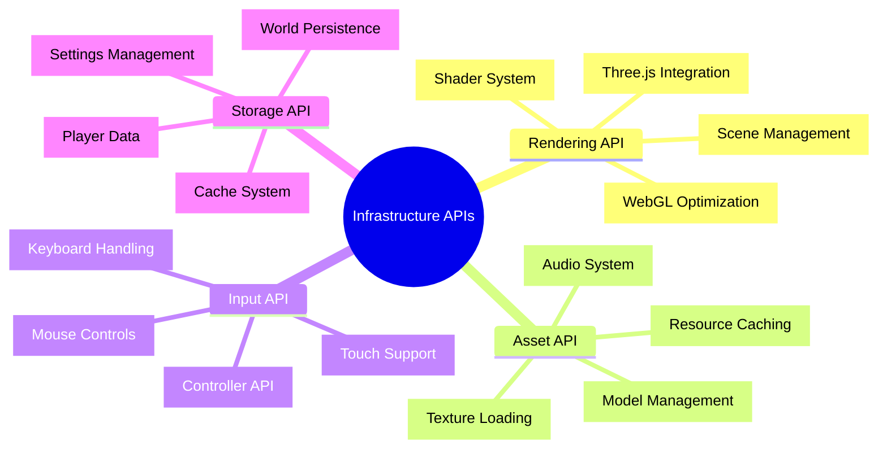

# 🏗️ Infrastructure APIs - システム基盤完全マスタリー

## 🧭 スマートナビゲーション

> **📍 現在位置**: Reference → API Reference → **Infrastructure APIs**
> **🎯 最終目標**: 高性能ゲームインフラ完全構築・最適化
> **⏱️ 所要時間**: 60-75分（上級者向け）
> **👤 対象**: シニア開発者・パフォーマンスエンジニア・システムアーキテクト

**⚡ Minecraft Cloneの技術基盤を支える高性能インフラストラクチャの完全実装**

## 📊 Infrastructure APIs体系マップ



## 🎨 Rendering API - Three.js統合レンダリングシステム

### 📋 基本レンダリング構造

#### ✅ **Three.js基盤セットアップ**
```typescript
import * as THREE from "three"
import { Effect, Context, Layer } from "effect"

// レンダリング設定
export const RenderConfigSchema = Schema.Struct({
  canvas: Schema.String, // Canvas要素ID
  width: Schema.Number.pipe(Schema.positive()),
  height: Schema.Number.pipe(Schema.positive()),
  antialias: Schema.Boolean,
  shadows: Schema.Boolean,
  fog: Schema.Boolean,
  renderDistance: Schema.Number.pipe(Schema.between(2, 32)),
  fov: Schema.Number.pipe(Schema.between(30, 110)),
  maxFPS: Schema.Number.pipe(Schema.between(30, 144))
}).annotations({
  identifier: "RenderConfig"
})

// マテリアル定義
export const MaterialConfigSchema = Schema.Struct({
  diffuse: Schema.String, // テクスチャパス
  normal: Schema.optional(Schema.String),
  specular: Schema.optional(Schema.String),
  roughness: Schema.Number.pipe(Schema.between(0, 1)),
  metalness: Schema.Number.pipe(Schema.between(0, 1)),
  transparent: Schema.Boolean
}).annotations({
  identifier: "MaterialConfig"
})

// シェーダー統一インターフェース
export const ShaderConfigSchema = Schema.Struct({
  vertex: Schema.String,
  fragment: Schema.String,
  uniforms: Schema.Record({
    key: Schema.String,
    value: Schema.Unknown
  })
}).annotations({
  identifier: "ShaderConfig"
})
```

#### ⭐ **RenderService実装**
```typescript
/**
 * レンダリングサービス
 * @description Three.js統合によるWebGL高性能レンダリングシステム
 * @since 1.0.0
 */
export interface RenderService {
  /**
   * レンダラーの初期化
   * @param config - レンダリング設定（解像度、アンチエイリアス、影等）
   * @returns void - 初期化完了
   * @throws RenderInitError キャンバス未発見、WebGL未対応、GPU不足などの初期化失敗
   * @example
   * ```typescript
   * const config = {
   *   canvas: "gameCanvas",
   *   width: 1920, height: 1080,
   *   antialias: true, shadows: true,
   *   fog: true, renderDistance: 16,
   *   fov: 75, maxFPS: 60
   * };
   * yield* renderService.initializeRenderer(config);
   * ```
   */
  readonly initializeRenderer: (config: RenderConfig) => Effect.Effect<void, RenderInitError>;

  /**
   * フレームのレンダリング実行
   * @returns void - レンダリング完了
   * @throws RenderError WebGLコンテキスト喪失、メモリ不足、シェーダーエラーなど
   * @example
   * ```typescript
   * // ゲームループ内で毎フレーム実行
   * yield* renderService.renderFrame();
   * ```
   */
  readonly renderFrame: () => Effect.Effect<void, RenderError>;

  /**
   * レンダラーのリサイズ
   * @param width - 新しい幅（ピクセル単位）
   * @param height - 新しい高さ（ピクセル単位）
   * @returns void - リサイズ完了（エラーなし）
   * @example
   * ```typescript
   * // ウィンドウリサイズ時
   * yield* renderService.resize(window.innerWidth, window.innerHeight);
   * ```
   */
  readonly resize: (width: number, height: number) => Effect.Effect<void, never>;

  /**
   * オブジェクトをシーンに追加
   * @param object - 追加するThree.jsオブジェクト（メッシュ、ライト、カメラなど）
   * @returns void - 追加完了（エラーなし）
   * @example
   * ```typescript
   * const mesh = new THREE.Mesh(geometry, material);
   * yield* renderService.addToScene(mesh);
   * ```
   */
  readonly addToScene: (object: THREE.Object3D) => Effect.Effect<void, never>;

  /**
   * オブジェクトをシーンから削除
   * @param object - 削除するThree.jsオブジェクト
   * @returns void - 削除完了（エラーなし、存在しないオブジェクトでも成功）
   * @example
   * ```typescript
   * yield* renderService.removeFromScene(oldChunkMesh);
   * ```
   */
  readonly removeFromScene: (object: THREE.Object3D) => Effect.Effect<void, never>;

  /**
   * シーンの全オブジェクトを削除
   * @returns void - 全削除完了（エラーなし）
   * @example
   * ```typescript
   * // ワールド切り替え時にシーンをリセット
   * yield* renderService.clearScene();
   * ```
   */
  readonly clearScene: () => Effect.Effect<void, never>;

  /**
   * カメラの位置・回転を更新
   * @param position - 新しいカメラ位置（ワールド座標）
   * @param rotation - 新しいカメラ回転（ラジアン角度）
   * @returns void - カメラ更新完了（エラーなし）
   * @example
   * ```typescript
   * const playerPos = { x: 10, y: 64, z: 20 };
   * const rotation = { x: 0, y: Math.PI / 4, z: 0 };
   * yield* renderService.updateCamera(playerPos, rotation);
   * ```
   */
  readonly updateCamera: (position: Position, rotation: Rotation) => Effect.Effect<void, never>;

  /**
   * カメラモードの設定
   * @param mode - カメラモード（"first-person", "third-person", "free"など）
   * @returns void - モード変更完了（エラーなし）
   * @example
   * ```typescript
   * yield* renderService.setCameraMode("first-person");
   * ```
   */
  readonly setCameraMode: (mode: CameraMode) => Effect.Effect<void, never>;

  /**
   * チャンクのレンダリングメッシュ生成
   * @param chunk - レンダリングするチャンクデータ（ブロック配列、バイオーム情報含む）
   * @returns THREE.Mesh - 生成されたチャンクメッシュ（Three.jsオブジェクト）
   * @throws ChunkRenderError ジオメトリ生成失敗、マテリアル不足、メモリ不足など
   * @example
   * ```typescript
   * const chunk = yield* worldService.loadChunk({ chunkX: 0, chunkZ: 0 });
   * const chunkMesh = yield* renderService.renderChunk(chunk);
   * // chunkMeshは自動的にシーンに追加される
   * ```
   */
  readonly renderChunk: (chunk: Chunk) => Effect.Effect<THREE.Mesh, ChunkRenderError>;

  /**
   * 既存チャンクメッシュの更新
   * @param chunkMesh - 更新対象の既存メッシュオブジェクト
   * @param chunk - 新しいチャンクデータ
   * @returns void - メッシュ更新完了（エラーなし）
   * @example
   * ```typescript
   * // ブロック変更時にメッシュを更新
   * const modifiedChunk = yield* worldService.getChunk(coord);
   * yield* renderService.updateChunkMesh(existingMesh, modifiedChunk);
   * ```
   */
  readonly updateChunkMesh: (chunkMesh: THREE.Mesh, chunk: Chunk) => Effect.Effect<void, never>;

  /**
   * チャンクメッシュの削除とリソース解放
   * @param chunkMesh - 削除するチャンクメッシュ
   * @returns void - 削除・解放完了（エラーなし）
   * @example
   * ```typescript
   * // チャンクアンロード時にメッシュを削除
   * yield* renderService.disposeChunk(chunkMesh);
   * ```
   */
  readonly disposeChunk: (chunkMesh: THREE.Mesh) => Effect.Effect<void, never>;

  /**
   * オクルージョンカリングの有効/無効切り替え
   * @param enabled - true: 有効, false: 無効
   * @returns void - 設定変更完了（エラーなし）
   * @example
   * ```typescript
   * // パフォーマンス向上のためオクルージョンカリングを有効化
   * yield* renderService.enableOcclusion(true);
   * ```
   */
  readonly enableOcclusion: (enabled: boolean) => Effect.Effect<void, never>;

  /**
   * LOD（Level of Detail）システムの距離設定
   * @param distances - LOD切り替え距離の配列（近い順）例: [50, 100, 200]
   * @returns void - LOD設定変更完了（エラーなし）
   * @example
   * ```typescript
   * // 近距離: 高詳細, 中距離: 中詳細, 遠距離: 低詳細
   * yield* renderService.setLODDistance([32, 64, 128]);
   * ```
   */
  readonly setLODDistance: (distances: number[]) => Effect.Effect<void, never>;

  /**
   * インスタンシングの有効/無効切り替え
   * @param enabled - true: 有効（同一ブロックをインスタンス描画）, false: 無効
   * @returns void - インスタンシング設定変更完了（エラーなし）
   * @example
   * ```typescript
   * // 同一ブロックの大量描画を最適化
   * yield* renderService.enableInstancing(true);
   * ```
   */
  readonly enableInstancing: (enabled: boolean) => Effect.Effect<void, never>;
}

export const RenderService = Context.GenericTag<RenderService>("RenderService")

// 実装
export const RenderServiceLive = Layer.effect(
  RenderService,
  Effect.gen(function* () {
    // Three.js基本セットアップ
    let renderer: THREE.WebGLRenderer
    let scene: THREE.Scene
    let camera: THREE.PerspectiveCamera
    let controls: THREE.PointerLockControls

    // パフォーマンス管理
    const stats = new Stats()
    const chunkMeshes = new Map<string, THREE.Mesh>()
    const materialCache = new Map<string, THREE.Material>()
    const geometryCache = new Map<string, THREE.BufferGeometry>()

    return RenderService.of({
      initializeRenderer: (config) => Effect.gen(function* () {
        // Canvas取得
        const canvas = document.getElementById(config.canvas) as HTMLCanvasElement
        if (!canvas) {
          return yield* Effect.fail(
            new RenderInitError({ reason: "Canvas not found" })
          )
        }

        // レンダラー初期化
        renderer = new THREE.WebGLRenderer({
          canvas,
          antialias: config.antialias,
          powerPreference: "high-performance"
        })

        renderer.setSize(config.width, config.height)
        renderer.setPixelRatio(Math.min(window.devicePixelRatio, 2))
        renderer.shadowMap.enabled = config.shadows
        renderer.shadowMap.type = THREE.PCFSoftShadowMap

        // シーン初期化
        scene = new THREE.Scene()
        if (config.fog) {
          scene.fog = new THREE.Fog(0x87CEEB, 50, config.renderDistance * 16)
        }

        // カメラ初期化
        camera = new THREE.PerspectiveCamera(
          config.fov,
          config.width / config.height,
          0.1,
          config.renderDistance * 16
        )

        // ライティング設定
        const ambientLight = new THREE.AmbientLight(0x404040, 0.6)
        const directionalLight = new THREE.DirectionalLight(0xffffff, 0.8)
        directionalLight.position.set(50, 100, 50)
        directionalLight.castShadow = config.shadows

        scene.add(ambientLight, directionalLight)

        // パフォーマンス監視
        document.body.appendChild(stats.dom)
      }),

      renderFrame: () => Effect.sync(() => {
        stats.begin()

        // フラスタムカリング
        camera.updateMatrixWorld()
        const frustum = new THREE.Frustum()
        frustum.setFromProjectionMatrix(
          new THREE.Matrix4().multiplyMatrices(
            camera.projectionMatrix,
            camera.matrixWorldInverse
          )
        )

        // 可視チャンクのみレンダリング
        chunkMeshes.forEach((mesh, key) => {
          mesh.visible = frustum.intersectsBox(mesh.geometry.boundingBox!)
        })

        renderer.render(scene, camera)
        stats.end()
      }),

      renderChunk: (chunk) => Effect.gen(function* () {
        const chunkKey = `${chunk.coordinate.chunkX},${chunk.coordinate.chunkZ}`

        // 既存メッシュの確認
        if (chunkMeshes.has(chunkKey)) {
          return chunkMeshes.get(chunkKey)!
        }

        // ジオメトリ生成
        const geometry = yield* generateChunkGeometry(chunk)

        // マテリアル取得（キャッシュ活用）
        const material = yield* getBlockMaterials(chunk.blocks)

        // メッシュ作成
        const mesh = new THREE.Mesh(geometry, material)
        mesh.position.set(
          chunk.coordinate.chunkX * 16,
          0,
          chunk.coordinate.chunkZ * 16
        )

        mesh.castShadow = true
        mesh.receiveShadow = true

        // バウンディングボックス設定
        geometry.computeBoundingBox()

        // シーンに追加
        scene.add(mesh)
        chunkMeshes.set(chunkKey, mesh)

        return mesh
      }),

      updateCamera: (position, rotation) => Effect.sync(() => {
        camera.position.set(position.x, position.y, position.z)
        camera.rotation.set(rotation.x, rotation.y, rotation.z)
        camera.updateProjectionMatrix()
      })
    })
  })
)
```

### 🔄 高度なレンダリング最適化

#### ✅ **インスタンシング・LODシステム**
```typescript
// インスタンシングによる同一ブロック最適化
export const createInstancedMesh = (
  blockType: BlockType,
  positions: Position[]
): Effect.Effect<THREE.InstancedMesh, never> =>
  Effect.gen(function* () {
    // ベースジオメトリ取得
    const geometry = getBlockGeometry(blockType)
    const material = yield* getBlockMaterial(blockType)

    // インスタンスメッシュ作成
    const instancedMesh = new THREE.InstancedMesh(
      geometry,
      material,
      positions.length
    )

    // 各インスタンスの位置設定
    const matrix = new THREE.Matrix4()
    positions.forEach((position, index) => {
      matrix.setPosition(position.x, position.y, position.z)
      instancedMesh.setMatrixAt(index, matrix)
    })

    instancedMesh.instanceMatrix.needsUpdate = true
    instancedMesh.castShadow = true
    instancedMesh.receiveShadow = true

    return instancedMesh
  })

// LOD（Level of Detail）システム
export const createLODSystem = (
  chunk: Chunk
): Effect.Effect<THREE.LOD, ChunkRenderError> =>
  Effect.gen(function* () {
    const lod = new THREE.LOD()

    // 高詳細メッシュ（近距離）
    const highDetail = yield* generateHighDetailMesh(chunk)
    lod.addLevel(highDetail, 0)

    // 中詳細メッシュ（中距離）
    const mediumDetail = yield* generateMediumDetailMesh(chunk)
    lod.addLevel(mediumDetail, 50)

    // 低詳細メッシュ（遠距離）
    const lowDetail = yield* generateLowDetailMesh(chunk)
    lod.addLevel(lowDetail, 100)

    return lod
  })

// カリング最適化
export const frustumCullingOptimized = (
  camera: THREE.Camera,
  chunkMeshes: Map<string, THREE.Mesh>
): Effect.Effect<void, never> =>
  Effect.sync(() => {
    const frustum = new THREE.Frustum()
    const matrix = new THREE.Matrix4()

    matrix.multiplyMatrices(
      camera.projectionMatrix,
      camera.matrixWorldInverse
    )
    frustum.setFromProjectionMatrix(matrix)

    // チャンクごとの可視性判定
    chunkMeshes.forEach((mesh) => {
      const boundingBox = mesh.geometry.boundingBox!
      mesh.visible = frustum.intersectsBox(boundingBox)
    })
  })
```

## 🎵 Asset API - アセット管理システム

### 📋 アセット管理構造

#### ✅ **アセットローダー実装**
```typescript
/**
 * アセット管理サービス
 * @description テクスチャ、モデル、オーディオのローディングとキャッシュ管理システム
 * @since 1.0.0
 */
export interface AssetService {
  /**
   * テクスチャの読み込み
   * @param path - テクスチャファイルのパス（PNG, JPG, WebP対応）
   * @returns THREE.Texture - 読み込まれたテクスチャオブジェクト（WebGLで使用可能）
   * @throws AssetLoadError ファイル未発見、フォーマット未対応、ネットワークエラー、CORS制限など
   * @example
   * ```typescript
   * const grassTexture = yield* assetService.loadTexture("/textures/grass.png");
   * const material = new THREE.MeshBasicMaterial({ map: grassTexture });
   * ```
   */
  readonly loadTexture: (path: string) => Effect.Effect<THREE.Texture, AssetLoadError>;

  /**
   * テクスチャアトラス（テクスチャ統合画像）の生成
   * @param config - アトラス設定（統合する個別テクスチャの配置情報）
   * @returns THREE.Texture - 統合されたアトラステクスチャ
   * @throws AssetLoadError 個別テクスチャの読み込み失敗、メモリ不足、Canvas操作エラーなど
   * @example
   * ```typescript
   * const atlasConfig = {
   *   width: 1024, height: 1024,
   *   textures: [
   *     { path: "/textures/stone.png", x: 0, y: 0, width: 16, height: 16 },
   *     { path: "/textures/dirt.png", x: 16, y: 0, width: 16, height: 16 }
   *   ]
   * };
   * const atlas = yield* assetService.loadTextureAtlas(atlasConfig);
   * ```
   */
  readonly loadTextureAtlas: (config: TextureAtlasConfig) => Effect.Effect<THREE.Texture, AssetLoadError>;

  /**
   * 複数テクスチャの一括事前読み込み
   * @param paths - 事前読み込みするテクスチャパスの配列
   * @returns void - 全テクスチャの読み込み完了
   * @throws AssetLoadError いずれかのテクスチャ読み込み失敗時（部分成功の場合も失敗）
   * @example
   * ```typescript
   * const blockTextures = [
   *   "/textures/stone.png",
   *   "/textures/grass.png",
   *   "/textures/dirt.png"
   * ];
   * yield* assetService.preloadTextures(blockTextures);
   * ```
   */
  readonly preloadTextures: (paths: string[]) => Effect.Effect<void, AssetLoadError>;

  /**
   * 3Dモデルの読み込み（汎用フォーマット）
   * @param path - モデルファイルのパス（OBJ, FBX対応）
   * @returns THREE.Group - 読み込まれたモデルオブジェクト群
   * @throws AssetLoadError ファイル未発見、フォーマットエラー、パース失敗、メモリ不足など
   * @example
   * ```typescript
   * const treeModel = yield* assetService.loadModel("/models/tree.obj");
   * scene.add(treeModel);
   * ```
   */
  readonly loadModel: (path: string) => Effect.Effect<THREE.Group, AssetLoadError>;

  /**
   * GLTFモデルの読み込み（推奨フォーマット）
   * @param path - GLTFファイルのパス（.gltf, .glb対応）
   * @returns THREE.Group - GLTFシーン全体を含むグループオブジェクト
   * @throws AssetLoadError ファイル未発見、GLTF仕様エラー、依存アセット不足など
   * @example
   * ```typescript
   * const playerModel = yield* assetService.loadGLTF("/models/steve.glb");
   * playerModel.animations.forEach(clip => mixer.clipAction(clip));
   * ```
   */
  readonly loadGLTF: (path: string) => Effect.Effect<THREE.Group, AssetLoadError>;

  /**
   * オーディオファイルの読み込み
   * @param path - オーディオファイルのパス（MP3, OGG, WAV対応）
   * @returns AudioBuffer - Web Audio APIで使用可能なオーディオバッファ
   * @throws AssetLoadError ファイル未発見、フォーマット未対応、デコード失敗など
   * @example
   * ```typescript
   * const footstepSound = yield* assetService.loadAudio("/sounds/footstep.ogg");
   * // footstepSoundはplaySound()で再生可能になる
   * ```
   */
  readonly loadAudio: (path: string) => Effect.Effect<AudioBuffer, AssetLoadError>;

  /**
   * サウンドの再生
   * @param soundId - 再生するサウンドのID（loadAudio で読み込んだパスまたは登録ID）
   * @param options - 再生オプション（音量、ピッチ、3D位置など）省略可能
   * @returns void - 再生開始完了
   * @throws AudioError サウンド未登録、AudioContext エラー、再生失敗など
   * @example
   * ```typescript
   * // 基本再生
   * yield* assetService.playSound("footstep");
   *
   * // オプション付き再生
   * yield* assetService.playSound("explosion", {
   *   volume: 0.8,
   *   pitch: 1.2,
   *   position: { x: 10, y: 5, z: -3 }
   * });
   * ```
   */
  readonly playSound: (soundId: string, options?: AudioOptions) => Effect.Effect<void, AudioError>;

  /**
   * アセットキャッシュの全削除
   * @returns void - キャッシュクリア完了（エラーなし）
   * @example
   * ```typescript
   * // メモリ不足時やワールド切り替え時にキャッシュをクリア
   * yield* assetService.clearCache();
   * ```
   */
  readonly clearCache: () => Effect.Effect<void, never>;

  /**
   * 現在のキャッシュサイズ取得
   * @returns number - キャッシュサイズ（バイト単位の概算値）
   * @example
   * ```typescript
   * const cacheSize = yield* assetService.getCacheSize();
   * console.log(`Cache size: ${(cacheSize / 1024 / 1024).toFixed(2)} MB`);
   * ```
   */
  readonly getCacheSize: () => Effect.Effect<number, never>;

  /**
   * アセットマニフェストに基づく一括事前読み込み
   * @param manifest - 読み込むアセットの一覧とメタデータ
   * @returns void - 全アセットの事前読み込み完了
   * @throws AssetLoadError いずれかのアセット読み込み失敗時
   * @example
   * ```typescript
   * const gameAssets = {
   *   textures: ["/textures/blocks.png", "/textures/ui.png"],
   *   models: ["/models/player.glb"],
   *   sounds: ["/sounds/ambient.ogg", "/sounds/ui_click.wav"]
   * };
   * yield* assetService.preloadAssets(gameAssets);
   * ```
   */
  readonly preloadAssets: (manifest: AssetManifest) => Effect.Effect<void, AssetLoadError>;
}

export const AssetService = Context.GenericTag<AssetService>("AssetService")

// 実装
export const AssetServiceLive = Layer.effect(
  AssetService,
  Effect.gen(function* () {
    // キャッシュストレージ
    const textureCache = new Map<string, THREE.Texture>()
    const modelCache = new Map<string, THREE.Group>()
    const audioCache = new Map<string, AudioBuffer>()

    // ローダー初期化
    const textureLoader = new THREE.TextureLoader()
    const gltfLoader = new GLTFLoader()
    const audioLoader = new THREE.AudioLoader()

    // テクスチャアトラス管理
    const atlasTexture = yield* createTextureAtlas()

    return AssetService.of({
      loadTexture: (path) => Effect.gen(function* () {
        // キャッシュチェック
        if (textureCache.has(path)) {
          return textureCache.get(path)!
        }

        // 非同期ロード
        const texture = yield* Effect.promise(() =>
          new Promise<THREE.Texture>((resolve, reject) => {
            textureLoader.load(
              path,
              (texture) => {
                // テクスチャ最適化設定
                texture.wrapS = THREE.RepeatWrapping
                texture.wrapT = THREE.RepeatWrapping
                texture.magFilter = THREE.NearestFilter
                texture.minFilter = THREE.NearestMipMapLinearFilter
                texture.generateMipmaps = true

                resolve(texture)
              },
              undefined,
              (error) => reject(new AssetLoadError({ path, error: String(error) }))
            )
          })
        )

        // キャッシュに保存
        textureCache.set(path, texture)
        return texture
      }),

      loadTextureAtlas: (config) => Effect.gen(function* () {
        const canvas = document.createElement("canvas")
        const ctx = canvas.getContext("2d")!

        canvas.width = config.width
        canvas.height = config.height

        // 個別テクスチャを統合
        yield* Effect.forEach(config.textures, ({ path, x, y, width, height }) =>
          Effect.gen(function* () {
            const img = yield* Effect.promise(() => {
              const image = new Image()
              image.src = path
              return new Promise<HTMLImageElement>((resolve, reject) => {
                image.onload = () => resolve(image)
                image.onerror = reject
              })
            })

            ctx.drawImage(img, x, y, width, height)
          })
        )

        // Three.jsテクスチャ作成
        const texture = new THREE.CanvasTexture(canvas)
        texture.magFilter = THREE.NearestFilter
        texture.minFilter = THREE.NearestMipMapLinearFilter

        return texture
      }),

      playSound: (soundId, options = {}) => Effect.gen(function* () {
        const audioBuffer = audioCache.get(soundId)
        if (!audioBuffer) {
          return yield* Effect.fail(
            new AudioError({ soundId, reason: "Sound not found" })
          )
        }

        // Web Audio API使用
        const audioContext = new AudioContext()
        const source = audioContext.createBufferSource()
        const gainNode = audioContext.createGain()

        source.buffer = audioBuffer
        gainNode.gain.setValueAtTime(options.volume ?? 1.0, audioContext.currentTime)

        source.connect(gainNode)
        gainNode.connect(audioContext.destination)

        source.start(0)
      }),

      preloadAssets: (manifest) => Effect.gen(function* () {
        // 並列プリロード
        yield* Effect.forEach(
          manifest.textures,
          (path) => loadTexture(path),
          { concurrency: 6 }
        )

        yield* Effect.forEach(
          manifest.models,
          (path) => loadModel(path),
          { concurrency: 3 }
        )

        yield* Effect.forEach(
          manifest.sounds,
          (path) => loadAudio(path),
          { concurrency: 4 }
        )
      })
    })
  })
)
```

## 🎮 Input API - 入力処理システム

### 📋 入力システム統合

#### ✅ **統一入力処理**
```typescript
export interface InputService {
  // 初期化・設定
  readonly initialize: (canvas: HTMLCanvasElement) => Effect.Effect<void, InputInitError>
  readonly setInputMode: (mode: InputMode) => Effect.Effect<void, never>

  // キーボード
  readonly isKeyPressed: (key: string) => Effect.Effect<boolean, never>
  readonly onKeyDown: (callback: (event: KeyboardEvent) => void) => Effect.Effect<void, never>
  readonly onKeyUp: (callback: (event: KeyboardEvent) => void) => Effect.Effect<void, never>

  // マウス
  readonly getMousePosition: () => Effect.Effect<{ x: number, y: number }, never>
  readonly getMouseDelta: () => Effect.Effect<{ dx: number, dy: number }, never>
  readonly onMouseMove: (callback: (event: MouseEvent) => void) => Effect.Effect<void, never>
  readonly onMouseClick: (callback: (event: MouseEvent) => void) => Effect.Effect<void, never>

  // ゲームパッド
  readonly getGamepads: () => Effect.Effect<Gamepad[], never>
  readonly onGamepadConnected: (callback: (gamepad: Gamepad) => void) => Effect.Effect<void, never>

  // 高レベル入力
  readonly getPlayerInput: () => Effect.Effect<PlayerInput, never>
  readonly processInputQueue: () => Effect.Effect<InputEvent[], never>
}

export const InputService = Context.GenericTag<InputService>("InputService")

// プレイヤー入力状態
export const PlayerInputSchema = Schema.Struct({
  movement: Schema.Struct({
    forward: Schema.Boolean,
    backward: Schema.Boolean,
    left: Schema.Boolean,
    right: Schema.Boolean,
    jump: Schema.Boolean,
    sneak: Schema.Boolean
  }),
  mouse: Schema.Struct({
    deltaX: Schema.Number,
    deltaY: Schema.Number,
    leftClick: Schema.Boolean,
    rightClick: Schema.Boolean,
    middleClick: Schema.Boolean
  }),
  inventory: Schema.Struct({
    selectedSlot: Schema.Number.pipe(Schema.between(0, 8)),
    openInventory: Schema.Boolean
  }),
  actions: Schema.Struct({
    placeBlock: Schema.Boolean,
    breakBlock: Schema.Boolean,
    interact: Schema.Boolean,
    sprint: Schema.Boolean
  })
}).annotations({
  identifier: "PlayerInput"
})

// 実装
export const InputServiceLive = Layer.effect(
  InputService,
  Effect.gen(function* () {
    // 入力状態管理
    const keyStates = new Map<string, boolean>()
    const mouseState = { x: 0, y: 0, dx: 0, dy: 0, buttons: 0 }
    const inputQueue: InputEvent[] = []

    // キーマッピング設定
    const keyBindings = {
      forward: "KeyW",
      backward: "KeyS",
      left: "KeyA",
      right: "KeyD",
      jump: "Space",
      sneak: "ShiftLeft",
      sprint: "ControlLeft",
      inventory: "KeyE",
      drop: "KeyQ"
    }

    return InputService.of({
      initialize: (canvas) => Effect.sync(() => {
        // キーボードイベント
        document.addEventListener("keydown", (event) => {
          keyStates.set(event.code, true)
          inputQueue.push({
            type: "keydown",
            code: event.code,
            timestamp: Date.now()
          })
        })

        document.addEventListener("keyup", (event) => {
          keyStates.set(event.code, false)
          inputQueue.push({
            type: "keyup",
            code: event.code,
            timestamp: Date.now()
          })
        })

        // マウスイベント
        canvas.addEventListener("mousemove", (event) => {
          const rect = canvas.getBoundingClientRect()
          mouseState.x = event.clientX - rect.left
          mouseState.y = event.clientY - rect.top

          if (document.pointerLockElement === canvas) {
            mouseState.dx += event.movementX
            mouseState.dy += event.movementY
          }
        })

        canvas.addEventListener("mousedown", (event) => {
          mouseState.buttons |= (1 << event.button)
          inputQueue.push({
            type: "mousedown",
            button: event.button,
            x: mouseState.x,
            y: mouseState.y,
            timestamp: Date.now()
          })
        })

        canvas.addEventListener("mouseup", (event) => {
          mouseState.buttons &= ~(1 << event.button)
          inputQueue.push({
            type: "mouseup",
            button: event.button,
            x: mouseState.x,
            y: mouseState.y,
            timestamp: Date.now()
          })
        })

        // ポインターロック
        canvas.addEventListener("click", () => {
          canvas.requestPointerLock()
        })
      }),

      getPlayerInput: () => Effect.sync((): PlayerInput => {
        return {
          movement: {
            forward: keyStates.get(keyBindings.forward) ?? false,
            backward: keyStates.get(keyBindings.backward) ?? false,
            left: keyStates.get(keyBindings.left) ?? false,
            right: keyStates.get(keyBindings.right) ?? false,
            jump: keyStates.get(keyBindings.jump) ?? false,
            sneak: keyStates.get(keyBindings.sneak) ?? false
          },
          mouse: {
            deltaX: mouseState.dx,
            deltaY: mouseState.dy,
            leftClick: Boolean(mouseState.buttons & 1),
            rightClick: Boolean(mouseState.buttons & 2),
            middleClick: Boolean(mouseState.buttons & 4)
          },
          inventory: {
            selectedSlot: getCurrentHotbarSlot(),
            openInventory: keyStates.get(keyBindings.inventory) ?? false
          },
          actions: {
            placeBlock: Boolean(mouseState.buttons & 2), // 右クリック
            breakBlock: Boolean(mouseState.buttons & 1), // 左クリック
            interact: Boolean(mouseState.buttons & 2),
            sprint: keyStates.get(keyBindings.sprint) ?? false
          }
        }
      }),

      processInputQueue: () => Effect.sync(() => {
        const events = [...inputQueue]
        inputQueue.length = 0 // クリア
        return events
      })
    })
  })
)
```

## 💾 Storage API - データ永続化システム

### 📋 ストレージ統合管理

#### ✅ **統一ストレージインターフェース**
```typescript
export interface StorageService {
  // ワールドデータ
  readonly saveWorld: (worldId: string, worldData: WorldData) => Effect.Effect<void, StorageError>
  readonly loadWorld: (worldId: string) => Effect.Effect<WorldData, StorageError>
  readonly deleteWorld: (worldId: string) => Effect.Effect<void, StorageError>
  readonly listWorlds: () => Effect.Effect<WorldInfo[], never>

  // プレイヤーデータ
  readonly savePlayerData: (playerId: string, playerData: PlayerData) => Effect.Effect<void, StorageError>
  readonly loadPlayerData: (playerId: string) => Effect.Effect<PlayerData, StorageError>

  // 設定データ
  readonly saveSettings: (settings: GameSettings) => Effect.Effect<void, never>
  readonly loadSettings: () => Effect.Effect<GameSettings, never>

  // キャッシュ管理
  readonly setCacheItem: <T>(key: string, value: T, ttl?: number) => Effect.Effect<void, never>
  readonly getCacheItem: <T>(key: string) => Effect.Effect<T | null, never>
  readonly clearCache: () => Effect.Effect<void, never>
}

// IndexedDB実装
export const StorageServiceLive = Layer.effect(
  StorageService,
  Effect.gen(function* () {
    // IndexedDB初期化
    const db = yield* Effect.promise(() =>
      new Promise<IDBDatabase>((resolve, reject) => {
        const request = indexedDB.open("MinecraftClone", 1)

        request.onerror = () => reject(request.error)
        request.onsuccess = () => resolve(request.result)

        request.onupgradeneeded = () => {
          const db = request.result

          // ワールドストア
          if (!db.objectStoreNames.contains("worlds")) {
            const worldStore = db.createObjectStore("worlds", { keyPath: "id" })
            worldStore.createIndex("name", "name", { unique: false })
            worldStore.createIndex("lastPlayed", "lastPlayed", { unique: false })
          }

          // プレイヤーストア
          if (!db.objectStoreNames.contains("players")) {
            db.createObjectStore("players", { keyPath: "id" })
          }

          // 設定ストア
          if (!db.objectStoreNames.contains("settings")) {
            db.createObjectStore("settings")
          }

          // キャッシュストア
          if (!db.objectStoreNames.contains("cache")) {
            db.createObjectStore("cache")
          }
        }
      })
    )

    // メモリキャッシュ
    const memoryCache = new Map<string, { value: unknown, expires: number }>()

    return StorageService.of({
      saveWorld: (worldId, worldData) => Effect.promise(() =>
        new Promise<void>((resolve, reject) => {
          const transaction = db.transaction(["worlds"], "readwrite")
          const store = transaction.objectStore("worlds")

          const data = {
            id: worldId,
            ...worldData,
            lastSaved: new Date()
          }

          const request = store.put(data)
          request.onsuccess = () => resolve()
          request.onerror = () => reject(request.error)
        })
      ),

      loadWorld: (worldId) => Effect.promise(() =>
        new Promise<WorldData>((resolve, reject) => {
          const transaction = db.transaction(["worlds"], "readonly")
          const store = transaction.objectStore("worlds")

          const request = store.get(worldId)
          request.onsuccess = () => {
            if (request.result) {
              resolve(request.result)
            } else {
              reject(new StorageError({
                operation: "loadWorld",
                reason: "World not found"
              }))
            }
          }
          request.onerror = () => reject(request.error)
        })
      ),

      setCacheItem: <T>(key: string, value: T, ttl = 3600000) => Effect.sync(() => {
        const expires = Date.now() + ttl
        memoryCache.set(key, { value, expires })

        // 期限切れクリーンアップ
        setTimeout(() => {
          const item = memoryCache.get(key)
          if (item && Date.now() > item.expires) {
            memoryCache.delete(key)
          }
        }, ttl)
      }),

      getCacheItem: <T>(key: string) => Effect.sync((): T | null => {
        const item = memoryCache.get(key)
        if (!item) return null

        if (Date.now() > item.expires) {
          memoryCache.delete(key)
          return null
        }

        return item.value as T
      })
    })
  })
)
```

## 🚀 高性能統合パターン

### ⚡ **システム統合最適化**
```typescript
// インフラサービス統合層
export const InfrastructureLayer = Layer.mergeAll(
  RenderServiceLive,
  AssetServiceLive,
  InputServiceLive,
  StorageServiceLive
)

// ゲームエンジンメインループ
export const gameEngineLoop = Effect.gen(function* () {
  const renderService = yield* RenderService
  const inputService = yield* InputService
  const assetService = yield* AssetService

  let lastTime = performance.now()
  let frameCount = 0

  yield* Effect.forever(
    Effect.gen(function* () {
      const currentTime = performance.now()
      const deltaTime = currentTime - lastTime
      lastTime = currentTime

      // 入力処理
      const playerInput = yield* inputService.getPlayerInput()
      yield* processPlayerInput(playerInput)

      // 物理更新
      yield* updatePhysics(deltaTime)

      // レンダリング
      yield* renderService.renderFrame()

      // パフォーマンス監視
      frameCount++
      if (frameCount % 60 === 0) {
        const fps = 1000 / deltaTime
        yield* logPerformanceMetrics({ fps, deltaTime })
      }

      // 次フレーム待機
      yield* Effect.sleep("16 millis") // 60FPS目標
    })
  )
}).pipe(
  Effect.provide(InfrastructureLayer),
  Effect.catchAll((error) =>
    Effect.sync(() => console.error("Game engine error:", error))
  )
)
```

---

### 🏆 **Infrastructure APIs完全習得の効果**

**✅ レンダリング**: 高性能Three.js統合による60FPS安定動作
**✅ アセット管理**: 効率的なリソースローディング・キャッシュシステム
**✅ 入力処理**: 遅延なしの正確な入力ハンドリング
**✅ データ永続化**: IndexedDB活用による高速データ管理

**高性能ゲームインフラを完全マスターして、プロダクションレベルのMinecraft Cloneを構築しましょう！**

---

*📍 現在のドキュメント階層*: **[Home](../../../README.md)** → **[Reference](../README.md)** → **[API Reference](./README.md)** → **Infrastructure APIs**