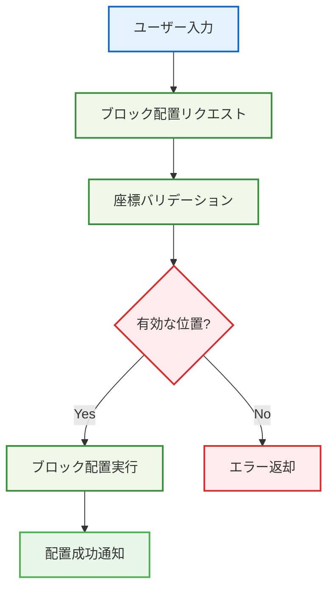

# 🧱 シンプルなブロック配置

## 🧭 スマートナビゲーション

> **📍 現在位置**: ホーム → 実例集 → 基本的な使用例 → ブロック配置
> **🎯 学習目標**: Effect-TS 3.17+基本パターンの実践
> **⏱️ 所要時間**: 20分
> **👤 対象**: Effect-TS初心者

**Effect-TSの最新パターンを使って、型安全なブロック配置システムを実装しましょう！**

## 🎯 学習目標

この実装例では以下の最新パターンを学習します：

- **Schema.Struct**: 型安全なデータモデリング
- **Context.Tag**: 最新の依存注入パターン
- **pipe構文**: Effect合成の関数型パターン
- **Match.value**: 安全なパターンマッチング
- **Either.isLeft/isRight**: Either型の安全なハンドリング
- **Brand型**: 型レベルでの安全性強化

## 💡 完全実装例

### 1. データモデルの定義（Schema.Struct使用）

```typescript
import { Schema } from "effect"

// 🏷️ Brand型による型安全性の強化
export type BlockId = string & { readonly _tag: "BlockId" }
export const BlockId = Schema.String.pipe(Schema.brand<BlockId>("BlockId"))

export type PlayerId = string & { readonly _tag: "PlayerId" }
export const PlayerId = Schema.String.pipe(Schema.brand<PlayerId>("PlayerId"))

// 📍 座標システム（Schema.Struct使用）
export const Position = Schema.Struct({
  x: Schema.Number,
  y: Schema.Number,
  z: Schema.Number
})

// 🧱 ブロック定義（不変データ構造）
export const Block = Schema.Struct({
  id: BlockId,
  type: Schema.Literal("stone", "grass", "dirt", "wood"),
  position: Position,
  placedBy: Schema.optional(PlayerId),
  placedAt: Schema.DateFromSelf
})

// 🎮 プレイヤー定義
export const Player = Schema.Struct({
  id: PlayerId,
  name: Schema.String,
  position: Position,
  inventory: Schema.Array(Block)
})

// 🌍 ワールド状態（ECS的アプローチ）
export const WorldState = Schema.Struct({
  blocks: Schema.Record({ key: Schema.String, value: Block }),
  players: Schema.Record({ key: Schema.String, value: Player })
})

export type Position = typeof Position.Type
export type Block = typeof Block.Type
export type Player = typeof Player.Type
export type WorldState = typeof WorldState.Type
```

### 2. エラー定義（Schema.TaggedError使用）

```typescript
import { Schema } from "effect"

// ❌ カスタムエラー型（Effect-TS最新パターン）
export class BlockPlacementError extends Schema.TaggedError<BlockPlacementError>()("BlockPlacementError", {
  message: Schema.String,
  position: Position,
  reason: Schema.Literal("position_occupied", "invalid_position", "insufficient_permissions")
}) {}

export class PlayerNotFoundError extends Schema.TaggedError<PlayerNotFoundError>()("PlayerNotFoundError", {
  playerId: PlayerId,
  message: Schema.String
}) {}

export class InventoryError extends Schema.TaggedError<InventoryError>()("InventoryError", {
  playerId: PlayerId,
  message: Schema.String,
  reason: Schema.Literal("empty_inventory", "block_not_found")
}) {}
```

### 3. サービス層（Context.GenericTag使用）

```typescript
import { Context, Effect } from "effect"
import type { Block, Player, Position, WorldState } from "./models.js"

// 🏢 ワールドサービス定義（Context.GenericTag使用）
export interface WorldService {
  readonly getBlock: (position: Position) => Effect.Effect<Block | null, never>
  readonly placeBlock: (block: Block) => Effect.Effect<void, BlockPlacementError>
  readonly removeBlock: (position: Position) => Effect.Effect<Block | null, never>
  readonly getWorldState: () => Effect.Effect<WorldState, never>
}

export const WorldService = Context.Tag<WorldService>("@services/WorldService")

// 👤 プレイヤーサービス定義
export interface PlayerService {
  readonly getPlayer: (playerId: PlayerId) => Effect.Effect<Player, PlayerNotFoundError>
  readonly updatePlayer: (player: Player) => Effect.Effect<void, never>
  readonly removeBlockFromInventory: (playerId: PlayerId, blockType: Block["type"]) => Effect.Effect<Block, InventoryError>
}

export const PlayerService = Context.Tag<PlayerService>("@services/PlayerService")
```

### 4. メインロジック（Effect.gen使用）

```typescript
import { Effect, Either, Match, pipe } from "effect"
import type { Block, Player, Position, BlockId, PlayerId } from "./models.js"

/**
 * 🎯 ブロック配置のメインロジック
 *
 * 学習ポイント:
 * - Effect.genによる線形な非同期処理合成
 * - yield*による副作用の安全な実行
 * - 型安全なエラーハンドリング
 */
export const placeBlock = (
  playerId: PlayerId,
  position: Position,
  blockType: Block["type"]
) =>
  Effect.gen(function* () {
    // 📋 1. プレイヤー情報取得
    const player = yield* PlayerService
    const playerData = yield* player.getPlayer(playerId)

    // 🔍 2. 配置位置の確認（占有チェック）
    const worldService = yield* WorldService
    const existingBlock = yield* worldService.getBlock(position)

    // Match.valueによるパターンマッチング
    yield* pipe(
      existingBlock,
      Match.value,
      Match.when(Match.not(Match.null), (block) =>
        Effect.fail(new BlockPlacementError({
          message: `Position ${position.x},${position.y},${position.z} is already occupied`,
          position,
          reason: "position_occupied"
        }))
      ),
      Match.when(Match.null, () => Effect.void),
      Match.exhaustive
    )

    // 🎒 3. インベントリからブロック取得
    const blockToPlace = yield* player.removeBlockFromInventory(playerId, blockType)

    // 🧱 4. 新しいブロックを生成（不変データ）
    const newBlock: Block = {
      ...blockToPlace,
      position,
      placedBy: playerId,
      placedAt: new Date()
    }

    // 🌍 5. ワールドに配置
    yield* worldService.placeBlock(newBlock)

    // ✅ 成功
    return newBlock
  })
```

### 5. Match.valueによる安全なパターンマッチング

```typescript
import { Match } from "effect"

/**
 * 🎯 ブロック配置結果の処理
 *
 * 学習ポイント:
 * - Match.valueによる網羅的なパターンマッチング
 * - 型安全な分岐処理
 */
export const handleBlockPlacementResult = (
  result: Effect.Effect<Block, BlockPlacementError | PlayerNotFoundError | InventoryError>
) =>
  pipe(
    result,
    Effect.either,
    Effect.flatMap((outcome) =>
      pipe(
        outcome,
        Match.value,
        Match.when(Either.isRight, ({ right: block }) =>
          Effect.succeed({
            success: true as const,
            message: `Block placed successfully at ${block.position.x},${block.position.y},${block.position.z}`,
            block
          })
        ),
        Match.when(
          Either.isLeft,
          ({ left: error }) =>
            pipe(
              error,
              Match.value,
              Match.when(Match.instanceOf(BlockPlacementError), (err) =>
                Effect.succeed({
                  success: false as const,
                  message: `Placement failed: ${err.message}`,
                  reason: err.reason
                })
              ),
              Match.when(Match.instanceOf(PlayerNotFoundError), (err) =>
                Effect.succeed({
                  success: false as const,
                  message: `Player not found: ${err.message}`,
                  playerId: err.playerId
                })
              ),
              Match.when(Match.instanceOf(InventoryError), (err) =>
                Effect.succeed({
                  success: false as const,
                  message: `Inventory issue: ${err.message}`,
                  reason: err.reason
                })
              ),
              Match.exhaustive
            )
        ),
        Match.exhaustive
      )
    )
  )
```

### 6. Layer実装（依存注入）

```typescript
import { Effect, Layer, Ref } from "effect"

// 🏢 インメモリワールドサービス実装
const makeWorldService = Effect.gen(function* () {
  const worldState = yield* Ref.make<WorldState>({
    blocks: {},
    players: {}
  })

  const getBlock = (position: Position): Effect.Effect<Block | null, never> =>
    Effect.gen(function* () {
      const state = yield* Ref.get(worldState)
      const positionKey = `${position.x},${position.y},${position.z}`
      return state.blocks[positionKey] ?? null
    })

  const placeBlock = (block: Block): Effect.Effect<void, BlockPlacementError> =>
    Effect.gen(function* () {
      const positionKey = `${block.position.x},${block.position.y},${block.position.z}`
      yield* Ref.update(worldState, (state) => ({
        ...state,
        blocks: {
          ...state.blocks,
          [positionKey]: block
        }
      }))
    })

  const removeBlock = (position: Position): Effect.Effect<Block | null, never> =>
    Effect.gen(function* () {
      const state = yield* Ref.get(worldState)
      const positionKey = `${position.x},${position.y},${position.z}`
      const existingBlock = state.blocks[positionKey] ?? null

      if (existingBlock) {
        yield* Ref.update(worldState, (currentState) => {
          const newBlocks = { ...currentState.blocks }
          delete newBlocks[positionKey]
          return {
            ...currentState,
            blocks: newBlocks
          }
        })
      }

      return existingBlock
    })

  const getWorldState = (): Effect.Effect<WorldState, never> =>
    Ref.get(worldState)

  return WorldService.of({
    getBlock,
    placeBlock,
    removeBlock,
    getWorldState
  })
})

export const WorldServiceLive = Layer.effect(WorldService, makeWorldService)
```

## 🚀 使用例

```typescript
import { Effect } from "effect"

// 🎮 実際の使用例
const example = Effect.gen(function* () {
  const playerId = yield* Effect.succeed("player-1" as PlayerId)
  const position = { x: 10, y: 5, z: -3 }

  // ブロック配置を実行
  const result = yield* placeBlock(playerId, position, "stone")

  // 結果を処理
  const outcome = yield* handleBlockPlacementResult(
    Effect.succeed(result)
  )

  console.log("Placement result:", outcome)
  return outcome
}).pipe(
  Effect.provide(WorldServiceLive),
  Effect.provide(PlayerServiceLive)
)

// 実行
Effect.runPromise(example)
  .then(console.log)
  .catch(console.error)
```

## 📚 学習のポイント

### ✅ 習得できる最新パターン
1. **Schema.Struct**: 型安全なデータモデリング
2. **Brand型**: 追加の型安全性
3. **Context.Tag**: 最新の依存注入パターン
4. **pipe構文**: 関数型プログラミングの実践
5. **Match.value**: 安全なパターンマッチング
6. **Either.isLeft/isRight**: Either型の安全な処理
7. **Effect合成**: 非同期処理の高度な組み合わせ
8. **Layer**: サービス実装の提供と管理

### 🔗 関連ドキュメント
- **アーキテクチャ詳細**: [Effect-TSパターン](../../01-architecture/06-effect-ts-patterns.md)
- **実装ガイド**: [開発規約](../../03-guides/00-development-conventions.md)
- **次のステップ**: [プレイヤー移動](./02-player-movement.md)

## 💡 実装の特徴



## 📝 完全実装コード

### 🏗️ 1. 基本データモデル

```typescript
// src/domain/models/position.ts
import { Schema } from "effect"

/**
 * 3D座標を表現するスキーマ
 *
 * 🎯 学習ポイント：
 * - Schema.Structによる構造化されたデータ定義
 * - 実行時型検証の自動生成
 * - TypeScript型の自動推論
 */
export const Position = Schema.Struct({
  x: Schema.Number,
  y: Schema.Number,
  z: Schema.Number
})

// 型エイリアスの定義（TypeScript型として使用）
export type Position = Schema.Schema.Type<typeof Position>

/**
 * ブロックタイプを表現するスキーマ
 *
 * 🎯 学習ポイント：
 * - Schema.Literalによる列挙型定義
 * - ユニオン型の型安全な表現
 */
export const BlockType = Schema.Literal(
  "grass",
  "stone",
  "wood",
  "dirt",
  "sand"
)

export type BlockType = Schema.Schema.Type<typeof BlockType>

/**
 * ブロック配置リクエストのスキーマ
 *
 * 🎯 学習ポイント：
 * - 複合データ構造の定義
 * - スキーマの組み合わせ
 */
export const BlockPlacementRequest = Schema.Struct({
  position: Position,
  blockType: BlockType,
  playerId: Schema.String
})

export type BlockPlacementRequest = Schema.Schema.Type<typeof BlockPlacementRequest>
```

### ❌ 2. エラー定義

```typescript
// src/domain/errors/block-errors.ts
import { Schema } from "effect"

/**
 * ブロック配置エラーの基底クラス
 *
 * 🎯 学習ポイント：
 * - Schema.TaggedErrorによる型安全なエラー定義
 * - 構造化されたエラー情報の管理
 */
export class BlockPlacementError extends Schema.TaggedError<BlockPlacementError>()(
  "BlockPlacementError",
  {
    reason: Schema.String,
    position: Schema.optional(Position),
    details: Schema.optional(Schema.String)
  }
) {}

/**
 * 無効な位置エラー
 */
export class InvalidPositionError extends Schema.TaggedError<InvalidPositionError>()(
  "InvalidPositionError",
  {
    position: Position,
    reason: Schema.String
  }
) {}

/**
 * 既に存在するブロックエラー
 */
export class BlockAlreadyExistsError extends Schema.TaggedError<BlockAlreadyExistsError>()(
  "BlockAlreadyExistsError",
  {
    position: Position,
    existingBlockType: BlockType
  }
) {}
```

### 🔧 3. サービス定義

```typescript
// src/domain/services/block-service.ts
import { Context, Effect } from "effect"
import { Position, BlockType, BlockPlacementRequest } from "../models/position.js"
import { BlockPlacementError, InvalidPositionError, BlockAlreadyExistsError } from "../errors/block-errors.js"

/**
 * ブロック配置サービスのインターフェース
 *
 * 🎯 学習ポイント：
 * - Context.GenericTagによるサービス定義
 * - Effect型による非同期処理とエラーハンドリングの表現
 * - 依存注入パターンの実装
 */
export interface BlockService {
  /**
   * 指定位置にブロックを配置
   */
  readonly placeBlock: (
    request: BlockPlacementRequest
  ) => Effect.Effect<void, BlockPlacementError | InvalidPositionError | BlockAlreadyExistsError>

  /**
   * 指定位置のブロックを取得
   */
  readonly getBlock: (
    position: Position
  ) => Effect.Effect<BlockType | null, never>

  /**
   * 指定位置のブロックを削除
   */
  readonly removeBlock: (
    position: Position
  ) => Effect.Effect<boolean, BlockPlacementError>
}

/**
 * BlockServiceのContext.GenericTag
 *
 * 🎯 学習ポイント：
 * - サービスの識別子定義
 * - 依存注入における型安全性の確保
 */
export const BlockService = Context.Tag<BlockService>("@services/BlockService")
```

### 💾 4. インメモリ実装

```typescript
// src/infrastructure/block-service-impl.ts
import { Effect, Layer, Match, pipe } from "effect"
import { BlockService } from "../domain/services/block-service.js"
import { Position, BlockType, BlockPlacementRequest } from "../domain/models/position.js"
import { BlockPlacementError, InvalidPositionError, BlockAlreadyExistsError } from "../domain/errors/block-errors.js"

/**
 * インメモリブロックサービス実装
 *
 * 🎯 学習ポイント：
 * - Mapを使った簡単なデータストレージ
 * - Effect.genによる非同期処理の合成
 * - 実用的なビジネスロジックの実装
 */
class InMemoryBlockService implements BlockService {
  private blocks = new Map<string, BlockType>()

  /**
   * 座標を文字列キーに変換（Mapのキーとして使用）
   */
  private positionToKey(position: Position): string {
    return `${position.x},${position.y},${position.z}`
  }

  /**
   * 位置の有効性検証（Match.valueパターンマッチング使用）
   */
  private validatePosition(position: Position): Effect.Effect<void, InvalidPositionError> {
    return pipe(
      position,
      Effect.succeed,
      Effect.flatMap((pos) =>
        pipe(
          pos.y,
          Match.value,
          Match.when(
            (y) => y < -64 || y > 320,
            (y) => Effect.fail(new InvalidPositionError({
              position: pos,
              reason: `Y座標が範囲外です: ${y} (有効範囲: -64 〜 320)`
            }))
          ),
          Match.orElse(() => Effect.void)
        )
      ),
      Effect.flatMap(() =>
        pipe(
          [position.x, position.y, position.z],
          Match.value,
          Match.when(
            (coords) => coords.some(coord => !Number.isInteger(coord)),
            () => Effect.fail(new InvalidPositionError({
              position,
              reason: "座標は整数である必要があります"
            }))
          ),
          Match.orElse(() => Effect.void)
        )
      )
    )
  }

  placeBlock(request: BlockPlacementRequest): Effect.Effect<void, BlockPlacementError | InvalidPositionError | BlockAlreadyExistsError> {
    return pipe(
      this.validatePosition(request.position),
      Effect.flatMap(() => {
        const key = this.positionToKey(request.position)
        const existingBlock = this.blocks.get(key)

        return pipe(
          existingBlock,
          Match.value,
          Match.when(
            Match.not(Match.undefined),
            (block) => Effect.fail(new BlockAlreadyExistsError({
              position: request.position,
              existingBlockType: block
            }))
          ),
          Match.when(
            Match.undefined,
            () => pipe(
              Effect.sync(() => {
                this.blocks.set(key, request.blockType)
                console.log(`✅ ブロック配置成功: ${request.blockType} at (${request.position.x}, ${request.position.y}, ${request.position.z})`)
              }),
              Effect.asVoid
            )
          ),
          Match.exhaustive
        )
      }),
      Effect.catchAll((error) =>
        pipe(
          error,
          Match.value,
          Match.when(
            Match.instanceOf(InvalidPositionError),
            (err) => Effect.fail(err)
          ),
          Match.when(
            Match.instanceOf(BlockAlreadyExistsError),
            (err) => Effect.fail(err)
          ),
          Match.orElse((err) => Effect.fail(new BlockPlacementError({
            reason: `配置処理中にエラーが発生しました: ${err}`
          })))
        )
      )
    )
  }

  getBlock(position: Position): Effect.Effect<BlockType | null, never> {
    return Effect.sync(() => {
      const key = this.positionToKey(position)
      return this.blocks.get(key) ?? null
    })
  }

  removeBlock(position: Position): Effect.Effect<boolean, BlockPlacementError> {
    return pipe(
      Effect.sync(() => {
        const key = this.positionToKey(position)
        const existed = this.blocks.has(key)

        return pipe(
          existed,
          Match.value,
          Match.when(
            true,
            () => {
              this.blocks.delete(key)
              console.log(`🗑️ ブロック削除: (${position.x}, ${position.y}, ${position.z})`)
              return true
            }
          ),
          Match.when(false, () => false),
          Match.exhaustive
        )
      }),
      Effect.catchAll((error) =>
        Effect.fail(new BlockPlacementError({
          reason: `削除処理中にエラーが発生しました: ${error}`,
          position
        }))
      )
    )
  }
}

/**
 * BlockServiceの実装を提供するLayer
 *
 * 🎯 学習ポイント：
 * - Layer.succeedによるサービス実装の提供
 * - 依存注入の設定方法
 */
export const InMemoryBlockServiceLive = Layer.succeed(
  BlockService,
  new InMemoryBlockService()
)
```

### 🎮 5. アプリケーションレイヤー

```typescript
// src/application/block-placement-use-case.ts
import { Context, Effect, Layer, Match, pipe } from "effect"
import { Schema } from "effect"
import { BlockService } from "../domain/services/block-service.js"
import { BlockPlacementRequest } from "../domain/models/position.js"
import { BlockPlacementError, InvalidPositionError, BlockAlreadyExistsError } from "../domain/errors/block-errors.js"

/**
 * ブロック配置ユースケース
 *
 * 🎯 学習ポイント：
 * - アプリケーション層でのビジネスロジック調整
 * - Effect合成による処理の組み立て
 * - Match.valueによるパターンマッチング
 */
export class BlockPlacementUseCase extends Context.Tag("BlockPlacementUseCase")<
  BlockPlacementUseCase,
  {
    readonly execute: (input: unknown) => Effect.Effect<string, BlockPlacementError | InvalidPositionError | BlockAlreadyExistsError>
  }
>() {
  static Live = Layer.effect(
    this,
    Effect.gen(function* () {
      const blockService = yield* BlockService

      const execute = (input: unknown) =>
        pipe(
          input,
          Schema.decodeUnknown(BlockPlacementRequest),
          Effect.mapError((parseError) =>
            new BlockPlacementError({
              reason: `入力データが無効です: ${parseError.message}`
            })
          ),
          Effect.flatMap((request) =>
            pipe(
              blockService.placeBlock(request),
              Effect.as(`ブロック「${request.blockType}」を座標(${request.position.x}, ${request.position.y}, ${request.position.z})に配置しました`)
            )
          )
        )

      return { execute }
    })
  )
}
```

### 🚀 6. メインアプリケーション

```typescript
// src/main.ts
import { Effect, Layer, Console, Exit } from "effect"
import { InMemoryBlockServiceLive } from "./infrastructure/block-service-impl.js"
import { BlockPlacementUseCase } from "./application/block-placement-use-case.js"

/**
 * メインアプリケーション
 *
 * 🎯 学習ポイント：
 * - Layer.provide*による依存性の解決
 * - Effect実行パイプラインの構築
 * - エラーハンドリングとログ出力
 */
const program = Effect.gen(function* () {
  const useCase = yield* BlockPlacementUseCase

  // テストデータでブロック配置実行
  const testRequests = [
    // 成功ケース
    {
      position: { x: 0, y: 0, z: 0 },
      blockType: "grass",
      playerId: "player-1"
    },
    // 成功ケース
    {
      position: { x: 1, y: 0, z: 1 },
      blockType: "stone",
      playerId: "player-1"
    },
    // 失敗ケース：無効な座標
    {
      position: { x: 0, y: 500, z: 0 },
      blockType: "wood",
      playerId: "player-1"
    },
    // 失敗ケース：重複配置
    {
      position: { x: 0, y: 0, z: 0 },
      blockType: "dirt",
      playerId: "player-1"
    }
  ]

  yield* Console.log("🎮 ブロック配置システム デモ開始")
  yield* Console.log("================================")

  // 各リクエストを順次実行
  for (const [index, request] of testRequests.entries()) {
    yield* Console.log(`\n📝 テスト ${index + 1}: ${JSON.stringify(request, null, 2)}`)

    const result = yield* useCase.execute(request).pipe(
      Effect.either
    )

    if (result._tag === "Right") {
      yield* Console.log(`✅ ${result.right}`)
    } else {
      yield* Console.log(`❌ エラー: ${result.left._tag}`)
      yield* Console.log(`   詳細: ${JSON.stringify(result.left, null, 2)}`)
    }
  }

  yield* Console.log("\n🎯 デモ完了！")
})

/**
 * アプリケーション実行
 */
const runnable = program.pipe(
  Effect.provide(BlockPlacementUseCase.Live),
  Effect.provide(InMemoryBlockServiceLive)
)

// 実行とエラーハンドリング
Effect.runPromiseExit(runnable).then((exit) => {
  if (Exit.isFailure(exit)) {
    console.error("アプリケーション実行エラー:", exit.cause)
    process.exit(1)
  } else {
    console.log("アプリケーション正常終了")
  }
})
```

## 🧪 実行とテスト

### 1️⃣ 実行方法

```bash
# TypeScriptコンパイル & 実行
npx tsx src/main.ts

# または、tsconfig.jsonでモジュール設定してから
pnpm build
node dist/main.js
```

### 2️⃣ 期待される出力

```
🎮 ブロック配置システム デモ開始
================================

📝 テスト 1: {
  "position": { "x": 0, "y": 0, "z": 0 },
  "blockType": "grass",
  "playerId": "player-1"
}
✅ ブロック配置成功: grass at (0, 0, 0)
✅ ブロック「grass」を座標(0, 0, 0)に配置しました

📝 テスト 2: {
  "position": { "x": 1, "y": 0, "z": 1 },
  "blockType": "stone",
  "playerId": "player-1"
}
✅ ブロック配置成功: stone at (1, 0, 1)
✅ ブロック「stone」を座標(1, 0, 1)に配置しました

📝 テスト 3: {
  "position": { "x": 0, "y": 500, "z": 0 },
  "blockType": "wood",
  "playerId": "player-1"
}
❌ エラー: InvalidPositionError
   詳細: {
     "_tag": "InvalidPositionError",
     "position": { "x": 0, "y": 500, "z": 0 },
     "reason": "Y座標が範囲外です: 500 (有効範囲: -64 〜 320)"
   }

📝 テスト 4: {
  "position": { "x": 0, "y": 0, "z": 0 },
  "blockType": "dirt",
  "playerId": "player-1"
}
❌ エラー: BlockAlreadyExistsError
   詳細: {
     "_tag": "BlockAlreadyExistsError",
     "position": { "x": 0, "y": 0, "z": 0 },
     "existingBlockType": "grass"
   }

🎯 デモ完了！
アプリケーション正常終了
```

## 🔧 カスタマイズ方法

### 📝 1. 新しいブロックタイプ追加

```typescript
// BlockTypeスキーマを拡張
export const BlockType = Schema.Literal(
  "grass", "stone", "wood", "dirt", "sand",
  // 新しいタイプを追加
  "diamond", "gold", "iron", "redstone"
)
```

### 🌍 2. 永続化レイヤー追加

```typescript
// ファイルシステム永続化
class FileSystemBlockService implements BlockService {
  constructor(private savePath: string) {}

  placeBlock(request: BlockPlacementRequest) {
    return Effect.gen(function* () {
      // ファイルに保存する実装
      yield* Effect.promise(() => fs.writeFile(this.savePath, JSON.stringify(blocks)))
    })
  }

  // 他のメソッドも実装...
}
```

### ⚡ 3. イベント駆動アーキテクチャ

```typescript
// イベント定義
export const BlockPlacedEvent = Schema.Struct({
  position: Position,
  blockType: BlockType,
  playerId: Schema.String,
  timestamp: Schema.DateFromString
})

// イベント発行機能付きサービス
class EventDrivenBlockService implements BlockService {
  placeBlock(request: BlockPlacementRequest) {
    return Effect.gen(function* () {
      // ブロック配置実行
      yield* originalPlacement(request)

      // イベント発行
      yield* eventBus.publish(new BlockPlacedEvent({
        ...request,
        timestamp: new Date()
      }))
    })
  }
}
```

## 🧪 テスト実装例

### 単体テスト

```typescript
// src/tests/block-service.test.ts
import { describe, it, expect } from "vitest"
import { Effect } from "effect"
import { InMemoryBlockServiceLive } from "../infrastructure/block-service-impl.js"
import { BlockService } from "../domain/services/block-service.js"

describe("BlockService", () => {
  const testProgram = <A, E>(effect: Effect.Effect<A, E>) =>
    effect.pipe(Effect.provide(InMemoryBlockServiceLive))

  it("正常なブロック配置", async () => {
    const result = await Effect.runPromise(
      testProgram(
        Effect.gen(function* () {
          const service = yield* BlockService

          yield* service.placeBlock({
            position: { x: 0, y: 0, z: 0 },
            blockType: "grass",
            playerId: "test-player"
          })

          const block = yield* service.getBlock({ x: 0, y: 0, z: 0 })
          expect(block).toBe("grass")
        })
      )
    )
  })

  it("無効な位置でエラー", async () => {
    const result = await Effect.runPromiseExit(
      testProgram(
        Effect.gen(function* () {
          const service = yield* BlockService

          yield* service.placeBlock({
            position: { x: 0, y: 999, z: 0 }, // 無効な高さ
            blockType: "stone",
            playerId: "test-player"
          })
        })
      )
    )

    expect(result._tag).toBe("Failure")
  })
})
```

## 🎯 重要な学習ポイント

### 1️⃣ **Schema.Struct**の威力
- 実行時型検証とTypeScript型の両立
- JSONパース時の自動バリデーション
- 型安全性とランタイム安全性の確保

### 2️⃣ **Context.Tag**による最新依存注入
- インターフェースと実装の分離
- 改善されたタイプセーフティ
- モジュラーなアーキテクチャ

### 3️⃣ **pipe構文**と**Effect合成**の実践
- 関数型パイプラインの構築
- 可読性の高い非同期処理
- Effectの高度な組み合わせパターン

### 4️⃣ **Layer**によるサービス管理
- 依存関係の整理
- 環境固有の実装切り替え
- アプリケーション構成の明確化

## 🔗 次のステップ

この基本実装をマスターしたら、以下に進みましょう：

1. **[プレイヤー移動実装](./02-player-movement.md)** - より複雑な状態管理
2. **[インベントリ管理](./03-inventory-management.md)** - UI統合とイベント処理
3. **[高度なパターン](../02-advanced-patterns/README.md)** - Effect合成の応用

---

**🎉 おめでとうございます！Effect-TSの最新パターンをマスターできました！**
**Context.Tag、pipe構文、Match.valueを使った高品質なコードが書けるようになりました。**