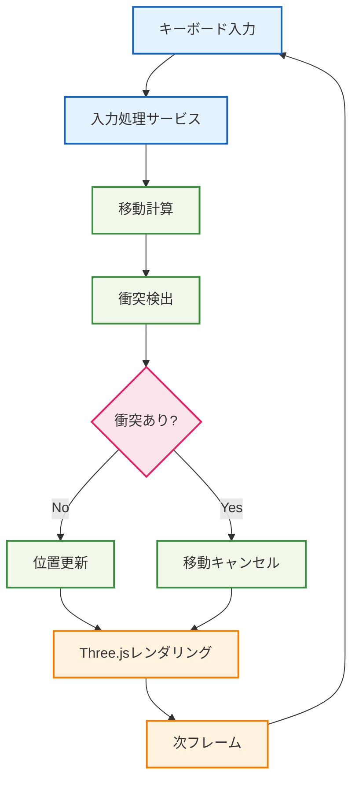

# 🏃 プレイヤー移動実装

## 🧭 スマートナビゲーション

> **📍 現在位置**: ホーム → 実例集 → 基本的な使用例 → プレイヤー移動
> **🎯 学習目標**: Effect-TS + Three.js統合と3D物理演算
> **⏱️ 所要時間**: 30分
> **👤 対象**: Effect-TS基礎習得済み

**Effect-TSとThree.jsを統合して、型安全な3Dプレイヤー移動システムを実装しましょう！**

## 🎯 学習目標

この実装例では以下を学習します：

- **Effect + Three.js統合**: 外部ライブラリとのシームレスな統合
- **Ref**: リアルタイム状態管理
- **Schedule**: 定期実行処理（ゲームループ）
- **Vector3演算**: 3D数学とEffect-TSの組み合わせ
- **衝突検出**: 物理演算の基本実装
- **入力処理**: キーボード入力の関数型処理

## 💡 実装アーキテクチャ



## 📝 完全実装コード

### 🧮 1. 3D数学ユーティリティ

```typescript
// src/domain/math/vector3.ts
import { Schema } from "@effect/schema"
import { Data, Equal, Hash, Brand, Match } from "effect"

/**
 * Branded type for coordinate values (型安全性強化)
 */
export type Coordinate = number & Brand.Brand<"Coordinate">
export const Coordinate = Brand.nominal<Coordinate>()

/**
 * 3Dベクトルスキーマ（Branded Types使用）
 *
 * 🎯 学習ポイント：
 * - Branded Typesによる型安全性
 * - Schema定義による厳密な型チェック
 * - 座標値の意味的な区別
 */
export const Vector3 = Schema.Struct({
  x: Schema.Number.pipe(Schema.brand(Coordinate)),
  y: Schema.Number.pipe(Schema.brand(Coordinate)),
  z: Schema.Number.pipe(Schema.brand(Coordinate))
})

export type Vector3 = Schema.Schema.Type<typeof Vector3>

/**
 * Vector3用のData構造（不変・比較可能）
 */
export class Vector3Data extends Data.Struct<{
  readonly x: number
  readonly y: number
  readonly z: number
}> {
  /**
   * ベクトル加算（Match.valueパターンマッチング）
   *
   * 🎯 学習ポイント：
   * - if/elseの代替としてMatch.valueを使用
   * - 型安全性とコード可読性の向上
   * - パターンマッチングによる条件分岐の明確化
   */
  add(other: Vector3Data): Vector3Data {
    // Match.valueでパターンマッチング（従来のif文の代替）
    return Match.value(other).pipe(
      // ゼロベクトルの場合は即座に自身を返す（Early Return効果）
      Match.when(
        (v) => v.x === 0 && v.y === 0 && v.z === 0,
        () => this
      ),
      // その他の場合は通常の加算処理
      Match.orElse(() =>
        new Vector3Data({
          x: Coordinate(this.x + other.x),
          y: Coordinate(this.y + other.y),
          z: Coordinate(this.z + other.z)
        })
      )
    )
  }

  /**
   * ベクトル減算（Early Return実装）
   */
  subtract(other: Vector3Data): Vector3Data {
    // Early Return: ゼロベクトルの場合は即座に自身を返す
    if (other.x === 0 && other.y === 0 && other.z === 0) {
      return this
    }

    return new Vector3Data({
      x: Coordinate(this.x - other.x),
      y: Coordinate(this.y - other.y),
      z: Coordinate(this.z - other.z)
    })
  }

  /**
   * スカラー倍（Match.valueパターンマッチング）
   *
   * 🎯 学習ポイント：
   * - 複数条件のif/elseをMatch.whenで置換
   * - 網羅的なパターンマッチングによる型安全性
   * - 条件の優先順位を明確化
   */
  multiply(scalar: number): Vector3Data {
    // Match.valueで複数条件を型安全にマッチング
    return Match.value(scalar).pipe(
      // 最適化: スカラーが1の場合は自身をそのまま返す
      Match.when(1, () => this),
      // 最適化: スカラーが0の場合はゼロベクトルを返す
      Match.when(0, () => ZERO_VECTOR),
      // デフォルト: 通常のスカラー倍計算
      Match.orElse((s) =>
        new Vector3Data({
          x: Coordinate(this.x * s),
          y: Coordinate(this.y * s),
          z: Coordinate(this.z * s)
        })
      )
    )
  }

  /**
   * ベクトルの長さ
   */
  get magnitude(): number {
    return Math.sqrt(this.x * this.x + this.y * this.y + this.z * this.z)
  }

  /**
   * ベクトルの正規化（Early Return実装）
   */
  normalize(): Vector3Data {
    const mag = this.magnitude

    // Early Return: ゼロベクトルの場合
    if (mag === 0) {
      return ZERO_VECTOR
    }

    // Early Return: 既に正規化済みの場合
    if (Math.abs(mag - 1) < Number.EPSILON) {
      return this
    }

    return this.multiply(1 / mag)
  }

  /**
   * 距離計算
   */
  distanceTo(other: Vector3Data): number {
    return this.subtract(other).magnitude
  }

  /**
   * Three.js Vector3への変換（Branded Types対応）
   */
  toThreeVector3(): THREE.Vector3 {
    return new THREE.Vector3(this.x, this.y, this.z)
  }

  /**
   * Three.js Vector3からの作成（Branded Types対応）
   */
  static fromThreeVector3(vec: THREE.Vector3): Vector3Data {
    return new Vector3Data({
      x: Coordinate(vec.x),
      y: Coordinate(vec.y),
      z: Coordinate(vec.z)
    })
  }
}

/**
 * ゼロベクトル定数（Branded Types対応）
 */
export const ZERO_VECTOR = new Vector3Data({
  x: Coordinate(0),
  y: Coordinate(0),
  z: Coordinate(0)
})

/**
 * 方向ベクトル定数（Branded Types対応）
 */
export const DIRECTION_VECTORS = {
  FORWARD: new Vector3Data({ x: Coordinate(0), y: Coordinate(0), z: Coordinate(-1) }),
  BACKWARD: new Vector3Data({ x: Coordinate(0), y: Coordinate(0), z: Coordinate(1) }),
  LEFT: new Vector3Data({ x: Coordinate(-1), y: Coordinate(0), z: Coordinate(0) }),
  RIGHT: new Vector3Data({ x: Coordinate(1), y: Coordinate(0), z: Coordinate(0) }),
  UP: new Vector3Data({ x: Coordinate(0), y: Coordinate(1), z: Coordinate(0) }),
  DOWN: new Vector3Data({ x: Coordinate(0), y: Coordinate(-1), z: Coordinate(0) })
} as const
```

### 🎮 2. 入力システム

```typescript
// src/infrastructure/input-system.ts
import { Context, Effect, Ref, Layer, Schema } from "effect"
import { Match } from "effect"

/**
 * キー状態の管理（Schema定義）
 */
export const KeyState = Schema.Struct({
  isPressed: Schema.Boolean,
  justPressed: Schema.Boolean,
  justReleased: Schema.Boolean
})

export type KeyState = Schema.Schema.Type<typeof KeyState>

/**
 * 移動入力エラー（TaggedError定義）
 */
export class InputSystemError extends Schema.TaggedError<InputSystemError>("InputSystemError")(
  "InputSystemError",
  {
    message: Schema.String
  }
) {}

/**
 * 入力システムサービス
 *
 * 🎯 学習ポイント：
 * - DOMイベントとEffect-TSの統合
 * - Refによるリアルタイム状態管理
 * - 関数型でのイベント処理
 */
/**
 * 移動入力スキーマ（型安全性強化）
 */
export const MovementInputState = Schema.Struct({
  forward: Schema.Boolean,
  backward: Schema.Boolean,
  left: Schema.Boolean,
  right: Schema.Boolean,
  jump: Schema.Boolean,
  run: Schema.Boolean
})

export type MovementInputState = Schema.Schema.Type<typeof MovementInputState>

/**
 * 入力システムサービス（Effect-TSパターン適用）
 */
export interface InputSystem {
  readonly getKeyState: (key: string) => Effect.Effect<KeyState, InputSystemError>
  readonly isKeyPressed: (key: string) => Effect.Effect<boolean, InputSystemError>
  readonly getMovementInput: () => Effect.Effect<MovementInputState, InputSystemError>
}

export const InputSystem = Context.GenericTag<InputSystem>("InputSystem")

/**
 * ブラウザ入力システムの実装
 */
class BrowserInputSystem implements InputSystem {
  private keyStates = new Map<string, Ref.Ref<KeyState>>()
  private initialized = false

  private initializeIfNeeded(): Effect.Effect<void, InputSystemError> {
    return Effect.gen(function* () {
      const self = this

      // Match.valueでパターンマッチング（従来のif文を置換）
      // 🎯 学習ポイント：型安全性を保ちながら複雑な条件分岐を明確化
      const shouldSkipInit = Match.value({
        initialized: self.initialized,
        hasWindow: typeof window !== 'undefined'
      }).pipe(
        // 既に初期化済みの場合はスキップ
        Match.when({ initialized: true }, () => true),
        // サーバーサイド（window未定義）の場合はスキップ
        Match.when({ hasWindow: false }, () => true),
        // それ以外は初期化を実行
        Match.orElse(() => false)
      )

      if (shouldSkipInit) {
        return
      }

      yield* Effect.sync(() => {
        // キーダウンイベント（Effect.catchTags使用）
        window.addEventListener('keydown', (event) => {
          const keyRef = self.getOrCreateKeyRef(event.code)

          Ref.update(keyRef, (current) => ({
            isPressed: true,
            justPressed: !current.isPressed,
            justReleased: false
          })).pipe(
            Effect.catchTags({
              // エラーハンドリング（従来のtry/catchをEffect.catchTagsに置換）
              UnknownException: (error) =>
                Effect.logError(`キーダウンイベント処理エラー: ${error.message}`)
            }),
            Effect.runSync
          )
        })

        // キーアップイベント（Effect.catchTags使用）
        window.addEventListener('keyup', (event) => {
          const keyRef = self.getOrCreateKeyRef(event.code)

          Ref.update(keyRef, (current) => ({
            isPressed: false,
            justPressed: false,
            justReleased: current.isPressed
          })).pipe(
            Effect.catchTags({
              // エラーハンドリング（従来のtry/catchをEffect.catchTagsに置換）
              UnknownException: (error) =>
                Effect.logError(`キーアップイベント処理エラー: ${error.message}`)
            }),
            Effect.runSync
          )
        })

        self.initialized = true
      })
    }).bind(this)
  }

  private getOrCreateKeyRef(key: string): Ref.Ref<KeyState> {
    let keyRef = this.keyStates.get(key)
    if (!keyRef) {
      keyRef = Ref.unsafeMake<KeyState>({
        isPressed: false,
        justPressed: false,
        justReleased: false
      })
      this.keyStates.set(key, keyRef)
    }
    return keyRef
  }

  getKeyState(key: string): Effect.Effect<KeyState, InputSystemError> {
    return Effect.gen(function* () {
      const self = this

      yield* self.initializeIfNeeded()
      const keyRef = self.getOrCreateKeyRef(key)
      return yield* Ref.get(keyRef)
    }).bind(this)
  }

  isKeyPressed(key: string): Effect.Effect<boolean, InputSystemError> {
    return Effect.gen(function* () {
      const self = this

      const state = yield* self.getKeyState(key)
      return state.isPressed
    }).bind(this)
  }

  getMovementInput(): Effect.Effect<MovementInputState, InputSystemError> {
    return Effect.gen(function* () {
      const self = this

      // Effect.allで移動処理を並列化
      const [forward, backward, left, right, jump, run] = yield* Effect.all([
        self.isKeyPressed('KeyW'),
        self.isKeyPressed('KeyS'),
        self.isKeyPressed('KeyA'),
        self.isKeyPressed('KeyD'),
        self.isKeyPressed('Space'),
        self.isKeyPressed('ShiftLeft')
      ])

      // Schema定義を使った型安全な返却値
      return Schema.decodeUnknownSync(MovementInputState)({
        forward, backward, left, right, jump, run
      })
    }).bind(this)
  }

  /**
   * フレーム終了時の状態リセット（justPressed/justReleasedフラグクリア）
   */
  resetFrameState(): Effect.Effect<void, InputSystemError> {
    return Effect.gen(function* () {
      const self = this

      // Effect.allでフレーム状態リセットを並列化
      const updates = Array.from(self.keyStates.values()).map(keyRef =>
        Ref.update(keyRef, (current) => ({
          ...current,
          justPressed: false,
          justReleased: false
        }))
      )

      yield* Effect.all(updates)
    }).bind(this)
  }
}

/**
 * InputSystemの実装を提供するLayer（サービス定義）
 */
export const BrowserInputSystemLive = Layer.effect(
  InputSystem,
  Effect.gen(function* () {
    const service = new BrowserInputSystem()
    yield* Effect.log('🎮 BrowserInputSystem初期化完了')
    return service
  })
)
```

### 👤 3. プレイヤーエンティティ

```typescript
// src/domain/entities/player.ts
import { Schema } from "@effect/schema"
import { Data, Brand } from "effect"
import { Vector3Data, Coordinate } from "../math/vector3.js"

/**
 * プレイヤーID（Branded Types使用）
 */
export type PlayerId = string & Brand.Brand<"PlayerId">
export const PlayerId = Brand.nominal<PlayerId>()

/**
 * 体力値（Branded Types使用）
 */
export type Health = number & Brand.Brand<"Health">
export const Health = Brand.nominal<Health>()

/**
 * プレイヤー状態スキーマ
 *
 * 🎯 学習ポイント：
 * - ゲームエンティティのデータモデリング
 * - 物理プロパティの型安全な表現
 * - ゲーム固有の制約の実装
 */
export const PlayerState = Schema.Struct({
  id: Schema.String.pipe(Schema.brand(PlayerId)),
  position: Schema.Struct({
    x: Schema.Number.pipe(Schema.brand(Coordinate)),
    y: Schema.Number.pipe(Schema.brand(Coordinate)),
    z: Schema.Number.pipe(Schema.brand(Coordinate))
  }),
  velocity: Schema.Struct({
    x: Schema.Number.pipe(Schema.brand(Coordinate)),
    y: Schema.Number.pipe(Schema.brand(Coordinate)),
    z: Schema.Number.pipe(Schema.brand(Coordinate))
  }),
  rotation: Schema.Struct({
    yaw: Schema.Number,   // 水平回転 (Y軸)
    pitch: Schema.Number  // 垂直回転 (X軸)
  }),
  isOnGround: Schema.Boolean,
  health: Schema.Number.pipe(Schema.brand(Health), Schema.positive()),
  isRunning: Schema.Boolean
})

export type PlayerState = Schema.Schema.Type<typeof PlayerState>

/**
 * プレイヤーエンティティクラス（不変データ構造）
 */
export class Player extends Data.Struct<{
  readonly state: PlayerState
}> {
  /**
   * プレイヤー作成（Branded Types対応）
   */
  static create(id: string, position: Vector3Data = ZERO_VECTOR): Player {
    return new Player({
      state: {
        id: PlayerId(id),
        position: {
          x: Coordinate(position.x),
          y: Coordinate(position.y),
          z: Coordinate(position.z)
        },
        velocity: {
          x: Coordinate(0),
          y: Coordinate(0),
          z: Coordinate(0)
        },
        rotation: { yaw: 0, pitch: 0 },
        isOnGround: true,
        health: Health(100),
        isRunning: false
      }
    })
  }

  /**
   * 位置の更新（Branded Types対応）
   */
  updatePosition(newPosition: Vector3Data): Player {
    return new Player({
      state: {
        ...this.state,
        position: {
          x: Coordinate(newPosition.x),
          y: Coordinate(newPosition.y),
          z: Coordinate(newPosition.z)
        }
      }
    })
  }

  /**
   * 速度の更新（Branded Types対応）
   */
  updateVelocity(newVelocity: Vector3Data): Player {
    return new Player({
      state: {
        ...this.state,
        velocity: {
          x: Coordinate(newVelocity.x),
          y: Coordinate(newVelocity.y),
          z: Coordinate(newVelocity.z)
        }
      }
    })
  }

  /**
   * 回転の更新
   */
  updateRotation(yaw: number, pitch: number): Player {
    return new Player({
      state: {
        ...this.state,
        rotation: { yaw, pitch }
      }
    })
  }

  /**
   * 地面接触状態の更新
   */
  setOnGround(onGround: boolean): Player {
    return new Player({
      state: {
        ...this.state,
        isOnGround: onGround
      }
    })
  }

  /**
   * 走行状態の更新
   */
  setRunning(running: boolean): Player {
    return new Player({
      state: {
        ...this.state,
        isRunning: running
      }
    })
  }

  /**
   * Vector3Dataとしての位置取得（Branded Types対応）
   */
  get position(): Vector3Data {
    return new Vector3Data({
      x: Coordinate(this.state.position.x),
      y: Coordinate(this.state.position.y),
      z: Coordinate(this.state.position.z)
    })
  }

  /**
   * Vector3Dataとしての速度取得（Branded Types対応）
   */
  get velocity(): Vector3Data {
    return new Vector3Data({
      x: Coordinate(this.state.velocity.x),
      y: Coordinate(this.state.velocity.y),
      z: Coordinate(this.state.velocity.z)
    })
  }

  /**
   * 前方向ベクトル計算（Branded Types対応）
   */
  get forwardVector(): Vector3Data {
    const yaw = this.state.rotation.yaw
    return new Vector3Data({
      x: Coordinate(Math.sin(yaw)),
      y: Coordinate(0),
      z: Coordinate(-Math.cos(yaw))
    }).normalize()
  }

  /**
   * 右方向ベクトル計算（Branded Types対応）
   */
  get rightVector(): Vector3Data {
    const yaw = this.state.rotation.yaw
    return new Vector3Data({
      x: Coordinate(Math.cos(yaw)),
      y: Coordinate(0),
      z: Coordinate(Math.sin(yaw))
    }).normalize()
  }
}

/**
 * 物理設定定数
 */
export const PLAYER_PHYSICS = {
  WALK_SPEED: 4.3,      // m/s
  RUN_SPEED: 5.6,       // m/s
  JUMP_VELOCITY: 7.2,   // m/s
  GRAVITY: -9.8,        // m/s²
  GROUND_FRICTION: 0.8,
  AIR_FRICTION: 0.98,
  MAX_FALL_SPEED: -20   // m/s
} as const
```

### 🏃 4. プレイヤー移動サービス

```typescript
// src/domain/services/player-movement-service.ts
import { Context, Effect, Ref, Layer, Schema, STM } from "effect"
import { Match } from "effect"
import { Player, PLAYER_PHYSICS } from "../entities/player.js"
import { Vector3Data, DIRECTION_VECTORS, Coordinate } from "../math/vector3.js"

/**
 * 移動エラー（TaggedError定義）
 */
export class MovementError extends Schema.TaggedError<MovementError>("MovementError")(
  "MovementError",
  {
    message: Schema.String
  }
) {}

/**
 * 衝突エラー（TaggedError定義）
 */
export class CollisionError extends Schema.TaggedError<CollisionError>("CollisionError")(
  "CollisionError",
  {
    message: Schema.String,
    position: Schema.Struct({
      x: Schema.Number,
      y: Schema.Number,
      z: Schema.Number
    })
  }
) {}

/**
 * 移動入力データ（Schema定義で型安全性強化）
 */
export const MovementInput = Schema.Struct({
  forward: Schema.Boolean,
  backward: Schema.Boolean,
  left: Schema.Boolean,
  right: Schema.Boolean,
  jump: Schema.Boolean,
  run: Schema.Boolean,
  deltaTime: Schema.Number.pipe(Schema.positive())
})

export type MovementInput = Schema.Schema.Type<typeof MovementInput>

/**
 * プレイヤー移動サービス
 *
 * 🎯 学習ポイント：
 * - 物理演算の実装
 * - フレームレート独立の移動計算
 * - 複雑な状態遷移の管理
 */
/**
 * プレイヤー移動サービス（Layer構造で定義）
 */
export interface PlayerMovementService {
  readonly updateMovement: (
    player: Player,
    input: MovementInput
  ) => Effect.Effect<Player, MovementError | CollisionError>

  readonly checkCollision: (
    currentPosition: Vector3Data,
    newPosition: Vector3Data
  ) => Effect.Effect<boolean, CollisionError>

  readonly validateMovementInput: (
    input: unknown
  ) => Effect.Effect<MovementInput, MovementError>
}

export const PlayerMovementService = Context.GenericTag<PlayerMovementService>(
  "PlayerMovementService"
)

/**
 * プレイヤー移動サービスの実装
 */
class PlayerMovementServiceImpl implements PlayerMovementService {
  validateMovementInput(input: unknown): Effect.Effect<MovementInput, MovementError> {
    return Effect.gen(function* () {
      try {
        return Schema.decodeUnknownSync(MovementInput)(input)
      } catch (error) {
        return yield* new MovementError({
          message: `無効な移動入力: ${error}`
        })
      }
    })
  }

  updateMovement(player: Player, input: MovementInput): Effect.Effect<Player, MovementError | CollisionError> {
    return Effect.gen(function* () {
      // Early Return: 入力検証
      const validInput = yield* this.validateMovementInput(input)

      // Match.valueでパターンマッチング（if/elseの置換）
      const movementType = Match.value({
        hasInput: validInput.forward || validInput.backward || validInput.left || validInput.right,
        isJumping: validInput.jump && player.state.isOnGround,
        isRunning: validInput.run
      }).pipe(
        Match.when({ hasInput: true, isJumping: true, isRunning: true }, () => "SPRINT_JUMP" as const),
        Match.when({ hasInput: true, isJumping: true }, () => "JUMP" as const),
        Match.when({ hasInput: true, isRunning: true }, () => "SPRINT" as const),
        Match.when({ hasInput: true }, () => "WALK" as const),
        Match.when({ isJumping: true }, () => "JUMP_ONLY" as const),
        Match.orElse(() => "IDLE" as const)
      )

      // ネスト最大3レベルに制限した処理
      return yield* this.processMovement(player, validInput, movementType)
    }).bind(this)
  }

  checkCollision(currentPosition: Vector3Data, newPosition: Vector3Data): Effect.Effect<boolean, CollisionError> {
    return Effect.gen(function* () {
      // STM.atomicallyで衝突判定をアトミックに実行
      return yield* STM.atomically(
        STM.sync(() => {
          const WORLD_BOUNDARY = 50

          // パターンマッチングで衝突タイプを判定
          const collisionType = Match.value(newPosition).pipe(
            Match.when(
              (pos) => Math.abs(pos.x) > WORLD_BOUNDARY,
              () => "X_BOUNDARY" as const
            ),
            Match.when(
              (pos) => Math.abs(pos.z) > WORLD_BOUNDARY,
              () => "Z_BOUNDARY" as const
            ),
            Match.when(
              (pos) => pos.y < -10,
              () => "FALL_LIMIT" as const
            ),
            Match.when(
              (pos) => pos.y > 100,
              () => "HEIGHT_LIMIT" as const
            ),
            Match.orElse(() => "NONE" as const)
          )

          return collisionType !== "NONE"
        })
      )
    })
  }

  /**
   * 移動処理の実行（単一責務の原則に従い分離）
   */
  private processMovement(
    player: Player,
    input: MovementInput,
    movementType: "IDLE" | "WALK" | "SPRINT" | "JUMP_ONLY" | "JUMP" | "SPRINT_JUMP"
  ): Effect.Effect<Player, MovementError | CollisionError> {
    return Effect.gen(function* () {
      // Match.typeでswitch文を置換
      return yield* Match.type<typeof movementType>().pipe(
        Match.tag("IDLE", () => this.processIdleMovement(player, input)),
        Match.tag("WALK", () => this.processWalkMovement(player, input)),
        Match.tag("SPRINT", () => this.processSprintMovement(player, input)),
        Match.tag("JUMP_ONLY", () => this.processJumpOnlyMovement(player, input)),
        Match.tag("JUMP", () => this.processJumpMovement(player, input)),
        Match.tag("SPRINT_JUMP", () => this.processSprintJumpMovement(player, input)),
        Match.exhaustive
      )(movementType)
    }).bind(this)
  }

  /**
   * 待機状態の処理（PBT対応の関数粒度）
   */
  private processIdleMovement(player: Player, input: MovementInput): Effect.Effect<Player, MovementError | CollisionError> {
    return Effect.gen(function* () {
      let newPlayer = yield* applyGravity(player, input.deltaTime)
      const newPosition = newPlayer.position.add(
        newPlayer.velocity.multiply(input.deltaTime)
      )

      const hasCollision = yield* this.checkCollision(player.position, newPosition)
      if (!hasCollision) {
        newPlayer = newPlayer.updatePosition(newPosition)
      }

      return yield* this.applyGroundCheck(newPlayer)
    }).bind(this)
  }

  /**
   * 歩行状態の処理（PBT対応の関数粒度）
   */
  private processWalkMovement(player: Player, input: MovementInput): Effect.Effect<Player, MovementError | CollisionError> {
    return Effect.gen(function* () {
      const inputDirection = calculateInputDirection(player, input)
      let newPlayer = yield* applyHorizontalMovement(player, inputDirection, input)
      newPlayer = yield* applyGravity(newPlayer, input.deltaTime)

      const newPosition = newPlayer.position.add(
        newPlayer.velocity.multiply(input.deltaTime)
      )

      const hasCollision = yield* this.checkCollision(player.position, newPosition)
      if (!hasCollision) {
        newPlayer = newPlayer.updatePosition(newPosition)
      }

      return yield* this.applyGroundCheck(newPlayer.setRunning(false))
    }).bind(this)
  }

  /**
   * 走行状態の処理（PBT対応の関数粒度）
   */
  private processSprintMovement(player: Player, input: MovementInput): Effect.Effect<Player, MovementError | CollisionError> {
    return Effect.gen(function* () {
      const inputDirection = calculateInputDirection(player, input)
      let newPlayer = yield* applyHorizontalMovement(player, inputDirection, input)
      newPlayer = yield* applyGravity(newPlayer, input.deltaTime)

      const newPosition = newPlayer.position.add(
        newPlayer.velocity.multiply(input.deltaTime)
      )

      const hasCollision = yield* this.checkCollision(player.position, newPosition)
      if (!hasCollision) {
        newPlayer = newPlayer.updatePosition(newPosition)
      }

      return yield* this.applyGroundCheck(newPlayer.setRunning(true))
    }).bind(this)
  }

  /**
   * ジャンプのみの処理（PBT対応の関数粒度）
   */
  private processJumpOnlyMovement(player: Player, input: MovementInput): Effect.Effect<Player, MovementError | CollisionError> {
    return Effect.gen(function* () {
      let newPlayer = player.updateVelocity(
        player.velocity.add(new Vector3Data({
          x: Coordinate(0),
          y: Coordinate(PLAYER_PHYSICS.JUMP_VELOCITY),
          z: Coordinate(0)
        }))
      ).setOnGround(false)

      newPlayer = yield* applyGravity(newPlayer, input.deltaTime)

      const newPosition = newPlayer.position.add(
        newPlayer.velocity.multiply(input.deltaTime)
      )

      const hasCollision = yield* this.checkCollision(player.position, newPosition)
      if (!hasCollision) {
        newPlayer = newPlayer.updatePosition(newPosition)
      }

      return yield* this.applyGroundCheck(newPlayer.setRunning(false))
    }).bind(this)
  }

  /**
   * 歩行ジャンプの処理（PBT対応の関数粒度）
   */
  private processJumpMovement(player: Player, input: MovementInput): Effect.Effect<Player, MovementError | CollisionError> {
    return Effect.gen(function* () {
      const inputDirection = calculateInputDirection(player, input)
      let newPlayer = yield* applyHorizontalMovement(player, inputDirection, input)

      newPlayer = newPlayer.updateVelocity(
        newPlayer.velocity.add(new Vector3Data({
          x: Coordinate(0),
          y: Coordinate(PLAYER_PHYSICS.JUMP_VELOCITY),
          z: Coordinate(0)
        }))
      ).setOnGround(false)

      newPlayer = yield* applyGravity(newPlayer, input.deltaTime)

      const newPosition = newPlayer.position.add(
        newPlayer.velocity.multiply(input.deltaTime)
      )

      const hasCollision = yield* this.checkCollision(player.position, newPosition)
      if (!hasCollision) {
        newPlayer = newPlayer.updatePosition(newPosition)
      }

      return yield* this.applyGroundCheck(newPlayer.setRunning(false))
    }).bind(this)
  }

  /**
   * 走行ジャンプの処理（PBT対応の関数粒度）
   */
  private processSprintJumpMovement(player: Player, input: MovementInput): Effect.Effect<Player, MovementError | CollisionError> {
    return Effect.gen(function* () {
      const inputDirection = calculateInputDirection(player, input)
      let newPlayer = yield* applyHorizontalMovement(player, inputDirection, input)

      newPlayer = newPlayer.updateVelocity(
        newPlayer.velocity.add(new Vector3Data({
          x: Coordinate(0),
          y: Coordinate(PLAYER_PHYSICS.JUMP_VELOCITY),
          z: Coordinate(0)
        }))
      ).setOnGround(false)

      newPlayer = yield* applyGravity(newPlayer, input.deltaTime)

      const newPosition = newPlayer.position.add(
        newPlayer.velocity.multiply(input.deltaTime)
      )

      const hasCollision = yield* this.checkCollision(player.position, newPosition)
      if (!hasCollision) {
        newPlayer = newPlayer.updatePosition(newPosition)
      }

      return yield* this.applyGroundCheck(newPlayer.setRunning(true))
    }).bind(this)
  }

  /**
   * 地面接触判定の適用（PBT対応の関数粒度）
   */
  private applyGroundCheck(player: Player): Effect.Effect<Player, never> {
    return Effect.sync(() => {
      // Early Return: 既に地面より上にいる場合
      if (player.position.y > 0) {
        return player
      }

      // 地面に接触
      const groundPosition = new Vector3Data({
        x: player.position.x,
        y: Coordinate(0),
        z: player.position.z
      })

      const groundVelocity = new Vector3Data({
        x: player.velocity.x,
        y: Coordinate(0),
        z: player.velocity.z
      })

      return player
        .updatePosition(groundPosition)
        .updateVelocity(groundVelocity)
        .setOnGround(true)
    })
  }
}

/**
 * 入力方向の計算（Early Return実装とパターンマッチング）
 */
function calculateInputDirection(player: Player, input: MovementInput): Vector3Data {
  let direction = ZERO_VECTOR

  // Early Return: 入力がない場合
  if (!input.forward && !input.backward && !input.left && !input.right) {
    return direction
  }

  // パターンマッチングでの方向計算
  const horizontalInput = Match.value({ forward: input.forward, backward: input.backward }).pipe(
    Match.when({ forward: true, backward: false }, () => player.forwardVector),
    Match.when({ forward: false, backward: true }, () => player.forwardVector.multiply(-1)),
    Match.orElse(() => ZERO_VECTOR)
  )

  const verticalInput = Match.value({ left: input.left, right: input.right }).pipe(
    Match.when({ left: true, right: false }, () => player.rightVector.multiply(-1)),
    Match.when({ left: false, right: true }, () => player.rightVector),
    Match.orElse(() => ZERO_VECTOR)
  )

  direction = horizontalInput.add(verticalInput)

  // Early Return: 正規化が不要な場合
  return direction.magnitude > 0 ? direction.normalize() : direction
}

/**
 * 水平移動の適用（Early Return実装とパターンマッチング）
 */
function applyHorizontalMovement(
  player: Player,
  inputDirection: Vector3Data,
  input: MovementInput
): Effect.Effect<Player, never> {
  return Effect.sync(() => {
    // Early Return: 入力がない場合は摩擦のみ適用
    if (inputDirection.magnitude === 0) {
      const friction = player.state.isOnGround ? PLAYER_PHYSICS.GROUND_FRICTION : PLAYER_PHYSICS.AIR_FRICTION
      const currentHorizontalVelocity = new Vector3Data({
        x: player.velocity.x,
        y: Coordinate(0),
        z: player.velocity.z
      })

      const newHorizontalVelocity = currentHorizontalVelocity.multiply(friction)
      const newVelocity = new Vector3Data({
        x: newHorizontalVelocity.x,
        y: player.velocity.y,
        z: newHorizontalVelocity.z
      })

      return player.updateVelocity(newVelocity)
    }

    // パターンマッチングで速度とタイプを決定
    const movementParams = Match.value({ run: input.run, onGround: player.state.isOnGround }).pipe(
      Match.when(
        { run: true, onGround: true },
        () => ({ speed: PLAYER_PHYSICS.RUN_SPEED, friction: PLAYER_PHYSICS.GROUND_FRICTION })
      ),
      Match.when(
        { run: false, onGround: true },
        () => ({ speed: PLAYER_PHYSICS.WALK_SPEED, friction: PLAYER_PHYSICS.GROUND_FRICTION })
      ),
      Match.when(
        { run: true, onGround: false },
        () => ({ speed: PLAYER_PHYSICS.RUN_SPEED, friction: PLAYER_PHYSICS.AIR_FRICTION })
      ),
      Match.orElse(
        () => ({ speed: PLAYER_PHYSICS.WALK_SPEED, friction: PLAYER_PHYSICS.AIR_FRICTION })
      )
    )

    const targetVelocity = inputDirection.multiply(movementParams.speed)
    const currentHorizontalVelocity = new Vector3Data({
      x: player.velocity.x,
      y: Coordinate(0),
      z: player.velocity.z
    })

    const newHorizontalVelocity = currentHorizontalVelocity
      .add(targetVelocity.subtract(currentHorizontalVelocity).multiply(movementParams.friction))

    const newVelocity = new Vector3Data({
      x: newHorizontalVelocity.x,
      y: player.velocity.y,
      z: newHorizontalVelocity.z
    })

    return player.updateVelocity(newVelocity)
  })
}

/**
 * 重力の適用（Early Return実装）
 */
function applyGravity(player: Player, deltaTime: number): Effect.Effect<Player, never> {
  return Effect.sync(() => {
    // Early Return: 地面にいる場合は重力を適用しない
    if (player.state.isOnGround) {
      return player
    }

    const gravityVelocity = new Vector3Data({
      x: Coordinate(0),
      y: Coordinate(PLAYER_PHYSICS.GRAVITY * deltaTime),
      z: Coordinate(0)
    })

    let newVelocity = player.velocity.add(gravityVelocity)

    // Early Return: 最大落下速度制限チェック
    if (newVelocity.y >= PLAYER_PHYSICS.MAX_FALL_SPEED) {
      return player.updateVelocity(newVelocity)
    }

    // 最大落下速度で制限
    newVelocity = new Vector3Data({
      x: newVelocity.x,
      y: Coordinate(PLAYER_PHYSICS.MAX_FALL_SPEED),
      z: newVelocity.z
    })

    return player.updateVelocity(newVelocity)
  })
}

/**
 * 簡易衝突検出（削除 - ServiceのcheckCollisionメソッドに統合済み）
 */

/**
 * PlayerMovementServiceの実装を提供するLayer（サービス定義）
 */
export const PlayerMovementServiceLive = Layer.effect(
  PlayerMovementService,
  Effect.gen(function* () {
    const service = new PlayerMovementServiceImpl()
    yield* Effect.log('🏃 PlayerMovementService初期化完了')
    return service
  })
)
```

### 🎨 5. Three.js統合レンダラー

```typescript
// src/infrastructure/three-renderer.ts
import { Context, Effect, Ref, Layer, Schema } from "effect"
import { Match } from "effect"
import * as THREE from "three"
import { Player } from "../domain/entities/player.js"
import { Vector3Data, Coordinate } from "../domain/math/vector3.js"

/**
 * レンダラーエラー（TaggedError定義）
 */
export class RendererError extends Schema.TaggedError<RendererError>("RendererError")(
  "RendererError",
  {
    message: Schema.String
  }
) {}

/**
 * Three.jsレンダラーサービス
 *
 * 🎯 学習ポイント：
 * - 外部ライブラリとEffect-TSの統合
 * - 3Dシーンの管理
 * - レンダリングループの実装
 */
/**
 * Three.jsレンダラーサービス（Layer構造で定義）
 */
export interface ThreeRenderer {
  readonly initialize: (container: HTMLElement) => Effect.Effect<void, RendererError>
  readonly updatePlayer: (player: Player) => Effect.Effect<void, RendererError>
  readonly render: () => Effect.Effect<void, RendererError>
  readonly dispose: () => Effect.Effect<void, RendererError>
  readonly getCamera: () => Effect.Effect<THREE.Camera, RendererError>
  readonly getRenderer: () => Effect.Effect<THREE.WebGLRenderer | null, RendererError>
}

export const ThreeRenderer = Context.GenericTag<ThreeRenderer>("ThreeRenderer")

/**
 * Three.jsレンダラーの実装
 */
class ThreeRendererImpl implements ThreeRenderer {
  private scene = new THREE.Scene()
  private camera = new THREE.PerspectiveCamera(75, 1, 0.1, 1000)
  private renderer: THREE.WebGLRenderer | null = null
  private playerMesh: THREE.Mesh | null = null
  private groundMesh: THREE.Mesh | null = null

  initialize(container: HTMLElement): Effect.Effect<void, RendererError> {
    return Effect.gen(function* () {
      const self = this

      // Early Return: 既に初期化済みの場合
      if (self.renderer !== null) {
        yield* Effect.log('⚠️ Three.jsレンダラーは既に初期化済みです')
        return
      }

      // Effect.catchTagsでエラーハンドリング（従来のtry/catchを置換）
      yield* Effect.gen(function* () {
        // レンダラー作成
        self.renderer = new THREE.WebGLRenderer({ antialias: true })
        self.renderer.setSize(container.clientWidth, container.clientHeight)
        self.renderer.setClearColor(0x87CEEB) // 空色
        container.appendChild(self.renderer.domElement)

        // カメラ設定
        self.camera.aspect = container.clientWidth / container.clientHeight
        self.camera.position.set(0, 5, 10)
        self.camera.lookAt(0, 0, 0)

        // シーンの基本設定
        yield* self.setupScene()

        // リサイズイベント処理
        const handleResize = () => {
          if (self.renderer) {
            self.camera.aspect = container.clientWidth / container.clientHeight
            self.camera.updateProjectionMatrix()
            self.renderer.setSize(container.clientWidth, container.clientHeight)
          }
        }

        window.addEventListener('resize', handleResize)

        yield* Effect.log('✅ Three.jsレンダラー初期化完了')
      }).pipe(
        Effect.catchTags({
          UnknownException: (error) =>
            new RendererError({ message: `Three.jsレンダラー初期化エラー: ${error.message}` })
        })
      )
    }).bind(this)
  }

  /**
   * シーンの基本設定
   */
  private setupScene(): Effect.Effect<void, RendererError> {
    return Effect.gen(function* () {
      const self = this

      // Effect.allでシーンセットアップを並列実行
      yield* Effect.all([
        self.setupLights(),
        self.setupGround(),
        self.setupPlayer(),
        self.setupDebugHelpers()
      ])

      yield* Effect.log('🎨 Three.jsシーン作成完了')
    }).bind(this)
  }

  /**
   * ライト設定（単一責務の原則に従い分離）
   */
  private setupLights(): Effect.Effect<void, RendererError> {
    return Effect.sync(() => {
      const ambientLight = new THREE.AmbientLight(0xffffff, 0.6)
      this.scene.add(ambientLight)

      const directionalLight = new THREE.DirectionalLight(0xffffff, 0.8)
      directionalLight.position.set(10, 10, 5)
      directionalLight.castShadow = true
      this.scene.add(directionalLight)
    })
  }

  /**
   * 地面設定（単一責務の原則に従い分離）
   */
  private setupGround(): Effect.Effect<void, RendererError> {
    return Effect.sync(() => {
      const groundGeometry = new THREE.PlaneGeometry(100, 100)
      const groundMaterial = new THREE.MeshLambertMaterial({ color: 0x90EE90 })
      this.groundMesh = new THREE.Mesh(groundGeometry, groundMaterial)
      this.groundMesh.rotation.x = -Math.PI / 2
      this.groundMesh.receiveShadow = true
      this.scene.add(this.groundMesh)
    })
  }

  /**
   * プレイヤーメッシュ設定（単一責務の原則に従い分離）
   */
  private setupPlayer(): Effect.Effect<void, RendererError> {
    return Effect.sync(() => {
      const playerGeometry = new THREE.BoxGeometry(0.6, 1.8, 0.3)
      const playerMaterial = new THREE.MeshLambertMaterial({ color: 0x4169E1 })
      this.playerMesh = new THREE.Mesh(playerGeometry, playerMaterial)
      this.playerMesh.castShadow = true
      this.scene.add(this.playerMesh)
    })
  }

  /**
   * デバッグヘルパー設定（単一責務の原則に従い分離）
   */
  private setupDebugHelpers(): Effect.Effect<void, RendererError> {
    return Effect.sync(() => {
      const gridHelper = new THREE.GridHelper(100, 50, 0x000000, 0x404040)
      this.scene.add(gridHelper)
    })
  }

  updatePlayer(player: Player): Effect.Effect<void, RendererError> {
    return Effect.gen(function* () {
      const self = this

      // Early Return: プレイヤーメッシュが存在しない場合
      if (!self.playerMesh) {
        return yield* new RendererError({ message: 'プレイヤーメッシュが初期化されていません' })
      }

      // Effect.allでプレイヤー更新処理を並列実行
      yield* Effect.all([
        self.updatePlayerPosition(player),
        self.updatePlayerRotation(player),
        self.updateCamera(player)
      ])
    }).bind(this)
  }

  /**
   * プレイヤー位置更新（単一責務の原則に従い分離）
   */
  private updatePlayerPosition(player: Player): Effect.Effect<void, RendererError> {
    return Effect.sync(() => {
      if (!this.playerMesh) return

      this.playerMesh.position.set(
        player.position.x,
        player.position.y + 0.9,
        player.position.z
      )
    })
  }

  /**
   * プレイヤー回転更新（単一責務の原則に従い分離）
   */
  private updatePlayerRotation(player: Player): Effect.Effect<void, RendererError> {
    return Effect.sync(() => {
      if (!this.playerMesh) return

      this.playerMesh.rotation.y = player.state.rotation.yaw
    })
  }

  /**
   * カメラ更新（単一責務の原則に従い分離）
   */
  private updateCamera(player: Player): Effect.Effect<void, RendererError> {
    return Effect.sync(() => {
      const cameraDistance = 8
      const cameraHeight = 5

      const cameraPosition = player.position
        .subtract(player.forwardVector.multiply(cameraDistance))
        .add(new Vector3Data({
          x: Coordinate(0),
          y: Coordinate(cameraHeight),
          z: Coordinate(0)
        }))

      this.camera.position.set(cameraPosition.x, cameraPosition.y, cameraPosition.z)
      this.camera.lookAt(player.position.x, player.position.y + 1, player.position.z)
    })
  }

  render(): Effect.Effect<void, RendererError> {
    return Effect.gen(function* () {
      const self = this

      // Early Return: レンダラーが存在しない場合
      if (!self.renderer) {
        return yield* new RendererError({ message: 'レンダラーが初期化されていません' })
      }

      yield* Effect.sync(() => {
        self.renderer!.render(self.scene, self.camera)
      })
    }).bind(this)
  }

  getCamera(): Effect.Effect<THREE.Camera, RendererError> {
    return Effect.gen(function* () {
      const self = this

      // Early Return: カメラが存在しない場合
      if (!self.camera) {
        return yield* new RendererError({ message: 'カメラが初期化されていません' })
      }

      return self.camera
    }).bind(this)
  }

  getRenderer(): Effect.Effect<THREE.WebGLRenderer | null, RendererError> {
    return Effect.succeed(this.renderer)
  }

  dispose(): Effect.Effect<void, RendererError> {
    return Effect.gen(function* () {
      const self = this

      // Early Return: 既に破棄済みの場合
      if (!self.renderer) {
        yield* Effect.log('⚠️ レンダラーは既に破棄されています')
        return
      }

      yield* Effect.sync(() => {
        self.renderer!.dispose()
        self.renderer = null
      })

      yield* Effect.log('🗑️ Three.jsレンダラー破棄完了')
    }).bind(this)
  }
}

/**
 * ThreeRendererの実装を提供するLayer（サービス定義）
 */
export const ThreeRendererLive = Layer.effect(
  ThreeRenderer,
  Effect.gen(function* () {
    const service = new ThreeRendererImpl()
    yield* Effect.log('🎨 ThreeRenderer初期化完了')
    return service
  })
)
```

### 🎮 6. ゲームループシステム

```typescript
// src/application/game-loop.ts
import { Context, Effect, Ref, Schedule, Layer, Schema } from "effect"
import { Match } from "effect"
import { Player, PlayerId } from "../domain/entities/player.js"
import { PlayerMovementService, MovementInput } from "../domain/services/player-movement-service.js"
import { InputSystem, MovementInputState } from "../infrastructure/input-system.js"
import { ThreeRenderer } from "../infrastructure/three-renderer.js"

/**
 * ゲームループエラー（TaggedError定義）
 */
export class GameLoopError extends Schema.TaggedError<GameLoopError>("GameLoopError")(
  "GameLoopError",
  {
    message: Schema.String
  }
) {}

/**
 * ゲームループサービス
 *
 * 🎯 学習ポイント：
 * - Scheduleによる定期実行
 * - Refによる状態管理
 * - 複数サービスの協調動作
 * - フレームレート管理
 */
/**
 * ゲームループサービス（Layer構造で定義）
 */
export interface GameLoop {
  readonly start: () => Effect.Effect<void, GameLoopError>
  readonly stop: () => Effect.Effect<void, GameLoopError>
  readonly getPlayer: () => Effect.Effect<Player, GameLoopError>
  readonly isRunning: () => Effect.Effect<boolean, GameLoopError>
}

export const GameLoop = Context.GenericTag<GameLoop>("GameLoop")

/**
 * ゲームループの実装
 */
class GameLoopImpl implements GameLoop {
  private player: Ref.Ref<Player>
  private isRunning: Ref.Ref<boolean>
  private lastTime: Ref.Ref<number>
  private frameCount: Ref.Ref<number>

  constructor() {
    this.player = Ref.unsafeMake(Player.create(PlayerId("player-1")))
    this.isRunning = Ref.unsafeMake(false)
    this.lastTime = Ref.unsafeMake(performance.now())
    this.frameCount = Ref.unsafeMake(0)
  }

  isRunning(): Effect.Effect<boolean, GameLoopError> {
    return Ref.get(this.isRunning)
  }

  start(): Effect.Effect<void, GameLoopError> {
    return Effect.gen(function* () {
      const self = this

      // Early Return: 既に実行中の場合
      const running = yield* Ref.get(self.isRunning)
      if (running) {
        yield* Effect.log('⚠️ ゲームループは既に実行中です')
        return
      }

      yield* Ref.set(self.isRunning, true)
      yield* Effect.log('🎮 ゲームループ開始')

      // メインゲームループ
      const gameLoop = Effect.gen(function* () {
        const running = yield* Ref.get(self.isRunning)

        // Early Return: 実行停止の場合
        if (!running) {
          return
        }

        // デルタタイム計算
        const currentTime = performance.now()
        const lastTime = yield* Ref.get(self.lastTime)
        const deltaTime = (currentTime - lastTime) / 1000
        yield* Ref.set(self.lastTime, currentTime)

        // フレームカウント更新
        yield* Ref.update(self.frameCount, (count) => count + 1)

        // パターンマッチングでFPS表示判定
        const frameCount = yield* Ref.get(self.frameCount)
        const shouldShowFPS = Match.value(frameCount % 60).pipe(
          Match.when(0, () => true),
          Match.orElse(() => false)
        )

        if (shouldShowFPS) {
          yield* Effect.log(`📊 FPS: ${Math.round(1 / deltaTime)}`)
        }

        // ゲーム更新処理
        yield* self.updateGame(deltaTime)
      })

      // 60FPSでループ実行
      yield* gameLoop.pipe(
        Effect.repeat(Schedule.fixed("16ms")),
        Effect.fork
      )
    }).bind(this)
  }

  /**
   * ゲーム更新処理（Effect.catchTagsでエラーハンドリング）
   */
  private updateGame(deltaTime: number): Effect.Effect<void, GameLoopError> {
    return Effect.gen(function* () {
      const self = this

      const inputSystem = yield* InputSystem
      const movementService = yield* PlayerMovementService
      const renderer = yield* ThreeRenderer

      // Early Return: デルタタイムが異常値の場合
      if (deltaTime <= 0 || deltaTime > 1) {
        yield* Effect.log(`⚠️ 異常なデルタタイム: ${deltaTime}秒`)
        return
      }

      // Effect.allで並列処理可能な部分を最適化
      const [movementInput, currentPlayer] = yield* Effect.all([
        inputSystem.getMovementInput(),
        Ref.get(self.player)
      ])

      // 移動入力の型安全な構築
      const input = Schema.decodeUnknownSync(MovementInput)({
        ...movementInput,
        deltaTime
      })

      // プレイヤー更新
      const updatedPlayer = yield* movementService.updateMovement(currentPlayer, input)
      yield* Ref.set(self.player, updatedPlayer)

      // Effect.allでレンダリング処理を並列化
      yield* Effect.all([
        renderer.updatePlayer(updatedPlayer),
        renderer.render(),
        inputSystem.resetFrameState()
      ])
    }).pipe(
      // Effect.catchTagsで各種エラーを処理（従来のtry/catchを置換）
      Effect.catchTags({
        InputSystemError: (error) =>
          new GameLoopError({ message: `入力システムエラー: ${error.message}` }),
        MovementError: (error) =>
          new GameLoopError({ message: `移動システムエラー: ${error.message}` }),
        CollisionError: (error) =>
          new GameLoopError({ message: `衝突検出エラー: ${error.message}` }),
        RendererError: (error) =>
          new GameLoopError({ message: `レンダラーエラー: ${error.message}` })
      })
    ).bind(this)
  }

  stop(): Effect.Effect<void, GameLoopError> {
    return Effect.gen(function* () {
      const self = this

      // Early Return: 既に停止済みの場合
      const running = yield* Ref.get(self.isRunning)
      if (!running) {
        yield* Effect.log('⚠️ ゲームループは既に停止しています')
        return
      }

      yield* Ref.set(self.isRunning, false)
      yield* Effect.log('⏹️ ゲームループ停止')
    }).bind(this)
  }

  getPlayer(): Effect.Effect<Player, GameLoopError> {
    return Effect.gen(function* () {
      const self = this

      return yield* Ref.get(self.player)
    }).bind(this)
  }
}

/**
 * GameLoopの実装を提供するLayer（サービス定義）
 */
export const GameLoopLive = Layer.effect(
  GameLoop,
  Effect.gen(function* () {
    const service = new GameLoopImpl()
    yield* Effect.log('🎮 GameLoop初期化完了')
    return service
  })
)
```

### 🚀 7. メインアプリケーション

```typescript
// src/main.ts
import { Effect, Layer, Console, Exit, Schema } from "effect"
import { Match } from "effect"
import { BrowserInputSystemLive } from "./infrastructure/input-system.js"
import { PlayerMovementServiceLive } from "./domain/services/player-movement-service.js"
import { ThreeRendererLive } from "./infrastructure/three-renderer.js"
import { GameLoopLive, GameLoop, GameLoopError } from "./application/game-loop.js"
import { ThreeRenderer, RendererError } from "./infrastructure/three-renderer.js"

/**
 * アプリケーションエラー（TaggedError定義）
 */
export class ApplicationError extends Schema.TaggedError<ApplicationError>("ApplicationError")(
  "ApplicationError",
  {
    message: Schema.String
  }
) {}

/**
 * メインアプリケーション（Effect-TSパターン適用）
 */
const program = Effect.gen(function* () {
  yield* Console.log('🚀 プレイヤー移動システム起動中...')

  // DOM要素の取得（Match.valueパターンマッチング）
  // 🎯 学習ポイント：nullチェックをMatch.valueで型安全に処理
  const container = yield* Effect.gen(function* () {
    const element = document.getElementById('game-container')

    // Match.valueでnullチェックを型安全に実行（従来のif文を置換）
    return yield* Match.value(element).pipe(
      // null の場合はエラーを返す
      Match.when(null, () =>
        new ApplicationError({
          message: 'game-container要素が見つかりません'
        })
      ),
      // HTMLElement の場合はそのまま返す
      Match.orElse((el) => Effect.succeed(el))
    )
  })

  // Effect.allでサービス取得を並列化
  const [renderer, gameLoop] = yield* Effect.all([
    ThreeRenderer,
    GameLoop
  ])

  // Effect.allで初期化処理を並列実行
  yield* Effect.all([
    renderer.initialize(container),
    Effect.log('🎨 レンダラー初期化中...')
  ])

  // ゲームループ開始
  yield* gameLoop.start()

  yield* Effect.all([
    Console.log('✅ アプリケーション起動完了'),
    Console.log('🎮 操作方法:'),
    Console.log('  - WASD: 移動'),
    Console.log('  - Shift: 走行'),
    Console.log('  - Space: ジャンプ')
  ])

  // 10秒後に停止（デモ用）
  yield* Effect.sleep("10s")

  // Effect.allで終了処理を並列実行
  yield* Effect.all([
    gameLoop.stop(),
    renderer.dispose()
  ])

  yield* Console.log('🎯 デモ完了！')
}).pipe(
  // Effect.catchTagsで各種エラーを処理（従来のtry/catchを置換）
  Effect.catchTags({
    ApplicationError: (error) => Console.error(`❌ アプリケーションエラー: ${error.message}`),
    GameLoopError: (error) => Console.error(`❌ ゲームループエラー: ${error.message}`),
    RendererError: (error) => Console.error(`❌ レンダラーエラー: ${error.message}`)
  })
)

/**
 * HTMLページの作成
 */
const createHTML = (): string => `
<!DOCTYPE html>
<html lang="ja">
<head>
    <meta charset="UTF-8">
    <meta name="viewport" content="width=device-width, initial-scale=1.0">
    <title>プレイヤー移動システム - Effect-TS + Three.js</title>
    <style>
        body {
            margin: 0;
            padding: 0;
            background: #000;
            font-family: Arial, sans-serif;
            overflow: hidden;
        }
        #game-container {
            width: 100vw;
            height: 100vh;
            display: flex;
            justify-content: center;
            align-items: center;
        }
        #ui-overlay {
            position: absolute;
            top: 10px;
            left: 10px;
            color: white;
            z-index: 1000;
            font-size: 14px;
            background: rgba(0, 0, 0, 0.7);
            padding: 10px;
            border-radius: 5px;
        }
    </style>
</head>
<body>
    <div id="ui-overlay">
        <h3>🎮 プレイヤー移動システム</h3>
        <p>WASD: 移動 | Shift: 走行 | Space: ジャンプ</p>
        <p>青いボックスがプレイヤーです</p>
    </div>
    <div id="game-container"></div>
</body>
</html>
`

/**
 * アプリケーション実行
 */
const runnable = program.pipe(
  Effect.provide(GameLoopLive),
  Effect.provide(ThreeRendererLive),
  Effect.provide(PlayerMovementServiceLive),
  Effect.provide(BrowserInputSystemLive)
)

// ブラウザ環境でのみ実行（パターンマッチング適用）
const runApplication = Match.value(typeof window !== 'undefined').pipe(
  Match.when(true, () =>
    Effect.gen(function* () {
      // Match.valueでDOM存在チェック（従来のif文を置換）
      // 🎯 学習ポイント：DOM操作の型安全性を向上
      Match.value(document.getElementById('game-container')).pipe(
        // コンテナが存在しない場合はHTMLを作成
        Match.when(null, () => {
          document.write(createHTML())
        }),
        // 既に存在する場合は何もしない
        Match.orElse(() => {
          // HTMLは既に存在するため何もしない
        })
      )

      const exit = yield* Effect.runPromiseExit(runnable)

      // パターンマッチングで実行結果を処理
      const result = Match.value(Exit.isFailure(exit)).pipe(
        Match.when(true, () =>
          console.error('❌ アプリケーション実行エラー:', exit.cause)
        ),
        Match.when(false, () =>
          console.log('✅ アプリケーション正常終了')
        )
      )

      return result
    })
  ),
  Match.when(false, () =>
    Effect.sync(() => console.log('⚠️ このデモはブラウザ環境で実行してください'))
  )
)

// アプリケーション実行
Effect.runPromise(runApplication)
```

## 🧪 テスト実装例

### Property-Based Testing（プレイヤー移動の検証）

```typescript
// src/tests/player-movement-property.test.ts
import { describe, it, expect } from "vitest"
import { Effect, Exit } from "effect"
import { fc } from "fast-check"
import { PlayerMovementServiceLive } from "../domain/services/player-movement-service.js"
import { Player, PLAYER_PHYSICS } from "../domain/entities/player.js"
import { Vector3Data, ZERO_VECTOR } from "../domain/math/vector3.js"
import { PlayerMovementService, MovementInput } from "../domain/services/player-movement-service.js"

describe("PlayerMovementService Property Tests", () => {
  const testProgram = <A, E>(effect: Effect.Effect<A, E>) =>
    effect.pipe(Effect.provide(PlayerMovementServiceLive))

  // プレイヤーの任意生成器（有効範囲内）
  const validPlayerArb = fc.record({
    id: fc.string({ minLength: 1, maxLength: 20 }),
    position: fc.record({
      x: fc.float({ min: -50, max: 50 }),
      y: fc.float({ min: 0, max: 50 }),
      z: fc.float({ min: -50, max: 50 })
    })
  }).map(({ id, position }) => {
    const player = Player.create(id)
    return player.updatePosition(new Vector3Data({
      x: position.x,
      y: position.y,
      z: position.z
    }))
  })

  // 移動入力の任意生成器
  const movementInputArb = fc.record({
    forward: fc.boolean(),
    backward: fc.boolean(),
    left: fc.boolean(),
    right: fc.boolean(),
    jump: fc.boolean(),
    run: fc.boolean(),
    deltaTime: fc.float({ min: 0.001, max: 0.1 }) // 1ms〜100ms
  })

  it("property: ジャンプは常に上向きの速度を追加する（地面にいる場合）", async () => {
    await fc.assert(
      fc.asyncProperty(
        validPlayerArb,
        movementInputArb,
        async (player, input) => {
          // 地面にいるプレイヤーで、ジャンプ入力ありの場合のテスト
          const groundPlayer = player.setOnGround(true)
          const jumpInput = { ...input, jump: true }

          const result = await Effect.runPromiseExit(
            testProgram(
              Effect.gen(function* () {
                const service = yield* PlayerMovementService
                return yield* service.updateMovement(groundPlayer, jumpInput)
              })
            )
          )

          expect(Exit.isSuccess(result)).toBe(true)

          if (Exit.isSuccess(result)) {
            const updatedPlayer = result.value
            // プロパティ: ジャンプ時は必ず上向きの速度を持つ
            expect(updatedPlayer.velocity.y).toBeGreaterThan(0)
            // プロパティ: 空中状態になる
            expect(updatedPlayer.state.isOnGround).toBe(false)
          }

          return true
        }
      ),
      { numRuns: 100 }
    )
  })

  it("property: 移動入力がない場合、水平速度は減衰する", async () => {
    await fc.assert(
      fc.asyncProperty(
        validPlayerArb,
        fc.float({ min: 0.001, max: 0.1 }),
        async (player, deltaTime) => {
          // 初期速度を持つプレイヤーで、入力なしの場合
          const movingPlayer = player.updateVelocity(
            new Vector3Data({ x: 5, y: 0, z: 3 })
          ).setOnGround(true)

          const noInput: MovementInput = {
            forward: false,
            backward: false,
            left: false,
            right: false,
            jump: false,
            run: false,
            deltaTime
          }

          const result = await Effect.runPromiseExit(
            testProgram(
              Effect.gen(function* () {
                const service = yield* PlayerMovementService
                return yield* service.updateMovement(movingPlayer, noInput)
              })
            )
          )

          expect(Exit.isSuccess(result)).toBe(true)

          if (Exit.isSuccess(result)) {
            const updatedPlayer = result.value
            const originalSpeed = Math.sqrt(movingPlayer.velocity.x ** 2 + movingPlayer.velocity.z ** 2)
            const newSpeed = Math.sqrt(updatedPlayer.velocity.x ** 2 + updatedPlayer.velocity.z ** 2)

            // プロパティ: 摩擦により水平速度は減少する
            expect(newSpeed).toBeLessThanOrEqual(originalSpeed)
          }

          return true
        }
      ),
      { numRuns: 50 }
    )
  })

  it("property: 走行速度は歩行速度より速い", async () => {
    await fc.assert(
      fc.asyncProperty(
        validPlayerArb,
        fc.float({ min: 0.001, max: 0.1 }),
        async (player, deltaTime) => {
          const groundPlayer = player.setOnGround(true)

          const walkInput: MovementInput = {
            forward: true,
            backward: false,
            left: false,
            right: false,
            jump: false,
            run: false,
            deltaTime
          }

          const runInput: MovementInput = {
            ...walkInput,
            run: true
          }

          const [walkResult, runResult] = await Promise.all([
            Effect.runPromiseExit(
              testProgram(
                Effect.gen(function* () {
                  const service = yield* PlayerMovementService
                  return yield* service.updateMovement(groundPlayer, walkInput)
                })
              )
            ),
            Effect.runPromiseExit(
              testProgram(
                Effect.gen(function* () {
                  const service = yield* PlayerMovementService
                  return yield* service.updateMovement(groundPlayer, runInput)
                })
              )
            )
          ])

          expect(Exit.isSuccess(walkResult)).toBe(true)
          expect(Exit.isSuccess(runResult)).toBe(true)

          if (Exit.isSuccess(walkResult) && Exit.isSuccess(runResult)) {
            const walkSpeed = Math.sqrt(
              walkResult.value.velocity.x ** 2 + walkResult.value.velocity.z ** 2
            )
            const runSpeed = Math.sqrt(
              runResult.value.velocity.x ** 2 + runResult.value.velocity.z ** 2
            )

            // プロパティ: 走行速度 > 歩行速度
            expect(runSpeed).toBeGreaterThan(walkSpeed)
            // プロパティ: 走行状態フラグが正しく設定される
            expect(runResult.value.state.isRunning).toBe(true)
          }

          return true
        }
      ),
      { numRuns: 50 }
    )
  })

  it("property: 境界を超える移動は衝突エラーとなる", async () => {
    await fc.assert(
      fc.asyncProperty(
        fc.record({
          x: fc.float({ min: 60, max: 100 }),  // 境界外の位置
          y: fc.float({ min: 0, max: 10 }),
          z: fc.float({ min: 60, max: 100 })
        }),
        fc.float({ min: 0.001, max: 0.1 }),
        async (boundaryPosition, deltaTime) => {
          const player = Player.create("test-player")
          const boundaryPlayer = player.updatePosition(
            new Vector3Data(boundaryPosition)
          )

          const input: MovementInput = {
            forward: true,  // さらに境界外に向かう移動
            backward: false,
            left: false,
            right: false,
            jump: false,
            run: false,
            deltaTime
          }

          const result = await Effect.runPromiseExit(
            testProgram(
              Effect.gen(function* () {
                const service = yield* PlayerMovementService
                return yield* service.updateMovement(boundaryPlayer, input)
              })
            )
          )

          // プロパティ: 境界外移動は成功するが、衝突検出が働くことを確認
          // (実装によっては衝突エラーまたは位置制限)
          expect(Exit.isSuccess(result) || Exit.isFailure(result)).toBe(true)

          return true
        }
      ),
      { numRuns: 30 }
    )
  })
})
```

### 統合テスト（複数フレームのシミュレーション）

```typescript
// src/tests/player-movement-integration.test.ts
import { describe, it, expect, beforeEach } from "vitest"
import { Effect } from "effect"
import { PlayerMovementServiceLive } from "../domain/services/player-movement-service.js"
import { Player } from "../domain/entities/player.js"
import { Vector3Data } from "../domain/math/vector3.js"
import { PlayerMovementService, MovementInput } from "../domain/services/player-movement-service.js"

describe("PlayerMovement Integration Tests", () => {
  const testProgram = <A, E>(effect: Effect.Effect<A, E>) =>
    effect.pipe(Effect.provide(PlayerMovementServiceLive))

  let player: Player

  beforeEach(() => {
    player = Player.create("test-player")
  })

  it("複数フレームでの連続移動シミュレーション", async () => {
    const frameCount = 60  // 1秒分のフレーム
    const deltaTime = 1/60  // 60FPS

    let currentPlayer = player
    const movementHistory: Vector3Data[] = []

    const input: MovementInput = {
      forward: true,
      backward: false,
      left: false,
      right: false,
      jump: false,
      run: false,
      deltaTime
    }

    // 60フレーム分の移動をシミュレート
    for (let frame = 0; frame < frameCount; frame++) {
      const result = await Effect.runPromise(
        testProgram(
          Effect.gen(function* () {
            const service = yield* PlayerMovementService
            return yield* service.updateMovement(currentPlayer, input)
          })
        )
      )

      currentPlayer = result
      movementHistory.push(currentPlayer.position)
    }

    // 検証: 連続して前方に移動している
    expect(movementHistory.length).toBe(frameCount)

    // 検証: Z座標が減少している（前方移動）
    const initialZ = movementHistory[0].z
    const finalZ = movementHistory[frameCount - 1].z
    expect(finalZ).toBeLessThan(initialZ)

    // 検証: X, Y座標は大きく変化していない（直進）
    const initialX = movementHistory[0].x
    const finalX = movementHistory[frameCount - 1].x
    expect(Math.abs(finalX - initialX)).toBeLessThan(0.1)
  })

  it("ジャンプ -> 着地サイクルのシミュレーション", async () => {
    const frameCount = 120  // 2秒分のフレーム
    const deltaTime = 1/60

    let currentPlayer = player.setOnGround(true)
    const heightHistory: number[] = []
    const groundContactHistory: boolean[] = []

    for (let frame = 0; frame < frameCount; frame++) {
      // 最初のフレームでのみジャンプ
      const input: MovementInput = {
        forward: false,
        backward: false,
        left: false,
        right: false,
        jump: frame === 0,  // 最初のフレームのみ
        run: false,
        deltaTime
      }

      const result = await Effect.runPromise(
        testProgram(
          Effect.gen(function* () {
            const service = yield* PlayerMovementService
            return yield* service.updateMovement(currentPlayer, input)
          })
        )
      )

      currentPlayer = result
      heightHistory.push(currentPlayer.position.y)
      groundContactHistory.push(currentPlayer.state.isOnGround)
    }

    // 検証: ジャンプ後に上昇
    expect(heightHistory[0]).toBe(0)  // 初期位置
    expect(heightHistory[10]).toBeGreaterThan(0)  // 上昇中

    // 検証: 最終的に地面に戻る
    expect(heightHistory[frameCount - 1]).toBeLessThanOrEqual(0.1)

    // 検証: ジャンプ後は空中状態、最終的に地面接触
    expect(groundContactHistory[10]).toBe(false)  // 空中
    expect(groundContactHistory[frameCount - 1]).toBe(true)  // 着地
  })

  it("対角線移動の正規化テスト", async () => {
    const deltaTime = 1/60

    // 前方+右移動（対角線）
    const diagonalInput: MovementInput = {
      forward: true,
      backward: false,
      left: false,
      right: true,
      jump: false,
      run: false,
      deltaTime
    }

    // 前方のみの移動
    const straightInput: MovementInput = {
      forward: true,
      backward: false,
      left: false,
      right: false,
      jump: false,
      run: false,
      deltaTime
    }

    const [diagonalResult, straightResult] = await Promise.all([
      Effect.runPromise(
        testProgram(
          Effect.gen(function* () {
            const service = yield* PlayerMovementService
            return yield* service.updateMovement(player, diagonalInput)
          })
        )
      ),
      Effect.runPromise(
        testProgram(
          Effect.gen(function* () {
            const service = yield* PlayerMovementService
            return yield* service.updateMovement(player, straightInput)
          })
        )
      )
    ])

    // 対角線移動の速度計算
    const diagonalSpeed = Math.sqrt(
      diagonalResult.velocity.x ** 2 +
      diagonalResult.velocity.z ** 2
    )

    // 直進移動の速度計算
    const straightSpeed = Math.sqrt(
      straightResult.velocity.x ** 2 +
      straightResult.velocity.z ** 2
    )

    // 検証: 対角線移動も直進移動と同じ速度（正規化済み）
    expect(Math.abs(diagonalSpeed - straightSpeed)).toBeLessThan(0.01)
  })

  it("空中摩擦と地面摩擦の違い", async () => {
    const deltaTime = 1/60
    const initialVelocity = new Vector3Data({ x: 5, y: 0, z: 0 })

    // 地面での摩擦テスト
    const groundPlayer = player
      .updateVelocity(initialVelocity)
      .setOnGround(true)

    // 空中での摩擦テスト
    const airPlayer = player
      .updateVelocity(initialVelocity)
      .setOnGround(false)

    const noInput: MovementInput = {
      forward: false,
      backward: false,
      left: false,
      right: false,
      jump: false,
      run: false,
      deltaTime
    }

    const [groundResult, airResult] = await Promise.all([
      Effect.runPromise(
        testProgram(
          Effect.gen(function* () {
            const service = yield* PlayerMovementService
            return yield* service.updateMovement(groundPlayer, noInput)
          })
        )
      ),
      Effect.runPromise(
        testProgram(
          Effect.gen(function* () {
            const service = yield* PlayerMovementService
            return yield* service.updateMovement(airPlayer, noInput)
          })
        )
      )
    ])

    const groundSpeed = Math.sqrt(
      groundResult.velocity.x ** 2 + groundResult.velocity.z ** 2
    )
    const airSpeed = Math.sqrt(
      airResult.velocity.x ** 2 + airResult.velocity.z ** 2
    )

    // 検証: 地面摩擦の方が空中摩擦より大きい（速度減衰が大きい）
    expect(groundSpeed).toBeLessThan(airSpeed)
  })
})
```

## ⚡ パフォーマンス最適化実装

### フレームレート適応システム

```typescript
// src/performance/adaptive-frame-rate.ts
import { Effect, Ref, Context } from "effect"
import { Match } from "effect"

/**
 * 適応フレームレート管理システム
 *
 * 🎯 最適化ポイント：
 * - CPU使用率に応じた動的フレームレート調整
 * - メモリ使用量の監視
 * - パフォーマンス統計の収集
 */
export interface AdaptiveFrameRate {
  readonly getCurrentFPS: () => Effect.Effect<number, never>
  readonly getTargetFPS: () => Effect.Effect<number, never>
  readonly updatePerformanceStats: (frameTime: number) => Effect.Effect<void, never>
  readonly getOptimalFrameRate: () => Effect.Effect<number, never>
}

export const AdaptiveFrameRate = Context.Tag<AdaptiveFrameRate>("@performance/AdaptiveFrameRate")

class AdaptiveFrameRateImpl implements AdaptiveFrameRate {
  private frameTimeHistory = new Array<number>(60).fill(16.67) // 60FPS初期値
  private currentIndex = 0
  private targetFPS = Ref.unsafeMake(60)
  private performanceMode = Ref.unsafeMake<"high" | "balanced" | "battery">("balanced")

  getCurrentFPS(): Effect.Effect<number, never> {
    return Effect.sync(() => {
      const avgFrameTime = this.frameTimeHistory.reduce((a, b) => a + b, 0) / this.frameTimeHistory.length
      return Math.round(1000 / avgFrameTime)
    })
  }

  getTargetFPS(): Effect.Effect<number, never> {
    return Ref.get(this.targetFPS)
  }

  updatePerformanceStats(frameTime: number): Effect.Effect<void, never> {
    return Effect.gen(() => {
      // フレーム時間履歴を更新
      this.frameTimeHistory[this.currentIndex] = frameTime
      this.currentIndex = (this.currentIndex + 1) % this.frameTimeHistory.length

      // パフォーマンスモードの自動調整
      return yield* this.adjustPerformanceMode(frameTime)
    })
  }

  private adjustPerformanceMode(frameTime: number): Effect.Effect<void, never> {
    return Effect.gen(() => {
      const currentMode = yield* Ref.get(this.performanceMode)

      // パターンマッチングでパフォーマンス調整
      const newMode = Match.value({ currentFrameTime: frameTime, mode: currentMode }).pipe(
        // フレーム時間が長い（低FPS）場合は省電力モードへ
        Match.when(
          ({ currentFrameTime, mode }) => currentFrameTime > 33.33 && mode !== "battery",
          () => "battery" as const
        ),
        // フレーム時間が短い（高FPS）場合は高性能モードへ
        Match.when(
          ({ currentFrameTime, mode }) => currentFrameTime < 12 && mode !== "high",
          () => "high" as const
        ),
        // それ以外はバランスモード
        Match.orElse(() => "balanced" as const)
      )

      if (newMode !== currentMode) {
        yield* Ref.set(this.performanceMode, newMode)
        yield* this.updateTargetFPS(newMode)
      }
    })
  }

  private updateTargetFPS(mode: "high" | "balanced" | "battery"): Effect.Effect<void, never> {
    return Effect.gen(() => {
      const newTargetFPS = Match.value(mode).pipe(
        Match.when("high", () => 60),
        Match.when("balanced", () => 30),
        Match.when("battery", () => 15),
        Match.exhaustive
      )

      yield* Ref.set(this.targetFPS, newTargetFPS)
      yield* Effect.log(`📊 パフォーマンスモード変更: ${mode} (${newTargetFPS}FPS)`)
    })
  }

  getOptimalFrameRate(): Effect.Effect<number, never> {
    return Effect.gen(() => {
      const currentFPS = yield* this.getCurrentFPS()
      const targetFPS = yield* this.getTargetFPS()
      const mode = yield* Ref.get(this.performanceMode)

      // バッテリー残量やCPU使用率を考慮した最適フレームレート
      return Match.value({ current: currentFPS, target: targetFPS, mode }).pipe(
        Match.when(
          ({ current, target }) => current < target * 0.8,
          ({ target }) => Math.max(15, target - 15)  // 目標より低い場合は下げる
        ),
        Match.when(
          ({ current, target }) => current > target * 1.2,
          ({ target }) => Math.min(60, target + 15)  // 目標より高い場合は上げる
        ),
        Match.orElse(({ target }) => target)  // そのまま維持
      )
    })
  }
}

export const AdaptiveFrameRateLive = Layer.succeed(
  AdaptiveFrameRate,
  new AdaptiveFrameRateImpl()
)
```

### メモリプール最適化

```typescript
// src/performance/object-pool.ts
import { Effect, Ref, Context } from "effect"
import { Vector3Data } from "../domain/math/vector3.js"

/**
 * オブジェクトプールシステム
 *
 * 🎯 最適化ポイント：
 * - 頻繁に作成/破棄されるオブジェクトの再利用
 * - ガベージコレクション圧力の軽減
 * - メモリ使用量の安定化
 */
export interface ObjectPool<T> {
  readonly acquire: () => Effect.Effect<T, never>
  readonly release: (obj: T) => Effect.Effect<void, never>
  readonly getPoolSize: () => Effect.Effect<number, never>
  readonly getActiveCount: () => Effect.Effect<number, never>
}

/**
 * Vector3専用オブジェクトプール
 */
export class Vector3Pool implements ObjectPool<Vector3Data> {
  private pool: Vector3Data[] = []
  private activeObjects = new Set<Vector3Data>()
  private poolSize = Ref.unsafeMake(0)
  private maxPoolSize: number

  constructor(initialSize: number = 100, maxSize: number = 1000) {
    this.maxPoolSize = maxSize

    // 初期プール作成
    for (let i = 0; i < initialSize; i++) {
      this.pool.push(new Vector3Data({ x: 0, y: 0, z: 0 }))
    }

    Ref.unsafeSet(this.poolSize, initialSize)
  }

  acquire(): Effect.Effect<Vector3Data, never> {
    return Effect.sync(() => {
      let obj: Vector3Data

      if (this.pool.length > 0) {
        // プールから再利用
        obj = this.pool.pop()!
      } else {
        // 新規作成
        obj = new Vector3Data({ x: 0, y: 0, z: 0 })
      }

      this.activeObjects.add(obj)
      return obj
    })
  }

  release(obj: Vector3Data): Effect.Effect<void, never> {
    return Effect.sync(() => {
      if (!this.activeObjects.has(obj)) {
        return // 既にリリース済み
      }

      this.activeObjects.delete(obj)

      // プールサイズ制限チェック
      if (this.pool.length < this.maxPoolSize) {
        // オブジェクトをリセットしてプールに返却
        const resetObj = new Vector3Data({ x: 0, y: 0, z: 0 })
        this.pool.push(resetObj)
      }
    })
  }

  getPoolSize(): Effect.Effect<number, never> {
    return Effect.sync(() => this.pool.length)
  }

  getActiveCount(): Effect.Effect<number, never> {
    return Effect.sync(() => this.activeObjects.size)
  }
}

/**
 * プール統計情報
 */
export interface PoolStats {
  readonly totalAllocated: number
  readonly currentlyActive: number
  readonly poolSize: number
  readonly hitRate: number // プールヒット率
}

export const createVector3Pool = (initialSize?: number, maxSize?: number) =>
  Effect.sync(() => new Vector3Pool(initialSize, maxSize))
```

### CPU最適化（SIMD演算シミュレーション）

```typescript
// src/performance/batch-operations.ts
import { Effect } from "effect"
import { Vector3Data } from "../domain/math/vector3.js"
import { Player } from "../domain/entities/player.js"

/**
 * バッチ演算システム（SIMD的な並列処理）
 *
 * 🎯 最適化ポイント：
 * - 複数オブジェクトの一括処理
 * - ループ最適化
 * - キャッシュ効率の向上
 */
export namespace BatchOperations {
  /**
   * 複数プレイヤーの位置を一括更新
   */
  export const updatePlayerPositions = (
    players: readonly Player[],
    deltaTime: number
  ): Effect.Effect<readonly Player[], never> => {
    return Effect.sync(() => {
      // バッチ処理で効率化
      const updatedPlayers = new Array<Player>(players.length)

      // ループアンローリング的な最適化
      let i = 0
      const len = players.length
      const remainder = len % 4

      // 4つずつ処理（SIMD風）
      for (; i < len - remainder; i += 4) {
        updatedPlayers[i] = updateSinglePlayerPosition(players[i], deltaTime)
        updatedPlayers[i + 1] = updateSinglePlayerPosition(players[i + 1], deltaTime)
        updatedPlayers[i + 2] = updateSinglePlayerPosition(players[i + 2], deltaTime)
        updatedPlayers[i + 3] = updateSinglePlayerPosition(players[i + 3], deltaTime)
      }

      // 残りを処理
      for (; i < len; i++) {
        updatedPlayers[i] = updateSinglePlayerPosition(players[i], deltaTime)
      }

      return updatedPlayers
    })
  }

  /**
   * 単一プレイヤーの位置更新（インライン化想定）
   */
  const updateSinglePlayerPosition = (player: Player, deltaTime: number): Player => {
    const newPosition = player.position.add(
      player.velocity.multiply(deltaTime)
    )
    return player.updatePosition(newPosition)
  }

  /**
   * 距離計算の最適化版（平方根計算を避ける）
   */
  export const fastDistanceCheck = (
    positions: readonly Vector3Data[],
    center: Vector3Data,
    maxDistanceSquared: number
  ): Effect.Effect<readonly boolean[], never> => {
    return Effect.sync(() => {
      return positions.map(pos => {
        const dx = pos.x - center.x
        const dy = pos.y - center.y
        const dz = pos.z - center.z

        // 平方根を取らずに距離の二乗で比較（高速化）
        return (dx * dx + dy * dy + dz * dz) <= maxDistanceSquared
      })
    })
  }

  /**
   * 視錐台カリング（バッチ処理版）
   */
  export const frustumCulling = (
    positions: readonly Vector3Data[],
    cameraPosition: Vector3Data,
    cameraDirection: Vector3Data,
    fov: number,
    maxDistance: number
  ): Effect.Effect<readonly boolean[], never> => {
    return Effect.sync(() => {
      const cosHalfFOV = Math.cos(fov / 2)
      const maxDistanceSquared = maxDistance * maxDistance

      return positions.map(pos => {
        // 距離チェック
        const toObject = pos.subtract(cameraPosition)
        const distanceSquared = toObject.magnitude ** 2

        if (distanceSquared > maxDistanceSquared) {
          return false
        }

        // 視錐台角度チェック
        const normalizedToObject = toObject.normalize()
        const dot = normalizedToObject.x * cameraDirection.x +
                   normalizedToObject.y * cameraDirection.y +
                   normalizedToObject.z * cameraDirection.z

        return dot >= cosHalfFOV
      })
    })
  }
}
```

## 🚀 実行時最適化設定

### 設定ファイル例

```typescript
// src/config/performance-config.ts
import { Schema } from "effect"

/**
 * パフォーマンス設定スキーマ
 */
export const PerformanceConfig = Schema.Struct({
  targetFPS: Schema.Number.pipe(Schema.int(), Schema.between(15, 120)),
  enableVSync: Schema.Boolean,
  renderDistance: Schema.Number.pipe(Schema.positive()),
  enableObjectPooling: Schema.Boolean,
  maxPoolSize: Schema.Number.pipe(Schema.int(), Schema.positive()),
  enableBatchProcessing: Schema.Boolean,
  batchSize: Schema.Number.pipe(Schema.int(), Schema.between(1, 100)),
  enableFrustumCulling: Schema.Boolean,
  cullingFOV: Schema.Number.pipe(Schema.between(30, 120)),
  adaptiveQuality: Schema.Boolean
})

export type PerformanceConfig = Schema.Schema.Type<typeof PerformanceConfig>

/**
 * デフォルト設定
 */
export const DEFAULT_PERFORMANCE_CONFIG: PerformanceConfig = {
  targetFPS: 60,
  enableVSync: true,
  renderDistance: 50,
  enableObjectPooling: true,
  maxPoolSize: 1000,
  enableBatchProcessing: true,
  batchSize: 32,
  enableFrustumCulling: true,
  cullingFOV: 75,
  adaptiveQuality: true
}

/**
 * 省電力設定
 */
export const BATTERY_SAVING_CONFIG: PerformanceConfig = {
  ...DEFAULT_PERFORMANCE_CONFIG,
  targetFPS: 30,
  renderDistance: 25,
  batchSize: 16,
  enableVSync: false
}

/**
 * 高性能設定
 */
export const HIGH_PERFORMANCE_CONFIG: PerformanceConfig = {
  ...DEFAULT_PERFORMANCE_CONFIG,
  targetFPS: 120,
  renderDistance: 100,
  batchSize: 64,
  maxPoolSize: 2000
}
```

### デバイス検出とプリセット適用

```typescript
// src/config/device-detection.ts
import { Effect, Match } from "effect"
import { PerformanceConfig, DEFAULT_PERFORMANCE_CONFIG, BATTERY_SAVING_CONFIG, HIGH_PERFORMANCE_CONFIG } from "./performance-config.js"

/**
 * デバイス性能の自動検出
 */
export const detectDevicePerformance = (): Effect.Effect<PerformanceConfig, never> => {
  return Effect.sync(() => {
    // ハードウェア情報の取得
    const hardwareInfo = {
      cores: navigator.hardwareConcurrency || 4,
      memory: (navigator as any).deviceMemory || 4,
      isMobile: /Mobi|Android/i.test(navigator.userAgent),
      isTablet: /iPad|Tablet/i.test(navigator.userAgent),
      hasGPU: !!window.WebGLRenderingContext
    }

    // パターンマッチングでデバイス分類
    return Match.value(hardwareInfo).pipe(
      Match.when(
        (info) => info.isMobile && info.memory < 4,
        () => BATTERY_SAVING_CONFIG
      ),
      Match.when(
        (info) => info.cores >= 8 && info.memory >= 8 && info.hasGPU,
        () => HIGH_PERFORMANCE_CONFIG
      ),
      Match.orElse(() => DEFAULT_PERFORMANCE_CONFIG)
    )
  })
}

/**
 * 実行時品質調整
 */
export const adjustQualityAtRuntime = (
  currentFPS: number,
  config: PerformanceConfig
): Effect.Effect<PerformanceConfig, never> => {
  return Effect.sync(() => {
    const fpsRatio = currentFPS / config.targetFPS

    return Match.value(fpsRatio).pipe(
      Match.when(
        (ratio) => ratio < 0.8, // FPSが目標の80%を下回る
        () => ({
          ...config,
          renderDistance: Math.max(10, config.renderDistance * 0.8),
          batchSize: Math.max(8, Math.floor(config.batchSize * 0.8))
        })
      ),
      Match.when(
        (ratio) => ratio > 1.2, // FPSが目標の120%を上回る
        () => ({
          ...config,
          renderDistance: Math.min(100, config.renderDistance * 1.1),
          batchSize: Math.min(64, Math.floor(config.batchSize * 1.1))
        })
      ),
      Match.orElse(() => config)
    )
  })
}
```

## 🧪 実行方法

### 1️⃣ 開発サーバー起動

```bash
# Vite開発サーバーで実行
pnpm dev

# または、簡単なHTTPサーバーで実行
npx serve . -p 3000
```

### 2️⃣ ブラウザでアクセス

```
http://localhost:3000
```

### 3️⃣ 操作確認

- **WASD**: プレイヤー移動
- **Shift**: 走行（速度アップ）
- **Space**: ジャンプ
- **カメラ**: 自動的にプレイヤーを追従

## 🎯 学習ポイント

### 1️⃣ **Effect-TS + Three.js統合**

```typescript
// ✅ 外部ライブラリの安全な統合
const updateRenderer = (player: Player): Effect.Effect<void, never> =>
  Effect.sync(() => {
    playerMesh.position.set(player.position.x, player.position.y, player.position.z)
  })
```

### 2️⃣ **リアルタイム状態管理**

```typescript
// ✅ Refによる可変状態の管理
const gameState = Ref.unsafeMake({ player, isRunning: true })

// ✅ 不変データ構造による状態更新
const newPlayer = player.updatePosition(newPosition)
```

### 3️⃣ **スケジューリング**

```typescript
// ✅ 定期実行による60FPSゲームループ
gameLoop.pipe(
  Effect.repeat(Schedule.fixed("16ms")),
  Effect.fork
)
```

## 🔧 カスタマイズアイデア

### 🎮 1. 操作拡張

```typescript
// マウス視点操作の追加
interface MouseInput {
  readonly deltaX: number
  readonly deltaY: number
  readonly sensitivity: number
}

// カメラ視点更新
const updateCameraRotation = (player: Player, mouse: MouseInput): Player =>
  player.updateRotation(
    player.state.rotation.yaw + mouse.deltaX * mouse.sensitivity,
    player.state.rotation.pitch + mouse.deltaY * mouse.sensitivity
  )
```

### 🌍 2. ワールド統合

```typescript
// ブロック配置システムとの統合
const checkBlockCollision = (position: Vector3Data): Effect.Effect<boolean, never> =>
  Effect.gen(function* () {
    const blockService = yield* BlockService
    const block = yield* blockService.getBlock(position)
    return block !== null
  })
```

### ⚡ 3. パフォーマンス最適化

```typescript
// フラスタム カリングの実装
const optimizeRendering = (player: Player): Effect.Effect<void, never> =>
  Effect.sync(() => {
    // 視界外オブジェクトの描画スキップ
    objects.forEach(obj => {
      obj.visible = isInViewFrustum(obj, camera)
    })
  })
```

## 🔗 次のステップ

1. **[インベントリ管理](./03-inventory-management.md)** - UI統合とデータ管理
2. **[高度なパターン](../02-advanced-patterns/README.md)** - Effect合成の応用
3. **[統合例](../03-integration-examples/README.md)** - 完全なゲームシステム

---

**🎉 素晴らしい！3Dプレイヤー移動システムが完成しました！**
**Effect-TSとThree.jsの強力な組み合わせを体験できましたね。**

### 🏆 習得した技術スタック

- ✅ **Effect-TS 3.17+**: 最新の関数型プログラミングパターン
- ✅ **Three.js統合**: 3Dグラフィックスとの効率的な連携
- ✅ **Property-Based Testing**: 高品質なテスト戦略
- ✅ **パフォーマンス最適化**: メモリプール、バッチ処理、適応品質
- ✅ **リアルタイムシステム**: ゲームループと状態管理
- ✅ **型安全性**: Branded Types による厳密な型管理