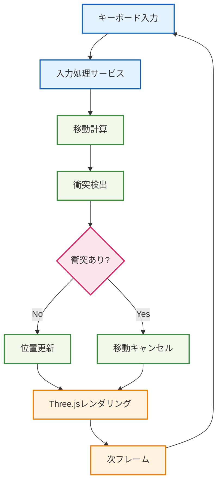

# 🏃 プレイヤー移動実装

## 🧭 スマートナビゲーション

> **📍 現在位置**: ホーム → 実例集 → 基本的な使用例 → プレイヤー移動
> **🎯 学習目標**: Effect-TS + Three.js統合と3D物理演算
> **⏱️ 所要時間**: 30分
> **👤 対象**: Effect-TS基礎習得済み

**Effect-TSとThree.jsを統合して、型安全な3Dプレイヤー移動システムを実装しましょう！**

## 🎯 学習目標

この実装例では以下を学習します：

- **Effect + Three.js統合**: 外部ライブラリとのシームレスな統合
- **Ref**: リアルタイム状態管理
- **Schedule**: 定期実行処理（ゲームループ）
- **Vector3演算**: 3D数学とEffect-TSの組み合わせ
- **衝突検出**: 物理演算の基本実装
- **入力処理**: キーボード入力の関数型処理

## 💡 実装アーキテクチャ



## 📝 完全実装コード

### 🧮 1. 3D数学ユーティリティ

```typescript
// src/domain/math/vector3.ts
import { Schema } from "@effect/schema"
import { Data, Equal, Hash } from "effect"

/**
 * 3Dベクトルスキーマ
 *
 * 🎯 学習ポイント：
 * - 3D座標系での数学的操作
 * - Data.Structによる不変データ構造
 * - 数学関数の関数型実装
 */
export const Vector3 = Schema.Struct({
  x: Schema.Number,
  y: Schema.Number,
  z: Schema.Number
})

export type Vector3 = Schema.Schema.Type<typeof Vector3>

/**
 * Vector3用のData構造（不変・比較可能）
 */
export class Vector3Data extends Data.Struct<{
  readonly x: number
  readonly y: number
  readonly z: number
}> {
  /**
   * ベクトル加算
   */
  add(other: Vector3Data): Vector3Data {
    return new Vector3Data({
      x: this.x + other.x,
      y: this.y + other.y,
      z: this.z + other.z
    })
  }

  /**
   * ベクトル減算
   */
  subtract(other: Vector3Data): Vector3Data {
    return new Vector3Data({
      x: this.x - other.x,
      y: this.y - other.y,
      z: this.z - other.z
    })
  }

  /**
   * スカラー倍
   */
  multiply(scalar: number): Vector3Data {
    return new Vector3Data({
      x: this.x * scalar,
      y: this.y * scalar,
      z: this.z * scalar
    })
  }

  /**
   * ベクトルの長さ
   */
  get magnitude(): number {
    return Math.sqrt(this.x * this.x + this.y * this.y + this.z * this.z)
  }

  /**
   * ベクトルの正規化
   */
  normalize(): Vector3Data {
    const mag = this.magnitude
    if (mag === 0) return new Vector3Data({ x: 0, y: 0, z: 0 })

    return this.multiply(1 / mag)
  }

  /**
   * 距離計算
   */
  distanceTo(other: Vector3Data): number {
    return this.subtract(other).magnitude
  }

  /**
   * Three.js Vector3への変換
   */
  toThreeVector3(): THREE.Vector3 {
    return new THREE.Vector3(this.x, this.y, this.z)
  }

  /**
   * Three.js Vector3からの作成
   */
  static fromThreeVector3(vec: THREE.Vector3): Vector3Data {
    return new Vector3Data({
      x: vec.x,
      y: vec.y,
      z: vec.z
    })
  }
}

/**
 * ゼロベクトル定数
 */
export const ZERO_VECTOR = new Vector3Data({ x: 0, y: 0, z: 0 })

/**
 * 方向ベクトル定数
 */
export const DIRECTION_VECTORS = {
  FORWARD: new Vector3Data({ x: 0, y: 0, z: -1 }),
  BACKWARD: new Vector3Data({ x: 0, y: 0, z: 1 }),
  LEFT: new Vector3Data({ x: -1, y: 0, z: 0 }),
  RIGHT: new Vector3Data({ x: 1, y: 0, z: 0 }),
  UP: new Vector3Data({ x: 0, y: 1, z: 0 }),
  DOWN: new Vector3Data({ x: 0, y: -1, z: 0 })
} as const
```

### 🎮 2. 入力システム

```typescript
// src/infrastructure/input-system.ts
import { Context, Effect, Ref, Layer } from "effect"

/**
 * キー状態の管理
 */
export interface KeyState {
  readonly isPressed: boolean
  readonly justPressed: boolean
  readonly justReleased: boolean
}

/**
 * 入力システムサービス
 *
 * 🎯 学習ポイント：
 * - DOMイベントとEffect-TSの統合
 * - Refによるリアルタイム状態管理
 * - 関数型でのイベント処理
 */
export interface InputSystem {
  readonly getKeyState: (key: string) => Effect.Effect<KeyState, never>
  readonly isKeyPressed: (key: string) => Effect.Effect<boolean, never>
  readonly getMovementInput: () => Effect.Effect<{
    forward: boolean
    backward: boolean
    left: boolean
    right: boolean
    jump: boolean
    run: boolean
  }, never>
}

export const InputSystem = Context.GenericTag<InputSystem>("InputSystem")

/**
 * ブラウザ入力システムの実装
 */
class BrowserInputSystem implements InputSystem {
  private keyStates = new Map<string, Ref.Ref<KeyState>>()
  private initialized = false

  private initializeIfNeeded(): Effect.Effect<void, never> {
    return Effect.sync(() => {
      if (this.initialized || typeof window === 'undefined') return

      // キーダウンイベント
      window.addEventListener('keydown', (event) => {
        const keyRef = this.getOrCreateKeyRef(event.code)
        Ref.update(keyRef, (current) => ({
          isPressed: true,
          justPressed: !current.isPressed,
          justReleased: false
        })).pipe(Effect.runSync)
      })

      // キーアップイベント
      window.addEventListener('keyup', (event) => {
        const keyRef = this.getOrCreateKeyRef(event.code)
        Ref.update(keyRef, (current) => ({
          isPressed: false,
          justPressed: false,
          justReleased: current.isPressed
        })).pipe(Effect.runSync)
      })

      this.initialized = true
    })
  }

  private getOrCreateKeyRef(key: string): Ref.Ref<KeyState> {
    let keyRef = this.keyStates.get(key)
    if (!keyRef) {
      keyRef = Ref.unsafeMake<KeyState>({
        isPressed: false,
        justPressed: false,
        justReleased: false
      })
      this.keyStates.set(key, keyRef)
    }
    return keyRef
  }

  getKeyState(key: string): Effect.Effect<KeyState, never> {
    return Effect.gen(() => {
      const self = this
      return Effect.gen(function* () {
        yield* self.initializeIfNeeded()
        const keyRef = self.getOrCreateKeyRef(key)
        return yield* Ref.get(keyRef)
      })
    })()
  }

  isKeyPressed(key: string): Effect.Effect<boolean, never> {
    return Effect.gen(() => {
      const self = this
      return Effect.gen(function* () {
        const state = yield* self.getKeyState(key)
        return state.isPressed
      })
    })()
  }

  getMovementInput(): Effect.Effect<{
    forward: boolean
    backward: boolean
    left: boolean
    right: boolean
    jump: boolean
    run: boolean
  }, never> {
    return Effect.gen(() => {
      const self = this
      return Effect.gen(function* () {
        const [forward, backward, left, right, jump, run] = yield* Effect.all([
          self.isKeyPressed('KeyW'),
          self.isKeyPressed('KeyS'),
          self.isKeyPressed('KeyA'),
          self.isKeyPressed('KeyD'),
          self.isKeyPressed('Space'),
          self.isKeyPressed('ShiftLeft')
        ])

        return { forward, backward, left, right, jump, run }
      })
    })()
  }

  /**
   * フレーム終了時の状態リセット（justPressed/justReleasedフラグクリア）
   */
  resetFrameState(): Effect.Effect<void, never> {
    return Effect.gen(() => {
      const self = this
      return Effect.gen(function* () {
        for (const keyRef of self.keyStates.values()) {
          yield* Ref.update(keyRef, (current) => ({
            ...current,
            justPressed: false,
            justReleased: false
          }))
        }
      })
    })()
  }
}

/**
 * InputSystemの実装を提供するLayer
 */
export const BrowserInputSystemLive = Layer.succeed(
  InputSystem,
  new BrowserInputSystem()
)
```

### 👤 3. プレイヤーエンティティ

```typescript
// src/domain/entities/player.ts
import { Schema } from "@effect/schema"
import { Data } from "effect"
import { Vector3Data } from "../math/vector3.js"

/**
 * プレイヤー状態スキーマ
 *
 * 🎯 学習ポイント：
 * - ゲームエンティティのデータモデリング
 * - 物理プロパティの型安全な表現
 * - ゲーム固有の制約の実装
 */
export const PlayerState = Schema.Struct({
  id: Schema.String,
  position: Schema.Struct({
    x: Schema.Number,
    y: Schema.Number,
    z: Schema.Number
  }),
  velocity: Schema.Struct({
    x: Schema.Number,
    y: Schema.Number,
    z: Schema.Number
  }),
  rotation: Schema.Struct({
    yaw: Schema.Number,   // 水平回転 (Y軸)
    pitch: Schema.Number  // 垂直回転 (X軸)
  }),
  isOnGround: Schema.Boolean,
  health: Schema.Number,
  isRunning: Schema.Boolean
})

export type PlayerState = Schema.Schema.Type<typeof PlayerState>

/**
 * プレイヤーエンティティクラス（不変データ構造）
 */
export class Player extends Data.Struct<{
  readonly state: PlayerState
}> {
  /**
   * プレイヤー作成
   */
  static create(id: string, position: Vector3Data = new Vector3Data({ x: 0, y: 0, z: 0 })): Player {
    return new Player({
      state: {
        id,
        position: { x: position.x, y: position.y, z: position.z },
        velocity: { x: 0, y: 0, z: 0 },
        rotation: { yaw: 0, pitch: 0 },
        isOnGround: true,
        health: 100,
        isRunning: false
      }
    })
  }

  /**
   * 位置の更新
   */
  updatePosition(newPosition: Vector3Data): Player {
    return new Player({
      state: {
        ...this.state,
        position: { x: newPosition.x, y: newPosition.y, z: newPosition.z }
      }
    })
  }

  /**
   * 速度の更新
   */
  updateVelocity(newVelocity: Vector3Data): Player {
    return new Player({
      state: {
        ...this.state,
        velocity: { x: newVelocity.x, y: newVelocity.y, z: newVelocity.z }
      }
    })
  }

  /**
   * 回転の更新
   */
  updateRotation(yaw: number, pitch: number): Player {
    return new Player({
      state: {
        ...this.state,
        rotation: { yaw, pitch }
      }
    })
  }

  /**
   * 地面接触状態の更新
   */
  setOnGround(onGround: boolean): Player {
    return new Player({
      state: {
        ...this.state,
        isOnGround: onGround
      }
    })
  }

  /**
   * 走行状態の更新
   */
  setRunning(running: boolean): Player {
    return new Player({
      state: {
        ...this.state,
        isRunning: running
      }
    })
  }

  /**
   * Vector3Dataとしての位置取得
   */
  get position(): Vector3Data {
    return new Vector3Data(this.state.position)
  }

  /**
   * Vector3Dataとしての速度取得
   */
  get velocity(): Vector3Data {
    return new Vector3Data(this.state.velocity)
  }

  /**
   * 前方向ベクトル計算
   */
  get forwardVector(): Vector3Data {
    const yaw = this.state.rotation.yaw
    return new Vector3Data({
      x: Math.sin(yaw),
      y: 0,
      z: -Math.cos(yaw)
    }).normalize()
  }

  /**
   * 右方向ベクトル計算
   */
  get rightVector(): Vector3Data {
    const yaw = this.state.rotation.yaw
    return new Vector3Data({
      x: Math.cos(yaw),
      y: 0,
      z: Math.sin(yaw)
    }).normalize()
  }
}

/**
 * 物理設定定数
 */
export const PLAYER_PHYSICS = {
  WALK_SPEED: 4.3,      // m/s
  RUN_SPEED: 5.6,       // m/s
  JUMP_VELOCITY: 7.2,   // m/s
  GRAVITY: -9.8,        // m/s²
  GROUND_FRICTION: 0.8,
  AIR_FRICTION: 0.98,
  MAX_FALL_SPEED: -20   // m/s
} as const
```

### 🏃 4. プレイヤー移動サービス

```typescript
// src/domain/services/player-movement-service.ts
import { Context, Effect, Ref } from "effect"
import { Player, PLAYER_PHYSICS } from "../entities/player.js"
import { Vector3Data, DIRECTION_VECTORS } from "../math/vector3.js"

/**
 * 移動入力データ
 */
export interface MovementInput {
  readonly forward: boolean
  readonly backward: boolean
  readonly left: boolean
  readonly right: boolean
  readonly jump: boolean
  readonly run: boolean
  readonly deltaTime: number  // 前フレームからの経過時間（秒）
}

/**
 * プレイヤー移動サービス
 *
 * 🎯 学習ポイント：
 * - 物理演算の実装
 * - フレームレート独立の移動計算
 * - 複雑な状態遷移の管理
 */
export interface PlayerMovementService {
  readonly updateMovement: (
    player: Player,
    input: MovementInput
  ) => Effect.Effect<Player, never>

  readonly checkCollision: (
    currentPosition: Vector3Data,
    newPosition: Vector3Data
  ) => Effect.Effect<boolean, never>
}

export const PlayerMovementService = Context.GenericTag<PlayerMovementService>(
  "PlayerMovementService"
)

/**
 * プレイヤー移動サービスの実装
 */
class PlayerMovementServiceImpl implements PlayerMovementService {
  updateMovement(player: Player, input: MovementInput): Effect.Effect<Player, never> {
    return Effect.gen(function* () {
      // 1. 入力方向の計算
      const inputDirection = calculateInputDirection(player, input)

      // 2. 水平移動の処理
      let newPlayer = yield* applyHorizontalMovement(player, inputDirection, input)

      // 3. ジャンプ処理
      if (input.jump && newPlayer.state.isOnGround) {
        newPlayer = newPlayer.updateVelocity(
          newPlayer.velocity.add(new Vector3Data({ x: 0, y: PLAYER_PHYSICS.JUMP_VELOCITY, z: 0 }))
        )
        newPlayer = newPlayer.setOnGround(false)
      }

      // 4. 重力適用
      newPlayer = yield* applyGravity(newPlayer, input.deltaTime)

      // 5. 位置更新
      const newPosition = newPlayer.position.add(
        newPlayer.velocity.multiply(input.deltaTime)
      )

      // 6. 衝突検出（簡易版）
      const hasCollision = yield* checkSimpleCollision(newPosition)

      if (!hasCollision) {
        newPlayer = newPlayer.updatePosition(newPosition)
      } else {
        // 衝突時は速度をリセット
        newPlayer = newPlayer.updateVelocity(new Vector3Data({ x: 0, y: 0, z: 0 }))
      }

      // 7. 地面接触判定（簡易版：Y=0を地面とする）
      if (newPlayer.position.y <= 0) {
        newPlayer = newPlayer.updatePosition(
          new Vector3Data({ x: newPlayer.position.x, y: 0, z: newPlayer.position.z })
        )
        newPlayer = newPlayer.updateVelocity(
          new Vector3Data({ x: newPlayer.velocity.x, y: 0, z: newPlayer.velocity.z })
        )
        newPlayer = newPlayer.setOnGround(true)
      }

      // 8. 走行状態更新
      newPlayer = newPlayer.setRunning(input.run && inputDirection.magnitude > 0)

      return newPlayer
    })
  }

  checkCollision(currentPosition: Vector3Data, newPosition: Vector3Data): Effect.Effect<boolean, never> {
    return Effect.sync(() => {
      // 簡易衝突検出: 特定の境界を超えないようにする
      const WORLD_BOUNDARY = 50

      return (
        Math.abs(newPosition.x) > WORLD_BOUNDARY ||
        Math.abs(newPosition.z) > WORLD_BOUNDARY ||
        newPosition.y < -10 || // 落下限界
        newPosition.y > 100    // 高度限界
      )
    })
  }
}

/**
 * 入力方向の計算
 */
function calculateInputDirection(player: Player, input: MovementInput): Vector3Data {
  let direction = new Vector3Data({ x: 0, y: 0, z: 0 })

  if (input.forward) {
    direction = direction.add(player.forwardVector)
  }
  if (input.backward) {
    direction = direction.subtract(player.forwardVector)
  }
  if (input.left) {
    direction = direction.subtract(player.rightVector)
  }
  if (input.right) {
    direction = direction.add(player.rightVector)
  }

  // 斜め移動時の速度補正
  return direction.magnitude > 0 ? direction.normalize() : direction
}

/**
 * 水平移動の適用
 */
function applyHorizontalMovement(
  player: Player,
  inputDirection: Vector3Data,
  input: MovementInput
): Effect.Effect<Player, never> {
  return Effect.sync(() => {
    const speed = input.run ? PLAYER_PHYSICS.RUN_SPEED : PLAYER_PHYSICS.WALK_SPEED
    const targetVelocity = inputDirection.multiply(speed)

    // 現在の水平速度
    const currentHorizontalVelocity = new Vector3Data({
      x: player.velocity.x,
      y: 0,
      z: player.velocity.z
    })

    // 摩擦適用
    const friction = player.state.isOnGround ? PLAYER_PHYSICS.GROUND_FRICTION : PLAYER_PHYSICS.AIR_FRICTION
    let newHorizontalVelocity: Vector3Data

    if (inputDirection.magnitude > 0) {
      // 入力がある場合は目標速度に向かって加速
      newHorizontalVelocity = currentHorizontalVelocity
        .add(targetVelocity.subtract(currentHorizontalVelocity).multiply(friction))
    } else {
      // 入力がない場合は摩擦で減速
      newHorizontalVelocity = currentHorizontalVelocity.multiply(friction)
    }

    const newVelocity = new Vector3Data({
      x: newHorizontalVelocity.x,
      y: player.velocity.y, // Y速度は維持
      z: newHorizontalVelocity.z
    })

    return player.updateVelocity(newVelocity)
  })
}

/**
 * 重力の適用
 */
function applyGravity(player: Player, deltaTime: number): Effect.Effect<Player, never> {
  return Effect.sync(() => {
    if (player.state.isOnGround) {
      return player
    }

    const gravityVelocity = new Vector3Data({ x: 0, y: PLAYER_PHYSICS.GRAVITY * deltaTime, z: 0 })
    let newVelocity = player.velocity.add(gravityVelocity)

    // 最大落下速度の制限
    if (newVelocity.y < PLAYER_PHYSICS.MAX_FALL_SPEED) {
      newVelocity = new Vector3Data({
        x: newVelocity.x,
        y: PLAYER_PHYSICS.MAX_FALL_SPEED,
        z: newVelocity.z
      })
    }

    return player.updateVelocity(newVelocity)
  })
}

/**
 * 簡易衝突検出
 */
function checkSimpleCollision(position: Vector3Data): Effect.Effect<boolean, never> {
  return Effect.sync(() => {
    // 簡易的な境界判定
    const BOUNDARY = 50
    return (
      Math.abs(position.x) > BOUNDARY ||
      Math.abs(position.z) > BOUNDARY ||
      position.y < -5
    )
  })
}

/**
 * PlayerMovementServiceの実装を提供するLayer
 */
export const PlayerMovementServiceLive = Layer.succeed(
  PlayerMovementService,
  new PlayerMovementServiceImpl()
)
```

### 🎨 5. Three.js統合レンダラー

```typescript
// src/infrastructure/three-renderer.ts
import { Context, Effect, Ref, Layer } from "effect"
import * as THREE from "three"
import { Player } from "../domain/entities/player.js"

/**
 * Three.jsレンダラーサービス
 *
 * 🎯 学習ポイント：
 * - 外部ライブラリとEffect-TSの統合
 * - 3Dシーンの管理
 * - レンダリングループの実装
 */
export interface ThreeRenderer {
  readonly initialize: (container: HTMLElement) => Effect.Effect<void, string>
  readonly updatePlayer: (player: Player) => Effect.Effect<void, never>
  readonly render: () => Effect.Effect<void, never>
  readonly dispose: () => Effect.Effect<void, never>
  readonly getCamera: () => Effect.Effect<THREE.Camera, never>
  readonly getRenderer: () => Effect.Effect<THREE.WebGLRenderer | null, never>
}

export const ThreeRenderer = Context.GenericTag<ThreeRenderer>("ThreeRenderer")

/**
 * Three.jsレンダラーの実装
 */
class ThreeRendererImpl implements ThreeRenderer {
  private scene = new THREE.Scene()
  private camera = new THREE.PerspectiveCamera(75, 1, 0.1, 1000)
  private renderer: THREE.WebGLRenderer | null = null
  private playerMesh: THREE.Mesh | null = null
  private groundMesh: THREE.Mesh | null = null

  initialize(container: HTMLElement): Effect.Effect<void, string> {
    return Effect.gen(() => {
      const self = this
      return Effect.gen(function* () {
        try {
          // レンダラー作成
          self.renderer = new THREE.WebGLRenderer({ antialias: true })
          self.renderer.setSize(container.clientWidth, container.clientHeight)
          self.renderer.setClearColor(0x87CEEB) // 空色
          container.appendChild(self.renderer.domElement)

          // カメラ設定
          self.camera.aspect = container.clientWidth / container.clientHeight
          self.camera.position.set(0, 5, 10)
          self.camera.lookAt(0, 0, 0)

          // シーンの基本設定
          yield* self.setupScene()

          // リサイズイベント処理
          const handleResize = () => {
            if (self.renderer) {
              self.camera.aspect = container.clientWidth / container.clientHeight
              self.camera.updateProjectionMatrix()
              self.renderer.setSize(container.clientWidth, container.clientHeight)
            }
          }

          window.addEventListener('resize', handleResize)

          yield* Effect.sync(() => {
            console.log('✅ Three.jsレンダラー初期化完了')
          })
        } catch (error) {
          yield* Effect.fail(`Three.jsレンダラー初期化エラー: ${error}`)
        }
      })
    })()
  }

  /**
   * シーンの基本設定
   */
  private setupScene(): Effect.Effect<void, never> {
    return Effect.sync(() => {
      // ライト設定
      const ambientLight = new THREE.AmbientLight(0xffffff, 0.6)
      this.scene.add(ambientLight)

      const directionalLight = new THREE.DirectionalLight(0xffffff, 0.8)
      directionalLight.position.set(10, 10, 5)
      directionalLight.castShadow = true
      this.scene.add(directionalLight)

      // 地面作成
      const groundGeometry = new THREE.PlaneGeometry(100, 100)
      const groundMaterial = new THREE.MeshLambertMaterial({ color: 0x90EE90 }) // 薄緑
      this.groundMesh = new THREE.Mesh(groundGeometry, groundMaterial)
      this.groundMesh.rotation.x = -Math.PI / 2 // 水平に配置
      this.groundMesh.receiveShadow = true
      this.scene.add(this.groundMesh)

      // プレイヤーメッシュ作成
      const playerGeometry = new THREE.BoxGeometry(0.6, 1.8, 0.3)
      const playerMaterial = new THREE.MeshLambertMaterial({ color: 0x4169E1 }) // ロイヤルブルー
      this.playerMesh = new THREE.Mesh(playerGeometry, playerMaterial)
      this.playerMesh.castShadow = true
      this.scene.add(this.playerMesh)

      // グリッド表示（デバッグ用）
      const gridHelper = new THREE.GridHelper(100, 50, 0x000000, 0x404040)
      this.scene.add(gridHelper)

      console.log('🎨 Three.jsシーン作成完了')
    })
  }

  updatePlayer(player: Player): Effect.Effect<void, never> {
    return Effect.sync(() => {
      if (!this.playerMesh) return

      // プレイヤー位置更新
      this.playerMesh.position.set(
        player.position.x,
        player.position.y + 0.9, // プレイヤーの高さの半分を調整
        player.position.z
      )

      // プレイヤー回転更新
      this.playerMesh.rotation.y = player.state.rotation.yaw

      // カメラをプレイヤーに追従（三人称視点）
      const cameraDistance = 8
      const cameraHeight = 5
      const cameraPosition = player.position
        .subtract(player.forwardVector.multiply(cameraDistance))
        .add(new Vector3Data({ x: 0, y: cameraHeight, z: 0 }))

      this.camera.position.set(cameraPosition.x, cameraPosition.y, cameraPosition.z)
      this.camera.lookAt(player.position.x, player.position.y + 1, player.position.z)
    })
  }

  render(): Effect.Effect<void, never> {
    return Effect.sync(() => {
      if (this.renderer) {
        this.renderer.render(this.scene, this.camera)
      }
    })
  }

  getCamera(): Effect.Effect<THREE.Camera, never> {
    return Effect.succeed(this.camera)
  }

  getRenderer(): Effect.Effect<THREE.WebGLRenderer | null, never> {
    return Effect.succeed(this.renderer)
  }

  dispose(): Effect.Effect<void, never> {
    return Effect.sync(() => {
      if (this.renderer) {
        this.renderer.dispose()
        this.renderer = null
      }
      console.log('🗑️ Three.jsレンダラー破棄完了')
    })
  }
}

/**
 * ThreeRendererの実装を提供するLayer
 */
export const ThreeRendererLive = Layer.succeed(ThreeRenderer, new ThreeRendererImpl())
```

### 🎮 6. ゲームループシステム

```typescript
// src/application/game-loop.ts
import { Context, Effect, Ref, Schedule, Layer } from "effect"
import { Player } from "../domain/entities/player.js"
import { PlayerMovementService, MovementInput } from "../domain/services/player-movement-service.js"
import { InputSystem } from "../infrastructure/input-system.js"
import { ThreeRenderer } from "../infrastructure/three-renderer.js"

/**
 * ゲームループサービス
 *
 * 🎯 学習ポイント：
 * - Scheduleによる定期実行
 * - Refによる状態管理
 * - 複数サービスの協調動作
 * - フレームレート管理
 */
export interface GameLoop {
  readonly start: () => Effect.Effect<void, never>
  readonly stop: () => Effect.Effect<void, never>
  readonly getPlayer: () => Effect.Effect<Player, never>
}

export const GameLoop = Context.GenericTag<GameLoop>("GameLoop")

/**
 * ゲームループの実装
 */
class GameLoopImpl implements GameLoop {
  private player: Ref.Ref<Player>
  private isRunning: Ref.Ref<boolean>
  private lastTime: Ref.Ref<number>
  private frameCount: Ref.Ref<number>

  constructor() {
    this.player = Ref.unsafeMake(Player.create("player-1"))
    this.isRunning = Ref.unsafeMake(false)
    this.lastTime = Ref.unsafeMake(performance.now())
    this.frameCount = Ref.unsafeMake(0)
  }

  start(): Effect.Effect<void, never> {
    return Effect.gen(() => {
      const self = this
      return Effect.gen(function* () {
        yield* Ref.set(self.isRunning, true)
        yield* Effect.sync(() => console.log('🎮 ゲームループ開始'))

        // メインゲームループ
        const gameLoop = Effect.gen(function* () {
          const running = yield* Ref.get(self.isRunning)
          if (!running) return

          // デルタタイム計算
          const currentTime = performance.now()
          const lastTime = yield* Ref.get(self.lastTime)
          const deltaTime = (currentTime - lastTime) / 1000 // 秒に変換
          yield* Ref.set(self.lastTime, currentTime)

          // フレームカウント更新
          yield* Ref.update(self.frameCount, (count) => count + 1)

          // 1秒毎にFPS表示
          const frameCount = yield* Ref.get(self.frameCount)
          if (frameCount % 60 === 0) { // 60FPSの場合
            yield* Effect.sync(() => console.log(`📊 FPS: ${Math.round(1 / deltaTime)}`))
          }

          // ゲーム更新処理
          yield* self.updateGame(deltaTime)
        })

        // 60FPSでループ実行
        yield* gameLoop.pipe(
          Effect.repeat(Schedule.fixed("16ms")), // 約60FPS
          Effect.fork
        )
      })
    })()
  }

  /**
   * ゲーム更新処理
   */
  private updateGame(deltaTime: number): Effect.Effect<void, never> {
    return Effect.gen(() => {
      const self = this
      return Effect.gen(function* () {
        const inputSystem = yield* InputSystem
        const movementService = yield* PlayerMovementService
        const renderer = yield* ThreeRenderer

        // 入力取得
        const movementInput = yield* inputSystem.getMovementInput()
        const input: MovementInput = {
          ...movementInput,
          deltaTime
        }

        // プレイヤー更新
        const currentPlayer = yield* Ref.get(self.player)
        const updatedPlayer = yield* movementService.updateMovement(currentPlayer, input)
        yield* Ref.set(self.player, updatedPlayer)

        // レンダリング更新
        yield* renderer.updatePlayer(updatedPlayer)
        yield* renderer.render()

        // フレーム状態リセット
        if ('resetFrameState' in inputSystem) {
          yield* (inputSystem as any).resetFrameState()
        }
      })
    })()
  }

  stop(): Effect.Effect<void, never> {
    return Effect.gen(() => {
      const self = this
      return Effect.gen(function* () {
        yield* Ref.set(self.isRunning, false)
        yield* Effect.sync(() => console.log('⏹️ ゲームループ停止'))
      })
    })()
  }

  getPlayer(): Effect.Effect<Player, never> {
    return Ref.get(this.player)
  }
}

/**
 * GameLoopの実装を提供するLayer
 */
export const GameLoopLive = Layer.effect(
  GameLoop,
  Effect.sync(() => new GameLoopImpl())
)
```

### 🚀 7. メインアプリケーション

```typescript
// src/main.ts
import { Effect, Layer, Console, Exit } from "effect"
import { BrowserInputSystemLive } from "./infrastructure/input-system.js"
import { PlayerMovementServiceLive } from "./domain/services/player-movement-service.js"
import { ThreeRendererLive } from "./infrastructure/three-renderer.js"
import { GameLoopLive, GameLoop } from "./application/game-loop.js"
import { ThreeRenderer } from "./infrastructure/three-renderer.js"

/**
 * メインアプリケーション
 */
const program = Effect.gen(function* () {
  yield* Console.log('🚀 プレイヤー移動システム起動中...')

  // DOM要素の取得
  const container = yield* Effect.sync(() => {
    const element = document.getElementById('game-container')
    if (!element) {
      throw new Error('game-container要素が見つかりません')
    }
    return element
  })

  // レンダラー初期化
  const renderer = yield* ThreeRenderer
  yield* renderer.initialize(container)

  // ゲームループ開始
  const gameLoop = yield* GameLoop
  yield* gameLoop.start()

  yield* Console.log('✅ アプリケーション起動完了')
  yield* Console.log('🎮 操作方法:')
  yield* Console.log('  - WASD: 移動')
  yield* Console.log('  - Shift: 走行')
  yield* Console.log('  - Space: ジャンプ')

  // 10秒後に停止（デモ用）
  yield* Effect.sleep("10s")
  yield* gameLoop.stop()
  yield* renderer.dispose()

  yield* Console.log('🎯 デモ完了！')
})

/**
 * HTMLページの作成
 */
const createHTML = (): string => `
<!DOCTYPE html>
<html lang="ja">
<head>
    <meta charset="UTF-8">
    <meta name="viewport" content="width=device-width, initial-scale=1.0">
    <title>プレイヤー移動システム - Effect-TS + Three.js</title>
    <style>
        body {
            margin: 0;
            padding: 0;
            background: #000;
            font-family: Arial, sans-serif;
            overflow: hidden;
        }
        #game-container {
            width: 100vw;
            height: 100vh;
            display: flex;
            justify-content: center;
            align-items: center;
        }
        #ui-overlay {
            position: absolute;
            top: 10px;
            left: 10px;
            color: white;
            z-index: 1000;
            font-size: 14px;
            background: rgba(0, 0, 0, 0.7);
            padding: 10px;
            border-radius: 5px;
        }
    </style>
</head>
<body>
    <div id="ui-overlay">
        <h3>🎮 プレイヤー移動システム</h3>
        <p>WASD: 移動 | Shift: 走行 | Space: ジャンプ</p>
        <p>青いボックスがプレイヤーです</p>
    </div>
    <div id="game-container"></div>
</body>
</html>
`

/**
 * アプリケーション実行
 */
const runnable = program.pipe(
  Effect.provide(GameLoopLive),
  Effect.provide(ThreeRendererLive),
  Effect.provide(PlayerMovementServiceLive),
  Effect.provide(BrowserInputSystemLive)
)

// ブラウザ環境でのみ実行
if (typeof window !== 'undefined') {
  // HTMLが読み込まれていない場合は作成
  if (!document.getElementById('game-container')) {
    document.write(createHTML())
  }

  Effect.runPromiseExit(runnable).then((exit) => {
    if (Exit.isFailure(exit)) {
      console.error('アプリケーション実行エラー:', exit.cause)
    } else {
      console.log('アプリケーション正常終了')
    }
  })
} else {
  console.log('このデモはブラウザ環境で実行してください')
}
```

## 🧪 実行方法

### 1️⃣ 開発サーバー起動

```bash
# Vite開発サーバーで実行
npm run dev

# または、簡単なHTTPサーバーで実行
npx serve . -p 3000
```

### 2️⃣ ブラウザでアクセス

```
http://localhost:3000
```

### 3️⃣ 操作確認

- **WASD**: プレイヤー移動
- **Shift**: 走行（速度アップ）
- **Space**: ジャンプ
- **カメラ**: 自動的にプレイヤーを追従

## 🎯 学習ポイント

### 1️⃣ **Effect-TS + Three.js統合**

```typescript
// ✅ 外部ライブラリの安全な統合
const updateRenderer = (player: Player): Effect.Effect<void, never> =>
  Effect.sync(() => {
    playerMesh.position.set(player.position.x, player.position.y, player.position.z)
  })
```

### 2️⃣ **リアルタイム状態管理**

```typescript
// ✅ Refによる可変状態の管理
const gameState = Ref.unsafeMake({ player, isRunning: true })

// ✅ 不変データ構造による状態更新
const newPlayer = player.updatePosition(newPosition)
```

### 3️⃣ **スケジューリング**

```typescript
// ✅ 定期実行による60FPSゲームループ
gameLoop.pipe(
  Effect.repeat(Schedule.fixed("16ms")),
  Effect.fork
)
```

## 🔧 カスタマイズアイデア

### 🎮 1. 操作拡張

```typescript
// マウス視点操作の追加
interface MouseInput {
  readonly deltaX: number
  readonly deltaY: number
  readonly sensitivity: number
}

// カメラ視点更新
const updateCameraRotation = (player: Player, mouse: MouseInput): Player =>
  player.updateRotation(
    player.state.rotation.yaw + mouse.deltaX * mouse.sensitivity,
    player.state.rotation.pitch + mouse.deltaY * mouse.sensitivity
  )
```

### 🌍 2. ワールド統合

```typescript
// ブロック配置システムとの統合
const checkBlockCollision = (position: Vector3Data): Effect.Effect<boolean, never> =>
  Effect.gen(function* () {
    const blockService = yield* BlockService
    const block = yield* blockService.getBlock(position)
    return block !== null
  })
```

### ⚡ 3. パフォーマンス最適化

```typescript
// フラスタム カリングの実装
const optimizeRendering = (player: Player): Effect.Effect<void, never> =>
  Effect.sync(() => {
    // 視界外オブジェクトの描画スキップ
    objects.forEach(obj => {
      obj.visible = isInViewFrustum(obj, camera)
    })
  })
```

## 🔗 次のステップ

1. **[インベントリ管理](./03-inventory-management.md)** - UI統合とデータ管理
2. **[高度なパターン](../02-advanced-patterns/README.md)** - Effect合成の応用
3. **[統合例](../03-integration-examples/README.md)** - 完全なゲームシステム

---

**🎉 素晴らしい！3Dプレイヤー移動システムが完成しました！**
**Effect-TSとThree.jsの強力な組み合わせを体験できましたね。**