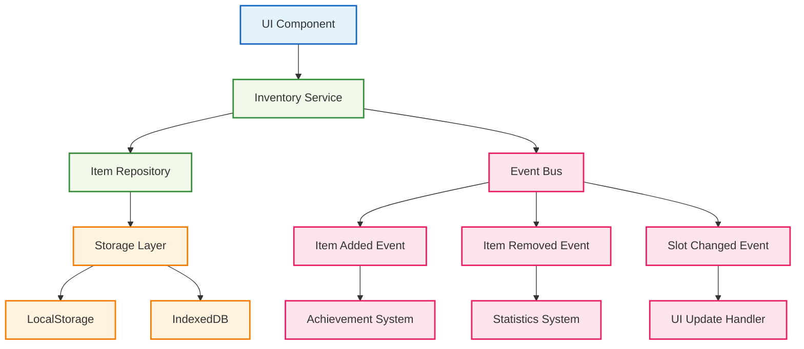

# 🎒 インベントリ管理システム

## 🧭 スマートナビゲーション

> **📍 現在位置**: ホーム → 実例集 → 基本的な使用例 → インベントリ管理
> **🎯 学習目標**: 複雑な状態管理とUI統合の実装
> **⏱️ 所要時間**: 40分
> **👤 対象**: Effect-TS基礎習得済み、UI実装経験者

**Effect-TSを使って、型安全で高性能なインベントリ管理システムを構築しましょう！**

## 🎯 学習目標

この実装例では以下を学習します：

- **Complex State Management**: 複雑なゲーム状態の管理
- **Event-Driven Architecture**: イベント駆動設計パターン
- **UI/Logic Separation**: UIとビジネスロジックの分離
- **Immutable Collections**: 不変データ構造での集合管理
- **Stream Processing**: リアルタイムイベントストリーム処理
- **Custom Hooks**: Effect-TSとReactの統合

## 💡 システムアーキテクチャ



## 📝 完全実装コード

### 🧱 1. アイテムデータモデル

```typescript
// src/domain/models/item.ts
import { Schema } from "@effect/schema"
import { Data, Equal, Hash } from "effect"

/**
 * アイテムタイプ定義
 *
 * 🎯 学習ポイント：
 * - 列挙型を使ったタイプセーフティ
 * - 拡張可能なアイテムシステム設計
 */
export const ItemType = Schema.Literal(
  // ブロック類
  "grass", "stone", "wood", "dirt", "sand", "cobblestone",
  "diamond", "gold", "iron", "coal",

  // 道具類
  "wooden_pickaxe", "stone_pickaxe", "iron_pickaxe", "diamond_pickaxe",
  "wooden_sword", "stone_sword", "iron_sword", "diamond_sword",

  // 食料類
  "apple", "bread", "meat", "fish",

  // その他
  "torch", "bucket", "water_bucket", "lava_bucket"
)

export type ItemType = Schema.Schema.Type<typeof ItemType>

/**
 * アイテム希少度
 */
export const ItemRarity = Schema.Literal("common", "uncommon", "rare", "epic", "legendary")
export type ItemRarity = Schema.Schema.Type<typeof ItemRarity>

/**
 * アイテム情報スキーマ
 */
export const ItemInfo = Schema.Struct({
  type: ItemType,
  name: Schema.String,
  description: Schema.String,
  rarity: ItemRarity,
  maxStackSize: Schema.Number,
  durability: Schema.optional(Schema.Number), // 道具の場合のみ
  isConsumable: Schema.Boolean,
  craftable: Schema.Boolean
})

export type ItemInfo = Schema.Schema.Type<typeof ItemInfo>

/**
 * アイテム数量のBranded Type（型安全性強化）
 */
export const Quantity = Schema.Number.pipe(
  Schema.int(), // 整数制約
  Schema.greaterThanOrEqualTo(0), // 非負数制約
  Schema.brand("Quantity")
)
export type Quantity = Schema.Schema.Type<typeof Quantity>

/**
 * アイテムスロットインデックスのBranded Type
 */
export const SlotIndex = Schema.Number.pipe(
  Schema.int(),
  Schema.greaterThanOrEqualTo(0),
  Schema.brand("SlotIndex")
)
export type SlotIndex = Schema.Schema.Type<typeof SlotIndex>

/**
 * 耐久度のBranded Type
 */
export const Durability = Schema.Number.pipe(
  Schema.int(),
  Schema.greaterThanOrEqualTo(0),
  Schema.brand("Durability")
)
export type Durability = Schema.Schema.Type<typeof Durability>

/**
 * インベントリ内のアイテムスタック
 */
export const ItemStack = Schema.Struct({
  itemType: ItemType,
  quantity: Quantity,
  durability: Schema.optional(Durability),
  metadata: Schema.optional(Schema.Record({ key: Schema.String, value: Schema.Unknown }))
})

export type ItemStack = Schema.Schema.Type<typeof ItemStack>

/**
 * ItemStackのData構造（不変・比較可能）
 */
export class ItemStackData extends Data.TaggedClass("ItemStackData")<{
  readonly itemType: ItemType
  readonly quantity: Quantity
  readonly durability?: Durability
  readonly metadata?: Record<string, unknown>
}> {
  /**
   * アイテムを追加（スタック可能な場合）
   */
  static addQuantity = (self: ItemStackData, amount: Quantity, maxStackSize: Quantity) =>
    Match.value(self.quantity + amount).pipe(
      Match.when(newQuantity => newQuantity > maxStackSize, () => Option.none()),
      Match.orElse(newQuantity => Option.some(
        new ItemStackData({
          ...self,
          quantity: newQuantity as Quantity
        })
      ))
    )

  /**
   * アイテムを削除
   */
  static removeQuantity = (self: ItemStackData, amount: Quantity) =>
    Match.value(self.quantity - amount).pipe(
      Match.when(newQuantity => newQuantity <= 0, () => Option.none()),
      Match.orElse(newQuantity => Option.some(
        new ItemStackData({
          ...self,
          quantity: newQuantity as Quantity
        })
      ))
    )

  /**
   * 耐久度を減らす
   */
  static decreaseDurability = (self: ItemStackData, amount: Durability) =>
    Match.value(self.durability).pipe(
      Match.when(Option.isNone, () => Option.some(self)), // 耐久度なしアイテム
      Match.when(
        durability => durability && (durability - amount) <= 0,
        () => Option.none() // 道具が壊れた
      ),
      Match.orElse(durability => Option.some(
        new ItemStackData({
          ...self,
          durability: (durability! - amount) as Durability
        })
      ))
    )

  /**
   * スタック可能かチェック
   */
  canStackWith(other: ItemStackData): boolean {
    return (
      this.itemType === other.itemType &&
      Equal.equals(this.metadata, other.metadata) &&
      this.durability === other.durability
    )
  }

  /**
   * 空のスタックかチェック
   */
  get isEmpty(): boolean {
    return this.quantity <= 0
  }
}

/**
 * アイテム情報データベース
 *
 * 🎯 学習ポイント：
 * - 静的データの効率的管理
 * - ゲームバランスの一元管理
 */
export const ITEM_DATABASE: Record<ItemType, ItemInfo> = {
  // ブロック類
  grass: {
    type: "grass",
    name: "草ブロック",
    description: "自然な草が生えたブロック",
    rarity: "common",
    maxStackSize: 64,
    isConsumable: false,
    craftable: false
  },

  stone: {
    type: "stone",
    name: "石",
    description: "固い岩石ブロック",
    rarity: "common",
    maxStackSize: 64,
    isConsumable: false,
    craftable: false
  },

  wood: {
    type: "wood",
    name: "木材",
    description: "建築用の木材ブロック",
    rarity: "common",
    maxStackSize: 64,
    isConsumable: false,
    craftable: true
  },

  diamond: {
    type: "diamond",
    name: "ダイヤモンド",
    description: "最も価値のある宝石",
    rarity: "legendary",
    maxStackSize: 16,
    isConsumable: false,
    craftable: false
  },

  // 道具類
  diamond_pickaxe: {
    type: "diamond_pickaxe",
    name: "ダイヤモンドのツルハシ",
    description: "最高級の採掘道具",
    rarity: "epic",
    maxStackSize: 1,
    durability: 1561,
    isConsumable: false,
    craftable: true
  },

  iron_sword: {
    type: "iron_sword",
    name: "鉄の剣",
    description: "戦闘用の武器",
    rarity: "uncommon",
    maxStackSize: 1,
    durability: 250,
    isConsumable: false,
    craftable: true
  },

  // 食料類
  apple: {
    type: "apple",
    name: "リンゴ",
    description: "体力を回復する果物",
    rarity: "common",
    maxStackSize: 16,
    isConsumable: true,
    craftable: false
  },

  bread: {
    type: "bread",
    name: "パン",
    description: "満腹度を回復する食べ物",
    rarity: "common",
    maxStackSize: 16,
    isConsumable: true,
    craftable: true
  },

  // その他のアイテム...
  // （簡潔にするため一部省略）
} as const

/**
 * アイテム情報の取得
 */
export const getItemInfo = (itemType: ItemType): ItemInfo => {
  return ITEM_DATABASE[itemType]
}
```

### 🎒 2. インベントリスロット管理

```typescript
// src/domain/models/inventory.ts
import { Schema } from "@effect/schema"
import { Data, Option, Array as EffectArray, Match, Effect } from "effect"
import { ItemStackData, ItemType, getItemInfo, Quantity, SlotIndex } from "./item.js"

/**
 * インベントリスロット
 */
export const InventorySlot = Schema.Struct({
  index: SlotIndex,
  itemStack: Schema.optional(ItemStack),
  locked: Schema.Boolean  // スロットロック状態
})

export type InventorySlot = Schema.Schema.Type<typeof InventorySlot>

/**
 * インベントリエラーのタグ付きエラー定義
 */
export class InventoryFullError extends Schema.TaggedError<InventoryFullError>()("InventoryFullError", {
  attemptedItem: ItemType,
  attemptedQuantity: Quantity
}) {}

export class InsufficientItemError extends Schema.TaggedError<InsufficientItemError>()("InsufficientItemError", {
  itemType: ItemType,
  requested: Quantity,
  available: Quantity
}) {}

export class InvalidSlotError extends Schema.TaggedError<InvalidSlotError>()("InvalidSlotError", {
  slotIndex: SlotIndex,
  maxCapacity: SlotIndex
}) {}

export class SlotLockedError extends Schema.TaggedError<SlotLockedError>()("SlotLockedError", {
  slotIndex: SlotIndex
}) {}

/**
 * インベントリ全体の状態
 */
export const InventoryState = Schema.Struct({
  playerId: Schema.String,
  slots: Schema.Array(InventorySlot),
  selectedSlotIndex: SlotIndex,
  capacity: SlotIndex
})

export type InventoryState = Schema.Schema.Type<typeof InventoryState>

/**
 * インベントリクラス（不変データ構造）
 *
 * 🎯 学習ポイント：
 * - 複雑なコレクション操作の抽象化
 * - 不変性を保った状態管理
 * - ゲームロジックのカプセル化
 */
export class Inventory extends Data.Struct<{
  readonly state: InventoryState
}> {
  /**
   * 新しいインベントリの作成
   */
  static create = (playerId: string, capacity: SlotIndex = 36 as SlotIndex): Effect.Effect<Inventory, never> =>
    Effect.succeed(
      new Inventory({
        state: {
          playerId,
          slots: Array.from({ length: capacity }, (_, index) => ({
            index: index as SlotIndex,
            itemStack: undefined,
            locked: false
          })),
          selectedSlotIndex: 0 as SlotIndex,
          capacity
        }
      })
    )

  /**
   * アイテムの追加（Effectでラップ）
   */
  static addItem = (
    self: Inventory,
    itemType: ItemType,
    quantity: Quantity
  ): Effect.Effect<{ inventory: Inventory; remainingQuantity: Quantity }, InventoryFullError> =>
    Effect.gen(function* () {
      const itemInfo = getItemInfo(itemType)
      let remainingQty = quantity
      const newSlots = [...self.state.slots]

      // 既存スタックに追加を試行
      const updatedSlots = yield* Effect.forEach(newSlots, (slot, index) =>
        Match.value({ slot, remainingQty }).pipe(
          Match.when(
            ({ slot, remainingQty }) => slot.locked || !slot.itemStack || remainingQty <= 0,
            ({ slot }) => Effect.succeed(slot)
          ),
          Match.when(
            ({ slot }) => {
              const currentStack = new ItemStackData(slot.itemStack!)
              return currentStack.itemType === itemType && currentStack.canStackWith(currentStack)
            },
            ({ slot }) => Effect.gen(function* () {
              const currentStack = new ItemStackData(slot.itemStack!)
              const addableAmount = Math.min(remainingQty, itemInfo.maxStackSize - currentStack.quantity) as Quantity
              const newStackOpt = ItemStackData.addQuantity(currentStack, addableAmount, itemInfo.maxStackSize as Quantity)

              return Option.match(newStackOpt, {
                onNone: () => slot,
                onSome: (newStack) => {
                  remainingQty = (remainingQty - addableAmount) as Quantity
                  return {
                    ...slot,
                    itemStack: {
                      itemType: newStack.itemType,
                      quantity: newStack.quantity,
                      durability: newStack.durability,
                      metadata: newStack.metadata
                    }
                  }
                }
              })
            })
          ),
          Match.orElse(({ slot }) => Effect.succeed(slot))
        )
      )

      // 新しいスロットに追加
      const finalSlots = yield* Effect.forEach(updatedSlots, (slot) =>
        Match.value({ slot, remainingQty }).pipe(
          Match.when(
            ({ slot, remainingQty }) => slot.locked || slot.itemStack || remainingQty <= 0,
            ({ slot }) => Effect.succeed(slot)
          ),
          Match.orElse(({ slot }) => {
            const stackSize = Math.min(remainingQty, itemInfo.maxStackSize) as Quantity
            remainingQty = (remainingQty - stackSize) as Quantity
            return Effect.succeed({
              ...slot,
              itemStack: {
                itemType,
                quantity: stackSize,
                durability: itemInfo.durability,
                metadata: undefined
              }
            })
          })
        )
      )

      const newInventory = new Inventory({
        state: {
          ...self.state,
          slots: finalSlots
        }
      })

      return { inventory: newInventory, remainingQuantity: remainingQty }
    })

  /**
   * アイテムの削除（Effectでラップ）
   */
  static removeItem = (
    self: Inventory,
    itemType: ItemType,
    quantity: Quantity
  ): Effect.Effect<{ inventory: Inventory; removedQuantity: Quantity }, InsufficientItemError> =>
    Effect.gen(function* () {
      const availableQuantity = Inventory.getItemCount(self, itemType)

      if (availableQuantity < quantity) {
        return yield* Effect.fail(
          new InsufficientItemError({
            itemType,
            requested: quantity,
            available: availableQuantity
          })
        )
      }

      let removedQty: Quantity = 0 as Quantity
      const newSlots = [...self.state.slots]

      // 後方から削除処理
      const processedSlots = yield* Effect.reduceRight(
        newSlots,
        { slots: newSlots, removedQty },
        (acc, slot, index) =>
          Match.value({ slot, acc }).pipe(
            Match.when(
              ({ slot, acc }) =>
                slot.locked || !slot.itemStack ||
                slot.itemStack.itemType !== itemType ||
                acc.removedQty >= quantity,
              ({ acc }) => Effect.succeed(acc)
            ),
            Match.orElse(({ slot, acc }) => {
              const currentStack = new ItemStackData(slot.itemStack!)
              const removeAmount = Math.min(quantity - acc.removedQty, currentStack.quantity) as Quantity
              const newStackOpt = ItemStackData.removeQuantity(currentStack, removeAmount)

              const updatedSlot = Option.match(newStackOpt, {
                onNone: () => ({ ...slot, itemStack: undefined }),
                onSome: (newStack) => ({
                  ...slot,
                  itemStack: {
                    itemType: newStack.itemType,
                    quantity: newStack.quantity,
                    durability: newStack.durability,
                    metadata: newStack.metadata
                  }
                })
              })

              acc.slots[index] = updatedSlot
              acc.removedQty = (acc.removedQty + removeAmount) as Quantity

              return Effect.succeed(acc)
            })
          )
      )

      const newInventory = new Inventory({
        state: {
          ...self.state,
          slots: processedSlots.slots
        }
      })

      return { inventory: newInventory, removedQuantity: processedSlots.removedQty }
    })

  /**
   * スロット間のアイテム移動
   */
  moveItem(fromIndex: number, toIndex: number): Option.Option<Inventory> {
    if (fromIndex === toIndex ||
        fromIndex < 0 || fromIndex >= this.state.capacity ||
        toIndex < 0 || toIndex >= this.state.capacity) {
      return Option.none()
    }

    const fromSlot = this.state.slots[fromIndex]
    const toSlot = this.state.slots[toIndex]

    if (fromSlot.locked || toSlot.locked || !fromSlot.itemStack) {
      return Option.none()
    }

    let newSlots = [...this.state.slots]

    if (!toSlot.itemStack) {
      // 空きスロットに移動
      newSlots[toIndex] = {
        ...toSlot,
        itemStack: fromSlot.itemStack
      }
      newSlots[fromIndex] = {
        ...fromSlot,
        itemStack: undefined
      }
    } else {
      // アイテム交換
      const fromStack = fromSlot.itemStack
      const toStack = toSlot.itemStack

      newSlots[fromIndex] = {
        ...fromSlot,
        itemStack: toStack
      }
      newSlots[toIndex] = {
        ...toSlot,
        itemStack: fromStack
      }
    }

    return Option.some(
      new Inventory({
        state: {
          ...this.state,
          slots: newSlots
        }
      })
    )
  }

  /**
   * 選択スロットの変更
   */
  selectSlot(slotIndex: number): Option.Option<Inventory> {
    if (slotIndex < 0 || slotIndex >= this.state.capacity) {
      return Option.none()
    }

    return Option.some(
      new Inventory({
        state: {
          ...this.state,
          selectedSlotIndex: slotIndex
        }
      })
    )
  }

  /**
   * 現在選択中のアイテム取得
   */
  get selectedItem(): Option.Option<ItemStackData> {
    const slot = this.state.slots[this.state.selectedSlotIndex]
    return slot?.itemStack
      ? Option.some(new ItemStackData(slot.itemStack))
      : Option.none()
  }

  /**
   * アイテム数の取得（純粋関数）
   */
  static getItemCount = (self: Inventory, itemType: ItemType): Quantity =>
    self.state.slots
      .filter(slot => slot.itemStack?.itemType === itemType)
      .reduce((total, slot) => total + (slot.itemStack?.quantity || 0), 0) as Quantity

  /**
   * 空きスロット数の取得
   */
  get freeSlotCount(): number {
    return this.state.slots.filter(slot => !slot.locked && !slot.itemStack).length
  }

  /**
   * インベントリが満杯かチェック
   */
  get isFull(): boolean {
    return this.freeSlotCount === 0
  }

  /**
   * 特定アイテムを持っているかチェック
   */
  hasItem(itemType: ItemType, minQuantity: number = 1): boolean {
    return this.getItemCount(itemType) >= minQuantity
  }
}
```

### 📡 3. インベントリイベントシステム

```typescript
// src/domain/events/inventory-events.ts
import { Schema } from "@effect/schema"
import { ItemType, ItemStackData } from "../models/item.js"

/**
 * インベントリイベントの基底スキーマ
 *
 * 🎯 学習ポイント：
 * - イベント駆動アーキテクチャの実装
 * - 型安全なイベントシステム
 * - 拡張可能なイベント設計
 */
export const BaseInventoryEvent = Schema.Struct({
  playerId: Schema.String,
  timestamp: Schema.DateFromString,
  eventId: Schema.String
})

/**
 * アイテム追加イベント
 */
export class ItemAddedEvent extends Schema.TaggedClass<ItemAddedEvent>()(
  "ItemAddedEvent",
  {
    ...BaseInventoryEvent.fields,
    itemType: ItemType,
    quantity: Schema.Number,
    slotIndex: Schema.Number,
    source: Schema.Literal("pickup", "craft", "trade", "admin")
  }
) {}

/**
 * アイテム削除イベント
 */
export class ItemRemovedEvent extends Schema.TaggedClass<ItemRemovedEvent>()(
  "ItemRemovedEvent",
  {
    ...BaseInventoryEvent.fields,
    itemType: ItemType,
    quantity: Schema.Number,
    slotIndex: Schema.Number,
    reason: Schema.Literal("use", "drop", "craft", "trade", "break")
  }
) {}

/**
 * アイテム移動イベント
 */
export class ItemMovedEvent extends Schema.TaggedClass<ItemMovedEvent>()(
  "ItemMovedEvent",
  {
    ...BaseInventoryEvent.fields,
    itemType: ItemType,
    quantity: Schema.Number,
    fromSlotIndex: Schema.Number,
    toSlotIndex: Schema.Number
  }
) {}

/**
 * スロット選択イベント
 */
export class SlotSelectedEvent extends Schema.TaggedClass<SlotSelectedEvent>()(
  "SlotSelectedEvent",
  {
    ...BaseInventoryEvent.fields,
    previousSlotIndex: Schema.Number,
    newSlotIndex: Schema.Number
  }
) {}

/**
 * インベントリ満杯イベント
 */
export class InventoryFullEvent extends Schema.TaggedClass<InventoryFullEvent>()(
  "InventoryFullEvent",
  {
    ...BaseInventoryEvent.fields,
    attemptedItem: ItemType,
    attemptedQuantity: Schema.Number
  }
) {}

/**
 * 全インベントリイベントのユニオン型
 */
export type InventoryEvent =
  | ItemAddedEvent
  | ItemRemovedEvent
  | ItemMovedEvent
  | SlotSelectedEvent
  | InventoryFullEvent
```

### 🔧 4. インベントリサービス

```typescript
// src/domain/services/inventory-service.ts
import { Context, Effect, Ref, Layer, Queue } from "effect"
import { Inventory } from "../models/inventory.js"
import { ItemType } from "../models/item.js"
import { InventoryEvent, ItemAddedEvent, ItemRemovedEvent, ItemMovedEvent, SlotSelectedEvent, InventoryFullEvent } from "../events/inventory-events.js"
import { v4 as uuidv4 } from "uuid"

/**
 * インベントリ操作の結果
 */
export interface InventoryOperationResult<T> {
  readonly success: boolean
  readonly result?: T
  readonly error?: string
  readonly events: ReadonlyArray<InventoryEvent>
}

/**
 * インベントリサービス
 *
 * 🎯 学習ポイント：
 * - 複雑なビジネスロジックの管理
 * - イベント発行による疎結合設計
 * - 非同期処理の適切な管理
 */
export interface InventoryService {
  readonly getInventory: (playerId: string) => Effect.Effect<Inventory, string>
  readonly addItem: (
    playerId: string,
    itemType: ItemType,
    quantity: number,
    source?: "pickup" | "craft" | "trade" | "admin"
  ) => Effect.Effect<InventoryOperationResult<number>, string>

  readonly removeItem: (
    playerId: string,
    itemType: ItemType,
    quantity: number,
    reason?: "use" | "drop" | "craft" | "trade" | "break"
  ) => Effect.Effect<InventoryOperationResult<number>, string>

  readonly moveItem: (
    playerId: string,
    fromSlotIndex: number,
    toSlotIndex: number
  ) => Effect.Effect<InventoryOperationResult<void>, string>

  readonly selectSlot: (
    playerId: string,
    slotIndex: number
  ) => Effect.Effect<InventoryOperationResult<void>, string>

  readonly subscribeToEvents: (
    playerId: string
  ) => Effect.Effect<Queue.Queue<InventoryEvent>, string>
}

export const InventoryService = Context.GenericTag<InventoryService>("InventoryService")

/**
 * インベントリサービスの実装
 */
class InventoryServiceImpl implements InventoryService {
  private inventories = new Map<string, Ref.Ref<Inventory>>()
  private eventQueues = new Map<string, Queue.Queue<InventoryEvent>>()

  private getOrCreateInventory(playerId: string): Effect.Effect<Ref.Ref<Inventory>, never> {
    return Effect.sync(() => {
      let inventoryRef = this.inventories.get(playerId)
      if (!inventoryRef) {
        inventoryRef = Ref.unsafeMake(Inventory.create(playerId))
        this.inventories.set(playerId, inventoryRef)
      }
      return inventoryRef
    })
  }

  private publishEvent(playerId: string, event: InventoryEvent): Effect.Effect<void, never> {
    return Effect.gen(() => {
      const self = this
      return Effect.gen(function* () {
        let eventQueue = self.eventQueues.get(playerId)
        if (!eventQueue) {
          eventQueue = Queue.unbounded<InventoryEvent>().pipe(Effect.runSync)
          self.eventQueues.set(playerId, eventQueue)
        }

        yield* Queue.offer(eventQueue, event)

        // 他のシステムへの通知（例：統計システム、実績システム）
        yield* Effect.sync(() => {
          console.log(`📊 Inventory Event [${playerId}]:`, event._tag, event)
        })
      })
    })()
  }

  getInventory(playerId: string): Effect.Effect<Inventory, string> {
    return Effect.gen(() => {
      const self = this
      return Effect.gen(function* () {
        const inventoryRef = yield* self.getOrCreateInventory(playerId)
        return yield* Ref.get(inventoryRef)
      })
    })()
  }

  addItem(
    playerId: string,
    itemType: ItemType,
    quantity: number,
    source: "pickup" | "craft" | "trade" | "admin" = "pickup"
  ): Effect.Effect<InventoryOperationResult<number>, string> {
    return Effect.gen(() => {
      const self = this
      return Effect.gen(function* () {
        if (quantity <= 0) {
          return {
            success: false,
            error: "数量は1以上である必要があります",
            events: []
          }
        }

        const inventoryRef = yield* self.getOrCreateInventory(playerId)
        const currentInventory = yield* Ref.get(inventoryRef)

        const { inventory: newInventory, remainingQuantity } = currentInventory.addItem(itemType, quantity)
        const addedQuantity = quantity - remainingQuantity

        const events: InventoryEvent[] = []

        if (addedQuantity > 0) {
          yield* Ref.set(inventoryRef, newInventory)

          // 追加されたアイテムのスロットを特定
          const addedSlotIndex = newInventory.state.slots.findIndex(
            slot => slot.itemStack?.itemType === itemType
          )

          const addedEvent = new ItemAddedEvent({
            playerId,
            timestamp: new Date().toISOString(),
            eventId: uuidv4(),
            itemType,
            quantity: addedQuantity,
            slotIndex: addedSlotIndex,
            source
          })

          events.push(addedEvent)
          yield* self.publishEvent(playerId, addedEvent)
        }

        if (remainingQuantity > 0) {
          const fullEvent = new InventoryFullEvent({
            playerId,
            timestamp: new Date().toISOString(),
            eventId: uuidv4(),
            attemptedItem: itemType,
            attemptedQuantity: remainingQuantity
          })

          events.push(fullEvent)
          yield* self.publishEvent(playerId, fullEvent)
        }

        return {
          success: addedQuantity > 0,
          result: addedQuantity,
          error: remainingQuantity > 0 ? `${remainingQuantity}個のアイテムを追加できませんでした（インベントリが満杯）` : undefined,
          events
        }
      })
    })()
  }

  removeItem(
    playerId: string,
    itemType: ItemType,
    quantity: number,
    reason: "use" | "drop" | "craft" | "trade" | "break" = "use"
  ): Effect.Effect<InventoryOperationResult<number>, string> {
    return Effect.gen(() => {
      const self = this
      return Effect.gen(function* () {
        if (quantity <= 0) {
          return {
            success: false,
            error: "数量は1以上である必要があります",
            events: []
          }
        }

        const inventoryRef = yield* self.getOrCreateInventory(playerId)
        const currentInventory = yield* Ref.get(inventoryRef)

        if (!currentInventory.hasItem(itemType, quantity)) {
          return {
            success: false,
            error: `${itemType}が${quantity}個足りません`,
            events: []
          }
        }

        // 削除対象のスロットを特定
        const targetSlotIndex = currentInventory.state.slots.findIndex(
          slot => slot.itemStack?.itemType === itemType
        )

        const { inventory: newInventory, removedQuantity } = currentInventory.removeItem(itemType, quantity)
        yield* Ref.set(inventoryRef, newInventory)

        const removedEvent = new ItemRemovedEvent({
          playerId,
          timestamp: new Date().toISOString(),
          eventId: uuidv4(),
          itemType,
          quantity: removedQuantity,
          slotIndex: targetSlotIndex,
          reason
        })

        yield* self.publishEvent(playerId, removedEvent)

        return {
          success: true,
          result: removedQuantity,
          events: [removedEvent]
        }
      })
    })()
  }

  moveItem(
    playerId: string,
    fromSlotIndex: number,
    toSlotIndex: number
  ): Effect.Effect<InventoryOperationResult<void>, string> {
    return Effect.gen(() => {
      const self = this
      return Effect.gen(function* () {
        const inventoryRef = yield* self.getOrCreateInventory(playerId)
        const currentInventory = yield* Ref.get(inventoryRef)

        const moveResult = currentInventory.moveItem(fromSlotIndex, toSlotIndex)

        return yield* Effect.gen(function* () {
          if (Option.isSome(moveResult)) {
            const newInventory = moveResult.value
            yield* Ref.set(inventoryRef, newInventory)

            const fromSlot = currentInventory.state.slots[fromSlotIndex]
            if (fromSlot.itemStack) {
              const movedEvent = new ItemMovedEvent({
                playerId,
                timestamp: new Date().toISOString(),
                eventId: uuidv4(),
                itemType: fromSlot.itemStack.itemType,
                quantity: fromSlot.itemStack.quantity,
                fromSlotIndex,
                toSlotIndex
              })

              yield* self.publishEvent(playerId, movedEvent)

              return {
                success: true,
                events: [movedEvent]
              }
            }
          }

          return {
            success: false,
            error: "アイテムの移動に失敗しました",
            events: []
          }
        })
      })
    })()
  }

  selectSlot(
    playerId: string,
    slotIndex: number
  ): Effect.Effect<InventoryOperationResult<void>, string> {
    return Effect.gen(() => {
      const self = this
      return Effect.gen(function* () {
        const inventoryRef = yield* self.getOrCreateInventory(playerId)
        const currentInventory = yield* Ref.get(inventoryRef)

        const selectResult = currentInventory.selectSlot(slotIndex)

        return yield* Effect.gen(function* () {
          if (Option.isSome(selectResult)) {
            const newInventory = selectResult.value
            yield* Ref.set(inventoryRef, newInventory)

            const selectedEvent = new SlotSelectedEvent({
              playerId,
              timestamp: new Date().toISOString(),
              eventId: uuidv4(),
              previousSlotIndex: currentInventory.state.selectedSlotIndex,
              newSlotIndex: slotIndex
            })

            yield* self.publishEvent(playerId, selectedEvent)

            return {
              success: true,
              events: [selectedEvent]
            }
          }

          return {
            success: false,
            error: "無効なスロットインデックスです",
            events: []
          }
        })
      })
    })()
  }

  subscribeToEvents(playerId: string): Effect.Effect<Queue.Queue<InventoryEvent>, string> {
    return Effect.gen(() => {
      const self = this
      return Effect.gen(function* () {
        let eventQueue = self.eventQueues.get(playerId)
        if (!eventQueue) {
          eventQueue = yield* Queue.unbounded<InventoryEvent>()
          self.eventQueues.set(playerId, eventQueue)
        }
        return eventQueue
      })
    })()
  }
}

/**
 * InventoryServiceの実装を提供するLayer
 */
export const InventoryServiceLive = Layer.effect(
  InventoryService,
  Effect.succeed(new InventoryServiceImpl())
)
```

### 🎨 5. React UI統合

```typescript
// src/ui/components/inventory-component.tsx
import React, { useEffect, useState, useCallback } from 'react'
import { Effect, Option, Queue, Match, Schema } from 'effect'
import { InventoryService, InventoryOperationResult } from '../../domain/services/inventory-service.js'
import { Inventory, InventoryFullError, InsufficientItemError } from '../../domain/models/inventory.js'
import { ItemType, getItemInfo, Quantity, SlotIndex } from '../../domain/models/item.js'
import { InventoryEvent, ItemAddedEvent, ItemRemovedEvent } from '../../domain/events/inventory-events.js'

/**
 * Effect-TS用カスタムフック（型安全性強化）
 *
 * 🎯 学習ポイント：
 * - Effect-TSとReactの統合パターン
 * - Tagged Errorで精密なエラーハンドリング
 * - Schemaでバリデーション
 * - Matchでパターンマッチング
 */
const useInventory = (playerId: string) => {
  const [inventory, setInventory] = useState<Inventory | null>(null)
  const [isLoading, setIsLoading] = useState(true)
  const [error, setError] = useState<string | null>(null)

  // インベントリサービスの取得（実際の実装では依存注入を使用）
  const inventoryService = /* InventoryServiceの実装を取得 */ null as any

  // インベントリの初期読み込み（Effect.gen使用）
  useEffect(() => {
    if (!inventoryService) return

    const loadInventory = () =>
      Effect.gen(function* () {
        const result = yield* inventoryService.getInventory(playerId)
        setInventory(result)
        setIsLoading(false)
      }).pipe(
        Effect.catchTags({
          ServiceInitializationError: (error) =>
            Effect.sync(() => {
              setError(`サービス初期化エラー: ${error.reason}`)
              setIsLoading(false)
            })
        }),
        Effect.catchAllDefect((defect) =>
          Effect.sync(() => {
            setError(`不明なエラー: ${String(defect)}`)
            setIsLoading(false)
          })
        )
      )

    Effect.runPromise(loadInventory())
  }, [playerId, inventoryService])

  // リアルタイムイベント購読
  useEffect(() => {
    if (!inventoryService || !inventory) return

    let eventQueue: Queue.Queue<InventoryEvent>

    const subscribeToEvents = async () => {
      try {
        eventQueue = await Effect.runPromise(
          inventoryService.subscribeToEvents(playerId)
        )

        // イベント処理ループ
        const processEvents = async () => {
          try {
            while (true) {
              const event = await Effect.runPromise(Queue.take(eventQueue))

              // インベントリ状態を更新
              const updatedInventory = await Effect.runPromise(
                inventoryService.getInventory(playerId)
              )
              setInventory(updatedInventory)

              // UIフィードバック
              showEventFeedback(event)
            }
          } catch (err) {
            console.error('イベント処理エラー:', err)
          }
        }

        processEvents()
      } catch (err) {
        console.error('イベント購読エラー:', err)
      }
    }

    subscribeToEvents()

    return () => {
      // クリーンアップ
      if (eventQueue) {
        Effect.runPromise(Queue.shutdown(eventQueue))
      }
    }
  }, [playerId, inventoryService, inventory])

  // UI操作関数（型安全性強化）
  const addItem = useCallback((itemType: ItemType, rawQuantity: number) => {
    if (!inventoryService) return

    const addItemEffect = Effect.gen(function* () {
      // 数量のバリデーション
      const quantity = yield* Schema.decodeUnknown(Quantity)(rawQuantity)

      const result = yield* inventoryService.addItem(playerId, itemType, quantity)

      return Match.value(result).pipe(
        Match.when(
          (res) => res.success,
          (res) => Effect.sync(() => {
            console.log(`✅ ${quantity}個の${itemType}を追加しました`)
            // インベントリ状態の更新はイベントで処理
          })
        ),
        Match.orElse(() => Effect.sync(() => {
          setError('アイテム追加に失敗しました')
        }))
      )
    }).pipe(
      Effect.catchTags({
        InventoryFullError: (error) =>
          Effect.sync(() => {
            setError(`インベントリが満杯です: ${error.attemptedQuantity}個の${error.attemptedItem}を追加できません`)
          }),
        ServiceInitializationError: (error) =>
          Effect.sync(() => setError(`サービスエラー: ${error.reason}`)),
        ConcurrentModificationError: (error) =>
          Effect.sync(() => setError(`同時更新エラー: ${error.operation}`))
      }),
      Effect.catchTag("ParseError", (error) =>
        Effect.sync(() => setError(`入力値が不正です: ${error.message}`))
      )
    )

    Effect.runPromise(addItemEffect)
  }, [playerId, inventoryService])

  const removeItem = useCallback((itemType: ItemType, rawQuantity: number) => {
    if (!inventoryService) return

    const removeItemEffect = Effect.gen(function* () {
      // 数量のバリデーション
      const quantity = yield* Schema.decodeUnknown(Quantity)(rawQuantity)

      const result = yield* inventoryService.removeItem(playerId, itemType, quantity)

      return Match.value(result).pipe(
        Match.when(
          (res) => res.success,
          (res) => Effect.sync(() => {
            console.log(`➖ ${quantity}個の${itemType}を削除しました`)
          })
        ),
        Match.orElse(() => Effect.sync(() => {
          setError('アイテム削除に失敗しました')
        }))
      )
    }).pipe(
      Effect.catchTags({
        InsufficientItemError: (error) =>
          Effect.sync(() => {
            setError(`アイテム不足: ${error.itemType}が${error.requested}個必要ですが、${error.available}個しかありません`)
          }),
        ServiceInitializationError: (error) =>
          Effect.sync(() => setError(`サービスエラー: ${error.reason}`)),
        ConcurrentModificationError: (error) =>
          Effect.sync(() => setError(`同時更新エラー: ${error.operation}`))
      }),
      Effect.catchTag("ParseError", (error) =>
        Effect.sync(() => setError(`入力値が不正です: ${error.message}`))
      )
    )

    Effect.runPromise(removeItemEffect)
  }, [playerId, inventoryService])

  const moveItem = useCallback((fromIndex: number, toIndex: number) => {
    if (!inventoryService) return

    const moveItemEffect = Effect.gen(function* () {
      // スロットインデックスのバリデーション
      const fromSlot = yield* Schema.decodeUnknown(SlotIndex)(fromIndex)
      const toSlot = yield* Schema.decodeUnknown(SlotIndex)(toIndex)

      const result = yield* inventoryService.moveItem(playerId, fromSlot, toSlot)

      return Match.value(result).pipe(
        Match.when(
          (res) => res.success,
          () => Effect.sync(() => {
            console.log(`🔀 アイテムをスロット${fromIndex}から${toIndex}に移動しました`)
          })
        ),
        Match.orElse(() => Effect.sync(() => {
          setError('アイテム移動に失敗しました')
        }))
      )
    }).pipe(
      Effect.catchTags({
        InvalidSlotError: (error) =>
          Effect.sync(() => {
            setError(`無効なスロット: ${error.slotIndex} (最大: ${error.maxCapacity})`)
          }),
        SlotLockedError: (error) =>
          Effect.sync(() => setError(`スロット${error.slotIndex}はロックされています`)),
        ServiceInitializationError: (error) =>
          Effect.sync(() => setError(`サービスエラー: ${error.reason}`)),
        ConcurrentModificationError: (error) =>
          Effect.sync(() => setError(`同時更新エラー: ${error.operation}`))
      }),
      Effect.catchTag("ParseError", (error) =>
        Effect.sync(() => setError(`入力値が不正です: ${error.message}`))
      )
    )

    Effect.runPromise(moveItemEffect)
  }, [playerId, inventoryService])

  const selectSlot = useCallback((rawSlotIndex: number) => {
    if (!inventoryService) return

    const selectSlotEffect = Effect.gen(function* () {
      // スロットインデックスのバリデーション
      const slotIndex = yield* Schema.decodeUnknown(SlotIndex)(rawSlotIndex)

      const result = yield* inventoryService.selectSlot(playerId, slotIndex)

      return Match.value(result).pipe(
        Match.when(
          (res) => res.success,
          () => Effect.sync(() => {
            console.log(`👆 スロット${rawSlotIndex}を選択しました`)
          })
        ),
        Match.orElse(() => Effect.sync(() => {
          setError('スロット選択に失敗しました')
        }))
      )
    }).pipe(
      Effect.catchTags({
        InvalidSlotError: (error) =>
          Effect.sync(() => {
            setError(`無効なスロット: ${error.slotIndex} (最大: ${error.maxCapacity})`)
          }),
        ServiceInitializationError: (error) =>
          Effect.sync(() => setError(`サービスエラー: ${error.reason}`))
      }),
      Effect.catchTag("ParseError", (error) =>
        Effect.sync(() => setError(`入力値が不正です: ${error.message}`))
      )
    )

    Effect.runPromise(selectSlotEffect)
  }, [playerId, inventoryService])

  return {
    inventory,
    isLoading,
    error,
    addItem,
    removeItem,
    moveItem,
    selectSlot,
    clearError: () => setError(null)
  }
}

/**
 * イベントフィードバックの表示
 */
const showEventFeedback = (event: InventoryEvent) => {
  const messages: Record<string, string> = {
    ItemAddedEvent: `✅ ${event.itemType} x${(event as ItemAddedEvent).quantity} を取得`,
    ItemRemovedEvent: `➖ ${event.itemType} x${(event as ItemRemovedEvent).quantity} を使用`,
    ItemMovedEvent: `🔄 アイテムを移動`,
    SlotSelectedEvent: `👆 スロット ${event.newSlotIndex} を選択`,
    InventoryFullEvent: `⚠️ インベントリが満杯です`
  }

  const message = messages[event._tag] || `📝 ${event._tag}`

  // トースト通知またはスナックバー表示
  console.log(message) // 実際の実装では適切な通知システムを使用
}

/**
 * インベントリスロットコンポーネント
 */
interface InventorySlotProps {
  slot: {
    index: number
    itemStack?: any
    locked: boolean
  }
  isSelected: boolean
  onSlotClick: (index: number) => void
  onSlotDrop: (index: number, draggedIndex: number) => void
}

const InventorySlotComponent: React.FC<InventorySlotProps> = ({
  slot,
  isSelected,
  onSlotClick,
  onSlotDrop
}) => {
  const [isDragOver, setIsDragOver] = useState(false)

  const handleDragStart = (e: React.DragEvent) => {
    if (slot.itemStack) {
      e.dataTransfer.setData('text/plain', slot.index.toString())
    }
  }

  const handleDragOver = (e: React.DragEvent) => {
    e.preventDefault()
    setIsDragOver(true)
  }

  const handleDragLeave = () => {
    setIsDragOver(false)
  }

  const handleDrop = (e: React.DragEvent) => {
    e.preventDefault()
    setIsDragOver(false)

    const draggedIndex = parseInt(e.dataTransfer.getData('text/plain'))
    if (draggedIndex !== slot.index) {
      onSlotDrop(slot.index, draggedIndex)
    }
  }

  const itemInfo = slot.itemStack ? getItemInfo(slot.itemStack.itemType) : null

  return (
    <div
      className={`inventory-slot ${isSelected ? 'selected' : ''} ${isDragOver ? 'drag-over' : ''} ${slot.locked ? 'locked' : ''}`}
      onClick={() => onSlotClick(slot.index)}
      onDragStart={handleDragStart}
      onDragOver={handleDragOver}
      onDragLeave={handleDragLeave}
      onDrop={handleDrop}
      draggable={!!slot.itemStack && !slot.locked}
      style={{
        width: '50px',
        height: '50px',
        border: '2px solid',
        borderColor: isSelected ? '#4CAF50' : isDragOver ? '#2196F3' : '#ccc',
        display: 'flex',
        flexDirection: 'column',
        alignItems: 'center',
        justifyContent: 'center',
        backgroundColor: slot.locked ? '#f5f5f5' : slot.itemStack ? '#e8f5e8' : 'white',
        cursor: slot.locked ? 'not-allowed' : 'pointer',
        opacity: slot.locked ? 0.6 : 1,
        position: 'relative'
      }}
    >
      {slot.itemStack && (
        <>
          <div className="item-icon" style={{ fontSize: '20px' }}>
            {getItemIcon(slot.itemStack.itemType)}
          </div>
          <div className="item-quantity" style={{ fontSize: '10px', position: 'absolute', bottom: '2px', right: '2px' }}>
            {slot.itemStack.quantity > 1 ? slot.itemStack.quantity : ''}
          </div>
          {slot.itemStack.durability !== undefined && (
            <div className="durability-bar" style={{
              position: 'absolute',
              bottom: '0',
              left: '0',
              right: '0',
              height: '2px',
              backgroundColor: '#ddd'
            }}>
              <div style={{
                height: '100%',
                backgroundColor: slot.itemStack.durability > 50 ? '#4CAF50' : slot.itemStack.durability > 20 ? '#FF9800' : '#F44336',
                width: `${(slot.itemStack.durability / (itemInfo?.durability || 100)) * 100}%`
              }} />
            </div>
          )}
        </>
      )}
    </div>
  )
}

/**
 * メインインベントリコンポーネント
 */
interface InventoryComponentProps {
  playerId: string
}

export const InventoryComponent: React.FC<InventoryComponentProps> = ({ playerId }) => {
  const {
    inventory,
    isLoading,
    error,
    addItem,
    removeItem,
    moveItem,
    selectSlot,
    clearError
  } = useInventory(playerId)

  if (isLoading) {
    return <div className="loading">インベントリ読み込み中...</div>
  }

  if (error) {
    return (
      <div className="error">
        <p>エラー: {error}</p>
        <button onClick={clearError}>閉じる</button>
      </div>
    )
  }

  if (!inventory) {
    return <div className="no-inventory">インベントリが見つかりません</div>
  }

  // ホットバー（最初の9スロット）とメインインベントリに分割
  const hotbarSlots = inventory.state.slots.slice(0, 9)
  const mainSlots = inventory.state.slots.slice(9)

  return (
    <div className="inventory-container" style={{ padding: '20px' }}>
      <h2>インベントリ</h2>

      {/* インベントリ統計 */}
      <div className="inventory-stats" style={{ marginBottom: '20px' }}>
        <p>使用スロット: {inventory.state.capacity - inventory.freeSlotCount} / {inventory.state.capacity}</p>
        <p>選択中: スロット {inventory.state.selectedSlotIndex}</p>
      </div>

      {/* ホットバー */}
      <div className="hotbar" style={{ marginBottom: '20px' }}>
        <h3>ホットバー</h3>
        <div style={{ display: 'flex', gap: '5px' }}>
          {hotbarSlots.map(slot => (
            <InventorySlotComponent
              key={slot.index}
              slot={slot}
              isSelected={slot.index === inventory.state.selectedSlotIndex}
              onSlotClick={selectSlot}
              onSlotDrop={(toIndex, fromIndex) => moveItem(fromIndex, toIndex)}
            />
          ))}
        </div>
      </div>

      {/* メインインベントリ */}
      <div className="main-inventory">
        <h3>メインインベントリ</h3>
        <div style={{
          display: 'grid',
          gridTemplateColumns: 'repeat(9, 1fr)',
          gap: '5px',
          maxWidth: '500px'
        }}>
          {mainSlots.map(slot => (
            <InventorySlotComponent
              key={slot.index}
              slot={slot}
              isSelected={slot.index === inventory.state.selectedSlotIndex}
              onSlotClick={selectSlot}
              onSlotDrop={(toIndex, fromIndex) => moveItem(fromIndex, toIndex)}
            />
          ))}
        </div>
      </div>

      {/* デバッグ用操作パネル */}
      <div className="debug-panel" style={{ marginTop: '20px', padding: '10px', backgroundColor: '#f0f0f0' }}>
        <h3>デバッグ操作</h3>
        <div style={{ display: 'flex', gap: '10px', flexWrap: 'wrap' }}>
          <button onClick={() => addItem('diamond', 1)}>ダイヤモンド追加</button>
          <button onClick={() => addItem('stone', 64)}>石x64追加</button>
          <button onClick={() => addItem('apple', 5)}>リンゴx5追加</button>
          <button onClick={() => removeItem('stone', 10)}>石x10削除</button>
        </div>
      </div>
    </div>
  )
}

/**
 * アイテムアイコンの取得（簡易版）
 */
const getItemIcon = (itemType: ItemType): string => {
  const icons: Record<string, string> = {
    grass: '🟩',
    stone: '🪨',
    wood: '🪵',
    diamond: '💎',
    apple: '🍎',
    bread: '🍞',
    torch: '🕯️',
    // ... 他のアイテム
  }

  return icons[itemType] || '📦'
}

/**
 * アイテム情報ツールチップコンポーネント
 */
interface ItemTooltipProps {
  itemStack: any
  visible: boolean
  position: { x: number; y: number }
}

const ItemTooltip: React.FC<ItemTooltipProps> = ({ itemStack, visible, position }) => {
  if (!visible || !itemStack) return null

  const itemInfo = getItemInfo(itemStack.itemType)

  return (
    <div
      className="item-tooltip"
      style={{
        position: 'fixed',
        top: position.y,
        left: position.x,
        backgroundColor: 'rgba(0, 0, 0, 0.8)',
        color: 'white',
        padding: '10px',
        borderRadius: '5px',
        zIndex: 1000,
        maxWidth: '200px'
      }}
    >
      <h4 style={{ margin: '0 0 5px 0', color: getRarityColor(itemInfo.rarity) }}>
        {itemInfo.name}
      </h4>
      <p style={{ margin: '0 0 5px 0', fontSize: '12px' }}>{itemInfo.description}</p>
      <div style={{ fontSize: '11px', color: '#ccc' }}>
        <div>数量: {itemStack.quantity}</div>
        {itemStack.durability !== undefined && (
          <div>耐久度: {itemStack.durability}/{itemInfo.durability}</div>
        )}
        <div>希少度: {itemInfo.rarity}</div>
      </div>
    </div>
  )
}

/**
 * 希少度に応じた色の取得
 */
const getRarityColor = (rarity: string): string => {
  const colors = {
    common: '#ffffff',
    uncommon: '#55ff55',
    rare: '#5555ff',
    epic: '#aa00aa',
    legendary: '#ffaa00'
  }
  return colors[rarity as keyof typeof colors] || '#ffffff'
}

export default InventoryComponent
```

## 🧪 実行とテスト

### 1️⃣ 開発環境での実行

```bash
# 依存関係インストール
pnpm add react react-dom @types/react @types/react-dom

# 開発サーバー起動
pnpm dev
```

### 2️⃣ 単体テスト

```typescript
// src/tests/inventory.test.ts
import { describe, it, expect } from 'vitest'
import { Effect } from 'effect'
import { Inventory } from '../domain/models/inventory.js'
import { InventoryServiceLive, InventoryService } from '../domain/services/inventory-service.js'

describe('Inventory System', () => {
  const testProgram = <A, E>(effect: Effect.Effect<A, E>) =>
    effect.pipe(Effect.provide(InventoryServiceLive))

  it('アイテム追加テスト', async () => {
    const result = await Effect.runPromise(
      testProgram(
        Effect.gen(function* () {
          const service = yield* InventoryService

          const addResult = yield* service.addItem('player-1', 'diamond', 5)
          expect(addResult.success).toBe(true)
          expect(addResult.result).toBe(5)

          const inventory = yield* service.getInventory('player-1')
          expect(inventory.getItemCount('diamond')).toBe(5)
        })
      )
    )
  })

  it('インベントリ満杯テスト', async () => {
    const result = await Effect.runPromise(
      testProgram(
        Effect.gen(function* () {
          const service = yield* InventoryService

          // インベントリを満杯にする
          for (let i = 0; i < 36; i++) {
            yield* service.addItem('player-1', 'stone', 64)
          }

          // 追加でアイテムを入れようとする
          const addResult = yield* service.addItem('player-1', 'diamond', 1)
          expect(addResult.success).toBe(false)
          expect(addResult.events.some(e => e._tag === 'InventoryFullEvent')).toBe(true)
        })
      )
    )
  })
})
```

## 🎯 重要な学習ポイント

### 1️⃣ **Complex State Management**

```typescript
// ✅ 不変データ構造による状態管理
const { inventory: newInventory, remainingQuantity } =
  currentInventory.addItem(itemType, quantity)
```

### 2️⃣ **Event-Driven Architecture**

```typescript
// ✅ イベント発行による疎結合設計
yield* publishEvent(playerId, new ItemAddedEvent({...}))
```

### 3️⃣ **UI/Logic Separation**

```typescript
// ✅ ビジネスロジックとUIの明確な分離
const useInventory = (playerId: string) => {
  // Effect-TSロジックをReactで使用
  return { inventory, addItem, removeItem, moveItem }
}
```

### 4️⃣ **Type Safety**

```typescript
// ✅ 完全な型安全性
type InventoryEvent = ItemAddedEvent | ItemRemovedEvent | ItemMovedEvent
```

## 🔧 発展的カスタマイズ

### 🎨 1. アニメーション追加

```typescript
// スムーズなアイテム移動アニメーション
const animateItemTransfer = (fromSlot: number, toSlot: number) => {
  // Framer Motion や React Spring を使用
}
```

### 💾 2. 永続化レイヤー

```typescript
// IndexedDB との統合
const persistInventory = (inventory: Inventory): Effect.Effect<void, string> =>
  Effect.promise(() => saveToIndexedDB(inventory.state))
```

### 🔔 3. 通知システム

```typescript
// リアルタイム通知
const NotificationSystem = {
  showItemAdded: (itemType: ItemType, quantity: number) => {
    // トースト通知表示
  }
}
```

## 🔗 次のステップ

1. **[高度なパターン](../02-advanced-patterns/README.md)** - Effect合成の応用
2. **[統合例](../03-integration-examples/README.md)** - 完全なゲームシステム統合
3. **[パフォーマンス最適化](../04-performance-optimization/README.md)** - 大規模データ処理

---

**🎉 素晴らしい！完全なインベントリ管理システムが完成しました！**
**Effect-TSの真の力を活用した、型安全で高性能なシステムですね。**