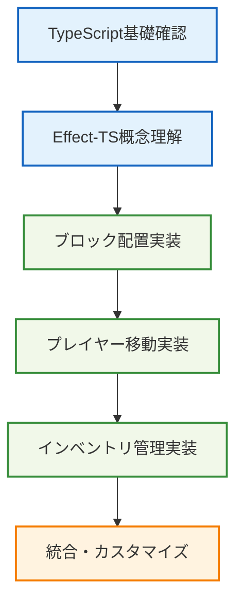

# 🌱 基本的な使用例

## 🧭 スマートナビゲーション

> **📍 現在位置**: ホーム → 実例集 → 基本的な使用例
> **🎯 学習目標**: Effect-TSを使った基本的なMinecraft機能の実装
> **⏱️ 所要時間**: 15-30分
> **👤 対象**: TypeScript初心者〜中級者

**Effect-TS 3.17+の最新パターンを使って、Minecraftの基本機能を実装しましょう！**

## 📚 実装例一覧

### 🧱 01. シンプルなブロック配置
- **[シンプルなブロック配置](./01-simple-block-placement.md)**
  - **学習目標**: Schema.Struct、Effect.gen、Context.GenericTagの基本使用
  - **実装内容**: ブロック配置システムの最小実装
  - **技術要素**: 型安全なデータモデル、エラーハンドリング、依存注入

### 🏃 02. プレイヤー移動実装
- **[プレイヤー移動](./02-player-movement.md)**
  - **学習目標**: Effect合成、状態管理、物理演算の統合
  - **実装内容**: 3Dプレイヤー移動システム
  - **技術要素**: 座標変換、衝突検出、リアルタイム更新

### 🎒 03. インベントリ管理
- **[インベントリ管理](./03-inventory-management.md)**
  - **学習目標**: 複雑な状態管理、UI/ロジック分離
  - **実装内容**: アイテムスロット管理システム
  - **技術要素**: 不変データ構造、バリデーション、イベント処理

## 🎯 学習の進め方



## 📋 前提条件

### 🛠️ 必要な環境
```bash
# Node.js v18以上
node --version  # v18.0.0+

# パッケージマネージャー
npm --version   # v8.0.0+
# または
pnpm --version  # v8.0.0+
```

### 📦 必要な依存関係
```json
{
  "dependencies": {
    "effect": "^3.17.13",
    "@effect/schema": "^0.75.5",
    "@effect/platform": "^0.90.9",
    "three": "^0.179.1"
  },
  "devDependencies": {
    "typescript": "^5.9.2",
    "@types/three": "^0.179.0",
    "vitest": "^3.2.4"
  }
}
```

### 🧠 前提知識
- **TypeScript**: 基本的な型システム理解
- **関数型プログラミング**: 純関数、イミュータブルデータの概念
- **Effect-TS**: 基本概念（推奨、実例で学習も可能）

## 🚀 クイックスタート

### 1️⃣ プロジェクト初期化
```bash
# プロジェクト作成
mkdir ts-minecraft-examples
cd ts-minecraft-examples

# パッケージ初期化
npm init -y

# 依存関係インストール
npm install effect @effect/schema @effect/platform three
npm install -D typescript @types/three @types/node vitest tsx
```

### 2️⃣ TypeScript設定
```json
// tsconfig.json
{
  "compilerOptions": {
    "target": "ES2022",
    "module": "ESNext",
    "moduleResolution": "node",
    "strict": true,
    "esModuleInterop": true,
    "skipLibCheck": true,
    "forceConsistentCasingInFileNames": true,
    "types": ["node", "three"]
  },
  "include": ["src/**/*"],
  "exclude": ["node_modules", "dist"]
}
```

### 3️⃣ 基本構造作成
```bash
mkdir -p src/{domain,infrastructure,application}
touch src/index.ts
```

## 💡 重要な実装パターン

### 🏗️ Effect-TS 3.17+パターン
```typescript
import { Schema } from "@effect/schema"
import { Context, Effect } from "effect"

// ✅ Schema.Struct使用（推奨）
const Position = Schema.Struct({
  x: Schema.Number,
  y: Schema.Number,
  z: Schema.Number
})

// ✅ Context.GenericTag使用
interface BlockService {
  readonly place: (position: Position.Type, blockType: string) => Effect.Effect<void, BlockError>
}
const BlockService = Context.GenericTag<BlockService>("BlockService")

// ✅ 適切なエラー定義
class BlockError extends Schema.TaggedError<BlockError>()("BlockError", {
  reason: Schema.String
}) {}
```

### 🎯 学習ポイント
1. **型安全性**: Schema.Structによる実行時型検証
2. **関数型合成**: Effect.genを使った処理の組み合わせ
3. **依存注入**: Context.GenericTagによるサービス管理
4. **エラーハンドリング**: Schema.TaggedErrorによる型安全なエラー管理

## 🔗 次のステップ

### 📖 詳細実装
各実装例を順番に学習してください：
1. [ブロック配置システム](./01-simple-block-placement.md)
2. [プレイヤー移動システム](./02-player-movement.md)
3. [インベントリ管理システム](./03-inventory-management.md)

### 🚀 発展的内容
- [高度なパターン](../02-advanced-patterns/README.md)
- [統合例](../03-integration-examples/README.md)
- [パフォーマンス最適化](../04-performance-optimization/README.md)

### 📚 理論的背景
- [Effect-TSパターン](../../01-architecture/06-effect-ts-patterns.md)
- [開発規約](../../03-guides/00-development-conventions.md)

---

**🎯 実践が最良の学習方法です。手を動かして実装しながら理解を深めましょう！**