# 🌱 基本的な使用例

## 🧭 スマートナビゲーション

> **📍 現在位置**: ホーム → 実例集 → 基本的な使用例
> **🎯 学習目標**: Effect-TSを使った基本的なMinecraft機能の実装
> **⏱️ 所要時間**: 15-30分
> **👤 対象**: TypeScript初心者〜中級者

**Effect-TS 3.17+の最新パターンを使って、Minecraftの基本機能を実装しましょう！**

## 📚 実装例一覧

### 🧱 01. シンプルなブロック配置
- **[シンプルなブロック配置](./01-simple-block-placement.md)**
  - **学習目標**: Schema.Struct、Effect.gen、Context.GenericTagの基本使用
  - **実装内容**: ブロック配置システムの完全実装（Three.js統合含む）
  - **技術要素**:
    - Voxel座標系とThree.js座標変換
    - 型安全なブロックデータモデル
    - Effect-TS 3.17+パターンによるエラーハンドリング
    - Property-based testing（fast-check）
    - パフォーマンス最適化（チャンク管理・メモリプール）
  - **新機能**: 完全動作コード、包括テスト、最適化例
  - **✅ よくある間違いと解決策**: 古いパターンから最新パターンへの移行方法を詳説

### 🏃 02. プレイヤー移動実装
- **[プレイヤー移動](./02-player-movement.md)**
  - **学習目標**: Effect合成、状態管理、物理演算の統合
  - **実装内容**: 高性能3Dプレイヤー移動システム
  - **技術要素**:
    - Three.js物理シミュレーション統合
    - なめらかな移動・衝突検出アルゴリズム
    - イベントドリブン入力システム
    - 適応的フレームレート制御
    - Property-based testing（移動検証）
    - メモリ効率的な履歴管理
  - **新機能**: 完全統合システム、高度テスト、プロファイリング
  - **⚠️ アンチパターン対策**: 3D移動システムでのよくある落とし穴と回避方法

### 🎒 03. インベントリ管理
- **[インベントリ管理](./03-inventory-management.md)**
  - **学習目標**: 複雑な状態管理、UI/ロジック分離、React統合
  - **実装内容**: フル機能インベントリ・UI統合システム
  - **技術要素**:
    - React統合によるリアクティブUI
    - Queue・Stream活用イベント処理
    - 不変データ構造によるスタック管理
    - アイテム永続化・ロード機能
    - 包括的統合テスト・Property-based testing
    - UIコンポーネント分離設計
  - **新機能**: React UI例、イベント統合、永続化システム
  - **🚫 パフォーマンス対策**: 大量アイテム処理のボトルネックと最適化手法

## 🎯 学習の進め方



## 📋 前提条件

### 🛠️ 必要な環境
```bash
# Node.js v18以上
node --version  # v18.0.0+

# パッケージマネージャー
npm --version   # v8.0.0+
# または
pnpm --version  # v8.0.0+
```

### 📦 必要な依存関係
```json
{
  "dependencies": {
    "effect": "^3.17.13",
    "@effect/schema": "^0.75.5",
    "@effect/platform": "^0.90.9",
    "three": "^0.179.1",
    "react": "^18.3.1",
    "react-dom": "^18.3.1"
  },
  "devDependencies": {
    "typescript": "^5.9.2",
    "@types/three": "^0.179.0",
    "@types/react": "^18.3.12",
    "@types/react-dom": "^18.3.1",
    "vitest": "^3.2.4",
    "fast-check": "^3.22.0",
    "jsdom": "^25.0.1"
  }
}
```

### 🧠 前提知識
- **TypeScript**: 基本的な型システム理解
- **関数型プログラミング**: 純関数、イミュータブルデータの概念
- **Effect-TS**: 基本概念（推奨、実例で学習も可能）

## 🚀 クイックスタート

### 1️⃣ プロジェクト初期化
```bash
# プロジェクト作成
mkdir ts-minecraft-examples
cd ts-minecraft-examples

# パッケージ初期化
npm init -y

# 依存関係インストール
pnpm add effect @effect/schema @effect/platform three react react-dom
pnpm add -D typescript @types/three @types/react @types/react-dom @types/node vitest fast-check jsdom tsx
```

### 2️⃣ TypeScript設定
```json
// tsconfig.json
{
  "compilerOptions": {
    "target": "ES2022",
    "module": "ESNext",
    "moduleResolution": "node",
    "strict": true,
    "esModuleInterop": true,
    "skipLibCheck": true,
    "forceConsistentCasingInFileNames": true,
    "types": ["node", "three"]
  },
  "include": ["src/**/*"],
  "exclude": ["node_modules", "dist"]
}
```

### 3️⃣ 基本構造作成
```bash
mkdir -p src/{domain,infrastructure,application}
touch src/index.ts
```

## 💡 重要な実装パターン

### 🏗️ Effect-TS 3.17+パターン
```typescript
import { Schema } from "@effect/schema"
import { Context, Effect } from "effect"

// ✅ Schema.Struct使用（推奨）
const Position = Schema.Struct({
  x: Schema.Number,
  y: Schema.Number,
  z: Schema.Number
})

// ✅ Context.GenericTag使用
interface BlockService {
  readonly place: (position: Position.Type, blockType: string) => Effect.Effect<void, BlockError>
}
const BlockService = Context.GenericTag<BlockService>("BlockService")

// ✅ 適切なエラー定義
class BlockError extends Schema.TaggedError<BlockError>()("BlockError", {
  reason: Schema.String
}) {}
```

### 🎯 学習ポイント
1. **型安全性**: Schema.Structによる実行時型検証
2. **関数型合成**: Effect.genを使った処理の組み合わせ
3. **依存注入**: Context.GenericTagによるサービス管理
4. **エラーハンドリング**: Schema.TaggedErrorによる型安全なエラー管理

## ⚠️ よくある間違いと解決方法

### 🚫 初心者が陥りやすいアンチパターン

#### 1. ❌ 古いAPIパターンの混在

**間違った実装:**
```typescript
// ❌ 非推奨：古いAPIの使用
import { Context, Data } from "effect"

// ❌ Data.struct使用（非推奨）
const OldPosition = Data.struct({
  x: 0,
  y: 0,
  z: 0
})

// ❌ Context.Tag使用（非推奨）
const OldService = Context.Tag<ServiceInterface>("OldService")
```

**✅ 正しい実装:**
```typescript
// ✅ 推奨：Effect-TS 3.17+最新パターン
import { Schema, Context } from "effect"

// ✅ Schema.Struct使用
const ModernPosition = Schema.Struct({
  x: Schema.Number,
  y: Schema.Number,
  z: Schema.Number
})

// ✅ Context.GenericTag使用
interface ServiceInterface {
  readonly method: () => Effect.Effect<void, never>
}
const ModernService = Context.GenericTag<ServiceInterface>("@app/ModernService")
```

#### 2. ❌ 非同期処理の誤解

**間違った実装:**
```typescript
// ❌ 非推奨：Promiseとの混在
const badAsyncFunction = async (): Promise<string> => {
  const result = await Effect.runPromise(someEffect)
  return result
}

// ❌ 非推奨：try-catch使用
const badErrorHandling = () => {
  try {
    const result = Effect.runSync(riskyEffect)
    return result
  } catch (error) {
    console.error("Error:", error)
    return null
  }
}
```

**✅ 正しい実装:**
```typescript
// ✅ 推奨：Effect型で統一
const goodAsyncFunction = (): Effect.Effect<string, MyError> =>
  Effect.gen(function* () {
    const result = yield* someEffect
    return result
  })

// ✅ 推奨：Effect.catchAllでエラーハンドリング
const goodErrorHandling = () =>
  riskyEffect.pipe(
    Effect.catchAll((error) =>
      Effect.gen(function* () {
        yield* Effect.log(`Error occurred: ${error.message}`)
        return defaultValue
      })
    )
  )
```

#### 3. ❌ 深いネストと複雑な条件分岐

**間違った実装:**
```typescript
// ❌ 非推奨：深いネストと複雑なif文
const badValidation = (input: unknown) => {
  if (input) {
    if (typeof input === "object") {
      if ("position" in input) {
        if (input.position) {
          if (typeof input.position === "object") {
            if ("x" in input.position && "y" in input.position && "z" in input.position) {
              return processValidInput(input)
            }
          }
        }
      }
    }
  }
  throw new Error("Invalid input")
}
```

**✅ 正しい実装:**
```typescript
// ✅ 推奨：早期リターンとMatch.value
const goodValidation = (input: unknown): Effect.Effect<ProcessedInput, ValidationError> =>
  Effect.gen(function* () {
    // 早期リターン: 基本チェック
    if (!input || typeof input !== "object") {
      return yield* Effect.fail(new ValidationError({ reason: "Input must be an object" }))
    }

    // Schema検証で構造チェック
    const validatedInput = yield* Schema.decodeUnknown(InputSchema)(input).pipe(
      Effect.mapError(error => new ValidationError({ reason: "Schema validation failed", cause: error }))
    )

    // Match.valueで型安全な処理分岐
    return yield* pipe(
      validatedInput,
      Match.value,
      Match.when({ type: "player_move" }, (data) => processPlayerMove(data)),
      Match.when({ type: "block_place" }, (data) => processBlockPlace(data)),
      Match.orElse(() => Effect.fail(new ValidationError({ reason: "Unknown input type" })))
    )
  })
```

### 🎯 品質チェックリスト

以下のチェックポイントで実装品質を確認してください：

#### ✅ Effect-TS準拠チェック
- [ ] `Schema.Struct`でデータ定義している
- [ ] `Context.GenericTag`でサービス定義している
- [ ] `Match.value`で条件分岐している
- [ ] `Schema.TaggedError`でエラー定義している
- [ ] `Effect.gen`で非同期処理を合成している

#### ✅ コード品質チェック
- [ ] 関数のネストが3層以下である
- [ ] 早期リターンパターンを活用している
- [ ] 純粋関数と副作用が明確に分離されている
- [ ] 型安全性が100%保たれている
- [ ] テスタブルな構造になっている

#### ✅ パフォーマンスチェック
- [ ] 不変データ構造を使用している
- [ ] 適切なメモ化が実装されている
- [ ] メモリリークがない
- [ ] O(n²)アルゴリズムを避けている
- [ ] バッチ処理を活用している

### 🛠️ デバッグのコツ

#### 1. Effect.log を活用したデバッグ
```typescript
const debuggableFunction = (input: unknown) =>
  Effect.gen(function* () {
    yield* Effect.log(`Processing input: ${JSON.stringify(input)}`)

    const result = yield* processInput(input)

    yield* Effect.log(`Processing completed: ${JSON.stringify(result)}`)
    return result
  })
```

#### 2. 段階的なテスト実装
```typescript
// 単体テストから始める
describe("Pure Functions", () => {
  it("should calculate correctly", () => {
    expect(pureCalculation(1, 2)).toBe(3)
  })
})

// 次にEffect関数のテスト
describe("Effect Functions", () => {
  it("should handle effects correctly", async () => {
    const result = await Effect.runPromise(effectFunction("test"))
    expect(result).toEqual(expectedResult)
  })
})
```

### 📚 学習リソース

#### 必読ドキュメント
1. **各実装例の「よくある間違い」セクション**
   - [ブロック配置の間違い例](./01-simple-block-placement.md#⚠️-よくある間違いとベストプラクティス)
   - [プレイヤー移動の間違い例](./02-player-movement.md#⚠️-よくある間違いとベストプラクティス)
   - [インベントリ管理の間違い例](./03-inventory-management.md#⚠️-よくある間違いとベストプラクティス)

#### 実践的学習アプローチ
1. **写経学習**: まず提供されたコードを正確に写して動作確認
2. **改良実践**: 小さな機能追加や変更を試す
3. **独自実装**: 学習した内容をベースに新しい機能を実装

## 🔗 次のステップ

### 📖 詳細実装
各実装例を順番に学習してください：
1. [ブロック配置システム](./01-simple-block-placement.md)
2. [プレイヤー移動システム](./02-player-movement.md)
3. [インベントリ管理システム](./03-inventory-management.md)

### 🚀 発展的内容
- **[高度なパターン](../02-advanced-patterns/README.md)**
  - [Schema検証パターン](../02-advanced-patterns/02-schema-validation.md) - 高度なデータ検証・回復戦略
- **[統合例](../03-integration-examples/README.md)** - 完全システム統合
- **[パフォーマンス最適化](../04-performance-optimization/README.md)** - 大規模最適化技法

### 📚 理論的背景
- [Effect-TSパターン](../../01-architecture/06-effect-ts-patterns.md)
- [開発規約](../../03-guides/00-development-conventions.md)

---

**🎯 実践が最良の学習方法です。手を動かして実装しながら理解を深めましょう！**