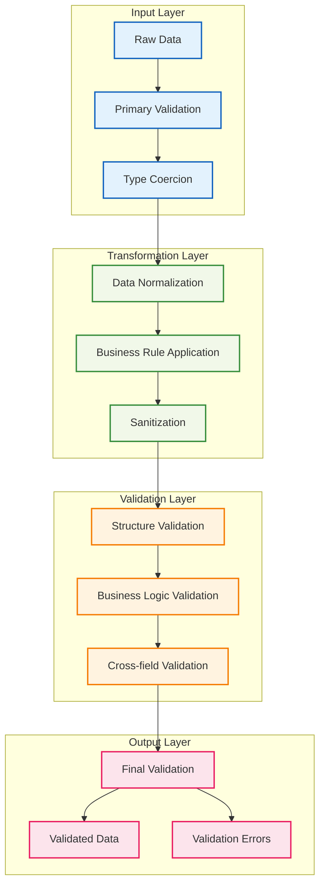

# 🔍 Schema検証パターン

## 🧭 スマートナビゲーション

> **📍 現在位置**: ホーム → 実例集 → 高度なパターン → Schema検証
> **🎯 学習目標**: 高度なデータ検証とトランスフォーメーション
> **⏱️ 所要時間**: 45分
> **👤 対象**: Effect-TS中級者〜上級者

**Effect-TSのSchemaシステムを活用して、高度で堅牢なデータ検証システムを構築しましょう！**

## 🎯 学習目標

この実装例では以下を学習します：

- **Custom Validators**: カスタムバリデーションロジックの実装
- **Schema Transformation**: データの自動変換と正規化
- **Conditional Validation**: 条件付き検証ルールの適用
- **Performance Optimization**: 大規模データ処理の最適化
- **Error Context**: 詳細なエラー情報の提供
- **Reusable Patterns**: 再利用可能な検証パターン

## 💡 実装アーキテクチャ



## 📝 完全実装コード

### 🏗️ 1. 高度なゲームデータSchema

```typescript
// src/domain/schemas/advanced-game-schemas.ts
import { Schema } from "@effect/schema"
import { Effect, pipe, Match, Array as EffectArray } from "effect"

/**
 * カスタムバリデーション関数
 *
 * 🎯 学習ポイント：
 * - Schema.refineによるカスタム検証
 * - 複雑なビジネスルールの実装
 * - パフォーマンスを考慮したバリデーション
 */
export const createPositionSchema = (worldBounds: { minX: number, maxX: number, minY: number, maxY: number, minZ: number, maxZ: number }) =>
  Schema.Struct({
    x: Schema.Number,
    y: Schema.Number,
    z: Schema.Number
  }).pipe(
    Schema.refine((position) => {
      return (
        position.x >= worldBounds.minX && position.x <= worldBounds.maxX &&
        position.y >= worldBounds.minY && position.y <= worldBounds.maxY &&
        position.z >= worldBounds.minZ && position.z <= worldBounds.maxZ
      )
    }, {
      message: (position) =>
        `Position (${position.x}, ${position.y}, ${position.z}) is outside world bounds ` +
        `[${worldBounds.minX}-${worldBounds.maxX}, ${worldBounds.minY}-${worldBounds.maxY}, ${worldBounds.minZ}-${worldBounds.maxZ}]`
    })
  )

/**
 * 動的なアイテム検証Schema
 */
export const createDynamicItemSchema = (gameConfig: GameConfiguration) =>
  Schema.Struct({
    type: Schema.String.pipe(
      Schema.refine(
        (itemType) => gameConfig.validItemTypes.includes(itemType),
        {
          message: (itemType) => `Unknown item type: ${itemType}. Valid types: ${gameConfig.validItemTypes.join(", ")}`
        }
      )
    ),
    quantity: Schema.Number.pipe(
      Schema.refine(
        (qty) => qty > 0 && qty <= gameConfig.maxStackSize,
        {
          message: (qty) => `Quantity ${qty} must be between 1 and ${gameConfig.maxStackSize}`
        }
      )
    ),
    metadata: Schema.optional(Schema.Record({
      key: Schema.String,
      value: Schema.Union(Schema.String, Schema.Number, Schema.Boolean)
    }).pipe(
      Schema.refine(
        (meta) => Object.keys(meta).length <= gameConfig.maxMetadataKeys,
        {
          message: (meta) => `Too many metadata keys: ${Object.keys(meta).length}. Maximum allowed: ${gameConfig.maxMetadataKeys}`
        }
      )
    ))
  })

/**
 * 条件付き検証を持つプレイヤーSchema
 */
export const AdvancedPlayerSchema = Schema.Struct({
  id: Schema.String.pipe(
    Schema.refine(
      (id) => /^player_[a-f0-9]{8}-[a-f0-9]{4}-[a-f0-9]{4}-[a-f0-9]{4}-[a-f0-9]{12}$/.test(id),
      {
        message: (id) => `Invalid player ID format: ${id}. Expected format: player_xxxxxxxx-xxxx-xxxx-xxxx-xxxxxxxxxxxx`
      }
    )
  ),

  name: Schema.String.pipe(
    Schema.refine(
      (name) => name.length >= 3 && name.length <= 20,
      {
        message: (name) => `Player name "${name}" must be between 3 and 20 characters`
      }
    ),
    Schema.refine(
      (name) => /^[a-zA-Z0-9_-]+$/.test(name),
      {
        message: (name) => `Player name "${name}" contains invalid characters. Only letters, numbers, underscore, and dash are allowed`
      }
    )
  ),

  level: Schema.Number.pipe(
    Schema.refine((level) => level >= 1 && level <= 100, {
      message: (level) => `Player level ${level} must be between 1 and 100`
    })
  ),

  experience: Schema.Number.pipe(
    Schema.refine((exp) => exp >= 0, {
      message: (exp) => `Experience ${exp} cannot be negative`
    })
  ),

  health: Schema.Number.pipe(
    Schema.refine((health) => health >= 0 && health <= 100, {
      message: (health) => `Health ${health} must be between 0 and 100`
    })
  ),

  position: Schema.suspend(() => createPositionSchema({
    minX: -30000000, maxX: 30000000,
    minY: -64, maxY: 320,
    minZ: -30000000, maxZ: 30000000
  })),

  inventory: Schema.Array(Schema.suspend(() => createDynamicItemSchema({
    validItemTypes: ["grass", "stone", "wood", "diamond", "iron", "gold"],
    maxStackSize: 64,
    maxMetadataKeys: 10
  }))),

  gameMode: Schema.Literal("survival", "creative", "adventure", "spectator"),

  permissions: Schema.Array(Schema.String).pipe(
    Schema.refine(
      (perms) => perms.every(perm => /^[a-z]+(\.[a-z]+)*$/.test(perm)),
      {
        message: (perms) => `Invalid permission format in: ${perms.filter(p => !/^[a-z]+(\.[a-z]+)*$/.test(p)).join(", ")}`
      }
    )
  )
}).pipe(
  // クロスフィールドバリデーション
  Schema.refine(
    (player) => {
      // クリエイティブモードでは制限を緩和
      if (player.gameMode === "creative") {
        return true
      }

      // サバイバルモードでの追加チェック
      const maxInventorySize = player.level >= 10 ? 40 : 36
      return player.inventory.length <= maxInventorySize
    },
    {
      message: (player) =>
        `Player in ${player.gameMode} mode cannot have ${player.inventory.length} items. ` +
        `Maximum allowed: ${player.gameMode === "creative" ? "unlimited" : (player.level >= 10 ? 40 : 36)}`
    }
  ),

  Schema.refine(
    (player) => {
      // 経験値とレベルの整合性チェック
      const expectedMinExp = calculateMinExperienceForLevel(player.level)
      const expectedMaxExp = calculateMinExperienceForLevel(player.level + 1) - 1

      return player.experience >= expectedMinExp && player.experience <= expectedMaxExp
    },
    {
      message: (player) => {
        const expectedMinExp = calculateMinExperienceForLevel(player.level)
        const expectedMaxExp = calculateMinExperienceForLevel(player.level + 1) - 1
        return `Experience ${player.experience} is inconsistent with level ${player.level}. ` +
               `Expected range: ${expectedMinExp} - ${expectedMaxExp}`
      }
    }
  )
)

/**
 * 自動変換を含むワールドSchema
 */
export const WorldDataSchema = Schema.Struct({
  id: Schema.String,

  name: Schema.String.pipe(
    // 自動的にトリムして正規化
    Schema.transform(
      Schema.String,
      (name) => name.trim().replace(/\s+/g, " "),
      (normalizedName) => normalizedName
    )
  ),

  seed: Schema.Union(Schema.String, Schema.Number).pipe(
    // 文字列と数値の両方を受け入れて数値に変換
    Schema.transform(
      Schema.Number,
      (seedInput) => {
        if (typeof seedInput === "string") {
          const parsed = parseInt(seedInput, 10)
          return isNaN(parsed) ? seedInput.split("").reduce((a, b) => a + b.charCodeAt(0), 0) : parsed
        }
        return seedInput
      },
      (normalizedSeed) => normalizedSeed
    )
  ),

  dimension: Schema.Literal("overworld", "nether", "end"),

  gameRules: Schema.Record({
    key: Schema.String,
    value: Schema.Union(Schema.String, Schema.Number, Schema.Boolean)
  }).pipe(
    // ゲームルールの正規化とバリデーション
    Schema.transform(
      Schema.Record({ key: Schema.String, value: Schema.Union(Schema.String, Schema.Number, Schema.Boolean) }),
      (rules) => {
        const normalizedRules: Record<string, string | number | boolean> = {}

        for (const [key, value] of Object.entries(rules)) {
          const normalizedKey = key.toLowerCase().replace(/[^a-z0-9]/g, "")

          // 特定のルールの値を正規化
          switch (normalizedKey) {
            case "keepinventory":
            case "mobgriefing":
            case "dofiretick":
              normalizedRules[normalizedKey] = Boolean(value)
              break
            case "randomtickspeed":
            case "spawnradius":
              normalizedRules[normalizedKey] = Math.max(0, Math.min(10000, Number(value) || 0))
              break
            default:
              normalizedRules[normalizedKey] = value
          }
        }

        return normalizedRules
      },
      (normalizedRules) => normalizedRules
    )
  ),

  chunks: Schema.Array(
    Schema.Struct({
      x: Schema.Number,
      z: Schema.Number,
      data: Schema.String.pipe(
        // Base64エンコードされたチャンクデータの検証
        Schema.refine(
          (data) => {
            try {
              return Buffer.from(data, 'base64').length > 0
            } catch {
              return false
            }
          },
          {
            message: (data) => `Invalid base64 chunk data: ${data.substring(0, 50)}...`
          }
        )
      ),
      timestamp: Schema.DateFromString
    })
  ).pipe(
    Schema.refine(
      (chunks) => {
        // 重複チャンクのチェック
        const coordinates = new Set()
        for (const chunk of chunks) {
          const coordKey = `${chunk.x},${chunk.z}`
          if (coordinates.has(coordKey)) {
            return false
          }
          coordinates.add(coordKey)
        }
        return true
      },
      {
        message: () => "Duplicate chunk coordinates found in world data"
      }
    )
  ),

  metadata: Schema.optional(
    Schema.Record({
      key: Schema.String,
      value: Schema.Unknown
    }).pipe(
      Schema.refine(
        (meta) => {
          // メタデータサイズの制限
          const serialized = JSON.stringify(meta)
          return serialized.length <= 100000 // 100KB制限
        },
        {
          message: (meta) => {
            const size = JSON.stringify(meta).length
            return `World metadata too large: ${size} bytes. Maximum allowed: 100000 bytes`
          }
        }
      )
    )
  )
})

/**
 * バッチ処理用のSchema
 */
export const BatchProcessingSchema = <T>(itemSchema: Schema.Schema<T>) =>
  Schema.Struct({
    items: Schema.Array(itemSchema).pipe(
      Schema.refine(
        (items) => items.length > 0 && items.length <= 1000,
        {
          message: (items) => `Batch size ${items.length} must be between 1 and 1000`
        }
      )
    ),
    metadata: Schema.Struct({
      batchId: Schema.String,
      timestamp: Schema.DateFromString,
      source: Schema.String,
      priority: Schema.Literal("low", "normal", "high", "critical")
    })
  })

/**
 * 段階的検証Schema
 */
export const createStagedValidationSchema = <T>(
  stages: Array<{
    name: string
    schema: Schema.Schema<T>
    optional?: boolean
  }>
) => {
  return Schema.suspend(() =>
    Schema.Struct({
      data: Schema.Unknown,
      validationStages: Schema.Array(Schema.Struct({
        stage: Schema.String,
        success: Schema.Boolean,
        errors: Schema.Array(Schema.String),
        warnings: Schema.Array(Schema.String)
      }))
    }).pipe(
      Schema.transform(
        Schema.Struct({
          validatedData: Schema.Unknown,
          validationSummary: Schema.Struct({
            totalStages: Schema.Number,
            passedStages: Schema.Number,
            failedStages: Schema.Number,
            hasWarnings: Schema.Boolean
          })
        }),
        (input) => {
          const results = []
          let validatedData = input.data
          let passedStages = 0
          let failedStages = 0
          let hasWarnings = false

          for (const stage of stages) {
            try {
              const result = Schema.decodeUnknownSync(stage.schema)(validatedData)
              validatedData = result
              passedStages++
              results.push({
                stage: stage.name,
                success: true,
                errors: [],
                warnings: []
              })
            } catch (error) {
              failedStages++
              const errorMessage = error instanceof Error ? error.message : "Unknown validation error"

              if (stage.optional) {
                hasWarnings = true
                results.push({
                  stage: stage.name,
                  success: true,
                  errors: [],
                  warnings: [errorMessage]
                })
              } else {
                results.push({
                  stage: stage.name,
                  success: false,
                  errors: [errorMessage],
                  warnings: []
                })
                break // 必須段階で失敗した場合は処理を停止
              }
            }
          }

          return {
            validatedData,
            validationSummary: {
              totalStages: stages.length,
              passedStages,
              failedStages,
              hasWarnings
            }
          }
        },
        (output) => ({
          data: output.validatedData,
          validationStages: []
        })
      )
    )
  )
}

/**
 * ヘルパー関数
 */
const calculateMinExperienceForLevel = (level: number): number => {
  if (level <= 1) return 0
  if (level <= 16) return Math.pow(level, 2) + 6 * level
  if (level <= 31) return 2.5 * Math.pow(level, 2) - 40.5 * level + 360
  return 4.5 * Math.pow(level, 2) - 162.5 * level + 2220
}

export type AdvancedPlayer = Schema.Schema.Type<typeof AdvancedPlayerSchema>
export type WorldData = Schema.Schema.Type<typeof WorldDataSchema>
export type GameConfiguration = {
  validItemTypes: string[]
  maxStackSize: number
  maxMetadataKeys: number
}
```

### 🔧 2. バリデーションサービス

```typescript
// src/domain/services/validation-service.ts
import { Context, Effect, Layer, pipe, Match, Array as EffectArray } from "effect"
import { Schema } from "@effect/schema"

/**
 * 検証結果の詳細情報
 */
export const ValidationResult = Schema.Struct({
  isValid: Schema.Boolean,
  data: Schema.optional(Schema.Unknown),
  errors: Schema.Array(Schema.Struct({
    path: Schema.Array(Schema.String),
    message: Schema.String,
    code: Schema.String,
    severity: Schema.Literal("error", "warning", "info")
  })),
  warnings: Schema.Array(Schema.String),
  metadata: Schema.Record({
    key: Schema.String,
    value: Schema.Unknown
  })
})

export type ValidationResult = Schema.Schema.Type<typeof ValidationResult>

/**
 * 検証エラー
 */
export class ValidationError extends Schema.TaggedError<ValidationError>()(
  "ValidationError",
  {
    validationResult: ValidationResult,
    originalInput: Schema.Unknown,
    schemaName: Schema.String
  }
) {}

/**
 * 高度な検証サービス
 */
export interface AdvancedValidationService {
  readonly validateWithDetails: <T>(
    schema: Schema.Schema<T>,
    input: unknown,
    options?: ValidationOptions
  ) => Effect.Effect<ValidationResult, ValidationError>

  readonly validateBatch: <T>(
    schema: Schema.Schema<T>,
    inputs: unknown[],
    options?: BatchValidationOptions
  ) => Effect.Effect<BatchValidationResult<T>, ValidationError>

  readonly validateAsync: <T>(
    schema: Schema.Schema<T>,
    input: unknown,
    options?: AsyncValidationOptions
  ) => Effect.Effect<T, ValidationError>

  readonly createCustomValidator: <T>(
    name: string,
    validationLogic: (input: unknown) => Effect.Effect<T, ValidationError>
  ) => Schema.Schema<T>
}

export const AdvancedValidationService = Context.GenericTag<AdvancedValidationService>(
  "AdvancedValidationService"
)

export interface ValidationOptions {
  readonly strict?: boolean
  readonly allowUnknownKeys?: boolean
  readonly collectAllErrors?: boolean
  readonly transformData?: boolean
}

export interface BatchValidationOptions extends ValidationOptions {
  readonly concurrency?: number
  readonly continueOnError?: boolean
  readonly reportProgress?: boolean
}

export interface AsyncValidationOptions extends ValidationOptions {
  readonly timeout?: string
  readonly retryPolicy?: RetryPolicy
}

export interface RetryPolicy {
  readonly maxAttempts: number
  readonly backoffStrategy: "linear" | "exponential"
  readonly baseDelay: string
}

export interface BatchValidationResult<T> {
  readonly totalItems: number
  readonly validItems: T[]
  readonly invalidItems: Array<{
    index: number
    input: unknown
    errors: ValidationResult
  }>
  readonly summary: {
    successCount: number
    errorCount: number
    warningCount: number
  }
}

/**
 * 高度な検証サービス実装
 */
class AdvancedValidationServiceImpl implements AdvancedValidationService {
  validateWithDetails<T>(
    schema: Schema.Schema<T>,
    input: unknown,
    options: ValidationOptions = {}
  ): Effect.Effect<ValidationResult, ValidationError> {
    return Effect.gen(function* () {
      try {
        // 基本検証実行
        const result = Schema.decodeUnknownSync(schema)(input)

        return {
          isValid: true,
          data: result,
          errors: [],
          warnings: [],
          metadata: {
            schemaType: schema.constructor.name,
            validationTimestamp: new Date().toISOString(),
            options: JSON.stringify(options)
          }
        }
      } catch (error) {
        // 詳細なエラー情報の抽出
        const validationErrors = yield* extractValidationErrors(error)

        const result: ValidationResult = {
          isValid: false,
          errors: validationErrors,
          warnings: [],
          metadata: {
            schemaType: schema.constructor.name,
            validationTimestamp: new Date().toISOString(),
            failureReason: error instanceof Error ? error.message : "Unknown error"
          }
        }

        if (!options.collectAllErrors && validationErrors.length > 0) {
          yield* Effect.fail(new ValidationError({
            validationResult: result,
            originalInput: input,
            schemaName: schema.constructor.name
          }))
        }

        return result
      }
    })
  }

  validateBatch<T>(
    schema: Schema.Schema<T>,
    inputs: unknown[],
    options: BatchValidationOptions = {}
  ): Effect.Effect<BatchValidationResult<T>, ValidationError> {
    return Effect.gen(() => {
      const self = this
      return Effect.gen(function* () {
        const concurrency = options.concurrency || 10
        const continueOnError = options.continueOnError ?? true

        // 並列でバッチ検証を実行
        const validationResults = yield* Effect.all(
          inputs.map((input, index) =>
            self.validateWithDetails(schema, input, options).pipe(
              Effect.map(result => ({ index, input, result })),
              Effect.either
            )
          ),
          { concurrency }
        )

        const validItems: T[] = []
        const invalidItems: Array<{
          index: number
          input: unknown
          errors: ValidationResult
        }> = []

        let successCount = 0
        let errorCount = 0
        let warningCount = 0

        for (const validationResult of validationResults) {
          if (validationResult._tag === "Right") {
            const { index, input, result } = validationResult.right

            if (result.isValid && result.data) {
              validItems.push(result.data as T)
              successCount++
            } else {
              invalidItems.push({ index, input, errors: result })
              errorCount++
            }

            warningCount += result.warnings.length
          } else {
            // バリデーション処理自体がエラー
            errorCount++
          }
        }

        return {
          totalItems: inputs.length,
          validItems,
          invalidItems,
          summary: {
            successCount,
            errorCount,
            warningCount
          }
        }
      })
    })()
  }

  validateAsync<T>(
    schema: Schema.Schema<T>,
    input: unknown,
    options: AsyncValidationOptions = {}
  ): Effect.Effect<T, ValidationError> {
    return Effect.gen(() => {
      const self = this
      return Effect.gen(function* () {
        const timeout = options.timeout || "10s"
        const maxAttempts = options.retryPolicy?.maxAttempts || 1

        const validationEffect = self.validateWithDetails(schema, input, options).pipe(
          Effect.flatMap((result) => {
            if (result.isValid && result.data) {
              return Effect.succeed(result.data as T)
            } else {
              return Effect.fail(new ValidationError({
                validationResult: result,
                originalInput: input,
                schemaName: schema.constructor.name
              }))
            }
          }),
          Effect.timeout(timeout)
        )

        if (maxAttempts > 1) {
          const retrySchedule = createRetrySchedule(options.retryPolicy!)
          return yield* validationEffect.pipe(
            Effect.retry(retrySchedule)
          )
        } else {
          return yield* validationEffect
        }
      })
    })()
  }

  createCustomValidator<T>(
    name: string,
    validationLogic: (input: unknown) => Effect.Effect<T, ValidationError>
  ): Schema.Schema<T> {
    return Schema.transformOrFail(
      Schema.Unknown,
      Schema.Unknown as Schema.Schema<T>,
      (input) =>
        validationLogic(input).pipe(
          Effect.mapError((error) => ({
            _tag: "Type" as const,
            message: `Custom validation '${name}' failed: ${error.message}`
          }))
        ),
      (output) => Effect.succeed(output)
    )
  }
}

/**
 * バリデーションエラー詳細抽出
 */
const extractValidationErrors = (error: unknown): Effect.Effect<ValidationResult["errors"], never> =>
  Effect.sync(() => {
    const errors: ValidationResult["errors"] = []

    if (error instanceof Error) {
      // Schema エラーメッセージのパース
      const message = error.message

      // パスとメッセージの抽出（簡易版）
      const pathMatch = message.match(/at path: \[(.*?)\]/)
      const path = pathMatch ? pathMatch[1].split(", ").map(p => p.replace(/"/g, "")) : []

      errors.push({
        path,
        message: message,
        code: "SCHEMA_VALIDATION_ERROR",
        severity: "error"
      })
    }

    return errors
  })

/**
 * リトライスケジュール作成
 */
const createRetrySchedule = (policy: RetryPolicy) => {
  const baseDelayMs = parseInt(policy.baseDelay.replace("ms", "")) || 1000

  return pipe(
    Schedule.recurs(policy.maxAttempts - 1),
    Schedule.either(
      policy.backoffStrategy === "exponential"
        ? Schedule.exponential(`${baseDelayMs}ms`)
        : Schedule.linear(`${baseDelayMs}ms`)
    )
  )
}

/**
 * AdvancedValidationServiceの実装を提供するLayer
 */
export const AdvancedValidationServiceLive = Layer.succeed(
  AdvancedValidationService,
  new AdvancedValidationServiceImpl()
)
```

### 🎯 3. 実用的な検証例

```typescript
// src/application/game-data-validator.ts
import { Effect, pipe, Match } from "effect"
import { Schema } from "@effect/schema"

/**
 * ゲームデータの包括的検証
 *
 * 🎯 学習ポイント：
 * - 複雑なゲームデータの段階的検証
 * - パフォーマンス最適化された大規模データ処理
 * - ユーザビリティを考慮したエラーレポート
 */
export const validateGameSave = (saveData: unknown) =>
  Effect.gen(function* () {
    const validationService = yield* AdvancedValidationService

    // 段階1: 基本構造の検証
    const structureValidation = yield* validationService.validateWithDetails(
      SaveFileStructureSchema,
      saveData,
      { collectAllErrors: true }
    )

    if (!structureValidation.isValid) {
      return Effect.fail(new GameDataValidationError({
        stage: "structure",
        issues: structureValidation.errors,
        recoverable: false
      }))
    }

    const typedSaveData = structureValidation.data as GameSaveData

    // 段階2: プレイヤーデータの詳細検証
    const playerValidationResults = yield* validationService.validateBatch(
      AdvancedPlayerSchema,
      typedSaveData.players,
      {
        concurrency: 5,
        continueOnError: true,
        reportProgress: true
      }
    )

    // 段階3: ワールドデータの検証（非同期）
    const worldValidation = yield* validationService.validateAsync(
      WorldDataSchema,
      typedSaveData.world,
      {
        timeout: "30s",
        retryPolicy: {
          maxAttempts: 3,
          backoffStrategy: "exponential",
          baseDelay: "1000ms"
        }
      }
    )

    // 段階4: データ整合性のクロスチェック
    const crossValidationResult = yield* performCrossValidation({
      players: playerValidationResults.validItems,
      world: worldValidation,
      metadata: typedSaveData.metadata
    })

    // 段階5: 最終結果の組み立て
    const finalResult: CompleteValidationResult = {
      isValid: crossValidationResult.isValid,
      validatedData: {
        players: playerValidationResults.validItems,
        world: worldValidation,
        metadata: typedSaveData.metadata
      },
      validationSummary: {
        structureCheck: structureValidation.isValid,
        playerValidation: {
          total: typedSaveData.players.length,
          valid: playerValidationResults.summary.successCount,
          invalid: playerValidationResults.summary.errorCount
        },
        worldValidation: true,
        crossValidation: crossValidationResult.isValid
      },
      warnings: [
        ...structureValidation.warnings,
        ...playerValidationResults.invalidItems.map(item =>
          `Player at index ${item.index}: ${item.errors.errors.map(e => e.message).join(", ")}`
        ),
        ...crossValidationResult.warnings
      ],
      errors: crossValidationResult.errors
    }

    return finalResult
  })

/**
 * リアルタイムゲームデータ検証
 */
export const validateRealTimeGameUpdate = (updateData: unknown) =>
  Effect.gen(function* () {
    const validationService = yield* AdvancedValidationService

    // リアルタイム用の高速検証Schema
    const FastUpdateSchema = Schema.Struct({
      type: Schema.Literal("player_move", "block_place", "inventory_update", "chat_message"),
      playerId: Schema.String,
      timestamp: Schema.DateFromString,
      data: Schema.Unknown
    })

    const baseValidation = yield* validationService.validateWithDetails(
      FastUpdateSchema,
      updateData,
      { strict: true }
    )

    if (!baseValidation.isValid) {
      return baseValidation
    }

    const typedUpdate = baseValidation.data as GameUpdate

    // 更新タイプ別の詳細検証
    const detailedValidation = yield* pipe(
      typedUpdate,
      Match.value,
      Match.when(
        { type: "player_move" },
        (update) => validatePlayerMovement(update.data)
      ),
      Match.when(
        { type: "block_place" },
        (update) => validateBlockPlacement(update.data)
      ),
      Match.when(
        { type: "inventory_update" },
        (update) => validateInventoryUpdate(update.data)
      ),
      Match.when(
        { type: "chat_message" },
        (update) => validateChatMessage(update.data)
      ),
      Match.orElse(() =>
        Effect.fail(new ValidationError({
          validationResult: {
            isValid: false,
            errors: [{
              path: ["type"],
              message: `Unknown update type: ${(typedUpdate as any).type}`,
              code: "UNKNOWN_UPDATE_TYPE",
              severity: "error"
            }],
            warnings: [],
            metadata: {}
          },
          originalInput: updateData,
          schemaName: "GameUpdate"
        }))
      )
    )

    return detailedValidation
  })

/**
 * カスタム検証関数の例
 */
const validatePlayerMovement = (data: unknown) =>
  Effect.gen(function* () {
    const MovementSchema = Schema.Struct({
      from: createPositionSchema({
        minX: -30000000, maxX: 30000000,
        minY: -64, maxY: 320,
        minZ: -30000000, maxZ: 30000000
      }),
      to: createPositionSchema({
        minX: -30000000, maxX: 30000000,
        minY: -64, maxY: 320,
        minZ: -30000000, maxZ: 30000000
      }),
      speed: Schema.Number.pipe(
        Schema.refine(speed => speed >= 0 && speed <= 50, {
          message: (speed) => `Movement speed ${speed} is too fast (max: 50 blocks/second)`
        })
      )
    }).pipe(
      Schema.refine(
        (movement) => {
          const distance = Math.sqrt(
            Math.pow(movement.to.x - movement.from.x, 2) +
            Math.pow(movement.to.y - movement.from.y, 2) +
            Math.pow(movement.to.z - movement.from.z, 2)
          )
          return distance <= movement.speed * 0.05 // 50ms間隔での最大移動距離
        },
        {
          message: (movement) => {
            const distance = Math.sqrt(
              Math.pow(movement.to.x - movement.from.x, 2) +
              Math.pow(movement.to.y - movement.from.y, 2) +
              Math.pow(movement.to.z - movement.from.z, 2)
            )
            return `Movement distance ${distance.toFixed(2)} exceeds maximum allowed distance for speed ${movement.speed}`
          }
        }
      )
    )

    const validationService = yield* AdvancedValidationService
    return yield* validationService.validateWithDetails(MovementSchema, data)
  })

const validateBlockPlacement = (data: unknown) =>
  Effect.gen(function* () {
    const BlockPlacementSchema = Schema.Struct({
      position: createPositionSchema({
        minX: -30000000, maxX: 30000000,
        minY: -64, maxY: 320,
        minZ: -30000000, maxZ: 30000000
      }),
      blockType: Schema.String.pipe(
        Schema.refine(
          (blockType) => ["grass", "stone", "wood", "dirt", "sand"].includes(blockType),
          {
            message: (blockType) => `Invalid block type: ${blockType}`
          }
        )
      ),
      playerPosition: createPositionSchema({
        minX: -30000000, maxX: 30000000,
        minY: -64, maxY: 320,
        minZ: -30000000, maxZ: 30000000
      })
    }).pipe(
      Schema.refine(
        (placement) => {
          const distance = Math.sqrt(
            Math.pow(placement.position.x - placement.playerPosition.x, 2) +
            Math.pow(placement.position.y - placement.playerPosition.y, 2) +
            Math.pow(placement.position.z - placement.playerPosition.z, 2)
          )
          return distance <= 8 // プレイヤーから8ブロック以内
        },
        {
          message: () => "Block placement is too far from player position (max: 8 blocks)"
        }
      )
    )

    const validationService = yield* AdvancedValidationService
    return yield* validationService.validateWithDetails(BlockPlacementSchema, data)
  })

/**
 * クロスバリデーション実装
 */
const performCrossValidation = (data: {
  players: AdvancedPlayer[]
  world: WorldData
  metadata: any
}) =>
  Effect.gen(function* () {
    const warnings: string[] = []
    const errors: string[] = []

    // プレイヤー位置がワールド内にあるかチェック
    for (const player of data.players) {
      const playerChunk = findChunkForPosition(player.position, data.world.chunks)
      if (!playerChunk) {
        warnings.push(`Player ${player.name} is in an unloaded chunk at (${player.position.x}, ${player.position.z})`)
      }
    }

    // 重複プレイヤー名チェック
    const playerNames = new Set()
    for (const player of data.players) {
      if (playerNames.has(player.name)) {
        errors.push(`Duplicate player name: ${player.name}`)
      }
      playerNames.add(player.name)
    }

    return {
      isValid: errors.length === 0,
      warnings,
      errors
    }
  })

const findChunkForPosition = (position: { x: number; z: number }, chunks: any[]) => {
  const chunkX = Math.floor(position.x / 16)
  const chunkZ = Math.floor(position.z / 16)

  return chunks.find(chunk => chunk.x === chunkX && chunk.z === chunkZ)
}

// 型定義
interface GameSaveData {
  players: unknown[]
  world: unknown
  metadata: any
}

interface GameUpdate {
  type: "player_move" | "block_place" | "inventory_update" | "chat_message"
  playerId: string
  timestamp: string
  data: unknown
}

interface CompleteValidationResult {
  isValid: boolean
  validatedData: any
  validationSummary: any
  warnings: string[]
  errors: string[]
}

export class GameDataValidationError extends Schema.TaggedError<GameDataValidationError>()(
  "GameDataValidationError",
  {
    stage: Schema.String,
    issues: Schema.Array(Schema.Unknown),
    recoverable: Schema.Boolean
  }
) {}

// 簡略化されたSchema定義（実際の実装ではより詳細）
const SaveFileStructureSchema = Schema.Struct({
  version: Schema.String,
  players: Schema.Array(Schema.Unknown),
  world: Schema.Unknown,
  metadata: Schema.Unknown
})
```

## 🧪 実行とテスト

### 1️⃣ 単体テスト例

```typescript
// src/tests/schema-validation.test.ts
import { describe, it, expect } from 'vitest'
import { Effect } from 'effect'
import { AdvancedValidationServiceLive } from '../domain/services/validation-service.js'
import { AdvancedPlayerSchema } from '../domain/schemas/advanced-game-schemas.js'

describe('Advanced Schema Validation', () => {
  const testProgram = <A, E>(effect: Effect.Effect<A, E>) =>
    effect.pipe(Effect.provide(AdvancedValidationServiceLive))

  it('プレイヤーデータの包括的検証', async () => {
    const validPlayerData = {
      id: "player_12345678-1234-1234-1234-123456789012",
      name: "TestPlayer",
      level: 15,
      experience: 1000,
      health: 85,
      position: { x: 100, y: 70, z: -200 },
      inventory: [
        { type: "diamond", quantity: 5 },
        { type: "stone", quantity: 64 }
      ],
      gameMode: "survival",
      permissions: ["minecraft.command.teleport", "minecraft.admin"]
    }

    const result = await Effect.runPromise(
      testProgram(
        Effect.gen(function* () {
          const service = yield* AdvancedValidationService
          return yield* service.validateWithDetails(
            AdvancedPlayerSchema,
            validPlayerData,
            { collectAllErrors: true }
          )
        })
      )
    )

    expect(result.isValid).toBe(true)
    expect(result.errors).toHaveLength(0)
  })

  it('無効なプレイヤーデータのエラー詳細確認', async () => {
    const invalidPlayerData = {
      id: "invalid-id-format",
      name: "X", // 短すぎる名前
      level: 150, // 上限を超えたレベル
      experience: -100, // 負の経験値
      health: 120, // 上限を超えた体力
      position: { x: 50000000, y: -100, z: 0 }, // 範囲外座標
      inventory: [], // 有効
      gameMode: "invalid", // 無効なゲームモード
      permissions: ["invalid-permission-format!"] // 無効な形式
    }

    const result = await Effect.runPromise(
      testProgram(
        Effect.gen(function* () {
          const service = yield* AdvancedValidationService
          return yield* service.validateWithDetails(
            AdvancedPlayerSchema,
            invalidPlayerData,
            { collectAllErrors: true }
          )
        })
      )
    )

    expect(result.isValid).toBe(false)
    expect(result.errors.length).toBeGreaterThan(5)

    // 特定のエラーメッセージを確認
    const errorMessages = result.errors.map(e => e.message)
    expect(errorMessages.some(msg => msg.includes("Invalid player ID format"))).toBe(true)
    expect(errorMessages.some(msg => msg.includes("must be between 3 and 20 characters"))).toBe(true)
  })

  it('バッチ検証のパフォーマンステスト', async () => {
    const playerDataBatch = Array.from({ length: 100 }, (_, i) => ({
      id: `player_${String(i).padStart(8, '0')}-1234-1234-1234-123456789012`,
      name: `Player${i}`,
      level: Math.floor(Math.random() * 100) + 1,
      experience: Math.floor(Math.random() * 10000),
      health: Math.floor(Math.random() * 100) + 1,
      position: {
        x: Math.floor(Math.random() * 2000) - 1000,
        y: Math.floor(Math.random() * 300) - 64,
        z: Math.floor(Math.random() * 2000) - 1000
      },
      inventory: [],
      gameMode: "survival",
      permissions: []
    }))

    const startTime = Date.now()

    const result = await Effect.runPromise(
      testProgram(
        Effect.gen(function* () {
          const service = yield* AdvancedValidationService
          return yield* service.validateBatch(
            AdvancedPlayerSchema,
            playerDataBatch,
            { concurrency: 10, continueOnError: true }
          )
        })
      )
    )

    const endTime = Date.now()
    const duration = endTime - startTime

    expect(result.totalItems).toBe(100)
    expect(result.summary.successCount).toBe(100)
    expect(duration).toBeLessThan(1000) // 1秒以内での完了を期待
  })
})
```

### 2️⃣ 統合テスト例

```typescript
// src/tests/game-data-validation-integration.test.ts
describe('Game Data Validation Integration', () => {
  it('完全なゲームセーブファイル検証', async () => {
    const mockSaveData = {
      version: "1.0.0",
      players: [
        {
          id: "player_12345678-1234-1234-1234-123456789012",
          name: "TestPlayer",
          level: 25,
          experience: 3500,
          health: 100,
          position: { x: 0, y: 70, z: 0 },
          inventory: [{ type: "diamond", quantity: 10 }],
          gameMode: "survival",
          permissions: []
        }
      ],
      world: {
        id: "test-world",
        name: "Test World",
        seed: "12345",
        dimension: "overworld",
        gameRules: {
          keepInventory: true,
          mobGriefing: false
        },
        chunks: [
          {
            x: 0,
            z: 0,
            data: Buffer.from("test chunk data").toString('base64'),
            timestamp: new Date().toISOString()
          }
        ]
      },
      metadata: {
        lastPlayed: new Date().toISOString(),
        totalPlayTime: 3600000
      }
    }

    const result = await Effect.runPromise(
      validateGameSave(mockSaveData).pipe(
        Effect.provide(AdvancedValidationServiceLive)
      )
    )

    expect(result.isValid).toBe(true)
    expect(result.validationSummary.structureCheck).toBe(true)
    expect(result.validationSummary.playerValidation.valid).toBe(1)
  })
})
```

## 🎯 重要な学習ポイント

### 1️⃣ **カスタムバリデーションの実装**

```typescript
// ✅ 複雑なビジネスルールの実装
const customValidation = Schema.refine(
  (data) => complexBusinessRule(data),
  {
    message: (data) => `Business rule violation: ${formatErrorMessage(data)}`
  }
)
```

### 2️⃣ **パフォーマンス最適化**

```typescript
// ✅ 並列バッチ検証
const batchResult = yield* validationService.validateBatch(
  schema,
  largeDataSet,
  { concurrency: 10, continueOnError: true }
)
```

### 3️⃣ **段階的検証パターン**

```typescript
// ✅ 段階的な検証プロセス
const stagedValidation = createStagedValidationSchema([
  { name: "structure", schema: StructureSchema },
  { name: "business", schema: BusinessRuleSchema },
  { name: "integrity", schema: IntegrityCheckSchema, optional: true }
])
```

## 🔗 次のステップ

1. **[エラーハンドリングパターン](./03-error-handling.md)** - 堅牢なエラー管理
2. **[Effect合成パターン](./01-effect-composition.md)** - 複雑なワークフロー
3. **[統合例](../03-integration-examples/README.md)** - 完全システム統合

---

**🎉 高度なSchema検証パターンをマスターしました！**
**これで複雑なデータも型安全かつ効率的に検証できますね。**