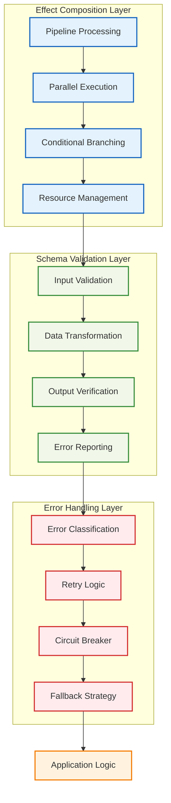
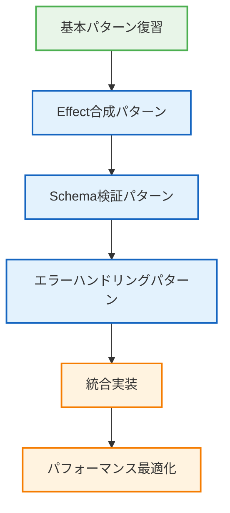

# 🏗️ 高度なパターン

## 🧭 スマートナビゲーション

> **📍 現在位置**: ホーム → 実例集 → 高度なパターン
> **🎯 学習目標**: Effect-TSの応用技法と高度なパターンの習得
> **⏱️ 所要時間**: 45-60分
> **👤 対象**: Effect-TS中級者〜上級者

**Effect-TSの真の力を発揮する、高度なパターンと応用技法を学習しましょう！**

## 🎯 実装例一覧

### ⚡ 01. Effect合成パターン
- **[Effect合成](./01-effect-composition.md)**
  - **学習目標**: 複雑なEffect処理の組み合わせと最適化
  - **実装内容**: パイプライン処理、並列実行、条件分岐の高度な合成
  - **技術要素**: Effect.all、Effect.race、Effect.fork、カスタムオペレーター

### 🔍 02. Schema検証パターン
- **[Schema検証](./02-schema-validation.md)**
  - **学習目標**: 高度なデータ検証とトランスフォーメーション
  - **実装内容**: カスタムバリデーター、条件付き検証、ネストした構造の処理
  - **技術要素**: Schema.extend、Schema.transform、カスタムエラー、パフォーマンス最適化

### 🚨 03. エラーハンドリングパターン
- **[エラーハンドリング](./03-error-handling.md)**
  - **学習目標**: 堅牢なエラー管理とリカバリー戦略
  - **実装内容**: エラー分類、自動リトライ、サーキットブレーカー、フォールバック処理
  - **技術要素**: Cause、Schedule、Metric、カスタムエラー階層

## 💡 アーキテクチャ概要



## 🎯 学習の進め方



## 📋 前提条件

### 🧠 必要な知識
- **Effect-TS基礎**: Effect.gen、Context、Layer、Schema.Structの理解
- **関数型プログラミング**: モナド、ファンクター、純関数の概念
- **TypeScript上級**: 高度な型操作、条件型、テンプレートリテラル型

### 🛠️ 技術スタック
```json
{
  "dependencies": {
    "effect": "^3.17.13",
    "@effect/schema": "^0.75.5",
    "@effect/platform": "^0.90.9"
  },
  "devDependencies": {
    "typescript": "^5.9.2",
    "vitest": "^3.2.4"
  }
}
```

### 📚 推奨事前学習
1. [基本的な使用例](../01-basic-usage/README.md)完了
2. [Effect-TSパターン](../../01-architecture/06-effect-ts-patterns.md)理解
3. [開発規約](../../03-guides/00-development-conventions.md)習得

## 🚀 高度なパターンの特徴

### 🔄 1. Effect合成パターン

```typescript
/**
 * 複雑なワークフロー実装例
 *
 * 🎯 学習ポイント：
 * - パイプライン処理による複雑な処理の組み立て
 * - 並列実行によるパフォーマンス最適化
 * - 条件分岐とエラーハンドリングの統合
 */
const complexMinecraftWorkflow = (playerId: string) =>
  Effect.gen(function* () {
    // 1. 並列でプレイヤー情報と世界情報を取得
    const [player, world, inventory] = yield* Effect.all([
      playerService.getPlayer(playerId),
      worldService.loadWorld(playerId),
      inventoryService.getInventory(playerId)
    ])

    // 2. 条件分岐による処理選択
    const processResult = yield* pipe(
      player,
      Match.value,
      Match.when({ health: (h) => h > 50 }, (p) => normalGameplay(p, world)),
      Match.when({ health: (h) => h > 0 }, (p) => lowHealthGameplay(p, world)),
      Match.orElse((p) => respawnPlayer(p))
    )

    // 3. 結果の後処理と永続化
    return yield* Effect.all([
      playerService.savePlayer(processResult.player),
      worldService.saveWorld(processResult.world),
      inventoryService.saveInventory(processResult.inventory)
    ]).pipe(
      Effect.withSpan("complex-workflow"),
      Effect.timeout("30s")
    )
  })
```

### 🔍 2. Schema検証パターン

```typescript
/**
 * 高度なゲームデータ検証システム
 *
 * 🎯 学習ポイント：
 * - ネストした複雑なデータ構造の検証
 * - カスタムバリデーション規則
 * - パフォーマンス最適化された検証パイプライン
 */
const GameStateSchema = Schema.Struct({
  world: WorldSchema.pipe(
    Schema.refine((world) => world.chunks.length > 0, {
      message: () => "ワールドには最低1つのチャンクが必要です"
    })
  ),
  player: PlayerSchema.pipe(
    Schema.transform(
      Schema.Struct({...PlayerSchema.fields}),
      (player) => ({
        ...player,
        position: normalizePosition(player.position),
        health: Math.max(0, Math.min(100, player.health))
      })
    )
  ),
  metadata: Schema.Record({
    key: Schema.String,
    value: Schema.Union(Schema.String, Schema.Number, Schema.Boolean)
  }).pipe(
    Schema.refine((meta) => Object.keys(meta).length <= 100, {
      message: () => "メタデータのキー数は100以下である必要があります"
    })
  )
})
```

### 🚨 3. エラーハンドリングパターン

```typescript
/**
 * 包括的エラーハンドリング戦略
 *
 * 🎯 学習ポイント：
 * - エラーの分類と適切な処理方法の選択
 * - 自動リトライとサーキットブレーカーの実装
 * - ユーザビリティを重視したエラーメッセージ
 */
const robustGameOperation = <A>(operation: Effect.Effect<A, GameError>) =>
  operation.pipe(
    // 一時的なエラーには自動リトライ
    Effect.retry(
      Schedule.exponential("100ms").pipe(
        Schedule.compose(Schedule.recurs(3)),
        Schedule.whileInput((error: GameError) => error._tag === "NetworkError")
      )
    ),

    // サーキットブレーカーでシステム保護
    Effect.withSpan("game-operation"),

    // フォールバック処理
    Effect.catchAll((error) =>
      Match.value(error).pipe(
        Match.when({ _tag: "NetworkError" }, () =>
          Effect.succeed(getOfflineDefault())
        ),
        Match.when({ _tag: "ValidationError" }, () =>
          Effect.fail(new UserFriendlyError("入力データが正しくありません"))
        ),
        Match.orElse(() =>
          Effect.fail(new CriticalError("予期しないエラーが発生しました"))
        )
      )
    ),

    // メトリクス収集
    Effect.tapErrorCause((cause) =>
      metrics.incrementCounter("game_operation_errors", {
        error_type: Cause.isFailure(cause) ? cause.error._tag : "unknown"
      })
    )
  )
```

## 💡 実装における重要なポイント

### 🚀 1. パフォーマンス最適化

```typescript
// ✅ 並列処理によるレイテンシー削減
const optimizedDataLoading = Effect.all([
  loadPlayerData(playerId),
  loadWorldData(worldId),
  loadInventoryData(playerId)
])

// ✅ 適切なタイムアウト設定
const timedOperation = operation.pipe(
  Effect.timeout("5s"),
  Effect.catchTag("TimeoutException", () => fallbackOperation)
)

// ✅ リソースの効率的管理
const managedResource = Effect.acquireUseRelease(
  acquireResource,
  useResource,
  releaseResource
)
```

### 🔒 2. 型安全性の最大化

```typescript
// ✅ 厳密な型制約
type SafeGameState<T extends GameEntityType> = {
  readonly entity: GameEntity<T>
  readonly validation: Schema.Schema<GameEntity<T>>
  readonly operations: GameOperations<T>
}

// ✅ エラーの型階層
abstract class GameError extends Schema.TaggedError<GameError>() {
  abstract readonly code: string
  abstract readonly userMessage: string
  abstract readonly technicalDetails?: string
}
```

### 🔧 3. 拡張性の確保

```typescript
// ✅ プラグイン可能なアーキテクチャ
interface GamePlugin<Config = unknown> {
  readonly name: string
  readonly initialize: (config: Config) => Effect.Effect<void, PluginError>
  readonly dispose: () => Effect.Effect<void, never>
}

// ✅ 設定可能なワークフロー
const configurableWorkflow = <A, E>(
  steps: ReadonlyArray<WorkflowStep<A, E>>
) =>
  steps.reduce(
    (workflow, step) => workflow.pipe(Effect.flatMap(step.execute)),
    Effect.succeed(initialState)
  )
```

## 🎯 期待される学習効果

この高度なパターン実装を通じて、以下の能力を習得できます：

### 📈 技術的スキル
- **Effect-TS熟達**: 高度な合成パターンと最適化技法
- **型システム活用**: TypeScriptの型システムを最大限活用した安全な実装
- **パフォーマンス最適化**: 大規模アプリケーションでの性能要件達成

### 🏗️ アーキテクチャ設計
- **システム設計**: 拡張可能で保守可能なアーキテクチャ構築
- **エラー戦略**: 堅牢なエラーハンドリングとリカバリー戦略
- **品質保証**: テスト容易性と信頼性を重視した設計

### 💼 プロフェッショナルスキル
- **コード品質**: プロダクションレベルのコード品質基準
- **チーム協働**: 大規模開発チームでの協働に適した実装パターン
- **技術リーダーシップ**: チーム内での技術的指導力

## 🔗 関連セクション

### 📖 理論的基盤
- [Effect-TSパターン](../../01-architecture/06-effect-ts-patterns.md)
- [開発規約](../../03-guides/00-development-conventions.md)
- [テスト戦略](../../03-guides/05-comprehensive-testing-strategy.md)

### 🛠️ 実践的応用
- [統合例](../03-integration-examples/README.md)
- [パフォーマンス最適化](../04-performance-optimization/README.md)

### 📚 発展的学習
- [パターンカタログ](../../07-pattern-catalog/README.md)
- [アーキテクチャガイド](../../01-architecture/README.md)

---

**🎯 高度なパターンは「知識」ではなく「実践」で身につけます。**
**実際に手を動かして、Effect-TSの真の力を体感しましょう！**